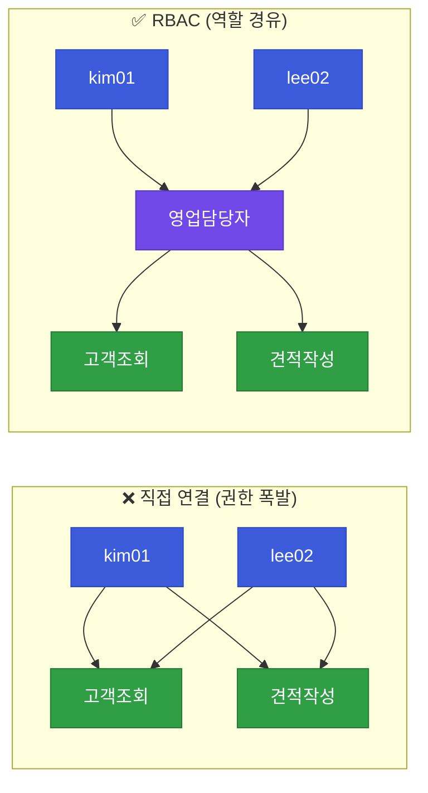

# 【파일럿】 3과목 Day1 · 강의1 — 계정·권한·역할·그룹과 RBAC 구현 (앞부분)

!!! warning "이건 3·4·5과목용 '깊은 형식' 파일럿입니다"
    3·4·5과목은 코드 비중이 높고 촘촘한 이해가 필요해, 2과목보다 **더 깊고·쉽고·자세하게** 만든 시험판입니다.
    새로 들어간 장치: 💻 **코드 한 줄씩 해부** · 📘🎓 **학습자/강사 이중 뷰** · 🧱 **파이썬 브릿지** · 🧠 **파인만 자가진단**.
    이 형식이 괜찮은지 봐주세요. (00-20 / 20-45 / 45-70분 = 코드가 처음 나오는 데까지)

> **이 교시 한 문장:** "누가 무엇에 접근할 수 있는가"를 **역할(Role, 롤)**로 묶어 관리하는 **RBAC(알백)**을, 개념부터 **파이썬 코드 한 줄까지** 이해합니다.

| 시간 | 소주제 | 핵심 한 줄 |
|------|--------|-----------|
| 00-20분 | 왜 접근통제인가 (1·2과목 복습) | 인증(누구) 다음은 인가(무엇을) |
| 20-45분 | 계정·권한·역할·그룹 & RBAC 원리 | 사람↔권한 직접 연결을 끊고 '역할'을 중간에 |
| 45-70분 | RBAC 데이터 구조 & `has_permission()` | 딕셔너리로 표현하고 함수로 확인 |

---

## ⏱️ 00-20분 · 왜 접근통제가 필요한가 (1·2과목 복습)

!!! info "📘 학습자 뷰 · 처음 보는 나"
    **접근통제(Access Control, 액세스 컨트롤)** = "누가(사용자) 무엇에(자원) 접근할 수 있는지를 정하고 지키는 것"입니다.
    회사에 문서·시스템이 많은데 **아무나 다 열 수 있으면 위험**하죠. 그래서 "이 사람은 이것까지만"을 정합니다.

    한 가지 헷갈리기 쉬운 짝:

    - **인증(Authentication, 어센티케이션)** = "너 진짜 김철수 맞아?" → **누구인지 확인** (로그인·MFA)
    - **인가/접근통제(Authorization, 오소라이제이션)** = "김철수는 이 문서를 열 수 있어?" → **무엇을 할 수 있나 확인**

    2과목 Zero Trust의 **ID 축**이 '인증(누구)'이었다면, 오늘부터는 그 다음 단계인 **'인가(무엇을)'를 코드로** 관리합니다.

!!! example "🎓 강사 뷰 · 가르치는 나"

    - **도입 멘트:** *"2과목에서 '아무도 기본 신뢰하지 말고 매번 검증하자(ZT)'를 배웠죠. 그럼 '검증'에서 **무엇을 확인**할까요? '이 사람이 이 자원에 접근할 자격이 있나'입니다. 오늘 그걸 코드로 만듭니다."*
    - **예상 질문 & 답:**
        - *"인증이랑 접근통제랑 같은 거 아니에요?"* → 아니요. 인증은 **신원 확인**(문을 열 자격이 있는 사람인가), 접근통제는 **권한 확인**(그 사람이 이 방에 들어갈 수 있나). 로그인은 됐어도 특정 문서는 못 볼 수 있습니다.
        - *"2과목에서 PDP/PEP(피디피/펩) 배웠는데 그거랑 뭐가 달라요?"* → 오늘 만드는 게 바로 **PDP를 코드로 구현**하는 겁니다(강의2에서 `evaluate_access()`로 연결).
    - **시간 배분:** 이 20분은 '왜'를 심는 시간. 코드는 아직. 복습 5분 + 인증/인가 구분 10분 + 오늘 목표 5분.

!!! question "확인질문"
    **Q. 2과목에서 배운 ZT의 ID 축과 오늘 배울 접근통제는 어떻게 연결될까요?**

    **A.** ID 축은 **'누구인지 인증'**(김철수 맞나), 접근통제는 그 다음 **'무엇을 할 수 있는지 인가'**입니다. ZT는 "인증된 사용자라도 자원마다 권한을 매번 확인"하는데, 그 '권한 확인'을 구현하는 게 오늘의 접근통제(RBAC)입니다.

<div class="quiz">
<p class="quiz-q"><span class="tag">퀴즈</span><b>로그인(인증)에 성공한 직원이 특정 인사 문서만 못 여는 상황을 가장 잘 설명한 것은?</b></p>
<button class="quiz-opt">인증이 실패했으므로 다시 로그인해야 한다</button>
<button class="quiz-opt" data-correct>인증(누구인지)은 됐지만, 그 문서에 대한 인가(접근 권한)가 없기 때문이다</button>
<button class="quiz-opt">네트워크 연결이 끊겼기 때문이다</button>
<button class="quiz-opt">비밀번호가 틀렸기 때문이다</button>
<div class="quiz-explain"><b>정답: 2번.</b> 인증(로그인)과 인가(접근 권한)는 별개입니다. 로그인은 됐어도 그 자원에 대한 권한이 없으면 막힙니다. 이게 접근통제의 핵심입니다.</div>
<button class="quiz-retry">다시 풀기</button>
</div>

---

## ⏱️ 20-45분 · 계정·권한·역할·그룹과 RBAC 원리

!!! info "📘 학습자 뷰 · 처음 보는 나"
    네 단어부터 정리합니다.

    - **계정(Account, 어카운트)** = 누구 (예: `kim01`)
    - **권한(Permission, 퍼미션)** = 무엇을 할 수 있나 (예: `고객정보_조회`)
    - **역할(Role, 롤)** = 권한을 묶은 꾸러미 (예: '영업담당자' = 고객정보_조회 + 견적서_작성)
    - **그룹(Group, 그룹)** = 계정을 묶은 것 (예: '영업팀' = kim01, lee02 …)

    **RBAC(알백, Role-Based Access Control, 역할 기반 접근통제)**의 핵심 아이디어:
    사람에게 권한을 **직접** 주지 않고, **역할**을 중간에 둡니다.

    ```
    계정(kim01) → 역할(영업담당자) → 권한(고객정보_조회, 견적서_작성)
    ```

!!! example "🎓 강사 뷰 · 가르치는 나"

    - **비유로 설명:** *"권한을 사람마다 일일이 주면, 직원 100명이면 100번 관리해야 합니다. 대신 '**직책(역할)**'에 권한을 묶어두고 사람에겐 직책만 주면, 직책 하나만 고쳐도 그 직책의 100명이 한 번에 바뀝니다."*
    - **예상 질문 & 답:**
        - *"역할이랑 그룹이 뭐가 달라요?"* → **역할=권한 묶음**(무엇을 할 수 있나), **그룹=사람 묶음**(누구누구). 헷갈리기 쉬우니 "역할은 권한 쪽, 그룹은 사람 쪽"으로 못 박아 주세요.
        - *"왜 굳이 중간 단계를 둬요? 복잡한데."* → 규모가 커질수록 이득입니다. 5명이면 직접이 편하지만, 500명·부서이동 잦으면 역할이 압도적으로 편합니다.
    - **시연 포인트:** 부서이동 시나리오를 꼭 보여주세요 — "kim01이 영업→재무로 가면? **역할 매핑 한 줄만** 바꾸면 권한이 통째로 갱신." 이게 RBAC의 '아하 포인트'입니다.

### 🔬 깊이 보기 — 왜 '역할'이라는 중간 단계가 관리를 살리나



왼쪽(직접 연결)은 사람×권한만큼 선이 폭발합니다. 오른쪽(RBAC)은 **역할이 허브**라, 권한을 바꾸려면 ==역할 하나만== 고치면 그 역할을 가진 모두에게 적용됩니다.

!!! question "확인질문"
    **Q. 직원이 부서를 이동했을 때, RBAC 구조에서는 무엇 하나만 바꾸면 권한이 전부 갱신될까요?**

    **A.** 그 직원의 **역할 매핑(user→role)** 하나만 바꾸면 됩니다. 예: `kim01`의 역할을 '영업담당자'에서 '재무담당자'로 바꾸면, 옛 권한은 사라지고 새 역할의 권한이 통째로 적용됩니다. 권한을 하나하나 회수·부여할 필요가 없습니다.

<div class="quiz">
<p class="quiz-q"><span class="tag">퀴즈</span><b>직원 수백 명 환경에서 권한을 '역할(Role)'을 통해 관리하는 것이 직접 부여보다 나은 이유로 가장 적절한 것은?</b></p>
<button class="quiz-opt">역할을 쓰면 비밀번호를 안 만들어도 되기 때문</button>
<button class="quiz-opt">역할이 있으면 인증을 생략할 수 있기 때문</button>
<button class="quiz-opt" data-correct>권한을 역할에 묶어두면, 역할 하나만 고쳐도 그 역할을 가진 모든 사람에게 한 번에 반영돼 관리가 쉽기 때문</button>
<button class="quiz-opt">역할이 많을수록 시스템이 빨라지기 때문</button>
<div class="quiz-explain"><b>정답: 3번.</b> RBAC의 이득은 '한 번 고치면 다 반영'되는 관리 효율입니다. 사람마다 직접 권한을 주면 인원수만큼 관리 지점이 늘어납니다. 인증(1·2번)과는 무관합니다.</div>
<button class="quiz-retry">다시 풀기</button>
</div>

---

## ⏱️ 45-70분 · RBAC 데이터 구조 설계와 `has_permission()` 구현

!!! abstract "이 블록을 마치면"
    ✔ RBAC을 딕셔너리로 표현하고 ✔ ==`has_permission()`을 한 줄씩 설명·실행==할 수 있다

### 🧱 파이썬 브릿지 — 이 코드에 필요한 파이썬 (미리 5분)

이 함수를 이해하려면 파이썬 4가지만 알면 됩니다(1과목 복습).

| 문법 | 뜻 | 예시 |
|------|-----|------|
| `dict` `{키: 값}` | 이름표로 값을 찾는 상자 | `{'kim01': ['영업담당자']}` |
| `list` `[a, b]` | 순서 있는 목록 | `['고객조회', '견적작성']` |
| `dict.get(키, 기본값)` | 키가 없으면 **에러 대신 기본값** 반환 | `d.get('없는키', [])` → `[]` |
| `x in 목록` | 목록에 x가 있나? (True/False) | `'고객조회' in ['고객조회']` → `True` |

> ==`.get(키, [])`이 핵심==입니다. 없는 사용자를 조회해도 **에러 없이 빈 목록**을 주기 때문에 코드가 안전해집니다.

### 데이터 구조 — 딕셔너리로 표현

```python
# 역할 → 그 역할이 가진 권한 목록
roles = {'영업담당자': ['고객정보_조회', '견적서_작성']}

# 사용자 → 그 사용자가 가진 역할 목록
user_roles = {'kim01': ['영업담당자']}
```

'누가(user_roles) → 어떤 역할 → 무슨 권한(roles)'을 딕셔너리 두 개로 나눠 표현했습니다.

### 💻 코드 완전 해부 — `has_permission()` 한 줄씩

```python
def has_permission(user, permission, roles, user_roles):
    for role in user_roles.get(user, []):        # ①
        if permission in roles.get(role, []):    # ②
            return True                          # ③
    return False                                 # ④
```

| 줄 | 이 줄이 하는 일 | 왜 이렇게 |
|:--:|----------------|-----------|
| `def ...` | user·permission과 두 데이터(roles·user_roles)를 받는 함수 정의 | 데이터를 밖에서 넘겨받아 재사용·테스트가 쉬움 |
| **①** | 이 **사용자의 역할 목록**을 꺼내 하나씩 순회 | `.get(user, [])`라 **없는 사용자면 빈 목록** → 에러 없이 그냥 반복 안 함 |
| **②** | 그 역할이 가진 **권한 목록에 찾는 권한이 있나** 확인 | `.get(role, [])`로 정의 안 된 역할도 안전 처리 |
| **③** | 있으면 **즉시 `True` 반환**(더 볼 필요 없음) | 하나라도 찾으면 접근 허용이므로 조기 종료 |
| **④** | 모든 역할을 다 봐도 없으면 **`False`** | "권한 없음"이 기본값(default deny 사고와 연결) |

!!! warning "🎓 강사 뷰 · 이 줄을 바꾸면? (자주 나오는 질문)"

    - **`user_roles.get(user, [])`를 `user_roles[user]`로 바꾸면?** → 없는 사용자를 조회할 때 **`KeyError`(키에러 = 없는 키를 찾을 때 나는 에러)로 프로그램이 멈춥니다.** `.get`은 그걸 막아주는 안전장치입니다. → 학생이 `[]` 대괄호로 짜서 에러 내는 일이 흔하니 미리 짚어 주세요.
    - **③ `return True`를 빼면?** → 찾아도 멈추지 않고 계속 돌다 결국 `False`를 반환해 버려, **권한이 있어도 없다고 나옵니다.**

### ▶️ 직접 실행해보기 (강사가 먼저 돌려볼 것)

```python
roles = {'영업담당자': ['고객정보_조회', '견적서_작성']}
user_roles = {'kim01': ['영업담당자']}

has_permission('kim01', '고객정보_조회', roles, user_roles)   # → True   (역할에 그 권한 있음)
has_permission('kim01', '급여_수정',   roles, user_roles)   # → False  (역할에 그 권한 없음)
has_permission('없는사람', '고객정보_조회', roles, user_roles) # → False  (.get 덕분에 에러 아님!)
```

!!! question "확인질문"
    **Q. `user_roles`에 없는 사용자로 조회하면 `has_permission()`은 어떤 값을 반환할까요?**

    **A.** **`False`**를 반환합니다(에러가 아니라). ① 줄의 `user_roles.get(user, [])`가 없는 사용자에겐 **빈 목록 `[]`**을 주므로, `for` 반복이 한 번도 안 돌고 마지막 ④ 줄의 `return False`로 갑니다. "모르는 사람은 권한 없음"이라는 안전한 기본 동작입니다.

<div class="quiz">
<p class="quiz-q"><span class="tag">퀴즈</span><b><code>has_permission()</code>에서 <code>user_roles.get(user, [])</code> 대신 <code>user_roles[user]</code>를 쓰면 생기는 문제로 가장 적절한 것은?</b></p>
<button class="quiz-opt">권한이 있는 사용자도 항상 False가 나온다</button>
<button class="quiz-opt">함수가 두 배로 느려진다</button>
<button class="quiz-opt" data-correct>user_roles에 없는 사용자를 조회하면 KeyError가 발생해 프로그램이 멈춘다</button>
<button class="quiz-opt">모든 사용자가 True로 처리된다</button>
<div class="quiz-explain"><b>정답: 3번.</b> `dict[없는키]`는 KeyError를 냅니다. `.get(키, [])`는 없을 때 빈 목록을 돌려줘 에러를 막고, "모르는 사용자는 권한 없음(False)"으로 안전하게 처리합니다.</div>
<button class="quiz-retry">다시 풀기</button>
</div>

!!! tip "🧠 파인만 자가진단 — 내가 진짜 아는가?"
    아래를 **안 보고 소리 내어** 말할 수 있으면 이 블록을 이해한 것입니다.

    1. RBAC의 세 단계(계정→역할→권한)를 **비유로** 설명하기
    2. `has_permission()`이 `True`를 언제, `False`를 언제 반환하는지 **한 문장으로**
    3. `.get(user, [])`이 없으면 무슨 일이 생기는지, **왜 쓰는지**
    > 하나라도 막히면 그 부분을 다시 봅니다. "설명할 수 있다 = 안다"입니다.

---

## ✅ 여기까지(파일럿) 가르칠 준비 체크리스트

- [ ] 인증 vs 인가(접근통제)를 예로 구분한다
- [ ] RBAC의 계정→역할→권한 구조를 비유로 설명한다
- [ ] 부서이동 시 '역할 매핑 하나'만 바꾸면 됨을 시연으로 보인다
- [ ] `has_permission()`을 **한 줄씩** 설명하고 직접 실행해 보인다
- [ ] `.get(키, 기본값)`이 왜 안전한지 설명한다
- [ ] 확인질문 3개 + 퀴즈 3개에 답한다

*[RBAC]: Role-Based Access Control — 역할 기반 접근통제
*[PDP]: Policy Decision Point — 접근을 판단하는 정책 결정점(강의2에서 코드로 구현)
