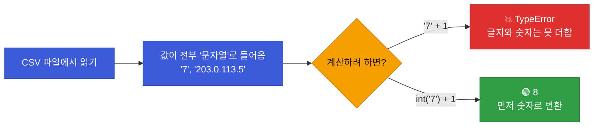

# 강의1 · 개발환경과 변수·기본 자료형 (오전, 총 120분)

> **이 교시 한 문장:** 파이썬을 설치·실행할 환경을 갖추고, **변수(값을 담는 상자)** 와 **자료형(값의 종류)** 을 익혀, 값을 담고·꺼내고·형태를 바꾸는 가장 기본 동작을 손에 익힙니다.

| 시간 | 소주제 | 핵심 한 줄 |
|------|--------|-----------|
| 00-15분 | 과정 로드맵 | 8일이 어디로 가는지 |
| 15-35분 | 개발환경 설치 (Python·VS Code) | 코드를 쓰고 돌릴 도구 |
| 35-55분 | 가상환경(venv)·폴더 구조 | 프로젝트를 격리 |
| 55-80분 | 변수와 기본 자료형 | 값을 담고 종류를 안다 |
| 80-105분 | 리스트와 딕셔너리 | 여러 값을 묶는 두 방법 |
| 105-120분 | 연산자와 형변환 | 계산하고 형태를 바꾼다 |

## 이 교시에 나오는 어려운 용어

| 용어 (한글발음) | 한 줄 뜻 (아주 쉽게) | 비유 |
|----------------|----------------------|------|
| **변수(variable, 베리어블)** | 값을 담아 이름 붙인 상자 | 이름표 붙인 서랍 |
| **자료형(data type, 데이터 타입)** | 값의 종류(숫자·글자 등) | 물건의 종류 |
| **정수(int, 인트)** | 소수점 없는 숫자 | 3, -7, 0 |
| **실수(float, 플롯)** | 소수점 있는 숫자 | 3.14, 0.5 |
| **문자열(str, 스트링)** | 글자 데이터 | 'kim01' |
| **불(bool, 불리언)** | 참(True)/거짓(False) | 예/아니오 |
| **f-string(에프 스트링)** | 값을 글자 안에 끼워넣기 | 빈칸 채우기 |
| **리스트(list, 리스트)** | 순서 있는 값의 묶음 | 장보기 목록 |
| **딕셔너리(dict, 딕셔너리)** | 이름표(키)로 값을 찾는 묶음 | 전화번호부 |
| **가상환경(venv, 브이엔브이)** | 프로젝트별 독립 도구 상자 | 프로젝트 전용 작업대 |
| **형변환(type casting)** | 값의 종류를 바꿈 | 글자'7'→숫자7 |
| **주석(comment, 코멘트)** | 실행 안 되는 설명 글 | 코드 옆 메모 |

---

## ⏱️ 00-15분 · 과정 로드맵

!!! info "📘 학습자 뷰 · 처음 보는 나"
    1과목 8일은 **"파이썬으로 자동화하는 힘"** 을 차곡차곡 쌓습니다.

    - **Day1~3:** 파이썬 문법 기초 (변수·제어문 → 함수·파일 → 자료구조·JSON·정규식)
    - **Day4~5:** 바깥 세상과 연결 (API 호출 → Webhook·자동화·스케줄링)
    - **Day6~8:** AI 붙이기 (LLM·프롬프트 → 보고서 자동생성 → 전체 통합)

    오늘(Day1)은 그 첫 벽돌 — **변수·자료형·조건문·반복문** 입니다. 지루해 보여도, 이게 튼튼해야 뒤가 쉬워집니다.

!!! example "🎓 강사 뷰 · 도입 멘트"
    *"오늘 배우는 건 '너무 기본'이라 넘기고 싶겠지만, 8일 내내 이걸 씁니다. 변수·if·for는 프로그래밍의 알파벳이에요. 알파벳을 확실히 하면 단어도 문장도 쉬워집니다."*

---

## ⏱️ 15-35분 · 개발환경 설치 (Python · VS Code)

!!! info "📘 학습자 뷰 · 처음 보는 나"
    코드를 쓰고 돌리려면 두 가지가 필요합니다.

    - **Python(파이썬):** 코드를 실행하는 엔진. [python.org](https://www.python.org)에서 설치.
    - **VS Code(브이에스 코드):** 코드를 쓰는 편집기(에디터). 무료.

    설치 후 터미널에서 이렇게 확인합니다.

```text
$ python --version
Python 3.12.0
```

!!! tip "🐍 문법 상자 — 파이썬 코드를 실행하는 3가지 방법"
    | 방법 | 어떻게 | 언제 |
    |------|--------|------|
    | **대화형(REPL)** | 터미널에 `python` 입력 후 한 줄씩 | 잠깐 실험 |
    | **파일 실행** | `python myfile.py` | 완성된 스크립트 |
    | **노트북(Jupyter)** | 셀 단위로 실행 | 배우고 실험할 때 |

    > 예습·학습에는 **노트북(Jupyter)** 이 좋습니다. "값 하나 바꿔서 다시 실행"이 쉬워, 문법을 손으로 익히기 좋아요.

!!! warning "🎓 강사 뷰 · 설치 단계에서 학생이 자주 막히는 곳"
    - **`python`이 안 먹힘** → `python3`로 시도(맥·리눅스). 설치 시 "Add to PATH" 체크 누락(윈도우).
    - **버전이 2.x** → 반드시 **3.x**를 씁니다. 이 과정은 3.10+ 기준.
    - 설치 30분은 넉넉히 잡으세요. 여기서 막히면 하루가 밀립니다.

!!! question "확인질문"
    **Q. 터미널에 `python --version`을 쳤을 때 나오는 숫자는 무엇을 알려줄까요?**

    **A.** **설치된 파이썬의 버전**을 알려줍니다.

    예를 들어 `Python 3.12.0`이 나오면 파이썬 3.12 버전이 정상 설치돼 실행 준비가 됐다는 뜻입니다. 만약 `Python 2.x`가 나오거나 "명령을 찾을 수 없다"는 오류가 나오면, 이 과정에 필요한 파이썬 3.x가 제대로 설치·연결되지 않은 것이므로 설치나 PATH 설정을 다시 확인해야 합니다.

---

## ⏱️ 35-55분 · 가상환경(venv)과 프로젝트 폴더 구조

!!! info "📘 학습자 뷰 · 처음 보는 나"
    **가상환경(venv)** = 프로젝트마다 **독립된 도구 상자**입니다. 왜 필요할까요?

    프로젝트 A는 어떤 라이브러리의 1.0 버전이, 프로젝트 B는 2.0 버전이 필요할 수 있습니다. 한 컴퓨터에 다 깔면 **충돌**하죠. 가상환경은 프로젝트마다 따로 상자를 둬서 이 충돌을 막습니다.

```text
$ python -m venv venv          # venv라는 이름의 가상환경 생성
$ source venv/bin/activate     # 활성화 (맥·리눅스)
$ venv\Scripts\activate        # 활성화 (윈도우)
(venv) $                       # 앞에 (venv)가 붙으면 성공
```

!!! tip "🐍 문법 상자 — `python -m venv venv` 뜯어보기"
    - `python` : 파이썬 실행
    - `-m venv` : venv라는 **모듈(기능)** 을 실행하라
    - `venv` (마지막) : 만들 가상환경 **폴더 이름** (관습적으로 venv)

    > 즉 "파이썬아, venv 기능으로 venv라는 폴더를 만들어줘"입니다. 이름은 아무거나 되지만 관습상 `venv`.

이번 과정 폴더 구조:

```text
security-agent-toolkit/       # 최상위 프로젝트 폴더
├── agent_core/               # 1과목 코드 (공통 기반)
├── config/                   # 설정값 분리 (임계값 등)
├── docs/                     # 문서
└── venv/                     # 가상환경
```

!!! example "🎓 강사 뷰 · 폴더가 곧 과목"
    *"agent_core(1과목)를 시작으로, 2과목은 network_zt, 3과목 access_control, 4과목 anomaly_detection 폴더가 쌓입니다. 오늘 만든 폴더 하나가 캡스톤까지 이어져요. '설정은 config에 따로' 습관도 오늘부터."*

!!! question "확인질문"
    **Q. 가상환경(venv)을 프로젝트마다 따로 만드는 이유는 무엇일까요?**

    **A.** **프로젝트마다 필요한 라이브러리 버전이 달라, 한곳에 섞으면 충돌하기 때문**입니다.

    프로젝트 A는 어떤 도구의 1.0 버전이, 프로젝트 B는 2.0 버전이 필요할 수 있습니다. 컴퓨터 전체에 하나로 깔면 버전이 서로 부딪혀 오류가 납니다. 가상환경은 프로젝트마다 독립된 도구 상자를 만들어, 각 프로젝트가 자기에게 맞는 버전을 따로 쓸 수 있게 해 충돌을 막습니다.

<div class="quiz">
<p class="quiz-q"><span class="tag">퀴즈</span><b>가상환경(venv)을 사용하는 핵심 이유로 가장 적절한 것은?</b></p>
<button class="quiz-opt">코드 실행 속도를 빠르게 하려고</button>
<button class="quiz-opt" data-correct>프로젝트마다 라이브러리 버전을 독립적으로 관리해 충돌을 막으려고</button>
<button class="quiz-opt">파이썬 문법을 자동으로 고쳐주려고</button>
<button class="quiz-opt">인터넷 없이 코드를 쓰려고</button>
<div class="quiz-explain"><b>정답: 2번.</b> venv는 프로젝트별 독립 도구 상자입니다. A는 버전 1.0, B는 2.0이 필요할 때 서로 충돌하지 않게 격리합니다. 속도·문법과는 무관합니다.</div>
<button class="quiz-retry">다시 풀기</button>
</div>

---

## ⏱️ 55-80분 · 변수와 기본 자료형

!!! abstract "이 블록을 마치면"
    ✔ 변수에 값을 담고 ✔ 네 가지 기본 자료형을 구분하고 ✔ ==f-string으로 값이 섞인 문자열==을 만든다

### 🐍 문법 상자 — 변수: 값을 담는 상자

!!! tip "🐍 변수 선언 — 파이썬은 타입을 안 쓴다"
    ```python
    customer_name = 'A사'      # 문자열을 customer_name 상자에 담기
    failed_count = 7           # 숫자를 failed_count 상자에 담기
    ```

    - `=` 는 "같다"가 아니라 **"오른쪽 값을 왼쪽 상자에 담아라"**(대입)입니다.
    - 다른 언어와 달리 **`int`, `String` 같은 타입을 안 씁니다.** 파이썬이 값을 보고 알아서 판단해요.
    - 변수 이름 규칙: 영문 소문자+`_`(밑줄), 숫자는 맨 앞 불가. 의미가 드러나게(`x`보다 `failed_count`).

### 🐍 문법 상자 — 네 가지 기본 자료형

!!! tip "🐍 int · float · str · bool"
    ```python
    count = 7            # int   (정수: 소수점 없는 숫자)
    ratio = 0.18         # float (실수: 소수점 있는 숫자)
    user = 'kim01'       # str   (문자열: 따옴표로 감싼 글자)
    is_alert = True      # bool  (불: True 또는 False, 첫 글자 대문자!)
    ```

    | 자료형 | 뜻 | 예 | 조심할 점 |
    |--------|-----|----|-----------|
    | `int` | 정수 | `7`, `-3` | 따옴표 없음 |
    | `float` | 실수 | `0.18` | 소수점 포함 |
    | `str` | 문자열 | `'kim01'` | **따옴표 필수** |
    | `bool` | 참/거짓 | `True`, `False` | **첫 글자 대문자** |

    > 흔한 실수: `'7'`(문자열)과 `7`(숫자)은 **다릅니다.** `true`(소문자)는 에러, `True`라야 합니다.

### 💻 코드 조각 — `type()`으로 자료형 확인

```python
count = 7
user = 'kim01'
is_alert = True

print(type(count))     # <class 'int'>   숫자구나
print(type(user))      # <class 'str'>   글자구나
print(type(is_alert))  # <class 'bool'>  참거짓이구나
```

`type(값)`은 그 값의 **자료형을 알려주는** 함수입니다. "이 값이 숫자야 글자야?"가 헷갈릴 때 확인용으로 씁니다.

### 🐍 문법 상자 — f-string: 값을 글자에 끼워넣기

!!! tip "🐍 f-string (가장 많이 쓰는 문자열 문법!)"
    ```python
    customer_name = 'A사'
    failed_count = 7
    is_alert = failed_count > 5     # 7 > 5 이므로 True

    # 따옴표 앞에 f를 붙이고, {} 안에 변수를 넣으면 값이 끼워짐
    print(f'{customer_name} 고객사 - 실패 {failed_count}건, 경보: {is_alert}')
    # 출력: A사 고객사 - 실패 7건, 경보: True
    ```

    - **`f'...'`** : 따옴표 앞의 `f`가 "이 안에 `{}`가 있으면 값으로 바꿔라"는 표시.
    - `{failed_count}` : 중괄호 안의 변수가 그 값(7)으로 교체됩니다.
    - f-string은 **로그 메시지·리포트** 만들 때 계속 쓰는 핵심 문법입니다. 확실히 익히세요.

!!! example "🎓 강사 뷰 · f-string을 왜 강조하나"
    *"f-string은 8일 내내, 2~4과목에서도 계속 나옵니다. `'A사 고객사 - 실패 ' + str(failed_count) + '건'`처럼 `+`로 잇는 옛 방식보다 훨씬 읽기 쉽죠. 학생이 이거 하나만 확실히 해도 코드가 깔끔해집니다."*

!!! question "확인질문"
    **Q. `is_alert` 변수의 값은 bool 타입인데, 이 값을 그대로 `if` 조건문에 쓸 수 있을까요?**

    **A.** **네, 그대로 쓸 수 있습니다.**

    `is_alert = failed_count > 5`처럼 비교의 결과는 `True` 또는 `False`인 bool 값입니다. `if`는 원래 참/거짓을 판단하는 문법이므로, `if is_alert:`라고 쓰면 `is_alert`가 `True`일 때 실행됩니다. 즉 bool 값은 `if`가 바로 이해할 수 있는 형태라, `if is_alert == True`처럼 굳이 비교하지 않고 `if is_alert:`만으로 충분합니다.

<div class="quiz">
<p class="quiz-q"><span class="tag">퀴즈</span><b>다음 중 <b>문자열(str)</b>인 것은?</b></p>
<button class="quiz-opt"><code>7</code></button>
<button class="quiz-opt"><code>True</code></button>
<button class="quiz-opt" data-correct><code>'7'</code></button>
<button class="quiz-opt"><code>0.18</code></button>
<div class="quiz-explain"><b>정답: 3번.</b> 따옴표로 감싼 `'7'`은 숫자가 아니라 글자(문자열)입니다. `7`은 int, `0.18`은 float, `True`는 bool. 따옴표 유무가 숫자와 글자를 가릅니다 — 형변환에서 이 차이가 자주 문제를 일으킵니다.</div>
<button class="quiz-retry">다시 풀기</button>
</div>

---

## ⏱️ 80-105분 · 리스트와 딕셔너리 기초

!!! abstract "이 블록을 마치면"
    ✔ 여러 값을 묶는 두 방법(순서 vs 이름표)을 구분하고 ✔ ==값을 안전하게 꺼내는 법(`.get`)==을 안다

### 🐍 문법 상자 — 리스트: 순서 있는 값의 묶음

!!! tip "🐍 list `[ ]`"
    ```python
    users = ['kim01', 'lee02', 'park03']   # 대괄호로 감싸고 쉼표로 구분

    print(users[0])        # kim01   ← 첫 번째 (0부터 센다!)
    print(users[2])        # park03  ← 세 번째
    print(len(users))      # 3       ← 개수
    users.append('choi04') # 맨 뒤에 추가
    print(users)           # ['kim01', 'lee02', 'park03', 'choi04']
    ```

    - **순서가 있습니다.** 그래서 `[0]`, `[1]`처럼 **번호(인덱스)로** 꺼냅니다.
    - ⚠️ **번호는 0부터** 시작! 첫 번째가 `[1]`이 아니라 `[0]`입니다(흔한 실수).
    - `.append(값)` : 맨 뒤에 값 추가. `len(리스트)` : 개수.

### 🐍 문법 상자 — 딕셔너리: 이름표(키)로 찾는 묶음

!!! tip "🐍 dict `{ 키: 값 }`"
    ```python
    log_event = {                       # 중괄호, '키': 값 쌍을 쉼표로
        'customer': 'A사',
        'user': 'kim01',
        'event': 'login_failed',
        'ip': '203.0.113.5',
    }

    print(log_event['event'])   # login_failed  ← 이름표(키)로 꺼냄
    print(log_event.keys())     # 모든 키
    print(log_event.values())   # 모든 값
    ```

    - **순서가 아니라 이름표(키)로** 찾습니다. `[0]`이 아니라 `['event']`.
    - 로그 한 줄처럼 "항목마다 이름이 있는" 데이터에 딱 맞습니다.
    - 주요 메서드: `.keys()`(키들), `.values()`(값들), `.items()`(키·값 쌍들).

### 💻 코드 조각 — 리스트 vs 딕셔너리, 언제 뭘 쓰나

```python
# 리스트: 같은 종류가 여러 개, 순서가 의미 있을 때
ip_list = ['203.0.113.5', '203.0.113.8']    # IP들의 목록

# 딕셔너리: 항목마다 이름(키)이 다를 때
one_log = {'user': 'kim01', 'ip': '203.0.113.5'}   # 로그 한 줄
```

> **구분법:** "kim01, lee02… 같은 걸 줄 세운다" → **리스트**. "user는 이거, ip는 저거처럼 이름표가 다르다" → **딕셔너리**.

### 🐍 문법 상자 — `[키]` vs `.get(키)`: 없는 키를 만났을 때

!!! tip "🐍 안전하게 꺼내는 `.get()`"
    ```python
    log = {'user': 'kim01', 'event': 'login_failed'}

    print(log['user'])          # kim01
    print(log['country'])       # 💥 KeyError! (country 키가 없음 → 에러로 멈춤)

    print(log.get('country'))         # None   (에러 대신 '없음')
    print(log.get('country', '미상'))  # 미상   (없으면 이 기본값)
    ```

    - `log['country']` : 키가 없으면 **KeyError로 프로그램이 멈춥니다.**
    - `log.get('country')` : 키가 없으면 **에러 없이 `None`**.
    - `log.get('country', '미상')` : 없으면 **정한 기본값**.

    > 실무 데이터엔 빠진 필드가 흔합니다. **불확실하면 `.get()`** 이 안전합니다. (2~4과목에서 계속 나옴)

!!! question "확인질문"
    **Q. `log_event['event']` 대신 `log_event.get('event')`를 쓰면 어떤 상황에서 더 안전할까요?**

    **A.** **그 키가 없을 수도 있는 상황**에서 더 안전합니다.

    `log_event['event']`는 'event' 키가 없으면 KeyError를 내며 프로그램이 그 자리에서 멈춥니다. 반면 `log_event.get('event')`는 키가 없어도 에러 대신 `None`을 돌려주고, `.get('event', '미상')`처럼 기본값을 정해줄 수도 있습니다. 실무 로그에는 필드가 빠진 줄이 섞여 있기 때문에, 키가 확실히 있다고 보장할 수 없을 때는 `.get()`을 써야 프로그램이 중간에 죽지 않습니다.

<div class="quiz">
<p class="quiz-q"><span class="tag">퀴즈</span><b>리스트 <code>users = ['kim01', 'lee02', 'park03']</code>에서 <code>'kim01'</code>을 꺼내는 올바른 코드는?</b></p>
<button class="quiz-opt"><code>users[1]</code></button>
<button class="quiz-opt" data-correct><code>users[0]</code></button>
<button class="quiz-opt"><code>users['kim01']</code></button>
<button class="quiz-opt"><code>users.kim01</code></button>
<div class="quiz-explain"><b>정답: 2번.</b> 리스트 인덱스는 0부터 시작하므로 첫 번째는 `[0]`입니다. `[1]`은 두 번째(lee02)죠. 리스트는 번호로, 딕셔너리는 키로 꺼냅니다 — `users['kim01']`은 딕셔너리 방식이라 리스트엔 안 됩니다.</div>
<button class="quiz-retry">다시 풀기</button>
</div>

---

## ⏱️ 105-120분 · 연산자와 형변환

!!! abstract "이 블록을 마치면"
    ✔ 산술·비교·논리 연산자를 쓰고 ✔ ==형변환이 왜 자주 에러를 내는지== 안다

### 🐍 문법 상자 — 연산자 3종류

!!! tip "🐍 산술 · 비교 · 논리 연산자"
    ```python
    # 산술: 계산
    print(7 + 3)    # 10
    print(7 - 3)    # 4
    print(7 * 3)    # 21
    print(7 / 3)    # 2.333...  (나눗셈은 항상 float)
    print(7 // 3)   # 2         (몫만, 소수점 버림)
    print(7 % 3)    # 1         (나머지)

    # 비교: 결과는 True/False
    print(7 > 5)    # True
    print(7 == 5)   # False    (같다는 == 두 개! =는 대입)
    print(7 != 5)   # True     (같지 않다)

    # 논리: 조건을 잇기
    print(True and False)   # False  (둘 다 참이라야 참)
    print(True or False)    # True   (하나만 참이면 참)
    print(not True)         # False  (반대로)
    ```

    > ⚠️ **`=` 와 `==` 를 헷갈리지 마세요.** `=`는 "담아라"(대입), `==`는 "같냐?"(비교). 초보자 최다 실수입니다.

### 🐍 문법 상자 — 형변환: 값의 종류 바꾸기

!!! tip "🐍 str() · int() · float()"
    ```python
    # 파일·CSV에서 읽어온 값은 '항상 문자열'이다!
    raw_value = '7'          # 이건 글자 '7' (숫자 아님)

    count = int(raw_value)   # 문자열 '7' → 정수 7 로 변환
    print(count + 1)         # 8   (이제 숫자라서 계산 가능)

    print(str(7))            # '7'    숫자 → 글자
    print(float('3.14'))     # 3.14   글자 → 실수
    ```

    | 함수 | 하는 일 | 예 |
    |------|---------|-----|
    | `int(x)` | 정수로 | `int('7')` → `7` |
    | `float(x)` | 실수로 | `float('3.14')` → `3.14` |
    | `str(x)` | 문자열로 | `str(7)` → `'7'` |

### 🔬 깊이 보기 — 왜 형변환이 실무 에러 1순위인가



**파일이나 CSV에서 읽은 값은 겉보기엔 숫자라도 실제론 문자열입니다.** `'7' + 1`을 하면 "글자와 숫자를 더할 수 없다"는 `TypeError`가 나죠. 그래서 계산 전에 `int()`로 변환해야 합니다. 이 "읽은 값은 문자열" 함정이 실무 에러의 단골입니다 — Day2 파일 읽기에서 다시 만납니다.

!!! warning "🎓 강사 뷰 · `int('7건')`의 함정"
    - `int('7')` 은 되지만 `int('7건')` 은 **`ValueError`** 입니다. '건'이라는 글자가 섞여 숫자로 못 바꾸죠.
    - 실무에선 `'7건'`, `' 7 '`(공백), `''`(빈값) 같은 지저분한 값이 옵니다. Day2에서 `try/except`로 이런 걸 안전하게 다루는 법을 배웁니다.

!!! question "확인질문"
    **Q. `int('7건')`처럼 숫자와 문자가 섞여 있으면 어떤 에러가 날까요?**

    **A.** **`ValueError`(값 에러)** 가 납니다.

    `int()`는 "숫자로만 이루어진 문자열"을 정수로 바꿔줍니다. `'7'`은 되지만 `'7건'`은 '건'이라는 문자가 섞여 있어 숫자로 해석할 수 없으므로, 파이썬이 "이 값은 정수로 바꿀 수 없다"는 뜻의 `ValueError`를 냅니다. 실무 데이터에는 이런 지저분한 값이 흔하기 때문에, Day2에서 배울 `try/except`로 이런 상황에서도 프로그램이 멈추지 않게 처리합니다.

<div class="quiz">
<p class="quiz-q"><span class="tag">퀴즈</span><b>CSV에서 읽은 <code>'7'</code>에 1을 더해 <code>8</code>을 얻으려 한다. 올바른 코드는?</b></p>
<button class="quiz-opt"><code>'7' + 1</code></button>
<button class="quiz-opt"><code>'7' + '1'</code></button>
<button class="quiz-opt" data-correct><code>int('7') + 1</code></button>
<button class="quiz-opt"><code>str('7') + 1</code></button>
<div class="quiz-explain"><b>정답: 3번.</b> `'7'`은 문자열이라 숫자와 못 더합니다(1번은 TypeError). `'7' + '1'`은 글자를 이어 `'71'`이 되고, `str()`은 여전히 문자열입니다. `int('7')`로 숫자 7로 바꾼 뒤 더해야 8이 됩니다.</div>
<button class="quiz-retry">다시 풀기</button>
</div>

!!! success "✍️ 지금 직접 쳐보기 (5분) — 자료형 종합"
    노트북에 직접 쳐서 확인해 봅니다.

    1. `name = 'kim01'`, `fails = 7`, `ratio = 0.18`을 만들고 각각 `type()`으로 확인.
    2. `print(f'{name}: 실패 {fails}건 (비율 {ratio})')` 를 실행해 f-string 결과 확인.
    3. `raw = '10'` 을 만들고 `raw + 5` 를 실행 → **에러 확인**, 그다음 `int(raw) + 5` 로 고쳐 15 얻기.
    4. 딕셔너리 `d = {'user': name, 'fails': fails}` 를 만들고 `d.get('ip', '없음')` 실행.

    > 🎓 강사 팁: 3번에서 **일부러 에러를 내보게** 하세요. 에러 메시지(`TypeError`)를 직접 보면 "형변환이 왜 필요한지"가 확 와닿습니다.

!!! tip "🧠 파인만 자가진단"
    안 보고 말할 수 있으면 통과입니다.

    1. `=`와 `==`의 차이를 한 문장으로
    2. 리스트와 딕셔너리를 언제 각각 쓰는지
    3. `log['x']`와 `log.get('x')`가 없는 키에서 어떻게 다른지
    4. 왜 CSV에서 읽은 숫자를 `int()`로 바꿔야 하는지

---

## ✅ 가르칠 준비 체크리스트 (강의1)

- [ ] Python·VS Code 설치와 버전 확인을 시연한다
- [ ] venv를 만들고 활성화(`(venv)` 표시)를 보인다
- [ ] 변수 대입(`=`)과 네 자료형을 예로 설명한다
- [ ] f-string을 `+` 연결과 비교해 보인다
- [ ] 리스트(번호)와 딕셔너리(키)의 꺼내기 차이를 설명한다
- [ ] `.get()`이 없는 키에서 안전한 이유를 설명한다
- [ ] `int('7건')` 에러를 직접 내보이며 형변환을 설명한다
- [ ] 확인질문 4개 + 퀴즈에 답한다

*[venv]: 가상환경 — 프로젝트별 독립 패키지 환경
*[f-string]: 값을 문자열 안에 {}로 끼워넣는 파이썬 문법
*[int]: 정수형 / [float]: 실수형 / [str]: 문자열 / [bool]: 참거짓형
