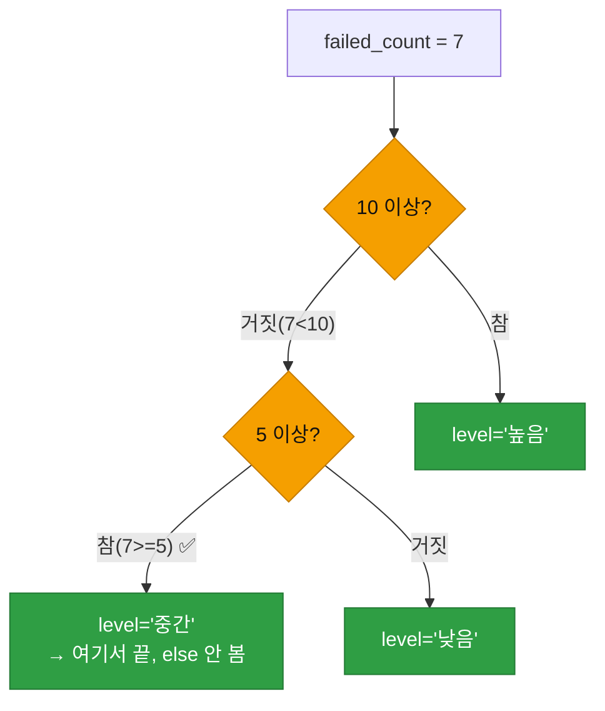
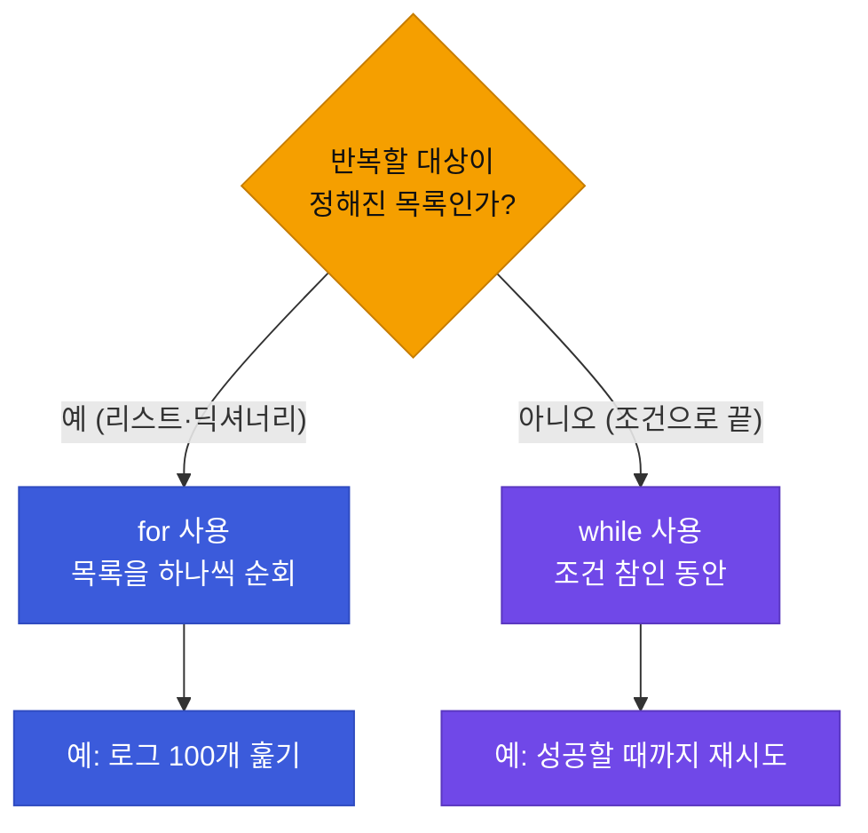
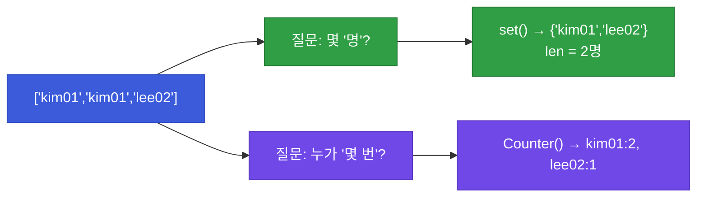

# 강의2 · 조건문·반복문과 제어 흐름 (오후, 총 120분)

> **이 교시 한 문장:** **조건문(if)** 으로 갈래를 나누고 **반복문(for/while)** 으로 여러 값을 훑으며, 로그 목록에서 "조건에 맞는 것만" 골라 세는 실전 패턴을 익힙니다.

| 시간 | 소주제 | 핵심 한 줄 |
|------|--------|-----------|
| 00-25분 | 조건문 (if/elif/else) | 상황에 따라 갈래 나누기 |
| 25-55분 | 반복문 (for, while, enumerate) | 여러 값을 하나씩 훑기 |
| 55-80분 | 리스트 컴프리헨션·break/continue | 한 줄 필터·반복 제어 |
| 80-105분 | 집합(set)·카운팅(Counter) | 중복 제거·개수 세기 |
| 105-120분 | 정리 및 실습 안내 | 오늘 것을 합쳐 스크립트로 |

## 이 교시에 나오는 어려운 용어

| 용어 (한글발음) | 한 줄 뜻 (아주 쉽게) | 비유 |
|----------------|----------------------|------|
| **조건문(if, 이프)** | 조건에 따라 다른 코드 실행 | 갈림길 |
| **분기(branch, 브랜치)** | 갈라지는 각 갈래 | 갈림길의 각 길 |
| **들여쓰기(indent, 인덴트)** | 줄 앞의 공백(묶음 표시) | 문단 들여쓰기 |
| **반복문(loop, 루프)** | 같은 일을 여러 번 | 도돌이표 |
| **`for`(포)** | 목록을 하나씩 순회 | 출석 부르기 |
| **`while`(와일)** | 조건이 참인 동안 반복 | "될 때까지" |
| **`enumerate`(이뉴머레이트)** | 순서 번호+값 함께 | 번호표 뽑기 |
| **컴프리헨션(comprehension)** | 목록을 한 줄로 만들기 | 한 방에 정리 |
| **`break`(브레이크)** | 반복 즉시 중단 | 멈춤 버튼 |
| **`continue`(컨티뉴)** | 이번 것만 건너뛰기 | 패스 |
| **집합(set, 셋)** | 중복 없는 모음 | 중복 제거 바구니 |
| **`Counter`(카운터)** | 개수를 세주는 도구 | 자동 계수기 |

---

## ⏱️ 00-25분 · 조건문 (if / elif / else)

!!! abstract "이 블록을 마치면"
    ✔ 상황에 따라 코드를 갈라 실행하고 ✔ ==들여쓰기가 왜 문법의 핵심==인지 안다

### 🐍 문법 상자 — if / elif / else

!!! tip "🐍 조건문의 뼈대"
    ```python
    failed_count = 7

    if failed_count >= 10:        # 조건1: 10 이상이면
        level = '높음'
    elif failed_count >= 5:       # 조건2: (10 미만이면서) 5 이상이면
        level = '중간'
    else:                         # 나머지
        level = '낮음'

    print(f'위험도: {level}')     # 위험도: 중간
    ```

    **➕ 다른 맥락 예제** — 시험 점수 등급:
    ```python
    score = 85
    if score >= 90:
        grade = 'A'
    elif score >= 80:
        grade = 'B'
    else:
        grade = 'C'
    print(grade)   # B
    ```

    - **`if 조건:`** — 조건이 참(True)이면 아래 들여쓴 코드 실행.
    - **`elif`** — "else if"의 줄임. 앞 조건이 거짓일 때 **또 다른 조건** 검사.
    - **`else`** — 위 조건이 **모두 거짓**일 때.
    - 끝에 **콜론(`:`)** 을 꼭 붙이고, 실행할 코드는 **들여씁니다(보통 스페이스 4칸)**.

### 🐍 문법 상자 — 들여쓰기: 파이썬은 공백으로 묶는다

!!! tip "🐍 들여쓰기(indent)가 곧 문법"
    ```python
    if failed_count >= 5:
        print('경보!')        # 4칸 들여씀 → if에 속한 코드
        print('담당자 확인')   # 같이 들여씀 → if에 속함
    print('로그 저장')         # 안 들여씀 → if와 무관, 항상 실행
    ```

    **➕ 다른 맥락 예제** — 들여쓰기로 묶음 구분:
    ```python
    temp = 38
    if temp >= 37.5:
        print('발열')          # if에 속함
        print('휴식 권장')      # if에 속함
    print('측정 완료')          # 항상 실행
    ```

    - 다른 언어는 `{ }`로 묶지만, **파이썬은 들여쓰기(공백)로 묶습니다.**
    - 같은 만큼 들여쓴 줄들이 **한 덩어리**입니다.
    - ⚠️ **들여쓰기가 틀리면 `IndentationError`** 또는 논리 오류. 실무 버그의 단골이라 강조합니다.

### 🔬 깊이 보기 — if/elif는 위에서부터, 첫 번째 참에서 멈춘다



`if/elif/else`는 **위에서부터 차례로** 검사하고, **처음 참이 되는 갈래 하나만** 실행한 뒤 나머지는 건너뜁니다. `failed_count=7`이면 "10 이상?"은 거짓 → "5 이상?"은 참 → '중간'으로 끝. `else`는 아예 안 봅니다. 그래서 **조건 순서가 중요**합니다.

!!! warning "🎓 강사 뷰 · and / or 복합 조건"
    ```python
    # and: 둘 다 참이라야
    if failed_count >= 5 and is_business_hour:
        print('업무시간 중 반복 실패')
    # or: 하나만 참이면
    if failed_count >= 10 or is_admin_account:
        print('즉시 확인')
    ```

    **➕ 다른 맥락 예제** — 할인 자격(미성년 또는 회원):
    ```python
    age = 15
    is_member = True
    if age < 18 or is_member:
        print('할인 적용')
    ```
    *"조건이 여럿일 땐 `and`(그리고)·`or`(또는)로 잇습니다. 3과목 조건부 접근, 4과목 탐지 룰에서 이 복합 조건을 계속 씁니다."*

!!! question "확인질문"
    **Q. `failed_count`가 정확히 5일 때 어느 분기로 들어갈까요?**

    **A.** **`elif failed_count >= 5` 분기('중간')** 로 들어갑니다.

    먼저 `if failed_count >= 10`을 검사하는데 5는 10보다 작으므로 거짓입니다. 다음 `elif failed_count >= 5`를 검사하면 5는 5 이상(`>=`는 '이상', 즉 같은 값 포함)이라 참이 되어 `level = '중간'`이 실행됩니다. 그 순간 조건문은 끝나고 `else`는 확인하지 않습니다. 만약 `>` (초과)였다면 5는 걸리지 않아 '낮음'으로 갔을 것이므로, `>=`와 `>`의 구분이 경계값에서 중요합니다.

<div class="quiz">
<p class="quiz-q"><span class="tag">퀴즈</span><b>파이썬에서 <code>if</code> 블록에 속한 코드임을 나타내는 방법은?</b></p>
<button class="quiz-opt">중괄호 <code>{ }</code>로 감싼다</button>
<button class="quiz-opt" data-correct>같은 만큼 들여쓰기(공백)를 한다</button>
<button class="quiz-opt">세미콜론 <code>;</code>을 붙인다</button>
<button class="quiz-opt">대문자로 쓴다</button>
<div class="quiz-explain"><b>정답: 2번.</b> 파이썬은 `{ }`가 아니라 들여쓰기로 코드 묶음을 표시합니다. 같은 만큼 들여쓴 줄들이 한 덩어리이고, 들여쓰기가 틀리면 IndentationError가 납니다.</div>
<button class="quiz-retry">다시 풀기</button>
</div>

---

## ⏱️ 25-55분 · 반복문 (for, while, enumerate)

!!! abstract "이 블록을 마치면"
    ✔ 목록을 하나씩 훑고 ✔ ==조건에 맞는 항목만 골라내는== 반복 패턴을 안다

### 🐍 문법 상자 — for: 목록을 하나씩

!!! tip "🐍 for 반복문"
    ```python
    users = ['kim01', 'lee02', 'park03']

    for user in users:            # users의 값을 하나씩 user에 담아 반복
        print(f'점검: {user}')
    # 점검: kim01
    # 점검: lee02
    # 점검: park03
    ```

    **➕ 다른 맥락 예제** — 장바구니 금액 합:
    ```python
    prices = [3000, 4500, 2000]
    total = 0
    for p in prices:
        total = total + p
    print(total)   # 9500
    ```

    - **`for 변수 in 목록:`** — 목록의 값을 하나씩 `변수`에 담아 반복.
    - `user`는 매 바퀴 다음 값으로 바뀝니다(kim01→lee02→park03).
    - 콜론(`:`)과 들여쓰기는 if와 똑같습니다.

### 🐍 문법 상자 — enumerate: 번호와 값을 함께

!!! tip "🐍 enumerate — 순서 번호가 필요할 때"
    ```python
    logs = [
        {'user': 'kim01', 'event': 'login_failed'},
        {'user': 'lee02', 'event': 'login_success'},
        {'user': 'kim01', 'event': 'login_failed'},
    ]

    for idx, log in enumerate(logs):        # idx=순번(0,1,2), log=값
        if log['event'] == 'login_failed':  # 실패 로그만
            print(f'{idx}번째 실패 로그: {log["user"]}')
    # 0번째 실패 로그: kim01
    # 2번째 실패 로그: kim01
    ```

    **➕ 다른 맥락 예제** — 순위 붙여 출력:
    ```python
    winners = ['금', '은', '동']
    for rank, medal in enumerate(winners):
        print(f'{rank + 1}위: {medal}')   # 1위: 금 / 2위: 은 / 3위: 동
    ```

    - `enumerate(목록)` : **(순번, 값)** 을 함께 줍니다. 번호가 필요할 때.
    - ⚠️ f-string 안에서 딕셔너리 키를 꺼낼 땐 바깥과 다른 따옴표: `{log["user"]}` (바깥 `'`, 안 `"`).

### 🐍 문법 상자 — while: 조건이 참인 동안

!!! tip "🐍 while 반복문"
    ```python
    count = 0
    while count < 3:        # count가 3보다 작은 '동안' 반복
        print(f'시도 {count}')
        count = count + 1   # ⚠️ 이걸 빼먹으면 무한 반복!
    # 시도 0 / 시도 1 / 시도 2
    ```

    **➕ 다른 맥락 예제** — 카운트다운:
    ```python
    n = 3
    while n > 0:
        print(n)
        n = n - 1     # 줄여야 언젠가 끝남
    print('발사!')     # 3 / 2 / 1 / 발사!
    ```

    - **`while 조건:`** — 조건이 참인 동안 계속 반복.
    - ⚠️ **조건을 언젠가 거짓으로 만드는 코드**(`count = count + 1`)가 없으면 **무한 루프**! 초보자 필수 주의점.
    - `for`는 "정해진 목록을 훑을 때", `while`은 "언제 끝날지 조건으로 정할 때".

### 🔬 깊이 보기 — for vs while, 언제 뭘 쓰나



**대부분의 로그 처리는 `for`입니다** — "이 목록을 다 훑어라"가 명확하니까요. `while`은 "몇 번 반복할지 미리 모를 때"(재시도, 조건 충족까지) 씁니다. 목록 순회를 while로 하려면 인덱스 변수를 따로 관리해야 해서 번거롭습니다.

!!! question "확인질문"
    **Q. for문 대신 while문으로 같은 필터링을 하려면 무엇이 더 필요할까요?**

    **A.** **직접 관리하는 인덱스(순번) 변수와 종료 조건이 더 필요합니다.**

    `for log in logs:`는 목록을 자동으로 하나씩 꺼내 줍니다. 하지만 while로 같은 일을 하려면 `i = 0`처럼 인덱스 변수를 만들고, `while i < len(logs):`로 끝 조건을 직접 정하고, 반복 안에서 `logs[i]`로 값을 꺼낸 뒤 `i = i + 1`로 인덱스를 손수 증가시켜야 합니다. 이 증가 코드를 빠뜨리면 무한 루프에 빠집니다. 그래서 정해진 목록을 훑을 때는 for가 훨씬 간단하고 안전합니다.

<div class="quiz">
<p class="quiz-q"><span class="tag">퀴즈</span><b><code>while count < 3:</code> 반복문에서 <code>count = count + 1</code>을 빼먹으면?</b></p>
<button class="quiz-opt">한 번만 실행되고 끝난다</button>
<button class="quiz-opt">아예 실행되지 않는다</button>
<button class="quiz-opt" data-correct>조건이 계속 참이라 무한 반복(무한 루프)에 빠진다</button>
<button class="quiz-opt">에러가 나며 즉시 멈춘다</button>
<div class="quiz-explain"><b>정답: 3번.</b> `count`가 0에서 안 늘면 `count < 3`이 영원히 참이라 끝없이 반복됩니다. while은 '조건을 언젠가 거짓으로 만드는 코드'가 반드시 있어야 합니다. for는 목록이 자동으로 끝나 이 위험이 없습니다.</div>
<button class="quiz-retry">다시 풀기</button>
</div>

---

## ⏱️ 55-80분 · 리스트 컴프리헨션과 break/continue

!!! abstract "이 블록을 마치면"
    ✔ ==필터링을 한 줄로== 쓰고 ✔ 반복을 중단·건너뛰는 법을 안다

### 🐍 문법 상자 — 리스트 컴프리헨션

!!! tip "🐍 한 줄로 목록 만들기"
    ```python
    logs = [
        {'user': 'kim01', 'event': 'login_failed'},
        {'user': 'lee02', 'event': 'login_success'},
        {'user': 'kim01', 'event': 'login_failed'},
    ]

    # 실패 로그의 user만 골라 새 리스트로
    failed_users = [log['user'] for log in logs if log['event'] == 'login_failed']
    print(failed_users)   # ['kim01', 'kim01']
    ```

    **➕ 다른 맥락 예제** — 짝수만 골라 담기:
    ```python
    nums = [1, 2, 3, 4, 5, 6]
    evens = [n for n in nums if n % 2 == 0]
    print(evens)   # [2, 4, 6]
    ```

    구조를 뜯어보면:
    ```
    [ log['user']              for log in logs        if log['event']=='login_failed' ]
      └ 담을 값                └ 무엇을 훑나          └ 조건(선택)
    ```

    - 위 한 줄은 아래 4줄과 **완전히 같습니다.**
    ```python
    failed_users = []
    for log in logs:
        if log['event'] == 'login_failed':
            failed_users.append(log['user'])
    ```

    > 컴프리헨션은 "훑으면서 조건에 맞는 걸 골라 담기"를 **한 줄로** 압축합니다. 4과목 pandas 전까지 필터링의 주력 문법이에요.

### 🐍 문법 상자 — break와 continue

!!! tip "🐍 반복 제어: break(중단) · continue(건너뛰기)"
    ```python
    for log in logs:
        if log['event'] == 'login_success':
            continue          # 이번 건 건너뛰고 다음 반복으로
        print(log['user'])    # 실패 로그만 출력됨

    for log in logs:
        if log['user'] == 'lee02':
            print('lee02 발견, 중단')
            break             # 반복 자체를 즉시 끝냄
    ```

    **➕ 다른 맥락 예제** — 찾으면 멈추기:
    ```python
    stock = ['빵', '우유', '계란']
    for item in stock:
        if item == '우유':
            print('우유 있음!')
            break        # 찾았으니 그만 돌기
    ```

    - **`continue`** : 이번 바퀴만 건너뛰고 **다음 반복 계속**.
    - **`break`** : 반복 **전체를 즉시 종료**(더 안 돎).

!!! question "확인질문"
    **Q. `failed_users` 리스트에 kim01이 두 번 나오는 게 실무에서는 왜 문제가 될 수 있을까요? (힌트: 집계)**

    **A.** **"몇 명이 실패했나"를 세려는데 중복 때문에 잘못 세어지기 때문**입니다.

    `['kim01', 'kim01']`은 실패한 사용자를 뽑은 결과인데, kim01이 두 번 들어 있습니다. 만약 "실패한 사용자가 몇 명인지"를 알고 싶다면 이 리스트의 길이(2)는 틀린 답입니다 — 실제로는 한 명(kim01)이니까요. 반대로 "kim01이 몇 번 실패했나"를 세는 거라면 중복이 오히려 정보입니다. 그래서 목적에 따라, '몇 명'이 궁금하면 중복을 제거(set)하고, '몇 번'이 궁금하면 개수를 세야(Counter) 합니다. 다음 블록에서 이 두 도구를 배웁니다.

<div class="quiz">
<p class="quiz-q"><span class="tag">퀴즈</span><b><code>[x for x in nums if x > 5]</code>가 하는 일은?</b></p>
<button class="quiz-opt">nums의 모든 값을 5로 바꾼다</button>
<button class="quiz-opt" data-correct>nums에서 5보다 큰 값만 골라 새 리스트를 만든다</button>
<button class="quiz-opt">nums의 개수를 센다</button>
<button class="quiz-opt">nums를 정렬한다</button>
<div class="quiz-explain"><b>정답: 2번.</b> 리스트 컴프리헨션은 `[담을값 for 변수 in 목록 if 조건]` 구조입니다. "nums를 훑으며 5보다 큰 것만 골라 담아라"라는 뜻이죠. for+if+append 3줄을 한 줄로 압축한 것입니다.</div>
<button class="quiz-retry">다시 풀기</button>
</div>

---

## ⏱️ 80-105분 · 집합(set)과 카운팅(Counter)

!!! abstract "이 블록을 마치면"
    ✔ 중복을 제거하고 ✔ ==등장 횟수를 세는== 두 도구를 안다

### 🐍 문법 상자 — set: 중복 제거

!!! tip "🐍 set() — 중복 없는 모음"
    ```python
    failed_users = ['kim01', 'kim01', 'lee02']

    unique_users = set(failed_users)    # 중복 제거
    print(unique_users)                 # {'kim01', 'lee02'}
    print(len(unique_users))            # 2  ← 실제 몇 '명'인지
    ```

    **➕ 다른 맥락 예제** — 중복 없는 방문 도시 수:
    ```python
    visits = ['서울', '부산', '서울', '제주']
    print(set(visits))        # {'서울', '부산', '제주'}
    print(len(set(visits)))   # 3  ← 서로 다른 도시 3곳
    ```

    - `set(리스트)` : 중복을 없앤 집합을 만듭니다. `{}`로 표시(순서 없음).
    - "몇 **명**이 실패했나"(중복 제외)를 셀 때 딱입니다.

### 🐍 문법 상자 — Counter: 개수 세기

!!! tip "🐍 collections.Counter — 자동 계수기"
    ```python
    from collections import Counter        # 표준 라이브러리에서 가져오기

    failed_users = ['kim01', 'kim01', 'lee02']
    counter = Counter(failed_users)        # 각 값이 몇 번?
    print(counter)                         # Counter({'kim01': 2, 'lee02': 1})

    for user, cnt in counter.items():      # 키(user)와 값(cnt)을 함께
        if cnt >= 2:
            print(f'{user} 반복 실패 {cnt}회 - 확인 필요')
    # kim01 반복 실패 2회 - 확인 필요
    ```

    **➕ 다른 맥락 예제** — 투표 집계:
    ```python
    from collections import Counter
    votes = ['사과', '바나나', '사과', '사과']
    print(Counter(votes))                  # Counter({'사과': 3, '바나나': 1})
    print(Counter(votes).most_common(1))   # [('사과', 3)]  ← 최다 1개
    ```

    - `from ... import ...` : 다른 곳의 기능을 **가져오는** 문법(Day2에서 자세히).
    - `Counter(리스트)` : 각 값이 **몇 번 나왔는지** 딕셔너리처럼 세줍니다.
    - "누가 **몇 번** 실패했나"(빈도)를 셀 때 딱입니다.

### 🔬 깊이 보기 — set vs Counter, 질문이 다르다



**같은 데이터라도 질문이 다르면 도구가 다릅니다.** "몇 명?"은 중복 제거(`set`), "누가 몇 번?"은 빈도(`Counter`). 실습에서 "동일 사용자가 여러 번 실패"를 찾을 땐 Counter가 필요하죠. 이 둘의 구분이 Day1 실습의 핵심입니다.

!!! question "확인질문"
    **Q. `Counter` 없이 직접 딕셔너리로 카운팅한다면 코드가 몇 줄 더 필요할까요?**

    **A.** **대략 3~4줄 정도 더 필요합니다.**

    Counter는 `Counter(리스트)` 한 줄이면 끝나지만, 직접 만들면 이런 식이 됩니다:
    ```python
    counts = {}                        # 빈 딕셔너리 준비
    for user in failed_users:          # 하나씩 훑으며
        if user in counts:             # 이미 있으면
            counts[user] = counts[user] + 1   # +1
        else:                          # 처음이면
            counts[user] = 1           # 1로 시작
    ```
    이렇게 "있으면 +1, 없으면 1로 시작"하는 로직을 직접 써야 합니다. Counter는 이 반복 패턴을 한 줄로 대신해 주므로, 자주 쓰는 계산은 표준 라이브러리 도구를 아는 것이 코드를 크게 줄여 줍니다.

<div class="quiz">
<p class="quiz-q"><span class="tag">퀴즈</span><b>"실패한 사용자가 <b>몇 명</b>인지"(중복 제외)를 알고 싶을 때 알맞은 도구는?</b></p>
<button class="quiz-opt"><code>Counter</code></button>
<button class="quiz-opt" data-correct><code>set</code></button>
<button class="quiz-opt"><code>enumerate</code></button>
<button class="quiz-opt"><code>append</code></button>
<div class="quiz-explain"><b>정답: 2번.</b> '몇 명'(중복 제외)은 `set()`으로 중복을 없앤 뒤 `len()`으로 셉니다. Counter는 '누가 몇 번'(빈도)을 셀 때죠. 질문이 '명수'냐 '횟수'냐에 따라 도구가 갈립니다.</div>
<button class="quiz-retry">다시 풀기</button>
</div>

!!! success "✍️ 지금 직접 쳐보기 (7분) — 필터·집계 종합"
    ```python
    from collections import Counter
    logs = [
        {'user': 'kim01', 'event': 'login_failed'},
        {'user': 'lee02', 'event': 'login_success'},
        {'user': 'kim01', 'event': 'login_failed'},
        {'user': 'park03', 'event': 'login_failed'},
    ]
    ```
    1. 컴프리헨션으로 `login_failed`인 user만 뽑아 `fails` 리스트 만들기.
    2. `set(fails)`로 **몇 명**이 실패했는지 세기.
    3. `Counter(fails)`로 **누가 몇 번** 실패했는지 세기.
    4. 2회 이상 실패한 사용자만 `for`로 출력하기.

    > 🎓 강사 팁: 이 4단계가 그대로 오늘 실습입니다. 여기서 손에 익히면 실습이 술술 풀립니다.

!!! tip "🧠 파인만 자가진단"
    안 보고 말할 수 있으면 통과입니다.

    1. if/elif/else가 위에서부터 어떻게 검사되는지
    2. for와 while을 각각 언제 쓰는지
    3. 리스트 컴프리헨션 `[x for x in a if 조건]`을 for+if로 풀어쓰기
    4. set과 Counter가 답하는 질문의 차이

---

## ⏱️ 105-120분 · 정리 및 실습 안내

**오후 정리:**

1. **조건문** — `if/elif/else`, 위에서부터 첫 참 하나만, **들여쓰기로 묶음**
2. **반복문** — `for`(목록 순회)·`while`(조건 반복), `enumerate`(번호+값)
3. **컴프리헨션** — 필터링을 한 줄로, `break`(중단)·`continue`(건너뛰기)
4. **집계** — `set`(몇 명)·`Counter`(누가 몇 번)

!!! note "실습 예고 (오후 실습 120분)"
    오늘 배운 것만으로 **로그 필터링 스크립트**(`day01_basic.py`)를 만듭니다. 실패 로그를 골라 사용자별 실패 횟수를 Counter로 집계하고, 2회 이상을 '확인 필요'로 출력합니다. 임계값은 하드코딩하지 않고 변수로 분리합니다(config 습관의 첫걸음). 상세는 [실습 페이지](practice.md).

---

## ✅ 가르칠 준비 체크리스트 (강의2)

- [ ] if/elif/else와 들여쓰기의 중요성을 설명한다
- [ ] `>=`와 `>`의 경계값 차이를 짚는다
- [ ] for/while을 각각 언제 쓰는지 설명한다
- [ ] while 무한 루프 위험을 시연한다
- [ ] 리스트 컴프리헨션을 for+if로 풀어 보인다
- [ ] set(명수)·Counter(횟수)의 질문 차이를 설명한다
- [ ] 확인질문 4개 + 퀴즈에 답한다

*[enumerate]: 순번과 값을 함께 반환하는 파이썬 내장 함수
*[Counter]: collections 모듈의 개수 집계 도구
*[comprehension]: 리스트 등을 한 줄 표현식으로 만드는 문법
