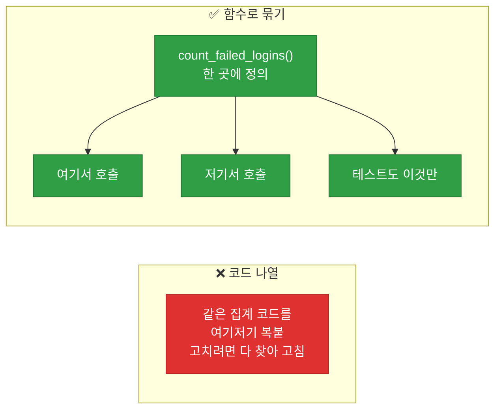
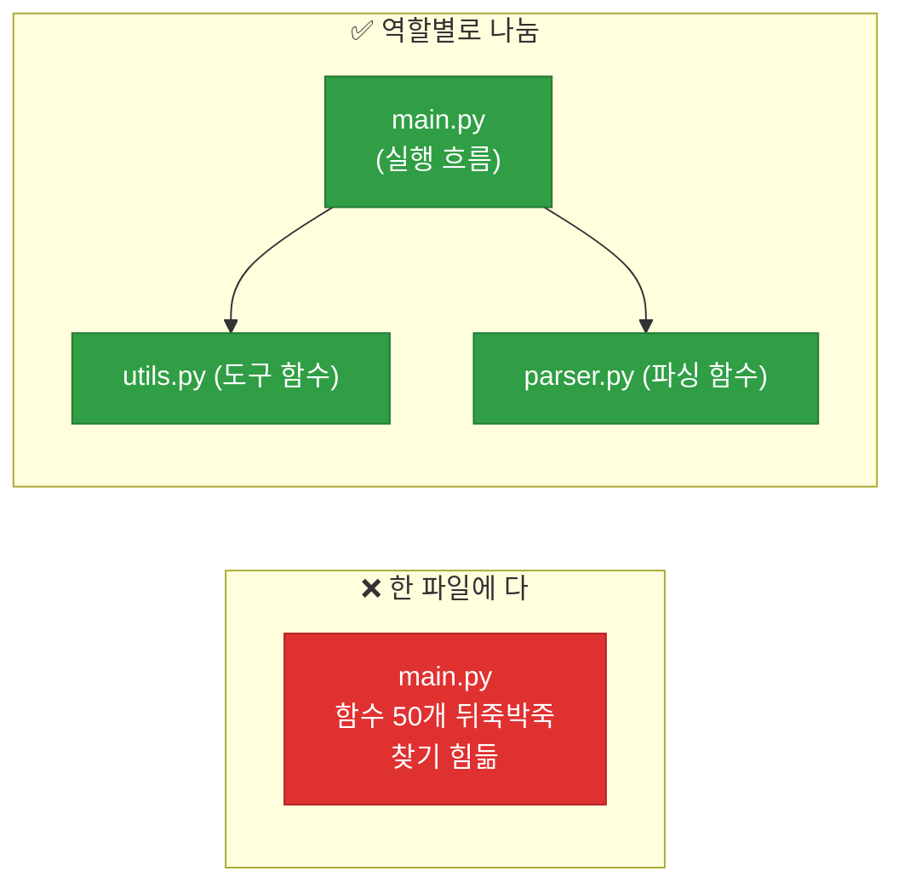
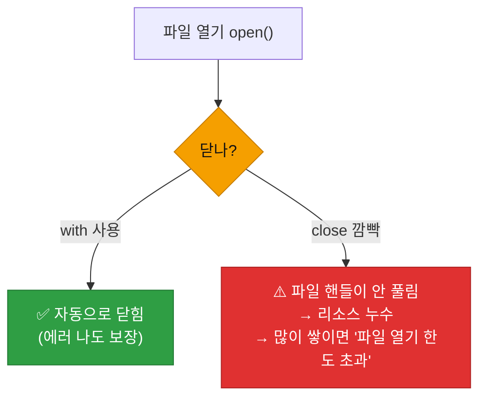
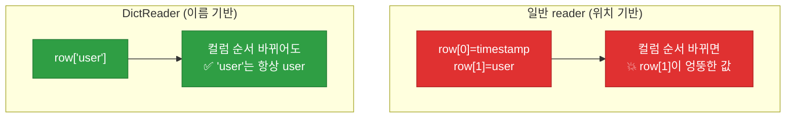

# 강의1 · 함수·모듈과 파일 입출력 (오전, 총 120분)

> **이 교시 한 문장:** 반복되는 코드를 **함수**로 묶어 재사용하고, 여러 함수를 **모듈(파일)** 로 나누며, **파일을 열어 읽고**(txt·csv) 실제 로그 데이터를 다루는 법을 익힙니다.

| 시간 | 소주제 | 핵심 한 줄 |
|------|--------|-----------|
| 00-20분 | 함수 정의와 리팩토링 | 반복 코드를 함수로 묶기 |
| 20-40분 | 모듈과 import | 함수를 다른 파일로 나누기 |
| 40-60분 | datetime 다루기 | 문자열 시간을 진짜 시간으로 |
| 60-85분 | 파일 읽기/쓰기 (open·with) | 파일을 안전하게 열고 닫기 |
| 85-105분 | CSV 다루기 (DictReader) | 표 로그를 딕셔너리로 |
| 105-120분 | 코드 스타일 (PEP8) | 이름 규칙과 협업 |

## 이 교시에 나오는 어려운 용어

| 용어 (한글발음) | 한 줄 뜻 (아주 쉽게) | 비유 |
|----------------|----------------------|------|
| **함수(function, 펑션)** | 이름 붙인 코드 묶음 | 자판기(넣으면 나옴) |
| **`def`(데프)** | 함수를 정의하는 키워드 | "이 기능 만든다" |
| **매개변수(parameter, 파라미터)** | 함수가 받는 입력값 | 자판기 버튼 |
| **인자(argument, 아규먼트)** | 실제로 넣는 값 | 넣는 동전 |
| **`return`(리턴)** | 결과를 돌려줌 | 자판기 출구 |
| **기본값(default, 디폴트)** | 안 넘기면 쓰는 값 | 기본 설정 |
| **모듈(module, 모듈)** | 함수들을 담은 .py 파일 | 부품 상자 |
| **`import`(임포트)** | 다른 파일 기능 가져오기 | 부품 꺼내 쓰기 |
| **리팩토링(refactoring)** | 동작은 그대로, 구조 개선 | 방 정리 |
| **`with`문(위드)** | 자동으로 뒷정리 | 자동문(닫힘 보장) |
| **인코딩(encoding, utf-8)** | 글자를 저장하는 방식 | 한글 안 깨지게 |
| **PEP8(펩에이트)** | 파이썬 코드 스타일 규칙 | 글쓰기 맞춤법 |

---

## ⏱️ 00-20분 · 함수 정의와 어제 코드 리팩토링

!!! abstract "이 블록을 마치면"
    ✔ `def`로 함수를 만들고 `return`으로 결과를 돌려주고 ✔ ==반복 코드를 함수로 묶는 이유==를 안다

### 🐍 문법 상자 — 함수: 이름 붙인 코드 묶음

!!! tip "🐍 def / return"
    ```python
    def add(a, b):        # a, b를 받아서
        result = a + b    # 계산하고
        return result     # 결과를 돌려줌

    print(add(3, 5))      # 8
    ```

    - **`def 함수명(매개변수):`** — 함수를 정의. 콜론(`:`)과 들여쓰기는 if·for와 동일.
    - **매개변수** `a, b` — 함수가 **받을** 값(입력).
    - **`return`** — 결과를 **돌려줌**. return이 없으면 `None`을 돌려줍니다.
    - 함수를 **쓸 때(호출)**: `add(3, 5)` — 3이 a로, 5가 b로 들어감.

### 💻 코드 조각 — 어제 코드를 함수로 리팩토링

```python
from collections import Counter

# 어제는 코드가 그냥 나열됐지만, 오늘은 함수로 묶는다
def count_failed_logins(logs, threshold=2):     # threshold 기본값 2
    failed = [l['user'] for l in logs if l['event'] == 'login_failed']
    counter = Counter(failed)
    # 임계값 이상인 사용자만 딕셔너리로 반환
    return {u: c for u, c in counter.items() if c >= threshold}

# 이제 한 줄로 재사용 가능
result = count_failed_logins(my_logs)            # threshold 생략 → 2 사용
result2 = count_failed_logins(my_logs, 5)        # threshold=5
```

### 🔬 깊이 보기 — 함수로 묶으면 무엇이 좋아지나



같은 코드를 여러 곳에 복붙하면 고칠 때 **다 찾아 고쳐야** 합니다(빠뜨리면 버그). 함수로 묶으면 **한 곳만 고치면 되고**, 이름(`count_failed_logins`)만으로 뜻이 읽히며, **그 함수만 따로 테스트**할 수 있습니다. 3과목의 함수 재사용, 4과목의 모듈화가 다 여기서 출발합니다.

### 🐍 문법 상자 — 매개변수 기본값

!!! tip "🐍 기본값 default"
    ```python
    def greet(name, greeting='안녕'):   # greeting 기본값 '안녕'
        print(f'{greeting}, {name}!')

    greet('kim01')              # 안녕, kim01!      (기본값 사용)
    greet('lee02', '반가워')     # 반가워, lee02!    (직접 지정)
    ```

    - 기본값이 있으면 그 인자를 **생략 가능** — 안 넘기면 기본값을 씁니다.
    - 자주 쓰는 값은 기본값으로 두면 편하고, 필요할 때만 바꿉니다.

!!! question "확인질문"
    **Q. `threshold=2`처럼 기본값을 주는 것과 항상 값을 넘겨받는 것의 차이는 무엇일까요?**

    **A.** **기본값이 있으면 그 인자를 생략할 수 있다는 점**이 다릅니다.

    `def count_failed_logins(logs, threshold=2)`처럼 기본값을 주면, 호출할 때 `count_failed_logins(logs)`처럼 threshold를 생략해도 자동으로 2가 쓰입니다. 대부분의 경우 2를 쓰고 가끔만 다른 값이 필요하다면, 매번 2를 적지 않아도 되어 편합니다. 반대로 기본값이 없으면 호출할 때마다 반드시 threshold 값을 넘겨야 하고, 빠뜨리면 에러가 납니다. 즉 기본값은 "자주 쓰는 값은 미리 정해두고, 필요할 때만 바꾼다"는 편의를 줍니다.

<div class="quiz">
<p class="quiz-q"><span class="tag">퀴즈</span><b>함수에서 <code>return</code>을 아예 쓰지 않으면 그 함수를 호출한 결과는?</b></p>
<button class="quiz-opt">에러가 난다</button>
<button class="quiz-opt" data-correct><code>None</code>이 반환된다</button>
<button class="quiz-opt">마지막 줄의 값이 자동 반환된다</button>
<button class="quiz-opt">0이 반환된다</button>
<div class="quiz-explain"><b>정답: 2번.</b> return이 없으면 파이썬은 자동으로 `None`(값 없음)을 돌려줍니다. 함수가 계산 결과를 밖으로 주려면 반드시 `return`이 필요합니다. 마지막 줄 값 자동 반환(3번)은 파이썬에 없습니다.</div>
<button class="quiz-retry">다시 풀기</button>
</div>

---

## ⏱️ 20-40분 · 모듈과 import

!!! abstract "이 블록을 마치면"
    ✔ 함수를 별도 파일(모듈)로 나누고 ✔ ==`import`로 가져다 쓰는== 법을 안다

### 🐍 문법 상자 — 모듈과 import

!!! tip "🐍 파일을 나누고 가져오기"
    ```python
    # 📄 utils.py  (함수들을 모아둔 파일 = 모듈)
    def count_failed_logins(logs, threshold=2):
        ...

    # 📄 day02_basic.py  (utils의 함수를 가져다 씀)
    from utils import count_failed_logins    # utils.py에서 그 함수를 가져오기

    result = count_failed_logins(logs, threshold=2)
    ```

    - **모듈** = 함수들을 담은 `.py` 파일. `utils.py` 파일 = `utils` 모듈.
    - **`from 모듈 import 함수`** — 그 모듈의 특정 함수를 가져옵니다.
    - `import utils` 후 `utils.count_failed_logins(...)`처럼 전체를 가져올 수도 있습니다.
    - 이미 `from collections import Counter`로 **표준 라이브러리**를 가져와 봤죠 — 같은 문법입니다.

### 🔬 깊이 보기 — 왜 파일을 나누나



파일을 역할별로 나누면 **찾기 쉽고**(파싱 문제는 parser.py만), 여러 사람이 **각 파일을 동시에** 작업할 수 있습니다. 3·4과목의 `weekly_report.py`·`pipeline.py`가 여러 모듈을 import해 지휘한 게 바로 이 원리입니다.

!!! question "확인질문"
    **Q. `utils.py`의 함수 이름을 바꾸면 `day02_basic.py`에서 무엇을 같이 바꿔야 할까요?**

    **A.** **`import` 구문과 그 함수를 호출하는 부분의 이름을 함께 바꿔야 합니다.**

    예를 들어 `utils.py`의 `count_failed_logins`를 `tally_failed_logins`로 바꾸면, `day02_basic.py`의 `from utils import count_failed_logins`도 `from utils import tally_failed_logins`로 고쳐야 하고, 실제 호출하는 `count_failed_logins(logs)`도 `tally_failed_logins(logs)`로 바꿔야 합니다. 함수 이름은 정의한 곳과 가져다 쓰는 곳이 정확히 일치해야 하므로, 한쪽만 바꾸면 "그런 이름이 없다"는 ImportError나 NameError가 납니다.

<div class="quiz">
<p class="quiz-q"><span class="tag">퀴즈</span><b><code>from utils import count_failed_logins</code>가 하는 일은?</b></p>
<button class="quiz-opt">utils.py 파일을 새로 만든다</button>
<button class="quiz-opt" data-correct>utils.py에 정의된 count_failed_logins 함수를 현재 파일로 가져와 쓸 수 있게 한다</button>
<button class="quiz-opt">count_failed_logins 함수를 실행한다</button>
<button class="quiz-opt">utils.py의 모든 코드를 복사한다</button>
<div class="quiz-explain"><b>정답: 2번.</b> import는 다른 모듈(파일)의 함수를 현재 파일에서 쓸 수 있게 '가져오기'입니다. 실행(3번)은 그 함수를 호출할 때 일어나고, 파일 생성·복사와는 다릅니다.</div>
<button class="quiz-retry">다시 풀기</button>
</div>

---

## ⏱️ 40-60분 · 표준 라이브러리 둘러보기 (datetime)

!!! abstract "이 블록을 마치면"
    ✔ ==문자열 시간을 진짜 시간 객체로== 바꿔 시(hour) 등을 꺼낸다

### 🐍 문법 상자 — datetime: 문자열 ↔ 시간

!!! tip "🐍 strptime / strftime"
    ```python
    from datetime import datetime

    # 문자열 → datetime 객체 (strptime: str-parse-time)
    ts = datetime.strptime('2026-07-07T09:12:00', '%Y-%m-%dT%H:%M:%S')
    print(ts.hour)     # 9    ← 시(hour)를 숫자로 꺼냄
    print(ts.year)     # 2026

    # datetime 객체 → 문자열 (strftime: str-format-time)
    print(ts.strftime('%Y년 %m월 %d일'))   # 2026년 07월 07일
    ```

    - **`strptime(문자열, 형식)`** : 글자를 시간 객체로 **파싱**(str→time). "p"=parse.
    - **`strftime(형식)`** : 시간 객체를 원하는 글자로 **포맷**(time→str). "f"=format.
    - 형식 기호: `%Y`(연4자리) `%m`(월) `%d`(일) `%H`(시24) `%M`(분) `%S`(초).

    > 왜 변환하나? 문자열 `'09:12'`끼리는 시간 계산·비교가 어렵지만, datetime 객체는 `.hour`로 시를 꺼내고 시간 차이도 계산할 수 있습니다(3·4과목에서 `timedelta`로 활용).

!!! example "🎓 강사 뷰 · 보안과 연결"
    *"타임스탬프를 datetime으로 바꾸면 '새벽 시간대 접근'을 `if ts.hour < 6`처럼 판단할 수 있습니다. 3과목 조건부 접근, 4과목 오프타임 탐지가 다 이걸 씁니다. 문자열을 시간으로 바꾸는 이 습관이 시작점이에요."*

!!! question "확인질문"
    **Q. 새벽 시간대(예: 새벽 3시)에 로그인 실패가 몰려있다면 어떤 의심을 해볼 수 있을까요?**

    **A.** **정상 사용자가 아닌 자동화된 공격(예: 무차별 대입)이나 계정 탈취 시도를 의심할 수 있습니다.**

    대부분의 직원은 새벽 3시에 일하지 않습니다. 그런데 그 시간대에 로그인 실패가 몰린다면, 사람이 아니라 프로그램이 비밀번호를 계속 대입하는 무차별 대입(brute-force) 공격이거나, 정상 근무시간을 피해 몰래 침입하려는 시도일 가능성이 있습니다. `datetime`으로 타임스탬프의 시(hour)를 꺼내면 이런 "업무시간 외 이상 접근"을 코드로 걸러낼 수 있고, 이것이 4과목의 오프타임 로그인 탐지로 이어집니다.

<div class="quiz">
<p class="quiz-q"><span class="tag">퀴즈</span><b>문자열 <code>'2026-07-07T09:12:00'</code>을 <code>datetime</code> 객체로 바꾸는 함수는?</b></p>
<button class="quiz-opt"><code>strftime</code></button>
<button class="quiz-opt" data-correct><code>strptime</code></button>
<button class="quiz-opt"><code>int</code></button>
<button class="quiz-opt"><code>str</code></button>
<div class="quiz-explain"><b>정답: 2번.</b> `strptime`은 문자열을 파싱(parse)해 시간 객체로 만듭니다("p"=parse). 반대로 `strftime`은 시간 객체를 문자열로 포맷("f"=format)합니다. 방향이 반대라 헷갈리기 쉬우니 p=parse, f=format으로 기억하세요.</div>
<button class="quiz-retry">다시 풀기</button>
</div>

---

## ⏱️ 60-85분 · 파일 읽기/쓰기 (open, with문)

!!! abstract "이 블록을 마치면"
    ✔ ==`with open()`으로 파일을 안전하게== 읽고, 파일 모드를 구분한다

### 🐍 문법 상자 — open과 파일 모드

!!! tip "🐍 open(파일, 모드, encoding)"
    ```python
    # 읽기
    with open('sample_logs.txt', 'r', encoding='utf-8') as f:
        lines = f.readlines()          # 모든 줄을 리스트로
        for line in lines:
            print(line.strip())        # strip(): 줄 끝 개행·공백 제거

    # 쓰기
    with open('output.txt', 'w', encoding='utf-8') as f:
        f.write('첫 줄\n')             # \n은 줄바꿈
    ```

    | 모드 | 뜻 | 주의 |
    |------|-----|------|
    | `'r'` | 읽기(read) | 파일 없으면 에러 |
    | `'w'` | 쓰기(write) | **기존 내용 덮어씀!** |
    | `'a'` | 추가(append) | 뒤에 이어 씀 |

    - `encoding='utf-8'` : **한글이 안 깨지게** 하는 필수 옵션.
    - `.strip()` : 줄 끝의 개행문자(`\n`)·공백을 제거. `readlines()`는 `\n`이 붙어 오므로 자주 씁니다.

### 🐍 문법 상자 — with문: 자동으로 닫아준다

!!! tip "🐍 with가 하는 일"
    ```python
    # ❌ with 없이 — 닫기를 깜빡할 수 있음
    f = open('log.txt', 'r', encoding='utf-8')
    data = f.read()
    f.close()               # 이걸 빼먹으면 파일이 안 닫힘!

    # ✅ with — 블록이 끝나면 자동으로 close
    with open('log.txt', 'r', encoding='utf-8') as f:
        data = f.read()
    # 여기서 자동으로 닫힘 (에러가 나도 닫힘)
    ```

    - `with`는 블록을 벗어날 때 **자동으로 파일을 닫습니다**(에러가 나도!).
    - 그래서 `f.close()`를 깜빡할 일이 없습니다. **파일은 항상 `with`로** 여는 게 표준입니다.

### 🔬 깊이 보기 — 파일을 안 닫으면 생기는 일



파일을 열면 운영체제가 **자원(핸들)** 을 붙잡습니다. 안 닫으면 그 자원이 계속 물려 있고, 자동화가 파일을 수천 개 열다 보면 **"열 수 있는 파일 한도 초과"** 에러가 날 수 있습니다. `with`는 이걸 자동으로 막아, 자원 관리 실수를 원천 차단합니다.

!!! question "확인질문"
    **Q. `with`문을 안 쓰고 `f.close()`를 깜빡하면 어떤 문제가 생길 수 있을까요?**

    **A.** **파일이 닫히지 않아 자원이 계속 붙잡히는 '리소스 누수'가 생깁니다.**

    파일을 열면 운영체제가 그 파일에 대한 자원(핸들)을 할당하는데, `close()`로 닫지 않으면 그 자원이 반환되지 않고 계속 물려 있습니다. 한두 개면 티가 안 나지만, 자동화 스크립트가 파일을 수천 개 열면서 닫지 않으면 결국 "열 수 있는 파일 개수 한도 초과" 같은 오류로 프로그램이 멈출 수 있습니다. 또 쓰기 모드에서는 내용이 제대로 저장 안 되는 경우도 있습니다. `with open(...)`을 쓰면 블록이 끝나거나 에러가 나도 파일이 자동으로 닫혀 이 문제를 막아줍니다.

<div class="quiz">
<p class="quiz-q"><span class="tag">퀴즈</span><b>기존 내용을 <b>덮어쓰지 않고</b> 파일 끝에 이어서 쓰고 싶을 때 쓰는 모드는?</b></p>
<button class="quiz-opt"><code>'r'</code></button>
<button class="quiz-opt"><code>'w'</code></button>
<button class="quiz-opt" data-correct><code>'a'</code></button>
<button class="quiz-opt"><code>'x'</code></button>
<div class="quiz-explain"><b>정답: 3번.</b> `'a'`(append)는 기존 내용 뒤에 이어 씁니다. `'w'`(write)는 기존 내용을 통째로 덮어써 위험하고, `'r'`은 읽기 전용입니다. 로그를 계속 쌓을 땐 `'a'`를 씁니다.</div>
<button class="quiz-retry">다시 풀기</button>
</div>

---

## ⏱️ 85-105분 · CSV 파일 다루기

!!! abstract "이 블록을 마치면"
    ✔ ==`csv.DictReader`로 CSV를 딕셔너리로== 읽고, 왜 안전한지 안다

### 🐍 문법 상자 — csv.DictReader

!!! tip "🐍 CSV를 딕셔너리로 읽기"
    ```python
    import csv

    # access_log.csv 내용 예:
    # timestamp,user,event,ip        ← 첫 줄은 헤더(컬럼 이름)
    # 2026-07-07T09:12,kim01,login_failed,203.0.113.5

    with open('access_log.csv', encoding='utf-8') as f:
        reader = csv.DictReader(f)          # 헤더를 키로 자동 인식
        for row in reader:                  # row는 딕셔너리
            print(row['user'], row['event'])  # kim01 login_failed
    ```

    - **`csv.DictReader`** : 첫 줄(헤더)을 **키로** 삼아, 각 행을 **딕셔너리**로 줍니다.
    - `row['user']`처럼 **컬럼 이름으로** 값을 꺼냅니다(위치 번호가 아니라).

### 🔬 깊이 보기 — DictReader가 컬럼 순서에 안전한 이유



일반 reader는 `row[1]`처럼 **위치(번호)** 로 꺼내서, CSV 컬럼 순서가 바뀌면 엉뚱한 값을 읽습니다. DictReader는 `row['user']`처럼 **이름(키)** 으로 꺼내므로, 컬럼 순서가 바뀌어도 이름만 맞으면 안전합니다. 실무 CSV는 컬럼 순서가 자주 바뀌므로 DictReader가 안전합니다.

!!! question "확인질문"
    **Q. csv 파일의 컬럼 순서가 바뀌어도 `DictReader`를 쓰면 코드가 안전한 이유는 무엇일까요?**

    **A.** **위치(번호)가 아니라 컬럼 이름(키)으로 값을 꺼내기 때문**입니다.

    `DictReader`는 CSV의 첫 줄(헤더)을 읽어 각 행을 `{'user': ..., 'event': ...}` 같은 딕셔너리로 만들어 줍니다. 그래서 값을 꺼낼 때 `row['user']`처럼 컬럼 이름으로 접근합니다. 만약 CSV의 컬럼 순서가 `user,event`에서 `event,user`로 바뀌어도, 이름 'user'에 연결된 값은 여전히 사용자 값이라 코드가 그대로 동작합니다. 반면 위치 기반(`row[1]`)으로 읽으면 순서가 바뀔 때 엉뚱한 값을 가져와 버그가 납니다.

<div class="quiz">
<p class="quiz-q"><span class="tag">퀴즈</span><b><code>csv.DictReader</code>로 읽은 각 <code>row</code>에서 사용자 값을 꺼내는 올바른 코드는?</b></p>
<button class="quiz-opt"><code>row[0]</code></button>
<button class="quiz-opt" data-correct><code>row['user']</code></button>
<button class="quiz-opt"><code>row.user</code></button>
<button class="quiz-opt"><code>row(user)</code></button>
<div class="quiz-explain"><b>정답: 2번.</b> DictReader는 각 행을 딕셔너리로 주므로 컬럼 이름(키)으로 꺼냅니다: `row['user']`. 위치 기반 `row[0]`은 일반 reader 방식이고, `row.user`(점 접근)는 딕셔너리엔 안 됩니다.</div>
<button class="quiz-retry">다시 풀기</button>
</div>

---

## ⏱️ 105-120분 · 코드 스타일 (PEP8)과 네이밍 규칙

!!! info "📘 학습자 뷰 · 처음 보는 나"
    **PEP8** = 파이썬의 "코드 작성 맞춤법"입니다. 강제는 아니지만, 팀이 같은 규칙을 쓰면 코드가 훨씬 읽기 쉬워집니다.

### 🐍 문법 상자 — 네이밍 규칙

!!! tip "🐍 이름 짓기 관례"
    ```python
    # 변수·함수: snake_case (소문자 + 밑줄)
    failed_count = 7
    def count_failed_logins(logs): ...

    # 상수(안 바뀌는 값): UPPER_CASE (대문자 + 밑줄)
    THRESHOLD = 2
    MAX_RETRY = 5

    # 클래스: PascalCase (각 단어 첫 글자 대문자) — 나중에
    class LogParser: ...
    ```

    | 대상 | 규칙 | 예 |
    |------|------|-----|
    | 변수·함수 | `snake_case` | `failed_count` |
    | 상수 | `UPPER_CASE` | `THRESHOLD` |
    | 클래스 | `PascalCase` | `LogParser` |

    - 들여쓰기는 **스페이스 4칸**, 이름은 **의미가 드러나게**(`x`보다 `failed_count`).

!!! example "🎓 강사 뷰 · 상수를 대문자로 쓰는 진짜 이유"
    *"`THRESHOLD`가 대문자면, 코드 어디서든 '아, 이건 바꾸면 안 되는 설정값이구나'를 한눈에 압니다. 이름만 봐도 역할이 보이는 거죠. 캡스톤처럼 여러 명이 짜는 코드에선 이 약속이 오해를 줄여줍니다."*

!!! question "확인질문"
    **Q. `THRESHOLD`처럼 상수를 대문자로 쓰는 이유는 무엇일까요?**

    **A.** **"이 값은 바뀌지 않는 설정값"임을 이름만 보고 알 수 있게 하기 위해서**입니다.

    파이썬은 문법적으로 상수를 강제하지 않지만, 대문자 이름은 개발자들 사이의 약속입니다. `THRESHOLD`, `MAX_RETRY`처럼 대문자로 쓰면 코드를 읽는 사람이 "이건 프로그램 실행 중에 바꾸는 일반 변수가 아니라, 위에서 한 번 정해두고 계속 참조하는 설정값이구나"를 즉시 알 수 있습니다. 특히 캡스톤처럼 여러 사람이 함께 작업할 때, 이 관례가 오해와 실수를 줄여 협업 효율을 높입니다.

<div class="quiz">
<p class="quiz-q"><span class="tag">퀴즈</span><b>파이썬 관례상 <b>변수·함수 이름</b>에 쓰는 스타일은?</b></p>
<button class="quiz-opt"><code>PascalCase</code> (첫 글자 대문자)</button>
<button class="quiz-opt" data-correct><code>snake_case</code> (소문자 + 밑줄)</button>
<button class="quiz-opt"><code>UPPER_CASE</code> (전부 대문자)</button>
<button class="quiz-opt"><code>camelCase</code></button>
<div class="quiz-explain"><b>정답: 2번.</b> 파이썬은 변수·함수에 `snake_case`(failed_count)를 씁니다. UPPER_CASE는 상수, PascalCase는 클래스입니다. camelCase는 자바스크립트 등 다른 언어 관례입니다.</div>
<button class="quiz-retry">다시 풀기</button>
</div>

!!! tip "🧠 파인만 자가진단"
    안 보고 말할 수 있으면 통과입니다.

    1. 함수로 묶으면 좋은 점 3가지
    2. `from utils import x`가 하는 일
    3. `with open()`이 `f.close()`보다 나은 이유
    4. DictReader가 컬럼 순서에 안전한 이유

---

## ✅ 가르칠 준비 체크리스트 (강의1)

- [ ] def·return·매개변수·기본값을 예로 설명한다
- [ ] 어제 코드를 함수로 리팩토링해 보인다
- [ ] 함수를 모듈로 분리하고 import한다
- [ ] datetime strptime/strftime을 시연한다
- [ ] with open의 자동 닫기와 파일 모드(r/w/a)를 설명한다
- [ ] DictReader가 컬럼 순서에 안전한 이유를 설명한다
- [ ] PEP8 네이밍(snake/UPPER/Pascal)을 설명한다
- [ ] 확인질문 5개 + 퀴즈에 답한다

*[def]: 함수를 정의하는 파이썬 키워드
*[module]: 함수 등을 담은 .py 파일
*[PEP8]: 파이썬 공식 코드 스타일 가이드
*[DictReader]: CSV를 딕셔너리로 읽는 csv 모듈 도구
