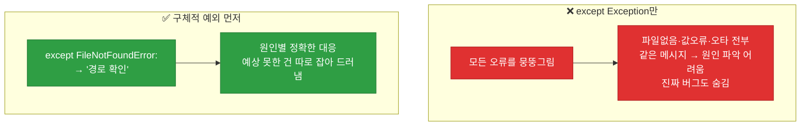
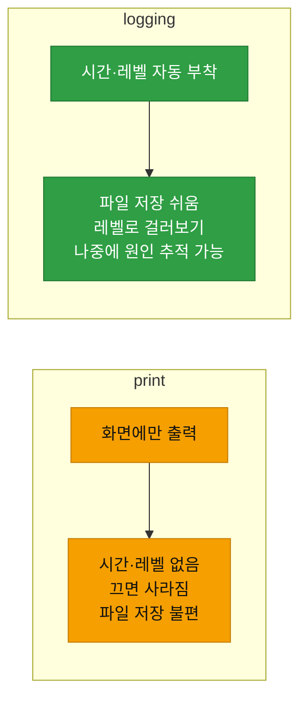
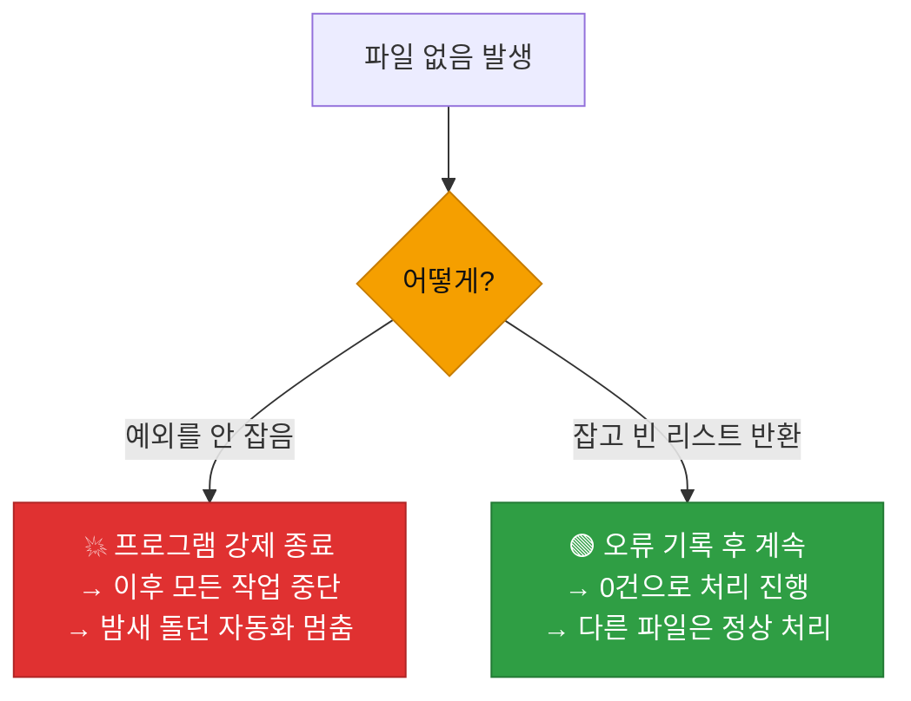

# 강의2 · 예외처리와 로깅 (오후, 총 120분)

> **이 교시 한 문장:** 파일이 없거나 값이 이상해도 **프로그램이 죽지 않게(try/except)** 만들고, `print` 대신 **logging** 으로 시간·레벨과 함께 기록을 남겨, "사람이 안 봐도 돌아가는" 자동화의 기본기를 갖춥니다.

| 시간 | 소주제 | 핵심 한 줄 |
|------|--------|-----------|
| 00-30분 | 예외처리 (try/except/finally) | 에러가 나도 안 죽게 |
| 30-60분 | logging 모듈 기초 | print 대신 기록 남기기 |
| 60-90분 | RotatingFileHandler | 로그 파일 무한 증가 방지 |
| 90-110분 | 예외+로깅 결합 파서 | 안전한 로그 파서 완성 |
| 110-120분 | 실습 안내 | 죽지 않는 파서 만들기 |

## 이 교시에 나오는 어려운 용어

| 용어 (한글발음) | 한 줄 뜻 (아주 쉽게) | 비유 |
|----------------|----------------------|------|
| **예외(exception, 익셉션)** | 실행 중 발생하는 오류 | 돌발 사고 |
| **`try`(트라이)** | "위험한 코드 시도" | 조심조심 해봄 |
| **`except`(익셉트)** | "오류 나면 이걸 해라" | 사고 대응 |
| **`finally`(파이널리)** | "성공·실패 상관없이 항상" | 마무리 청소 |
| **FileNotFoundError** | 파일 없음 오류 | 없는 서류 찾기 |
| **ValueError** | 값이 잘못됨 오류 | 규격 미달 |
| **로깅(logging)** | 실행 기록을 남김 | 작업 일지 |
| **로그 레벨(log level)** | 기록의 중요도 등급 | 정보/경고/오류 |
| **핸들러(handler)** | 로그를 어디에 보낼지 | 우편 배달부 |
| **rotate(로테이트)** | 파일을 갈아끼움 | 새 공책으로 |
| **`as e`(애즈 이)** | 오류 정보를 e에 담기 | 사고 경위서 |
| **graceful(그레이스풀)** | 우아하게(안 죽고) 대응 | 부드러운 착륙 |

---

## ⏱️ 00-30분 · 예외처리 (try/except/finally)

!!! abstract "이 블록을 마치면"
    ✔ 에러가 나도 프로그램이 멈추지 않게 하고 ✔ ==구체적인 예외를 잡는== 습관을 안다

### 🐍 문법 상자 — try / except

!!! tip "🐍 위험한 코드를 감싸기"
    ```python
    try:
        with open('missing.csv', encoding='utf-8') as f:
            data = f.read()
    except FileNotFoundError:                 # 파일 없음 오류일 때
        print('파일이 없습니다. 경로를 확인하세요.')
    except Exception as e:                     # 그 밖의 모든 오류일 때
        print(f'예상치 못한 오류: {e}')        # e에 오류 내용이 담김
    ```

    - **`try:`** 안 = "오류가 날 수 있는 위험한 코드".
    - **`except 오류종류:`** = 그 오류가 나면 실행할 대응.
    - **`as e`** = 오류의 상세 정보를 변수 `e`에 담아 활용.
    - try 안에서 오류가 나면, 프로그램이 멈추는 대신 **해당 except로 점프**합니다.

### 🐍 문법 상자 — finally

!!! tip "🐍 finally — 항상 실행"
    ```python
    try:
        f = open('data.csv', encoding='utf-8')
        data = f.read()
    except FileNotFoundError:
        print('파일 없음')
    finally:
        print('처리 종료')     # 성공하든 실패하든 항상 실행
    ```

    - `finally`는 **성공·실패와 무관하게 항상** 실행됩니다(뒷정리용).
    - 단, `with`를 쓰면 파일 닫기는 자동이라 finally를 파일 닫기에 쓸 일은 줄어듭니다.

### 🔬 깊이 보기 — 구체적 예외 vs 넓은 예외



`except Exception`으로 **모든 오류를 한 번에** 잡으면 편해 보이지만, "파일이 없어서인지, 값이 이상해서인지, 코드에 오타가 있는지"를 **구분 못 합니다.** 심지어 진짜 버그(오타 등)까지 조용히 삼켜 숨겨버리죠. **예상되는 오류는 구체적으로**(FileNotFoundError) 잡아 정확히 대응하고, 정말 예상 못한 것만 넓게(`Exception`) 잡아 **드러내는** 게 안전합니다.

!!! warning "🎓 강사 뷰 · except 순서"
    - 구체적 예외(`FileNotFoundError`)를 **먼저**, 넓은 예외(`Exception`)를 **나중에** 둡니다. 순서가 반대면 넓은 게 다 잡아버려 구체적 except가 무의미해집니다.

!!! question "확인질문"
    **Q. `except Exception`만 넓게 잡는 것과 `except FileNotFoundError`로 구체적으로 잡는 것, 실무에서는 왜 후자가 더 안전할까요?**

    **A.** **오류의 원인을 정확히 구분해 대응할 수 있고, 예상 못한 진짜 버그를 숨기지 않기 때문**입니다.

    `except Exception`은 모든 오류를 한꺼번에 잡습니다. 편해 보이지만, 파일이 없어서 난 오류인지, 값이 잘못돼서 난 오류인지, 아니면 코드 오타 같은 진짜 버그인지 구분하지 못하고 전부 같은 메시지로 처리해 버립니다. 그러면 원인 파악이 어렵고, 고쳐야 할 버그마저 조용히 삼켜져 드러나지 않습니다. `FileNotFoundError`처럼 예상되는 오류를 구체적으로 잡으면 "경로를 확인하세요" 같은 정확한 안내를 할 수 있고, 정말 예상 못한 오류만 따로 드러나게 해 문제를 빨리 발견할 수 있습니다.

<div class="quiz">
<p class="quiz-q"><span class="tag">퀴즈</span><b><code>try</code> 블록 안에서 오류가 발생하면 어떻게 되는가?</b></p>
<button class="quiz-opt">프로그램이 즉시 종료된다</button>
<button class="quiz-opt" data-correct>해당 오류를 처리하는 <code>except</code> 블록으로 넘어간다</button>
<button class="quiz-opt">오류를 무시하고 다음 줄을 계속 실행한다</button>
<button class="quiz-opt">try 블록을 처음부터 다시 실행한다</button>
<div class="quiz-explain"><b>정답: 2번.</b> try 안에서 오류가 나면 프로그램이 멈추는 대신, 그 오류에 맞는 except 블록으로 점프해 대응 코드를 실행합니다. 이것이 "에러가 나도 죽지 않게" 하는 예외처리의 핵심입니다.</div>
<button class="quiz-retry">다시 풀기</button>
</div>

---

## ⏱️ 30-60분 · logging 모듈 기초

!!! abstract "이 블록을 마치면"
    ✔ `print` 대신 ==시간·레벨이 붙는 logging== 을 쓰는 이유를 안다

### 🐍 문법 상자 — logging 기본

!!! tip "🐍 logging 설정과 사용"
    ```python
    import logging

    # 기본 설정: 레벨과 출력 형식
    logging.basicConfig(
        level=logging.INFO,                              # INFO 이상만 기록
        format='%(asctime)s %(levelname)s %(message)s',  # 시간 레벨 메시지
    )

    logging.info('로그 파일 읽기 시작')       # 정보
    logging.warning('실패 로그 5건 이상 발견')  # 경고
    logging.error('파일을 찾을 수 없음')       # 오류
    # 2026-07-07 09:12:00 INFO 로그 파일 읽기 시작
    # 2026-07-07 09:12:00 WARNING 실패 로그 5건 이상 발견
    ```

    - `logging.info/warning/error(...)` : 메시지를 그 **레벨**로 기록.
    - `basicConfig`의 `format`이 **시간·레벨을 자동으로** 앞에 붙여줍니다.

### 🐍 문법 상자 — 로그 레벨 5단계

!!! tip "🐍 레벨의 의미"
    | 레벨 | 언제 | 예 |
    |------|------|-----|
    | `DEBUG` | 상세 디버깅 | 변수값 추적 |
    | `INFO` | 정상 진행 | "읽기 시작" |
    | `WARNING` | 주의 필요 | "실패 5건" |
    | `ERROR` | 오류 발생 | "파일 없음" |
    | `CRITICAL` | 치명적 | "시스템 중단" |

    - `level=logging.INFO`로 설정하면 **INFO 이상**(INFO·WARNING·ERROR·CRITICAL)만 기록되고 DEBUG는 무시됩니다.
    - 4과목 SIEM의 로그·이벤트·알림 계층과도 통하는 "중요도 등급" 개념입니다.

### 🔬 깊이 보기 — print vs logging



`print`는 화면에 잠깐 보이고 끝입니다 — **언제·얼마나 심각한지** 기록이 없고, 파일로 남기기도 번거롭죠. `logging`은 **시간·레벨을 자동으로** 붙이고, 설정만 바꾸면 **파일로 저장**되며, "ERROR만 보여줘"처럼 **레벨로 걸러** 볼 수 있습니다. 자동화는 사람이 실시간으로 안 보므로, **나중에 무슨 일이 있었는지 되짚을 기록**이 필수입니다.

!!! question "확인질문"
    **Q. `print`와 `logging.info`의 차이는 나중에 로그 파일로 저장할 때 왜 중요해질까요?**

    **A.** **`logging`은 시간·레벨과 함께 파일에 체계적으로 저장할 수 있지만, `print`는 화면에 잠깐 보이고 사라지기 때문**입니다.

    자동화 스크립트는 사람이 실시간으로 지켜보지 않고 돌아갑니다. 그래서 나중에 "언제 무슨 일이 있었는지"를 되짚을 기록이 반드시 필요합니다. `print`는 화면에만 출력되어 창을 닫으면 사라지고, 시각이나 심각도 정보도 없습니다. 반면 `logging`은 각 기록에 시간과 레벨(INFO/WARNING/ERROR)을 자동으로 붙이고, 설정만 바꾸면 파일에 저장됩니다. 그래서 문제가 생겼을 때 로그 파일을 열어 "몇 시에 어떤 경고·오류가 있었는지"를 추적할 수 있어, 디버깅과 운영에 훨씬 유리합니다.

<div class="quiz">
<p class="quiz-q"><span class="tag">퀴즈</span><b><code>logging.basicConfig(level=logging.INFO)</code>로 설정했을 때 기록되지 <b>않는</b> 것은?</b></p>
<button class="quiz-opt"><code>logging.warning(...)</code></button>
<button class="quiz-opt"><code>logging.error(...)</code></button>
<button class="quiz-opt" data-correct><code>logging.debug(...)</code></button>
<button class="quiz-opt"><code>logging.info(...)</code></button>
<div class="quiz-explain"><b>정답: 3번.</b> INFO로 설정하면 INFO 이상(INFO·WARNING·ERROR·CRITICAL)만 기록되고, 그보다 낮은 DEBUG는 무시됩니다. 레벨을 DEBUG로 낮추면 debug도 기록됩니다.</div>
<button class="quiz-retry">다시 풀기</button>
</div>

---

## ⏱️ 60-90분 · RotatingFileHandler로 로그 파일 관리

!!! abstract "이 블록을 마치면"
    ✔ ==로그 파일이 무한정 커지지 않게== 회전시키는 법을 안다

### 🐍 문법 상자 — RotatingFileHandler

!!! tip "🐍 로그 파일 자동 회전"
    ```python
    import logging
    from logging.handlers import RotatingFileHandler

    handler = RotatingFileHandler(
        'agent.log',           # 로그 파일 이름
        maxBytes=1_000_000,    # 파일이 1MB 넘으면
        backupCount=5,         # 최대 5개까지 백업 보관
        encoding='utf-8',
    )
    logging.basicConfig(level=logging.INFO, handlers=[handler])
    ```

    - **`maxBytes`** : 파일이 이 크기를 넘으면 **새 파일로 회전(rotate)**.
    - **`backupCount`** : 옛 파일을 몇 개까지 보관할지(넘으면 가장 오래된 것 삭제).
    - 밑줄 `1_000_000` : 큰 숫자를 읽기 쉽게(= 1000000). 파이썬 문법.

### 🔬 깊이 보기 — 로그 파일이 무한히 커지면


자동화는 24시간 로그를 쌓습니다. 관리 안 하면 로그 파일이 **수 GB**로 불어나 디스크를 꽉 채우고, 너무 커서 열어보기도 힘들어집니다. `RotatingFileHandler`는 파일이 일정 크기를 넘으면 **새 파일로 갈아끼우고**(agent.log → agent.log.1 → …), 정해진 개수만 남겨 **디스크를 안전하게** 지킵니다.

!!! question "확인질문"
    **Q. 로그 파일이 계속 커지기만 하면 어떤 문제가 생길까요? `RotatingFileHandler`는 이를 어떻게 해결하나요?**

    **A.** **문제: 디스크가 가득 차고 파일이 너무 커져 다루기 힘들어집니다. 해결: 일정 크기마다 파일을 갈아끼우고 개수를 제한합니다.**

    자동화 스크립트는 쉬지 않고 로그를 남기므로, 관리하지 않으면 로그 파일이 수 GB까지 불어납니다. 그러면 디스크 공간이 부족해져 다른 프로그램까지 영향을 받고, 파일이 너무 커서 열어 확인하기도 어려워집니다. `RotatingFileHandler`는 `maxBytes`로 정한 크기(예: 1MB)를 넘으면 현재 파일을 백업(agent.log.1 등)으로 넘기고 새 파일에 기록을 이어가며, `backupCount`로 정한 개수(예: 5개)를 넘는 오래된 백업은 자동으로 삭제합니다. 그래서 전체 로그 용량이 일정 수준으로 유지되어 디스크가 안전합니다.

<div class="quiz">
<p class="quiz-q"><span class="tag">퀴즈</span><b><code>RotatingFileHandler(maxBytes=1_000_000, backupCount=5)</code>의 <code>backupCount=5</code>의 의미는?</b></p>
<button class="quiz-opt">로그를 5초마다 저장한다</button>
<button class="quiz-opt" data-correct>회전된 옛 로그 파일을 최대 5개까지 보관하고, 넘으면 오래된 것을 삭제한다</button>
<button class="quiz-opt">로그를 5줄까지만 기록한다</button>
<button class="quiz-opt">5MB마다 회전한다</button>
<div class="quiz-explain"><b>정답: 2번.</b> `backupCount`는 보관할 백업 파일 개수입니다. maxBytes(크기)를 넘으면 회전하고, backupCount를 넘는 오래된 백업은 삭제해 전체 용량을 제한합니다.</div>
<button class="quiz-retry">다시 풀기</button>
</div>

---

## ⏱️ 90-110분 · 예외처리 + 로깅 결합 로그 파서

!!! abstract "이 블록을 마치면"
    ✔ 파일IO·예외·로깅을 ==하나로 합친 안전한 파서==를 이해한다

### 💻 코드 완전 해부 — `parse_logs()`

```python
import csv
import logging

def parse_logs(filepath):
    try:
        with open(filepath, encoding='utf-8') as f:        # ① 파일 열기
            reader = csv.DictReader(f)                       # ② CSV 읽기
            rows = list(reader)                             # ③ 전부 리스트로
            logging.info(f'{filepath} 읽기 완료 - {len(rows)}건')  # ④ 기록
            return rows                                     # ⑤ 결과 반환
    except FileNotFoundError:                               # ⑥ 파일 없으면
        logging.error(f'{filepath} 파일을 찾을 수 없음')      # ⑦ 오류 기록
        return []                                          # ⑧ 빈 리스트 반환
```

| 줄 | 하는 일 | 왜 |
|:--:|---------|-----|
| **①②③** | 파일 열어 CSV를 리스트로 | with로 안전하게, DictReader로 딕셔너리 |
| **④** | 성공을 **로그로** 기록 | "몇 건 읽었나" 추적 |
| **⑤** | 읽은 데이터 반환 | 다음 단계로 |
| **⑥⑦** | 파일 없으면 **오류 기록** | 원인을 남김 |
| **⑧** | **빈 리스트 반환**(멈추지 않음) | 파이프라인이 계속 돌게 |

**핵심은 ⑧입니다.** 파일이 없어도 프로그램을 죽이지 않고 **빈 리스트를 돌려줘**, 뒤 단계가 "0건 처리"로 자연스럽게 이어집니다. 이게 자동화에 안전한 "우아한 실패(graceful)"입니다.

### 🔬 깊이 보기 — 죽이기 vs 빈 결과 반환



파일 하나가 없다고 **전체 자동화가 멈추면** 안 됩니다. 100개 파일 중 1개가 없을 때, 나머지 99개는 처리돼야죠. 빈 리스트를 반환하면 "그 파일은 0건"으로 넘어가고 **로그에 원인이 남아** 나중에 확인할 수 있습니다. 단, "조용히 넘기기"와 다릅니다 — **반드시 로그로 남깁니다.**

!!! question "확인질문"
    **Q. 파일이 없을 때 빈 리스트를 반환하는 것과 프로그램을 강제 종료하는 것, 자동화 파이프라인에는 어느 쪽이 안전할까요?**

    **A.** **빈 리스트를 반환하는 쪽(오류를 기록하고 계속 진행하는 쪽)이 안전합니다.**

    자동화 파이프라인은 여러 파일·단계를 이어서 처리합니다. 만약 파일 하나가 없다고 프로그램을 강제 종료하면, 그 뒤에 처리해야 할 나머지 파일과 작업이 전부 중단됩니다. 밤새 돌아야 할 자동화가 파일 하나 때문에 멈추는 것이죠. 반대로 예외를 잡아 오류를 로그로 남기고 빈 리스트를 반환하면, 그 파일은 "0건 처리"로 넘어가고 다른 파일들은 정상적으로 계속 처리됩니다. 중요한 것은 그냥 조용히 넘기지 않고 반드시 `logging.error`로 원인을 남겨, 나중에 왜 그 파일이 비었는지 확인할 수 있게 하는 것입니다.

<div class="quiz">
<p class="quiz-q"><span class="tag">퀴즈</span><b>자동화용 <code>parse_logs()</code>가 파일 없음 오류에서 <code>return []</code>(빈 리스트)을 하되 <code>logging.error</code>도 함께 남기는 이유는?</b></p>
<button class="quiz-opt">빈 리스트가 파일을 자동 생성해서</button>
<button class="quiz-opt" data-correct>전체 파이프라인을 멈추지 않고 계속 진행하되, 나중에 원인을 추적할 수 있게 기록을 남기려고</button>
<button class="quiz-opt">로그를 남기면 파일이 복구되어서</button>
<button class="quiz-opt">빈 리스트는 오류를 자동으로 고쳐서</button>
<div class="quiz-explain"><b>정답: 2번.</b> 빈 리스트 반환으로 파이프라인은 계속 돌고, logging.error로 "왜 비었는지" 흔적을 남깁니다. '계속 진행'과 '기록'을 모두 챙기는 게 자동화의 안전한 실패 처리입니다.</div>
<button class="quiz-retry">다시 풀기</button>
</div>

!!! tip "🧠 파인만 자가진단"
    안 보고 말할 수 있으면 통과입니다.

    1. try/except가 프로그램을 어떻게 살리는지
    2. 구체적 예외를 넓은 예외보다 먼저 잡는 이유
    3. print 대신 logging을 쓰는 이유
    4. RotatingFileHandler가 해결하는 문제
    5. 파일 없음에 빈 리스트+로그를 남기는 이유

---

## ⏱️ 110-120분 · 실습 안내

**오후 정리:**

1. **try/except** — 위험한 코드를 감싸 죽지 않게, **구체적 예외 먼저**
2. **logging** — print 대신 시간·레벨과 함께 기록(파일 저장·레벨 필터)
3. **RotatingFileHandler** — 로그 파일 무한 증가 방지(회전·개수 제한)
4. **결합 파서** — 파일IO+예외+로깅, 파일 없어도 **빈 리스트+로그**로 계속

!!! note "실습 예고 (오후 실습 120분)"
    `sample_logs.csv`를 만들고, `log_parser.py`의 `parse_logs()`를 try/except·logging·RotatingFileHandler로 완성합니다. 일부러 잘못된 경로를 넣어 예외처리가 동작하는지 테스트합니다. 상세는 [실습 페이지](practice.md).

---

## ✅ 가르칠 준비 체크리스트 (강의2)

- [ ] try/except가 오류 시 어디로 점프하는지 설명한다
- [ ] 구체적 예외를 먼저 잡는 이유와 except 순서를 설명한다
- [ ] print vs logging의 차이를 설명한다
- [ ] 로그 레벨 5단계와 level 설정을 설명한다
- [ ] RotatingFileHandler의 maxBytes·backupCount를 설명한다
- [ ] 결합 파서의 빈 리스트+로그 반환을 설명한다
- [ ] 확인질문 5개 + 퀴즈에 답한다

*[exception]: 예외 — 실행 중 발생하는 오류
*[logging]: 파이썬 표준 로그 기록 모듈
*[RotatingFileHandler]: 크기 기준으로 로그 파일을 회전시키는 핸들러
*[graceful]: 오류에도 우아하게(중단 없이) 대응하는 방식
