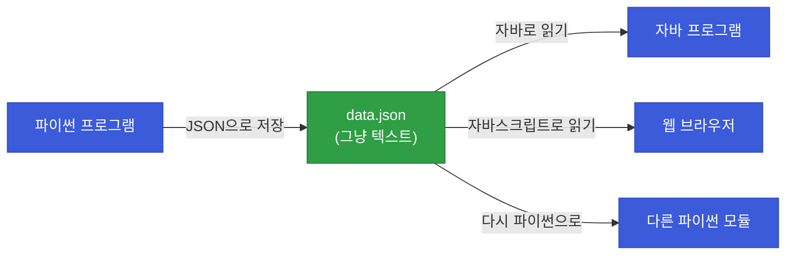
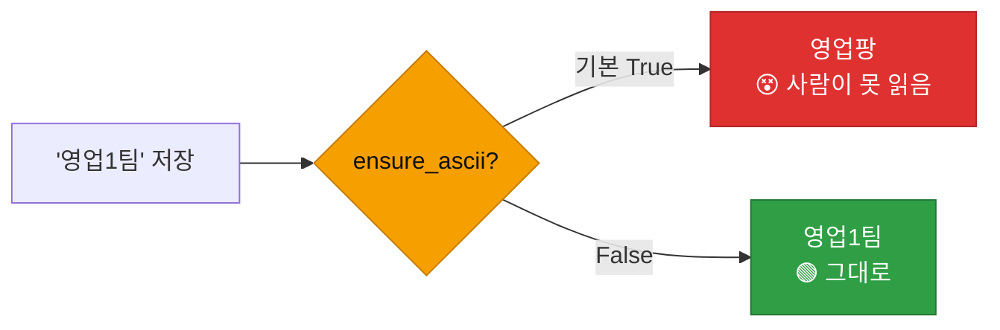
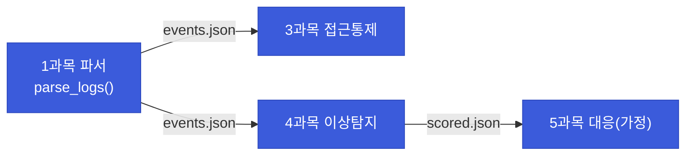

# 강의1 · 자료구조 심화와 JSON (오전, 총 120분)

> **이 교시 한 문장:** 리스트·딕셔너리가 **겹쳐진 중첩 구조**를 대괄호로 파고들고, **JSON**으로 데이터를 파일에 저장·교환하며, 필수 필드가 빠지지 않았는지 확인하는 습관을 익힙니다.

| 시간 | 소주제 | 핵심 한 줄 |
|------|--------|-----------|
| 00-20분 | 중첩 자료구조 | 대괄호를 이어 파고들기 |
| 20-45분 | JSON이란 무엇인가 | 데이터 교환 표준 포맷 |
| 45-75분 | json 모듈 (load/dump) | 파일↔객체, 문자열↔객체 |
| 75-100분 | 로그 파서 JSON 확장 | 모듈 간 JSON으로 주고받기 |
| 100-120분 | 필수 필드 체크 | 빠진 항목 잡아내기 |

## 이 교시에 나오는 어려운 용어

| 용어 (한글발음) | 한 줄 뜻 (아주 쉽게) | 비유 |
|----------------|----------------------|------|
| **중첩(nested, 네스티드)** | 자료구조 안에 또 자료구조 | 상자 안의 상자 |
| **체이닝(chaining)** | 대괄호를 이어 붙임 | 서랍 안 서랍 열기 |
| **JSON(제이슨)** | 데이터 교환 표준 글자 형식 | 만국공통 데이터 서식 |
| **직렬화(serialize)** | 객체 → 저장용 문자열 | 짐을 상자에 포장 |
| **역직렬화(deserialize)** | 문자열 → 객체 | 상자 풀기 |
| **`json.dump`(덤프)** | 객체를 JSON 파일로 저장 | 파일에 담기 |
| **`json.load`(로드)** | JSON 파일을 객체로 읽기 | 파일에서 꺼내기 |
| **`dumps/loads`(에스)** | 파일 아닌 '문자열'과 변환 | 메모리에서 변환 |
| **`indent`(인덴트)** | 들여쓰기로 예쁘게 | 문단 정리 |
| **`ensure_ascii`** | 한글 안 깨지게 | 한글 라벨 유지 |
| **`in` 연산자** | 포함 여부 확인 | "안에 있나?" |
| **`null`/`None`** | 값 없음 | 빈칸 |

---

## ⏱️ 00-20분 · 중첩 자료구조

!!! abstract "이 블록을 마치면"
    ✔ ==딕셔너리 안의 딕셔너리·리스트를 대괄호로 파고드는== 법을 안다

### 🐍 문법 상자 — 중첩과 대괄호 체이닝

!!! tip "🐍 상자 안의 상자 열기"
    ```python
    event = {
        'id': 'evt-1001',
        'user': {'name': 'kim01', 'dept': '영업1팀'},   # 딕셔너리 안의 딕셔너리
        'tags': ['login_failed', 'unusual_location'],   # 딕셔너리 안의 리스트
    }

    print(event['user'])            # {'name': 'kim01', 'dept': '영업1팀'}
    print(event['user']['dept'])    # 영업1팀   ← 대괄호를 이어서!
    print(event['tags'][0])         # login_failed   ← 리스트는 번호로
    ```

    - **한 겹씩 벗깁니다.** `event['user']`가 딕셔너리 → 거기에 `['dept']`를 또 붙임.
    - 딕셔너리는 **키**(`['dept']`), 리스트는 **번호**(`[0]`)로 꺼냅니다.
    - 대괄호를 **이어 붙이는(체이닝)** 게 핵심. "서랍 안의 서랍"을 순서대로 여는 것.

### 🐍 문법 상자 — `in` 연산자: 포함 여부

!!! tip "🐍 in — 안에 있나?"
    ```python
    tags = ['login_failed', 'unusual_location']

    print('unusual_location' in tags)   # True   ← 리스트에 있나?
    print('malware' in tags)            # False

    log = {'user': 'kim01', 'event': 'login_failed'}
    print('user' in log)                # True   ← 딕셔너리는 '키'가 있나?
    print('kim01' in log)               # False  ← 값이 아니라 키를 봄!
    ```

    - **리스트**에 `in` : 그 **값이 있나**?
    - **딕셔너리**에 `in` : 그 **키가 있나**? (값이 아니라 키!)
    - `if 'x' in 목록:`처럼 조건문에 바로 씁니다.

!!! example "🎓 강사 뷰 · 실무 데이터는 다 중첩"
    *"API·로그 데이터는 거의 다 이렇게 겹쳐 있습니다. `data['results'][0]['user']['name']`처럼 깊이 파고들죠. 한 겹씩 `print`해서 '지금 이게 딕셔너리야 리스트야?'를 확인하며 내려가는 습관을 알려주세요. 3·4과목의 `detail` 주머니, JSON 응답이 다 중첩입니다."*

!!! question "확인질문"
    **Q. `event['tags']`에 `'unusual_location'`이 포함되어 있는지 확인하려면 어떤 연산자를 쓸까요?**

    **A.** **`in` 연산자**를 씁니다.

    `event['tags']`는 `['login_failed', 'unusual_location']`이라는 리스트입니다. 리스트에 특정 값이 들어 있는지 확인할 때는 `'unusual_location' in event['tags']`처럼 `in` 연산자를 쓰면 `True`(있음) 또는 `False`(없음)를 돌려줍니다. 이걸 `if 'unusual_location' in event['tags']:`처럼 조건문에 바로 넣어 "이 태그가 있으면 이렇게 처리"하는 식으로 활용합니다.

<div class="quiz">
<p class="quiz-q"><span class="tag">퀴즈</span><b><code>event = {'user': {'dept': '영업1팀'}}</code>에서 <code>'영업1팀'</code>을 꺼내는 코드는?</b></p>
<button class="quiz-opt"><code>event['dept']</code></button>
<button class="quiz-opt" data-correct><code>event['user']['dept']</code></button>
<button class="quiz-opt"><code>event['user', 'dept']</code></button>
<button class="quiz-opt"><code>event.user.dept</code></button>
<div class="quiz-explain"><b>정답: 2번.</b> user 안에 dept가 중첩돼 있으므로 대괄호를 이어 붙입니다: `event['user']['dept']`. 먼저 `event['user']`로 안쪽 딕셔너리를 꺼내고, 거기에 `['dept']`를 또 붙이는 체이닝입니다.</div>
<button class="quiz-retry">다시 풀기</button>
</div>

---

## ⏱️ 20-45분 · JSON이란 무엇인가

!!! info "📘 학습자 뷰 · 처음 보는 나"
    **JSON(제이슨)** 은 데이터를 주고받는 **만국공통 글자 형식**입니다. 웹·API·로그 시스템이 거의 다 JSON을 씁니다. 생김새가 파이썬 딕셔너리와 **거의 똑같습니다.**

    ```json
    {
      "user": "kim01",
      "failed": 7,
      "is_alert": true,
      "note": null
    }
    ```

### 🐍 문법 상자 — JSON vs 파이썬 표기 차이

!!! tip "🐍 헷갈리는 3가지 차이"
    | 의미 | JSON | 파이썬 |
    |------|------|--------|
    | 참 | `true` | `True` |
    | 거짓 | `false` | `False` |
    | 값 없음 | `null` | `None` |
    | 문자열 따옴표 | **큰따옴표만** `"..."` | `'...'` 또는 `"..."` |

    - JSON은 **소문자** `true/false/null`, 파이썬은 **첫 글자 대문자** `True/False/None`.
    - JSON 문자열은 **반드시 큰따옴표**. 파이썬은 작은/큰따옴표 다 됨.
    - `json` 모듈이 이 변환을 **자동으로** 해주니 외울 필요는 없지만, 눈으로 구분은 해야 합니다.

### 🔬 깊이 보기 — 왜 JSON이 표준이 됐나



JSON은 **언어에 상관없는** 텍스트 형식입니다. 파이썬이 저장한 JSON을 자바·자바스크립트·다른 파이썬 모듈이 다 읽을 수 있죠. 그래서 서로 다른 시스템이 데이터를 주고받는 **공용어**가 됐습니다. 3·4과목에서 모듈끼리 `normalized_events.json` 등으로 데이터를 넘긴 게 다 이 덕분입니다.

!!! question "확인질문"
    **Q. JSON에서는 `true`인데 파이썬에서는 왜 `True`로 써야 할까요?**

    **A.** **JSON과 파이썬은 서로 다른 표기 규칙을 가진 별개의 형식이기 때문**입니다.

    JSON은 데이터 교환용 표준 형식으로, 참을 소문자 `true`로 적도록 정해져 있습니다. 반면 파이썬은 프로그래밍 언어로, 참을 첫 글자 대문자 `True`로 씁니다(마찬가지로 `false`↔`False`, `null`↔`None`). 파이썬 코드 안에서 `true`라고 쓰면 "그런 이름이 없다"는 NameError가 납니다. 다행히 `json` 모듈이 저장·읽기 과정에서 `True`↔`true`를 자동으로 변환해 주므로, 우리는 파이썬 코드에선 `True`를, JSON 파일에선 `true`를 보게 되는 것뿐입니다.

<div class="quiz">
<p class="quiz-q"><span class="tag">퀴즈</span><b>JSON에서 '값 없음'을 나타내는 표기는?</b></p>
<button class="quiz-opt"><code>None</code></button>
<button class="quiz-opt"><code>nil</code></button>
<button class="quiz-opt" data-correct><code>null</code></button>
<button class="quiz-opt"><code>empty</code></button>
<div class="quiz-explain"><b>정답: 3번.</b> JSON은 값 없음을 `null`로 씁니다. 파이썬은 `None`이죠. json 모듈이 `None`↔`null`을 자동 변환합니다. `nil`은 다른 언어(Ruby 등) 표기입니다.</div>
<button class="quiz-retry">다시 풀기</button>
</div>

---

## ⏱️ 45-75분 · json 모듈 (loads/dumps, load/dump)

!!! abstract "이 블록을 마치면"
    ✔ ==객체를 JSON으로 저장/읽기==하고 ✔ `indent`·`ensure_ascii`를 안다

### 🐍 문법 상자 — 4개 함수, s가 있고 없고

!!! tip "🐍 load/dump (파일) vs loads/dumps (문자열)"
    ```python
    import json

    events = [{'user': 'kim01', 'event': 'login_failed'}]

    # ── 파일과 변환 (s 없음) ──
    with open('result.json', 'w', encoding='utf-8') as f:
        json.dump(events, f, indent=2, ensure_ascii=False)   # 객체 → 파일

    with open('result.json', encoding='utf-8') as f:
        loaded = json.load(f)                                 # 파일 → 객체

    # ── 문자열과 변환 (s 있음) ──
    text = json.dumps(events, ensure_ascii=False)   # 객체 → 문자열
    back = json.loads(text)                          # 문자열 → 객체
    ```

    | 함수 | 방향 | 대상 |
    |------|------|------|
    | `json.dump(객체, f)` | 객체 → **파일** | 파일 저장 |
    | `json.load(f)` | **파일** → 객체 | 파일 읽기 |
    | `json.dumps(객체)` | 객체 → **문자열** | 메모리/전송 |
    | `json.loads(문자열)` | **문자열** → 객체 | 받은 텍스트 파싱 |

    - **`s` = string(문자열)** 기억법: `dumps`/`loads`는 문자열, `dump`/`load`는 파일.
    - `dump`(덤프)=내보내기(저장), `load`(로드)=불러오기(읽기).

### 🐍 문법 상자 — indent와 ensure_ascii

!!! tip "🐍 저장 옵션 2개 (필수!)"
    ```python
    json.dump(events, f, indent=2, ensure_ascii=False)
    ```

    - **`indent=2`** : 들여쓰기 2칸으로 **예쁘게** 저장(사람이 읽기 좋게). 없으면 한 줄로 뭉침.
    - **`ensure_ascii=False`** : **한글이 안 깨지게**. 없으면(기본 True) 한글이 `영업`처럼 저장됨.

    > 이 두 옵션은 3·4과목에서도 계속 나왔죠. JSON 저장할 땐 거의 항상 이 둘을 씁니다.

### 🔬 깊이 보기 — ensure_ascii를 빼면?



`ensure_ascii`의 기본값은 `True`인데, 이러면 한글을 `\uXXXX`라는 **유니코드 이스케이프**로 저장합니다. 컴퓨터는 읽지만 사람 눈엔 암호죠. `False`로 두면 '영업1팀'이 그대로 저장돼 파일을 열어 확인·감사하기 좋습니다.

!!! question "확인질문"
    **Q. `ensure_ascii=False`를 빼먹으면 저장된 파일에서 한글이 어떻게 보일까요?**

    **A.** **`\uXXXX` 형태의 유니코드 이스케이프로 깨져 보입니다.**

    `ensure_ascii`의 기본값은 `True`인데, 이 경우 한글 같은 비영어 문자를 `영업팡`처럼 유니코드 코드값으로 변환해 저장합니다. 컴퓨터는 이 값을 다시 한글로 읽을 수 있지만, 사람이 파일을 직접 열어 보면 암호처럼 보여 내용을 알아볼 수 없습니다. `ensure_ascii=False`를 주면 '영업1팀' 같은 한글이 원문 그대로 저장되어, 사람이 파일을 열어 확인하거나 감사할 때 편합니다.

<div class="quiz">
<p class="quiz-q"><span class="tag">퀴즈</span><b>파이썬 객체를 <b>파일</b>에 JSON으로 저장하는 함수는?</b></p>
<button class="quiz-opt"><code>json.dumps</code></button>
<button class="quiz-opt" data-correct><code>json.dump</code></button>
<button class="quiz-opt"><code>json.loads</code></button>
<button class="quiz-opt"><code>json.load</code></button>
<div class="quiz-explain"><b>정답: 2번.</b> `dump`(s 없음)는 파일에 저장, `dumps`(s 있음)는 문자열로 변환입니다. load/loads는 반대로 읽기죠. s=string(문자열)로 기억하면 파일용(load/dump)과 문자열용(loads/dumps)이 구분됩니다.</div>
<button class="quiz-retry">다시 풀기</button>
</div>

---

## ⏱️ 75-100분 · 로그 파서를 JSON 저장 기능으로 확장

!!! info "📘 학습자 뷰 · 처음 보는 나"
    Day2에서 만든 파서 결과를 이제 **JSON 파일로 저장**합니다. 그러면 다른 모듈이 그 파일을 읽어 이어서 작업할 수 있죠.

### 💻 코드 조각 — save_as_json

```python
import json

def save_as_json(events, filepath):
    with open(filepath, 'w', encoding='utf-8') as f:
        json.dump(events, f, indent=2, ensure_ascii=False)
    # 이제 events가 filepath에 JSON으로 저장됨
```

### 🔬 깊이 보기 — 모듈 간 JSON 데이터 교환



각 모듈이 JSON 파일로 데이터를 주고받으면, **서로의 내부를 몰라도** 됩니다. "JSON이라는 약속된 형식"만 지키면 되니까요. 파서는 저장만, 탐지 모듈은 읽기만 — 느슨하게 연결돼 각자 독립적으로 개선할 수 있습니다.

!!! question "확인질문"
    **Q. 왜 여러 모듈(접근통제/이상탐지/SOAR)이 서로 JSON으로 데이터를 주고받으면 편리할까요?**

    **A.** **언어·모듈에 상관없이 통하는 표준 형식이라, 서로의 내부를 몰라도 데이터를 주고받을 수 있기 때문**입니다.

    JSON은 특정 프로그램에 종속되지 않은 공용 텍스트 형식입니다. 한 모듈이 결과를 JSON 파일로 저장하면, 다른 모듈은 그 파일을 읽기만 하면 됩니다. 저장하는 쪽이 어떻게 만들었는지, 읽는 쪽이 어떻게 쓸 것인지 서로 알 필요가 없고, "JSON이라는 약속된 형식"만 지키면 연결됩니다. 그래서 각 모듈을 독립적으로 개발·개선할 수 있고, 접근통제→이상탐지→대응처럼 데이터를 단계적으로 넘기는 파이프라인을 느슨하게 이어 붙일 수 있습니다.

<div class="quiz">
<p class="quiz-q"><span class="tag">퀴즈</span><b>모듈들이 JSON 파일로 데이터를 주고받는 방식의 장점은?</b></p>
<button class="quiz-opt">JSON은 실행 속도가 가장 빨라서</button>
<button class="quiz-opt" data-correct>언어·모듈에 무관한 표준 형식이라, 서로의 내부 구현을 몰라도 느슨하게 연결되어서</button>
<button class="quiz-opt">JSON은 자동으로 데이터를 암호화해서</button>
<button class="quiz-opt">JSON을 쓰면 함수가 필요 없어서</button>
<div class="quiz-explain"><b>정답: 2번.</b> JSON은 공용 형식이라 모듈 간 결합을 느슨하게 만듭니다. 저장하는 쪽과 읽는 쪽이 형식만 맞추면 되어, 각자 독립적으로 개선할 수 있습니다.</div>
<button class="quiz-retry">다시 풀기</button>
</div>

---

## ⏱️ 100-120분 · 필수 필드 체크 패턴

!!! abstract "이 블록을 마치면"
    ✔ ==꼭 있어야 할 필드가 빠졌는지 잡아내는== 패턴을 안다

### 💻 코드 조각 — 필수 필드 체크

```python
required_keys = ['id', 'user', 'event', 'timestamp']

# event에 없는 필수 키만 골라냄 (컴프리헨션 + in)
missing = [k for k in required_keys if k not in event]

if missing:                              # 빈 리스트가 아니면(누락 있으면)
    print(f'필수 필드 누락: {missing}')
```

- `k not in event` : event의 **키**에 k가 없으면 True(딕셔너리 in은 키 검사).
- `missing`이 비어 있지 않으면 → 누락된 필드가 있다는 뜻.
- `if missing:` : 빈 리스트는 거짓, 값이 있으면 참 (파이썬의 편리한 특성).

!!! tip "🐍 문법 상자 — 빈 컨테이너는 '거짓'"
    ```python
    if []:        # 빈 리스트 → 거짓 → 실행 안 됨
    if [1, 2]:    # 값 있는 리스트 → 참 → 실행
    if '':        # 빈 문자열 → 거짓
    if {}:        # 빈 딕셔너리 → 거짓
    ```
    파이썬은 **비어 있으면 거짓, 뭔가 있으면 참**으로 봅니다. 그래서 `if missing:`은 "누락이 하나라도 있으면"이라는 뜻이 됩니다. `len(missing) > 0`을 짧게 쓴 셈이죠.

!!! question "확인질문"
    **Q. 필수 필드가 없는 이벤트를 그냥 무시하는 것과 경고를 남기는 것, 어떤 차이가 있을까요?**

    **A.** **경고를 남기면 나중에 "왜 이 데이터가 빠졌는지"를 추적할 수 있지만, 그냥 무시하면 조용히 사라져 원인을 알 수 없습니다.**

    필수 필드가 빠진 이벤트를 아무 기록 없이 무시하면, 그 데이터는 소리 없이 사라집니다. 나중에 "전체 건수가 왜 안 맞지?"라는 의문이 생겨도 어디서 몇 건이 빠졌는지 알 방법이 없습니다. 반면 `missing` 필드를 경고(logging.warning 등)로 남기면, "어떤 이벤트의 어떤 필드가 없어서 걸렀는지"가 기록으로 남아 데이터 품질 문제를 추적하고 원인(예: 특정 로그 소스의 형식 오류)을 찾아 고칠 수 있습니다. Day1의 "건수 대조", Day2의 "graceful 실패"와 같은, 조용한 손실을 막는 원칙입니다.

<div class="quiz">
<p class="quiz-q"><span class="tag">퀴즈</span><b><code>if missing:</code>에서 <code>missing</code>이 빈 리스트 <code>[]</code>일 때 조건은?</b></p>
<button class="quiz-opt">참(True)으로 실행된다</button>
<button class="quiz-opt" data-correct>거짓(False)으로 실행되지 않는다</button>
<button class="quiz-opt">에러가 난다</button>
<button class="quiz-opt">항상 참이다</button>
<div class="quiz-explain"><b>정답: 2번.</b> 파이썬은 빈 리스트·빈 문자열·빈 딕셔너리를 거짓으로 봅니다. 그래서 `if missing:`은 "누락된 필드가 하나라도 있으면"이라는 뜻이 되어, 누락이 없으면(빈 리스트) 건너뜁니다.</div>
<button class="quiz-retry">다시 풀기</button>
</div>

!!! tip "🧠 파인만 자가진단"
    안 보고 말할 수 있으면 통과입니다.

    1. 중첩 구조에서 `event['user']['dept']`가 어떻게 파고드는지
    2. JSON과 파이썬의 true/True 차이
    3. dump/dumps/load/loads 네 함수의 차이(파일 vs 문자열)
    4. `ensure_ascii=False`의 효과
    5. `if missing:`이 빈 리스트에서 거짓인 이유

---

## ✅ 가르칠 준비 체크리스트 (강의1)

- [ ] 중첩 딕셔너리·리스트를 대괄호 체이닝으로 파고든다
- [ ] 리스트 in(값)과 딕셔너리 in(키) 차이를 설명한다
- [ ] JSON vs 파이썬 표기(true/True 등)를 설명한다
- [ ] dump/dumps/load/loads를 파일/문자열로 구분한다
- [ ] indent·ensure_ascii의 효과를 시연한다
- [ ] 필수 필드 체크와 빈 컨테이너=거짓을 설명한다
- [ ] 확인질문 5개 + 퀴즈에 답한다

*[JSON]: JavaScript Object Notation — 언어 독립 데이터 교환 형식
*[serialize]: 직렬화 — 객체를 저장·전송용 문자열로 변환
*[nested]: 중첩 — 자료구조 안에 또 자료구조가 든 것
