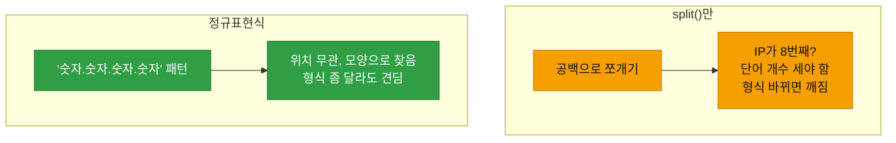
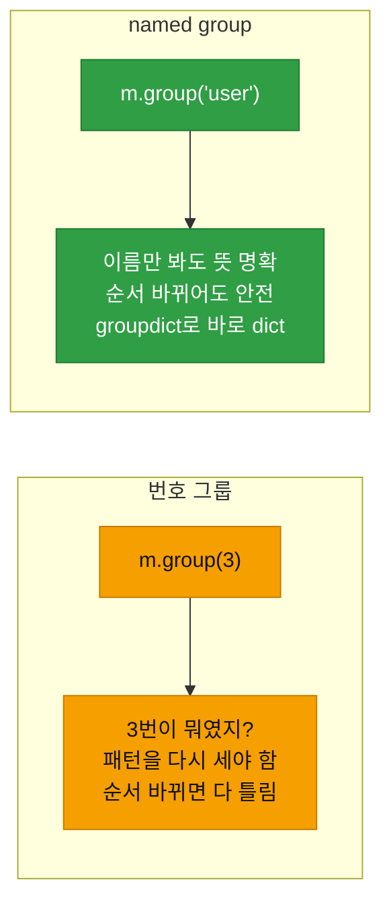
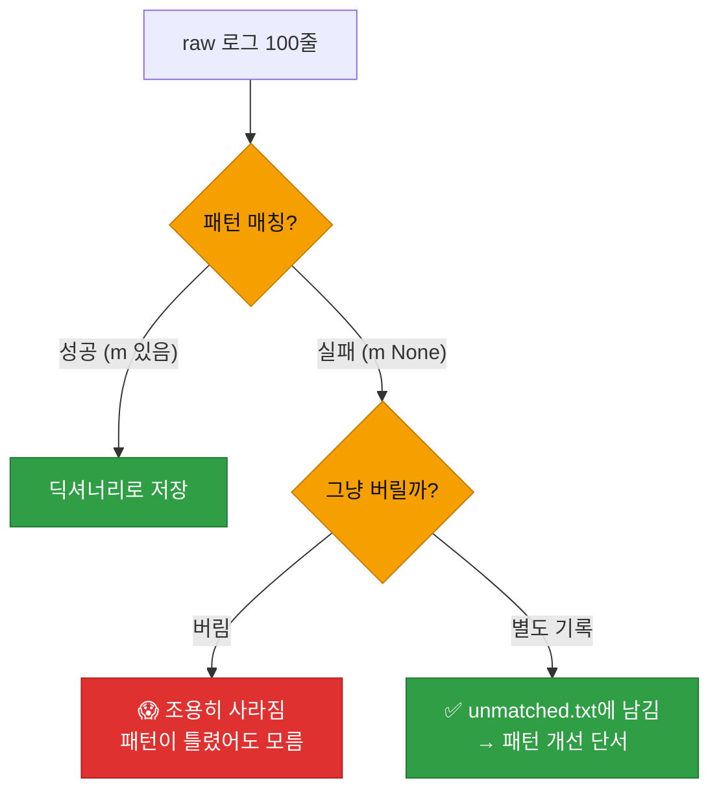

# 강의2 · 정규표현식(re) 기초 (오후, 총 120분)

> **이 교시 한 문장:** 구조 없는 raw 텍스트 로그에서 **패턴**으로 시간·사용자·IP를 뽑아내는 **정규표현식(정규식, regex)** 을 기호 하나씩 익혀, 비정형 로그를 정형 데이터로 바꿉니다.

| 시간 | 소주제 | 핵심 한 줄 |
|------|--------|-----------|
| 00-25분 | 정규식이 필요한 이유 | split만으론 한계 |
| 25-55분 | 기본 패턴 문법 | \d \w . * + ? {} |
| 55-85분 | 그룹핑과 named group | 여러 값 한 번에 |
| 85-110분 | 여러 줄 로그 일괄 처리 | 매칭 실패도 챙기기 |
| 110-120분 | 실습 안내 | 비정형→정형 JSON |

## 이 교시에 나오는 어려운 용어

| 용어 (한글발음) | 한 줄 뜻 (아주 쉽게) | 비유 |
|----------------|----------------------|------|
| **정규표현식(regex, 레지엑스)** | 문자열 패턴을 표현하는 규칙 | 검색 필터 규칙 |
| **패턴(pattern)** | 찾을 모양의 정의 | 수배 몽타주 |
| **`\d`(백슬래시 디)** | 숫자 하나 | 0~9 |
| **`\w`(백슬래시 더블유)** | 글자/숫자/밑줄 하나 | a-z, 0-9, _ |
| **`.`(닷)** | 아무 문자 하나 | 와일드카드 |
| **`*` `+` `?`(퀀티파이어)** | 반복 횟수 | 0개+/1개+/0또는1 |
| **`{1,3}`(중괄호)** | 1~3번 반복 | 최소~최대 |
| **`raw string`(로 스트링)** | `r'...'` 백슬래시 그대로 | 이스케이프 방지 |
| **`re.search`(서치)** | 첫 매칭 찾기 | 첫 발견 |
| **`re.findall`(파인드올)** | 모든 매칭 찾기 | 전부 찾기 |
| **그룹(group)** | 괄호로 묶어 추출 | 부분 발췌 |
| **named group** | 이름 붙인 그룹 | 라벨 붙은 발췌 |
| **`groupdict`(그룹딕트)** | 그룹을 딕셔너리로 | 이름:값 표 |

---

## ⏱️ 00-25분 · 정규표현식이 필요한 이유

!!! info "📘 학습자 뷰 · 처음 보는 나"
    이런 raw 로그 한 줄을 봅시다.

    ```text
    2026-07-07 09:12:00 WARN failed login for kim01 from 203.0.113.5
    ```

    여기서 **IP만** 뽑고 싶다면? `split(' ')`으로 쪼개면 IP가 몇 번째인지 세야 하고, 로그 형식이 조금만 달라져도 어긋납니다. **정규표현식**은 "IP처럼 생긴 것"이라는 **패턴 자체**로 찾아, 위치에 상관없이 뽑아냅니다.

### 🔬 깊이 보기 — split vs 정규식



`split`은 "몇 번째 단어"에 의존해서, 로그에 단어가 하나만 더 껴도 어긋납니다. 정규식은 **"이런 모양"** 을 정의해 그 모양을 찾으므로 훨씬 유연합니다. 그래서 형식이 제각각인 raw 로그 처리에 정규식이 필수입니다.

!!! question "확인질문"
    **Q. 이 한 줄에서 IP 주소만 뽑아내려면 `split()`만으로 충분할까요?**

    **A.** **충분하지 않습니다(가능은 하지만 취약합니다).**

    `split(' ')`으로 공백 기준으로 쪼개면 IP가 마지막 단어라 `parts[-1]`로 꺼낼 수는 있습니다. 하지만 이는 "IP가 항상 그 위치에 있다"는 가정에 의존합니다. 로그 형식이 조금만 바뀌어(단어가 하나 추가되거나 순서가 달라지면) 엉뚱한 값을 꺼내게 됩니다. 정규표현식은 "숫자.숫자.숫자.숫자"라는 IP의 모양 자체를 패턴으로 정의해 위치와 무관하게 찾아내므로, 형식이 다양한 실제 로그를 다룰 때 훨씬 안정적입니다.

<div class="quiz">
<p class="quiz-q"><span class="tag">퀴즈</span><b>raw 로그에서 IP를 뽑을 때 <code>split()</code>보다 정규표현식이 나은 핵심 이유는?</b></p>
<button class="quiz-opt">정규식이 항상 더 빠르게 실행되어서</button>
<button class="quiz-opt" data-correct>위치(몇 번째 단어)가 아니라 '모양(패턴)'으로 찾아, 형식이 조금 달라도 견디기 때문</button>
<button class="quiz-opt">split은 IP를 지원하지 않아서</button>
<button class="quiz-opt">정규식은 로그를 자동 저장해서</button>
<div class="quiz-explain"><b>정답: 2번.</b> split은 단어 위치에 의존해 형식 변화에 약합니다. 정규식은 "IP처럼 생긴 모양"을 정의해 위치와 무관하게 찾으므로 비정형 로그에 강합니다.</div>
<button class="quiz-retry">다시 풀기</button>
</div>

---

## ⏱️ 25-55분 · 기본 패턴 문법

!!! abstract "이 블록을 마치면"
    ✔ 정규식 ==기본 기호를 읽고== `re.search`로 값을 뽑는다

### 🐍 문법 상자 — 문자 기호

!!! tip "🐍 무엇을 찾나 (문자 클래스)"
    | 기호 | 뜻 | 예시 매칭 |
    |------|-----|-----------|
    | `\d` | 숫자 하나 | `0`, `7` |
    | `\w` | 글자·숫자·밑줄 하나 | `a`, `9`, `_` |
    | `\s` | 공백 하나 | 스페이스, 탭 |
    | `.` | **아무 문자** 하나 | 무엇이든 |
    | `[abc]` | a 또는 b 또는 c | 지정한 것 중 하나 |
    | `[0-9]` | 0~9 중 하나 | `\d`와 같음 |

### 🐍 문법 상자 — 반복 기호 (퀀티파이어)

!!! tip "🐍 몇 번 반복하나"
    | 기호 | 뜻 | 예 |
    |------|-----|-----|
    | `*` | 0번 이상 | `a*` → '', 'a', 'aaa' |
    | `+` | **1번 이상** | `\d+` → '7', '123' |
    | `?` | 0 또는 1번 | `a?` → '', 'a' |
    | `{3}` | 정확히 3번 | `\d{3}` → '203' |
    | `{1,3}` | 1~3번 | `\d{1,3}` → '7', '203' |

    > 조합 예: `\d{1,3}` = "숫자가 1~3개". IP 한 덩어리(`203`, `5`)를 표현할 때 씁니다.

### 🐍 문법 상자 — raw string과 re.search

!!! tip "🐍 IP 뽑기 실전"
    ```python
    import re

    raw_line = '2026-07-07 09:12:00 WARN failed login for kim01 from 203.0.113.5'

    # r'...' = raw string (백슬래시를 글자 그대로)
    ip_pattern = r'\d{1,3}\.\d{1,3}\.\d{1,3}\.\d{1,3}'
    #             숫자1~3개 . 숫자1~3개 . ...  → IP 모양

    match = re.search(ip_pattern, raw_line)   # 첫 매칭 찾기
    if match:
        print(match.group())   # 203.0.113.5   ← 매칭된 부분
    ```

    **➕ 다른 맥락 예제** — 전화번호 뽑기:
    ```python
    import re
    text = '문의: 010-1234-5678 로 연락 주세요'
    phone = re.search(r'\d{3}-\d{4}-\d{4}', text)
    print(phone.group())   # 010-1234-5678
    ```

    - **`r'...'`(raw string)** : 백슬래시(`\`)를 특수 처리 없이 그대로. 정규식엔 `\d` 등 백슬래시가 많아 **항상 `r'...'`로** 씁니다.
    - **`\.`** : 점(`.`)은 원래 "아무 문자"라, **진짜 점**을 찾으려면 `\`를 앞에 붙여 `\.`.
    - **`re.search(패턴, 문자열)`** : 첫 매칭을 찾아 결과 객체 반환(없으면 `None`).
    - **`.group()`** : 매칭된 문자열을 꺼냄.

!!! tip "🐍 문법 상자 — search vs findall"
    ```python
    re.search(r'\d+', 'a1b22c333')      # 첫 매칭 객체 → '1'
    re.findall(r'\d+', 'a1b22c333')     # 모든 매칭 리스트 → ['1', '22', '333']
    ```

    **➕ 다른 맥락 예제** — 문장에서 한글 단어만:
    ```python
    re.search(r'[가-힣]+', 'apple 사과 banana 바나나')   # 첫 한글 → '사과'
    re.findall(r'[가-힣]+', 'apple 사과 banana 바나나')  # ['사과', '바나나']
    ```
    - `search` : **첫 번째** 매칭 하나(객체). `.group()`으로 값 꺼냄.
    - `findall` : **모든** 매칭(리스트). 바로 값들이 담김.

!!! question "확인질문"
    **Q. `\d{1,3}`에서 `{1,3}`은 무엇을 의미할까요?**

    **A.** **바로 앞 요소(`\d`, 숫자 하나)가 1번에서 3번까지 반복된다는 뜻**입니다.

    `\d`는 숫자 하나를 의미하고, `{1,3}`은 그것이 최소 1번, 최대 3번 나타난다는 반복 지정입니다. 그래서 `\d{1,3}`은 "숫자가 1~3자리"를 뜻해, `7`(1자리), `42`(2자리), `203`(3자리)에 모두 매칭됩니다. IP 주소의 한 덩어리(0~255)가 1~3자리이므로, `\d{1,3}\.\d{1,3}\.\d{1,3}\.\d{1,3}`으로 IP 전체 모양을 표현할 수 있습니다.

<div class="quiz">
<p class="quiz-q"><span class="tag">퀴즈</span><b>정규식 패턴을 <code>r'\d+'</code>처럼 <b>raw string</b>(<code>r'...'</code>)으로 쓰는 이유는?</b></p>
<button class="quiz-opt">코드가 더 빨라져서</button>
<button class="quiz-opt" data-correct>백슬래시(\)를 특수 처리 없이 그대로 써서, \d 같은 정규식 기호가 의도대로 전달되게 하려고</button>
<button class="quiz-opt">한글을 지원하려고</button>
<button class="quiz-opt">대소문자를 구분하려고</button>
<div class="quiz-explain"><b>정답: 2번.</b> 정규식은 `\d`, `\.`처럼 백슬래시를 많이 씁니다. 일반 문자열에선 `\`가 특수문자로 해석돼 문제가 생기므로, `r'...'`로 백슬래시를 글자 그대로 전달합니다. 정규식엔 관례적으로 항상 raw string을 씁니다.</div>
<button class="quiz-retry">다시 풀기</button>
</div>

---

## ⏱️ 55-85분 · 그룹핑과 named group

!!! abstract "이 블록을 마치면"
    ✔ 괄호로 ==여러 값을 한 번에 뽑고== 이름을 붙여 가독성을 높인다

### 🐍 문법 상자 — 그룹 `( )`

!!! tip "🐍 괄호로 부분 추출"
    ```python
    import re
    raw_line = '... failed login for kim01 from 203.0.113.5'

    # 괄호 ( )로 뽑고 싶은 부분을 묶는다
    pattern = r'for (\w+) from ([\d.]+)'
    m = re.search(pattern, raw_line)
    print(m.group(1))   # kim01        ← 첫 번째 괄호
    print(m.group(2))   # 203.0.113.5  ← 두 번째 괄호
    ```

    **➕ 다른 맥락 예제** — 날짜에서 연·월 뽑기:
    ```python
    import re
    m = re.search(r'(\d{4})-(\d{2})', '가입일 2026-07')
    print(m.group(1))   # 2026  ← 첫 괄호(연)
    print(m.group(2))   # 07    ← 둘째 괄호(월)
    ```

    - **`( )`** : 묶은 부분을 **따로 뽑아냅니다**(그룹).
    - `.group(1)`, `.group(2)` : 괄호 순서대로 꺼냄. `.group(0)`은 전체 매칭.
    - `[\d.]+` : 숫자 또는 점이 1개 이상 → IP 모양(대괄호 안은 "이 중 하나").

### 🐍 문법 상자 — named group `(?P<이름>...)`

!!! tip "🐍 이름 붙인 그룹 (가독성!)"
    ```python
    pattern = (r'(?P<time>[\d-]+ [\d:]+) (?P<level>\w+) '
               r'failed login for (?P<user>\w+) from (?P<ip>[\d.]+)')
    m = re.search(pattern, raw_line)

    print(m.group('user'))   # kim01        ← 번호 대신 이름!
    print(m.group('ip'))     # 203.0.113.5
    print(m.groupdict())     # {'time':..., 'level':..., 'user':'kim01', 'ip':...}
    ```

    **➕ 다른 맥락 예제** — 이메일을 이름·도메인으로:
    ```python
    m = re.search(r'(?P<user>\w+)@(?P<domain>[\w.]+)', 'minhong@company.com')
    print(m.group('user'))     # minhong
    print(m.groupdict())       # {'user': 'minhong', 'domain': 'company.com'}
    ```

    - **`(?P<이름>패턴)`** : 그룹에 **이름**을 붙입니다.
    - `.group('user')` : 번호(`1`,`2`) 대신 **이름으로** 꺼내 훨씬 명확.
    - **`.groupdict()`** : 모든 named group을 **딕셔너리로** 한 번에! → 바로 JSON으로 저장 가능.

### 🔬 깊이 보기 — 번호 그룹 vs named group



번호 그룹(`group(3)`)은 "3번이 사용자였나 IP였나"를 패턴을 다시 세며 확인해야 하고, 패턴 순서가 바뀌면 번호도 다 어긋납니다. named group은 `group('user')`처럼 **이름으로** 꺼내 뜻이 명확하고, 순서가 바뀌어도 이름만 맞으면 안전합니다. `groupdict()`로 바로 딕셔너리를 얻어 JSON 저장까지 이어지죠 — Day2 DictReader가 위치 대신 이름을 쓴 것과 같은 이점입니다.

!!! question "확인질문"
    **Q. named group을 쓰면 나중에 코드를 유지보수할 때 어떤 점이 편해질까요?**

    **A.** **값을 번호가 아니라 의미 있는 이름으로 꺼낼 수 있어, 코드가 읽기 쉽고 패턴 변경에 강해집니다.**

    번호 그룹은 `m.group(3)`처럼 꺼내는데, 시간이 지나 코드를 다시 볼 때 "3번이 사용자였는지 IP였는지"를 패턴을 세어가며 확인해야 합니다. 또 패턴 중간에 그룹을 하나 추가하면 뒤 번호가 전부 밀려 코드를 다 고쳐야 합니다. named group은 `m.group('user')`처럼 이름으로 꺼내므로 무엇을 가져오는지 한눈에 보이고, 패턴에 그룹을 추가·이동해도 이름만 유지되면 그대로 동작합니다. 게다가 `groupdict()`로 모든 값을 이름:값 딕셔너리로 한 번에 얻어 JSON 저장으로 바로 이어갈 수 있습니다.

<div class="quiz">
<p class="quiz-q"><span class="tag">퀴즈</span><b><code>(?P&lt;user&gt;\w+)</code>로 named group을 만든 뒤, 매칭 결과를 이름:값 딕셔너리로 한 번에 얻는 메서드는?</b></p>
<button class="quiz-opt"><code>.group(0)</code></button>
<button class="quiz-opt"><code>.findall()</code></button>
<button class="quiz-opt" data-correct><code>.groupdict()</code></button>
<button class="quiz-opt"><code>.keys()</code></button>
<div class="quiz-explain"><b>정답: 3번.</b> `.groupdict()`는 모든 named group을 `{'user': 'kim01', 'ip': ...}` 딕셔너리로 반환합니다. 이걸 바로 리스트에 쌓아 JSON으로 저장하면 raw 로그가 정형 데이터가 됩니다.</div>
<button class="quiz-retry">다시 풀기</button>
</div>

---

## ⏱️ 85-110분 · 여러 줄 로그 일괄 처리

!!! abstract "이 블록을 마치면"
    ✔ 여러 줄을 순회하며 ==매칭된 것만 딕셔너리로 쌓고== 매칭 실패도 챙긴다

### 💻 코드 완전 해부 — `parse_raw_logs()`

```python
import re

def parse_raw_logs(lines, pattern):
    results = []                          # ①
    for line in lines:                    # ②
        m = re.search(pattern, line)      # ③
        if m:                             # ④ 매칭됐으면
            results.append(m.groupdict()) # ⑤ 딕셔너리로 쌓기
    return results                        # ⑥
```

**➕ 다른 맥락 예제** — 여러 문장에서 이메일만 모으기:
```python
import re

def collect_emails(lines):
    found = []
    for line in lines:
        m = re.search(r'[\w.]+@[\w.]+', line)
        if m:
            found.append(m.group())
    return found
```

| 줄 | 하는 일 | 왜 |
|:--:|---------|-----|
| **①** | 결과 담을 리스트 | 모으기 |
| **②** | 각 줄을 순회 | 전수 처리 |
| **③** | 그 줄에 패턴 적용 | 매칭 시도 |
| **④** | 매칭 성공했나(`None` 아님) | 실패 줄 걸러 |
| **⑤** | named group을 딕셔너리로 쌓기 | 정형화 |
| **⑥** | 딕셔너리 리스트 반환 | JSON 저장 준비 |

### 🔬 깊이 보기 — 매칭 실패한 줄, 버릴까 챙길까



매칭 안 된 줄을 **그냥 버리면**, 내 패턴이 틀려서 절반이 안 잡혀도 **모르고 넘어갑니다.** 매칭 실패 줄을 `unmatched_logs.txt`로 따로 남기면, "왜 안 잡혔지?"를 보고 **패턴을 고칠 단서**가 됩니다. Day1의 건수 대조, Day3 필수 필드 체크와 같은 "조용한 손실 방지" 정신입니다.

!!! question "확인질문"
    **Q. 매칭되지 않는 줄(m이 None)은 그냥 버려도 될까요, 아니면 별도로 기록해야 할까요?**

    **A.** **별도로 기록하는 것이 좋습니다.**

    매칭 실패한 줄을 아무 기록 없이 버리면, 그 데이터가 조용히 사라집니다. 문제는 "왜 안 잡혔는가"인데, 실제 원인은 대개 둘 중 하나입니다 — 정말 무관한 줄이거나, 아니면 **내 정규식 패턴이 그 형식을 못 맞춰서**입니다. 만약 패턴이 잘못돼 정상 로그의 절반이 안 잡히고 있어도, 버려버리면 그 사실을 전혀 알 수 없습니다. 실패한 줄을 `unmatched_logs.txt` 같은 곳에 따로 남기면, 나중에 그 줄들을 보고 "아, 이런 형식도 있었구나" 하며 패턴을 개선하거나 데이터 누락을 검증할 수 있습니다. 조용한 손실을 막는 안전장치입니다.

<div class="quiz">
<p class="quiz-q"><span class="tag">퀴즈</span><b><code>parse_raw_logs()</code>에서 매칭 실패한 줄을 <code>unmatched_logs.txt</code>로 따로 남기는 이유는?</b></p>
<button class="quiz-opt">파일 크기를 줄이려고</button>
<button class="quiz-opt" data-correct>패턴이 잘못돼 정상 로그를 놓치고 있어도 알 수 있게, 조용한 데이터 손실을 막으려고</button>
<button class="quiz-opt">매칭 실패 줄은 항상 악성이라서</button>
<button class="quiz-opt">정규식이 자동으로 고쳐지게 하려고</button>
<div class="quiz-explain"><b>정답: 2번.</b> 실패 줄을 버리면 패턴 오류로 절반을 놓쳐도 모릅니다. 따로 남기면 "왜 안 잡혔나"를 보고 패턴을 개선할 수 있습니다. Day1 건수 대조와 같은 원칙입니다.</div>
<button class="quiz-retry">다시 풀기</button>
</div>

!!! tip "🧠 파인만 자가진단"
    안 보고 말할 수 있으면 통과입니다.

    1. split보다 정규식이 raw 로그에 나은 이유
    2. `\d`, `+`, `{1,3}`, `\.`의 뜻
    3. `r'...'`(raw string)을 쓰는 이유
    4. named group과 `groupdict()`의 이점
    5. 매칭 실패 줄을 따로 기록하는 이유

---

## ⏱️ 110-120분 · 실습 안내

**오후 정리:**

1. **정규식** — 위치가 아니라 **모양(패턴)** 으로 찾아 비정형 로그에 강함
2. **기본 기호** — `\d`(숫자) `\w`(글자) `.`(아무) `+`(1이상) `{1,3}`(횟수) `\.`(진짜점)
3. **`r'...'`** raw string, **`re.search`**(첫)/`findall`(모두), `.group()`
4. **named group** `(?P<이름>...)` + `.groupdict()` → 바로 딕셔너리
5. **매칭 실패 줄**은 버리지 말고 따로 기록

!!! note "실습 예고 (오후 실습 120분)"
    `raw_logs.txt`(15~20줄)를 만들고, named group 패턴으로 `parse_raw_logs()`를 구현해 딕셔너리 리스트로 만든 뒤, 필수 필드 체크 후 `normalized_logs.json`으로 저장(`ensure_ascii=False`)합니다. 매칭 실패는 `unmatched_logs.txt`로 남깁니다. 상세는 [실습 페이지](practice.md).

---

## ✅ 가르칠 준비 체크리스트 (강의2)

- [ ] split의 한계와 정규식의 필요성을 설명한다
- [ ] `\d \w . + {1,3} \.` 기호를 예로 읽는다
- [ ] raw string `r'...'`을 쓰는 이유를 설명한다
- [ ] search vs findall을 구분한다
- [ ] named group과 groupdict의 이점을 설명한다
- [ ] 매칭 실패 줄을 따로 기록하는 이유를 설명한다
- [ ] 확인질문 5개 + 퀴즈에 답한다

*[regex]: 정규표현식 — 문자열 패턴을 정의하는 표기법
*[raw string]: r'...' — 백슬래시를 글자 그대로 취급하는 문자열
*[named group]: (?P<이름>...) — 그룹에 이름을 붙여 추출하는 정규식 기능
