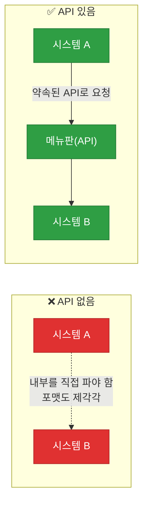
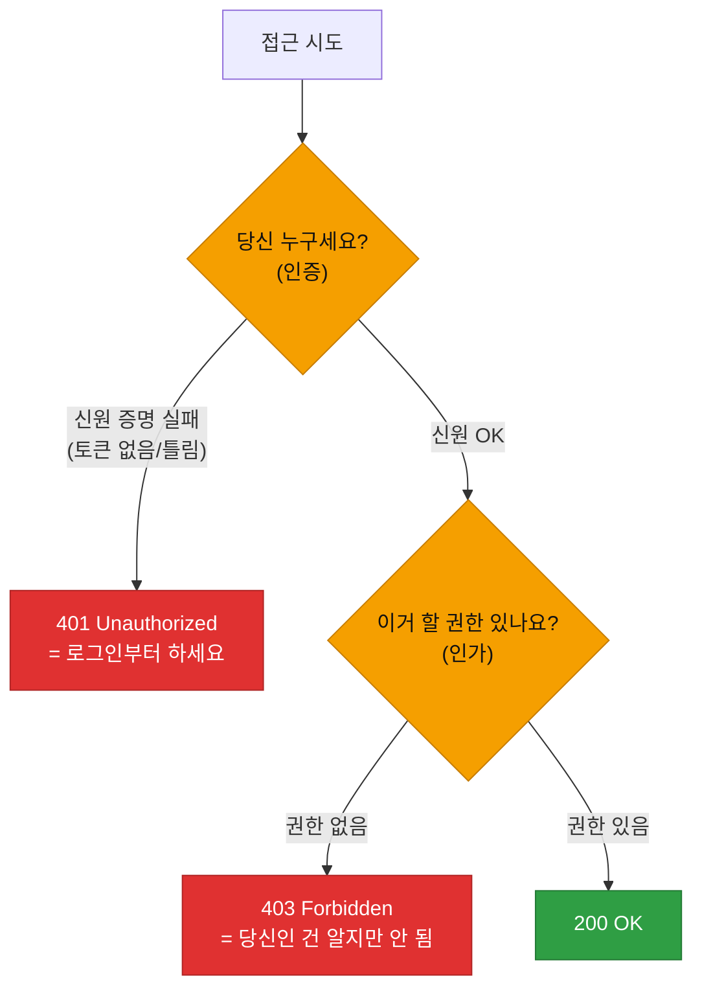
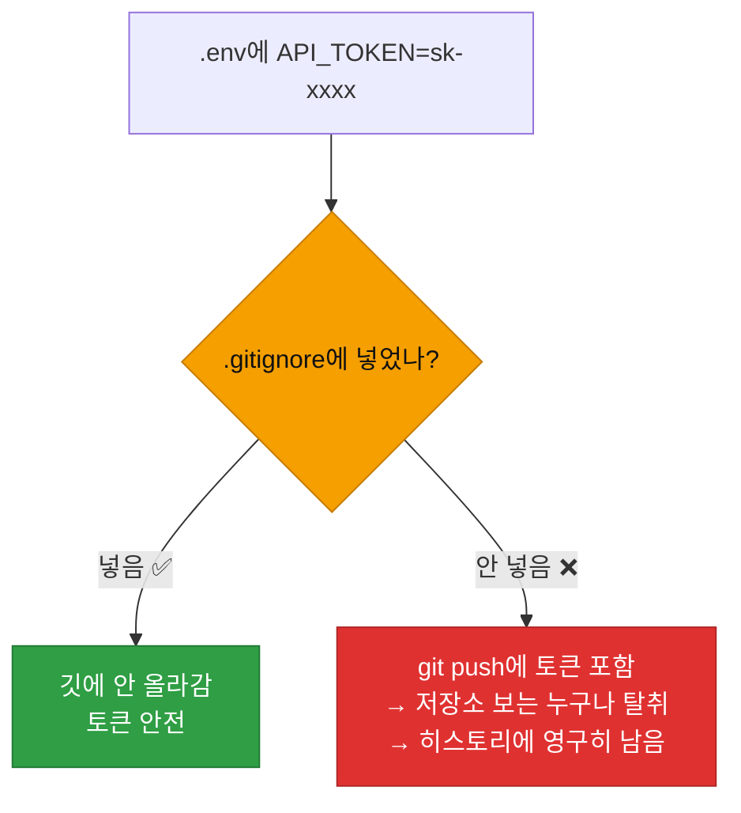

# 강의1 · API와 HTTP 개념 (오전, 총 120분)

> **이 교시 한 문장:** 프로그램끼리 데이터를 주고받는 **API**의 개념과, 그 대화 규칙인 **HTTP(메서드·URL·상태코드)** 를 익히고, **API 키를 코드에 박지 않고 안전하게** 관리하는 법을 배웁니다.

| 시간 | 소주제 | 핵심 한 줄 |
|------|--------|-----------|
| 00-20분 | API란 무엇인가 | 메뉴판과 주방 |
| 20-45분 | HTTP 메서드와 URL 구조 | 요청의 종류와 주소 |
| 45-70분 | 상태코드와 응답 구조 | 성공/실패를 숫자로 |
| 70-95분 | API 인증 방식 | 토큰으로 신원 증명 |
| 95-120분 | 환경변수로 민감정보 관리 | 키를 코드 밖으로 |

## 이 교시에 나오는 어려운 용어

| 용어 (한글발음) | 한 줄 뜻 (아주 쉽게) | 비유 |
|----------------|----------------------|------|
| **API(에이피아이)** | 프로그램끼리 소통하는 창구 | 식당 메뉴판 |
| **HTTP(에이치티티피)** | 웹에서 주고받는 규칙 | 대화 예절 |
| **요청(request, 리퀘스트)** | 서버에 보내는 요구 | 주문서 |
| **응답(response, 리스폰스)** | 서버가 돌려주는 답 | 음식 |
| **메서드(method)** | 요청의 종류 | 조회/생성/수정/삭제 |
| **GET/POST** | 조회 / 생성 요청 | 메뉴 보기 / 주문 |
| **URL(유알엘)** | 자원의 주소 | 가게 주소 |
| **쿼리 스트링(query string)** | URL 뒤 `?key=값` | 주문 옵션 |
| **상태코드(status code)** | 결과를 나타내는 숫자 | 신호등 |
| **토큰(token)** | 신원 증명 열쇠 | 출입증 |
| **환경변수(env var)** | 코드 밖에 둔 설정값 | 금고 속 비밀 |
| **`.gitignore`(깃이그노어)** | 깃에 안 올릴 목록 | 반출 금지 목록 |

---

## ⏱️ 00-20분 · API란 무엇인가 (실생활 비유)

!!! info "📘 학습자 뷰 · 처음 보는 나"
    **API(에이피아이)** = 프로그램끼리 데이터를 주고받는 **창구**입니다. 식당으로 비유하면:

    - **손님(내 프로그램)** 은 주방이 어떻게 돌아가는지 몰라도 됩니다.
    - **메뉴판(API)** 을 보고 주문(요청)하면,
    - **주방(서버)** 이 음식(응답)을 만들어 돌려줍니다.

    나는 주방 내부를 몰라도 **메뉴판(API 규칙)** 만 알면 원하는 걸 얻습니다. SKT 업무의 SIEM API, 티켓시스템 API, LLM API가 다 이런 "메뉴판"입니다.

### 🔬 깊이 보기 — API가 없으면?



API가 없으면 시스템마다 **내부 구조를 직접 파헤쳐** 연결해야 하고, 상대가 바뀌면 다 깨집니다. API는 "이렇게 요청하면 이렇게 답한다"는 **약속(계약)** 이라, 내부가 어떻든 그 약속만 지키면 연결됩니다. 3·4과목에서 모듈을 `tool_registry`에 등록해 부른 것도 "함수 API"를 만든 셈입니다.

!!! question "확인질문"
    **Q. API가 없다면 서로 다른 시스템을 연결하려면 어떻게 해야 할까요?**

    **A.** **각 시스템의 내부 구조를 직접 파헤쳐 일일이 맞춰 연결해야 합니다.**

    API는 "이렇게 요청하면 이렇게 답한다"는 약속된 창구입니다. 이 창구가 없으면, 시스템 A가 시스템 B의 데이터를 쓰려면 B의 내부가 어떻게 저장·동작하는지 직접 알아내서 거기에 맞춰 코드를 짜야 합니다. 게다가 B가 내부 구조를 바꾸면 A의 연결이 전부 깨져 다시 만들어야 합니다. API가 있으면 내부 구현과 무관하게 약속된 방식으로만 소통하면 되므로, 서로 독립적으로 유지·개선하면서도 안정적으로 연결할 수 있습니다.

<div class="quiz">
<p class="quiz-q"><span class="tag">퀴즈</span><b>API를 '식당 메뉴판'에 비유할 때, 메뉴판이 하는 역할은?</b></p>
<button class="quiz-opt">주방(서버)의 요리 속도를 높인다</button>
<button class="quiz-opt" data-correct>손님(내 프로그램)이 주방 내부를 몰라도 정해진 방식으로 주문(요청)할 수 있게 해준다</button>
<button class="quiz-opt">손님이 직접 요리하게 한다</button>
<button class="quiz-opt">음식 값을 자동으로 계산한다</button>
<div class="quiz-explain"><b>정답: 2번.</b> 메뉴판(API)은 내부(주방)를 감추고 "이렇게 주문하면 이게 나온다"는 약속을 제공합니다. 덕분에 요청하는 쪽은 서버 내부를 몰라도 됩니다.</div>
<button class="quiz-retry">다시 풀기</button>
</div>

---

## ⏱️ 20-45분 · HTTP 메서드와 URL 구조

!!! abstract "이 블록을 마치면"
    ✔ ==요청의 종류(메서드)와 주소(URL) 구조==를 읽는다

### 🐍 문법 상자 — HTTP 메서드 4종

!!! tip "🐍 무엇을 하려는 요청인가"
    | 메서드 | 뜻 | 비유 |
    |--------|-----|------|
    | **GET** | 조회(읽기) | 메뉴 구경 |
    | **POST** | 생성(만들기) | 새 주문 |
    | **PUT/PATCH** | 수정(바꾸기) | 주문 변경 |
    | **DELETE** | 삭제 | 주문 취소 |

    > 메서드가 **의도**를 나타냅니다. "조회만" 할 땐 GET(데이터를 바꾸지 않음), "새로 만들" 땐 POST.

### 🐍 문법 상자 — URL 구조

!!! tip "🐍 URL 뜯어보기"
    ```text
    https://api.example.com/v1/events?status=open&limit=10
    └─┬─┘   └──────┬──────┘└───┬───┘ └─────────┬─────────┘
    scheme      host        path         query string
    (프로토콜)  (서버 주소)  (자원 경로)   (?옵션들, &로 연결)
    ```

    - **scheme** `https` : 통신 방식(https는 암호화).
    - **host** `api.example.com` : 어느 서버.
    - **path** `/v1/events` : 서버 안 어떤 자원(이벤트 목록).
    - **query string** `?status=open&limit=10` : 조건·옵션. `?`로 시작, `&`로 연결.

    예: 위 URL = "example 서버의 events 중 status가 open인 것 10개 조회(GET)".

!!! example "🎓 강사 뷰 · POST엔 Body가 있다"
    ```text
    POST https://api.example.com/v1/tickets
    Body: {"title": "비정상 로그인 탐지", "priority": "high"}
    ```
    *"GET은 주소(query)로 조건을 넘기지만, POST처럼 '새로 만드는' 요청은 **Body(본문)** 에 JSON으로 데이터를 담습니다. Day3에서 배운 JSON이 여기서 쓰이죠."*

!!! question "확인질문"
    **Q. 이벤트 목록을 '조회'만 할 때는 어떤 메서드를 써야 할까요?**

    **A.** **GET** 을 써야 합니다.

    GET은 데이터를 읽어오기만 하고 서버의 상태를 바꾸지 않는 '조회' 메서드입니다. 이벤트 목록을 단순히 가져와 보는 것은 새로 만들거나 수정·삭제하는 게 아니므로 GET이 맞습니다. 새 데이터를 생성할 때는 POST, 기존 것을 수정할 때는 PUT/PATCH, 삭제할 때는 DELETE를 씁니다. 메서드가 요청의 의도를 나타내므로, 조회에 POST를 쓰면 "무언가 만든다"는 오해를 주고 관례에도 어긋납니다.

<div class="quiz">
<p class="quiz-q"><span class="tag">퀴즈</span><b>URL <code>.../events?status=open&limit=10</code>에서 <code>?status=open&limit=10</code> 부분은?</b></p>
<button class="quiz-opt">host (서버 주소)</button>
<button class="quiz-opt"><code>path</code> (자원 경로)</button>
<button class="quiz-opt" data-correct>query string (조회 조건·옵션)</button>
<button class="quiz-opt">scheme (프로토콜)</button>
<div class="quiz-explain"><b>정답: 3번.</b> `?`부터가 query string으로, 조회 조건을 `key=값` 형태로 `&`로 이어 붙입니다. "status가 open인 것 10개"라는 옵션이죠. path는 `/events`, host는 서버 주소입니다.</div>
<button class="quiz-retry">다시 풀기</button>
</div>

---

## ⏱️ 45-70분 · 상태코드와 응답 구조

!!! abstract "이 블록을 마치면"
    ✔ ==응답 상태코드로 성공/실패와 원인==을 읽는다

### 🐍 문법 상자 — 상태코드 3덩어리

!!! tip "🐍 앞자리로 큰 분류"
    | 범위 | 뜻 | 대표 |
    |------|-----|------|
    | **2xx** | 성공 | 200(OK), 201(생성됨) |
    | **4xx** | **요청 잘못**(내 탓) | 400/401/403/404/429 |
    | **5xx** | **서버 오류**(서버 탓) | 500 |

    개별 코드:
    | 코드 | 뜻 | 상황 |
    |------|-----|------|
    | `200` | OK | 조회 성공 |
    | `201` | Created | 생성 성공(POST) |
    | `400` | Bad Request | 요청 형식 오류 |
    | `401` | Unauthorized | **인증 안 됨**(누구세요?) |
    | `403` | Forbidden | **권한 없음**(당신은 알지만 안 됨) |
    | `404` | Not Found | 자원 없음 |
    | `429` | Too Many Requests | 너무 많이 호출(속도 제한) |
    | `500` | Server Error | 서버 내부 오류 |

    - **4xx는 내 요청이 문제**(고칠 수 있음), **5xx는 서버가 문제**(재시도·대기).
    - 응답 Body는 대부분 **JSON**(Day3에서 배운 것) — `response.json()`으로 읽습니다.

### 🔬 깊이 보기 — 401 vs 403, 헷갈리는 짝



**401은 "누구인지 모름"(인증 실패), 403은 "누군지 알지만 권한 없음"(인가 실패)** 입니다. 3과목의 인증(Authentication) vs 인가(Authorization) 구분이 그대로 상태코드에 나타나죠. 401은 로그인·토큰을 고치면 되고, 403은 권한 자체가 없어 관리자에게 요청해야 합니다.

!!! question "확인질문"
    **Q. 401과 403은 둘 다 접근이 막히는 상황인데 어떤 차이가 있을까요?**

    **A.** **401은 "인증(신원 확인) 실패", 403은 "인가(권한) 실패"** 입니다.

    401 Unauthorized는 "당신이 누구인지 확인되지 않았다"는 뜻입니다. 토큰이 없거나 틀려서 서버가 요청자를 식별하지 못한 상태로, 올바른 인증 정보(로그인·토큰)를 제공하면 해결됩니다. 403 Forbidden은 "당신이 누구인지는 알지만, 이 작업을 할 권한이 없다"는 뜻입니다. 신원은 확인됐지만 접근 권한 자체가 없는 것이라, 토큰을 고쳐도 소용없고 관리자에게 권한을 요청해야 합니다. 3과목에서 배운 인증(누구인가)과 인가(무엇을 할 수 있나)의 구분이 그대로 반영된 코드입니다.

<div class="quiz">
<p class="quiz-q"><span class="tag">퀴즈</span><b>API 응답 상태코드가 <code>500</code>일 때 가장 알맞은 대응은?</b></p>
<button class="quiz-opt">내 요청 형식을 고친다</button>
<button class="quiz-opt">인증 토큰을 다시 발급받는다</button>
<button class="quiz-opt" data-correct>서버 측 오류이므로 잠시 후 재시도하거나 대기한다</button>
<button class="quiz-opt">URL의 자원 경로를 바꾼다</button>
<div class="quiz-explain"><b>정답: 3번.</b> 5xx는 서버 내부 오류(내 탓이 아님)라, 대개 잠시 후 재시도가 맞습니다. 4xx(400·401·403)는 내 요청 문제라 요청/인증/권한을 고쳐야 합니다.</div>
<button class="quiz-retry">다시 풀기</button>
</div>

---

## ⏱️ 70-95분 · API 인증 방식

!!! info "📘 학습자 뷰 · 처음 보는 나"
    아무나 API를 부르면 안 되니, **신원을 증명**해야 합니다. 대표 방식:

    - **API Key** : 발급받은 비밀 키를 요청에 포함(간단).
    - **OAuth 2.0** : 토큰을 발급받아 → 요청 헤더에 **Bearer 토큰**으로 포함(표준·안전).

### 🐍 문법 상자 — Authorization 헤더

!!! tip "🐍 토큰을 헤더에 담기"
    ```python
    headers = {
        'Authorization': f'Bearer {API_TOKEN}'    # Bearer + 공백 + 토큰
    }
    # API_TOKEN은 코드가 아니라 환경변수/설정파일에서 불러온다!
    ```

    - **헤더(headers)** : 요청에 딸린 부가 정보(누구인지 등). 딕셔너리로 만듭니다.
    - `'Authorization': 'Bearer 토큰'` : 인증 정보를 담는 표준 헤더.
    - ⚠️ **`API_TOKEN`을 코드에 직접 쓰지 마세요.** 환경변수에서 불러옵니다(다음 블록).

!!! question "확인질문"
    **Q. `API_TOKEN`을 코드에 직접 적어서 깃(Git)에 올리면 어떤 사고가 날 수 있을까요?**

    **A.** **누구나 그 토큰을 훔쳐 내 권한으로 API를 마음대로 쓸 수 있게 됩니다.**

    API 토큰은 "나를 대신하는 열쇠"입니다. 코드에 직접 적고 그 코드를 깃(특히 공개 저장소)에 올리면, 저장소에 접근하는 누구나 그 토큰을 볼 수 있습니다. 공격자가 이 토큰을 가져가면 내 신원으로 데이터를 조회·삭제하거나, 유료 API라면 요금을 폭증시킬 수 있습니다. 게다가 깃은 과거 기록(history)이 남아, 나중에 토큰을 지워도 이전 커밋에 그대로 남아 있어 유출이 지속됩니다. 그래서 토큰 같은 비밀은 코드에 넣지 않고 환경변수(`.env`)로 분리하고, 그 파일을 깃에 올리지 않도록 `.gitignore`에 넣어야 합니다.

<div class="quiz">
<p class="quiz-q"><span class="tag">퀴즈</span><b>인증 토큰을 요청에 포함할 때 쓰는 표준 헤더는?</b></p>
<button class="quiz-opt"><code>Content-Type</code></button>
<button class="quiz-opt" data-correct><code>Authorization: Bearer 토큰</code></button>
<button class="quiz-opt"><code>User-Agent</code></button>
<button class="quiz-opt"><code>Accept-Language</code></button>
<div class="quiz-explain"><b>정답: 2번.</b> 인증 정보는 `Authorization` 헤더에 `Bearer 토큰` 형식으로 담습니다. Content-Type은 본문 형식(JSON 등), User-Agent는 클라이언트 정보를 나타내는 다른 헤더입니다.</div>
<button class="quiz-retry">다시 풀기</button>
</div>

---

## ⏱️ 95-120분 · 환경변수로 민감정보 관리

!!! abstract "이 블록을 마치면"
    ✔ API 키를 ==`.env`로 분리하고 `.gitignore`에 넣는== 이유와 방법을 안다

### 🐍 문법 상자 — .env와 python-dotenv

!!! tip "🐍 비밀을 코드 밖으로"
    ```text
    # 📄 .env  (코드가 아닌 별도 파일, 깃에 안 올림)
    API_TOKEN=sk-xxxx
    ```

    ```python
    # 📄 code
    import os
    from dotenv import load_dotenv

    load_dotenv()                        # .env 파일을 읽어 환경변수로 로드
    token = os.environ['API_TOKEN']      # 환경변수에서 꺼내기
    # 또는 안전하게: os.environ.get('API_TOKEN')
    ```

    - **`.env`** : `키=값` 형식으로 비밀을 담는 파일(코드 아님).
    - **`load_dotenv()`** : .env를 읽어 프로그램의 환경변수로 올림.
    - **`os.environ['API_TOKEN']`** : 환경변수에서 값을 꺼냄.
    - 코드에는 **키 값이 안 보입니다** — 값은 .env에만 있습니다.

### 🐍 문법 상자 — .gitignore

!!! tip "🐍 깃에 올리지 않기"
    ```text
    # 📄 .gitignore
    .env              ← 이 파일은 깃에 안 올림!
    venv/
    __pycache__/
    ```

    - `.gitignore`에 적힌 파일·폴더는 **깃이 무시**(추적 안 함)합니다.
    - `.env`를 여기 넣어야 **비밀 키가 깃에 안 올라갑니다.**
    - 대신 `.env.example`(값은 빈칸)을 올려 "이런 키가 필요하다"만 공유합니다.

### 🔬 깊이 보기 — .env를 .gitignore에 안 넣으면



`.env`를 `.gitignore`에 안 넣으면, `git push` 할 때 **토큰이 그대로 저장소에 올라갑니다.** 저장소를 보는 누구나 훔칠 수 있고, 깃 **히스토리에 영구히 남아** 나중에 지워도 과거 커밋에 남습니다. 이게 실제로 자주 나는 사고라, "비밀은 .env, .env는 .gitignore"가 철칙입니다.

!!! question "확인질문"
    **Q. `.env` 파일을 `.gitignore`에 넣지 않으면 어떤 문제가 생길까요?**

    **A.** **`.env`에 담긴 API 키 등 비밀이 깃 저장소에 그대로 올라가 유출됩니다.**

    `.env`에는 API 토큰 같은 민감 정보가 들어 있습니다. `.gitignore`에 넣지 않으면 이 파일이 깃의 추적 대상이 되어, `git commit`·`git push` 할 때 저장소에 함께 올라갑니다. 그러면 저장소에 접근하는 사람 누구나 토큰을 볼 수 있고, 특히 공개 저장소면 전 세계에 노출됩니다. 게다가 깃은 변경 이력이 남기 때문에, 나중에 `.env`를 지우거나 토큰을 바꿔도 과거 커밋 기록에 옛 토큰이 그대로 남아 계속 위험합니다. 그래서 `.env`는 반드시 `.gitignore`에 등록해 처음부터 깃에 올라가지 않게 해야 합니다.

<div class="quiz">
<p class="quiz-q"><span class="tag">퀴즈</span><b>API 키를 안전하게 관리하는 올바른 방법은?</b></p>
<button class="quiz-opt">코드 맨 위에 상수로 적고 주석으로 "비밀"이라 표시한다</button>
<button class="quiz-opt" data-correct>.env 파일에 두고 코드는 환경변수로 읽으며, .env는 .gitignore에 넣는다</button>
<button class="quiz-opt">키를 반으로 나눠 두 파일에 적는다</button>
<button class="quiz-opt">키를 base64로 인코딩해 코드에 넣는다</button>
<div class="quiz-explain"><b>정답: 2번.</b> 비밀은 코드 밖(.env)에 두고 환경변수로 읽으며, .env를 .gitignore로 깃에서 제외합니다. 주석 표시(1번)나 인코딩(4번)은 여전히 코드/저장소에 값이 남아 안전하지 않습니다.</div>
<button class="quiz-retry">다시 풀기</button>
</div>

!!! tip "🧠 파인만 자가진단"
    안 보고 말할 수 있으면 통과입니다.

    1. API를 메뉴판 비유로 설명하기
    2. GET/POST의 차이와 URL의 query string
    3. 401 vs 403의 차이
    4. 왜 API 키를 .env로 분리하고 .gitignore에 넣는지

---

## ✅ 가르칠 준비 체크리스트 (강의1)

- [ ] API를 메뉴판·주방 비유로 설명한다
- [ ] HTTP 메서드와 URL 구조를 설명한다
- [ ] 상태코드 2xx/4xx/5xx와 401 vs 403을 설명한다
- [ ] Authorization: Bearer 헤더를 설명한다
- [ ] .env + load_dotenv로 키를 분리한다
- [ ] .gitignore에 .env를 넣는 이유를 시연한다
- [ ] 확인질문 4개 + 퀴즈에 답한다

*[API]: Application Programming Interface — 프로그램 간 소통 창구
*[HTTP]: 웹에서 요청·응답을 주고받는 규약
*[Bearer token]: Authorization 헤더에 담는 인증 토큰 형식
*[.env]: 환경변수(비밀)를 담는 파일
