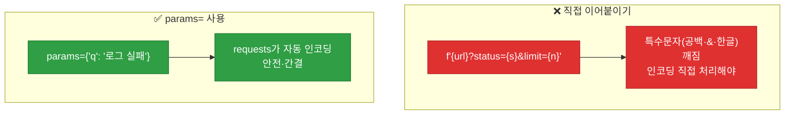
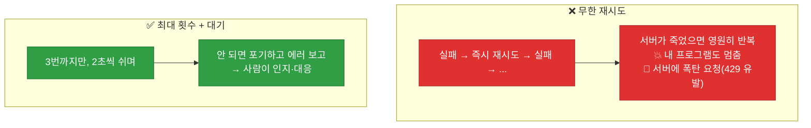

# 강의2 · requests 라이브러리 실전 (오후, 총 120분)

> **이 교시 한 문장:** 파이썬 **requests** 라이브러리로 실제 API에 GET·POST를 보내고, 응답을 `.json()`으로 읽으며, 실패해도 죽지 않게 **최대 횟수 제한이 있는 재시도**를 구현합니다.

| 시간 | 소주제 | 핵심 한 줄 |
|------|--------|-----------|
| 00-25분 | requests.get()으로 호출 | 첫 API 호출 |
| 25-50분 | 쿼리 파라미터와 헤더 | params·headers 딕셔너리 |
| 50-75분 | POST 요청과 본문(Body) | json=으로 데이터 보내기 |
| 75-100분 | 에러 처리와 재시도 | 실패 대비, 최대 횟수 |
| 100-120분 | 실습 안내 | 공개 API 수집기 |

## 이 교시에 나오는 어려운 용어

| 용어 (한글발음) | 한 줄 뜻 (아주 쉽게) | 비유 |
|----------------|----------------------|------|
| **requests(리퀘스츠)** | HTTP 요청 파이썬 라이브러리 | 심부름꾼 |
| **`.status_code`** | 응답 상태코드 숫자 | 신호등 색 |
| **`.json()`** | 응답 본문을 딕셔너리로 | 상자 풀기 |
| **`params`(파람스)** | 쿼리 파라미터 딕셔너리 | 주문 옵션표 |
| **`headers`(헤더스)** | 요청 헤더 딕셔너리 | 부가 쪽지 |
| **본문(body, payload)** | POST로 보내는 데이터 | 주문 내용 |
| **`timeout`(타임아웃)** | 응답 최대 대기 시간 | 기다림 한도 |
| **재시도(retry, 리트라이)** | 실패 시 다시 시도 | 재도전 |
| **`raise_for_status`** | 오류코드면 예외 발생 | 불량이면 신고 |
| **`range()`(레인지)** | 정해진 횟수 반복 | 0,1,2… |
| **`time.sleep`(슬립)** | 잠시 멈춤(대기) | 잠깐 쉼 |
| **무한 재시도(infinite retry)** | 끝없이 재시도(위험) | 멈추지 않는 반복 |

---

## ⏱️ 00-25분 · requests.get()으로 공개 API 호출

!!! abstract "이 블록을 마치면"
    ✔ ==requests로 GET 요청을 보내고 응답을 읽는== 법을 안다

### 🐍 문법 상자 — requests 기본

!!! tip "🐍 첫 API 호출"
    ```python
    import requests    # pip install requests 로 설치 (표준 아님)

    response = requests.get('https://api.example.com/v1/status')

    print(response.status_code)   # 200   ← 상태코드
    print(response.json())        # {...}  ← 응답 본문을 딕셔너리로
    print(response.text)          # 원본 문자열(JSON 아닐 때)
    ```

    **➕ 다른 맥락 예제** — 공개 API로 데이터 받기:
    ```python
    import requests
    r = requests.get('https://api.example.com/quote')
    if r.status_code == 200:
        print(r.json())      # {'text': '...', 'author': '...'}
    ```

    - **`requests.get(url)`** : GET 요청을 보내고 **응답 객체**를 받습니다.
    - **`.status_code`** : 상태코드(200 등). 성공 확인용.
    - **`.json()`** : 응답 본문(JSON)을 **파이썬 딕셔너리로** 변환(Day3 loads와 같은 일).

### 🐍 문법 상자 — .json() 전에 확인하기

!!! tip "🐍 안전하게 응답 읽기"
    ```python
    response = requests.get(url)

    if response.status_code == 200:                          # 성공일 때만
        if 'application/json' in response.headers.get('Content-Type', ''):
            data = response.json()      # JSON일 때만 파싱
        else:
            print('JSON이 아님:', response.text[:100])
    ```

    **➕ 다른 맥락 예제** — 상태코드로 성공/실패 분기:
    ```python
    r = requests.get(url)
    if r.status_code == 200:
        print('성공:', r.json())
    elif r.status_code == 404:
        print('없는 자원입니다')
    ```

    - `.json()`은 응답이 **JSON이 아니면 에러**(JSONDecodeError)를 냅니다.
    - 그래서 **상태코드**와 **Content-Type**을 먼저 확인하면 안전합니다.

!!! question "확인질문"
    **Q. `response.json()`을 호출했는데 에러가 난다면 응답이 JSON이 아닐 수도 있다는 뜻인데, 어떻게 먼저 확인해볼까요?**

    **A.** **`response.status_code`와 `response.headers['Content-Type']`, `response.text`를 먼저 확인합니다.**

    `.json()`은 응답 본문이 올바른 JSON일 때만 딕셔너리로 변환하고, JSON이 아니면 JSONDecodeError를 냅니다. 그래서 파싱 전에 몇 가지를 확인하면 좋습니다. 먼저 `response.status_code`가 200인지 봐서 요청 자체가 성공했는지 확인하고(404 오류 페이지 등은 JSON이 아닐 수 있음), `response.headers.get('Content-Type')`에 `application/json`이 들어 있는지 보면 응답이 JSON 형식인지 알 수 있습니다. 그래도 애매하면 `response.text[:100]`으로 실제 본문 앞부분을 출력해 눈으로 확인합니다. 이렇게 확인한 뒤 JSON일 때만 `.json()`을 호출하면 에러 없이 안전하게 처리할 수 있습니다.

<div class="quiz">
<p class="quiz-q"><span class="tag">퀴즈</span><b><code>response.json()</code>이 하는 일은?</b></p>
<button class="quiz-opt">응답을 JSON 파일로 저장한다</button>
<button class="quiz-opt" data-correct>응답 본문(JSON 텍스트)을 파이썬 딕셔너리/리스트로 변환한다</button>
<button class="quiz-opt">요청을 JSON 형식으로 보낸다</button>
<button class="quiz-opt">상태코드를 반환한다</button>
<div class="quiz-explain"><b>정답: 2번.</b> `.json()`은 응답으로 받은 JSON 텍스트를 파이썬 객체(딕셔너리·리스트)로 바꿔줍니다. Day3의 `json.loads`와 같은 일을 응답에 대해 해주는 편의 메서드죠. 저장(1번)이나 상태코드(4번)와는 다릅니다.</div>
<button class="quiz-retry">다시 풀기</button>
</div>

---

## ⏱️ 25-50분 · 쿼리 파라미터와 헤더 다루기

!!! abstract "이 블록을 마치면"
    ✔ ==`params`·`headers`를 딕셔너리로 안전하게== 넘긴다

### 🐍 문법 상자 — params와 headers

!!! tip "🐍 조건과 인증을 딕셔너리로"
    ```python
    params = {'status': 'open', 'limit': 10}          # 쿼리 조건
    headers = {'Authorization': f'Bearer {token}'}     # 인증 헤더

    response = requests.get(url, params=params, headers=headers)
    # 실제 요청: url?status=open&limit=10  (requests가 자동으로 붙임)
    ```

    **➕ 다른 맥락 예제** — 검색어·페이지를 params로:
    ```python
    params = {'q': '보안 로그', 'page': 2}
    r = requests.get('https://api.example.com/search', params=params)
    # 실제 요청: .../search?q=보안+로그&page=2  (공백·한글 자동 인코딩)
    ```

    - **`params=딕셔너리`** : requests가 알아서 `?status=open&limit=10`으로 URL에 붙입니다.
    - **`headers=딕셔너리`** : 인증 등 헤더를 함께 보냅니다.

### 🔬 깊이 보기 — 왜 URL에 직접 안 붙이고 params를 쓰나



URL에 직접 `?status=open`을 이어 붙이면, 값에 **공백·`&`·한글** 같은 특수문자가 있을 때 깨집니다(URL은 이런 문자를 특별 처리해야 함). `params=`로 넘기면 requests가 **자동으로 안전하게 인코딩**해 줍니다. 직접 문자열을 조립하는 것보다 실수가 없고 깔끔하죠 — Day3의 "직접 조립 대신 도구 쓰기"와 같은 정신입니다.

!!! question "확인질문"
    **Q. URL에 직접 `?status=open`을 이어붙이는 것과 `params=`로 넘기는 것의 차이는 무엇일까요?**

    **A.** **`params=`로 넘기면 requests가 특수문자를 자동으로 안전하게 인코딩해 준다는 점**이 다릅니다.

    URL에 직접 `f'{url}?status={value}'`처럼 이어 붙이면, `value`에 공백이나 `&`, 한글 같은 문자가 들어갈 때 URL 규칙에 맞게 변환(인코딩)하는 일을 직접 해야 합니다. 빠뜨리면 요청이 깨지거나 서버가 잘못 해석합니다. 반면 `params={'status': 'open', 'q': '로그 실패'}`처럼 딕셔너리로 넘기면 requests가 각 값을 URL에 안전하게 인코딩해 `?status=open&q=%EB%A1%9C%EA%B7%B8...` 형태로 자동 구성합니다. 그래서 코드가 간결하고 특수문자 관련 버그가 없습니다.

<div class="quiz">
<p class="quiz-q"><span class="tag">퀴즈</span><b>인증 토큰이 담긴 <code>headers</code>와 조회 조건이 담긴 <code>params</code>를 GET 요청에 함께 넘기는 코드는?</b></p>
<button class="quiz-opt"><code>requests.get(url + params + headers)</code></button>
<button class="quiz-opt" data-correct><code>requests.get(url, params=params, headers=headers)</code></button>
<button class="quiz-opt"><code>requests.get(url).params(params)</code></button>
<button class="quiz-opt"><code>requests.get(params, headers)</code></button>
<div class="quiz-explain"><b>정답: 2번.</b> requests.get은 `params=`, `headers=` 키워드 인자로 딕셔너리를 받습니다. requests가 params를 URL에 안전하게 붙이고 headers를 요청에 포함합니다. 문자열로 직접 잇는(1번) 방식은 특수문자에 취약합니다.</div>
<button class="quiz-retry">다시 풀기</button>
</div>

---

## ⏱️ 50-75분 · POST 요청과 요청 본문(Body)

!!! abstract "이 블록을 마치면"
    ✔ ==`json=`으로 데이터를 담아 POST== 하고 201을 읽는다

### 🐍 문법 상자 — requests.post와 json=

!!! tip "🐍 새 데이터 만들기 (POST)"
    ```python
    payload = {'title': '비정상 로그인 탐지 - kim01', 'priority': 'high'}

    response = requests.post(
        f'{base_url}/tickets',
        json=payload,              # json=으로 넘기면 자동으로 JSON 변환+헤더 설정
        headers=headers,
    )
    print(response.status_code, response.json())   # 201 {...생성된 티켓...}
    ```

    **➕ 다른 맥락 예제** — 새 글 작성 POST:
    ```python
    new_post = {'title': '오늘의 메모', 'body': '장보기'}
    r = requests.post('https://api.example.com/posts', json=new_post)
    print(r.status_code)   # 201 (생성됨)
    ```

    - **`json=딕셔너리`** : 본문(Body)에 JSON으로 담아 보냅니다. requests가 **자동 직렬화**(Day3 dumps)하고 `Content-Type: application/json` 헤더도 설정.
    - POST는 "새로 만들기"라, 성공 시 보통 **201(Created)** 을 반환합니다.

!!! example "🎓 강사 뷰 · SOAR 연결"
    *"이 '티켓 생성 POST'가 5과목 SOAR의 자동 대응에서 그대로 쓰입니다. 이상탐지(4과목)가 위협을 찾으면 → POST로 티켓을 자동 생성하죠. 오늘 배운 POST 패턴이 자동 대응의 손발입니다."*

!!! question "확인질문"
    **Q. 티켓 생성 API가 201을 반환했다면 무엇을 의미할까요?**

    **A.** **요청이 성공했고, 새 자원(티켓)이 정상적으로 생성됐다는 뜻**입니다.

    201은 "Created"로, 2xx(성공) 중에서도 "요청 결과로 새로운 자원이 만들어졌다"를 나타내는 코드입니다. POST로 티켓을 생성했을 때 200(단순 성공) 대신 201이 오면, 서버가 실제로 새 티켓을 만들었다는 명확한 신호입니다. 보통 응답 본문(`response.json()`)에 생성된 티켓의 id 등 정보가 함께 담겨 오므로, 그것을 받아 후속 처리(로그 기록, 담당자 알림 등)에 쓸 수 있습니다.

<div class="quiz">
<p class="quiz-q"><span class="tag">퀴즈</span><b><code>requests.post(url, json=payload)</code>에서 <code>json=</code>를 쓰면 requests가 자동으로 해주는 것은?</b></p>
<button class="quiz-opt">payload를 파일로 저장한다</button>
<button class="quiz-opt" data-correct>payload를 JSON 문자열로 직렬화하고 Content-Type: application/json 헤더를 설정한다</button>
<button class="quiz-opt">payload를 암호화한다</button>
<button class="quiz-opt">상태코드를 201로 바꾼다</button>
<div class="quiz-explain"><b>정답: 2번.</b> `json=`은 딕셔너리를 JSON으로 자동 변환하고 적절한 Content-Type 헤더까지 붙여줍니다. 직접 `json.dumps`하고 헤더를 다는 수고를 덜어주죠. 상태코드는 서버가 결정합니다(4번 오답).</div>
<button class="quiz-retry">다시 풀기</button>
</div>

---

## ⏱️ 75-100분 · 에러 처리와 재시도(retry) 패턴

!!! abstract "이 블록을 마치면"
    ✔ 네트워크 실패에 대비한 ==최대 횟수 제한이 있는 재시도==를 이해한다

### 💻 코드 완전 해부 — `call_with_retry()`

```python
import time
import logging
import requests

def call_with_retry(url, headers, max_retry=3):
    for attempt in range(max_retry):                    # ① 최대 3번
        try:
            r = requests.get(url, headers=headers, timeout=5)  # ② 5초 대기
            r.raise_for_status()                        # ③ 4xx/5xx면 예외
            return r.json()                             # ④ 성공 → 반환
        except requests.exceptions.RequestException as e:  # ⑤ 요청 계열 오류
            logging.warning(f'요청 실패({attempt+1}/{max_retry}): {e}')
            time.sleep(2)                               # ⑥ 2초 쉬고 재시도
    raise RuntimeError('API 호출 최종 실패')            # ⑦ 다 실패하면
```

**➕ 다른 맥락 예제** — 파일 저장을 재시도:
```python
import time

def save_with_retry(data, path, max_retry=3):
    for attempt in range(max_retry):       # 정해진 횟수만
        try:
            with open(path, 'w', encoding='utf-8') as f:
                f.write(data)
            return True                    # 성공하면 끝
        except OSError:
            time.sleep(1)                  # 잠깐 쉬고 다시
    return False                           # 다 실패하면 False
```

| 줄 | 하는 일 | 왜 |
|:--:|---------|-----|
| **①** | `range(max_retry)`로 **정해진 횟수만** 반복 | 무한 재시도 방지 |
| **②** | `timeout=5` : 5초 안에 응답 없으면 실패 처리 | 무한 대기 방지 |
| **③** | `raise_for_status()` : 4xx/5xx면 **예외 발생** | 오류를 잡을 수 있게 |
| **④** | 성공하면 결과 반환하고 **끝** | 더 재시도 안 함 |
| **⑤** | 요청 관련 오류를 잡음 | 네트워크·타임아웃 대응 |
| **⑥** | 잠깐 쉬고(2초) 다음 시도 | 서버 부담·일시 오류 회복 대기 |
| **⑦** | 다 실패하면 명확한 오류 | 조용히 넘기지 않음 |

### 🔬 깊이 보기 — 무한 재시도의 위험



재시도는 "일시적 오류"를 견디게 해주지만, **횟수 제한이 없으면** 서버가 정말 죽었을 때 **영원히 반복**합니다. 내 프로그램이 멈추고, 서버엔 요청 폭탄을 던져 429(과다 요청)를 유발하죠. **최대 횟수 + 대기**를 두면, 몇 번 시도 후 포기하고 **에러를 명확히 알려** 사람이 대응하게 합니다. Day2의 graceful 실패 정신에 "포기 조건"을 더한 것입니다.

!!! question "확인질문"
    **Q. 재시도 횟수에 제한을 두지 않으면 SOAR 자동화에서 어떤 위험이 있을까요?**

    **A.** **서버가 계속 응답하지 않을 때 프로그램이 무한 반복에 빠지고, 서버에 과도한 요청을 퍼부어 상황을 악화시킵니다.**

    재시도는 일시적인 네트워크 오류를 견디기 위한 것이지만, 횟수 제한이 없으면 대상 서버가 완전히 다운됐을 때 성공할 때까지 끝없이 재시도하게 됩니다. 그러면 자동화 프로그램 자체가 그 지점에서 멈춰 다른 작업을 못 하고, 동시에 죽어가는 서버에 계속 요청을 보내 부담을 가중시켜 429(너무 많은 요청) 오류나 장애 확산을 유발할 수 있습니다. 특히 SOAR처럼 자동으로 대응 액션을 수행하는 시스템에서는 이런 무한 루프가 큰 사고로 번질 수 있습니다. 그래서 `max_retry`로 최대 시도 횟수를 정하고, 그 안에 성공하지 못하면 명확한 오류를 남기고 포기해 사람이 인지·대응하도록 해야 합니다.

<div class="quiz">
<p class="quiz-q"><span class="tag">퀴즈</span><b><code>call_with_retry()</code>에서 <code>timeout=5</code>와 <code>max_retry=3</code>이 함께 막아주는 위험은?</b></p>
<button class="quiz-opt">응답이 JSON이 아닌 위험</button>
<button class="quiz-opt" data-correct>응답 없는 서버를 무한정 기다리거나 끝없이 재시도하는 위험</button>
<button class="quiz-opt">토큰이 유출되는 위험</button>
<button class="quiz-opt">상태코드가 201인 위험</button>
<div class="quiz-explain"><b>정답: 2번.</b> `timeout`은 한 번의 요청이 무한 대기하는 걸 막고, `max_retry`는 무한 재시도를 막습니다. 둘이 함께 "언젠가는 포기하고 에러를 알린다"를 보장해 자동화가 멈추거나 서버를 공격하지 않게 합니다.</div>
<button class="quiz-retry">다시 풀기</button>
</div>

!!! tip "🧠 파인만 자가진단"
    안 보고 말할 수 있으면 통과입니다.

    1. `requests.get`과 `.json()`이 각각 하는 일
    2. URL 직접 조립 대신 `params=`를 쓰는 이유
    3. POST에서 `json=`가 자동으로 해주는 것
    4. 재시도에 최대 횟수·timeout을 두는 이유

---

## ⏱️ 100-120분 · 실습 안내

**오후 정리:**

1. **requests.get** — `.status_code`·`.json()`으로 응답 읽기(JSON 확인 후)
2. **params·headers** — 딕셔너리로, requests가 자동 인코딩
3. **POST + json=** — 본문에 JSON 담아 생성 요청(201)
4. **재시도** — `range(max_retry)` + `timeout` + `raise_for_status`, 실패 시 명확한 에러

!!! note "실습 예고 (오후 실습 120분)"
    `api_client.py`에서 `.env`로 키를 불러오고, `call_with_retry()`를 활용한 `fetch_data()`로 공개 API를 호출해, 필요한 필드만 추출·가공한 뒤 `api_result.json`으로 저장합니다. 키 하드코딩·`.gitignore`를 서로 코드 리뷰합니다. 상세는 [실습 페이지](practice.md).

---

## ✅ 가르칠 준비 체크리스트 (강의2)

- [ ] requests.get과 status_code·json()을 시연한다
- [ ] .json() 전 상태코드·Content-Type 확인을 설명한다
- [ ] params/headers를 딕셔너리로 넘기는 이유를 설명한다
- [ ] POST의 json=와 201을 설명한다
- [ ] 재시도 패턴(range·timeout·raise_for_status)을 한 줄씩 설명한다
- [ ] 무한 재시도의 위험을 설명한다
- [ ] 확인질문 4개 + 퀴즈에 답한다

*[requests]: 파이썬 HTTP 요청 라이브러리
*[timeout]: 응답을 기다리는 최대 시간
*[raise_for_status]: 4xx/5xx 응답이면 예외를 발생시키는 메서드
