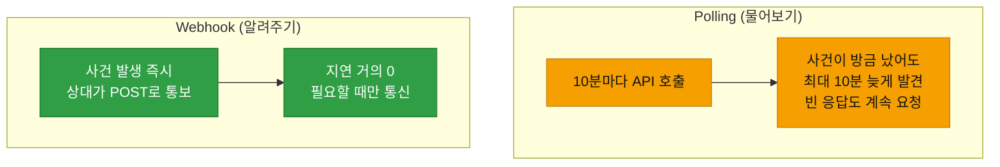
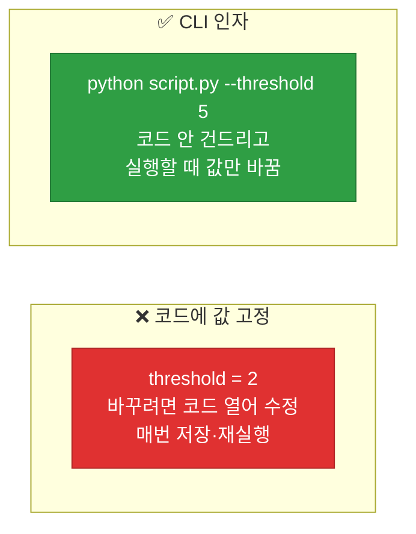

# 강의1 · Webhook 수신과 CLI 자동화 (오전, 총 120분)

> **이 교시 한 문장:** 상대 서버가 이벤트를 **먼저 알려주는 Webhook**을 Flask로 받고, `curl`로 테스트하며, 스크립트에 **argparse로 옵션**을 붙여 코드 수정 없이 유연하게 실행하는 법을 익힙니다.

| 시간 | 소주제 | 핵심 한 줄 |
|------|--------|-----------|
| 00-20분 | Polling vs Webhook | 물어보기 vs 알려주기 |
| 20-50분 | Flask Webhook 수신 서버 | 최소 서버 만들기 |
| 50-75분 | 터미널 명령어와 curl | 서버 테스트하기 |
| 75-100분 | CLI 인자 (argparse) | 옵션으로 유연하게 |
| 100-120분 | 정리 | 워크플로우로 넘어가기 |

## 이 교시에 나오는 어려운 용어

| 용어 (한글발음) | 한 줄 뜻 (아주 쉽게) | 비유 |
|----------------|----------------------|------|
| **Polling(폴링)** | 주기적으로 물어보기 | "왔어? 왔어?" 반복 |
| **Webhook(웹훅)** | 생기면 먼저 알려주기 | 도착 알림 문자 |
| **Flask(플라스크)** | 가벼운 웹 서버 도구 | 미니 접수처 |
| **라우트(route, @app.route)** | 어떤 주소를 처리할지 | 창구 번호 |
| **`request.get_json()`** | 받은 JSON 본문 꺼내기 | 소포 열기 |
| **터미널(terminal)** | 명령어 입력 화면 | 검은 화면 |
| **curl(컬)** | 명령줄 HTTP 요청 도구 | 손으로 보내는 요청 |
| **CLI(씨엘아이)** | 명령줄 인터페이스 | 명령어로 조작 |
| **argparse(아그파스)** | CLI 인자 처리 도구 | 옵션 접수대 |
| **인자(argument)** | 실행 시 넘기는 값 | 실행 옵션 |
| **`--input`(더블대시)** | 옵션 이름 표시 | 옵션 라벨 |
| **포트(port)** | 서버 접속 번호 | 건물 호수 |

---

## ⏱️ 00-20분 · Polling vs Webhook

!!! info "📘 학습자 뷰 · 처음 보는 나"
    "새 이벤트가 생겼나?"를 아는 두 방법:

    - **Polling(폴링):** 내가 **주기적으로 물어봄** ("왔어?" 10분마다). 없어도 계속 물어봐 낭비.
    - **Webhook(웹훅):** 생기면 상대가 **먼저 알려줌** (도착하면 문자 옴). 즉시·효율적.

### 🔬 깊이 보기 — 실시간성의 차이



침해사고는 **1분이 급합니다.** Polling(10분 주기)이면 최악의 경우 사건을 **10분 늦게** 압니다. Webhook은 사건 즉시 통보받아 **지연이 거의 0**이죠. 또 Polling은 사건이 없어도 계속 물어봐 낭비지만, Webhook은 있을 때만 통신합니다. 실시간 대응이 중요한 보안관제엔 Webhook이 유리합니다.

!!! question "확인질문"
    **Q. 10분마다 polling하는 것과 즉시 webhook을 받는 것, 침해사고 대응 속도에 어떤 차이가 있을까요?**

    **A.** **Polling은 최대 10분까지 발견이 늦어질 수 있지만, Webhook은 사고 발생 즉시 통보받아 지연이 거의 없습니다.**

    Polling은 정해진 주기(10분)마다 "새 사건 있나?"를 물어봅니다. 그래서 사건이 물어본 직후에 발생하면, 다음 확인 시점까지 최대 10분 동안 그 사실을 모르게 됩니다. 침해사고는 초기 몇 분의 대응이 피해 규모를 좌우하므로 이 지연이 치명적일 수 있습니다. Webhook은 사건이 발생하는 순간 상대 서버가 먼저 알려주므로, 거의 실시간으로 인지하고 대응을 시작할 수 있습니다. 또 Polling은 사건이 없어도 계속 요청을 보내 자원을 낭비하지만, Webhook은 실제 사건이 있을 때만 통신해 효율적입니다.

<div class="quiz">
<p class="quiz-q"><span class="tag">퀴즈</span><b>Webhook 방식이 Polling보다 실시간 대응에 유리한 이유는?</b></p>
<button class="quiz-opt">Webhook은 서버를 안 켜도 되어서</button>
<button class="quiz-opt" data-correct>사건 발생 즉시 상대가 먼저 알려줘 발견 지연이 거의 없기 때문</button>
<button class="quiz-opt">Webhook은 인증이 필요 없어서</button>
<button class="quiz-opt">Polling은 JSON을 지원하지 않아서</button>
<div class="quiz-explain"><b>정답: 2번.</b> Polling은 주기적으로 물어봐 최대 주기만큼 지연되지만, Webhook은 이벤트 발생 즉시 통보라 지연이 거의 0입니다. 그래서 실시간 대응에 유리합니다.</div>
<button class="quiz-retry">다시 풀기</button>
</div>

---

## ⏱️ 20-50분 · Flask로 간단한 Webhook 수신 서버

!!! abstract "이 블록을 마치면"
    ✔ ==POST를 받아 JSON을 처리하는 최소 서버==를 이해한다

### 🐍 문법 상자 — Flask 최소 서버

!!! tip "🐍 Webhook 받는 서버"
    ```python
    from flask import Flask, request     # pip install flask
    import logging

    app = Flask(__name__)                 # 앱(서버) 만들기

    @app.route('/webhook', methods=['POST'])   # /webhook 주소로 POST 오면
    def receive_webhook():
        data = request.get_json()         # 받은 JSON 본문을 딕셔너리로
        logging.info(f'수신: {data.get("event")}')
        return {'status': 'received'}, 200  # 응답 본문, 상태코드

    if __name__ == '__main__':
        app.run(port=5000)                # 5000번 포트에서 서버 실행
    ```

    **➕ 다른 맥락 예제** — GET 라우트로 인사 응답:
    ```python
    from flask import Flask
    app = Flask(__name__)

    @app.route('/hello')          # /hello 로 접속하면
    def hello():
        return 'Hello!'           # 이 문자열을 응답
    ```

    - **`@app.route('/webhook', methods=['POST'])`** : "이 주소로 POST가 오면 아래 함수 실행"이라는 표시(**데코레이터**).
    - **`request.get_json()`** : 받은 요청의 JSON 본문을 파이썬 딕셔너리로(Day4 POST의 반대편).
    - **`return 본문, 200`** : 응답 본문과 **상태코드**를 함께 돌려줍니다.
    - `app.run(port=5000)` : 서버를 켜서 5000번 포트에서 요청을 기다림.

!!! tip "🐍 문법 상자 — 데코레이터 `@`"
    `@app.route(...)`의 `@`는 **데코레이터**입니다. "이 함수에 특별한 역할을 붙인다"는 표시로, 여기선 "이 함수를 /webhook 주소의 처리기로 등록"합니다. 지금은 "POST가 오면 이 함수가 불린다" 정도로만 이해하면 충분합니다.

!!! example "🎓 강사 뷰 · 우리가 만드는 건 '접수처'"
    *"이 서버는 이벤트를 받는 '접수처'입니다. 4과목 탐지·5과목 SOAR에서 다른 시스템이 '사건 났어요!'라고 POST를 던지면, 이 서버가 받아 처리하죠. Day4가 '요청 보내기'였다면 오늘은 '요청 받기'입니다."*

!!! question "확인질문"
    **Q. `return {'status': 'received'}, 200`에서 `200`은 왜 필요할까요?**

    **A.** **요청을 보낸 상대에게 "정상적으로 잘 받았다"는 성공 신호(상태코드)를 알려주기 위해서**입니다.

    Webhook을 보낸 상대 서버는 "내가 보낸 이벤트가 제대로 접수됐는지"를 응답의 상태코드로 판단합니다. 200(OK)을 돌려주면 상대는 "성공적으로 전달됐다"고 인식하고 그 이벤트를 완료 처리합니다. 만약 상태코드를 제대로 주지 않거나 4xx·5xx를 주면, 상대는 전달이 실패했다고 보고 같은 이벤트를 재전송하거나 오류로 기록할 수 있습니다. 즉 200은 "잘 받았으니 다시 보낼 필요 없다"는 확인 응답으로, 이벤트 전달의 신뢰성을 보장하는 데 필요합니다.

<div class="quiz">
<p class="quiz-q"><span class="tag">퀴즈</span><b>Flask에서 <code>@app.route('/webhook', methods=['POST'])</code>가 하는 일은?</b></p>
<button class="quiz-opt">서버를 5000번 포트에서 실행한다</button>
<button class="quiz-opt" data-correct>/webhook 주소로 POST 요청이 오면 아래 함수가 처리하도록 등록한다</button>
<button class="quiz-opt">JSON을 자동으로 저장한다</button>
<button class="quiz-opt">모든 요청을 거부한다</button>
<div class="quiz-explain"><b>정답: 2번.</b> route 데코레이터는 "이 주소 + 이 메서드의 요청을 이 함수에 연결"합니다. 서버 실행은 `app.run()`(1번)이 하고, route는 어떤 요청을 어느 함수가 받을지 정합니다.</div>
<button class="quiz-retry">다시 풀기</button>
</div>

---

## ⏱️ 50-75분 · 터미널 기본 명령어와 curl

!!! abstract "이 블록을 마치면"
    ✔ 기본 터미널 명령어와 ==curl로 서버를 테스트==하는 법을 안다

### 🐍 문법 상자 — 기본 터미널 명령어

!!! tip "🐍 자주 쓰는 명령어"
    | 명령 | 뜻 | 예 |
    |------|-----|-----|
    | `cd` | 폴더 이동(change dir) | `cd agent_core` |
    | `ls` | 파일 목록(list) | `ls -la` |
    | `cat` | 파일 내용 출력 | `cat agent.log` |
    | `grep` | 문자 검색 | `grep ERROR agent.log` |
    | `pwd` | 현재 경로 | `pwd` |

    > `grep ERROR agent.log` = "agent.log에서 ERROR 들어간 줄만 보기". 로그 확인에 유용.

### 🐍 문법 상자 — curl로 요청 보내기

!!! tip "🐍 명령줄에서 HTTP 요청"
    ```bash
    curl -X POST http://localhost:5000/webhook \
      -H 'Content-Type: application/json' \
      -d '{"event": "login_failed", "user": "kim01"}'
    ```

    - **`curl`** : 터미널에서 HTTP 요청을 보내는 도구.
    - **`-X POST`** : 메서드 지정(POST).
    - **`-H`** : 헤더(Content-Type: JS 본문임을 알림).
    - **`-d`** : 보낼 데이터(본문). 위는 JSON 이벤트를 보냄.
    - `\`(줄 끝) : 명령이 다음 줄로 이어짐(가독성용).

    > curl로 내 Flask 서버에 이벤트를 던져 "잘 받나" 테스트합니다. Postman 같은 GUI 도구 대신 명령 한 줄로 빠르게.

!!! question "확인질문"
    **Q. curl 응답으로 `{'status':'received'}`가 안 오고 에러가 난다면 가장 먼저 무엇을 확인해야 할까요?**

    **A.** **Flask 서버가 실행 중인지(그리고 포트·주소가 맞는지)를 가장 먼저 확인합니다.**

    curl이 응답을 못 받고 "연결 거부(Connection refused)" 같은 에러를 낸다면, 대개 요청을 받을 서버가 그 주소·포트에서 돌고 있지 않은 것입니다. 그래서 먼저 `webhook_server.py`가 실제로 실행 중인지, `app.run(port=5000)`의 포트(5000)와 curl의 주소(`localhost:5000`)가 일치하는지 확인해야 합니다. 서버는 켜져 있는데 에러가 난다면 그다음으로 요청 경로(`/webhook`)가 맞는지, 메서드가 POST인지, `-H`로 Content-Type을 JSON으로 지정했는지, `-d`의 JSON 형식이 올바른지를 차례로 점검합니다. "먼저 서버가 살아 있나, 그다음 요청 형식이 맞나" 순서로 좁혀가는 것이 요령입니다.

<div class="quiz">
<p class="quiz-q"><span class="tag">퀴즈</span><b><code>curl -X POST ... -d '{"event": "login_failed"}'</code>에서 <code>-d</code>의 역할은?</b></p>
<button class="quiz-opt">요청을 삭제(delete)한다</button>
<button class="quiz-opt" data-correct>요청 본문(보낼 데이터)을 지정한다</button>
<button class="quiz-opt">디버그 모드를 켠다</button>
<button class="quiz-opt">응답을 파일로 저장한다</button>
<div class="quiz-explain"><b>정답: 2번.</b> `-d`(data)는 요청 본문에 담을 데이터를 지정합니다. `-X`는 메서드, `-H`는 헤더죠. POST로 JSON 이벤트를 보낼 때 `-d`에 그 JSON을 넣습니다.</div>
<button class="quiz-retry">다시 풀기</button>
</div>

---

## ⏱️ 75-100분 · Python 스크립트에 CLI 인자 넣기 (argparse)

!!! abstract "이 블록을 마치면"
    ✔ ==코드 수정 없이 옵션으로 실행 방식을 바꾸는== argparse를 안다

### 🐍 문법 상자 — argparse

!!! tip "🐍 명령줄 옵션 받기"
    ```python
    import argparse

    parser = argparse.ArgumentParser()
    parser.add_argument('--input', required=True)          # 필수 옵션
    parser.add_argument('--threshold', type=int, default=2) # 선택, 정수, 기본 2
    args = parser.parse_args()

    print(args.input, args.threshold)

    # 실행: python script.py --input logs.csv --threshold 3
    #   → args.input='logs.csv', args.threshold=3
    ```

    **➕ 다른 맥락 예제** — 이름·반복횟수 옵션:
    ```python
    import argparse
    parser = argparse.ArgumentParser()
    parser.add_argument('--name', default='세상')
    parser.add_argument('--times', type=int, default=1)
    args = parser.parse_args()
    for _ in range(args.times):
        print(f'안녕, {args.name}!')
    # 실행: python hi.py --name 민홍 --times 2
    ```

    - **`add_argument('--input', required=True)`** : `--input` 옵션(필수).
    - **`type=int`** : 문자열로 들어온 값을 **정수로 변환**(Day1 형변환!).
    - **`default=2`** : 안 주면 2 사용.
    - `args.input`처럼 점으로 값을 꺼냅니다.

### 🔬 깊이 보기 — argparse가 있으면 무엇이 좋나



값을 코드에 고정하면 바꿀 때마다 **파일을 열어 수정**해야 합니다. argparse로 옵션을 받으면 **실행할 때 값만** 바꾸면 되죠(`--threshold 5`). 같은 스크립트를 다른 파일·다른 임계값으로 자유롭게 돌릴 수 있어, 자동화·스케줄링에서 특히 유용합니다. Day1의 "설정 분리(THRESHOLD 변수)"가 이제 "실행 시점 설정"으로 발전한 것입니다.

!!! question "확인질문"
    **Q. argparse로 threshold를 인자로 받으면, 코드를 안 고치고도 무엇을 바꿀 수 있을까요?**

    **A.** **실행할 때마다 임계값(threshold) 같은 설정을 자유롭게 바꿀 수 있습니다.**

    argparse로 `--threshold` 옵션을 받도록 만들면, 그 값은 코드 안에 고정되지 않고 실행 명령에서 정해집니다. 예를 들어 오늘은 `python script.py --threshold 3`으로, 내일은 `--threshold 5`로 실행하면, 코드 파일을 전혀 수정하지 않고도 다른 임계값으로 동작합니다. 마찬가지로 `--input` 옵션으로 처리할 파일도 실행 시점에 바꿀 수 있습니다. 덕분에 같은 스크립트 하나를 여러 상황(다른 파일, 다른 기준)에 재사용할 수 있고, 스케줄러나 자동화에서 상황별로 옵션만 바꿔 호출하기도 쉬워집니다.

<div class="quiz">
<p class="quiz-q"><span class="tag">퀴즈</span><b><code>parser.add_argument('--threshold', type=int, default=2)</code>에서 <code>type=int</code>가 필요한 이유는?</b></p>
<button class="quiz-opt">threshold를 필수로 만들려고</button>
<button class="quiz-opt" data-correct>명령줄에서 들어온 값은 문자열이라, 숫자로 비교하려면 정수로 변환해야 하기 때문</button>
<button class="quiz-opt">기본값을 2로 만들려고</button>
<button class="quiz-opt">옵션 이름을 정하려고</button>
<div class="quiz-explain"><b>정답: 2번.</b> CLI로 들어온 `--threshold 3`의 '3'은 문자열입니다. `type=int`를 주면 argparse가 자동으로 정수 3으로 변환해, `count >= threshold` 같은 숫자 비교가 됩니다. Day1의 형변환과 이어집니다.</div>
<button class="quiz-retry">다시 풀기</button>
</div>

!!! tip "🧠 파인만 자가진단"
    안 보고 말할 수 있으면 통과입니다.

    1. Polling과 Webhook의 차이와 실시간성
    2. Flask에서 route·get_json·상태코드의 역할
    3. curl의 `-X`, `-H`, `-d`
    4. argparse가 코드 수정 없이 무엇을 가능하게 하는지

---

## ⏱️ 100-120분 · 정리

**오전 정리:**

1. **Polling(물어보기) vs Webhook(알려주기)** — 실시간엔 Webhook
2. **Flask** — `@app.route` + `request.get_json()` + `return 본문, 200`으로 이벤트 접수
3. **curl** — `-X`(메서드) `-H`(헤더) `-d`(본문)로 서버 테스트
4. **argparse** — `--옵션`으로 코드 수정 없이 유연 실행(`type=int` 형변환)

오후에는 이것들을 **트리거-조건-액션** 모델로 묶고, 멱등성·스케줄링으로 진짜 자동화를 완성합니다.

---

## ✅ 가르칠 준비 체크리스트 (강의1)

- [ ] Polling vs Webhook을 실시간성으로 비교한다
- [ ] Flask 최소 서버(route·get_json·상태코드)를 설명한다
- [ ] 데코레이터 `@`를 가볍게 설명한다
- [ ] curl로 서버를 테스트해 보인다
- [ ] argparse로 CLI 옵션을 받는 법을 시연한다
- [ ] type=int 형변환을 Day1과 연결한다
- [ ] 확인질문 4개 + 퀴즈에 답한다

*[Webhook]: 이벤트 발생 시 상대가 먼저 알려주는 방식
*[Flask]: 파이썬 경량 웹 프레임워크
*[argparse]: 명령줄 인자를 처리하는 표준 라이브러리
*[curl]: 명령줄에서 HTTP 요청을 보내는 도구
