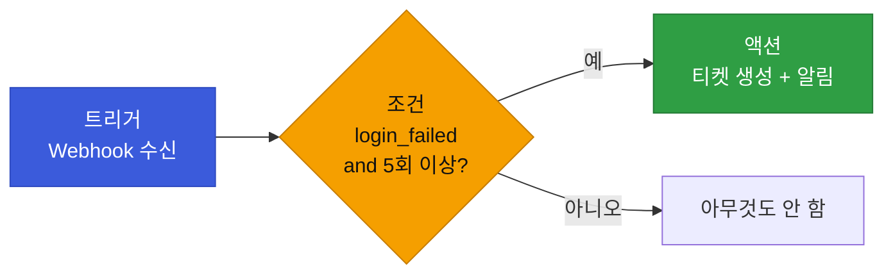
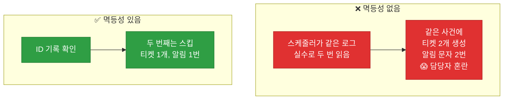
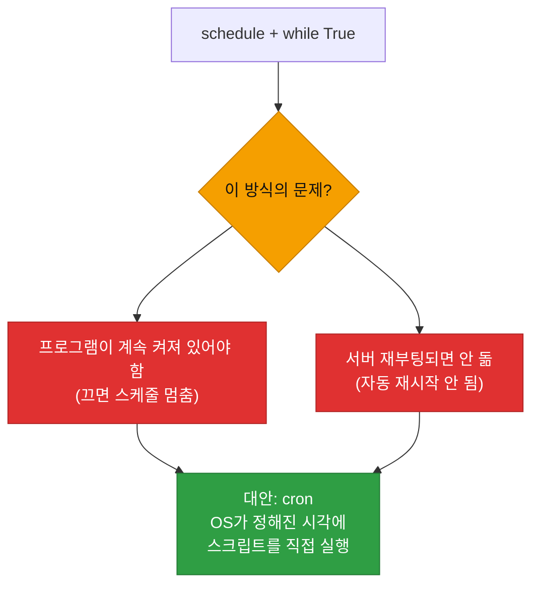

# 강의2 · 자동화 워크플로우 설계와 스케줄링 (오후, 총 120분)

> **이 교시 한 문장:** 지금까지 배운 것을 **트리거→조건→액션** 이라는 한 모델로 묶고, **멱등성**으로 중복 실행을 막으며, **schedule·cron**으로 정기 실행하는 진짜 자동화를 완성합니다.

| 시간 | 소주제 | 핵심 한 줄 |
|------|--------|-----------|
| 00-25분 | 트리거-조건-액션 모델 | 자동화의 공통 뼈대 |
| 25-50분 | 멱등성과 중복 실행 방지 | 두 번 해도 안전하게 |
| 50-75분 | schedule 라이브러리 | 매 N분마다 실행 |
| 75-100분 | cron 문법 | 리눅스 정기 실행 |
| 100-120분 | 실습 안내 | Webhook + 스케줄러 |

## 이 교시에 나오는 어려운 용어

| 용어 (한글발음) | 한 줄 뜻 (아주 쉽게) | 비유 |
|----------------|----------------------|------|
| **트리거(trigger)** | 자동화를 시작시키는 사건 | 방아쇠 |
| **조건(condition)** | 실행 여부를 가르는 판단 | 관문 |
| **액션(action)** | 실제로 하는 일 | 실행 |
| **플레이북(playbook)** | 자동 대응 시나리오 | 대응 각본 |
| **멱등성(idempotency, 이멱던시)** | 여러 번 해도 결과 같음 | 스위치 끄기 |
| **중복 실행(duplicate run)** | 같은 걸 두 번 처리 | 이중 결제 |
| **`schedule`(스케줄)** | 반복 실행 파이썬 라이브러리 | 알람 |
| **`while True`(와일 트루)** | 무한 반복 | 계속 돌기 |
| **cron(크론)** | 리눅스 정기 실행 도구 | 예약 타이머 |
| **cron 표현식** | 분 시 일 월 요일 | 예약 시각표 |
| **`*`(애스터리스크)** | "매(every)" | 전부 |
| **데몬(daemon)** | 백그라운드 상시 프로세스 | 상주 직원 |

---

## ⏱️ 00-25분 · 트리거-조건-액션 (Trigger-Condition-Action) 모델

!!! info "📘 학습자 뷰 · 처음 보는 나"
    지금까지 배운 것(파일 읽기·API 호출·Webhook)은 사실 **하나의 공통 모델**로 묶입니다.

    ```text
    트리거(Trigger)  : 언제 시작하나  → 새 로그 도착 / Webhook 수신 / 스케줄 시각
    조건(Condition)  : 무엇을 확인하나 → event == 'login_failed' and count >= threshold
    액션(Action)     : 무엇을 하나     → 알림 전송 / 리포트 생성 / 티켓 생성
    ```

    거의 모든 자동화가 이 **3단계**입니다. "**어떤 일이 생기면(트리거) → 이런 경우에만(조건) → 이걸 한다(액션)**".

### 🔬 깊이 보기 — 이 모델이 SOAR 플레이북의 뼈대



이 트리거-조건-액션이 **5과목 SOAR 플레이북**의 정확한 뼈대입니다. "이상 탐지되면(트리거) → 고위험이면(조건) → 자동 차단·티켓 생성(액션)". 복잡해 보이는 자동화도 결국 이 3칸을 채우는 일이라, 이 틀로 생각하면 설계가 쉬워집니다.

!!! question "확인질문"
    **Q. 1일차 로그 필터링 스크립트를 트리거-조건-액션으로 나눠본다면 각각 무엇일까요?**

    **A.** 대략 이렇게 나눌 수 있습니다.

    - **트리거**: 스크립트를 실행하는 것 자체(예: 로그 파일이 준비되어 `python day01_basic.py`를 돌리는 시점). 자동화한다면 "새 로그 파일 도착" 또는 "정해진 시각 도달"이 트리거가 됩니다.
    - **조건**: `event == 'login_failed'`이고 사용자별 실패 횟수가 `THRESHOLD` 이상인지 판단하는 부분. 즉 "어떤 경우에만 반응할지"를 가르는 필터입니다.
    - **액션**: 조건을 만족한 사용자를 '확인 필요'로 출력(또는 알림 전송)하는 부분. 실제로 수행하는 일입니다.

    이렇게 나눠 보면, 1일차의 단순 스크립트도 자동화의 기본 골격인 트리거-조건-액션을 이미 갖추고 있었음을 알 수 있고, 여기에 트리거(스케줄·Webhook)와 액션(티켓 생성 등)을 붙이면 완전한 자동화로 확장됩니다.

<div class="quiz">
<p class="quiz-q"><span class="tag">퀴즈</span><b>트리거-조건-액션 모델에서 "event가 login_failed이고 5회 이상인가?"는 어디에 해당하는가?</b></p>
<button class="quiz-opt">트리거</button>
<button class="quiz-opt" data-correct>조건</button>
<button class="quiz-opt">액션</button>
<button class="quiz-opt">플레이북</button>
<div class="quiz-explain"><b>정답: 2번.</b> "~인가?"라는 판단은 조건입니다. 트리거는 시작 사건(Webhook 수신 등), 액션은 실제 수행(알림·티켓)입니다. 이 3단계가 SOAR 플레이북의 뼈대입니다.</div>
<button class="quiz-retry">다시 풀기</button>
</div>

---

## ⏱️ 25-50분 · 멱등성(Idempotency)과 중복 실행 방지

!!! abstract "이 블록을 마치면"
    ✔ ==같은 이벤트를 두 번 처리하지 않는== 멱등성 패턴을 안다

### 🐍 문법 상자 — 처리 ID 기록으로 멱등성

!!! tip "🐍 이미 처리한 건 건너뛰기"
    ```python
    processed_ids = set()      # 처리한 이벤트 ID 저장 (중복 없는 set)

    if event['id'] not in processed_ids:    # 아직 처리 안 했으면
        handle_event(event)                  # 처리하고
        processed_ids.add(event['id'])       # ID 기록
    else:                                    # 이미 처리했으면
        logging.info(f"이미 처리된 {event['id']} - 스킵")
    ```

    **➕ 다른 맥락 예제** — 이미 보낸 알림은 다시 안 보내기:
    ```python
    sent = set()
    def send_once(user):
        if user not in sent:
            print(f'{user}에게 알림 발송')
            sent.add(user)
        # 두 번째부터는 아무 일도 안 함
    ```

    - **멱등성(idempotency)** = "여러 번 해도 결과가 같음". 같은 이벤트가 두 번 와도 **한 번만** 처리.
    - `set`에 처리한 ID를 기록하고, `in`으로 확인(Day1 set·in 활용).
    - 실무에선 `processed_ids.json` 파일로 저장해 **프로그램을 껐다 켜도** 유지합니다.

### 🔬 깊이 보기 — 멱등성이 없으면



자동화는 **같은 데이터를 두 번 볼 수 있습니다** — 스케줄러가 겹쳐 돌거나, Webhook이 재전송되거나. 멱등성이 없으면 **같은 사건에 티켓 2개, 알림 2번**이 나가 담당자를 혼란에 빠뜨리죠(3과목 회수의 멱등성, Day2 중복 방지와 같은 원리). 처리 ID를 기록해 "이미 했으면 건너뛰기"로 이걸 막습니다.

!!! question "확인질문"
    **Q. 멱등성 처리를 안 하면 스케줄러가 같은 로그를 두 번 읽었을 때 어떤 문제가 생길까요?**

    **A.** **같은 사건에 대해 알림·티켓 생성 같은 액션이 중복으로 실행됩니다.**

    스케줄러는 여러 이유로 같은 데이터를 두 번 처리할 수 있습니다 — 이전 실행이 끝나기 전에 다음 실행이 겹쳐 돌거나, 파일을 재처리하거나, Webhook이 재전송되는 경우입니다. 멱등성 처리(이미 처리한 이벤트 ID 기록·확인)가 없으면, 프로그램은 두 번째로 읽은 같은 이벤트를 새 이벤트로 착각해 다시 처리합니다. 그 결과 하나의 침해 사건에 티켓이 두 개 만들어지거나, 담당자에게 같은 알림이 두 번 가거나, 자동 대응 액션이 중복 실행됩니다. 이는 담당자에게 혼란을 주고 자원을 낭비하며, 자동 차단 같은 액션이라면 예기치 않은 부작용을 낳을 수 있습니다. 그래서 처리한 ID를 기록해두고 "이미 처리했으면 건너뛰기"로 중복을 막아야 합니다.

<div class="quiz">
<p class="quiz-q"><span class="tag">퀴즈</span><b>멱등성(idempotency)을 한 문장으로 가장 잘 설명한 것은?</b></p>
<button class="quiz-opt">실행할 때마다 다른 결과가 나온다</button>
<button class="quiz-opt" data-correct>같은 작업을 여러 번 실행해도 결과가 한 번 실행한 것과 같다</button>
<button class="quiz-opt">작업 속도가 매번 빨라진다</button>
<button class="quiz-opt">한 번만 실행할 수 있다</button>
<div class="quiz-explain"><b>정답: 2번.</b> 멱등성은 "여러 번 해도 결과가 같음"입니다. 같은 이벤트가 두 번 와도 처리 ID 기록으로 한 번만 반영해, 중복 알림·티켓을 막습니다. 3과목 회수(있으면 제거)도 같은 원리였습니다.</div>
<button class="quiz-retry">다시 풀기</button>
</div>

---

## ⏱️ 50-75분 · 파이썬 schedule 라이브러리

!!! abstract "이 블록을 마치면"
    ✔ ==매 N분마다 반복 실행==하는 법과 그 한계를 안다

### 🐍 문법 상자 — schedule

!!! tip "🐍 반복 작업 예약"
    ```python
    import schedule
    import time

    def job():
        print('로그 점검 실행')

    schedule.every(10).minutes.do(job)    # 매 10분마다 job 실행 예약

    while True:                            # 무한 반복하며
        schedule.run_pending()             # 예약된 작업 중 실행할 때 된 것 실행
        time.sleep(1)                      # 1초 쉬고 다시 확인
    ```

    **➕ 다른 맥락 예제** — 매일 아침 9시에 실행:
    ```python
    import schedule
    schedule.every().day.at('09:00').do(lambda: print('굿모닝!'))
    # (위처럼 while True + run_pending 으로 돌린다)
    ```

    - **`schedule.every(10).minutes.do(job)`** : "10분마다 job 함수 실행"을 예약.
    - **`while True`** : 계속 돌며 "지금 실행할 게 있나" 확인.
    - **`schedule.run_pending()`** : 실행 시각이 된 작업을 실행.
    - `time.sleep(1)` : 1초마다 확인(CPU 과사용 방지).

### 🔬 깊이 보기 — while True 방식의 한계



`schedule` + `while True`는 간단하지만, **프로그램을 계속 켜둬야** 합니다. 프로그램이 꺼지거나 서버가 재부팅되면 스케줄도 멈추죠. 그래서 실무에선 **OS의 cron**을 자주 씁니다 — cron은 OS가 "정해진 시각에 스크립트를 직접 실행"해줘서, 프로그램을 상시 켜둘 필요가 없습니다(다음 블록).

!!! question "확인질문"
    **Q. `while True` 무한루프 안에서 스케줄을 도는 방식은 서버를 계속 켜둬야 하는데, 실무에서는 어떤 대안(cron)이 있을까요?**

    **A.** **리눅스의 cron을 써서, OS가 정해진 시각에 스크립트를 직접 실행하게 하는 대안이 있습니다.**

    `schedule` 라이브러리와 `while True` 방식은 파이썬 프로그램 자체가 계속 돌면서 시각을 확인해야 합니다. 그래서 그 프로그램이 종료되거나 서버가 재부팅되면 스케줄도 멈춰버립니다. cron은 운영체제(리눅스)에 내장된 예약 실행 도구로, "매일 오전 6시에 이 스크립트를 실행하라" 같은 예약을 등록해두면 OS가 그 시각에 스크립트를 알아서 실행합니다. 파이썬 프로그램을 상시 켜둘 필요가 없고, 서버가 재부팅돼도 cron 설정은 유지되어 다음 예약 시각에 정상 실행됩니다. 그래서 "매일/매시간" 같은 정기 배치 작업에는 while True보다 cron이 더 안정적이고 표준적인 방법입니다.

<div class="quiz">
<p class="quiz-q"><span class="tag">퀴즈</span><b><code>schedule</code> + <code>while True</code> 방식의 주요 한계는?</b></p>
<button class="quiz-opt">10분보다 짧은 주기를 못 정한다</button>
<button class="quiz-opt" data-correct>프로그램을 계속 켜둬야 하고, 꺼지거나 재부팅되면 스케줄이 멈춘다</button>
<button class="quiz-opt">함수를 하나만 예약할 수 있다</button>
<button class="quiz-opt">JSON을 저장할 수 없다</button>
<div class="quiz-explain"><b>정답: 2번.</b> while True 방식은 그 프로그램이 살아 있어야만 스케줄이 돕니다. 프로그램 종료·서버 재부팅에 취약하죠. OS 차원의 cron은 이 문제를 해결합니다.</div>
<button class="quiz-retry">다시 풀기</button>
</div>

---

## ⏱️ 75-100분 · cron 문법 이해하기

!!! abstract "이 블록을 마치면"
    ✔ ==cron 표현식(분 시 일 월 요일)==을 읽는다

### 🐍 문법 상자 — cron 표현식

!!! tip "🐍 다섯 칸 = 분 시 일 월 요일"
    ```text
    ┌───── 분 (0-59)
    │ ┌─── 시 (0-23)
    │ │ ┌─ 일 (1-31)
    │ │ │ ┌ 월 (1-12)
    │ │ │ │ ┌ 요일 (0-6, 0=일요일)
    │ │ │ │ │
    0 6 * * *   /path/venv/bin/python /path/daily_check.py
    ```

    - **`*`** = "매(every)". 그 자리는 아무 값이나 = 항상.
    - `0 6 * * *` = **분 0, 시 6, 매일 매월 매요일** = **매일 오전 6시 정각**.
    - 예시:
      | 표현식 | 뜻 |
      |--------|-----|
      | `0 6 * * *` | 매일 06:00 |
      | `*/10 * * * *` | 10분마다 |
      | `0 9 * * 1` | 매주 월요일 09:00 |
      | `0 0 1 * *` | 매월 1일 00:00 |

    - 뒤에는 **실행할 명령**(가상환경 파이썬으로 스크립트 실행)을 적습니다.

!!! example "🎓 강사 뷰 · cron 읽기 연습"
    *"다섯 칸을 왼쪽부터 '분·시·일·월·요일'로 읽습니다. `*`는 '매'. 학생에게 `30 2 * * *`를 물어보세요 → '매일 새벽 2시 30분'. 이 읽기만 되면 cron은 충분합니다. 4과목 주간 리포트, SOAR 정기 점검이 다 cron으로 돕니다."*

!!! question "확인질문"
    **Q. `0 6 * * *`는 정확히 언제 실행되는 걸까요?**

    **A.** **매일 오전 6시 정각(06:00)에 실행됩니다.**

    cron 표현식은 왼쪽부터 '분 시 일 월 요일' 다섯 칸입니다. `0 6 * * *`를 칸별로 읽으면: 분=0, 시=6, 일=`*`(매일), 월=`*`(매월), 요일=`*`(모든 요일)입니다. `*`는 "매(every)"를 뜻해 그 자리에 아무 제한이 없다는 의미이므로, 날짜·월·요일에 상관없이 매일 6시 0분에 실행됩니다. 즉 "매일 오전 6시 정각"입니다. 만약 분이 30이고 시가 2였다면(`30 2 * * *`) "매일 새벽 2시 30분"이 됩니다.

<div class="quiz">
<p class="quiz-q"><span class="tag">퀴즈</span><b>cron 표현식 <code>*/10 * * * *</code>의 의미는?</b></p>
<button class="quiz-opt">매일 10시에 실행</button>
<button class="quiz-opt" data-correct>10분마다 실행</button>
<button class="quiz-opt">10일마다 실행</button>
<button class="quiz-opt">10월에만 실행</button>
<div class="quiz-explain"><b>정답: 2번.</b> 첫 칸(분)의 `*/10`은 "10분마다"를 뜻합니다. 나머지 `* * * *`는 매시·매일·매월·매요일이라 제한이 없죠. 그래서 "매 10분마다 실행"입니다.</div>
<button class="quiz-retry">다시 풀기</button>
</div>

!!! tip "🧠 파인만 자가진단"
    안 보고 말할 수 있으면 통과입니다.

    1. 트리거-조건-액션 3단계와 각 예시
    2. 멱등성이 없으면 생기는 중복 문제
    3. schedule+while True의 한계
    4. cron 다섯 칸(분 시 일 월 요일)과 `*`의 뜻

---

## ⏱️ 100-120분 · 실습 안내

**오후 정리:**

1. **트리거-조건-액션** — 모든 자동화의 공통 뼈대(=SOAR 플레이북)
2. **멱등성** — 처리 ID 기록으로 중복 알림·티켓 방지
3. **schedule** — 매 N분 반복(단, 프로그램 상시 실행 필요)
4. **cron** — OS 정기 실행(분 시 일 월 요일, `*`=매)

!!! note "실습 예고 (오후 실습 120분)"
    Day5 강의1의 Webhook 서버에 `--port` 옵션(argparse)을 붙이고, login_failed만 WARNING 로깅하며, Day2 `log_parser`를 import한 스케줄러를 매 1분 실행합니다. `processed_ids.json`으로 멱등성을 구현하고, `test_webhook.sh`(curl 여러 개)로 테스트합니다. 상세는 [실습 페이지](practice.md).

---

## ✅ 가르칠 준비 체크리스트 (강의2)

- [ ] 트리거-조건-액션으로 1일차 스크립트를 나눈다
- [ ] 이 모델이 SOAR 플레이북 뼈대임을 예고한다
- [ ] 멱등성 패턴(set·ID 기록)을 설명한다
- [ ] 멱등성 없을 때의 중복 사고를 설명한다
- [ ] schedule 사용법과 while True 한계를 설명한다
- [ ] cron 다섯 칸을 예제로 읽는다
- [ ] 확인질문 4개 + 퀴즈에 답한다

*[idempotency]: 멱등성 — 여러 번 실행해도 결과가 같음
*[cron]: 리눅스의 정기 실행 스케줄러
*[Trigger-Condition-Action]: 자동화(SOAR 플레이북)의 공통 설계 모델
