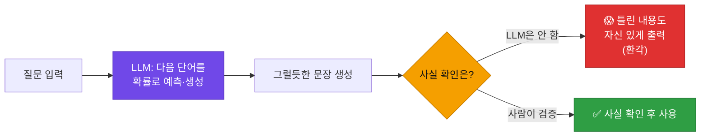
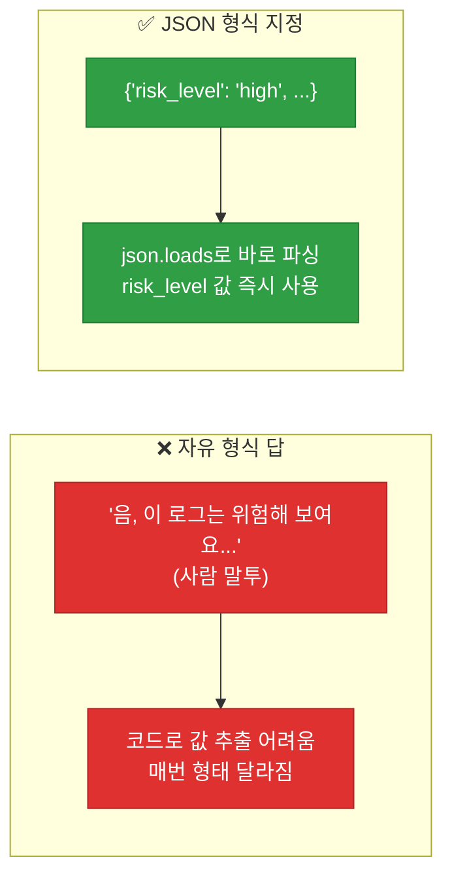
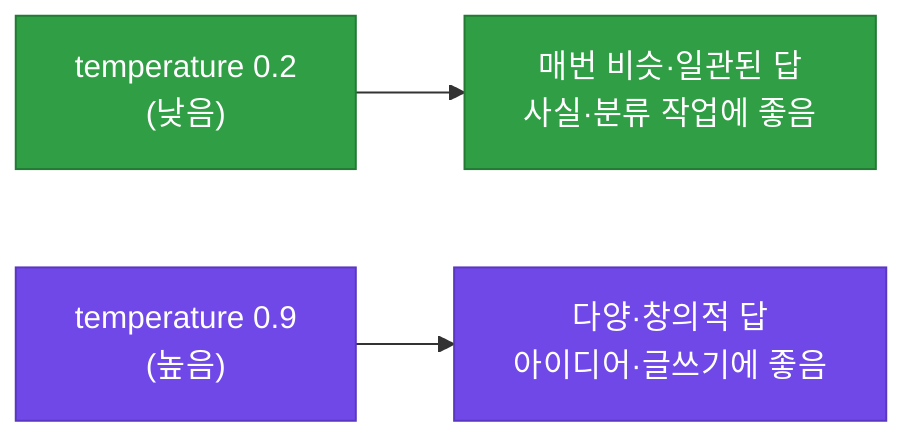
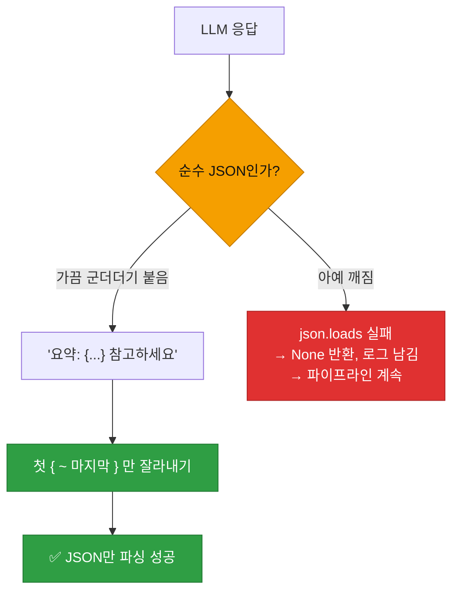

# 강의1 · LLM 개념과 프롬프트 엔지니어링 (오전, 총 120분)

> **이 교시 한 문장:** LLM이 "다음 단어를 확률로 생성"하는 원리와 **환각(사실이 아닐 수 있음)** 을 이해하고, **역할·지시·형식·예시** 4원칙으로 좋은 프롬프트를 설계하며, LLM API를 호출하고 응답을 안전하게 파싱합니다.

| 시간 | 소주제 | 핵심 한 줄 |
|------|--------|-----------|
| 00-20분 | LLM이란 | 다음 단어를 생성하는 모델 |
| 20-50분 | 프롬프트 4원칙 | 역할·지시·형식·예시 |
| 50-80분 | LLM API 호출 | requests로 부르기 |
| 80-105분 | 구조화된 출력 파싱 | 방어적으로 JSON 뽑기 |
| 105-120분 | AI Agent 예고 | 물어보기 → 스스로 하기 |

## 이 교시에 나오는 어려운 용어

| 용어 (한글발음) | 한 줄 뜻 (아주 쉽게) | 비유 |
|----------------|----------------------|------|
| **LLM(엘엘엠)** | 거대 언어모델(텍스트 생성 AI) | 똑똑한 자동완성 |
| **생성(generation)** | 답을 만들어냄(검색 아님) | 작문 |
| **환각(hallucination)** | 그럴듯한 거짓을 지어냄 | 자신 있게 틀림 |
| **프롬프트(prompt)** | LLM에게 주는 지시문 | 주문서 |
| **페르소나(persona)** | LLM에게 부여한 역할 | 배역 |
| **few-shot(퓨샷)** | 예시 몇 개 보여주기 | 견본 제시 |
| **temperature(템퍼러처)** | 답의 무작위성 정도 | 창의성 다이얼 |
| **`role`(롤)** | 메시지 발화자 구분 | system/user |
| **파싱(parsing)** | 텍스트에서 값 추출 | 골라내기 |
| **방어적 코드(defensive)** | 예외 상황 대비 | 안전벨트 |
| **`index`/`rindex`** | 문자 위치 찾기(앞/뒤) | 첫/마지막 위치 |
| **검증(verification)** | 사람이 최종 확인 | 검수 |

---

## ⏱️ 00-20분 · LLM(거대언어모델)이란

!!! info "📘 학습자 뷰 · 처음 보는 나"
    **LLM(거대언어모델)** 은 방대한 텍스트를 학습해, **"다음에 올 단어를 확률적으로 예측"** 하며 문장을 만들어냅니다. 핵심은 **'검색'이 아니라 '생성'** 이라는 점입니다.

    - 검색: 어딘가 저장된 정답을 찾아옴 → 정확
    - 생성: 그럴듯한 문장을 **만들어냄** → 자연스럽지만 **틀릴 수 있음**

    그래서 LLM은 때로 **환각(hallucination)** — 사실이 아닌데 **자신 있게 지어냅니다.** 보안 업무에선 이게 위험하므로 **반드시 사람이 최종 검증**해야 합니다.

### 🔬 깊이 보기 — 왜 환각이 생기나



LLM은 "가장 그럴듯한 다음 단어"를 이어붙일 뿐, **사실인지 검증하지 않습니다.** 그래서 존재하지 않는 IP, 없는 로그, 틀린 통계를 진짜처럼 만들어낼 수 있죠. LLM은 **똑똑한 조수**지만 **검수 없이 믿으면 안 되는** 조수입니다. 특히 보안 판단은 사람이 최종 확인해야 합니다.

!!! question "확인질문"
    **Q. LLM이 보안 이벤트 요약을 만들어줬을 때, 왜 그 내용을 100% 그대로 믿으면 안 될까요?**

    **A.** **LLM은 사실을 검색하는 게 아니라 그럴듯한 문장을 생성하는 것이라, 사실이 아닌 내용을 자신 있게 지어낼 수 있기 때문(환각)** 입니다.

    LLM은 학습한 패턴을 바탕으로 "다음에 올 법한 단어"를 이어 붙여 문장을 만듭니다. 이 과정에서 실제 로그에 없던 IP나 사용자, 잘못된 건수·통계를 마치 사실처럼 매끄럽게 써낼 수 있습니다. 요약문이 문법적으로 자연스럽고 그럴듯해 보여도 원본과 다를 수 있는 것이죠. 보안 이벤트는 이 요약을 근거로 차단·격리 같은 중대한 결정을 내리므로, 틀린 요약을 믿으면 잘못된 대응으로 이어집니다. 그래서 LLM 요약은 초안으로 활용하되, 반드시 원본 로그와 대조해 사람이 최종 검증한 뒤 사용해야 합니다.

<div class="quiz">
<p class="quiz-q"><span class="tag">퀴즈</span><b>LLM의 '환각(hallucination)'을 가장 잘 설명한 것은?</b></p>
<button class="quiz-opt">LLM이 응답을 거부하는 것</button>
<button class="quiz-opt" data-correct>사실이 아닌 내용을 그럴듯하고 자신 있게 지어내는 것</button>
<button class="quiz-opt">LLM이 너무 느리게 답하는 것</button>
<button class="quiz-opt">같은 질문에 항상 같은 답을 하는 것</button>
<div class="quiz-explain"><b>정답: 2번.</b> LLM은 '생성' 모델이라 검증 없이 그럴듯한 문장을 만듭니다. 그 과정에서 사실이 아닌 것을 자신 있게 지어내는 것이 환각입니다. 그래서 보안 판단은 사람 검증이 필수입니다.</div>
<button class="quiz-retry">다시 풀기</button>
</div>

---

## ⏱️ 20-50분 · 프롬프트 엔지니어링 기본 원칙

!!! abstract "이 블록을 마치면"
    ✔ ==역할·지시·형식·예시 4원칙==으로 좋은 프롬프트를 쓴다

### 🐍 문법 상자 — 프롬프트 4원칙

!!! tip "🐍 나쁜 프롬프트 vs 좋은 프롬프트"
    ```text
    ❌ 나쁜 예: "이 로그 요약해줘"
       → 무엇을, 어떻게, 어떤 형식으로인지 없음 → 제멋대로 답

    ✅ 좋은 예:
    "당신은 보안관제 애널리스트입니다.          ← ① 역할(persona)
     아래 로그 목록을 분석해                     ← ② 명확한 지시
     다음 형식의 JSON으로만 답하세요.            ← ③ 출력 형식 지정
     {"summary": "...", "risk_level": "low|medium|high",
      "recommended_action": "..."}
     예시: {...}                                 ← ④ 예시 제공(few-shot)
     로그: ..."
    ```

    | 원칙 | 뜻 | 효과 |
    |------|-----|------|
    | **① 역할(persona)** | "너는 보안 애널리스트다" | 전문적 관점으로 답 |
    | **② 명확한 지시** | 무엇을 하라고 구체적으로 | 딴 길로 안 샘 |
    | **③ 출력 형식** | "JSON으로만" | 코드로 처리 쉬움 |
    | **④ 예시(few-shot)** | 견본 몇 개 | 원하는 모양 학습 |

### 🔬 깊이 보기 — 출력 형식을 JSON으로 지정하면



LLM이 사람 말투로 답하면 **코드로 값을 뽑기 어렵습니다**(형태가 매번 다름). "JSON으로만 답하라"고 지정하면, Day3에서 배운 `json.loads`로 **바로 파싱**해 `risk_level` 같은 값을 즉시 쓸 수 있죠. **AI 응답을 자동화 코드에 연결하려면 형식 지정이 필수**입니다.

!!! question "확인질문"
    **Q. 출력 형식을 JSON으로 명확히 지정하면 이후 파이썬 코드에서 어떤 점이 편해질까요?**

    **A.** **`json.loads`로 바로 파싱해 원하는 값을 코드로 즉시 꺼내 쓸 수 있어 편해집니다.**

    LLM이 자유로운 문장으로 답하면 "위험도가 높다"는 말이 매번 다른 표현·형태로 나와, 거기서 위험도 값을 프로그램이 뽑아내기가 어렵습니다. 반면 `{"risk_level": "high", "summary": "..."}`처럼 JSON 형식으로 답하도록 지정하면, Day3에서 배운 `json.loads`로 그 응답을 파이썬 딕셔너리로 변환한 뒤 `result['risk_level']`처럼 값을 바로 꺼낼 수 있습니다. 그러면 "high면 알림 보내기" 같은 후속 자동화로 매끄럽게 연결됩니다. 즉 형식 지정은 LLM의 답을 사람이 읽는 글이 아니라 프로그램이 처리할 수 있는 데이터로 만들어 줍니다.

<div class="quiz">
<p class="quiz-q"><span class="tag">퀴즈</span><b>프롬프트 4원칙 중 "당신은 보안관제 애널리스트입니다"는 무엇에 해당하는가?</b></p>
<button class="quiz-opt">출력 형식 지정</button>
<button class="quiz-opt" data-correct>역할 부여(persona)</button>
<button class="quiz-opt">예시 제공(few-shot)</button>
<button class="quiz-opt">명확한 지시</button>
<div class="quiz-explain"><b>정답: 2번.</b> "당신은 ~입니다"로 배역을 주는 것이 역할 부여(persona)입니다. LLM이 그 관점에서 답하게 만들죠. 출력 형식은 "JSON으로", 지시는 "분석하라", 예시는 "이렇게 답하라"는 견본입니다.</div>
<button class="quiz-retry">다시 풀기</button>
</div>

---

## ⏱️ 50-80분 · LLM API 호출 실습

!!! abstract "이 블록을 마치면"
    ✔ ==Day4 requests로 LLM을 호출==하고 요청 본문을 이해한다

### 🐍 문법 상자 — LLM API 요청 본문

!!! tip "🐍 LLM 호출 (requests 재사용!)"
    ```python
    import requests

    payload = {
        'model': 'gpt-4o-mini',                          # 어떤 모델
        'messages': [                                     # 대화 메시지들
            {'role': 'system', 'content': '당신은 보안관제 애널리스트입니다.'},
            {'role': 'user',   'content': f'다음 로그를 요약하세요: {log_text}'},
        ],
        'temperature': 0.2,                               # 무작위성(낮을수록 일관)
    }
    response = requests.post(llm_url, json=payload, headers=headers)
    ```

    **➕ 다른 맥락 예제** — 번역 요청 payload:
    ```python
    payload = {
        'model': 'gpt-4o-mini',
        'messages': [
            {'role': 'system', 'content': '너는 번역가야.'},
            {'role': 'user', 'content': '"안녕"을 영어로'},
        ],
        'temperature': 0,     # 번역은 일관되게 → 0
    }
    ```

    - **`model`** : 사용할 LLM 이름.
    - **`messages`** : 대화 내용. 각 메시지에 **`role`**:
      - `system` : LLM의 역할·규칙 지정(페르소나).
      - `user` : 사용자의 실제 요청.
    - **`temperature`** : 답의 무작위성(0~1+). **낮으면 일관·안정**, 높으면 다양·창의.
    - 호출 자체는 **Day4의 `requests.post(json=...)` 그대로**입니다!

### 🔬 깊이 보기 — temperature 다이얼



**보안 요약·분류처럼 "일관된 정답"이 필요한 작업엔 temperature를 낮게(0.2)** 둡니다. 같은 로그엔 같은 요약이 나와야 신뢰할 수 있으니까요. 반대로 카피라이팅·브레인스토밍처럼 다양성이 필요하면 높입니다. 보안 자동화는 대개 **낮은 temperature**가 맞습니다.

!!! question "확인질문"
    **Q. temperature 값을 낮게(0.2) 설정하면 응답이 더 일관적일까요, 더 창의적일까요?**

    **A.** **더 일관적입니다.**

    temperature는 LLM이 다음 단어를 고를 때의 무작위성을 조절하는 값입니다. 값이 낮으면(예: 0.2) LLM이 가장 확률 높은 단어를 꾸준히 선택해, 같은 입력에 대해 매번 비슷하고 안정적인 답을 내놓습니다. 값이 높으면(예: 0.9) 덜 확률적인 단어도 선택해 답이 다양하고 창의적이지만 예측하기 어렵습니다. 보안 이벤트 요약이나 위험도 분류처럼 "같은 상황이면 같은 판단"이 필요한 작업에서는 일관성이 중요하므로 temperature를 낮게 설정하는 것이 적합합니다.

<div class="quiz">
<p class="quiz-q"><span class="tag">퀴즈</span><b>LLM API의 <code>messages</code>에서 <code>{'role': 'system', ...}</code>의 역할은?</b></p>
<button class="quiz-opt">사용자의 질문을 담는다</button>
<button class="quiz-opt" data-correct>LLM의 역할·규칙(페르소나)을 지정한다</button>
<button class="quiz-opt">응답을 저장한다</button>
<button class="quiz-opt">temperature를 설정한다</button>
<div class="quiz-explain"><b>정답: 2번.</b> `system` 역할 메시지는 "너는 보안 애널리스트다" 같은 LLM의 역할·행동 규칙을 정합니다. `user`는 실제 사용자 요청이죠. 프롬프트 4원칙의 '역할 부여'가 여기 담깁니다.</div>
<button class="quiz-retry">다시 풀기</button>
</div>

---

## ⏱️ 80-105분 · 구조화된 출력 파싱

!!! abstract "이 블록을 마치면"
    ✔ LLM이 JSON 앞뒤에 ==군더더기를 붙여도 안전하게 뽑는== 방어적 코드를 안다

### 🐍 문법 상자 — 방어적 JSON 파싱

!!! tip "🐍 LLM 응답에서 JSON만 추출"
    ```python
    import json

    def parse_llm_json(text):
        try:
            start = text.index('{')          # 첫 '{' 위치
            end = text.rindex('}') + 1        # 마지막 '}' 위치 +1
            return json.loads(text[start:end])  # 그 사이만 잘라 파싱
        except (ValueError, json.JSONDecodeError) as e:
            logging.warning(f'LLM 응답 파싱 실패: {e}')
            return None                       # 실패 시 None (안 죽음)
    ```

    **➕ 다른 맥락 예제** — 안전하게 float 변환(실패해도 안 죽음):
    ```python
    def to_float(text):
        try:
            return float(text)
        except ValueError:
            return None        # 못 바꾸면 None
    print(to_float('3.14'), to_float('없음'))   # 3.14 None
    ```

    - LLM은 `"네, 요약하면: {...} 입니다"`처럼 **JSON 앞뒤에 군더더기**를 붙일 때가 있습니다.
    - `text.index('{')` : 첫 `{`의 위치. `text.rindex('}')` : **마지막** `}`의 위치.
    - 그 사이(`text[start:end]`)만 잘라 `json.loads` → 군더더기 무시하고 JSON만.
    - 실패해도 **`None` 반환**(Day2 graceful 실패) → 파이프라인 안 멈춤.

### 🔬 깊이 보기 — 왜 방어적으로 파싱하나



LLM은 지시해도 **완벽히 JSON만** 주지 않을 때가 있습니다(생성 모델이라 변동). 그래서 "첫 `{`부터 마지막 `}`까지"를 잘라 **군더더기를 견디고**, 그래도 실패하면 **`None`을 반환**해 프로그램을 살립니다. AI 응답은 예측 불가라, 이런 방어적 처리가 특히 중요합니다.

!!! question "확인질문"
    **Q. LLM 응답 파싱에 실패했을 때 프로그램을 그대로 멈추게 하는 것과, `None`을 반환하고 계속 진행하는 것 중 자동화 파이프라인에는 어느 쪽이 안전할까요?**

    **A.** **`None`을 반환하고 계속 진행하는 쪽이 안전합니다.**

    LLM은 생성 모델이라 지시를 해도 가끔 형식이 어긋난 응답을 냅니다. 파싱 실패 때마다 프로그램을 멈추면, LLM 응답 하나가 이상할 때 전체 자동화 파이프라인이 중단되어 다른 정상 작업까지 못 하게 됩니다. 대신 파싱 실패 시 경고를 로그로 남기고 `None`을 반환하면, 그 한 건은 "요약 실패"로 처리하고 나머지 작업은 계속 진행할 수 있습니다. 중요한 것은 그냥 조용히 넘기지 않고 `logging.warning`으로 실패를 기록해, 나중에 "어떤 응답이 왜 파싱 안 됐는지"를 확인하고 프롬프트를 개선할 수 있게 하는 것입니다. Day2의 "graceful 실패"(빈 값 반환 + 로그) 원칙이 LLM 응답 처리에도 그대로 적용됩니다.

<div class="quiz">
<p class="quiz-q"><span class="tag">퀴즈</span><b><code>parse_llm_json</code>이 <code>text.index('{')</code>와 <code>text.rindex('}')</code> 사이만 잘라 파싱하는 이유는?</b></p>
<button class="quiz-opt">JSON을 더 예쁘게 만들려고</button>
<button class="quiz-opt" data-correct>LLM이 JSON 앞뒤에 붙인 군더더기 텍스트를 제거하고 JSON 부분만 파싱하려고</button>
<button class="quiz-opt">응답을 파일로 저장하려고</button>
<button class="quiz-opt">temperature를 낮추려고</button>
<div class="quiz-explain"><b>정답: 2번.</b> LLM은 "요약하면 {...}입니다"처럼 군더더기를 붙일 수 있습니다. 첫 `{`부터 마지막 `}`까지만 잘라내면 그 군더더기를 무시하고 JSON만 안전하게 파싱할 수 있습니다.</div>
<button class="quiz-retry">다시 풀기</button>
</div>

!!! tip "🧠 파인만 자가진단"
    안 보고 말할 수 있으면 통과입니다.

    1. LLM이 '생성'이라 환각이 생기는 이유와 사람 검증 필요성
    2. 프롬프트 4원칙과 각 예시
    3. temperature가 낮을 때/높을 때의 차이
    4. LLM JSON을 방어적으로 파싱하는 이유

---

## ⏱️ 105-120분 · AI Agent 개념 예고

!!! info "📘 학습자 뷰 · 처음 보는 나"
    지금까지는 LLM에게 **"한 번 물어보고 답 받기"** 만 했습니다. 오후에는 한 걸음 더 나아갑니다.

    - **지금(오전):** 내가 프롬프트로 물어보면 → LLM이 답 → 내가 처리
    - **오후(AI Agent):** LLM이 **"스스로 어떤 도구를 쓸지 판단"** → 우리 코드가 그 도구 실행

    LLM이 단순 답변자를 넘어 **"무엇을 할지 결정하는 두뇌"** 가 되는 구조를 봅니다. 캡스톤의 봇들이 다 이 위에서 돕니다.

---

## ✅ 가르칠 준비 체크리스트 (강의1)

- [ ] LLM의 '생성'과 환각, 사람 검증 필요성을 설명한다
- [ ] 프롬프트 4원칙을 나쁜 예/좋은 예로 대비한다
- [ ] 출력 형식 JSON 지정의 이점을 설명한다
- [ ] LLM API 호출이 Day4 requests와 같음을 짚는다
- [ ] temperature의 의미를 설명한다
- [ ] 방어적 JSON 파싱과 None 반환을 설명한다
- [ ] 확인질문 4개 + 퀴즈에 답한다

*[LLM]: Large Language Model — 거대 언어모델
*[hallucination]: 환각 — LLM이 사실 아닌 것을 지어내는 현상
*[prompt]: 프롬프트 — LLM에게 주는 지시문
*[temperature]: LLM 응답의 무작위성 조절값
