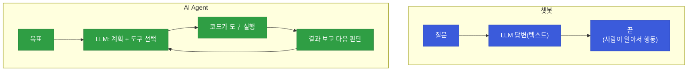
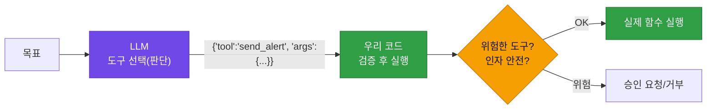
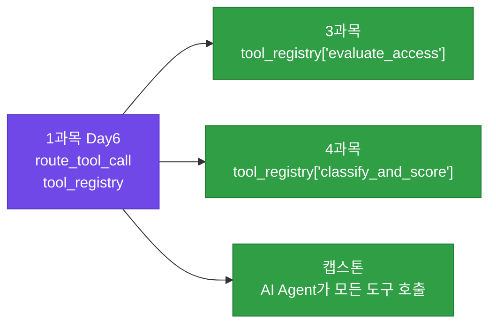
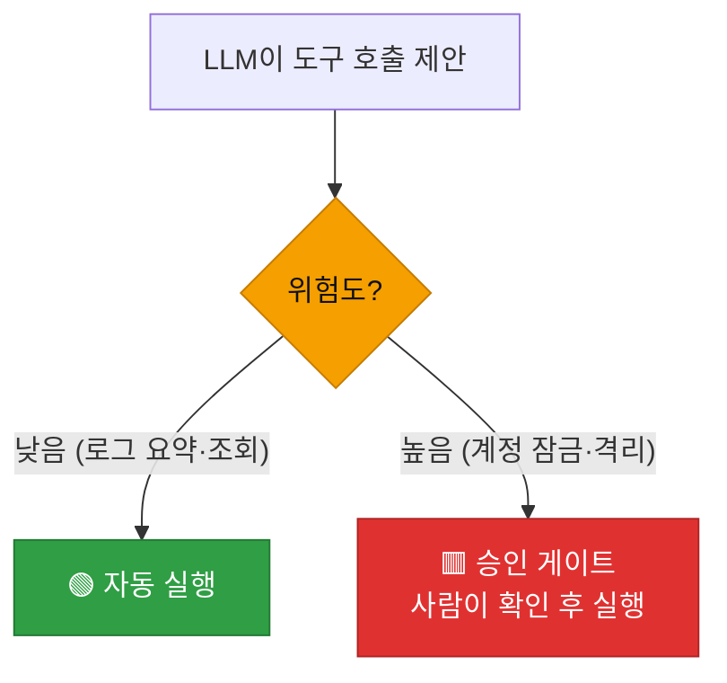

# 강의2 · AI Agent와 Tool-use 구조 (오후, 총 120분)

> **이 교시 한 문장:** LLM이 스스로 **어떤 도구(함수)를 쓸지 판단**하고, 실제 실행은 **우리 파이썬 코드(tool_registry)** 가 담당하는 AI Agent 구조를 만들고, 위험한 도구엔 **사람 승인**을 두는 안전장치를 이해합니다.

| 시간 | 소주제 | 핵심 한 줄 |
|------|--------|-----------|
| 00-25분 | AI Agent란 | 목표를 받아 스스로 수행 |
| 25-55분 | Tool-use 구조 | LLM은 선택, 실행은 코드 |
| 55-85분 | 도구 호출 라우터 | tool_registry 매핑 |
| 85-110분 | 승인 게이트 | 위험한 액션은 사람 승인 |
| 110-120분 | 실습 안내 | 미니 에이전트 |

## 이 교시에 나오는 어려운 용어

| 용어 (한글발음) | 한 줄 뜻 (아주 쉽게) | 비유 |
|----------------|----------------------|------|
| **AI Agent(에이전트)** | 목표 받아 스스로 도구 쓰는 AI | 유능한 비서 |
| **챗봇(chatbot)** | 질문에 답만 하는 것 | 안내데스크 |
| **Tool-use(툴유즈)** | LLM이 도구를 쓰는 구조 | 연장 쓰는 일꾼 |
| **도구(tool)** | LLM이 호출하는 함수 | 연장 |
| **라우터(router)** | 요청을 알맞은 곳으로 | 교환수 |
| **tool_registry** | 도구 이름↔함수 표 | 연장통 목록 |
| **`**args`(더블스타)** | 딕셔너리를 인자로 펼침 | 한 번에 넣기 |
| **승인 게이트(approval gate)** | 실행 전 사람 확인 | 결재선 |
| **위험도(risk level)** | 액션의 영향 크기 | 조회 vs 잠금 |
| **플레이북(playbook)** | 자동 대응 시나리오 | 대응 각본 |
| **오케스트레이션** | 여러 도구를 지휘 | 지휘자 |
| **매핑(mapping)** | 이름↔실체 연결 | 이름표 붙이기 |

---

## ⏱️ 00-25분 · AI Agent란 무엇인가

!!! info "📘 학습자 뷰 · 처음 보는 나"
    **챗봇**과 **AI Agent**의 차이가 핵심입니다.

    | | 챗봇 | AI Agent |
    |--|------|----------|
    | 목표 | 질문에 **답하기** | 목표를 **달성하기** |
    | 행동 | 텍스트 답변만 | 스스로 계획 + **도구 호출** |
    | 예 | "실패 로그가 뭐야?" → 설명 | "실패 로그 점검해서 위험하면 알려줘" → 스스로 함수 실행 |

    챗봇은 **말**만 하고, Agent는 **행동**합니다. 캡스톤의 '과다권한 자동 회수봇', '초동대응봇'이 다 Agent입니다.

### 🔬 깊이 보기 — 챗봇 vs Agent



챗봇은 "답하고 끝"이지만, Agent는 **목표를 받아 → 도구를 골라 실행 → 결과를 보고 → 다음 행동을 결정**하는 **순환**을 돕니다. "실패 로그를 점검해 위험하면 알려줘"라는 목표를 주면, Agent가 스스로 `count_failed_logins`를 부르고, 결과가 위험하면 `send_alert`를 부르는 식이죠.

!!! question "확인질문"
    **Q. 챗봇은 '질문에 답하는 것'이 목표라면, Agent는 무엇이 목표일까요?**

    **A.** **주어진 목표(작업)를 실제로 달성하는 것**이 목표입니다.

    챗봇은 사용자의 질문에 텍스트로 답변하면 역할이 끝납니다. 그 답을 바탕으로 실제 행동하는 것은 사람의 몫이죠. 반면 AI Agent는 "실패 로그를 점검해서 위험하면 담당자에게 알려줘" 같은 목표를 받으면, 스스로 무엇을 해야 할지 계획하고, 필요한 도구(함수)를 골라 호출해 작업을 수행하고, 그 결과를 보고 다음 행동을 결정합니다. 즉 챗봇의 목표가 '답변'이라면 Agent의 목표는 '작업 완수'입니다. 그래서 Agent는 말뿐 아니라 도구를 통해 실제 행동을 하며, 캡스톤의 자동 회수봇·초동대응봇이 이런 Agent 구조로 동작합니다.

<div class="quiz">
<p class="quiz-q"><span class="tag">퀴즈</span><b>단순 챗봇과 구별되는 AI Agent의 핵심 특징은?</b></p>
<button class="quiz-opt">더 긴 문장으로 답한다</button>
<button class="quiz-opt" data-correct>목표를 받아 스스로 도구(함수)를 선택·호출해 작업을 수행한다</button>
<button class="quiz-opt">더 빠르게 답한다</button>
<button class="quiz-opt">인터넷 없이 작동한다</button>
<div class="quiz-explain"><b>정답: 2번.</b> Agent는 '말'을 넘어 '행동'합니다. 목표를 받아 계획하고 도구를 호출해 실제 작업을 완수하죠. 챗봇은 답변으로 끝나고 행동은 사람 몫입니다.</div>
<button class="quiz-retry">다시 풀기</button>
</div>

---

## ⏱️ 25-55분 · Tool-use(함수 호출) 구조

!!! abstract "이 블록을 마치면"
    ✔ ==LLM은 도구를 '선택'만, 실행은 우리 코드==라는 역할 분담을 안다

### 🐍 문법 상자 — 도구 목록 제공

!!! tip "🐍 LLM에게 쓸 수 있는 도구 알려주기"
    ```python
    tools = [
        {'name': 'count_failed_logins',
         'description': '로그인 실패 횟수를 센다',
         'parameters': {'threshold': 'int'}},
        {'name': 'send_alert',
         'description': '담당자에게 알림을 보낸다',
         'parameters': {'message': 'str'}},
    ]
    # LLM에게 이 목록을 주면, 상황에 맞는 도구를 골라 응답:
    # {'tool': 'count_failed_logins', 'args': {'threshold': 5}}
    ```

    **➕ 다른 맥락 예제** — 계산기 도구 목록:
    ```python
    tools = [
        {'name': 'add', 'description': '두 수를 더한다',
         'parameters': {'a': 'int', 'b': 'int'}},
        {'name': 'now', 'description': '현재 시각을 알려준다',
         'parameters': {}},
    ]
    ```

    - LLM에게 **도구 목록**(이름·설명·파라미터)을 함께 줍니다.
    - LLM은 상황을 보고 **"이 도구를 이 인자로 호출해줘"** 라고 **JSON으로 응답**만 합니다.
    - ⚠️ **LLM은 실행하지 않습니다.** "무엇을 호출할지" 결정만 하고, 실제 실행은 **우리 코드**가 합니다.

### 🔬 깊이 보기 — 왜 실행은 우리 코드가 하나 (안전)



**LLM이 직접 함수를 실행하게 두면 위험합니다** — 환각으로 엉뚱한 도구를 부르거나, 위험한 인자를 넣을 수 있으니까요. 그래서 LLM은 **"제안(판단)"** 만 하고, 우리 코드가 **"이 도구가 존재하나? 인자가 안전한가? 위험한 액션인가?"** 를 검증한 뒤 실행합니다. **판단(LLM)과 실행(코드)을 분리**하는 게 AI Agent 안전의 핵심입니다.

!!! question "확인질문"
    **Q. LLM이 '이 함수를 호출해줘'라고 응답만 하고, 실제 실행은 누가 담당해야 안전할까요?**

    **A.** **우리 파이썬 코드(도구 라우터)가 검증을 거쳐 실행해야 안전합니다.**

    LLM은 환각으로 존재하지 않는 도구를 지목하거나, 위험한 인자를 넣어 호출을 제안할 수 있습니다. 만약 LLM이 함수를 직접 실행하게 두면 이런 잘못된 판단이 그대로 실제 동작(예: 엉뚱한 계정 잠금)으로 이어집니다. 그래서 LLM은 "어떤 도구를 어떤 인자로 부를지"를 JSON으로 제안만 하고, 실제 실행은 우리 코드가 맡습니다. 우리 코드는 그 도구가 등록된 것인지, 인자가 올바른지, 위험도가 높아 사람 승인이 필요한지를 검증한 뒤에야 함수를 실행합니다. 이렇게 '판단(LLM)'과 '실행(코드)'을 분리하면, LLM의 실수가 곧바로 사고로 번지는 것을 막을 수 있습니다.

<div class="quiz">
<p class="quiz-q"><span class="tag">퀴즈</span><b>Tool-use 구조에서 LLM과 우리 코드의 역할 분담으로 옳은 것은?</b></p>
<button class="quiz-opt">LLM이 도구를 선택하고 직접 실행까지 한다</button>
<button class="quiz-opt" data-correct>LLM은 어떤 도구를 부를지 '판단'만 하고, 실제 실행은 우리 코드가 검증 후 담당한다</button>
<button class="quiz-opt">우리 코드가 도구를 선택하고 LLM이 실행한다</button>
<button class="quiz-opt">LLM과 코드가 각자 따로 실행한다</button>
<div class="quiz-explain"><b>정답: 2번.</b> LLM은 '제안(판단)', 코드는 '검증 + 실행'입니다. 이 분리 덕분에 LLM의 환각이 곧바로 위험한 동작으로 이어지지 않습니다.</div>
<button class="quiz-retry">다시 풀기</button>
</div>

---

## ⏱️ 55-85분 · 간단한 도구 호출 라우터 구현

!!! abstract "이 블록을 마치면"
    ✔ ==LLM의 결정을 실제 함수에 연결하는 라우터==를 이해한다(agent_core 핵심 엔진)

### 💻 코드 완전 해부 — `route_tool_call()`

```python
tool_registry = {                                       # ① 이름 → 함수 표
    'count_failed_logins': count_failed_logins,
    'send_alert': send_alert,
}

def route_tool_call(llm_decision):
    tool_name = llm_decision['tool']                    # ② LLM이 고른 도구 이름
    args = llm_decision['args']                         # ③ 인자
    func = tool_registry.get(tool_name)                 # ④ 이름으로 실제 함수 찾기
    if func is None:                                    # ⑤ 없는 도구면
        raise ValueError(f'알 수 없는 도구: {tool_name}')  # ⑥ 에러!
    return func(**args)                                 # ⑦ 함수 실행
```

**➕ 다른 맥락 예제** — 명령어를 함수로 잇는 미니 라우터:
```python
def turn_on():  return '불 켬'
def turn_off(): return '불 끔'

commands = {'on': turn_on, 'off': turn_off}   # 이름 → 함수

def run(name):
    func = commands.get(name)
    if func is None:
        raise ValueError(f'모르는 명령: {name}')
    return func()

print(run('on'))    # 불 켬
```

| 줄 | 하는 일 | 왜 |
|:--:|---------|-----|
| **①** | "도구 이름 → 실제 함수" 딕셔너리 | 매핑표 |
| **②③** | LLM 결정에서 이름·인자 꺼내기 | 무엇을 부를지 |
| **④** | 이름으로 실제 함수 찾기 | 이름을 실체로 |
| **⑤⑥** | 등록 안 된 도구면 **에러** | 환각 도구 차단 |
| **⑦** | `**args`로 인자 펼쳐 실행 | 실제 호출 |

### 🐍 문법 상자 — `**args` (딕셔너리 펼치기)

!!! tip "🐍 딕셔너리를 인자로 펼치기"
    ```python
    args = {'threshold': 5}
    count_failed_logins(**args)      # = count_failed_logins(threshold=5)
    # ** 는 딕셔너리를 '키=값' 인자들로 펼쳐 넣음
    ```

    **➕ 다른 맥락 예제** — 딕셔너리로 함수 인자 넘기기:
    ```python
    def make_user(name, age):
        return f'{name}({age})'
    info = {'name': '민홍', 'age': 30}
    print(make_user(**info))   # 민홍(30)
    ```
    `**args`는 딕셔너리를 함수의 **키워드 인자로 펼쳐** 넣습니다. `{'threshold': 5}` → `threshold=5`. LLM이 준 인자를 그대로 함수에 전달할 때 유용합니다.

### 🔬 깊이 보기 — 이 라우터가 3·4과목의 그 tool_registry



**바로 이 `tool_registry`가 3·4과목 마지막 날 등장한 그것입니다.** 3과목이 `evaluate_full_access`를, 4과목이 `classify_and_score`를 여기 등록했죠. 오늘 만든 라우터가 **agent_core의 심장**이고, 각 과목의 도구가 여기 꽂혀 AI Agent가 부르는 구조입니다. registry 패턴(Day2 모듈, 4과목 classifier_registry)의 완성형이죠.

!!! question "확인질문"
    **Q. `tool_registry`에 없는 도구 이름이 오면 그냥 무시하지 않고 에러를 내는 이유는 무엇일까요?**

    **A.** **LLM이 환각으로 존재하지 않는 도구를 지목했을 수 있으니, 그것을 조용히 넘기지 말고 명확히 드러내야 하기 때문**입니다.

    LLM은 등록된 도구 목록을 줬더라도 가끔 목록에 없는 엉뚱한 도구 이름을 지어낼 수 있습니다(환각). 만약 없는 도구 이름을 그냥 무시하고 넘어가면, Agent는 "아무 일도 안 했는데 한 것처럼" 조용히 지나가 버려, 왜 작업이 수행되지 않았는지 알기 어렵습니다. 이는 Day2에서 배운 '조용한 실패'의 위험과 같습니다. `raise ValueError`로 에러를 내면, 잘못된 도구 지목이 즉시 그 자리에서 드러나 로그에 남고, 개발자가 "LLM이 왜 이런 이름을 냈지?"를 확인해 프롬프트나 도구 목록을 고칠 수 있습니다. 즉 에러를 내는 것은 문제를 숨기지 않고 빠르게 발견·수정하기 위한 안전장치입니다.

<div class="quiz">
<p class="quiz-q"><span class="tag">퀴즈</span><b><code>route_tool_call</code>이 <code>func(**args)</code>로 실행할 때 <code>**args</code>가 하는 일은?</b></p>
<button class="quiz-opt">args 딕셔너리를 파일로 저장한다</button>
<button class="quiz-opt" data-correct><code>{'threshold': 5}</code> 같은 딕셔너리를 <code>threshold=5</code> 형태의 키워드 인자로 펼쳐 함수에 넣는다</button>
<button class="quiz-opt">args의 개수를 센다</button>
<button class="quiz-opt">args를 JSON으로 변환한다</button>
<div class="quiz-explain"><b>정답: 2번.</b> `**`는 딕셔너리를 키워드 인자로 펼칩니다. `{'threshold': 5}`가 `threshold=5`로 전달되죠. LLM이 준 args를 그대로 함수에 넘길 때 편리합니다.</div>
<button class="quiz-retry">다시 풀기</button>
</div>

---

## ⏱️ 85-110분 · 안전장치 — 승인 게이트 개념 예고

!!! info "📘 학습자 뷰 · 처음 보는 나"
    모든 도구를 **자동 실행하면 위험**합니다. 영향이 큰 액션(계정 잠금, 서버 격리)을 LLM 판단만으로 실행하면 사고로 이어질 수 있죠. 그래서 **위험한 도구는 사람 승인**을 거칩니다 — 이걸 **승인 게이트(approval gate)** 라고 합니다.

### 🔬 깊이 보기 — 위험도에 따라 게이트를 다르게



**되돌리기 쉬운 것(조회·요약)은 자동, 되돌리기 어려운 것(잠금·삭제·격리)은 사람 승인.** 4과목의 "재현율 우선 → 사람 검토", 3과목의 "민감 권한은 승인 후 회수"와 똑같은 원리입니다. 이 승인 게이트가 **5과목 SOAR에서 본격적으로** 다뤄집니다.

!!! example "🎓 강사 뷰 · 자동화의 마지막 안전선"
    *"AI가 똑똑해도, 영향이 큰 결정은 사람이 최종 확인해야 합니다. '자동으로 다 하기'가 아니라 '위험한 건 물어보고 하기'가 진짜 프로의 자동화예요. 오늘 배운 Agent에 이 게이트를 붙이면 안전한 자동화가 됩니다."*

!!! question "확인질문"
    **Q. 로그를 요약하는 도구와 계정을 잠그는 도구, 둘 중 어느 쪽에 사람 승인이 더 필요할까요?**

    **A.** **계정을 잠그는 도구에 사람 승인이 더 필요합니다.**

    두 도구의 결정적 차이는 "영향의 크기와 되돌리기 쉬움"입니다. 로그를 요약하는 것은 정보를 읽어 정리할 뿐이라 잘못돼도 다시 요약하면 되고 실제 피해가 없습니다. 반면 계정을 잠그는 것은 그 사용자가 즉시 업무를 못 하게 되는 직접적 영향이 있고, 만약 오탐(정상 사용자를 공격자로 오인)이라면 무고한 사람의 업무가 마비되는 사고가 됩니다. 되돌리려면 다시 해제하는 수고와 시간도 듭니다. 그래서 영향이 크고 되돌리기 어려운 계정 잠금 같은 액션은 LLM이나 자동화의 판단만으로 실행하지 않고, 사람이 최종 확인하는 승인 게이트를 두어야 합니다. 3과목의 "민감 권한은 승인 후 회수", 4과목의 "사람 검토 단계"와 같은 원리입니다.

<div class="quiz">
<p class="quiz-q"><span class="tag">퀴즈</span><b>어떤 도구에 '승인 게이트(사람 승인)'를 두어야 하는지 판단하는 기준으로 가장 적절한 것은?</b></p>
<button class="quiz-opt">도구 이름의 길이</button>
<button class="quiz-opt" data-correct>액션의 영향이 크고 되돌리기 어려운가(계정 잠금·격리 등)</button>
<button class="quiz-opt">도구가 등록된 순서</button>
<button class="quiz-opt">LLM이 좋아하는가</button>
<div class="quiz-explain"><b>정답: 2번.</b> 되돌리기 쉬운 조회·요약은 자동, 되돌리기 어려운 잠금·삭제·격리는 사람 승인입니다. 3과목(민감권한 승인 후 회수)·4과목(사람 검토)과 같은 기준이고, 5과목 SOAR에서 본격화됩니다.</div>
<button class="quiz-retry">다시 풀기</button>
</div>

!!! tip "🧠 파인만 자가진단"
    안 보고 말할 수 있으면 통과입니다.

    1. 챗봇과 AI Agent의 차이
    2. Tool-use에서 LLM(판단)과 코드(실행)의 분담
    3. `tool_registry`와 `route_tool_call`이 하는 일
    4. 승인 게이트를 어떤 도구에 두는지

---

## ⏱️ 110-120분 · 실습 안내

**오후 정리:**

1. **AI Agent** — 목표를 받아 스스로 도구 호출(챗봇=답변, Agent=행동)
2. **Tool-use** — LLM은 **선택(판단)만**, 실행은 **우리 코드**(안전 분리)
3. **tool_registry + route_tool_call** — 이름을 실제 함수에 매핑(3·4과목의 그 엔진)
4. **승인 게이트** — 위험한 액션은 사람 승인(5과목 SOAR 예고)

!!! note "실습 예고 (오후 실습 120분)"
    `llm_client.py`(call_llm)로 Day3 `normalized_logs.json`을 요약하고, `parse_llm_json`으로 안전 파싱하며, `tool_router.py`에 `tool_registry`·`route_tool_call` 뼈대(도구 1~2개)를 만들어 LLM 결정을 실행해 봅니다. 상세는 [실습 페이지](practice.md).

---

## ✅ 가르칠 준비 체크리스트 (강의2)

- [ ] 챗봇 vs Agent를 목표·행동으로 구분한다
- [ ] Tool-use의 LLM(판단)/코드(실행) 분리를 설명한다
- [ ] tool_registry·route_tool_call을 한 줄씩 설명한다
- [ ] `**args` 딕셔너리 펼치기를 설명한다
- [ ] 이 라우터가 3·4과목 tool_registry임을 연결한다
- [ ] 승인 게이트의 판단 기준을 설명한다
- [ ] 확인질문 4개 + 퀴즈에 답한다

*[AI Agent]: 목표를 받아 스스로 도구를 호출해 수행하는 AI
*[Tool-use]: LLM이 도구(함수)를 선택·활용하는 구조
*[approval gate]: 위험한 액션 실행 전 사람 승인을 두는 안전장치
