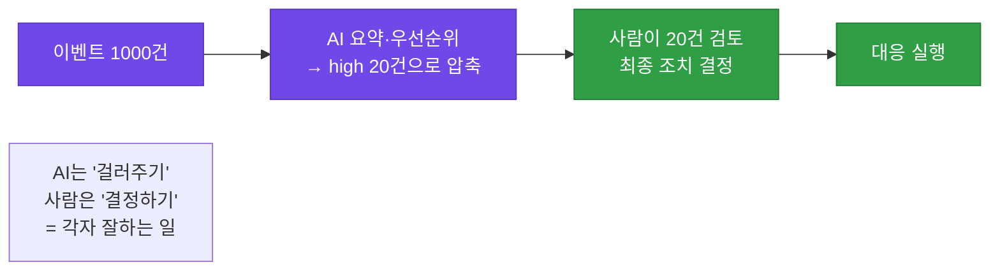
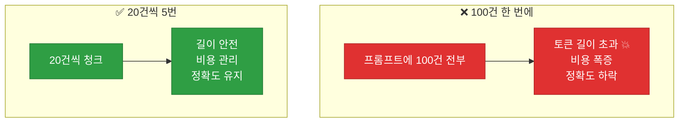
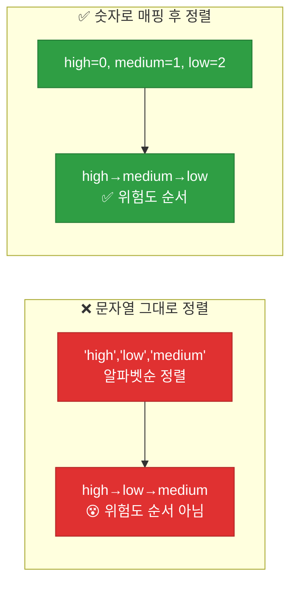
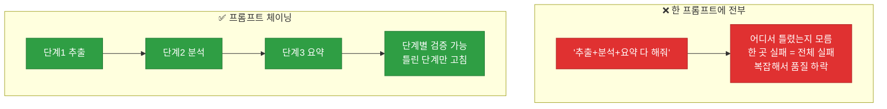
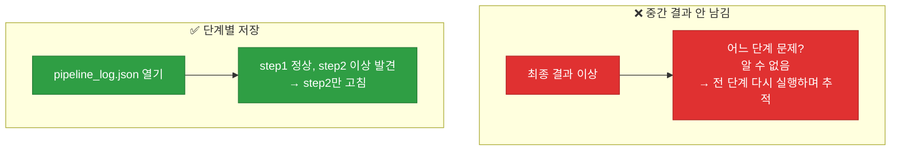

# 강의1 · 이벤트 요약 자동화와 프롬프트 체이닝 (오전, 총 120분)

> **이 교시 한 문장:** 수백 건의 이벤트를 **청크(배치)로 나눠** LLM에 요약시키고, 결과를 **우선순위로 정렬**하며, 긴 작업을 여러 단계로 쪼개는 **프롬프트 체이닝**과 그 **중간 결과 로깅**을 익힙니다.

| 시간 | 소주제 | 핵심 한 줄 |
|------|--------|-----------|
| 00-20분 | 이벤트 요약의 실무 맥락 | 사람이 다 못 본다 |
| 20-45분 | 요약 프롬프트·배치 처리 | 청크로 나눠 넣기 |
| 45-70분 | 우선순위 정렬 | 문자열을 숫자로 매핑 |
| 70-95분 | 프롬프트 체이닝 | 단계로 나눠 호출 |
| 95-120분 | 체이닝 검증·로깅 | 중간 결과 저장 |

## 이 교시에 나오는 어려운 용어

| 용어 (한글발음) | 한 줄 뜻 (아주 쉽게) | 비유 |
|----------------|----------------------|------|
| **Human-in-the-loop** | 사람이 최종 확인하는 구조 | 최종 결재 |
| **배치(batch)** | 여러 건을 묶어 처리 | 한 트럭씩 |
| **청크(chunk)** | 데이터를 나눈 조각 | 페이지 나누기 |
| **제너레이터(generator)** | 값을 하나씩 내주는 함수 | 필요할 때 꺼냄 |
| **`yield`(일드)** | 값을 하나 내주고 멈춤 | 한 개씩 배급 |
| **토큰 길이 제한** | LLM 입력 최대 크기 | 그릇 크기 |
| **매핑(mapping)** | 값↔값 연결 | 환산표 |
| **`sorted(key=)`** | 기준으로 정렬 | 줄 세우기 |
| **`lambda`(람다)** | 이름 없는 짧은 함수 | 즉석 계산식 |
| **프롬프트 체이닝** | 여러 단계로 LLM 호출 | 릴레이 |
| **중간 결과(intermediate)** | 단계별 산출물 | 공정 중간품 |
| **추적(trace)** | 문제 경로 되짚기 | 역추적 |

---

## ⏱️ 00-20분 · 이벤트 요약이 필요한 실무 맥락

!!! info "📘 학습자 뷰 · 처음 보는 나"
    보안관제 담당자는 하루 **수백~수천 건** 이벤트를 봅니다. 사람이 다 확인하긴 불가능하죠. 그래서 **AI가 요약·우선순위**를 도와 업무 부담을 줄입니다.

    단, **최종 판단은 사람이** 합니다. 이걸 **Human-in-the-loop(사람이 루프 안에)** 라고 합니다. AI는 초안·보조, 결정은 사람.

### 🔬 깊이 보기 — AI 요약 + 사람 판단



AI가 1000건을 20건으로 **압축**하면(4과목 피라미드!), 사람은 그 20건만 깊이 봅니다. AI는 **양을 줄이고**, 사람은 **질을 판단**하죠. LLM은 환각(Day6)이 있으니, **최종 조치는 반드시 사람이 확인**해야 합니다 — 특히 되돌리기 어려운 대응은요.

!!! question "확인질문"
    **Q. AI가 요약과 우선순위까지 정해주더라도, 왜 최종 조치는 사람이 확인 후 결정해야 할까요?**

    **A.** **LLM은 환각으로 요약·판단이 틀릴 수 있고, 잘못된 조치는 되돌리기 어려운 피해를 낳기 때문**입니다.

    AI는 많은 이벤트를 빠르게 요약하고 우선순위를 매겨 사람의 부담을 크게 줄여줍니다. 하지만 Day6에서 배웠듯 LLM은 사실이 아닌 것을 그럴듯하게 지어낼 수 있어, 요약이나 위험도 판단이 틀릴 가능성이 항상 있습니다. 만약 그 판단만 믿고 자동으로 계정 잠금 같은 조치를 실행하면, 오판일 경우 무고한 사용자의 업무를 마비시키는 등 되돌리기 힘든 피해가 생깁니다. 그래서 AI의 요약·우선순위는 사람이 빠르게 검토하도록 돕는 '초안·보조'로 쓰고, 실제 조치 결정은 사람이 원본과 대조해 최종 확인한 뒤 내려야 합니다. 이것이 Human-in-the-loop, 즉 자동화의 흐름 안에 사람의 판단을 반드시 남겨두는 설계입니다.

<div class="quiz">
<p class="quiz-q"><span class="tag">퀴즈</span><b>'Human-in-the-loop' 설계의 핵심은?</b></p>
<button class="quiz-opt">사람을 완전히 배제하고 AI가 다 처리한다</button>
<button class="quiz-opt" data-correct>AI가 요약·우선순위로 부담을 줄이되, 최종 판단·조치는 사람이 확인해 결정한다</button>
<button class="quiz-opt">AI 없이 사람이 모든 것을 수동으로 한다</button>
<button class="quiz-opt">AI가 사람의 승인을 무시한다</button>
<div class="quiz-explain"><b>정답: 2번.</b> Human-in-the-loop은 AI(양 줄이기)와 사람(질 판단하기)의 협업입니다. LLM 환각 위험과 되돌리기 어려운 조치 때문에 최종 결정은 사람이 유지합니다.</div>
<button class="quiz-retry">다시 풀기</button>
</div>

---

## ⏱️ 20-45분 · 요약 프롬프트 설계와 배치 처리

!!! abstract "이 블록을 마치면"
    ✔ ==많은 입력을 청크로 나눠== 처리하는 제너레이터를 안다

### 🐍 문법 상자 — chunk_list (제너레이터)

!!! tip "🐍 큰 목록을 조각내기"
    ```python
    def chunk_list(items, size=20):
        for i in range(0, len(items), size):     # 0, 20, 40, ...
            yield items[i:i+size]                # 20개씩 잘라서 하나씩 내줌

    all_summaries = []
    for batch in chunk_list(events, size=20):     # 20건씩 반복
        result = call_llm(build_prompt(batch))
        all_summaries.extend(parse_llm_json(result) or [])   # 결과 모으기
    ```

    **➕ 다른 맥락 예제** — 사진을 10장씩 묶어 처리:
    ```python
    def chunk_list(items, size=10):
        for i in range(0, len(items), size):
            yield items[i:i+size]
    photos = list(range(1, 25))          # 24장
    for group in chunk_list(photos, 10):
        print(len(group))                # 10, 10, 4
    ```

    - **`range(0, len, size)`** : 0, 20, 40… 인덱스를 건너뛰며 생성.
    - **`items[i:i+size]`** : i번째부터 20개 슬라이스(조각).
    - **`yield`** : `return`과 달리 **값을 하나 내주고 멈췄다가**, 다음에 이어서 실행. 이런 함수가 **제너레이터**.
    - `.extend(리스트)` : 리스트를 통째로 이어 붙임(`append`는 하나만).
    - `parse_llm_json(result) or []` : 파싱 실패로 None이면 빈 리스트(Day6 방어).

### 🐍 문법 상자 — yield vs return

!!! tip "🐍 제너레이터의 핵심 yield"
    ```python
    def with_return():
        return [1, 2, 3]      # 리스트 전체를 한 번에

    def with_yield():
        yield 1               # 1 내주고 멈춤
        yield 2               # (다음 요청 시) 2 내주고 멈춤
        yield 3
    ```

    **➕ 다른 맥락 예제** — 하나씩 세는 제너레이터:
    ```python
    def count_up(n):
        for i in range(1, n + 1):
            yield i           # 1, 2, 3... 하나씩
    for x in count_up(3):
        print(x)              # 1 / 2 / 3
    ```
    - `return`은 **전부 한 번에** 만들어 돌려줍니다(메모리 많이 씀).
    - `yield`는 **하나씩** 내줘서, 큰 데이터도 **메모리 조금씩** 쓰며 처리합니다.
    - `chunk_list`는 청크를 하나씩 내주므로 제너레이터로 만듭니다.

### 🔬 깊이 보기 — 왜 배치(청크)로 나누나



LLM은 **한 번에 넣을 수 있는 길이(토큰) 제한**이 있습니다. 100건을 한 프롬프트에 다 넣으면 **초과**하거나, 되더라도 **비용이 크고 정확도가 떨어집니다.** 20건씩 나눠(청크) 여러 번 부르면 길이·비용이 관리되고 각 요약도 정확해집니다. 4과목 pandas의 rolling window처럼 "큰 걸 잘라서" 다루는 정신입니다.

!!! question "확인질문"
    **Q. 이벤트가 100건인데 프롬프트에 전부 넣으면 어떤 문제가 생길 수 있을까요?**

    **A.** **입력 길이(토큰) 제한을 초과하거나, 비용이 커지고 요약 정확도가 떨어질 수 있습니다.**

    LLM은 한 번에 처리할 수 있는 입력 길이에 제한(토큰 한도)이 있습니다. 100건을 한 프롬프트에 모두 넣으면 이 한도를 넘어 아예 요청이 거부되거나 뒷부분이 잘릴 수 있습니다. 설령 들어간다 해도, 입력이 길수록 API 비용이 늘고, LLM이 많은 내용을 한꺼번에 처리하면서 중요한 이벤트를 놓치거나 뭉뚱그려 요약 품질이 떨어질 수 있습니다. 그래서 `chunk_list`로 20건씩 나눠 여러 번 나눠 호출하면, 각 요청이 길이 제한 안에 들어가고 비용도 관리되며 각 묶음을 더 정확하게 요약할 수 있습니다.

<div class="quiz">
<p class="quiz-q"><span class="tag">퀴즈</span><b><code>chunk_list</code>에서 <code>return</code> 대신 <code>yield</code>를 쓰는 이유는?</b></p>
<button class="quiz-opt">yield가 더 빠르게 실행되어서</button>
<button class="quiz-opt" data-correct>청크를 한꺼번에 다 만들지 않고 하나씩 내줘, 큰 데이터도 메모리를 조금씩 쓰며 처리하려고</button>
<button class="quiz-opt">yield는 리스트를 자동 정렬해서</button>
<button class="quiz-opt">return은 반복문에서 쓸 수 없어서</button>
<div class="quiz-explain"><b>정답: 2번.</b> yield는 값을 하나씩 내주는 제너레이터를 만듭니다. 모든 청크를 한 번에 메모리에 올리지 않고 필요할 때마다 하나씩 생성해, 큰 데이터를 효율적으로 처리합니다.</div>
<button class="quiz-retry">다시 풀기</button>
</div>

---

## ⏱️ 45-70분 · 요약 결과 후처리 — 우선순위 정렬

!!! abstract "이 블록을 마치면"
    ✔ ==문자열 위험도를 숫자로 매핑해 정렬==하는 법을 안다

### 🐍 문법 상자 — risk_order 매핑 + sorted

!!! tip "🐍 위험도순으로 줄 세우기"
    ```python
    risk_order = {'high': 0, 'medium': 1, 'low': 2}   # 문자열 → 순서 숫자

    sorted_summaries = sorted(
        all_summaries,
        key=lambda x: risk_order.get(x['risk_level'], 3)   # high(0)가 앞으로
    )
    ```

    **➕ 다른 맥락 예제** — 메달을 원하는 순서로 정렬:
    ```python
    order = {'금': 0, '은': 1, '동': 2}
    medals = ['동', '금', '은']
    print(sorted(medals, key=lambda m: order[m]))   # ['금', '은', '동']
    ```

    - **`sorted(목록, key=기준)`** : 기준값 순으로 정렬(작은 값이 앞).
    - `risk_order['high']=0`이라 high가 맨 앞. 숫자로 바꿔야 정렬 순서가 명확.
    - **`key=lambda x: ...`** : 각 항목 x에서 "정렬 기준으로 쓸 값"을 뽑는 즉석 함수.
    - `.get(..., 3)` : 예상 밖 값('unknown' 등)은 3(맨 뒤)으로 안전 처리.

### 🐍 문법 상자 — lambda (이름 없는 함수)

!!! tip "🐍 lambda 뜯어보기"
    ```python
    # 이 두 개는 같은 일
    def get_risk(x):
        return risk_order.get(x['risk_level'], 3)

    get_risk_lambda = lambda x: risk_order.get(x['risk_level'], 3)
    ```

    **➕ 다른 맥락 예제** — 길이 기준으로 단어 정렬:
    ```python
    words = ['바나나', '배', '사과']
    print(sorted(words, key=lambda w: len(w)))   # ['배', '사과', '바나나']
    ```
    `lambda x: 식`은 "x를 받아 식을 돌려주는" **한 줄짜리 이름 없는 함수**입니다. `sorted`의 key처럼 "잠깐 쓸 작은 함수"에 편리합니다(4과목 `sort(key=lambda ...)`에서도 봤죠).

### 🔬 깊이 보기 — 왜 문자열이 아니라 숫자로 정렬하나



문자열을 그냥 정렬하면 **알파벳순**(h→l→m)이라 위험도 순서가 아닙니다. `risk_order`로 **의미 있는 숫자**를 부여하면 high→medium→low로 올바로 정렬되죠. "정렬 기준을 코드로 명확히 정한다"가 핵심입니다.

!!! question "확인질문"
    **Q. LLM이 `risk_level`에 `'High'`처럼 대문자로 응답하면 `risk_order.get()`에서 어떤 문제가 생길까요?**

    **A.** **매핑 딕셔너리에 `'High'`라는 키가 없어 기본값(3)으로 처리되어, high인데도 맨 뒤로 정렬됩니다.**

    `risk_order`에는 소문자 `'high'`만 키로 등록돼 있습니다. 파이썬 딕셔너리의 키는 대소문자를 구분하므로 `'High'`와 `'high'`는 다른 키입니다. 그래서 LLM이 `'High'`로 응답하면 `risk_order.get('High', 3)`이 키를 못 찾아 기본값 3을 돌려주고, 실제로는 가장 위험한 항목인데도 정렬에서 low(2)보다 뒤인 맨 끝으로 밀려납니다. LLM은 생성 모델이라 지시해도 대소문자·표현이 흔들릴 수 있으므로, 이를 방지하려면 `x['risk_level'].lower()`처럼 소문자로 변환한 뒤 매핑하거나, 프롬프트에서 소문자로만 답하라고 명확히 지정하는 등 정규화가 필요합니다. Day6의 방어적 처리와 같은 맥락입니다.

<div class="quiz">
<p class="quiz-q"><span class="tag">퀴즈</span><b><code>sorted(items, key=lambda x: risk_order.get(x['risk_level'], 3))</code>에서 <code>.get(..., 3)</code>의 <code>3</code>이 하는 일은?</b></p>
<button class="quiz-opt">항목을 3개만 정렬한다</button>
<button class="quiz-opt" data-correct>risk_order에 없는 예상 밖 값을 만나면 기본값 3(맨 뒤)으로 안전하게 처리한다</button>
<button class="quiz-opt">3초 후 정렬한다</button>
<button class="quiz-opt">3개 그룹으로 나눈다</button>
<div class="quiz-explain"><b>정답: 2번.</b> `.get(키, 기본값)`은 키가 없을 때 기본값을 줍니다. 여기선 예상 밖 risk_level('unknown' 등)을 3으로 처리해 맨 뒤로 보내고, KeyError로 죽지 않게 합니다. Day1 `.get`의 안전 활용이죠.</div>
<button class="quiz-retry">다시 풀기</button>
</div>

---

## ⏱️ 70-95분 · 프롬프트 체이닝이란

!!! abstract "이 블록을 마치면"
    ✔ ==긴 작업을 여러 단계로 나눠== LLM을 순차 호출하는 이점을 안다

!!! info "📘 학습자 뷰 · 처음 보는 나"
    복잡한 작업을 **한 번의 프롬프트로 다** 시키면 LLM이 헤맵니다. **여러 단계로 나눠** 순차 호출하는 게 **프롬프트 체이닝**입니다.

    ```text
    단계1: 로그에서 핵심 정보 추출  → 결과1
    단계2: 결과1을 분석해 위험도 판정 → 결과2
    단계3: 결과2를 사람이 읽을 요약으로 → 최종
    ```

    각 단계의 **출력이 다음 단계의 입력**이 됩니다(릴레이).

### 🔬 깊이 보기 — 한 방에 vs 단계로 나눠



한 프롬프트에 다 시키면 **어느 부분이 틀렸는지** 알 수 없고, 복잡해서 품질도 떨어집니다. 단계로 나누면 **각 단계를 따로 검증**할 수 있고, 틀린 단계만 고치면 됩니다. 3·4과목의 "함수를 작게 나눠 오케스트레이션"과 같은 원리 — 큰 문제를 작은 단계로 쪼개는 것이죠.

!!! question "확인질문"
    **Q. 긴 작업을 한 번에 시키는 것과 여러 단계로 나눠 시키는 것, 오류가 났을 때 어느 쪽이 원인 파악이 쉬울까요?**

    **A.** **여러 단계로 나눈 쪽(프롬프트 체이닝)이 원인 파악이 훨씬 쉽습니다.**

    한 번의 프롬프트로 추출·분석·요약을 모두 시키면, 최종 결과가 이상해도 그 안의 어느 과정에서 틀렸는지 알 수 없습니다. 추출이 잘못됐는지, 분석이 틀렸는지, 요약만 이상한지 구분이 안 되니 전체를 다시 손봐야 합니다. 반면 단계를 나누면 각 단계의 입력과 출력이 분리되어, 단계1 결과, 단계2 결과를 각각 확인할 수 있습니다. 그러면 "단계2의 위험도 판정이 틀렸다"처럼 문제가 난 지점을 정확히 짚어 그 단계의 프롬프트만 고치면 됩니다. 작은 단위로 나눠 각각 검증할 수 있다는 점에서, 함수를 잘게 나누면 디버깅이 쉬워지는 것과 같은 이점입니다.

<div class="quiz">
<p class="quiz-q"><span class="tag">퀴즈</span><b>프롬프트 체이닝(작업을 여러 LLM 호출 단계로 나눔)의 이점으로 가장 적절한 것은?</b></p>
<button class="quiz-opt">LLM 호출 횟수가 줄어 비용이 준다</button>
<button class="quiz-opt" data-correct>각 단계를 따로 검증할 수 있어, 오류 시 어느 단계가 틀렸는지 짚어 고치기 쉽다</button>
<button class="quiz-opt">환각이 완전히 사라진다</button>
<button class="quiz-opt">프롬프트를 안 써도 된다</button>
<div class="quiz-explain"><b>정답: 2번.</b> 체이닝은 큰 작업을 검증 가능한 작은 단계로 나눕니다. 틀린 단계만 특정·수정할 수 있죠(호출 횟수는 오히려 늘 수 있으니 1번은 오답). 함수를 잘게 나누는 것과 같은 원리입니다.</div>
<button class="quiz-retry">다시 풀기</button>
</div>

---

## ⏱️ 95-120분 · 체이닝 결과 검증과 로깅

!!! abstract "이 블록을 마치면"
    ✔ ==각 단계의 중간 결과를 저장해== 문제를 추적하는 습관을 안다

### 🐍 문법 상자 — 중간 결과 저장

!!! tip "🐍 단계별 결과 남기기"
    ```python
    import json

    with open('pipeline_log.json', 'w', encoding='utf-8') as f:
        json.dump(
            {'step1': step1_result, 'step2': step2_result},   # 각 단계 결과
            f, ensure_ascii=False, indent=2,
        )
    ```

    **➕ 다른 맥락 예제** — 계산 과정을 단계별로 저장:
    ```python
    import json
    steps = {'입력': 10, '2배': 20, '+5': 25}
    with open('steps.json', 'w', encoding='utf-8') as f:
        json.dump(steps, f, ensure_ascii=False, indent=2)
    ```

    - 체이닝의 **각 단계 결과를 파일로** 남깁니다.
    - 최종 결과가 이상할 때, 이 파일을 열어 **어느 단계에서 틀어졌는지** 봅니다.

### 🔬 깊이 보기 — 중간 결과가 없으면 디버깅 지옥



중간 결과를 안 남기면, 최종이 이상할 때 **어느 단계가 범인인지** 몰라 전체를 다시 돌려가며 찾아야 합니다. 단계별로 저장하면 파일을 열어 **"step1은 정상인데 step2에서 틀어졌다"** 를 즉시 봅니다. Day2 로깅, Day1 건수 대조, Day3 매칭 실패 기록과 같은 "추적 가능성" 정신 — AI 파이프라인에도 그대로 적용됩니다.

!!! question "확인질문"
    **Q. 중간 단계 결과를 저장해두지 않으면, 최종 결과가 이상할 때 원인을 어떻게 찾아야 할까요?**

    **A.** **각 단계를 처음부터 다시 실행하며 어디서 틀어졌는지 일일이 확인해야 하는, 훨씬 번거로운 추적을 해야 합니다.**

    프롬프트 체이닝은 추출→분석→요약처럼 여러 단계를 거칩니다. 중간 결과를 저장하지 않으면 최종 출력만 남으므로, 그것이 이상할 때 어느 단계가 문제인지 알 수 있는 단서가 없습니다. 결국 단계1부터 다시 실행해 결과를 눈으로 확인하고, 단계2를 실행해 또 확인하는 식으로 하나씩 되짚어야 합니다. LLM은 매번 응답이 조금씩 달라질 수도 있어 재현조차 어려울 수 있습니다. 반대로 각 단계 결과를 `pipeline_log.json` 같은 파일에 남겨두면, 그 파일을 열어 "단계1은 정상인데 단계2 출력이 잘못됐다"를 바로 확인하고 해당 단계의 프롬프트만 수정할 수 있습니다. 그래서 중간 결과 저장은 문제 발생 시 원인을 빠르게 특정하는 필수 습관입니다.

<div class="quiz">
<p class="quiz-q"><span class="tag">퀴즈</span><b>프롬프트 체이닝에서 각 단계 중간 결과를 파일로 저장하는 주된 이유는?</b></p>
<button class="quiz-opt">저장하면 LLM이 더 정확해져서</button>
<button class="quiz-opt" data-correct>최종 결과가 이상할 때 어느 단계에서 틀어졌는지 추적해 그 단계만 고칠 수 있어서</button>
<button class="quiz-opt">저장하면 비용이 줄어서</button>
<button class="quiz-opt">저장은 필수가 아니라 장식이라서</button>
<div class="quiz-explain"><b>정답: 2번.</b> 중간 결과 저장은 추적 가능성을 줍니다. 단계별 산출물을 보면 문제 지점을 특정할 수 있죠. Day1~3의 "조용한 손실 방지·추적" 원칙이 AI 파이프라인에도 이어집니다.</div>
<button class="quiz-retry">다시 풀기</button>
</div>

!!! tip "🧠 파인만 자가진단"
    안 보고 말할 수 있으면 통과입니다.

    1. Human-in-the-loop이 필요한 이유
    2. `yield`/제너레이터로 배치 처리하는 이유
    3. 문자열 위험도를 숫자로 매핑해 정렬하는 이유
    4. 프롬프트 체이닝과 중간 결과 저장의 이점

---

## ✅ 가르칠 준비 체크리스트 (강의1)

- [ ] Human-in-the-loop과 AI 요약의 역할을 설명한다
- [ ] chunk_list(yield)로 배치 처리를 설명한다
- [ ] 배치로 나누는 이유(토큰·비용·정확도)를 설명한다
- [ ] risk_order 매핑 + sorted(key=lambda)를 설명한다
- [ ] 대소문자 불일치 문제를 짚는다
- [ ] 프롬프트 체이닝과 중간 결과 저장을 설명한다
- [ ] 확인질문 4개 + 퀴즈에 답한다

*[Human-in-the-loop]: 자동화 흐름에 사람의 최종 판단을 두는 설계
*[generator]: yield로 값을 하나씩 내주는 함수
*[프롬프트 체이닝]: 작업을 여러 LLM 호출 단계로 나누는 기법
