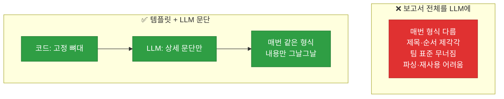
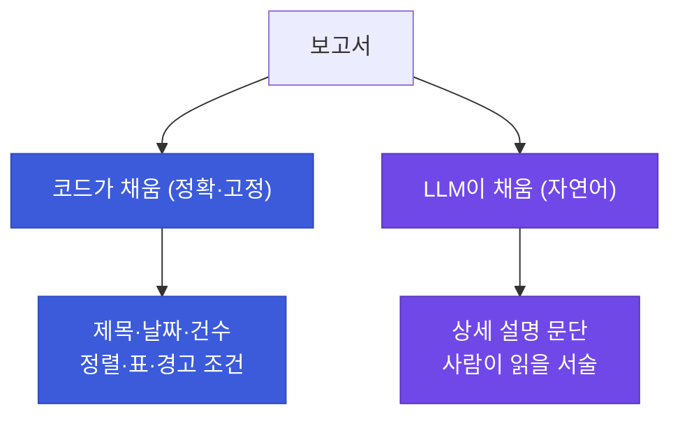
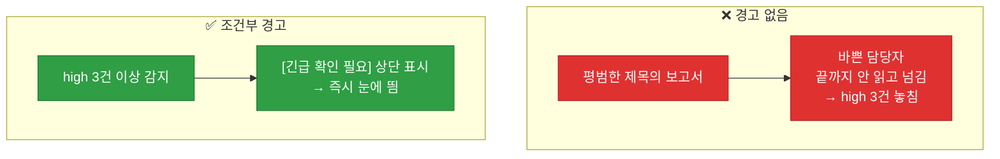

# 강의2 · 템플릿+LLM 결합 보고서 자동 생성 (오후, 총 120분)

> **이 교시 한 문장:** 보고서 전체를 LLM에 맡기면 형식이 흔들리므로, **고정 템플릿(코드)** 에 **LLM이 생성한 문장만** 채워 넣어 매번 일관된 보고서를 만들고, 위험 건수에 따라 **조건부 경고**를 자동 삽입합니다.

| 시간 | 소주제 | 핵심 한 줄 |
|------|--------|-----------|
| 00-20분 | 왜 템플릿+LLM 결합인가 | 형식은 코드, 내용은 LLM |
| 20-45분 | 문자열 템플릿 활용 | .format으로 채우기 |
| 45-70분 | 상세 문단만 LLM 생성 | 부분 위임 |
| 70-95분 | 조건부 경고 문구 | 위험하면 상단에 |
| 95-120분 | 실습 안내 | 보고서 자동 생성 |

## 이 교시에 나오는 어려운 용어

| 용어 (한글발음) | 한 줄 뜻 (아주 쉽게) | 비유 |
|----------------|----------------------|------|
| **템플릿(template)** | 고정된 뼈대 양식 | 서류 양식 |
| **`.format()`** | 템플릿 빈칸 채우기 | 빈칸 메우기 |
| **`{date}`(플레이스홀더)** | 나중에 채울 자리 | 밑줄 빈칸 |
| **부분 위임** | 일부만 LLM에 맡김 | 요리 일부만 외주 |
| **일관성(consistency)** | 매번 같은 형식 | 통일된 서식 |
| **가공(processing)** | 읽기 좋게 다듬기 | 정돈 |
| **조건부(conditional)** | 조건에 따라 추가 | 상황별 문구 |
| **글머리표(bullet)** | 목록 점 | · 목록 |
| **표준 형식(standard)** | 팀 공통 양식 | 회사 서식 |
| **문단(paragraph)** | 줄글 덩어리 | 서술문 |
| **`\n`(개행)** | 줄바꿈 문자 | 엔터 |
| **결합(combine)** | 코드+LLM 합치기 | 조립 |

---

## ⏱️ 00-20분 · 왜 템플릿 + LLM 결합인가

!!! info "📘 학습자 뷰 · 처음 보는 나"
    보고서를 **통째로 LLM에** 맡기면? 매번 **형식이 달라집니다** — 제목이 바뀌고, 순서가 뒤죽박죽되고, 어떤 날은 표, 어떤 날은 글. 팀 보고서는 **일관된 형식**이 중요한데 말이죠.

    그래서 **역할을 나눕니다**:

    - **형식·구조(제목·섹션·표)** → **코드(템플릿)** 가 고정.
    - **자연어 문장(상세 설명)** → **LLM** 이 생성.

    "뼈대는 코드가, 살은 LLM이"입니다.

### 🔬 깊이 보기 — 전체 위임 vs 부분 위임



LLM은 생성 모델이라 **매번 조금씩 다르게** 답합니다(temperature가 낮아도). 형식까지 맡기면 보고서가 들쭉날쭉해지죠. 형식을 **코드로 고정**하면 어느 날이든 같은 틀이고, 그 안의 문장만 LLM이 채워 **일관성 + 자연스러움**을 둘 다 얻습니다. Day6의 "JSON 형식 지정"과 같은 정신 — LLM에 **경계**를 주는 것입니다.

!!! question "확인질문"
    **Q. 보고서 형식까지 매번 LLM에게 맡기면 팀원마다 결과물이 달라질 텐데, 이게 왜 문제가 될까요?**

    **A.** **보고서를 읽고·비교하고·재사용하기 어려워지기 때문**입니다.

    팀 보고서는 여러 사람이 만들고 여러 사람이 읽습니다. 형식이 통일돼 있으면 "요약은 맨 위, 상세는 그다음, 위험 건수는 여기"처럼 어디에 무슨 정보가 있는지 예측할 수 있어 빠르게 파악하고 날짜별로 비교할 수 있습니다. 그런데 형식까지 LLM에 맡기면 담당자마다, 날짜마다 제목·순서·구성이 달라져, 읽는 사람이 매번 구조를 새로 파악해야 하고 어제와 오늘을 비교하기도 어렵습니다. 또 다른 프로그램이 이 보고서에서 특정 값을 자동으로 뽑아 쓰려 할 때도 형식이 일정하지 않으면 처리가 힘듭니다. 그래서 형식은 코드 템플릿으로 고정해 일관성을 지키고, 내용(문장)만 LLM에 맡기는 것이 실무에서 안정적입니다.

<div class="quiz">
<p class="quiz-q"><span class="tag">퀴즈</span><b>보고서 생성에서 '형식은 코드 템플릿, 내용은 LLM'으로 나누는 이유는?</b></p>
<button class="quiz-opt">LLM이 코드를 못 써서</button>
<button class="quiz-opt" data-correct>형식을 고정해 일관성을 지키면서, 자연어 문장은 LLM으로 자연스럽게 채우기 위해</button>
<button class="quiz-opt">코드가 LLM보다 글을 잘 써서</button>
<button class="quiz-opt">템플릿을 쓰면 LLM이 필요 없어서</button>
<div class="quiz-explain"><b>정답: 2번.</b> LLM은 매번 형식이 흔들리므로 형식은 코드로 고정(일관성), 자연어 서술은 LLM으로(자연스러움). 각자 잘하는 걸 맡기는 부분 위임입니다.</div>
<button class="quiz-retry">다시 풀기</button>
</div>

---

## ⏱️ 20-45분 · 문자열 템플릿 활용

!!! abstract "이 블록을 마치면"
    ✔ ==`.format`으로 템플릿 빈칸을 채워== 보고서 뼈대를 만든다

### 🐍 문법 상자 — 템플릿과 .format

!!! tip "🐍 뼈대를 만들고 값 채우기"
    ```python
    template = '''
    # 보안 이벤트 일일 요약 보고서
    작성일: {date}

    ## 요약
    총 {total}건 중 위험도 high {high_count}건

    ## 상세 내역
    {details}
    '''

    report = template.format(
        date=today, total=len(summaries),
        high_count=high_count, details=details_text,
    )
    ```

    **➕ 다른 맥락 예제** — 초대장 템플릿:
    ```python
    template = '{name}님, {date} {event}에 초대합니다.'
    print(template.format(name='민홍', date='7/10', event='생일파티'))
    # 민홍님, 7/10 생일파티에 초대합니다.
    ```

    - `'''...'''` (삼중 따옴표) : **여러 줄 문자열**. 보고서 뼈대에 딱.
    - `{date}`, `{total}` : **채울 자리(플레이스홀더)**.
    - **`.format(date=..., total=...)`** : 그 자리에 값을 채워 완성.
    - f-string으로도 되지만, 템플릿이 **길고 재사용**될 땐 `.format`이 깔끔합니다.

!!! example "🎓 강사 뷰 · f-string vs .format"
    *"짧고 그 자리서 쓸 땐 f-string, 긴 템플릿을 미리 정의해두고 여러 번 채울 땐 .format이 편합니다. 보고서 뼈대는 후자죠. 둘 다 '값을 문자열에 끼워넣기'라는 점은 같습니다(Day1 f-string)."*

### 🐍 문법 상자 — details를 읽기 좋게 가공

!!! tip "🐍 리스트를 그대로 넣지 않기"
    ```python
    # ❌ 리스트를 그대로: [{'user':'kim01',...}, ...]  ← 사람이 못 읽음
    # ✅ 사람이 읽을 문장으로 가공
    details_text = '\n'.join(
        f"- {s['risk_level'].upper()}: {s['summary']}"
        for s in sorted_summaries
    )
    # - HIGH: kim01 반복 로그인 실패
    # - MEDIUM: ...
    ```

    **➕ 다른 맥락 예제** — 할 일 목록을 줄바꿈 문장으로:
    ```python
    todos = ['우유 사기', '메일 보내기', '운동']
    text = '\n'.join(f'- {t}' for t in todos)
    print(text)   # - 우유 사기 / - 메일 보내기 / - 운동 (각 줄바꿈)
    ```
    `'\n'.join(...)` : 각 항목을 줄바꿈으로 이어 붙임. 딕셔너리 리스트를 **사람이 읽을 텍스트**로 바꿉니다.

!!! question "확인질문"
    **Q. 템플릿의 `{details}` 부분을 리스트를 그대로 넣지 않고 사람이 읽기 좋게 가공해야 하는 이유는 무엇일까요?**

    **A.** **리스트/딕셔너리를 그대로 넣으면 `[{'user': 'kim01', ...}]`처럼 코드 형태로 출력되어 사람이 읽기 어렵기 때문**입니다.

    보고서는 사람이 읽는 문서입니다. 요약 데이터는 `[{'risk_level': 'high', 'summary': '...'}, ...]` 같은 파이썬 리스트·딕셔너리 형태인데, 이를 템플릿에 그대로 넣으면 중괄호와 따옴표가 가득한 코드 표현이 그대로 찍혀 나옵니다. 담당자는 이런 raw 데이터에서 핵심을 읽어내기 어렵습니다. 그래서 `'\n'.join`으로 각 항목을 "- HIGH: kim01 반복 로그인 실패"처럼 한 줄씩 정돈된 문장으로 가공해 넣어야, 보고서를 받은 사람이 위험도와 내용을 한눈에 파악할 수 있습니다. 코드용 데이터 구조와 사람이 읽는 표현을 구분해 다듬는 것이 좋은 리포트의 기본입니다.

<div class="quiz">
<p class="quiz-q"><span class="tag">퀴즈</span><b>여러 줄 보고서 뼈대를 만들 때 <code>{date}</code> 같은 자리에 값을 채우는 메서드는?</b></p>
<button class="quiz-opt"><code>.split()</code></button>
<button class="quiz-opt" data-correct><code>.format()</code></button>
<button class="quiz-opt"><code>.append()</code></button>
<button class="quiz-opt"><code>.json()</code></button>
<div class="quiz-explain"><b>정답: 2번.</b> `template.format(date=..., total=...)`이 `{date}`, `{total}` 자리를 값으로 채웁니다. f-string과 같은 "값 끼워넣기"지만, 긴 템플릿을 미리 정의해 재사용할 때 편합니다.</div>
<button class="quiz-retry">다시 풀기</button>
</div>

---

## ⏱️ 45-70분 · LLM으로 상세 문단만 생성

!!! abstract "이 블록을 마치면"
    ✔ ==보고서 중 자연어 문단만 LLM에 위임==하는 전략을 안다

### 🐍 문법 상자 — 부분 위임

!!! tip "🐍 상세 문단만 LLM에게"
    ```python
    detail_prompt = (
        f'다음 이벤트 요약 리스트를 보고서에 어울리는 문단 형태로 '
        f'정리해줘(글머리표 없이 문장으로): {summaries}'
    )
    details_text = call_llm(detail_prompt)     # 이 문단만 LLM 생성

    # 제목·구조·날짜·건수는 코드(템플릿)가 고정, details만 LLM
    report = template.format(date=today, total=..., details=details_text)
    ```

    **➕ 다른 맥락 예제** — 제목은 코드, 본문만 LLM:
    ```python
    title = f'{today} 날씨 리포트'            # 코드가 고정
    body = call_llm('오늘 날씨를 한 문장으로')  # LLM이 생성
    report = f'{title}\n{body}'
    ```

    - 보고서의 **제목·섹션·건수는 코드**가 정확히 채웁니다.
    - **자연어 서술이 필요한 '상세 문단'만** LLM에 맡깁니다.
    - 이렇게 하면 **틀(일관성)** 과 **문장(자연스러움)** 을 둘 다 얻습니다.

### 🔬 깊이 보기 — 무엇을 코드가, 무엇을 LLM이



**숫자·구조는 코드**(정확해야 하고 틀리면 안 됨), **말맛이 필요한 서술은 LLM**(자연스러워야 함). 예를 들어 "총 7건"은 코드가 정확히 세고(LLM이 세면 틀릴 수 있음!), "이번 주는 새벽 로그인 실패가 두드러졌습니다" 같은 서술은 LLM이 매끄럽게 씁니다. 각자 잘하는 영역을 나누는 게 핵심입니다.

!!! question "확인질문"
    **Q. 보고서 전체를 LLM에게 맡기는 것과, 상세 문단만 맡기고 제목·구조는 코드로 고정하는 것, 어느 쪽이 팀 표준 형식을 유지하기 쉬울까요?**

    **A.** **상세 문단만 LLM에 맡기고 제목·구조는 코드로 고정하는 쪽**이 팀 표준 형식을 유지하기 쉽습니다.

    보고서 전체를 LLM에 맡기면 제목·섹션 순서·구성이 호출할 때마다 조금씩 달라져 팀이 정한 표준 양식이 지켜지지 않습니다. 반면 제목·섹션·날짜·건수 같은 구조를 코드 템플릿으로 고정하면, 언제 실행하든 항상 똑같은 틀이 나옵니다. 그 안에서 자연어 서술이 필요한 '상세 문단'만 LLM이 채우므로, 형식은 일관되면서 내용은 그날그날 자연스럽게 반영됩니다. 게다가 총 건수 같은 정확해야 하는 숫자는 코드가 직접 계산해 넣으므로 LLM의 환각으로 숫자가 틀릴 위험도 없습니다. 그래서 부분 위임 방식이 표준 형식 유지와 정확성 모두에 유리합니다.

<div class="quiz">
<p class="quiz-q"><span class="tag">퀴즈</span><b>"총 7건"이라는 건수는 LLM이 아니라 코드가 채워야 하는 이유는?</b></p>
<button class="quiz-opt">LLM은 숫자를 출력할 수 없어서</button>
<button class="quiz-opt" data-correct>LLM은 환각으로 건수를 틀리게 셀 수 있지만, 코드는 정확히 세기 때문</button>
<button class="quiz-opt">코드가 LLM보다 글을 잘 써서</button>
<button class="quiz-opt">건수는 보고서에 중요하지 않아서</button>
<div class="quiz-explain"><b>정답: 2번.</b> 정확해야 하는 숫자·구조는 코드가(len으로 정확히), 자연스러워야 하는 서술은 LLM이. LLM에 건수를 맡기면 환각으로 틀릴 수 있어 위험합니다.</div>
<button class="quiz-retry">다시 풀기</button>
</div>

---

## ⏱️ 70-95분 · 조건부 경고 문구 삽입

!!! abstract "이 블록을 마치면"
    ✔ ==위험 건수에 따라 경고 문구를 자동 삽입==하는 조건부 로직을 안다

### 🐍 문법 상자 — 조건부 문구

!!! tip "🐍 위험하면 상단에 경고"
    ```python
    if high_count >= 3:                         # high가 3건 이상이면
        report = '[긴급 확인 필요]\n' + report   # 보고서 맨 앞에 경고 추가
    ```

    **➕ 다른 맥락 예제** — 잔액 부족 경고 붙이기:
    ```python
    balance = 500
    msg = '이번 달 요약'
    if balance < 1000:
        msg = '[잔액 부족]\n' + msg   # 앞에 경고 추가
    print(msg)
    ```

    - `high_count >= 3` : 조건(Day1 if).
    - `'[긴급 확인 필요]\n' + report` : 경고 문구를 **앞에 붙임**(문자열 연결).
    - 바쁜 담당자가 **한눈에 심각도**를 알게 하는 장치.

### 🔬 깊이 보기 — 조건부 경고의 실무 가치



매일 오는 보고서를 바쁜 담당자는 **대충 넘기기** 쉽습니다. 정말 심각한 날(high 다수)엔 **맨 위에 눈에 띄는 경고**를 자동으로 붙여, 놓치지 않게 합니다. 4과목의 "임계치 알림", Day2 로그 레벨(WARNING)과 같은 정신 — **평소엔 조용, 심각할 때 크게**입니다.

!!! question "확인질문"
    **Q. 이런 조건부 문구가 없다면, 바쁜 담당자가 보고서를 끝까지 읽지 않고 넘어갈 위험이 있을까요?**

    **A.** **네, 그럴 위험이 큽니다.**

    보안 담당자는 매일 여러 보고서를 받고 처리할 일도 많아, 모든 보고서를 꼼꼼히 끝까지 읽기 어렵습니다. 만약 위험도가 높은 날의 보고서도 평소와 똑같은 형태라면, 담당자가 상단만 훑고 넘기다가 뒤쪽에 있는 high 등급 이벤트를 놓칠 수 있습니다. 그러면 정작 시급히 대응해야 할 사건의 인지가 늦어집니다. `if high_count >= 3` 같은 조건으로 위험 건수가 많을 때 보고서 맨 위에 "[긴급 확인 필요]" 같은 문구를 자동으로 붙이면, 심각한 날은 첫 줄부터 눈에 띄어 담당자가 그냥 넘기지 못하고 확인하게 됩니다. 평소에는 조용히 두고 정말 위험할 때만 강하게 알리는 것으로, 알림 피로를 피하면서도 중요한 순간을 놓치지 않게 하는 장치입니다.

<div class="quiz">
<p class="quiz-q"><span class="tag">퀴즈</span><b><code>if high_count >= 3: report = '[긴급 확인 필요]\n' + report</code>가 주는 실무적 이점은?</b></p>
<button class="quiz-opt">보고서를 자동으로 삭제한다</button>
<button class="quiz-opt" data-correct>위험이 큰 날만 눈에 띄는 경고를 상단에 붙여, 바쁜 담당자가 중요한 보고서를 놓치지 않게 한다</button>
<button class="quiz-opt">high 이벤트를 자동으로 처리한다</button>
<button class="quiz-opt">보고서 길이를 줄인다</button>
<div class="quiz-explain"><b>정답: 2번.</b> 조건부 경고는 "평소엔 조용, 심각할 때 크게"입니다. high 다수인 날만 상단 경고로 주의를 끌어, 4과목 임계치 알림·Day2 WARNING 레벨과 같은 역할을 합니다.</div>
<button class="quiz-retry">다시 풀기</button>
</div>

!!! tip "🧠 파인만 자가진단"
    안 보고 말할 수 있으면 통과입니다.

    1. 형식은 코드, 내용은 LLM으로 나누는 이유
    2. `.format`으로 템플릿 채우기, details 가공 이유
    3. 건수를 코드가 채우는 이유(환각)
    4. 조건부 경고 문구의 실무 가치

---

## ⏱️ 95-120분 · 실습 안내

**오후 정리:**

1. **템플릿+LLM** — 형식(코드)+내용(LLM), 일관성과 자연스러움을 둘 다
2. **`.format`** — 여러 줄 템플릿의 `{자리}`를 값으로 채움, details는 읽기 좋게 가공
3. **부분 위임** — 숫자·구조는 코드(정확), 서술 문단만 LLM(자연)
4. **조건부 경고** — high 다수면 상단 경고 자동 삽입

!!! note "실습 예고 (오후 실습 120분)"
    `event_summarizer.py`에서 Day3 로그를 `chunk_list`로 배치 요약·정렬하고, `report_generator.py`에서 템플릿+LLM으로 `daily_report_*.md`를 생성합니다. high 3건 이상이면 경고가 삽입되는지 테스트합니다. 상세는 [실습 페이지](practice.md).

---

## ✅ 가르칠 준비 체크리스트 (강의2)

- [ ] 전체 위임의 형식 불일치 문제를 설명한다
- [ ] `.format` 템플릿과 삼중 따옴표를 설명한다
- [ ] details를 사람이 읽게 가공하는 이유를 설명한다
- [ ] 숫자는 코드, 서술은 LLM 분담을 설명한다
- [ ] 조건부 경고 삽입을 시연한다
- [ ] 이 event_summarizer가 4과목 재사용 모듈임을 연결한다
- [ ] 확인질문 4개 + 퀴즈에 답한다

*[template]: 값을 채워 넣는 고정 형식 틀
*[.format]: 문자열 템플릿의 자리를 값으로 채우는 메서드
*[Human-in-the-loop]: 자동화에 사람의 최종 판단을 남기는 설계
