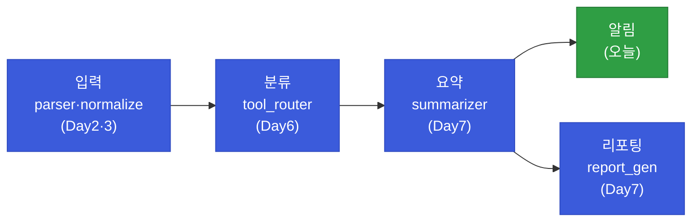
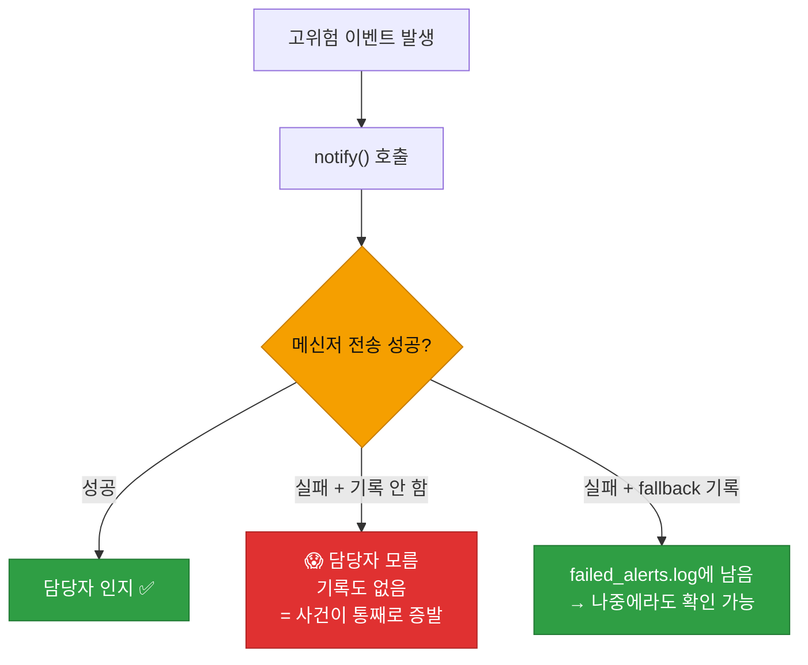
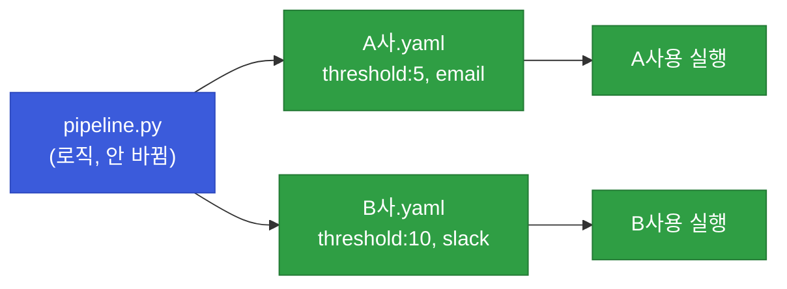
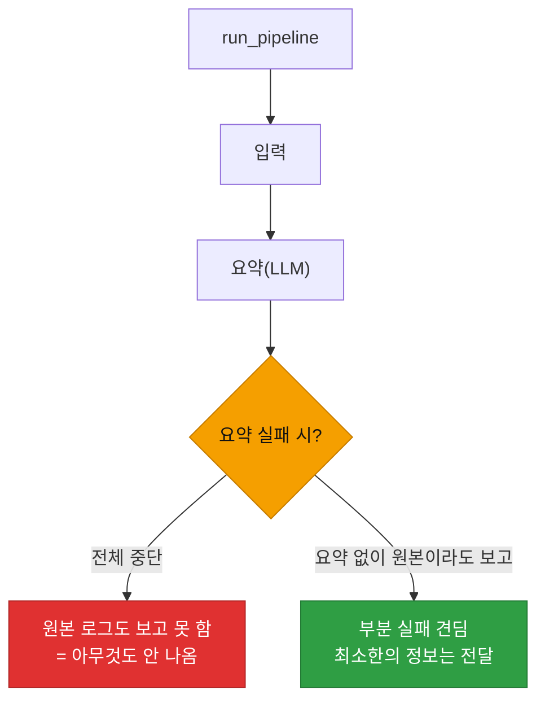

# 강의1 · 파이프라인 통합과 알림 연동 (오전, 총 120분)

> **이 교시 한 문장:** 1~7일차의 조각(입력·정규화·요약·리포트)을 하나의 `run_pipeline()`으로 잇고, **이메일·메신저 알림**을 붙이며(실패 fallback 포함), 흩어진 설정을 **config.yaml** 하나로 모읍니다.

| 시간 | 소주제 | 핵심 한 줄 |
|------|--------|-----------|
| 00-20분 | 전체 파이프라인 개관 | 조각을 한 흐름으로 |
| 20-45분 | 이메일 발송 (smtplib) | 표준 라이브러리로 메일 |
| 45-70분 | 메신저 알림과 실패 대응 | fallback 전략 |
| 70-95분 | config 분리 최종 점검 | 설정을 yaml 하나로 |
| 95-120분 | 오케스트레이션 코드 | run_pipeline 통합 |

## 이 교시에 나오는 어려운 용어

| 용어 (한글발음) | 한 줄 뜻 (아주 쉽게) | 비유 |
|----------------|----------------------|------|
| **파이프라인(pipeline)** | 단계가 이어진 처리 흐름 | 컨베이어 |
| **오케스트레이션** | 단계를 순서대로 지휘 | 지휘자 |
| **smtplib(에스엠티피립)** | 이메일 발송 표준 모듈 | 우체국 |
| **SMTP** | 메일 전송 규약 | 우편 규칙 |
| **starttls(스타트TLS)** | 통신 암호화 시작 | 봉투 봉인 |
| **Webhook 알림** | 메신저로 알림 전송 | 단톡방 알림 |
| **fallback(폴백)** | 실패 시 대비책 | 예비 수단 |
| **config(컨피그)** | 설정값 모음 | 설정판 |
| **YAML(야믈)** | 사람이 읽기 쉬운 설정 형식 | 들여쓰기 설정표 |
| **재사용(reuse)** | 만든 것을 다시 씀 | 부품 재활용 |
| **하드코딩** | 값을 코드에 박음 | 못질 |
| **부분 실패(partial fail)** | 일부 단계만 실패 | 한 칸만 고장 |

---

## ⏱️ 00-20분 · 전체 파이프라인 개관

!!! info "📘 학습자 뷰 · 처음 보는 나"
    1~7일차에 만든 것들이 **하나의 흐름**으로 이어집니다.

    | 단계 | 담당 모듈 | 만든 날 |
    |------|-----------|---------|
    | **입력** | `log_parser.py`·`normalize_logs.py` | Day2·3 |
    | **분류** | `tool_router.py` | Day6 |
    | **요약** | `event_summarizer.py` | Day7 |
    | **알림** | (오늘 작성) | Day8 |
    | **리포팅** | `report_generator.py` | Day7 |

    오늘 '알림'만 새로 만들고, 나머지는 **이미 만든 것을 재사용**합니다.

### 🔬 깊이 보기 — 재사용이 하루 만에 완성을 가능케 한다



만약 오늘 이걸 **처음부터 다 짠다면** 하루로는 불가능합니다. 하지만 매일 만든 모듈을 **재사용**하니, 오늘은 '알림'만 추가하고 **연결**만 하면 됩니다. 3·4과목의 `weekly_report.py`·`pipeline.py`가 여러 모듈을 import해 통합한 것과 똑같죠 — "잘 나눠 만들면 통합이 쉽다"입니다.

!!! question "확인질문"
    **Q. 이미 만든 코드를 재사용하지 않고 새로 다 짠다면 오늘 하루 안에 끝낼 수 있을까요? 재사용이 왜 중요할까요?**

    **A.** **하루 안에 끝내기 어렵고, 그래서 재사용이 중요합니다.**

    입력 파싱, 정규화, 분류, 요약, 리포트 생성은 각각 며칠에 걸쳐 배우고 구현한 기능들입니다. 이걸 오늘 처음부터 다시 짠다면 시간이 크게 부족하고, 이미 검증된 코드를 다시 만들며 새 버그를 넣을 위험도 큽니다. 하지만 지난 7일간 각 기능을 독립된 모듈(`log_parser.py`, `event_summarizer.py` 등)로 잘 나눠 만들어 두었기 때문에, 오늘은 새로 필요한 '알림' 부분만 만들고 나머지는 import해서 순서대로 연결하기만 하면 됩니다. 그래서 하루 만에 전체 파이프라인을 완성할 수 있습니다. 재사용은 시간을 아낄 뿐 아니라, 이미 테스트된 코드를 그대로 써서 안정성을 높이고, 한 모듈을 개선하면 그것을 쓰는 모든 곳이 함께 좋아지는 이점을 줍니다. 이것이 함수·모듈로 잘게 나눠 만드는 근본 이유입니다.

<div class="quiz">
<p class="quiz-q"><span class="tag">퀴즈</span><b>1~7일차 모듈을 재사용해 Day8에 파이프라인을 완성할 수 있는 이유는?</b></p>
<button class="quiz-opt">Day8 코드가 특별히 빨라서</button>
<button class="quiz-opt" data-correct>기능을 독립 모듈로 잘 나눠 만들어 두어, 오늘은 새 부분(알림)만 만들고 나머지는 import해 연결하면 되기 때문</button>
<button class="quiz-opt">LLM이 나머지를 자동으로 짜줘서</button>
<button class="quiz-opt">이전 코드를 삭제하고 새로 짜서</button>
<div class="quiz-explain"><b>정답: 2번.</b> 잘 나눈 모듈은 통합을 쉽게 합니다. 오늘은 알림만 추가하고 순서대로 잇기만 하면 되죠. 3·4과목 통합일과 같은 원리입니다.</div>
<button class="quiz-retry">다시 풀기</button>
</div>

---

## ⏱️ 20-45분 · 이메일 발송 (smtplib)

!!! abstract "이 블록을 마치면"
    ✔ ==표준 라이브러리로 이메일을 보내고== 비밀번호를 안전하게 관리한다

### 🐍 문법 상자 — smtplib 이메일

!!! tip "🐍 파이썬으로 메일 보내기"
    ```python
    import os
    import smtplib
    from email.mime.text import MIMEText

    def send_email(subject, body, to_addr):
        msg = MIMEText(body)                          # 본문
        msg['Subject'] = subject                      # 제목
        msg['From'] = os.environ['SMTP_USER']         # 보내는 사람
        msg['To'] = to_addr                           # 받는 사람

        with smtplib.SMTP('smtp.example.com', 587) as server:
            server.starttls()                         # 암호화 시작
            server.login(os.environ['SMTP_USER'],
                         os.environ['SMTP_PASSWORD']) # 로그인(환경변수!)
            server.send_message(msg)
    ```

    - `MIMEText` : 이메일 본문·제목·수신자를 담는 객체.
    - `smtplib.SMTP(서버, 587)` : 메일 서버에 연결(587은 표준 포트).
    - **`starttls()`** : 통신을 **암호화**(비번·내용 보호).
    - `login(...)` : 계정 로그인. **비밀번호는 환경변수**(Day4 원칙!).
    - `with`로 서버 연결도 자동으로 닫힙니다(Day2).

!!! question "확인질문"
    **Q. `SMTP_PASSWORD`를 코드에 직접 쓰지 않고 환경변수로 관리하는 이유는 무엇일까요?**

    **A.** **비밀번호가 코드·저장소에 노출되어 유출되는 것을 막기 위해서**입니다.

    이메일 계정 비밀번호는 그 계정으로 메일을 보내고 받을 수 있는 민감한 자격 증명입니다. 코드에 직접 적으면 그 코드를 보는 사람 누구나 비밀번호를 알게 되고, 특히 깃 저장소에 올리면 저장소에 접근하는 모든 사람에게 노출됩니다. 게다가 깃 히스토리에 영구히 남아 나중에 지워도 과거 기록에 그대로 남습니다. 공격자가 이 비밀번호를 얻으면 회사 명의로 피싱 메일을 보내거나 메일함을 열람하는 등 악용할 수 있습니다. 그래서 Day4의 API 키와 똑같이, 비밀번호는 코드가 아니라 `.env` 같은 환경변수로 분리해 `os.environ['SMTP_PASSWORD']`로 읽고, 그 파일은 `.gitignore`로 깃에서 제외해야 합니다.

<div class="quiz">
<p class="quiz-q"><span class="tag">퀴즈</span><b>smtplib 이메일 발송에서 <code>server.starttls()</code>의 역할은?</b></p>
<button class="quiz-opt">이메일을 저장한다</button>
<button class="quiz-opt" data-correct>서버와의 통신을 암호화해 비밀번호·내용이 노출되지 않게 한다</button>
<button class="quiz-opt">제목을 자동 생성한다</button>
<button class="quiz-opt">수신자를 추가한다</button>
<div class="quiz-explain"><b>정답: 2번.</b> `starttls()`는 TLS 암호화를 시작해 로그인 정보와 메일 내용이 평문으로 새지 않게 보호합니다. 이후 login으로 인증하고 send_message로 보냅니다.</div>
<button class="quiz-retry">다시 풀기</button>
</div>

---

## ⏱️ 45-70분 · 메신저 Webhook 알림과 실패 대응

!!! abstract "이 블록을 마치면"
    ✔ 메신저로 알림을 보내고 ==알림 실패도 로컬에 남기는 fallback==을 안다

### 🐍 문법 상자 — 알림 + fallback

!!! tip "🐍 알림 실패에 대비하기"
    ```python
    import requests, logging
    from datetime import datetime

    def notify(message):
        try:
            requests.post(webhook_url, json={'text': message},
                          timeout=5).raise_for_status()      # 알림 전송
        except Exception as e:
            logging.error(f'알림 실패: {e}')                  # 실패 기록
            with open('failed_alerts.log', 'a', encoding='utf-8') as f:
                f.write(f'{datetime.now()} {message}\n')     # 로컬에라도 남김
    ```

    - 메신저 **incoming webhook**에 POST로 메시지 전송(Day4 requests·Day5 webhook).
    - **핵심은 except의 fallback**: 알림 전송이 실패하면 **로컬 파일에라도 기록**.
    - 그러면 "알림이 안 갔다"는 사실 자체가 사라지지 않습니다.

### 🔬 깊이 보기 — 알림 실패를 기록 안 하면



**알림은 "마지막 전달 수단"** 입니다. 이게 실패했는데 **기록조차 없으면**, 고위험 사건을 아무도 모른 채 넘어갑니다 — 최악의 사고죠. fallback으로 로컬 파일에라도 남기면, 나중에 그 파일을 보고 "이때 알림이 실패했구나"를 알 수 있습니다. Day2 graceful 실패, Day3 매칭 실패 기록과 같은 "실패를 삼키지 않기" 정신의 정점입니다.

!!! question "확인질문"
    **Q. 알림 전송에 실패했는데 그 사실조차 기록하지 않는다면, 나중에 어떤 문제가 생길까요?**

    **A.** **고위험 사건이 아무에게도 전달되지 않은 채 흔적도 없이 사라져, 대응 자체가 누락됩니다.**

    알림은 탐지된 위협을 사람에게 전달하는 마지막 수단입니다. 이 전송이 네트워크 오류나 메신저 서버 장애로 실패할 수 있는데, 그 실패를 아무 데도 기록하지 않으면 두 가지가 동시에 사라집니다 — 담당자는 사건을 통보받지 못해 모르고, 시스템에도 "알림이 실패했다"는 흔적이 없습니다. 그러면 고위험 이벤트가 발생했는데도 아무도 대응하지 못한 채 지나가고, 나중에 사고가 커진 뒤에야 "왜 아무도 몰랐지?"를 조사해도 원인을 찾기 어렵습니다. 그래서 `notify()`에서 전송 실패 시 `logging.error`로 남기고 `failed_alerts.log` 같은 로컬 파일에도 메시지를 기록하는 fallback을 둡니다. 그러면 최소한 그 기록을 통해 "이 시각에 이 알림이 실패했다"를 확인하고 뒤늦게라도 대응하거나 알림 채널을 점검할 수 있습니다.

<div class="quiz">
<p class="quiz-q"><span class="tag">퀴즈</span><b><code>notify()</code>에서 알림 전송 실패 시 <code>failed_alerts.log</code>에 남기는 fallback을 두는 이유는?</b></p>
<button class="quiz-opt">로그 파일을 늘리려고</button>
<button class="quiz-opt" data-correct>알림이 실패해도 그 사실과 내용을 남겨, 고위험 사건이 흔적 없이 사라지지 않게 하려고</button>
<button class="quiz-opt">알림을 자동 재전송하려고</button>
<button class="quiz-opt">메신저 서버를 고치려고</button>
<div class="quiz-explain"><b>정답: 2번.</b> 알림은 마지막 전달 수단이라, 실패를 삼키면 사건이 통째로 증발합니다. fallback으로 로컬에 남기면 나중에라도 확인·대응할 수 있습니다. "실패를 기록하기" 원칙의 정점입니다.</div>
<button class="quiz-retry">다시 풀기</button>
</div>

---

## ⏱️ 70-95분 · 설정값(config) 분리 최종 점검

!!! abstract "이 블록을 마치면"
    ✔ 흩어진 설정을 ==config.yaml 하나로 모아== 재사용성을 높인다

### 🐍 문법 상자 — config.yaml

!!! tip "🐍 설정을 한곳에"
    ```yaml
    # 📄 config/example_customer.yaml
    customer_name: '가상 A사'
    threshold: 5
    log_input_path: 'sample_logs.csv'
    alert_channel: 'email'
    ```

    ```python
    import yaml    # pip install pyyaml

    def load_config(path):
        with open(path, encoding='utf-8') as f:
            return yaml.safe_load(f)     # yaml → 파이썬 딕셔너리

    config = load_config('config/example_customer.yaml')
    print(config['threshold'])           # 5
    ```

    - **YAML** : 들여쓰기로 표현하는 **사람이 읽기 쉬운** 설정 형식(`키: 값`).
    - `yaml.safe_load` : YAML 파일을 딕셔너리로 읽음(JSON `load`와 비슷).
    - 흩어져 있던 threshold·경로·채널을 **한 파일에** 모읍니다.

### 🔬 깊이 보기 — config 하나로 고객사만 바꾸기



설정을 config로 빼면, **코드는 그대로 두고 config 파일만 바꿔** 다른 고객사에 씁니다. A사는 threshold 5·이메일, B사는 10·슬랙 — config만 갈아끼우면 되죠. 캡스톤에서 "고객사만 바꿔 재사용"의 핵심입니다. 3·4과목 내내 강조한 "config 분리"의 완성형입니다.

!!! question "확인질문"
    **Q. config.yaml 파일 하나만 바꾸면, 이 파이프라인을 다른 고객사(B사)에도 그대로 쓸 수 있을까요?**

    **A.** **네, 설정을 config로 잘 분리했다면 그럴 수 있습니다.**

    파이프라인 코드(로직)에 고객사별로 달라지는 값 — 임계값, 로그 파일 경로, 알림 채널, 고객사명 등 — 을 직접 박아두지 않고 모두 config.yaml에서 읽어오도록 만들면, 코드 자체는 어느 고객사에나 똑같이 동작하는 범용 로직이 됩니다. 그러면 A사용 config(threshold 5, 이메일)를 B사용 config(threshold 10, 슬랙)로 바꿔 실행하기만 하면, 코드를 한 줄도 고치지 않고 B사에 맞게 동작합니다. 이것이 "설정과 로직의 분리"가 주는 재사용성입니다. 캡스톤에서 여러 고객사 시나리오에 같은 코드를 재활용하려면 이 분리가 핵심이며, 반대로 값이 코드 곳곳에 하드코딩돼 있으면 고객사마다 코드를 수정해야 해 오류와 번거로움이 커집니다.

<div class="quiz">
<p class="quiz-q"><span class="tag">퀴즈</span><b>threshold·경로·알림채널을 config.yaml로 분리하면 얻는 핵심 이점은?</b></p>
<button class="quiz-opt">코드 실행이 빨라진다</button>
<button class="quiz-opt" data-correct>코드를 고치지 않고 config만 바꿔 다른 고객사·환경에 그대로 재사용할 수 있다</button>
<button class="quiz-opt">YAML이 자동으로 암호화된다</button>
<button class="quiz-opt">파이프라인이 필요 없어진다</button>
<div class="quiz-explain"><b>정답: 2번.</b> 설정(변하는 값)과 로직(코드)을 분리하면, config만 갈아끼워 A사·B사에 같은 코드를 재사용합니다. 3·4과목 내내 강조된 config 분리의 완성입니다.</div>
<button class="quiz-retry">다시 풀기</button>
</div>

---

## ⏱️ 95-120분 · 파이프라인 오케스트레이션 코드

!!! abstract "이 블록을 마치면"
    ✔ ==단계별 try/except로 한 단계 실패해도 안 멈추는== 통합 함수를 안다

### 💻 코드 완전 해부 — `run_pipeline()`

```python
def run_pipeline(config_path):
    config = load_config(config_path)                          # ① 설정 로드
    logs = parse_logs(config['log_input_path'])               # ② 입력(Day2)
    summaries = summarize_events(normalize(logs))             # ③ 정규화+요약(Day3·7)
    if has_high_risk(summaries):                              # ④ 고위험이면
        notify(f'고위험 이벤트 {len(summaries)}건 발견')       # ⑤ 알림(오늘)
    return generate_report(summaries)                        # ⑥ 리포트(Day7)
```

| 줄 | 하는 일 | 담당 |
|:--:|---------|-----|
| **①** | config에서 설정 읽기 | 오늘 |
| **②** | 로그 파싱(입력) | Day2 |
| **③** | 정규화 + 요약 | Day3·7 |
| **④⑤** | 고위험이면 알림 | 오늘 |
| **⑥** | 보고서 생성·반환 | Day7 |

`run_pipeline`은 스스로 판단하지 않고 **각 모듈을 순서대로 부르는 지휘자**(오케스트레이션)입니다. 3·4과목의 `weekly_report`·`pipeline`과 똑같죠.

### 🔬 깊이 보기 — 단계별 try/except, 부분 실패를 견디기



각 단계에 try/except를 두면, **한 단계가 실패해도 전체가 안 멈춥니다.** 특히 LLM 요약은 외부 API라 실패 가능성이 있는데, 요약이 실패했다고 **원본 로그 보고까지 포기**하면 안 되죠. "요약은 없지만 원본 로그 N건 발견"이라도 알리는 게 낫습니다. 완벽한 결과가 안 되면 **부분 결과라도** 내는 게 자동화의 견고함입니다.

!!! question "확인질문"
    **Q. 요약(LLM) 단계가 실패했다고 전체 파이프라인을 멈추는 것이 항상 옳을까요, 아니면 요약 없이라도 원본 로그를 보고하는 게 나을까요?**

    **A.** **대체로 요약 없이라도 원본 로그를 보고하는 것이 낫습니다.**

    LLM 요약은 외부 API 호출이라 네트워크 문제, 응답 지연, 파싱 실패 등으로 실패할 가능성이 있습니다. 그런데 요약이 실패했다고 전체 파이프라인을 멈춰버리면, 정상적으로 수집·정규화된 원본 로그마저 담당자에게 전달되지 않습니다. 요약은 '더 편하게 보기 위한 부가 기능'이지 '없으면 아무것도 못 하는 필수 관문'이 아닙니다. 따라서 요약 단계에 try/except를 두어, 실패하면 그 사실을 로그로 남기고 "요약 생성 실패 — 원본 로그 N건 첨부" 형태로라도 보고를 진행하는 편이 낫습니다. 그래야 담당자가 최소한 원본을 직접 확인해 대응할 수 있습니다. 완벽한 결과를 못 낼 때 전부 포기하는 대신 부분 결과라도 전달하는 것이 자동화의 견고함(graceful degradation)이며, 다만 무엇이 실패했는지는 반드시 기록해 두어야 합니다.

<div class="quiz">
<p class="quiz-q"><span class="tag">퀴즈</span><b><code>run_pipeline</code>의 각 단계에 try/except를 두는 목적은?</b></p>
<button class="quiz-opt">코드를 짧게 만들려고</button>
<button class="quiz-opt" data-correct>한 단계가 실패해도 전체가 멈추지 않고, 가능한 부분 결과라도 내도록(견고함) 하려고</button>
<button class="quiz-opt">LLM 비용을 줄이려고</button>
<button class="quiz-opt">단계를 건너뛰려고</button>
<div class="quiz-explain"><b>정답: 2번.</b> 단계별 예외처리는 부분 실패를 견디게 합니다. 요약이 실패해도 원본 로그 보고는 진행하는 식이죠. 완벽 아니면 전부 포기가 아니라, 부분 결과라도 내는 게 자동화의 견고함입니다.</div>
<button class="quiz-retry">다시 풀기</button>
</div>

!!! tip "🧠 파인만 자가진단"
    안 보고 말할 수 있으면 통과입니다.

    1. 재사용이 하루 만의 통합을 가능케 하는 이유
    2. smtplib 이메일에서 starttls·환경변수의 역할
    3. 알림 실패 fallback이 필요한 이유
    4. config 분리로 고객사만 바꿔 재사용하는 원리
    5. 단계별 try/except로 부분 실패를 견디는 이유

---

## ⏱️ 정리

**오전 정리:**

1. **파이프라인 통합** — 입력→분류→요약→알림→리포팅, 대부분 **재사용**
2. **smtplib 이메일** — starttls 암호화, 비번은 환경변수
3. **메신저 알림 + fallback** — 실패해도 로컬에 기록(실패를 삼키지 않기)
4. **config.yaml** — 설정을 한곳에, 고객사만 바꿔 재사용
5. **run_pipeline** — 오케스트레이션 + 단계별 try/except(부분 실패 견딤)

오후에는 코드 리뷰·디버깅으로 완성도를 높이고, 캡스톤 연결을 확인합니다.

---

## ✅ 가르칠 준비 체크리스트 (강의1)

- [ ] 전체 파이프라인 5단계와 재사용을 설명한다
- [ ] smtplib 이메일과 starttls·환경변수를 시연한다
- [ ] 알림 fallback의 필요성을 설명한다
- [ ] config.yaml 분리와 재사용을 설명한다
- [ ] run_pipeline 오케스트레이션과 단계별 try/except를 설명한다
- [ ] 부분 실패를 견디는 견고함을 설명한다
- [ ] 확인질문 5개 + 퀴즈에 답한다

*[smtplib]: 파이썬 이메일 발송 표준 라이브러리
*[YAML]: 사람이 읽기 쉬운 설정 파일 형식
*[fallback]: 주 수단 실패 시의 대비책
*[오케스트레이션]: 여러 단계를 순서대로 지휘하는 통합 함수
