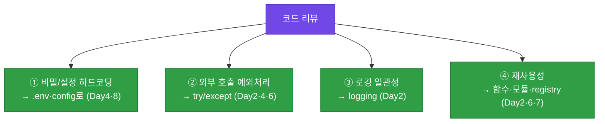
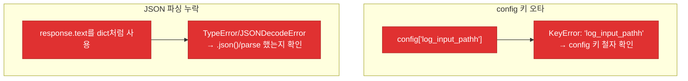
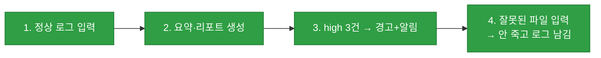
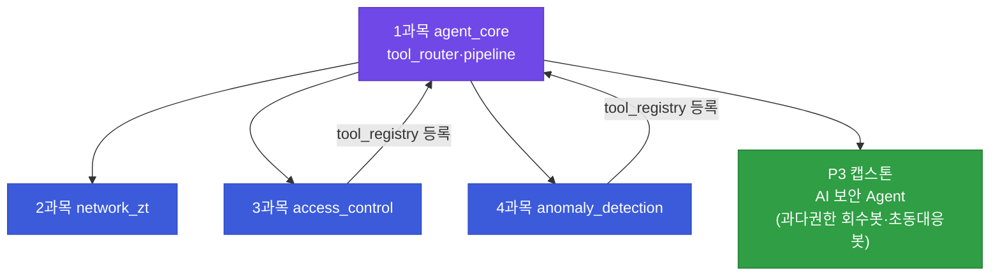

# 강의2 · 코드 리뷰·디버깅과 발표 준비 (오후, 총 120분)

> **이 교시 한 문장:** 완성한 `pipeline.py`를 **코드 리뷰 체크리스트**로 점검하고, 고장난 코드를 **traceback을 읽어 디버깅**하며, 발표를 준비하고, 오늘의 `agent_core/`가 2~5과목·캡스톤으로 어떻게 이어지는지 확인합니다.

| 시간 | 소주제 | 핵심 한 줄 |
|------|--------|-----------|
| 00-30분 | 전체 코드 리뷰 체크리스트 | 4항목으로 자기 점검 |
| 30-55분 | 디버깅 실습 (오류 주입) | traceback 읽기 |
| 55-80분 | 발표 자료 준비 | 아키텍처+핵심+데모 |
| 80-120분 | 캡스톤 연계 안내 | agent_core의 미래 |

## 이 교시에 나오는 어려운 용어

| 용어 (한글발음) | 한 줄 뜻 (아주 쉽게) | 비유 |
|----------------|----------------------|------|
| **코드 리뷰(code review)** | 코드 문제를 함께 점검 | 원고 교정 |
| **체크리스트(checklist)** | 빠짐없이 확인할 목록 | 점검표 |
| **디버깅(debugging)** | 버그를 찾아 고침 | 고장 수리 |
| **traceback(트레이스백)** | 오류 발생 경로 기록 | 사고 경위서 |
| **KeyError(키에러)** | 없는 키 접근 오류 | 없는 서랍 |
| **스택(stack)** | 호출 순서 쌓임 | 접시 더미 |
| **아키텍처(architecture)** | 전체 구조 설계 | 건물 도면 |
| **데모(demo)** | 실제 시연 | 시운전 |
| **캡스톤(capstone)** | 종합 최종 프로젝트 | 졸업작품 |
| **agent_core(에이전트코어)** | 1과목 통합 레포 | 엔진룸 |
| **회고(retrospective)** | 되돌아보며 정리 | 복기 |
| **재사용성(reusability)** | 다시 쓸 수 있음 | 범용성 |

---

## ⏱️ 00-30분 · 전체 코드 리뷰 체크리스트

!!! info "📘 학습자 뷰 · 처음 보는 나"
    완성한 코드를 **네 가지 기준**으로 점검합니다(3·4과목과 같은 항목 — 전 과목 공통 원칙).

    | 리뷰 항목 | 확인 질문 | 관련 날 |
    |-----------|-----------|---------|
    | **① config 하드코딩** | API키·비번·threshold가 코드에 박혀 있나? | Day4·8 |
    | **② 예외처리 누락** | 모든 외부 호출(API·파일·LLM)에 try/except 있나? | Day2·4·6 |
    | **③ 로깅 일관성** | 처리·실패가 logging으로 남나? | Day2 |
    | **④ 함수 재사용성** | 중복 없이 모듈·함수로 나뉘었나? | Day2·6·7 |

### 🔬 깊이 보기 — 리뷰 4항목 = 8일 전체 요약



이 4항목은 1과목 8일 내내 반복 강조한 원칙입니다. 리뷰는 **새 지식이 아니라 배운 걸 내 코드에 적용했나**의 자기 점검이죠. 캡스톤에서 팀이 함께 코드를 볼 때도 이 체크리스트가 공통 기준이 됩니다.

!!! question "확인질문"
    **Q. 체크리스트 중 스스로 가장 취약하다고 생각하는 항목은 무엇인가요? (자기 성찰)**

    **A.** (정답이 정해진 질문이 아니라 자기 점검용입니다.)

    예시 답변: "예외처리 누락이 가장 취약합니다. 정상 흐름은 잘 짜지만, LLM 호출이나 파일 읽기처럼 실패할 수 있는 외부 호출에 try/except를 빠뜨리는 경우가 많았습니다. 특히 파이프라인을 여러 모듈로 이을 때 중간 단계의 실패를 놓쳐, 하나가 죽으면 전체가 멈추곤 했습니다. 그래서 앞으로는 '외부와 통신하거나 파일을 만지는 모든 지점'에 예외처리와 로깅이 있는지 먼저 확인하는 습관을 들이려 합니다." — 이렇게 구체적인 약점과 개선 방향을 말하면 좋습니다.

<div class="quiz">
<p class="quiz-q"><span class="tag">퀴즈</span><b>코드 리뷰 체크리스트(config·예외처리·로깅·재사용성)가 사실상 담고 있는 것은?</b></p>
<button class="quiz-opt">파이썬 최신 문법 목록</button>
<button class="quiz-opt" data-correct>1과목 8일 내내 반복 강조된 핵심 원칙들의 자기 점검판</button>
<button class="quiz-opt">외부 라이브러리 설치 순서</button>
<button class="quiz-opt">발표 슬라이드 규칙</button>
<div class="quiz-explain"><b>정답: 2번.</b> 리뷰 4항목은 새 지식이 아니라 배운 원칙(비밀 분리·예외 안전·로깅·모듈화)을 내 코드에 적용했는지 확인하는 것입니다. 3·4과목 리뷰와 같은 항목이죠.</div>
<button class="quiz-retry">다시 풀기</button>
</div>

---

## ⏱️ 30-55분 · 디버깅 실습 — 의도적 오류 주입

!!! abstract "이 블록을 마치면"
    ✔ ==traceback을 아래에서 위로 읽어== 오류 위치를 빠르게 찾는다

### 🐍 문법 상자 — traceback 읽는 법

!!! tip "🐍 에러 메시지 뜯어보기"
    ```text
    Traceback (most recent call last):
      File "pipeline.py", line 12, in run_pipeline      ← 호출 경로
        logs = parse_logs(config['log_input_pathh'])    ← 문제의 줄
      File "log_parser.py", line 5, in parse_logs
        ...
    KeyError: 'log_input_pathh'                          ← ⭐ 맨 아래: 오류 종류·원인
    ```

    - **맨 아래 줄을 먼저** 봅니다: `KeyError: 'log_input_pathh'` = "그런 키 없음"(오타!).
    - 그 **바로 위**가 오류 난 파일·줄 번호(`pipeline.py, line 12`).
    - 위로 갈수록 "이 함수가 저 함수를 불렀다"는 **호출 경로**.
    - 초보자는 긴 traceback에 겁먹지만, **아래→위** 순서로 읽으면 원인이 빠르게 보입니다.

### 🔬 깊이 보기 — 흔한 오류 두 가지



**KeyError**는 대개 **키 오타**(위 `pathh`)입니다. 맨 아래 줄이 정확히 그 키를 알려주죠. **JSONDecodeError/TypeError**는 응답을 파싱 안 하고 쓴 경우가 많고요. 예외처리·로깅이 잘 돼 있으면 이 추적이 훨씬 쉽습니다 — Day2·6에서 방어 코드를 강조한 이유입니다. 4과목 Day5 디버깅과 같은 요령입니다.

!!! question "확인질문"
    **Q. 에러 메시지(traceback)를 읽을 때 가장 먼저 확인해야 할 정보는 무엇일까요?**

    **A.** **맨 아래 줄의 오류 종류와 메시지** 입니다.

    traceback은 위에서 아래로 "어느 함수가 어느 함수를 불렀는지"라는 호출 경로를 보여주고, 맨 아래에 실제로 발생한 오류의 종류와 구체적 원인이 나옵니다. 예를 들어 `KeyError: 'log_input_pathh'`라면 "그런 키가 없다"는 뜻으로, config 키에 오타가 있음을 바로 알 수 있습니다. 그래서 긴 traceback에 압도되지 말고 맨 아랫줄부터 읽어 "무슨 오류인지"를 먼저 파악한 뒤, 그 바로 위에 표시된 파일 이름과 줄 번호로 오류가 난 정확한 위치를 찾는 것이 요령입니다. 오류 종류(KeyError, TypeError, FileNotFoundError 등)마다 원인의 방향이 정해져 있어, 맨 아랫줄만 제대로 읽어도 문제의 절반은 파악됩니다.

<div class="quiz">
<p class="quiz-q"><span class="tag">퀴즈</span><b>traceback 맨 아래에 <code>KeyError: 'log_input_pathh'</code>가 보인다면 가장 유력한 원인은?</b></p>
<button class="quiz-opt">파일 용량이 너무 크다</button>
<button class="quiz-opt" data-correct>config에서 그 키의 철자가 틀렸다(오타) — 존재하지 않는 키에 접근</button>
<button class="quiz-opt">인터넷이 끊겼다</button>
<button class="quiz-opt">LLM이 응답하지 않았다</button>
<div class="quiz-explain"><b>정답: 2번.</b> KeyError는 딕셔너리에 없는 키에 접근할 때 납니다. `'log_input_pathh'`처럼 오타가 흔한 원인이죠. 맨 아랫줄이 정확한 키를 알려주므로 config 철자를 확인하면 됩니다.</div>
<button class="quiz-retry">다시 풀기</button>
</div>

---

## ⏱️ 55-80분 · 발표 자료 준비

!!! info "📘 학습자 뷰 · 처음 보는 나"
    발표는 세 가지만 준비하면 됩니다.

    1. **아키텍처 다이어그램 1장** — 입력→분류→요약→알림→리포팅 흐름.
    2. **핵심 코드 3줄 요약** — `run_pipeline`의 뼈대.
    3. **실행 데모 시나리오** — 로그 넣으면 보고서·알림 나오는 흐름.

!!! example "🎓 강사 뷰 · 발표의 핵심 메시지"
    *"발표에서 강조할 건 '내가 만든 조각들이 하나로 돈다'입니다. 8일간 배운 변수·함수·API·LLM이 `agent_core/` 하나로 합쳐졌죠. 그리고 이게 끝이 아니라 캡스톤의 시작이라는 점 — 그 연결을 보여주면 좋은 발표입니다."*

### 🔬 깊이 보기 — 좋은 데모 시나리오



좋은 데모는 **정상 동작뿐 아니라 실패도** 보여줍니다. "잘못된 파일을 넣어도 죽지 않고 로그를 남긴다"를 시연하면, 예외처리·로깅을 제대로 했음을 증명하죠. 정상만 보이는 데모보다 **견고함까지 보이는** 데모가 훨씬 설득력 있습니다.

---

## ⏱️ 80-120분 · 캡스톤 연계 안내

!!! info "📘 학습자 뷰 · 처음 보는 나"
    오늘 완성한 `agent_core/`는 **끝이 아니라 시작**입니다. 2~5과목 모듈이 여기 꽂혀 캡스톤의 최종 보안 Agent가 됩니다.

### 🔬 깊이 보기 — agent_core가 캡스톤이 되는 길



오늘 만든 `tool_router.py`(Day6)에 **3과목 `evaluate_full_access`, 4과목 `classify_and_score`가 등록**됩니다(각 과목 Day5에서 봤죠!). 즉 1과목이 **엔진**이고, 2~4과목이 **부품**이며, 캡스톤에서 이 Agent가 그 부품들을 도구로 호출해 자동 회수·초동대응을 수행합니다. 8일이 캡스톤의 **뿌리**입니다.

!!! question "확인질문"
    **Q. 오늘 만든 `tool_router.py`는 앞으로 배울 접근통제/이상탐지/SOAR 모듈과 어떻게 연결될까요?**

    **A.** **각 모듈의 핵심 함수가 `tool_router`의 `tool_registry`에 도구로 등록되어, AI Agent가 그 함수들을 호출해 쓰게 됩니다.**

    오늘 만든 `tool_router.py`는 "도구 이름 → 실제 함수"를 잇는 `tool_registry`와 그것을 실행하는 `route_tool_call`로 이루어진 agent_core의 핵심 엔진입니다. 앞으로 3과목에서 접근통제 모듈을 만들면 그 핵심 함수인 `evaluate_full_access`를 `tool_registry['evaluate_access']`로 등록하고, 4과목 이상탐지 모듈의 `classify_and_score`도 마찬가지로 등록합니다(실제로 각 과목 Day5에서 이 등록을 다룹니다). 그러면 AI Agent는 상황에 맞는 도구 이름을 고르기만 하면, tool_router가 그 이름에 연결된 실제 함수를 찾아 실행합니다. 즉 1과목의 tool_router가 공통 엔진(뇌)이고, 2~5과목 모듈들이 그 엔진에 꽂히는 도구(손발)가 되어, 캡스톤에서 하나의 AI 보안 Agent로 통합됩니다. 오늘 만든 라우터가 그 모든 모듈을 이어붙이는 연결점입니다.

<div class="quiz">
<p class="quiz-q"><span class="tag">퀴즈</span><b>1과목 <code>tool_router.py</code>가 캡스톤에서 하는 역할은?</b></p>
<button class="quiz-opt">각 과목 코드를 삭제한다</button>
<button class="quiz-opt" data-correct>2~5과목 모듈의 핵심 함수를 도구로 등록·실행하는 공통 엔진이 되어, AI Agent가 그것들을 호출하게 한다</button>
<button class="quiz-opt">과목마다 새 라우터를 만들게 한다</button>
<button class="quiz-opt">LLM을 대체한다</button>
<div class="quiz-explain"><b>정답: 2번.</b> tool_router는 agent_core의 엔진입니다. 3·4과목 함수가 tool_registry에 등록되고(각 과목 Day5), AI Agent가 그 도구들을 호출해 캡스톤의 자동 회수봇·초동대응봇으로 통합됩니다.</div>
<button class="quiz-retry">다시 풀기</button>
</div>

!!! success "🎉 1과목 8일 완주 & instructor-prep 사이트 완성"
    변수·제어문(Day1) → 함수·파일·예외(Day2) → 자료구조·JSON·정규식(Day3) → API·requests(Day4) → Webhook·스케줄링(Day5) → LLM·AI Agent(Day6) → 요약·보고서(Day7) → 통합·발표(Day8).
    **1~4과목 예습 사이트가 모두 완성됐습니다.** 파이썬 기초부터 AI 오케스트레이션까지, 그리고 그 위에 네트워크·접근통제·이상탐지가 쌓여 캡스톤 AI 보안 Agent로 이어집니다.

!!! tip "🧠 파인만 자가진단"
    안 보고 말할 수 있으면 통과입니다.

    1. 코드 리뷰 4항목과 각각 배운 날
    2. traceback을 아래→위로 읽는 요령
    3. 좋은 데모가 실패까지 보여주는 이유
    4. agent_core가 캡스톤으로 이어지는 구조

---

## ✅ 가르칠 준비 체크리스트 (강의2)

- [ ] 코드 리뷰 4항목으로 자기 코드를 점검한다
- [ ] traceback을 아래→위로 읽는 법을 시연한다
- [ ] KeyError·JSONDecodeError의 원인을 설명한다
- [ ] 발표 3요소(아키텍처·핵심코드·데모)를 준비시킨다
- [ ] 데모에 실패 시나리오를 포함시킨다
- [ ] agent_core→2~5과목→캡스톤 연결을 설명한다
- [ ] 확인질문 3개 + 퀴즈에 답한다

*[traceback]: 오류 발생 경로를 보여주는 파이썬 에러 출력
*[agent_core]: 1과목에서 완성하는 통합 레포(캡스톤 엔진)
*[capstone]: 여러 과목을 통합하는 종합 최종 프로젝트
