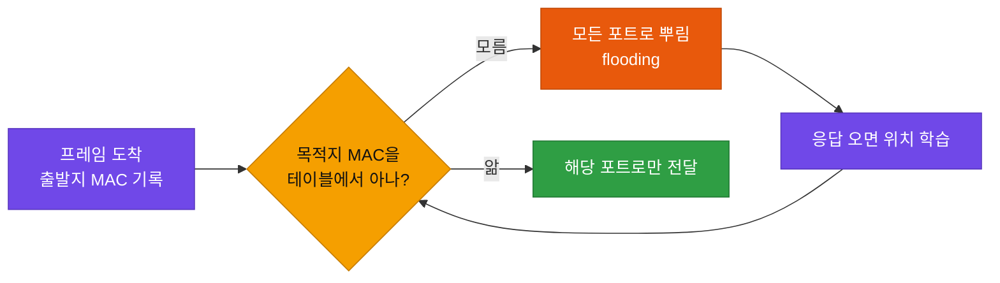
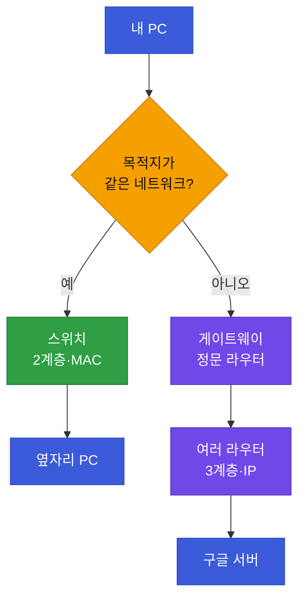
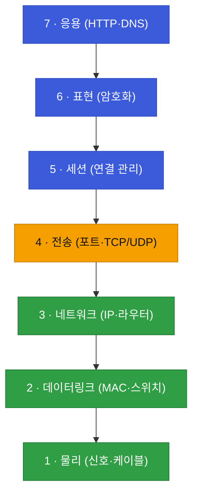

# 강의1 · OSI 7계층 모델 (오전, 총 120분)

> **이 교시 한 문장:** 통신을 7층으로 나눈 지도를 그리고, 특히 **MAC·IP·포트**가 각자 무슨 일을 하는지 손에 잡히게 만듭니다.

| 시간 | 소주제 | 핵심 한 줄 |
|------|--------|-----------|
| 00-20분 | 네트워크를 배우는 이유 | 지도가 있어야 장애 원인을 좁힌다 |
| 20-50분 | OSI 1·2·3계층 (+ MAC 완전정복) | 데이터를 목적지 기기까지 **나른다** |
| 50-80분 | OSI 4·5·6·7계층 | 기기 **안**에서 올바른 프로그램에 전달한다 |
| 80-105분 | 계층으로 장애 좁히기 | 아래→위로 점검하면 원인 구간이 좁혀진다 |
| 105-120분 | 정리 | OSI 한 장 요약 → 오후 TCP/IP로 |

## 이 교시에 나오는 어려운 용어
| 용어 (한글발음) | 한 줄 뜻 (아주 쉽게) | 비유 |
|----------------|----------------------|------|
| **OSI 7계층(오에스아이)** | 통신 과정을 7층 건물처럼 나눈 지도 | 7층짜리 물류센터 |
| **패킷(packet, 패킷)** | 데이터를 잘게 나눠 담은 한 덩어리 | 택배 상자 하나 |
| **MAC 주소(맥)** | 기기마다 평생 붙어 있는 고유 번호 | 주민등록번호 |
| **IP 주소(아이피)** | 지금 접속한 위치를 가리키는 주소 | 지금 사는 집 주소 |
| **포트(port, 포트)** | 한 컴퓨터 안에서 어느 프로그램인지 구분하는 번호 | 건물 안 "몇 호실" |
| **3-way Handshake(쓰리웨이 핸드셰이크)** | 통신 시작 전 서로 "준비됐니? 응" 확인하는 인사 | 전화 걸어 "여보세요?" |
| **Wireshark(와이어샤크)** | 오가는 패킷을 눈으로 들여다보는 도구 | 택배 X-레이 검사기 |

---

## ⏱️ 00-20분 · 우리가 네트워크를 배우는 진짜 이유

> 🎤 *"여러분, 고객사에서 전화가 옵니다. '왜 갑자기 접속이 안 되나요?' 딱 이 한 마디예요. 어디부터 확인하실 건가요? 케이블? IP? 방화벽? 서버? …머릿속에 '지도'가 없으면 아무 데나 막 찔러보게 됩니다. 오늘 그 지도를 그려봅시다."*

**🧠 쉽게 이해하기**

보안관제(SOC, "쏙")에서 가장 흔한 상황입니다. 고객은 **증상만** 말하고("안 돼요", "느려요"), 원인은 우리가 찾아야 합니다. 통신 과정을 **단계로 쪼개** 볼 줄 알면 "여기까진 정상, 여기서 막힘"으로 범위를 좁힐 수 있습니다.

그리고 이 2과목은 뒤에 배울 **3·4·5과목(접근통제·이상탐지·자동대응)의 밑바탕**입니다. 지금 지도를 확실히 그려두면 남은 과정이 쉬워집니다.

!!! example "쉬운 비유 — 계층으로 나눈다는 것"
    택배가 오는 과정: ①상자에 담고 → ②송장 붙이고 → ③트럭에 싣고 → ④도로를 달려 → ⑤집 앞에 내리고 → ⑥초인종. 문제가 생기면 "어느 단계?"를 봅니다. 네트워크도 **단계(계층)로 나눠** 보면 문제 지점을 콕 집습니다.

!!! question "확인질문 · 나의 답"
    **Q. 고객이 '인터넷이 느려요'라고만 할 때, 어느 계층부터 확인할까요?**

    A. **맨 아래(케이블)부터** 차례로 확인합니다. ① 선이 잘 꽂혔는지 → ② 인터넷 주소가 통하는지(핑) → ③ 그 사이트의 문(포트)이 열렸는지. 아래부터 하나씩 지우면 "어디까지 괜찮고, 어디서 막혔는지"가 보입니다. 처음부터 서버를 의심하는 것보다 훨씬 빠릅니다.

<div class="quiz">
<p class="quiz-q"><span class="tag">퀴즈</span><b>장애 원인을 찾을 때 '아래 계층(물리)부터' 점검하는 이유로 가장 적절한 것은?</b></p>
<button class="quiz-opt">응용 계층은 거의 고장 나지 않기 때문</button>
<button class="quiz-opt" data-correct>아래가 막혀 있으면 위 계층은 볼 필요도 없어, 점검 범위를 한 번에 좁힐 수 있기 때문</button>
<button class="quiz-opt">위 계층은 확인하는 데 특별한 장비가 필요하기 때문</button>
<button class="quiz-opt">물리 계층이 항상 문제의 원인이기 때문</button>
<div class="quiz-explain"><b>정답: 2번.</b> 하위 계층이 죽었으면 상위는 자동으로 안 되므로, 아래부터 지워가면 원인 구간이 빠르게 좁혀집니다. "물리가 항상 원인"(4번)은 과장이고, 나머지도 사실이 아닙니다.</div>
<button class="quiz-retry">다시 풀기</button>
</div>

---

## ⏱️ 20-50분 · 지도의 아래 세 칸 — 1·2·3계층 *(오늘의 핵심)*

!!! abstract "이 블록을 마치면"
    ✔ 1·2·3계층 역할을 한 문장씩 말한다 ✔ ==MAC(2계층)과 IP(3계층)가 왜 둘 다 필요한지== 설명한다 ✔ MAC 주소를 뜯어 읽을 수 있다

아래 세 칸의 공통 임무는 하나 — **"데이터를 목적지 기기까지 실제로 날라다 주는 것"**입니다.

먼저 하나 심어둡니다. 데이터는 통째로 날아가지 않고, **잘게 쪼갠 덩어리(패킷)**에 **층마다 봉투를 하나씩 덧씌워** 내려갑니다. 이를 **캡슐화(encapsulation, 인캡슐레이션)**라고 합니다.

!!! example "쉬운 비유 — 캡슐화(봉투 덧씌우기)"
    ①편지지(데이터) → ②봉투에 받는 사람 이름 → ③택배 상자에 집 주소. 내려갈수록 포장이 하나씩 늘고, 받는 쪽은 반대로 벗기며 올라갑니다. 2·3계층이 각자 자기 "봉투(헤더)"를 씌웁니다.

### 1계층 — 물리(Physical): "길과 전선"

- **무엇:** 랜선(UTP 케이블), 광케이블, 신호를 퍼뜨리는 허브(hub).
- **다루는 것:** 0과 1의 **전기·빛 신호**. 지능은 없고 신호만 흘려보냅니다.
- 편지로 치면 **도로 그 자체**.

!!! tip "실무 팁 — 1계층 장애는 의외로 흔하다"
    "인터넷 안 돼요"의 상당수가 사실 1계층입니다(랜선 반쯤 빠짐, 포트 불량, 케이블 눌림). 스위치 포트 **LED가 켜지는지**가 1계층 생존의 첫 신호입니다.

### 2계층 — 데이터링크(Data Link): "같은 동네 안 배달"

- **주소:** **MAC(맥) 주소** — 랜카드마다 공장에서 찍혀 나오는 고유번호.
- **장비:** **스위치(switch)** — MAC을 보고 같은 네트워크 안 정확한 기기에 전달.

<div class="quiz">
<p class="quiz-q"><span class="tag">퀴즈</span><b>옆자리 PC(같은 네트워크)로 파일을 보낼 때 라우터를 거치지 않아도 되는 이유로 가장 적절한 것은?</b></p>
<button class="quiz-opt">파일 크기가 작아 라우터의 처리가 필요 없기 때문</button>
<button class="quiz-opt">같은 회사 기기끼리는 인증이 생략되기 때문</button>
<button class="quiz-opt" data-correct>같은 네트워크라 목적지를 MAC 주소만으로 특정할 수 있어, 네트워크 사이를 잇는 라우터가 필요 없기 때문</button>
<button class="quiz-opt">스위치가 라우터보다 항상 빠르기 때문</button>
<div class="quiz-explain"><b>정답: 3번.</b> 라우터는 '다른 네트워크로 넘길 때' 필요합니다. 같은 네트워크 안이면 2계층(MAC)만으로 전달되므로 라우터가 없어도 됩니다.</div>
<button class="quiz-retry">다시 풀기</button>
</div>

### 🔬 깊이 보기 — MAC 주소 완전정복 (단계적 튜토리얼)

MAC 주소는 이 과정 내내(2과목~접근통제~이상탐지) 계속 나옵니다. 한 번 제대로 뜯어봅니다.

**1단계 · MAC 주소가 뭔가요?**
기기의 랜카드(NIC, 네트워크 인터페이스 카드)에 붙은 **48비트(6바이트) 고유 번호**입니다. 보통 16진수 12자리로 씁니다.
> 예: `00:1A:2B:3C:4D:5E`  (콜론 대신 `-`나 `.`로 쓰기도 함)

**2단계 · 구조를 뜯어봅니다 (앞 절반 / 뒤 절반)**
6칸은 **앞 3칸 + 뒤 3칸**으로 의미가 나뉩니다.

| `00:1A:2B` | `:` | `3C:4D:5E` |
|:---:|:---:|:---:|
| **앞 24비트 = OUI** | | **뒤 24비트 = 일련번호** |
| **제조사** 식별 번호 | | 그 제조사가 기기마다 붙인 **고유 번호** |

즉 앞 3칸만 보면 ==어느 회사가 만든 랜카드인지== 알 수 있습니다. (OUI는 IEEE라는 표준기구가 회사별로 배정)

**3단계 · MAC은 어디서 오나요? (그리고 바뀌나요?)**
공장에서 랜카드에 **각인(burned-in)**되어 나옵니다. 원칙적으로 평생 고정 — 그래서 "주민등록번호" 비유를 씁니다.
그런데 **소프트웨어로 위장(MAC spoofing, 맥 스푸핑)**할 수도 있습니다. 이게 보안에서 중요해집니다(4·5단계).

**4단계 · 내 MAC 직접 확인하기 (강의 중 시연)**
```text
# 윈도우
ipconfig /all      → "물리적 주소" 항목이 MAC (예: 00-1A-2B-3C-4D-5E)
getmac             → MAC만 간단히

# macOS / 리눅스
ifconfig           → "ether" 뒤 값이 MAC
```
> 시연 포인트: 앞 3칸(OUI)을 인터넷 "OUI lookup"에 넣으면 **제조사 이름**이 뜹니다. "이 노트북 랜카드는 Intel 거네요"처럼 보여주면 학생 반응이 좋습니다.

**5단계 · 스위치는 MAC을 어떻게 쓰나요? (MAC 주소 테이블)**
스위치는 처음엔 누가 어디 붙었는지 모릅니다. 그래서 이렇게 **배웁니다**:


한 번 배우면 다음부터는 해당 포트로만 정확히 보냅니다. (이 "학습" 개념이 뒤 이상탐지에서 "정상 baseline 학습"과 통합니다.)

**6단계 · 보안에서 왜 중요한가요?**

- **MAC 필터링:** "등록된 MAC만 접속 허용"하는 접근통제 방식(가정용 공유기에도 있음).
- **MAC 스푸핑 공격:** 허용된 기기의 MAC을 위장해 몰래 들어오는 시도 → 4과목(이상탐지)에서 "같은 MAC이 갑자기 다른 위치" 같은 신호로 잡습니다.
- **포트 보안(port security):** 스위치 한 포트에 허용 MAC 수를 제한. → 3과목(접근통제) 사고방식의 물리 버전.

!!! question "미니 확인 (MAC 심화)"
    **Q. `00:1A:2B:99:88:77`과 `00:1A:2B:11:22:33`, 두 기기의 공통점은?**
    A. 앞 3칸(`00:1A:2B`)이 똑같습니다. 이 앞부분은 **만든 회사**를 뜻하므로, 둘은 ==같은 회사가 만든 랜카드==입니다. 뒤 3칸이 서로 달라서, 회사는 같아도 **다른 기기**입니다.

### 3계층 — 네트워크(Network): "다른 동네로 보내기"
동네(네트워크)를 벗어나려면 새 주소·새 장비가 필요합니다.

- **주소:** **IP(아이피) 주소** — `192.168.0.10`처럼 생기고, **접속 위치에 따라 바뀝니다.**
- **장비:** **라우터(router)** — IP를 보고 "어느 네트워크로 보낼지" 길을 잡음.
- **게이트웨이(gateway):** 우리 동네에서 바깥으로 나가는 **"정문"** 라우터 주소.

**🔑 MAC vs IP — 왜 둘 다 필요한가**

| | MAC(맥) | IP(아이피) |
|---|---|---|
| 비유 | 주민등록번호(평생 고정) | 사는 집 주소(바뀜) |
| 범위 | **같은 네트워크 안** | **네트워크 사이** |
| 계층/장비 | 2계층 / 스위치 | 3계층 / 라우터 |

둘을 잇는 다리가 **ARP(아르프)** — "이 IP 가진 기기의 MAC이 뭐죠?"라고 같은 네트워크에 물어보는 절차입니다. **IP로 동네를 찾아가고, 마지막엔 MAC으로 정확한 기기에 꽂습니다.**



!!! warning "학생이 헷갈리는 지점 (미리 답 준비)"

    - **"스위치랑 라우터 차이?"** → 스위치=같은 네트워크 안(MAC), 라우터=네트워크 사이(IP). 경비실 vs 택배 허브.
    - **"IP만 있으면 되지 MAC은 왜?"** → IP는 "어느 동네"까지. 마지막에 정확한 기기에 꽂으려면 그 동네 이름표(MAC)가 필요.
    - **"MAC은 고정인데 IP는 왜 바뀌어요?"** → MAC은 기기에 붙은 것, IP는 지금 연결된 위치. 카페 와이파이면 IP는 카페 것, MAC은 그대로.

!!! note "한 줄 요약 (20-50분)"
    ==같은 동네는 MAC(스위치), 다른 동네는 IP(라우터).== 아래 3계층은 데이터를 목적지 기기까지 나른다.

<div class="quiz">
<p class="quiz-q"><span class="tag">퀴즈</span><b>IP가 있는데도 마지막 전달에 MAC 주소가 또 필요한 이유로 가장 적절한 것은?</b></p>
<button class="quiz-opt">MAC이 IP보다 보안이 강하기 때문</button>
<button class="quiz-opt" data-correct>IP는 '어느 네트워크(동네)'까지만 안내하고, 그 안에서 정확한 기기에 꽂으려면 그 네트워크에서 통하는 이름표(MAC)가 필요하기 때문</button>
<button class="quiz-opt">MAC이 없으면 IP를 만들 수 없기 때문</button>
<button class="quiz-opt">IP는 인터넷에서만, MAC은 내부에서만 쓰도록 정해져 있기 때문</button>
<div class="quiz-explain"><b>정답: 2번.</b> IP로 목적지 동네를 찾아가고, 도착한 동네에서 실제 기기에 전달할 때 MAC을 씁니다. 둘은 담당 범위가 달라 함께 필요합니다.</div>
<button class="quiz-retry">다시 풀기</button>
</div>

---

## ⏱️ 50-80분 · 지도의 위 네 칸 — 4·5·6·7계층

!!! abstract "이 블록을 마치면"
    ✔ 포트가 왜 필요한지 설명한다 ✔ TCP/UDP를 비유로 구분한다 ✔ ==자주 쓰는 포트 4개(80·443·22·53)==를 외운다

아래 세 칸이 "기기까지 배달"이었다면, 위 네 칸은 "기기에 **도착한 다음**"입니다.

### 4계층 — 전송(Transport): "어느 창구로 갈까"
목적지 컴퓨터 안엔 웹·메일·화상회의가 동시에 돕니다. 이걸 구분하는 게 **포트(port) 번호**입니다.

!!! example "쉬운 비유 — IP는 건물, 포트는 호실"
    IP가 "건물 주소"면 포트는 "몇 호실". 경비원이 "이건 302호(웹), 저건 505호(메일)"로 나눠 올려보냅니다.

<div class="quiz">
<p class="quiz-q"><span class="tag">퀴즈</span><b>같은 IP를 가진 서버가 웹과 메일을 동시에 서비스할 수 있는 이유로 가장 적절한 것은?</b></p>
<button class="quiz-opt">서버가 IP를 두 개 갖고 있기 때문</button>
<button class="quiz-opt">웹과 메일이 서로 다른 케이블을 쓰기 때문</button>
<button class="quiz-opt">프로그램마다 MAC 주소가 다르기 때문</button>
<button class="quiz-opt" data-correct>도착한 데이터를 포트 번호(4계층)로 구분해, 같은 IP라도 각기 다른 프로그램에 나눠 전달하기 때문</button>
<div class="quiz-explain"><b>정답: 4번.</b> IP(건물)는 하나여도 포트(호실)로 서비스를 구분합니다. IP가 두 개(1번)일 필요도, 케이블(2번)·MAC(3번) 때문도 아닙니다.</div>
<button class="quiz-retry">다시 풀기</button>
</div>

| | TCP(티씨피) | UDP(유디피) |
|---|---|---|
| 비유 | 등기우편(확인) | 일반우편(빠름) |
| 특징 | 신뢰성↑, 조금 느림 | 빠름, 유실 가능 |
| 언제 | 웹·파일전송 | 실시간 영상·DNS질의 |

!!! tip "실무 팁"
    화상회의가 가끔 깨져도 계속 가는 건 UDP라서. 파일 다운로드는 한 조각만 빠져도 깨지니 TCP로 빠짐없이 받습니다.

<div class="quiz">
<p class="quiz-q"><span class="tag">퀴즈</span><b>실시간 화상회의가 TCP가 아니라 UDP를 주로 쓰는 이유로 가장 적절한 것은?</b></p>
<button class="quiz-opt">UDP가 TCP보다 화질이 좋기 때문</button>
<button class="quiz-opt" data-correct>조금 유실되더라도 '지금 이 순간'을 빨리 전하는 게 중요해, 확인·재전송으로 지체되는 것보다 낫기 때문</button>
<button class="quiz-opt">TCP는 영상 데이터를 전송하지 못하기 때문</button>
<button class="quiz-opt">UDP가 데이터를 자동으로 암호화해 주기 때문</button>
<div class="quiz-explain"><b>정답: 2번.</b> 실시간성이 정확성보다 중요할 때 UDP가 유리합니다. 화질(1번)·암호화(4번)와는 무관하고, TCP도 영상은 보낼 수 있습니다(3번).</div>
<button class="quiz-retry">다시 풀기</button>
</div>

### 5·6계층 — 세션·표현: "연결 관리와 통역"

- **세션(5):** 연결을 열고 유지하고 닫는 관리.
- **표현(6):** 서로 알아보게 **암호화·인코딩**(HTTPS 자물쇠와 관련).
- 오늘은 "이런 역할이 있다"까지만.

### 7계층 — 응용(Application): "사람이 마주하는 화면"
웹(HTTP)·메일(SMTP)·이름풀이(DNS) 등. 자주 보는 포트는 외워둡니다.

| 포트 | 서비스 | 뜻 |
|:---:|--------|-----|
| `80` | HTTP | 일반 웹 |
| `443` | HTTPS | 암호화 웹(자물쇠) |
| `22` | SSH | 서버 원격 접속 |
| `53` | DNS | 도메인 → IP 변환 |

!!! tip "실무 팁 — 포트를 알면 로그가 읽힌다"
    방화벽 로그에 `dst port 22`(SSH)가 급증 → "누가 원격 접속을 계속 시도"라고 바로 감. 4과목(이상탐지)에서 다시 만납니다.

!!! question "확인질문 · 나의 답"
    **Q. 같은 IP 서버에서 웹과 이메일을 동시에 운영할 수 있는 이유?**
    A. **포트 번호** 덕분입니다. IP(건물 주소)는 하나여도, 웹은 `443`번 방·메일은 다른 방으로 들어옵니다. 서버는 이 방 번호(포트)를 보고 "이건 웹, 저건 메일"로 나눠 보냅니다.

!!! note "한 줄 요약 (50-80분)"
    ==IP는 건물, 포트는 호실.== 4계층 포트로 프로그램을 구분하고, TCP(등기)/UDP(일반)로 보내는 방식이 갈린다.

---

## ⏱️ 80-105분 · 계층 구조로 장애를 좁혀가는 법 (bottom-up)

!!! abstract "이 블록을 마치면"
    ✔ 장애를 만나면 1계층부터 순서대로 점검하는 흐름을 몸에 익힌다

"케이블은 꽂혀 있는데 인터넷이 안 된다" 같은 상황을 **아래에서 위로** 점검합니다.

| 순서 | 점검 | 확인 방법 | 실패하면 의심 |
|:---:|------|-----------|--------------|
| 1계층 | 케이블·포트 연결 | LED, 케이블 교체 | 물리 단선·포트 불량 |
| 2계층 | 스위치 포트 상태 | 스위치 관리화면 | 포트 차단·VLAN 문제 |
| 3계층 | IP·연결성 | `ping` | IP 미할당, 게이트웨이 문제 |
| 4계층 | 포트 연결 | `telnet ip 포트` | **방화벽 차단** |
| 7계층 | 서비스 응답 | 브라우저·로그 | 서비스 다운 |

!!! tip "실무 팁 — 왜 아래부터인가"
    아래가 안 되면 위는 볼 필요도 없습니다(1계층이 죽었는데 7계층 볼 이유 없음). 아래부터 지우면 **원인 구간이 한 번에 좁혀집니다.**

!!! question "확인질문 · 나의 답"
    **Q. 3계층(핑)은 성공인데 4계층(포트 연결)이 실패하면, 방화벽을 의심하는 이유는?**
    A. 핑이 된다는 건 **주소(IP)까지는 잘 도착**한다는 뜻입니다(여기까진 정상). 그런데 특정 문(포트)만 안 열린다면, ==문을 열고 닫는 담당인 방화벽==이 그 문을 막았을 가능성이 큽니다. 방화벽은 포트 하나하나 통과/차단을 정하기 때문입니다.

<div class="quiz">
<p class="quiz-q"><span class="tag">퀴즈</span><b>핑(3계층)은 성공하는데 특정 포트 연결만 실패할 때, 방화벽을 의심하는 근거로 가장 타당한 것은?</b></p>
<button class="quiz-opt">핑과 포트 연결은 서로 아무 관련이 없기 때문</button>
<button class="quiz-opt">방화벽은 원래 핑만 차단하기 때문</button>
<button class="quiz-opt" data-correct>핑이 됐다는 건 IP까지 도달했다는 뜻이라, 포트 단위로 통과/차단을 결정하는 4계층(방화벽)이 막았을 가능성이 높기 때문</button>
<button class="quiz-opt">DNS가 없으면 포트 연결이 실패하기 때문</button>
<div class="quiz-explain"><b>정답: 3번.</b> "어디까지 도달했나"로 층을 좁히는 사고가 핵심입니다. 3계층까지 정상인데 포트만 막혔으니 포트를 다루는 4계층(방화벽)을 먼저 봅니다.</div>
<button class="quiz-retry">다시 풀기</button>
</div>

---

## ⏱️ 105-120분 · 정리 & 오후 예고

**OSI 7계층 한 장 요약**

| 계층 | 이름 | 핵심 | 장비/예 |
|:---:|------|------|---------|
| 7 | 응용 | 사람이 쓰는 서비스 | HTTP·DNS |
| 6 | 표현 | 암호화·인코딩 | (개념) |
| 5 | 세션 | 연결 관리 | (개념) |
| 4 | 전송 | **포트**·TCP/UDP | 방화벽 |
| 3 | 네트워크 | **IP** | 라우터 |
| 2 | 데이터링크 | **MAC** | 스위치 |
| 1 | 물리 | 신호·케이블 | 허브 |


> 색으로 외우기: ==🟩 아래 3층(1·2·3)="배달", 🟨 4층="창구 배분", 🟦 위 3층(5·6·7)="사람 쪽".==

**오후 예고:** 오전엔 "지도"를 그렸으니, 오후(강의2)엔 그 지도 위에서 실제로 연결을 맺는 **TCP/IP와 3-way Handshake**를 봅니다. 오늘 배운 4계층(TCP)·포트가 바로 이어집니다.

---

## ✅ 가르칠 준비 체크리스트 (강의1)

- [ ] OSI 7계층을 "건물/택배" 비유로 설명한다
- [ ] 캡슐화를 한 문장으로 설명한다
- [ ] **MAC 주소를 6칸으로 뜯어(OUI+일련번호) 읽고**, 스푸핑·필터링까지 말한다
- [ ] MAC vs IP가 왜 둘 다 필요한지 답한다
- [ ] `ipconfig /all`·`getmac`·`ping`·`telnet`을 직접 시연한다
- [ ] 포트 4개(80/443/22/53)를 외웠다
- [ ] bottom-up 장애 점검 순서를 표 없이 말한다
- [ ] 확인질문 4개 + 학생 예상질문에 답한다

*[OSI]: Open Systems Interconnection — 통신을 7계층으로 나눈 표준 모델
*[SOC]: Security Operations Center — 24시간 보안 감시팀(보안관제)
*[MAC]: Media Access Control — 기기에 평생 붙는 고유 주소
*[IP]: Internet Protocol — 접속 위치를 가리키는 주소
*[ARP]: Address Resolution Protocol — IP로 상대의 MAC을 알아내는 절차
*[OUI]: Organizationally Unique Identifier — MAC 앞 3칸(제조사 번호)
*[NIC]: Network Interface Card — 랜카드(네트워크 인터페이스)
*[TCP]: Transmission Control Protocol — 확인하며 확실히 보내는 방식
*[UDP]: User Datagram Protocol — 확인 없이 빠르게 보내는 방식
*[DNS]: Domain Name System — 도메인 이름을 IP로 바꾸는 서비스
*[SSH]: Secure Shell — 서버에 안전하게 원격 접속하는 프로토콜
