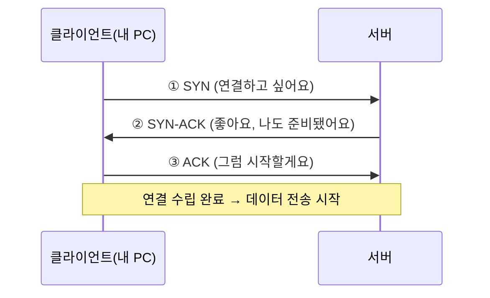

# 강의2 · TCP/IP와 3-way Handshake (오후, 총 120분)

> **이 교시 한 문장:** 오전에 그린 지도 위에서, 두 컴퓨터가 실제로 연결을 **맺고(handshake)** 데이터를 주고받는 과정을 눈으로 따라갑니다.

| 시간 | 소주제 | 핵심 한 줄 |
|------|--------|-----------|
| 00-25분 | TCP vs UDP | 등기우편(확실) vs 일반우편(빠름) |
| 25-55분 | 3-way Handshake | SYN → SYN-ACK → ACK, 연결을 "여는" 3번의 인사 |
| 55-85분 | IP 헤더와 패킷 구조 | 출발지·목적지 IP·TTL이 봉투에 적혀 있다 |
| 85-110분 | Wireshark 기본 | 오가는 패킷을 눈으로 들여다보기 |
| 110-120분 | 실습 안내 | 오후 실습으로 연결 |

## 이 교시에 나오는 어려운 용어
| 용어 (한글발음) | 한 줄 뜻 (아주 쉽게) | 비유 |
|----------------|----------------------|------|
| **OSI 7계층(오에스아이)** | 통신 과정을 7층 건물처럼 나눈 지도 | 7층짜리 물류센터 |
| **패킷(packet, 패킷)** | 데이터를 잘게 나눠 담은 한 덩어리 | 택배 상자 하나 |
| **MAC 주소(맥)** | 기기마다 평생 붙어 있는 고유 번호 | 주민등록번호 |
| **IP 주소(아이피)** | 지금 접속한 위치를 가리키는 주소 | 지금 사는 집 주소 |
| **포트(port, 포트)** | 한 컴퓨터 안에서 어느 프로그램인지 구분하는 번호 | 건물 안 "몇 호실" |
| **3-way Handshake(쓰리웨이 핸드셰이크)** | 통신 시작 전 서로 "준비됐니? 응" 확인하는 인사 | 전화 걸어 "여보세요?" |
| **Wireshark(와이어샤크)** | 오가는 패킷을 눈으로 들여다보는 도구 | 택배 X-레이 검사기 |

---

## ⏱️ 00-25분 · TCP vs UDP — 데이터를 보내는 두 가지 성격

!!! abstract "이 블록을 마치면"
    ✔ TCP와 UDP를 비유로 구분한다 ✔ 어떤 서비스가 왜 그 방식을 쓰는지 설명한다

오전에 4계층(전송)에서 잠깐 만난 두 이름을 이제 제대로 봅니다. 둘 다 데이터를 나르지만 **성격이 정반대**입니다.

**TCP(티씨피, Transmission Control Protocol)** — "등기우편"

- 보내기 전에 **연결을 먼저 맺고**(3-way handshake), 받았는지 **하나하나 확인**합니다.
- 빠지거나 순서가 뒤바뀌면 **다시 보내 바로잡습니다.** 그래서 느리지만 정확합니다.

**UDP(유디피, User Datagram Protocol)** — "일반우편"

- 연결도 확인도 없이 **그냥 던집니다.** 빠르지만 일부가 유실될 수 있습니다.

| | TCP(티씨피) | UDP(유디피) |
|---|---|---|
| 연결 | 맺고 시작(handshake) | 없이 바로 |
| 확인 | 받았는지 확인·재전송 | 확인 안 함 |
| 속도 | 조금 느림 | 빠름 |
| 언제 | 웹·파일전송·메일 | 실시간 영상·음성·DNS 질의 |

!!! example "쉬운 비유"
    화상회의(UDP)는 "지금 이 순간"이 중요합니다. 3초 전 화면을 다시 받느니 조금 깨져도 **지금 화면으로 빨리** 가는 게 낫죠. 반대로 계약서 파일(TCP)은 한 글자만 빠져도 안 되니 **빠짐없이 확인**하며 받습니다.

!!! question "확인질문"
    **Q. 화상회의(실시간 영상)와 파일 다운로드, 어느 쪽이 TCP에 더 적합할까요?**

    **A.** **파일 다운로드**입니다. 파일은 한 조각만 빠져도 깨지니까, TCP가 "잘 받았니?"를 확인하며 빠짐없이 보냅니다. 반대로 화상회의는 조금 끊겨도 "지금 이 순간"이 중요해서, 확인 없이 빠른 UDP를 씁니다.

<div class="quiz">
<p class="quiz-q"><span class="tag">퀴즈</span><b>파일 다운로드에 UDP가 아니라 TCP가 적합한 이유로 가장 적절한 것은?</b></p>
<button class="quiz-opt">TCP가 UDP보다 항상 전송 속도가 빠르기 때문</button>
<button class="quiz-opt" data-correct>파일은 한 조각만 빠져도 손상되므로, 빠짐없이 확인·재전송하는 방식이 필요하기 때문</button>
<button class="quiz-opt">UDP는 큰 파일을 전송하지 못하기 때문</button>
<button class="quiz-opt">파일 전송은 실시간성이 가장 중요하기 때문</button>
<div class="quiz-explain"><b>정답: 2번.</b> 정확성이 실시간성보다 중요할 때 TCP를 씁니다. TCP가 더 빠른 것도(1번), UDP가 대용량을 못 보내는 것도(3번) 아닙니다.</div>
<button class="quiz-retry">다시 풀기</button>
</div>

---

## ⏱️ 25-55분 · 3-way Handshake — 연결을 "여는" 세 번의 인사 *(오늘의 핵심)*

!!! abstract "이 블록을 마치면"
    ✔ SYN → SYN-ACK → ACK 3단계를 순서대로 그린다 ✔ ==SYN Flood 공격이 왜 서버를 괴롭히는지== 설명한다

TCP는 데이터를 보내기 전에 반드시 **"연결을 맺는 인사"**를 세 번 주고받습니다. 이게 **3-way Handshake(쓰리웨이 핸드셰이크, "세 번의 악수")**입니다.

!!! example "쉬운 비유 — 전화 통화 시작"
    전화를 걸면: ①"여보세요?"(들리니?) → ②"네, 들려요. 그쪽도 들리세요?"(나도 확인) → ③"네 들려요."(그럼 시작). 이 **세 마디**를 주고받아야 서로 "연결됐다"고 믿고 본론을 시작합니다. TCP도 똑같습니다.

### 🔬 깊이 보기 — 3-way Handshake 단계별로



**1단계 · SYN (Synchronize, "동기화하자")**
클라이언트가 서버에 "연결하고 싶다"고 첫 신호를 보냅니다. (내 순서번호도 같이 알려줌)

**2단계 · SYN-ACK (Synchronize + Acknowledge, "알겠어 + 나도 하자")**
서버가 "네 요청 받았고(ACK), 나도 연결할 준비됐다(SYN)"고 답합니다. 두 뜻을 한 번에 보냅니다.

**3단계 · ACK (Acknowledge, "확인했어")**
클라이언트가 "서버 응답 확인했다"고 마지막 답을 보냅니다. → ==이제 연결 성립, 데이터 전송 시작.==

!!! warning "여기서 4과목이 시작됩니다 — SYN Flood 공격"
    만약 공격자가 **①SYN만 잔뜩 보내고 ③ACK는 안 보내면**? 서버는 "곧 3단계가 오겠지" 하며 **연결 자리를 비워둔 채 계속 기다립니다.** 이런 반쪽 연결이 수천 개 쌓이면 서버 자리가 동나 **정상 사용자가 못 들어옵니다.** 이게 **SYN Flood(신 플러드)** 공격이고, 4과목(이상탐지)에서 "SYN은 폭증하는데 ACK는 적은 패턴"으로 탐지합니다.

!!! question "확인질문"
    **Q. 공격자가 SYN만 계속 보내고 ACK는 보내지 않으면 서버에 어떤 부담이 생길까요?**

    **A.** 서버는 마지막 인사(ACK)를 기다리며 **연결 자리를 비워둔 채 계속 기다립니다.** 이런 "반쯤 열린 연결"이 수천 개 쌓이면 자리가 다 차서, **진짜 손님(정상 사용자)이 못 들어옵니다.** 이렇게 서버를 마비시키는 게 SYN Flood 공격입니다.

<div class="quiz">
<p class="quiz-q"><span class="tag">퀴즈</span><b>SYN Flood 공격이 서버를 마비시킬 수 있는 이유로 가장 적절한 것은?</b></p>
<button class="quiz-opt">SYN 패킷이 다른 패킷보다 용량이 훨씬 크기 때문</button>
<button class="quiz-opt">서버가 SYN을 받으면 즉시 재부팅되기 때문</button>
<button class="quiz-opt" data-correct>공격자가 SYN만 보내고 마지막 ACK를 안 보내, 서버가 '반쯤 열린 연결'을 위해 자원을 계속 붙잡게 만들기 때문</button>
<button class="quiz-opt">3-way handshake가 원래 보안에 취약하도록 설계됐기 때문</button>
<div class="quiz-explain"><b>정답: 3번.</b> 정상 절차(SYN→SYN-ACK→ACK)의 마지막 단계를 일부러 빼서 서버 자원을 고갈시키는 공격입니다. handshake 자체가 취약(4번)한 게 아니라, 미완성 연결을 악용하는 것입니다.</div>
<button class="quiz-retry">다시 풀기</button>
</div>

!!! note "한 줄 요약 (25-55분)"
    ==SYN → SYN-ACK → ACK, 세 번 인사해야 TCP 연결이 열린다.== 이 절차의 허점이 SYN Flood 공격이다.

---

## ⏱️ 55-85분 · IP 헤더와 패킷 구조 — 봉투에 적힌 정보

!!! abstract "이 블록을 마치면"
    ✔ IP 헤더의 핵심 필드(출발지·목적지·TTL)를 말한다 ✔ TTL이 무한 루프를 막는 원리를 안다

오전에 "데이터에 층마다 봉투(헤더)를 씌운다(캡슐화)"고 했습니다. 3계층에서 씌우는 **IP 헤더(봉투)**에 뭐가 적혀 있는지 봅니다.

| 필드 | 뜻 | 왜 중요 |
|------|-----|---------|
| **출발지 IP** | 누가 보냈나 | 응답을 돌려보낼 주소 |
| **목적지 IP** | 어디로 가나 | 라우터가 경로를 잡는 기준 |
| **TTL** | 남은 수명 | 무한히 떠도는 패킷 방지 |
| **프로토콜** | 안에 뭐가 들었나 | TCP인지 UDP인지 표시 |

### 🔬 깊이 보기 — TTL(Time To Live, "살아 있을 시간")

TTL은 패킷의 **"남은 목숨"** 숫자입니다.

- 패킷이 라우터를 **하나 지날 때마다 TTL이 1씩 줄어듭니다.**
- **TTL이 0이 되면** 그 패킷은 **버려집니다(폐기).**
- 왜 필요할까요? 라우팅이 잘못 설정되면 패킷이 라우터 사이를 **뱅뱅 무한히 돌 수** 있습니다. TTL이 없으면 그런 패킷이 영원히 인터넷을 떠돌겠죠. TTL은 그걸 막는 **"자동 소멸 타이머"**입니다.

!!! tip "실무 팁 — tracert가 TTL로 경로를 알아낸다"
    오전에 쓴 `tracert`가 바로 이 TTL을 영리하게 이용합니다. TTL=1로 보내면 첫 라우터에서 죽으며 "나 여기 있다"고 알려주고, TTL=2면 두 번째 라우터가… 이렇게 **1씩 늘려가며 경로의 라우터를 하나씩 밝혀냅니다.**

!!! question "확인질문"
    **Q. TTL 값이 0이 되면 패킷은 어떻게 될까요?**

    **A.** 그 자리에서 **버려집니다.** TTL은 패킷의 "남은 목숨"인데, 라우터를 하나 지날 때마다 1씩 줄어 0이 되면 폐기돼요. 잘못된 길로 **영원히 뱅뱅 도는 패킷**을 막아주는 안전장치입니다.

<div class="quiz">
<p class="quiz-q"><span class="tag">퀴즈</span><b>IP 패킷에 TTL(남은 수명) 값을 두는 이유로 가장 적절한 것은?</b></p>
<button class="quiz-opt">TTL이 높을수록 전송 속도가 빨라지기 때문</button>
<button class="quiz-opt">TTL 값으로 패킷을 암호화하기 때문</button>
<button class="quiz-opt">TTL이 목적지 IP를 대신하기 때문</button>
<button class="quiz-opt" data-correct>라우팅이 잘못돼 패킷이 무한히 돌더라도 TTL이 0이 되면 폐기돼, 영원히 떠도는 것을 막기 때문</button>
<div class="quiz-explain"><b>정답: 4번.</b> TTL은 '자동 소멸 타이머'입니다. 라우터를 지날 때마다 1씩 줄어 0이 되면 버려집니다. 속도(1번)·암호화(2번)·주소(3번)와는 무관합니다.</div>
<button class="quiz-retry">다시 풀기</button>
</div>

---

## ⏱️ 85-110분 · Wireshark 기본 — 패킷을 눈으로 보기

!!! abstract "이 블록을 마치면"
    ✔ Wireshark로 캡처를 시작하고 필터로 원하는 패킷만 걸러낸다

**Wireshark(와이어샤크)**는 내 컴퓨터를 오가는 패킷을 **그대로 들여다보는 도구**입니다. 지금까지 배운 IP·포트·TCP가 화면에 실제로 뜹니다.

**기본 흐름**

1. 실행 → 캡처할 **네트워크 인터페이스** 선택 → 캡처 시작
2. 브라우저로 사이트 접속(패킷 발생)
3. **필터**로 원하는 것만 걸러 보기 → 캡처 정지

**자주 쓰는 필터**
```text
ip.addr == 192.168.0.1     # 특정 IP와 주고받은 것만
tcp.port == 443            # 443 포트(HTTPS)만
http                       # HTTP만
tcp.flags.syn == 1         # SYN이 켜진 패킷만 (handshake 관찰용)
```

!!! tip "실무 팁"
    필터 없이 캡처하면 화면이 수천 줄로 순식간에 뒤덮여 아무것도 못 봅니다. **"먼저 필터로 좁히고 본다"**가 습관입니다. handshake를 보고 싶으면 `tcp.port==443`로 좁힌 뒤 SYN/SYN-ACK/ACK 세 줄을 찾습니다.

!!! question "확인질문"
    **Q. 특정 IP와 주고받은 패킷만 보고 싶을 때 어떤 필터를 쓸까요?**

    **A.** `ip.addr == 그IP`를 씁니다. 예를 들어 `ip.addr == 8.8.8.8`이라고 넣으면, 그 IP와 주고받은 패킷만 딱 걸러서 보여줍니다.

<div class="quiz">
<p class="quiz-q"><span class="tag">퀴즈</span><b>패킷을 캡처할 때 필터로 먼저 좁혀서 보는 이유로 가장 적절한 것은?</b></p>
<button class="quiz-opt" data-correct>필터 없이 캡처하면 수천 줄이 순식간에 쌓여, 원하는 패킷(예: handshake)을 찾기 어렵기 때문</button>
<button class="quiz-opt">필터를 걸어야만 캡처가 시작되기 때문</button>
<button class="quiz-opt">필터가 패킷을 더 빠르게 전송해 주기 때문</button>
<button class="quiz-opt">필터 없이는 Wireshark가 실행되지 않기 때문</button>
<div class="quiz-explain"><b>정답: 1번.</b> 캡처는 필터 없이도 되지만(2·4번 틀림), 양이 너무 많아 분석이 어렵습니다. 그래서 "먼저 좁히고 본다"가 습관입니다. 필터는 전송 속도(3번)와 무관합니다.</div>
<button class="quiz-retry">다시 풀기</button>
</div>

---

## ⏱️ 110-120분 · 정리 & 실습 예고

**오늘 강의2 한 장 정리**

- **TCP**(확인하며 확실히) vs **UDP**(빠르게) — 성격이 반대
- **3-way Handshake**: ==SYN → SYN-ACK → ACK== 세 번 인사로 연결을 연다 → 허점이 SYN Flood
- **IP 헤더**: 출발지·목적지·**TTL**(자동 소멸 타이머)
- **Wireshark**: 필터로 좁혀 실제 패킷을 눈으로 확인

**실습 예고:** 이제 직접 Wireshark로 패킷을 잡아, 오늘 배운 **3-way handshake 3줄**과 **IP 헤더의 TTL**을 두 눈으로 찾아봅니다. → [실습 페이지](practice.md)

---

## ✅ 가르칠 준비 체크리스트 (강의2)

- [ ] TCP vs UDP를 비유로 구분하고 각각의 대표 서비스를 든다
- [ ] 3-way Handshake 3단계를 화이트보드에 그린다
- [ ] **SYN Flood 공격**을 handshake 허점으로 설명한다(4과목 연결)
- [ ] TTL이 0이 되면 어떻게 되는지, tracert가 이를 어떻게 쓰는지 안다
- [ ] Wireshark로 캡처를 시작하고 `tcp.port==443` 필터로 SYN을 찾아 보인다
- [ ] 확인질문 4개에 답한다

*[TCP]: Transmission Control Protocol — 확인하며 확실히 보내는 방식
*[UDP]: User Datagram Protocol — 확인 없이 빠르게 보내는 방식
*[SYN]: Synchronize — 연결을 시작하자는 첫 신호
*[ACK]: Acknowledge — 잘 받았다는 확인 신호
*[TTL]: Time To Live — 패킷이 살아 있을 수 있는 남은 홉 수
*[IP]: Internet Protocol — 접속 위치를 가리키는 주소
*[DNS]: Domain Name System — 도메인 이름을 IP로 바꾸는 서비스
