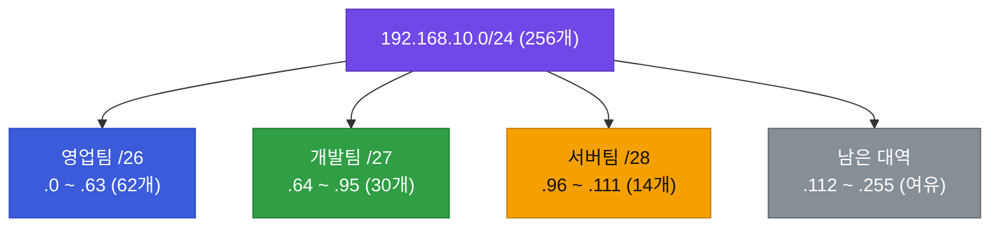
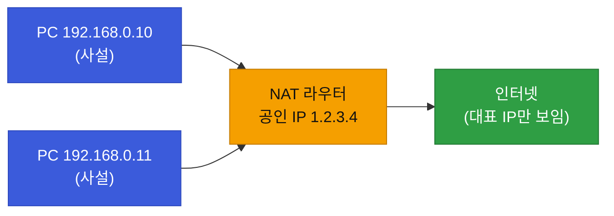

# 강의1 · IP 주소 체계와 서브네팅 (오전, 총 120분)

> **이 교시 한 문장:** IP 주소가 어떻게 생겼는지 뜯어보고, 그것을 **필요한 만큼 잘라 나누는(서브네팅)** 계산을 손에 익힙니다.

| 시간 | 소주제 | 핵심 한 줄 |
|------|--------|-----------|
| 00-25분 | IPv4 주소 구조 | 32비트를 8비트씩 4묶음, 공인 vs 사설 |
| 25-55분 | 서브넷 마스크·CIDR | 마스크가 "동네/집"을 가른다 |
| 55-85분 | 서브네팅 계산 실습 | 부서별로 대역을 쪼개 설계 |
| 85-110분 | NAT 개념 | 사설 IP를 공인 IP로 바꿔 내보내기 |
| 110-120분 | 정리 | 라우팅/VLAN으로 |

## 이 교시에 나오는 어려운 용어

| 용어 (한글발음) | 한 줄 뜻 (아주 쉽게) | 비유 |
|----------------|----------------------|------|
| **IPv4(아이피브이포)** | 32비트로 된 인터넷 주소 체계 | 4칸짜리 주소 |
| **옥텟(octet, 옥텟)** | IP를 8비트씩 나눈 한 묶음 | 주소의 한 칸 |
| **공인 IP(퍼블릭)** | 인터넷 전체에서 유일한 주소 | 도로명 주소 |
| **사설 IP(프라이빗)** | 회사·집 내부에서만 쓰는 주소 | 사내 내선번호 |
| **서브넷(subnet, 서브넷)** | 큰 IP 대역을 나눈 작은 구역 | 큰 땅을 필지로 |
| **서브넷 마스크(subnet mask)** | 주소에서 "동네/집"을 가르는 자 | 주소에 밑줄 긋기 |
| **CIDR(사이더, /24)** | 마스크를 짧게 쓰는 표기법 | "앞 24자리가 동네" |
| **호스트(host, 호스트)** | 그 대역에 들어갈 실제 기기 | 그 동네의 집 |
| **네트워크 주소** | 대역의 맨 앞 주소(동네 이름) | 동네 간판 |
| **브로드캐스트 주소** | 대역 전체에 방송하는 맨 뒤 주소 | 마을 확성기 |
| **NAT(냇)** | 사설 IP를 공인 IP로 바꿔 내보내기 | 대표전화로 걸기 |
| **게이트웨이(gateway)** | 동네 밖으로 나가는 정문 | 아파트 정문 |
| **IP 고갈** | 공인 IP 수가 모자라는 문제 | 번호가 동남 |

---

## ⏱️ 00-25분 · IPv4 주소 구조

!!! abstract "이 블록을 마치면"
    ✔ IP가 32비트 4묶음임을 안다 ✔ ==공인 IP와 사설 IP를 구분==한다

우리가 보는 `192.168.0.1` 같은 주소가 **IPv4(아이피 브이4) 주소**입니다. 사실은 **32비트(0과 1이 32개)**인데, 사람이 읽기 쉽게 **8비트씩 4묶음(옥텟, octet)**으로 잘라 10진수로 씁니다.

```text
192.168.0.1
= 11000000.10101000.00000000.00000001
  (8비트)   (8비트)   (8비트)   (8비트)   ← 4묶음 = 32비트
```
각 묶음은 8비트라 **0~255**까지 표현합니다. (그래서 256 이상 숫자는 IP에 없습니다)

**공인 IP vs 사설 IP**

| | 공인(public) IP | 사설(private) IP |
|---|---|---|
| 어디서 | 인터넷 전체에서 유일 | 회사·집 내부에서만 |
| 예 | 통신사가 준 주소 | `10.x` / `172.16~31.x` / `192.168.x` |
| 비유 | 도로명 주소(전국 유일) | 사내 내선번호(회사 안에서만) |

!!! example "쉬운 비유 — 사설 IP"
    사설 IP는 **회사 내선번호**와 같습니다. "302번"은 우리 회사 안에서만 통하죠. 다른 회사에도 "302번"이 있어도 상관없습니다. 그래서 전 세계 수많은 회사가 똑같이 `192.168.0.1`을 써도 문제가 없습니다.

!!! question "확인질문"
    **Q. 회사 내부 PC들이 모두 192.168.x.x(사설)를 쓰는데 인터넷은 어떻게 접속할까요?**

    **A.** 밖으로 나갈 때 **NAT(냇)**가 회사 내부 주소(사설 IP)를 **회사 대표 주소(공인 IP)로 바꿔서** 내보냅니다. 답장이 오면 다시 원래 PC로 돌려주고요. 회사에서 밖으로 전화할 때 내 내선번호가 아니라 대표번호로 걸리는 것과 똑같습니다. (자세히는 85분 블록에서)

<div class="quiz">
<p class="quiz-q"><span class="tag">퀴즈</span><b>서로 다른 수많은 회사가 똑같이 <code>192.168.0.x</code> 사설 IP를 써도 문제가 없는 이유로 가장 적절한 것은?</b></p>
<button class="quiz-opt">사설 IP는 회사마다 자동으로 다르게 배정되기 때문</button>
<button class="quiz-opt" data-correct>사설 IP는 각 회사 내부에서만 통하는 주소라, 회사 밖에서는 NAT를 거친 공인 IP로만 통신하기 때문</button>
<button class="quiz-opt">192.168.x.x는 인터넷에 유일하게 등록되기 때문</button>
<button class="quiz-opt">사설 IP는 실제 통신에는 쓰이지 않기 때문</button>
<div class="quiz-explain"><b>정답: 2번.</b> 사설 IP는 '회사 내선번호'와 같아 내부에서만 의미가 있습니다. 밖으로 나갈 땐 NAT가 대표 공인 IP로 바꿔주므로 충돌이 없습니다.</div>
<button class="quiz-retry">다시 풀기</button>
</div>

---

## ⏱️ 25-55분 · 서브넷 마스크와 CIDR 표기법

!!! abstract "이 블록을 마치면"
    ✔ 서브넷 마스크가 하는 일을 한 문장으로 말한다 ✔ `/24`·`/28`을 읽는다

IP 주소 하나는 사실 **두 부분**으로 나뉩니다: **네트워크 부분(어느 동네)** + **호스트 부분(그 동네 몇 번째 집)**. 이 둘을 **어디서 가를지** 정하는 자가 **서브넷 마스크(subnet mask)**입니다.

```text
192.168.1.0 / 24
= 서브넷마스크 255.255.255.0
= 앞 24비트 = 네트워크 부분(동네)
  뒤  8비트 = 호스트 부분(집)
```

**CIDR(사이더) 표기 `/숫자`** = "앞에서부터 몇 비트가 네트워크(동네)인가"를 뜻합니다. `/24`면 앞 24비트가 동네, 나머지 8비트가 집.

!!! example "쉬운 비유 — 마스크는 밑줄"
    `서울시 강남구 역삼동 12번지`에서 **`서울시 강남구 역삼동`까지 밑줄**을 긋는 게 마스크입니다. 밑줄 부분(네트워크)이 같으면 "같은 동네", 뒤 번지(호스트)만 다르면 "같은 동네 다른 집"입니다.

### 🔬 깊이 보기 — 호스트 개수 계산 완전정복

시험에도 실무에도 나오는 핵심 계산입니다. 공식 하나면 끝납니다.

**1단계 · 호스트 비트 수 구하기**
IP는 32비트. 네트워크가 `/24`면 → 호스트 부분 = `32 - 24 = 8비트`.

**2단계 · 공식 적용**
$$\text{사용 가능 호스트} = 2^{(호스트비트)} - 2$$

**3단계 · 왜 -2 인가? (중요)**
그 대역에서 **두 주소는 특별 예약**이라 기기에 못 줍니다.

- **맨 앞 주소 = 네트워크 주소** (그 동네 자체를 가리킴, 예 `192.168.1.0`)
- **맨 뒤 주소 = 브로드캐스트 주소** (동네 전체에 한 번에 방송, 예 `192.168.1.255`)

**4단계 · 표로 익히기**

| CIDR | 호스트 비트 | 계산 | 사용 가능 호스트 |
|:---:|:---:|:---:|:---:|
| `/24` | 8 | 2⁸−2 | **254** |
| `/25` | 7 | 2⁷−2 | 126 |
| `/26` | 6 | 2⁶−2 | 62 |
| `/27` | 5 | 2⁵−2 | 30 |
| `/28` | 4 | 2⁴−2 | **14** |

> 규칙 감각: ==숫자(/24→/28)가 커질수록 대역은 좁아진다.== (동네를 더 잘게 쪼갬)

!!! question "확인질문"
    **Q. /24보다 /28이 더 좁은 대역인데, /28에서는 몇 개의 호스트를 쓸 수 있을까요?**

    **A.** **14개**입니다. `/28`은 뒤 4자리가 "집 번호"라서 16칸(2⁴)이 나옵니다. 그런데 맨 앞 1칸(동네 이름)과 맨 뒤 1칸(전체에 방송)은 못 쓰므로, `16 − 2 = 14개`가 실제로 기기에 줄 수 있는 수입니다.

<div class="quiz">
<p class="quiz-q"><span class="tag">퀴즈</span><b>사용 가능한 호스트 수를 계산할 때 '2ⁿ에서 2를 빼는' 이유로 가장 적절한 것은?</b></p>
<button class="quiz-opt">라우터와 스위치가 각각 한 개씩 차지하기 때문</button>
<button class="quiz-opt">관리자 계정 2개를 위해 예약하기 때문</button>
<button class="quiz-opt" data-correct>맨 앞 주소는 네트워크 자체를, 맨 뒤 주소는 브로드캐스트를 가리켜 기기에 줄 수 없기 때문</button>
<button class="quiz-opt">계산 실수를 막기 위한 단순한 관례이기 때문</button>
<div class="quiz-explain"><b>정답: 3번.</b> 각 대역의 첫 주소(네트워크 주소)와 마지막 주소(브로드캐스트 주소)는 특수 용도로 예약돼 있어 실제 기기에 배정할 수 없습니다.</div>
<button class="quiz-retry">다시 풀기</button>
</div>

---

## ⏱️ 55-85분 · 서브네팅 계산 실습 — 부서별로 쪼개기

!!! abstract "이 블록을 마치면"
    ✔ 필요한 대수에 맞는 서브넷을 고르고 겹치지 않게 배치한다

실제 상황: **영업팀 50대, 개발팀 30대, 서버팀 10대.** 각 팀에 알맞은 서브넷을 설계합니다.

**요령: "필요 대수보다 크면서 가장 가까운" 서브넷을 고른다.**

| 팀 | 필요 | 고른 서브넷 | 사용 가능 | 배정 대역 |
|-----|:---:|:---:|:---:|-----|
| 영업팀 | 50 | `/26` | 62 | `192.168.10.0/26` (.0~.63) |
| 개발팀 | 30 | `/27` | 30 | `192.168.10.64/27` (.64~.95) |
| 서버팀 | 10 | `/28` | 14 | `192.168.10.96/28` (.96~.111) |

- 영업팀: 50 필요 → 62개짜리 `/26`이 딱. (`/27`은 30개라 부족)
- 개발팀: 30 필요 → `/27`(30개)로 딱 맞춤.
- 서버팀: 10 필요 → `/28`(14개)면 충분.
- **대역이 서로 안 겹치게** 이어 붙였습니다(.63 다음 .64, .95 다음 .96).



!!! tip "실무 팁 — 여유를 둔다"
    개발팀은 30대에 `/27`(30개)라 ==자리가 꽉 찹니다.== 새 직원 한 명만 와도 부족하죠. 실무에선 보통 **한 단계 여유**를 둡니다(예 `/26`). 상세교안 값은 "딱 맞게 계산하는 연습"으로 이해하세요.

!!! question "확인질문"
    **Q. 왜 팀마다 같은 대역을 나눠 쓰지 않고 서브넷으로 쪼갤까요? (보안·트래픽 관점)**

    **A.** 두 가지 때문입니다.

    - **보안**: 팀마다 대역이 다르면, 개발팀이 서버팀 자료에 함부로 못 가게 막기 쉬워요.
    - **혼잡 줄이기**: 한 동네가 너무 크면 "방송(브로드캐스트)"이 온 동네에 퍼져 시끄러운데, 쪼개면 그 범위가 작아집니다.

<div class="quiz">
<p class="quiz-q"><span class="tag">퀴즈</span><b>부서마다 IP 대역을 서브넷으로 쪼개는 이유로 가장 적절한 것은?</b></p>
<button class="quiz-opt">서브넷을 나눠야 인터넷 속도가 빨라지기 때문</button>
<button class="quiz-opt">서브넷을 나누면 IP 주소를 더 많이 만들 수 있기 때문</button>
<button class="quiz-opt">부서마다 다른 통신사를 써야 하기 때문</button>
<button class="quiz-opt" data-correct>대역이 갈리면 팀 간 접근을 통제하기 쉽고, 브로드캐스트가 퍼지는 범위도 줄어들기 때문</button>
<div class="quiz-explain"><b>정답: 4번.</b> 서브넷 분리의 이유는 보안(접근 통제)과 트래픽(브로드캐스트 범위 축소)입니다. IP 개수가 늘거나(2번) 속도가 빨라지는(1번) 것과는 무관합니다.</div>
<button class="quiz-retry">다시 풀기</button>
</div>

---

## ⏱️ 85-110분 · NAT — 사설 IP가 인터넷으로 나가는 법

!!! abstract "이 블록을 마치면"
    ✔ NAT의 기본 원리를 말한다 ✔ ==왜 NAT가 '첫 번째 방어선'==인지 안다

**NAT(냇, Network Address Translation)**는 나갈 때 **사설 IP → 공인 IP로 바꿔주는** 장치(보통 라우터·방화벽)입니다.

!!! example "쉬운 비유 — 회사 대표 전화"
    직원 수백 명이 각자 내선(사설 IP)을 쓰지만, 밖으로 전화하면 상대에겐 **회사 대표번호(공인 IP) 하나**로 보입니다. 응답이 오면 교환원(NAT)이 "이건 302번 통화였지" 하고 원래 내선으로 연결합니다.



**왜 '첫 번째 방어선'인가?** 밖에서 보면 회사 안은 **대표 IP 하나**뿐이라, 내부에 PC가 몇 대인지·어떤 사설 IP인지 보이지 않습니다. 공격자가 **내부 기기를 직접 지목해 들어오기 어렵습니다.**

!!! question "확인질문"
    **Q. NAT가 없다면 사내 PC 하나하나가 공인 IP를 가져야 할 텐데, 어떤 문제가 생길까요?**

    **A.** 두 가지 문제가 생깁니다.

    - **주소 부족**: 공인 IP는 수가 정해져 있어, 모든 PC에 하나씩 나눠줄 수 없어요.
    - **보안 위험**: 모든 PC가 인터넷에 그대로 드러나 공격 표적이 됩니다.

    NAT는 이 둘을 한 번에 해결합니다(대표 주소 하나로 감싸주니까).

<div class="quiz">
<p class="quiz-q"><span class="tag">퀴즈</span><b>NAT가 '첫 번째 방어선'이라고 불리는 이유로 가장 적절한 것은?</b></p>
<button class="quiz-opt">NAT가 오가는 모든 트래픽을 암호화하기 때문</button>
<button class="quiz-opt">NAT가 바이러스를 자동으로 검사하기 때문</button>
<button class="quiz-opt" data-correct>밖에서는 대표 공인 IP 하나만 보여, 내부에 어떤 기기가 몇 대 있는지 드러나지 않아 직접 지목이 어렵기 때문</button>
<button class="quiz-opt">사설 IP가 공격자에게 보이지 않게 삭제되기 때문</button>
<div class="quiz-explain"><b>정답: 3번.</b> NAT는 내부 구조를 가려 주는 '가림막' 역할을 합니다. 암호화(1번)나 백신(2번) 기능은 없습니다.</div>
<button class="quiz-retry">다시 풀기</button>
</div>

---

## ⏱️ 110-120분 · 정리 & 오후 예고

- **IPv4**: 32비트(8비트×4), **공인**(전국 유일) vs **사설**(내부 전용)
- **서브넷 마스크·CIDR**: 네트워크/호스트를 가르는 자. 호스트 수 = ==2^(호스트비트) − 2==
- **서브네팅**: 필요 대수에 맞춰 겹치지 않게 대역 배분
- **NAT**: 사설→공인 변환, IP 절약 + 첫 방어선

**오후 예고:** 이렇게 나눈 네트워크들 **사이를 잇는 게 라우팅**, 한 스위치를 **논리적으로 가르는 게 VLAN**입니다. 오후에 이어갑니다.

---

## ✅ 가르칠 준비 체크리스트 (강의1)

- [ ] IP가 32비트 4묶음임을, 공인/사설을 비유로 설명한다
- [ ] 서브넷 마스크가 네트워크/호스트를 가른다고 설명한다
- [ ] **호스트 수 = 2^(호스트비트) − 2**를 유도(−2 이유 포함)한다
- [ ] 부서별 서브넷을 겹치지 않게 설계한다(/26·/27·/28)
- [ ] NAT 원리와 "첫 방어선" 이유를 설명한다
- [ ] 확인질문 4개에 답한다

*[IP]: Internet Protocol — 접속 위치를 가리키는 주소
*[NAT]: Network Address Translation — 사설 IP를 공인 IP로 바꾸는 것
*[CIDR]: Classless Inter-Domain Routing — /24 처럼 마스크를 짧게 쓰는 표기
*[VLAN]: Virtual LAN — 물리 스위치를 논리적으로 나눈 가상 네트워크
