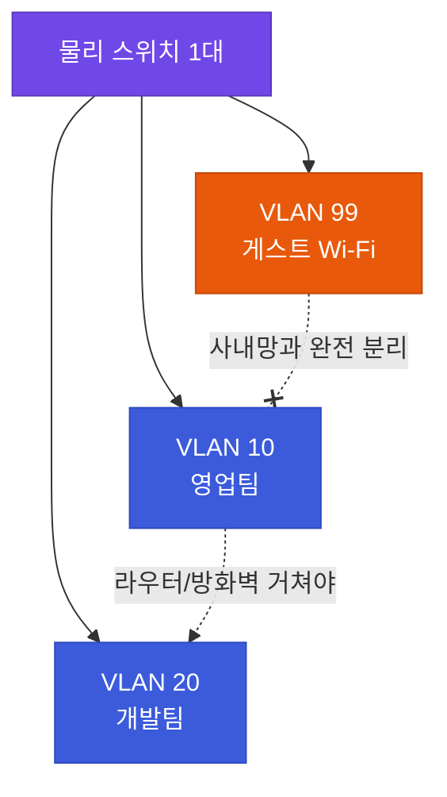

# 강의2 · 라우팅 기본과 스위칭·VLAN (오후, 총 120분)

> **이 교시 한 문장:** 나뉜 네트워크들 **사이를 잇는 라우팅**과, 한 스위치를 **논리적으로 가르는 VLAN**을 배워 망 구성도를 읽습니다.

| 시간 | 소주제 | 핵심 한 줄 |
|------|--------|-----------|
| 00-25분 | 라우팅이란 | 목적지 IP를 보고 다음 길을 정한다 |
| 25-50분 | 정적 vs 동적 라우팅 | 손으로 vs 자동으로 경로 관리 |
| 50-75분 | 스위치와 VLAN | 같은 스위치라도 논리적으로 분리 |
| 75-100분 | 망 구성도 읽기 | 라우터 구간·VLAN 경계 식별 |
| 100-120분 | 실습 안내 | 서브넷 설계 실습으로 |

---

## ⏱️ 00-25분 · 라우팅이란 무엇인가

!!! abstract "이 블록을 마치면"
    ✔ 라우팅 테이블과 다음 홉(hop)을 설명한다 ✔ ==기본 게이트웨이의 역할==을 안다

**라우팅(routing)**은 라우터가 **"목적지 IP를 보고 다음 어디로 넘길지"**를 정하는 일입니다. 그 판단 근거가 **라우팅 테이블(경로표)**입니다.

```text
[라우팅 테이블 예시]
목적지 192.168.20.0/24   → 다음 홉(next hop) 10.0.0.1
기본 경로 0.0.0.0/0       → 인터넷 게이트웨이
```
- **다음 홉(next hop)**: "일단 여기로 넘겨"라는 바로 다음 목적지. 라우터는 전체 길을 다 아는 게 아니라 **"다음 한 걸음"만** 정합니다.
- **기본 경로 `0.0.0.0/0`**: "표에 없는 목적지는 전부 여기로" = **기본 게이트웨이(정문)**.

!!! example "쉬운 비유 — 내비게이션"
    라우터는 목적지 전체 길을 외우지 않습니다. 교차로마다 "이번엔 오른쪽"처럼 **다음 한 번의 방향**만 정하고, 다음 라우터가 또 그다음을 정합니다. 이게 모여 목적지까지 갑니다.

!!! question "확인질문 · 나의 답"
    **Q. 라우팅 테이블에 없는 목적지로 가는 패킷은 기본적으로 어디로 보내질까요?**
    A. **기본 경로(`0.0.0.0/0`) = 기본 게이트웨이**로 보내집니다. "아는 길이 없으면 일단 정문으로 내보낸다"는 규칙입니다. 그래서 대부분의 인터넷행 트래픽이 게이트웨이로 모입니다.

<div class="quiz">
<p class="quiz-q"><span class="tag">퀴즈</span><b>라우팅 테이블에 없는 목적지의 패킷이 기본 게이트웨이로 보내지는 이유로 가장 적절한 것은?</b></p>
<button class="quiz-opt">게이트웨이가 세상의 모든 IP 주소를 외우고 있기 때문</button>
<button class="quiz-opt">기본 게이트웨이가 언제나 가장 빠른 경로이기 때문</button>
<button class="quiz-opt">목적지를 모르는 패킷은 삭제하는 것이 원칙이기 때문</button>
<button class="quiz-opt" data-correct>라우터는 '다음 한 걸음'만 정하는데, 아는 경로가 없으면 일단 정문(기본 경로)으로 내보내 바깥에서 찾게 하기 때문</button>
<div class="quiz-explain"><b>정답: 4번.</b> 라우터는 전체 길을 다 알 필요 없이 "다음 홉"만 정합니다. 모르면 기본 경로로 넘겨 상위 라우터가 이어받습니다. 게이트웨이가 전부 외우는(1번) 것이 아닙니다.</div>
<button class="quiz-retry">다시 풀기</button>
</div>

---

## ⏱️ 25-50분 · 정적 라우팅 vs 동적 라우팅

!!! abstract "이 블록을 마치면"
    ✔ 정적/동적 라우팅의 장단점을 비교한다

| | 정적(static) 라우팅 | 동적(dynamic) 라우팅 |
|---|---|---|
| 누가 | 관리자가 **직접 입력** | 라우터끼리 **자동 교환** |
| 장점 | 단순·예측 가능·안전 | 규모 커도 자동 관리, 장애 시 우회 |
| 단점 | 많아지면 일일이 관리 불가 | 설정 복잡, 자원 소모 |
| 적합 | 작고 안 변하는 망 | 크고 자주 변하는 망 |

!!! example "쉬운 비유"
    정적 = **종이 지도에 길을 직접 그려두기**(안 변하면 편함). 동적 = **실시간 내비**(길 막히면 알아서 우회). 길이 몇 개뿐이면 종이 지도로 충분하지만, 전국망이면 실시간 내비가 필요합니다.

!!! question "확인질문 · 나의 답"
    **Q. 소규모 지사 네트워크와 대형 통신사 백본망, 어느 쪽이 동적 라우팅이 더 필요할까요?**
    A. **대형 통신사 백본망**입니다. 경로가 수없이 많고 자주 바뀌며 장애 시 우회가 필수라, 사람이 일일이 못 넣습니다. 소규모 지사는 경로가 몇 개뿐이라 정적으로 충분합니다.

<div class="quiz">
<p class="quiz-q"><span class="tag">퀴즈</span><b>대형 통신사 백본망이 정적 라우팅보다 동적 라우팅을 쓰는 이유로 가장 적절한 것은?</b></p>
<button class="quiz-opt">동적 라우팅이 정적 라우팅보다 항상 더 안전하기 때문</button>
<button class="quiz-opt" data-correct>경로가 수없이 많고 자주 바뀌며 장애 시 자동 우회가 필요해, 사람이 일일이 손으로 넣을 수 없기 때문</button>
<button class="quiz-opt">정적 라우팅은 대형 장비에서 아예 작동하지 않기 때문</button>
<button class="quiz-opt">동적 라우팅이 IP 주소를 절약해 주기 때문</button>
<div class="quiz-explain"><b>정답: 2번.</b> 규모·변화·장애 대응 때문에 자동 관리가 필수입니다. 동적이 항상 더 안전한 것(1번)도, 정적이 대형에서 안 되는 것(3번)도 아닙니다.</div>
<button class="quiz-retry">다시 풀기</button>
</div>

---

## ⏱️ 50-75분 · 스위치와 VLAN

!!! abstract "이 블록을 마치면"
    ✔ VLAN이 무엇인지, ==보안상 왜 중요한지== 설명한다

### 🔬 깊이 보기 — VLAN 완전정복

**1단계 · 문제 상황**
스위치 하나에 영업팀·개발팀·게스트가 다 꽂혀 있으면, 물리적으로 **같은 네트워크(같은 동네)**입니다. 게스트가 사내 PC를 넘볼 수도 있죠.

**2단계 · VLAN이란**
**VLAN(브이랜, Virtual LAN)**은 **같은 물리 스위치라도 논리적으로 다른 네트워크처럼 갈라놓는** 기술입니다. 선을 새로 깔지 않고 **소프트웨어로 칸막이**를 칩니다.

```text
같은 스위치 안:
  VLAN 10 → 영업팀      ┐
  VLAN 20 → 개발팀      ├ 서로 직접 통신 불가(라우터 거쳐야)
  VLAN 99 → 게스트 Wi-Fi ┘ (사내망과 완전 분리)
```



**3단계 · 비유**
==한 사무실을 파티션(칸막이)으로 나눈 것.== 같은 층에 있어도 칸이 다르면 서로 오갈 수 없고, 오가려면 정해진 문(라우터)을 거쳐야 합니다.

**4단계 · 보안에서 왜 중요**
- 게스트를 사내망과 물리적으로 분리 안 해도 **VLAN만으로 격리**할 수 있습니다.
- VLAN 간 통신은 라우터/방화벽을 거치므로 **거기서 통제·감시**가 가능합니다. → 3과목(접근통제)·6일차(Zero Trust)의 "구획 나누기(마이크로 세그멘테이션)"와 직결됩니다.

!!! question "확인질문 · 나의 답"
    **Q. 게스트 Wi-Fi를 VLAN으로 분리하지 않으면 어떤 보안 위험이 생길까요?**
    A. 게스트(외부인)가 **사내망에 같은 네트워크로 들어와** 내부 PC·서버·공유폴더에 접근을 시도할 수 있습니다. VLAN 99로 분리하면 게스트는 인터넷만 쓰고 사내망엔 닿지 못하게 격리됩니다.

<div class="quiz">
<p class="quiz-q"><span class="tag">퀴즈</span><b>게스트 Wi-Fi를 VLAN으로 분리하면 보안에 도움이 되는 이유로 가장 적절한 것은?</b></p>
<button class="quiz-opt">VLAN이 게스트의 인터넷 속도를 늦춰 공격을 어렵게 하기 때문</button>
<button class="quiz-opt">VLAN이 게스트의 모든 트래픽을 자동으로 암호화하기 때문</button>
<button class="quiz-opt" data-correct>같은 물리 스위치라도 논리적으로 다른 네트워크가 되어, 게스트가 사내망에 직접 접근하지 못하기 때문</button>
<button class="quiz-opt">VLAN이 게스트 기기의 MAC 주소를 숨겨 주기 때문</button>
<div class="quiz-explain"><b>정답: 3번.</b> VLAN은 '논리적 칸막이'라 같은 스위치라도 사내망과 격리합니다. 속도 저하(1번)·암호화(2번)·MAC 은닉(4번)은 VLAN이 하는 일이 아닙니다.</div>
<button class="quiz-retry">다시 풀기</button>
</div>

---

## ⏱️ 75-100분 · 망 구성도에서 라우팅·VLAN 읽기

!!! abstract "이 블록을 마치면"
    ✔ 구성도에서 라우터 구간·VLAN 경계·DMZ를 짚는다

실제 기업 망 구성도(본사–지사, DMZ, 내부망)를 보며 "어디가 라우터 구간이고 어디가 VLAN 경계인지" 읽습니다.

- **본사–지사**: 두 네트워크 사이 → **라우터 구간**
- **내부망**: 팀별 **VLAN**으로 분리
- **DMZ(디엠지, DeMilitarized Zone, "비무장지대")**: 외부에 공개하는 서버(웹·메일)를 두는 **중간 완충 구역**

!!! example "쉬운 비유 — DMZ는 현관 응접실"
    손님을 집 안방까지 들이지 않고 **현관 응접실**에서 맞습니다. 웹서버처럼 외부가 반드시 접근해야 하는 것은 DMZ(응접실)에 두고, 진짜 중요한 내부망(안방)과는 분리합니다.


> 외부(주황)는 DMZ(보라)까지만. 내부망(초록)은 방화벽을 한 번 더 거쳐야 닿습니다.

!!! question "확인질문 · 나의 답"
    **Q. 망 구성도에서 'DMZ'라고 표시된 구간은 왜 내부망과 분리되어 있을까요?**
    A. DMZ에는 **외부에 공개된 서버**가 있어 공격에 노출되기 쉽습니다. 만약 그 서버가 뚫리더라도 ==내부망(안방)까지 바로 넘어가지 못하도록== 사이에 벽(방화벽)을 두고 분리하는 것입니다.

<div class="quiz">
<p class="quiz-q"><span class="tag">퀴즈</span><b>외부에 공개하는 서버(웹·메일)를 내부망이 아니라 DMZ에 두는 이유로 가장 적절한 것은?</b></p>
<button class="quiz-opt">DMZ가 내부망보다 인터넷 속도가 빠르기 때문</button>
<button class="quiz-opt">공개 서버는 IP 주소가 필요 없기 때문</button>
<button class="quiz-opt">DMZ에서는 방화벽을 쓰지 않아도 되기 때문</button>
<button class="quiz-opt" data-correct>공개 서버는 공격에 노출되기 쉬워, 뚫리더라도 내부망까지 바로 넘어가지 못하게 사이에 벽을 두려는 것이기 때문</button>
<div class="quiz-explain"><b>정답: 4번.</b> DMZ는 '현관 응접실'처럼 외부 접근이 필요한 서버를 두되 내부(안방)와 분리해, 침해가 번지는 것을 막는 완충 구역입니다.</div>
<button class="quiz-retry">다시 풀기</button>
</div>

---

## ⏱️ 100-120분 · 정리 & 실습 예고

- **라우팅**: 목적지 IP → 다음 홉. 모르는 목적지는 **기본 게이트웨이**로
- **정적 vs 동적**: 작은 망은 손으로, 큰 망은 자동
- **VLAN**: 같은 스위치를 논리적으로 분리 → 보안 격리의 기본
- **DMZ**: 외부 공개 서버용 완충 구역, 내부망과 분리

**실습 예고:** A사 시나리오로 **직접 서브넷을 설계**하고, 망 구성도에서 라우팅 경로·VLAN 경계를 표시해봅니다. → [실습 페이지](practice.md)

---

## ✅ 가르칠 준비 체크리스트 (강의2)
- [ ] 라우팅 테이블·다음 홉·기본 게이트웨이를 설명한다
- [ ] 정적/동적 라우팅을 비유로 비교한다
- [ ] **VLAN을 4단계(문제→정의→비유→보안)로** 설명한다
- [ ] DMZ가 왜 분리되는지 "응접실" 비유로 설명한다
- [ ] 확인질문 4개에 답한다

*[VLAN]: Virtual LAN — 물리 스위치를 논리적으로 나눈 가상 네트워크
*[DMZ]: DeMilitarized Zone — 외부 공개 서버를 두는 내부망과 분리된 완충 구역
*[IP]: Internet Protocol — 접속 위치를 가리키는 주소
