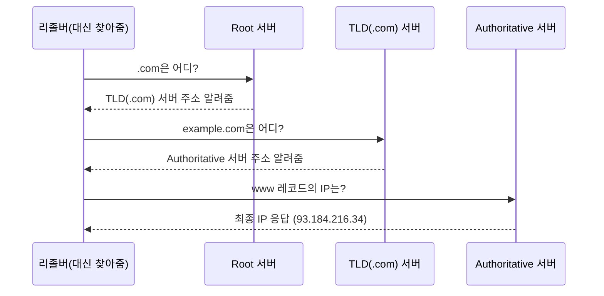

# 강의1 · DNS 개념과 계층구조 (오전, 총 120분)

> **이 교시 한 문장:** `example.com`을 입력하면 어떻게 그 서버의 IP를 찾아오는지, 그 **3층짜리 전화번호부 시스템**을 따라갑니다.

| 시간 | 소주제 | 핵심 한 줄 |
|------|--------|-----------|
| 00-20분 | DNS가 필요한 이유 | 사람은 이름, 컴퓨터는 IP |
| 20-50분 | DNS 계층구조 | Root → TLD → Authoritative |
| 50-80분 | 재귀 질의 vs 반복 질의 | 리졸버가 대신 발품을 판다 |
| 80-105분 | 주요 레코드 타입 | A·AAAA·CNAME·MX·TXT |
| 105-120분 | 정리 | 보안 이슈로 |

## 이 교시에 나오는 어려운 용어
| 용어 (한글발음) | 한 줄 뜻 (아주 쉽게) | 비유 |
|----------------|----------------------|------|
| **DNS(디엔에스)** | 도메인 이름을 IP로 바꿔주는 시스템 | 인터넷 전화번호부 |
| **도메인(domain)** | 사람이 외우는 인터넷 이름(example.com) | 가게 상호 |
| **Root/TLD/Authoritative** | DNS를 위→아래로 3층으로 나눈 서버 계층 | 대표번호 안내 → 지역 안내 → 그 집 |
| **리졸버(resolver, 리졸버)** | 우리 대신 여러 DNS 서버를 오가며 답을 찾아주는 심부름꾼 | 전화번호 대신 찾아주는 비서 |
| **레코드(record)** | DNS에 저장된 항목(A·MX·CNAME 등) | 전화번호부의 한 줄 |
| **TTL(티티엘)** | 그 답을 얼마나 캐싱해둘지 시간 | 유통기한 |
| **DNS Spoofing(스푸핑)** | 가짜 DNS 응답으로 가짜 사이트로 유도 | 전화번호부를 위조 |
| **DGA(디지에이)** | 악성코드가 무작위 도메인을 대량 생성하는 기법 | 매번 바뀌는 대포폰 번호 |

---

## ⏱️ 00-20분 · DNS가 필요한 이유

!!! abstract "이 블록을 마치면"
    ✔ DNS를 "인터넷 전화번호부"로 설명한다

사람은 `example.com` 같은 **이름**을 외우지만, 컴퓨터는 **IP 주소**로만 통신합니다. 이 둘을 이어주는 **번역기**가 **DNS(디엔에스, Domain Name System)**입니다.

!!! example "쉬운 비유 — 전화번호부"
    우리는 "김철수"라는 **이름**은 외워도 그 사람 **전화번호**는 잘 못 외웁니다. 전화번호부가 이름→번호를 찾아주듯, DNS는 도메인 이름 → IP를 찾아줍니다. ==사람은 이름, 컴퓨터는 번호(IP).==

!!! question "확인질문 · 나의 답"
    **Q. DNS가 없다면 웹사이트에 접속할 때마다 무엇을 외우고 있어야 할까요?**
    A. 사이트마다 **IP 주소(예 `93.184.216.34`)를 직접** 외워야 합니다. 도메인 이름 대신 숫자를 외워야 하니 사실상 불가능하죠. DNS가 그 수고를 대신해 줍니다.

퀴즈<b>DNS가 '인터넷의 전화번호부'라고 불리는 이유로 가장 적절한 것은?</b>

<button class="quiz-opt">DNS가 모든 웹사이트의 비밀번호를 보관하기 때문</button>
<button class="quiz-opt" data-correct>사람은 외우기 쉬운 도메인 이름을 쓰지만 컴퓨터는 IP로 통신하므로, 이름↔IP를 이어주기 때문</button>
<button class="quiz-opt">DNS가 전화 통화를 인터넷으로 연결해 주기 때문</button>
<button class="quiz-opt">도메인 이름이 실제 전화번호로 변환되기 때문</button>

<b>정답: 2번.</b> 전화번호부가 이름→번호를 찾아주듯, DNS는 도메인 이름→IP를 찾아줍니다. 비밀번호 보관(1번)이나 전화 연결(3번)과는 무관합니다.

<button class="quiz-retry">다시 풀기</button>

---

## ⏱️ 20-50분 · DNS 계층구조 — Root, TLD, Authoritative

!!! abstract "이 블록을 마치면"
    ✔ 3층 구조를 그리고 조회 순서를 설명한다

DNS는 한 대의 거대한 서버가 아니라, **위에서 아래로 3층**으로 나뉜 서버들의 협업입니다.

- **Root(루트) 서버**: 최상위. "`.com`은 저쪽 TLD 서버에 물어봐"라고 방향만 알려줌
- **TLD(티엘디, Top-Level Domain) 서버**: `.com`·`.kr` 등 꼬리표 담당. "`example.com`은 저쪽 권위 서버야"
- **Authoritative(어써리테이티브, 권위) 서버**: 그 도메인의 **진짜 답(IP)**을 가진 최종 서버

### 🔬 깊이 보기 — `www.example.com` 한 번 찾는 과정

**포인트:** 각 서버는 최종 답을 다 아는 게 아니라, =="다음에 누구에게 물어봐"만 알려줍니다.== 위층에서 아래층으로 좁혀가며 마지막 권위 서버가 진짜 IP를 답합니다.

!!! question "확인질문 · 나의 답"
    **Q. Root 서버가 다운되면 전세계 DNS 조회에 어떤 영향이 있을까요?**
    A. 이론상 새 조회의 출발점이 막혀 큰 혼란이 됩니다. 다만 실제로는 ① Root 서버가 **전 세계에 여러 대로 분산·이중화**되어 있고, ② 많은 답이 **캐싱**되어 있어, 하나 둘 죽어도 바로 인터넷이 멈추진 않습니다. (그래서 Root는 극도로 견고하게 운영됩니다)

퀴즈<b>Root DNS 서버 한두 대가 죽어도 인터넷이 바로 멈추지 않는 이유로 가장 적절한 것은?</b>

<button class="quiz-opt">Root 서버는 사실 조회에 쓰이지 않기 때문</button>
<button class="quiz-opt">각 PC가 Root 서버의 완전한 사본을 갖고 있기 때문</button>
<button class="quiz-opt" data-correct>Root 서버가 전 세계에 여러 대로 분산·이중화돼 있고, 많은 답이 이미 캐싱돼 있기 때문</button>
<button class="quiz-opt">브라우저가 IP를 직접 계산해 내기 때문</button>

<b>정답: 3번.</b> 분산·이중화 + 캐싱 덕분에 일부 장애가 전체 마비로 번지지 않습니다. PC가 Root 사본을 갖는(2번) 것은 아닙니다.

<button class="quiz-retry">다시 풀기</button>

---

## ⏱️ 50-80분 · 재귀 질의 vs 반복 질의

!!! abstract "이 블록을 마치면"
    ✔ 리졸버가 왜 필요한지 설명한다

- **재귀 질의(recursive):** 우리 PC가 **리졸버(resolver)** 한 곳에 "알아서 다 찾아와" 하고 맡기는 방식. 발품은 리졸버가 팝니다.
- **반복 질의(iterative):** 그 리졸버가 Root→TLD→권위 서버를 **차례로 물어보는** 방식(위 다이어그램).

!!! example "쉬운 비유 — 심부름"
    나는 비서(리졸버)에게 "이 사람 번호 좀 찾아줘"라고 **한 번만** 말합니다(재귀). 비서는 안내데스크→지역국→그 집에 **일일이 전화**해 알아옵니다(반복). 나는 중간 과정을 몰라도 됩니다.

!!! tip "실무 팁"
    우리 PC가 쓰는 리졸버 주소가 바로 `8.8.8.8`(구글), `1.1.1.1`(클라우드플레어) 같은 것입니다. 이걸 바꾸면 조회 경로·속도·필터링이 달라져, 장애 대응 때 자주 건드립니다.

!!! question "확인질문 · 나의 답"
    **Q. 우리 PC는 Root, TLD, Authoritative에 각각 직접 물어보지 않는데 그 이유는?**
    A. 그 복잡한 과정을 **리졸버가 대신(재귀 질의)** 해주기 때문입니다. 또 리졸버가 결과를 **캐싱**해 두어, 다음 사람은 훨씬 빠르게 답을 받습니다. 모든 PC가 매번 Root부터 뒤지면 비효율적이고 Root에 부하가 몰립니다.

퀴즈<b>우리 PC가 Root·TLD·Authoritative 서버에 직접 묻지 않고 리졸버에 맡기는 이유로 가장 적절한 것은?</b>

<button class="quiz-opt">PC는 Root 서버의 주소를 전혀 알 수 없기 때문</button>
<button class="quiz-opt">리졸버만 인터넷에 연결돼 있기 때문</button>
<button class="quiz-opt">직접 조회는 법으로 금지돼 있기 때문</button>
<button class="quiz-opt" data-correct>리졸버가 복잡한 조회를 대신 처리하고 결과를 캐싱해, 빠르고 Root 서버의 부하도 줄기 때문</button>

<b>정답: 4번.</b> '비서(리졸버)'에게 한 번 맡기면 발품과 캐싱을 대신해 줍니다. 모든 PC가 매번 Root부터 뒤지면 비효율적이고 부하가 몰립니다.

<button class="quiz-retry">다시 풀기</button>

---

## ⏱️ 80-105분 · 주요 DNS 레코드 타입

!!! abstract "이 블록을 마치면"
    ✔ A·CNAME·MX 레코드의 용도를 구분한다

DNS에 저장된 한 줄 한 줄을 **레코드(record)**라 합니다. 자주 쓰는 것들:

| 레코드 | 용도 | 예 |
|:---:|------|-----|
| **A** | 도메인 → **IPv4** 주소 | `example.com. A 93.184.216.34` |
| **AAAA** | 도메인 → **IPv6** 주소 | (IPv6용 A) |
| **CNAME** | 다른 이름의 **별칭** | `www.example.com. CNAME example.com.` |
| **MX** | 그 도메인의 **메일 서버** | `example.com. MX 10 mail.example.com.` |
| **TXT** | 자유 텍스트(**검증**용) | 도메인 소유 확인·스팸 방지 |

!!! question "확인질문 · 나의 답"
    **Q. www.example.com과 example.com이 같은 곳으로 연결되게 하려면 어떤 레코드를 쓸까요?**
    A. **CNAME**입니다. `www.example.com`을 `example.com`의 **별칭**으로 걸면, IP가 바뀌어도 한 곳(example.com의 A 레코드)만 고치면 둘 다 따라옵니다.

퀴즈<b>www.example.com과 example.com을 같은 곳으로 연결할 때 CNAME이 편리한 이유로 가장 적절한 것은?</b>

<button class="quiz-opt">CNAME이 A 레코드보다 조회 속도가 빠르기 때문</button>
<button class="quiz-opt" data-correct>www를 example.com의 별칭으로 걸어두면, IP가 바뀌어도 한 곳만 고치면 둘 다 따라오기 때문</button>
<button class="quiz-opt">CNAME이 IP 주소를 자동으로 생성해 주기 때문</button>
<button class="quiz-opt">www 주소는 원래 IP를 가질 수 없기 때문</button>

<b>정답: 2번.</b> 별칭(CNAME)으로 묶으면 관리 지점이 하나로 줄어 IP 변경이 쉬워집니다. 속도(1번)나 IP 자동생성(3번)과는 무관합니다.

<button class="quiz-retry">다시 풀기</button>

---

## ⏱️ 105-120분 · 정리 & 오후 예고

- **DNS = 인터넷 전화번호부.** 사람은 이름, 컴퓨터는 IP
- **3층 구조**: Root → TLD → Authoritative, 위에서 아래로 좁혀감
- **재귀 질의**: 리졸버가 대신 발품 + 캐싱
- **레코드**: A(IP)·CNAME(별칭)·MX(메일)·TXT(검증)

**오후 예고:** 이 DNS를 **직접 조회(nslookup/dig)**해보고, 이걸 노린 **DNS 스푸핑·DGA** 같은 공격과 로그 이상징후를 봅니다.

---

## ✅ 가르칠 준비 체크리스트 (강의1)

- [ ] DNS를 "전화번호부"로 설명한다
- [ ] Root→TLD→Authoritative 조회 순서를 화이트보드에 그린다
- [ ] 재귀 질의·반복 질의 차이를 "비서 심부름"으로 설명한다
- [ ] A·CNAME·MX 용도를 구분한다
- [ ] 확인질문 4개에 답한다

*[DNS]: Domain Name System — 도메인 이름을 IP로 바꾸는 시스템
*[TLD]: Top-Level Domain — .com·.kr 등 최상위 도메인
*[IP]: Internet Protocol — 접속 위치를 가리키는 주소
*[TTL]: Time To Live — 캐싱을 유지하는 시간
