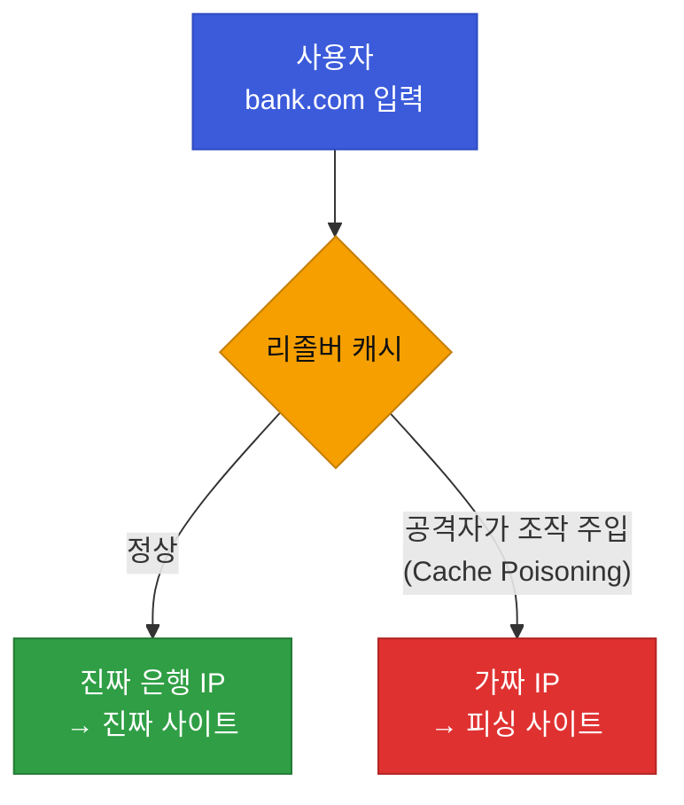

# 강의2 · DNS 동작 실습과 보안 이슈 (오후, 총 120분)

> **이 교시 한 문장:** DNS를 직접 조회해 보고, 그것을 노린 공격(스푸핑·DGA)과 로그 이상징후를 식별하는 눈을 기릅니다.

| 시간 | 소주제 | 핵심 한 줄 |
|------|--------|-----------|
| 00-25분 | nslookup/dig 실습 | 명령어로 DNS를 직접 조회 |
| 25-50분 | DNS 캐싱과 TTL | 변경이 즉시 반영 안 되는 이유 |
| 50-80분 | DNS Spoofing/Cache Poisoning | 가짜 응답으로 가짜 사이트 유도 |
| 80-105분 | DNS 로그 이상징후(DGA) | 무작위 도메인 대량 조회 |
| 105-120분 | 실습 안내 | 이상징후 식별 실습으로 |

---

## ⏱️ 00-25분 · nslookup / dig 명령어 실습

!!! abstract "이 블록을 마치면"
    ✔ 명령어로 A·MX 레코드를 조회하고 조회 경로를 본다

DNS는 명령어로 직접 물어볼 수 있습니다.

```text
# 윈도우
nslookup example.com            # 기본: A 레코드(IP)
nslookup -type=MX example.com   # 메일 서버

# macOS / 리눅스
dig example.com                 # A 레코드
dig example.com MX              # 메일 서버
dig +trace example.com          # Root부터 전체 경로 추적
```

!!! tip "실무 팁 — dig +trace"
    `dig +trace`는 리졸버 캐시를 무시하고 ==Root → TLD → Authoritative== 전체 경로를 한 단계씩 보여줍니다. 오전에 배운 3층 구조가 **화면에 실제로** 찍혀 나와, 강의 중 시연하면 이해가 확 옵니다.

!!! question "확인질문 · 나의 답"
    **Q. `dig +trace` 명령은 무엇을 보여줄까요?**
    A. 도메인 하나를 찾는 **전체 조회 경로**를 Root 서버부터 TLD, Authoritative까지 **단계별로** 보여줍니다. "어디서 어디로 물어가며 IP를 찾는지" 눈으로 확인하는 도구입니다.

<div class="quiz">
<p class="quiz-q"><span class="tag">퀴즈</span><b><code>dig +trace</code>가 DNS 구조를 이해하는 데 유용한 이유로 가장 적절한 것은?</b></p>
<button class="quiz-opt">도메인의 관리자 비밀번호를 함께 보여주기 때문</button>
<button class="quiz-opt">조회 속도를 두 배로 높여 주기 때문</button>
<button class="quiz-opt" data-correct>리졸버 캐시를 무시하고 Root→TLD→Authoritative 전체 조회 경로를 단계별로 보여주기 때문</button>
<button class="quiz-opt">가짜 DNS 응답을 자동으로 차단해 주기 때문</button>
<div class="quiz-explain"><b>정답: 3번.</b> 오전에 배운 3층 구조가 실제로 화면에 단계별로 찍혀 나옵니다. 비밀번호(1번)·차단(4번) 기능은 없습니다.</div>
<button class="quiz-retry">다시 풀기</button>
</div>

---

## ⏱️ 25-50분 · DNS 캐싱과 TTL

!!! abstract "이 블록을 마치면"
    ✔ 변경한 DNS가 즉시 반영 안 되는 이유(전파 지연)를 설명한다

DNS 응답에는 **TTL(티티엘)**이 붙어 있어, 그 시간 동안 **캐싱(임시 저장)**됩니다. 그래서 같은 조회를 반복하면 빠르지만, **레코드를 바꿔도 전 세계에 즉시 반영되지 않습니다.**

!!! example "쉬운 비유 — 유통기한"
    한 번 받은 답을 TTL(유통기한) 동안 냉장고에 넣어두고 재사용합니다. 원본이 바뀌어도, ==냉장고에 있는 예전 답이 상하기(만료) 전까지는 옛날 걸 씁니다.==

!!! question "확인질문 · 나의 답"
    **Q. 회사 웹사이트의 IP를 변경했는데 일부 사용자에게는 여전히 예전 사이트가 보인다면, 원인은?**
    A. 그 사용자(또는 그들의 리졸버)에 **예전 IP가 아직 캐싱**되어 있고, **TTL이 만료되지 않아** 옛 답을 계속 쓰기 때문입니다. 이 **전파 지연** 때문에 IP 변경은 보통 TTL을 미리 줄여두고 진행합니다.

<div class="quiz">
<p class="quiz-q"><span class="tag">퀴즈</span><b>웹사이트 IP를 바꿨는데 일부 사용자에게는 옛 사이트가 계속 보이는 이유로 가장 적절한 것은?</b></p>
<button class="quiz-opt">새 IP가 아직 만들어지지 않았기 때문</button>
<button class="quiz-opt" data-correct>그 사용자/리졸버에 예전 IP가 캐싱돼 있고 TTL이 아직 안 끝나, 옛 답을 계속 쓰기 때문</button>
<button class="quiz-opt">브라우저가 옛 사이트를 더 선호하기 때문</button>
<button class="quiz-opt">DNS는 원래 IP 변경을 지원하지 않기 때문</button>
<div class="quiz-explain"><b>정답: 2번.</b> 캐싱 + TTL 때문에 변경이 전 세계에 즉시 반영되지 않습니다(전파 지연). 그래서 IP 변경 전 TTL을 미리 줄여둡니다.</div>
<button class="quiz-retry">다시 풀기</button>
</div>

---

## ⏱️ 50-80분 · DNS Spoofing / Cache Poisoning

!!! abstract "이 블록을 마치면"
    ✔ 가짜 DNS 응답으로 가짜 사이트에 유도되는 원리를 설명한다

### 🔬 깊이 보기 — DNS Spoofing이 위험한 이유

**1단계 · 정상 상황**
사용자가 `bank.com`을 치면 DNS가 **진짜 은행 IP**를 돌려줘 진짜 사이트로 갑니다.

**2단계 · 공격**
공격자가 **조작된 DNS 응답**을 리졸버 **캐시에 몰래 주입(Cache Poisoning, 캐시 포이즈닝)**합니다. 그러면 `bank.com` → **가짜 서버 IP**로 답하게 됩니다.



**3단계 · 결과**
사용자는 주소창에 **정확히 `bank.com`을 쳤는데도** 가짜 피싱 사이트로 갑니다. 주소는 맞으니 **눈으로 알아채기 어렵습니다.** ==이게 DNS 공격이 무서운 이유입니다.==

**4단계 · 4과목과의 연결**
이 "정상 도메인인데 엉뚱한 IP" 패턴은 4과목(이상탐지)의 **비인가 접근·이상행위** 탐지 대상입니다. 오늘은 개념까지, 탐지는 4과목에서.

!!! question "확인질문 · 나의 답"
    **Q. 은행 사이트 도메인을 입력했는데 이상한 페이지가 뜬다면, DNS 관점에서 무엇을 의심할 수 있을까요?**
    A. **DNS 스푸핑 / 캐시 포이즈닝**을 의심합니다. 도메인은 정상인데 조작된 DNS 응답 때문에 **가짜 IP로 연결**되었을 수 있습니다. (HTTPS 인증서 경고가 함께 뜨는지도 확인 포인트)

<div class="quiz">
<p class="quiz-q"><span class="tag">퀴즈</span><b>주소창에 정확히 <code>bank.com</code>을 쳤는데 가짜 사이트가 뜰 때, DNS 스푸핑을 의심하는 근거로 가장 타당한 것은?</b></p>
<button class="quiz-opt">도메인 이름을 잘못 입력했을 것이 분명하기 때문</button>
<button class="quiz-opt">은행 사이트는 원래 주소가 자주 바뀌기 때문</button>
<button class="quiz-opt" data-correct>도메인은 정상인데 조작된 DNS 응답 때문에 가짜 IP로 연결됐을 수 있기 때문</button>
<button class="quiz-opt">HTTPS는 주소를 전혀 검증하지 않기 때문</button>
<div class="quiz-explain"><b>정답: 3번.</b> "주소는 맞는데 엉뚱한 곳" = DNS 단계에서 IP가 조작됐을 가능성입니다. 오타(1번)가 아니라는 전제이고, HTTPS 인증서 경고가 함께 뜨는지도 단서가 됩니다.</div>
<button class="quiz-retry">다시 풀기</button>
</div>

---

## ⏱️ 80-105분 · DNS 로그에서 이상징후 찾기 (DGA)

!!! abstract "이 블록을 마치면"
    ✔ 로그에서 DGA 스타일 도메인을 골라내는 기준을 세운다

악성코드는 종종 **무작위 문자열 도메인을 대량 생성**해 공격자 서버(C2)와 몰래 통신합니다. 이 기법을 **DGA(디지에이, Domain Generation Algorithm)**라 합니다.

```text
정상 조회 : naver.com, google.com, daum.net ...
의심 조회 : xjk3f9as0.com, q83nfoa2.net, zp1v9wqx.org ...  ← 사람이 안 만드는 이름
```

**로그에서 볼 특징**

- 사람이 읽을 수 없는 **무작위 문자열** 도메인
- 짧은 시간에 **대량**으로 조회
- 대부분 **실패(NXDOMAIN)**하다가 가끔 하나 성공(진짜 C2)

!!! example "쉬운 비유 — 매번 바뀌는 대포폰"
    공격자 서버 주소를 고정하면 차단당하니, ==매번 새 도메인(대포폰 번호)을 자동 생성==해 숨바꼭질을 합니다. 그래서 "사람이 안 지을 이름을 대량으로 조회"하면 감염을 의심합니다.

!!! question "확인질문 · 나의 답"
    **Q. 무작위 문자열 도메인을 짧은 시간에 대량 조회하는 PC가 있다면 무엇을 의심할까요?**
    A. **악성코드 감염(DGA를 통한 C2 통신)**을 의심합니다. 정상 사용자는 사람이 읽는 도메인을 이따금 조회하지, 무작위 문자열을 초당 수십 개씩 조회하지 않습니다. 해당 PC를 격리하고 조사 대상에 올립니다.

<div class="quiz">
<p class="quiz-q"><span class="tag">퀴즈</span><b>무작위 문자열 도메인을 짧은 시간에 대량 조회하는 PC를 악성코드 감염으로 의심하는 근거로 가장 타당한 것은?</b></p>
<button class="quiz-opt">무작위 도메인은 항상 존재하지 않는 주소이기 때문</button>
<button class="quiz-opt">대량 조회는 인터넷 속도를 높여 주기 때문</button>
<button class="quiz-opt">도메인이 길수록 더 안전하기 때문</button>
<button class="quiz-opt" data-correct>정상 사용자는 사람이 읽는 도메인을 이따금 조회할 뿐, 무작위 문자열을 초당 수십 개씩 조회하지 않기 때문</button>
<div class="quiz-explain"><b>정답: 4번.</b> DGA는 공격자 서버 주소를 계속 바꾸려고 무작위 도메인을 대량 생성합니다. "사람이 안 지을 이름을 대량 조회"가 감염 신호입니다.</div>
<button class="quiz-retry">다시 풀기</button>
</div>

---

## ⏱️ 105-120분 · 정리 & 실습 예고

- **nslookup/dig**: DNS를 직접 조회, `dig +trace`로 전체 경로 확인
- **캐싱·TTL**: 변경이 즉시 반영 안 되는 전파 지연의 원인
- **DNS 스푸핑**: 주소는 맞는데 가짜 사이트 → 눈치채기 어려움
- **DGA**: 무작위 도메인 대량 조회 = 악성코드 의심 신호

**실습 예고:** 여러 도메인을 직접 조회하고, **DNS 로그 샘플에서 정상 vs DGA 스타일을 골라내는** 실습을 합니다. → [실습 페이지](practice.md)

---

## ✅ 가르칠 준비 체크리스트 (강의2)

- [ ] `nslookup`/`dig`로 A·MX를 조회하고 `dig +trace`를 시연한다
- [ ] TTL·캐싱으로 "전파 지연"을 설명한다
- [ ] **DNS 스푸핑을 4단계**(정상→공격→결과→탐지연결)로 설명한다
- [ ] DGA 스타일 도메인의 특징 3가지를 든다
- [ ] 확인질문 4개에 답한다

*[DNS]: Domain Name System — 도메인 이름을 IP로 바꾸는 시스템
*[TTL]: Time To Live — 캐싱을 유지하는 시간
*[DGA]: Domain Generation Algorithm — 악성코드가 무작위 도메인을 대량 생성하는 기법
*[C2]: Command and Control — 공격자가 감염 PC를 원격 조종하는 서버
*[IP]: Internet Protocol — 접속 위치를 가리키는 주소
