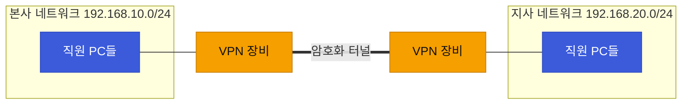
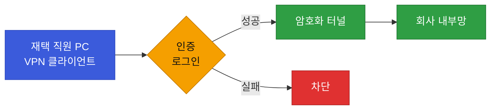

# 강의1 · VPN 개념과 종류 (오전, 총 120분)

> **이 교시 한 문장:** 위험한 공용 인터넷 위에 **암호화된 터널**을 놓아 사설망처럼 쓰는 VPN을, 두 종류로 나눠 이해합니다.

| 시간 | 소주제 | 핵심 한 줄 |
|------|--------|-----------|
| 00-20분 | VPN이 필요한 이유 | 공용망 위에 안전한 터널 |
| 20-50분 | Site-to-Site VPN | 네트워크↔네트워크 통째 연결 |
| 50-80분 | Remote Access VPN | 개인 PC → 회사망 접속 |
| 80-105분 | VPN과 Zero Trust(예고) | "터널 안=신뢰"의 한계 |
| 105-120분 | 정리 | 방화벽으로 |

## 이 교시에 나오는 어려운 용어
| 용어 (한글발음) | 한 줄 뜻 (아주 쉽게) | 비유 |
|----------------|----------------------|------|
| **VPN(브이피엔)** | 공용 인터넷 위에 만든 암호화된 전용 통로 | 공공도로 위 전용 지하터널 |
| **터널(tunnel)** | 데이터를 감싸 남이 못 보게 하는 통로 | 밀봉된 택배 컨테이너 |
| **Site-to-Site(사이트투사이트)** | 네트워크↔네트워크를 통째로 연결 | 본사–지사 전용선 |
| **Remote Access(리모트 액세스)** | 개인 PC → 회사망 접속 | 집에서 회사 금고 열쇠 |
| **방화벽(firewall)** | 규칙대로 트래픽을 허용/차단하는 문지기 | 건물 출입 통제 |
| **Allow/Deny(얼로우/디나이)** | 허용 / 차단 | 통과 / 막기 |
| **화이트리스트(whitelist)** | 다 막고 **필요한 것만** 허용 | 예약자만 입장 |
| **블랙리스트(blacklist)** | 다 열고 **위험한 것만** 차단 | 블랙리스트만 입장 거부 |

---

## ⏱️ 00-20분 · VPN이 필요한 이유

!!! abstract "이 블록을 마치면"
    ✔ VPN을 "암호화 터널"로 설명한다 ✔ ==공용망 통신의 위험==을 안다

**VPN(브이피엔, Virtual Private Network)**은 아무나 지나다니는 **공용 인터넷** 위에, 남이 들여다볼 수 없는 **암호화된 통로(터널)**를 만들어 마치 사설 전용망처럼 통신하게 해줍니다.

!!! example "쉬운 비유 — 공공도로 위 지하터널"
    데이터가 공공도로(인터넷)를 그냥 다니면 옆 차가 내용을 훔쳐볼 수 있습니다. VPN은 그 위에 ==나만 아는 밀봉 터널==을 뚫어, 그 안으로만 다니게 합니다. 밖에서는 터널 안에 뭐가 지나는지 못 봅니다.

!!! question "확인질문 · 나의 답"
    **Q. 재택근무자가 회사 내부 시스템에 VPN 없이 접속하면 어떤 위험이 있을까요?**
    A. 아이디·비밀번호·업무 데이터가 **암호화되지 않은 채** 공용 인터넷(특히 카페 와이파이 등)을 지나, 중간에서 **도청·가로채기(스니핑)**당할 수 있습니다. VPN 터널로 감싸면 가로채도 내용을 못 봅니다.

퀴즈<b>재택근무자가 VPN 없이 회사 시스템에 접속하면 위험한 이유로 가장 적절한 것은?</b>

<button class="quiz-opt">회사 서버가 재택 IP를 자동으로 차단하기 때문</button>
<button class="quiz-opt" data-correct>아이디·데이터가 암호화되지 않은 채 공용망을 지나, 중간에서 도청·가로채기당할 수 있기 때문</button>
<button class="quiz-opt">VPN 없이는 인터넷 자체가 되지 않기 때문</button>
<button class="quiz-opt">재택 PC가 자동으로 느려지기 때문</button>

<b>정답: 2번.</b> 공용망(특히 카페 와이파이)에서는 암호화 없이 오가는 데이터가 스니핑될 수 있습니다. VPN 터널이 그 내용을 감싸 보호합니다.

<button class="quiz-retry">다시 풀기</button>

---

## ⏱️ 20-50분 · Site-to-Site VPN

!!! abstract "이 블록을 마치면"
    ✔ Site-to-Site가 무엇과 무엇을 잇는지 안다

**Site-to-Site(사이트투사이트) VPN**은 **본사–지사처럼 네트워크와 네트워크를 통째로** 잇습니다. 각 지점의 VPN 장비끼리 터널을 맺어, 두 네트워크가 하나처럼 통신합니다.

직원들은 VPN을 **의식하지 않습니다.** 장비끼리 터널을 유지하므로, 지사 직원이 본사 서버에 그냥 접속하면 알아서 터널을 타고 갑니다.

!!! question "확인질문 · 나의 답"
    **Q. Site-to-Site VPN은 개별 직원이 아니라 무엇과 무엇을 연결하는 걸까요?**
    A. **네트워크와 네트워크**(예: 본사망 ↔ 지사망)를 통째로 연결합니다. 개인이 프로그램을 켜는 게 아니라, 양쪽 **VPN 장비(게이트웨이)**가 상시 터널을 유지합니다.

퀴즈<b>Site-to-Site VPN에서 직원들이 VPN을 '의식하지 않고' 쓸 수 있는 이유로 가장 적절한 것은?</b>

<button class="quiz-opt">직원 PC마다 VPN 클라이언트가 미리 설치돼 있기 때문</button>
<button class="quiz-opt">Site-to-Site는 암호화를 하지 않아 설정이 필요 없기 때문</button>
<button class="quiz-opt" data-correct>양쪽 VPN 장비가 상시 터널을 유지해, 직원은 그냥 접속하면 자동으로 터널을 타기 때문</button>
<button class="quiz-opt">지사에서는 인터넷이 필요 없기 때문</button>

<b>정답: 3번.</b> 개인이 클라이언트를 켜는 Remote Access와 달리, Site-to-Site는 장비끼리 터널을 상시 유지하므로 직원은 신경 쓸 필요가 없습니다.

<button class="quiz-retry">다시 풀기</button>

---

## ⏱️ 50-80분 · Remote Access VPN

!!! abstract "이 블록을 마치면"
    ✔ Remote Access가 누구를 위한 것인지 안다

**Remote Access(리모트 액세스) VPN**은 **개별 사용자**가 자기 PC/노트북에서 회사망으로 들어오는 방식입니다. VPN **클라이언트 프로그램**을 켜고 **인증(로그인)**을 거쳐 터널을 맺습니다.

### 🔬 깊이 보기 — 두 VPN, 한눈에 비교

| | Site-to-Site | Remote Access |
|---|---|---|
| 연결 대상 | 네트워크 ↔ 네트워크 | 개인 PC → 회사망 |
| 누가 설치 | 관리자(장비에) | 사용자(내 PC에 클라이언트) |
| 켜는 주체 | 장비가 상시 유지 | 사용자가 필요할 때 접속 |
| 대표 상황 | 본사–지사 상시 연결 | 재택·출장 직원 접속 |
| 비유 | 두 건물을 잇는 전용 구름다리 | 집에서 회사 금고 여는 열쇠 |

!!! question "확인질문 · 나의 답"
    **Q. Site-to-Site와 Remote Access 중, 재택근무자 개인에게 필요한 것은?**
    A. **Remote Access VPN**입니다. 개인이 자기 PC에서 클라이언트를 켜고 인증해 회사망에 들어옵니다. Site-to-Site는 지점 전체를 잇는 것이라 개인용이 아닙니다.

퀴즈<b>재택근무자 개인에게 Site-to-Site가 아니라 Remote Access VPN이 맞는 이유로 가장 적절한 것은?</b>

<button class="quiz-opt">Remote Access가 Site-to-Site보다 항상 더 빠르기 때문</button>
<button class="quiz-opt">Site-to-Site는 재택 환경에서 아예 작동하지 않기 때문</button>
<button class="quiz-opt">개인은 공인 IP를 가질 수 없기 때문</button>
<button class="quiz-opt" data-correct>개인이 자기 PC에서 클라이언트를 켜고 인증해 접속하는 방식이라 '개인 단위' 연결에 맞기 때문</button>

<b>정답: 4번.</b> Site-to-Site는 '네트워크끼리'를 잇는 것이라 지점 전체용입니다. 개인 재택은 클라이언트+인증으로 접속하는 Remote Access가 적합합니다.

<button class="quiz-retry">다시 풀기</button>

---

## ⏱️ 80-105분 · VPN과 Zero Trust의 관계 (예고)

!!! abstract "이 블록을 마치면"
    ✔ ==전통 VPN의 한계(터널 안=신뢰)==를 설명한다

전통적 VPN에는 큰 맹점이 있습니다. **"일단 터널 안에 들어오면 신뢰한다"**는 것입니다. 즉 VPN으로 접속만 하면 내부에서 **여기저기 자원에 접근**할 수 있습니다.

!!! warning "여기서 6일차(Zero Trust)가 시작됩니다"
    문 하나(VPN)만 통과하면 집 안 모든 방을 열 수 있는 셈입니다. 만약 그 계정이 **탈취**되면? 공격자가 내부를 자유롭게 돌아다닙니다(**측면 이동, lateral movement**). 이 "경계만 지키면 끝"이라는 모델의 한계가 ==Zero Trust("아무도 기본 신뢰하지 않고 매번 검증")==가 나온 배경입니다. 6일차에서 본격적으로 다룹니다.

!!! question "확인질문 · 나의 답"
    **Q. VPN에 접속한 사람이 내부에서 아무 자원이나 접근할 수 있다면 어떤 위험이 있을까요?**
    A. 계정 하나만 탈취되면 공격자가 **내부를 자유롭게 이동(측면 이동)**하며 민감 자원에 접근할 수 있습니다. "터널 안이면 신뢰"라 내부에서의 추가 검증이 없기 때문입니다. → 그래서 자원마다 매번 검증하는 Zero Trust가 필요합니다.

퀴즈<b>전통 VPN의 "터널 안에 들어오면 신뢰" 방식이 위험한 이유로 가장 적절한 것은?</b>

<button class="quiz-opt">터널이 느려져 업무가 지연되기 때문</button>
<button class="quiz-opt">VPN이 자주 끊기기 때문</button>
<button class="quiz-opt">암호화가 너무 강해 접속이 어렵기 때문</button>
<button class="quiz-opt" data-correct>계정 하나만 탈취되면 내부에서 추가 검증이 없어, 공격자가 자유롭게 이동(측면 이동)할 수 있기 때문</button>

<b>정답: 4번.</b> 문 하나(VPN)만 통과하면 내부 전체에 접근되는 구조라, 계정 탈취 시 피해가 커집니다. 이 한계가 Zero Trust(매번 검증)의 등장 배경입니다.

<button class="quiz-retry">다시 풀기</button>

---

## ⏱️ 105-120분 · 정리 & 오후 예고

- **VPN**: 공용망 위 **암호화 터널** → 안전하게 사설망처럼
- **Site-to-Site**: 네트워크↔네트워크(본사–지사), 장비가 상시
- **Remote Access**: 개인 PC→회사망(재택), 사용자가 접속
- **한계**: "터널 안=신뢰" → Zero Trust 등장 배경(6일차)

**오후 예고:** VPN이 "안전한 통로"라면, **방화벽**은 "누구를 통과시킬지 규칙으로 거르는 문지기"입니다. 오후에 룰 설계를 배웁니다.

---

## ✅ 가르칠 준비 체크리스트 (강의1)

- [ ] VPN을 "공용도로 위 밀봉 터널"로 설명한다
- [ ] Site-to-Site vs Remote Access를 표로 비교한다
- [ ] 재택근무자에게 필요한 VPN 종류를 답한다
- [ ] **"터널 안=신뢰"의 한계와 측면 이동**을 설명한다(Zero Trust 예고)
- [ ] 확인질문 4개에 답한다

*[VPN]: Virtual Private Network — 공용망 위에 만든 암호화된 사설 통로
*[IP]: Internet Protocol — 접속 위치를 가리키는 주소
