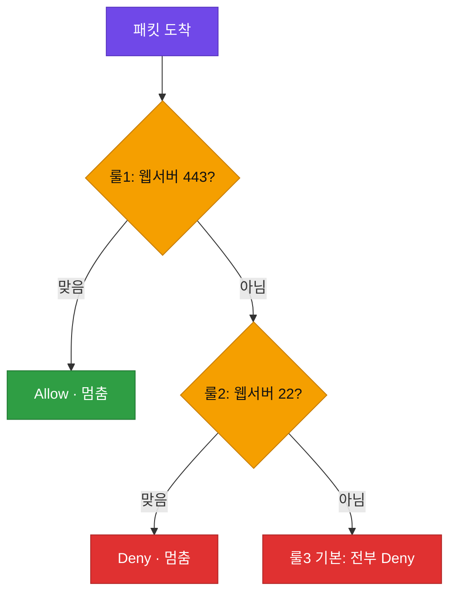

# 강의2 · 방화벽 기본 개념과 정책 설계 (오후, 총 120분)

> **이 교시 한 문장:** 트래픽을 규칙으로 허용/차단하는 **방화벽**을 배우고, "최소권한(화이트리스트)" 원칙으로 룰셋을 설계합니다.

| 시간 | 소주제 | 핵심 한 줄 |
|------|--------|-----------|
| 00-25분 | 방화벽이란 | 규칙대로 Allow/Deny 하는 문지기 |
| 25-55분 | 룰 구성 요소 | 5요소 + 순서(위→아래)가 중요 |
| 55-85분 | 화이트리스트 vs 블랙리스트 | 다 막고 허용 vs 다 열고 차단 |
| 85-110분 | 정책 설계 시연 | 웹443·DB내부·관리자SSH |
| 110-120분 | 실습 안내 | 룰셋 설계 실습으로 |

## 이 교시에 나오는 어려운 용어

| 용어 (한글발음) | 한 줄 뜻 (아주 쉽게) | 비유 |
|----------------|----------------------|------|
| **방화벽(firewall)** | 규칙대로 트래픽을 허용·차단하는 문지기 | 건물 출입 통제 |
| **룰(rule, 룰)** | 방화벽의 규칙 한 줄 | 출입 규정 한 항목 |
| **Allow(얼로우)** | 통과시킴 | 통과 도장 |
| **Deny(디나이)** | 막음 | 차단 도장 |
| **출발지/목적지 IP** | 어디서 어디로 가는지 | 보내는 곳/받는 곳 |
| **포트(port, 포트)** | 어떤 서비스인지 나타내는 번호 | 건물 안 호실 |
| **프로토콜(protocol)** | TCP·UDP 등 통신 방식 | 배송 방법 |
| **룰 순서(order)** | 위에서부터 적용, 처음 맞으면 멈춤 | 먼저 걸리는 규정 |
| **기본 차단(Deny all)** | 나머지는 전부 막는 마지막 규칙 | "그 외 출입 금지" |
| **화이트리스트(whitelist)** | 다 막고 필요한 것만 허용 | 예약자만 입장 |
| **블랙리스트(blacklist)** | 다 열고 위험한 것만 차단 | 블랙리스트만 거부 |
| **최소권한(least privilege)** | 꼭 필요한 만큼만 허용 | 필요한 열쇠만 |
| **SSH(에스에스에이치, 22번)** | 서버 원격 접속 방식 | 원격 조종 |

---

## ⏱️ 00-25분 · 방화벽이란 무엇인가

!!! abstract "이 블록을 마치면"
    ✔ 방화벽을 "규칙 기반 문지기"로 설명한다

**방화벽(firewall)**은 정해진 **규칙(룰)**에 따라 트래픽을 **허용(Allow)**하거나 **차단(Deny)**하는 장비/소프트웨어입니다.

!!! example "쉬운 비유 — 건물 출입 통제"
    로비 경비원이 출입증 규칙에 따라 사람을 들이거나 막듯, 방화벽은 트래픽의 출발지·목적지·포트를 보고 ==통과시킬지 막을지== 결정합니다.

!!! question "확인질문"
    **Q. 방화벽 규칙이 하나도 없다면(모두 허용) 어떤 위험이 있을까요?**

    **A.** 누구나, 어떤 문(포트)으로든 내부에 들어올 수 있어 **사실상 무방비**입니다. 공격자가 열린 문을 찾아 서버·DB에 바로 접근하거나 약점을 노릴 수 있어요. 그래서 "필요한 것만 열고 나머지는 다 막는다"가 기본입니다.

<div class="quiz">
<p class="quiz-q"><span class="tag">퀴즈</span><b>방화벽에 규칙이 하나도 없어 '모두 허용' 상태이면 위험한 이유로 가장 적절한 것은?</b></p>
<button class="quiz-opt">규칙이 없으면 방화벽 장비가 꺼지기 때문</button>
<button class="quiz-opt">트래픽이 전체적으로 느려지기 때문</button>
<button class="quiz-opt" data-correct>누구나 어떤 포트로든 내부에 접근할 수 있어, 공격자가 열린 포트를 찾아 서버·DB에 바로 침투할 수 있기 때문</button>
<button class="quiz-opt">로그가 전혀 남지 않기 때문</button>
<div class="quiz-explain"><b>정답: 3번.</b> "모두 허용"은 문을 다 열어둔 것과 같아 무방비입니다. 그래서 "필요한 것만 열고 나머지는 막는다(화이트리스트)"가 기본 원칙입니다.</div>
<button class="quiz-retry">다시 풀기</button>
</div>

---

## ⏱️ 25-55분 · 방화벽 규칙 구성 요소

!!! abstract "이 블록을 마치면"
    ✔ 룰 5요소를 안다 ✔ ==룰 순서(위→아래)가 왜 중요한지== 설명한다

방화벽 룰은 보통 **5가지**로 이뤄집니다.

| 요소 | 뜻 | 예 |
|------|-----|-----|
| 출발지 IP | 누가 보냈나 | `any`, `192.168.10.5` |
| 목적지 IP | 어디로 | `웹서버` |
| 포트 | 어떤 서비스 | `443`, `22` |
| 프로토콜 | TCP/UDP | `TCP` |
| 액션 | 허용/차단 | `Allow`/`Deny` |

### 🔬 깊이 보기 — 룰은 "위에서 아래로" 순서대로 적용된다

방화벽은 룰을 **맨 위부터 하나씩 대조**하다가, **처음 들어맞는 룰에서 멈추고** 그 액션을 실행합니다. 그래서 **순서가 결과를 바꿉니다.**

```text
룰1: 출발지 any → 목적지 웹서버, 포트 443, Allow
룰2: 출발지 any → 목적지 웹서버, 포트 22,  Deny
룰3(기본): 출발지 any → 목적지 any,        Deny   ← 맨 아래 "나머지 전부 차단"
```

**적용 예시**

- 웹서버 443 요청 → 룰1에서 **Allow**(멈춤)
- 웹서버 22 요청 → 룰1 안 맞음 → 룰2에서 **Deny**(멈춤)
- 그 외 모든 것 → 룰3 **Deny**


> 위에서부터 대조하다 ==처음 들어맞는 룰에서 멈춥니다.==

!!! warning "가장 흔한 실수 — 기본 차단 룰을 맨 위에 두기"
    만약 룰3(전부 Deny)을 맨 위에 두면? ==그 아래 Allow 룰은 영영 도달하지 못해== 모든 게 막힙니다. **구체적인 룰을 먼저, 광범위한 기본 차단을 맨 마지막에** 두는 게 철칙입니다.

!!! question "확인질문"
    **Q. 룰1(443 Allow)과 룰2(22 Deny)의 순서를 바꾸면 결과가 달라질까요?**

    **A.** **이 경우엔 안 달라집니다** — 두 규칙이 443번과 22번, 서로 다른 문이라 겹치지 않거든요. 하지만 만약 한 규칙이 "웹서버 전체 차단"처럼 **범위가 겹치면**, 위에 있는 규칙이 먼저 적용돼 결과가 완전히 달라집니다. 그래서 **겹치는 규칙의 순서**가 중요합니다.

<div class="quiz">
<p class="quiz-q"><span class="tag">퀴즈</span><b>방화벽 룰에서 '순서'가 결과를 좌우하는 이유로 가장 적절한 것은?</b></p>
<button class="quiz-opt">룰은 개수가 많을수록 더 안전해지기 때문</button>
<button class="quiz-opt" data-correct>룰을 위에서부터 대조하다 처음 맞는 룰에서 멈추므로, 범위가 겹치는 룰은 위에 있는 것이 결과를 결정하기 때문</button>
<button class="quiz-opt">방화벽은 아래 룰부터 먼저 읽기 때문</button>
<button class="quiz-opt">순서를 바꾸면 방화벽이 재시작되기 때문</button>
<div class="quiz-explain"><b>정답: 2번.</b> "처음 맞는 룰에서 멈춤"이 핵심입니다. 그래서 기본 차단(Deny all)을 맨 위에 두면 아래 허용 룰이 무력화됩니다. 위→아래 순서로 읽습니다(3번 틀림).</div>
<button class="quiz-retry">다시 풀기</button>
</div>

---

## ⏱️ 55-85분 · 화이트리스트 vs 블랙리스트

!!! abstract "이 블록을 마치면"
    ✔ 두 정책을 비교하고 왜 화이트리스트가 안전한지 안다

| | 화이트리스트(whitelist) | 블랙리스트(blacklist) |
|---|---|---|
| 기본 태도 | **다 막고** 필요한 것만 허용 | **다 열고** 위험한 것만 차단 |
| 별칭 | 최소권한(least privilege) | — |
| 장점 | 안전(모르는 건 막힘) | 편함(일단 됨) |
| 약점 | 필요한 걸 일일이 열어야 | ==모르는 새 공격은 못 막음== |

!!! example "쉬운 비유"
    화이트리스트 = **예약자 명단에 있는 사람만** 입장(나머지 전부 거부). 블랙리스트 = **블랙리스트에 오른 사람만** 거부(나머지 전부 입장). 새로운 위험 인물은 블랙리스트에 아직 없으니 그냥 들어옵니다.

!!! question "확인질문"
    **Q. 새로운 공격 기법이 매일 등장하는 상황에서, 블랙리스트 방식만으로 충분히 방어할 수 있을까요?**

    **A.** **충분하지 않습니다.** 블랙리스트는 "이미 알려진 위험"만 막아요. 매일 새로 나오는 공격은 목록에 없어서 그냥 통과합니다. 그래서 중요한 자원일수록 ==다 막고 필요한 것만 여는 화이트리스트==가 안전합니다. 이게 3과목·Zero Trust의 최소권한 원칙과 같습니다.

<div class="quiz">
<p class="quiz-q"><span class="tag">퀴즈</span><b>새로운 공격이 매일 나오는 상황에서 블랙리스트 방식만으로는 부족한 이유로 가장 적절한 것은?</b></p>
<button class="quiz-opt">블랙리스트는 트래픽 속도를 느리게 하기 때문</button>
<button class="quiz-opt">블랙리스트는 내부 사용자만 막기 때문</button>
<button class="quiz-opt">화이트리스트는 실제로 설정이 불가능하기 때문</button>
<button class="quiz-opt" data-correct>블랙리스트는 '이미 아는 위험'만 막아, 목록에 없는 새 공격은 그대로 통과하기 때문</button>
<div class="quiz-explain"><b>정답: 4번.</b> 블랙리스트(다 열고 위험만 차단)는 알려진 위협만 막습니다. 새 공격은 목록에 없어 통과하므로, 중요한 자원엔 화이트리스트(다 막고 필요한 것만)가 안전합니다.</div>
<button class="quiz-retry">다시 풀기</button>
</div>

---

## ⏱️ 85-110분 · 방화벽 정책 설계 시연

!!! abstract "이 블록을 마치면"
    ✔ 시나리오를 화이트리스트 룰셋으로 옮긴다

**시나리오:** 웹서버는 외부에 443만, DB서버는 내부망에서만, 관리자는 특정 IP에서만 SSH.

| 순서 | 출발지 | 목적지 | 포트 | 액션 | 의도 |
|:---:|--------|--------|:---:|:---:|------|
| 1 | any | 웹서버 | 443 | Allow | 외부 웹 접속 허용 |
| 2 | 내부망 | DB서버 | 3306 | Allow | 내부에서만 DB |
| 3 | 관리자IP | 서버 | 22 | Allow | 지정 IP만 SSH |
| 4 | any | any | any | **Deny** | 나머지 전부 차단(기본) |

!!! question "확인질문"
    **Q. DB서버에 외부에서 직접 접근할 수 있게 열어두면 어떤 위험이 있을까요?**

    **A.** 인터넷의 누구나 DB에 접근을 시도할 수 있어, **자료 유출·비밀번호 마구 넣기·약점 공격**의 표적이 됩니다. 그래서 DB는 내부에서만 접근하게 막고, 외부 손님은 웹서버를 거치게 하는 게 원칙입니다.

<div class="quiz">
<p class="quiz-q"><span class="tag">퀴즈</span><b>DB 서버를 외부에서 직접 접근하지 못하게 막는 이유로 가장 적절한 것은?</b></p>
<button class="quiz-opt">DB는 외부에서 접근하면 속도가 느려지기 때문</button>
<button class="quiz-opt">DB 서버는 공인 IP를 가질 수 없기 때문</button>
<button class="quiz-opt" data-correct>인터넷의 누구나 접근을 시도할 수 있어 데이터 유출·공격의 표적이 되므로, 내부에서만 접근하게 제한하는 것이기 때문</button>
<button class="quiz-opt">외부 접근은 원래 웹서버만 가능하도록 정해져 있기 때문</button>
<div class="quiz-explain"><b>정답: 3번.</b> 민감 자원(DB)일수록 노출 면을 줄여야 합니다. 외부는 웹서버를 거치게 하고 DB는 내부에서만 접근하게 막는 것이 최소권한 설계입니다.</div>
<button class="quiz-retry">다시 풀기</button>
</div>

---

## ⏱️ 110-120분 · 정리 & 실습 예고

- **방화벽**: 규칙 기반 Allow/Deny 문지기
- **룰 5요소** + **순서(위→아래, 처음 맞는 룰에서 멈춤)**
- **화이트리스트(최소권한)**: 다 막고 필요한 것만 → 새 공격에도 안전
- **설계 원칙**: 구체 룰 먼저, 기본 차단(Deny all) 맨 마지막

**실습 예고:** A사 시나리오(웹·DB·사무망·관리자PC)를 받아 **직접 화이트리스트 룰셋을 설계**합니다. → [실습 페이지](practice.md)

---

## ✅ 가르칠 준비 체크리스트 (강의2)

- [ ] 방화벽을 "규칙 기반 문지기"로 설명한다
- [ ] 룰 5요소를 든다
- [ ] **룰이 위→아래로 적용**되고 순서가 왜 중요한지 예로 설명한다
- [ ] 화이트리스트 vs 블랙리스트를 비교하고 왜 전자가 안전한지 답한다
- [ ] 시나리오를 룰셋 표로 옮긴다(기본 Deny 맨 아래)
- [ ] 확인질문 4개에 답한다

*[IP]: Internet Protocol — 접속 위치를 가리키는 주소
*[SSH]: Secure Shell — 서버에 안전하게 원격 접속하는 프로토콜
*[VPN]: Virtual Private Network — 공용망 위 암호화된 사설 통로
