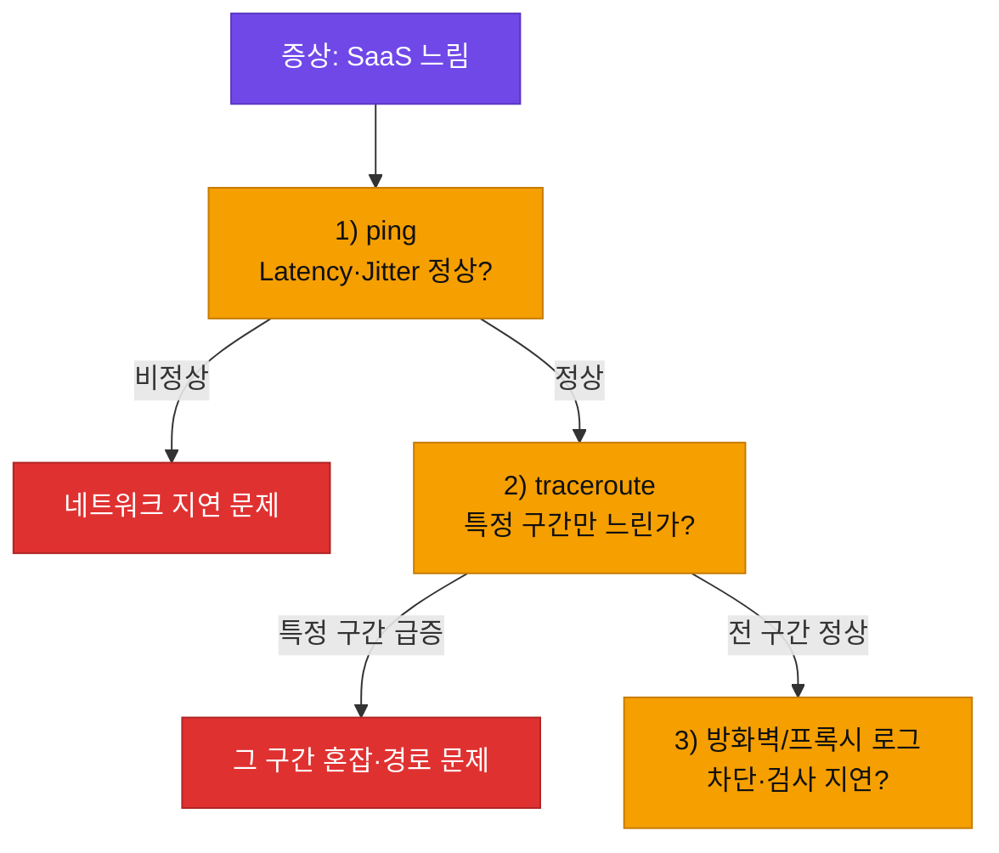

# 강의2 · 네트워크 품질지표와 SaaS 지연 진단 (오후, 총 120분)

> **이 교시 한 문장:** "느려요"라는 막연한 말을, **Latency·Jitter·Packet Loss**라는 숫자로 바꿔 원인 구간을 짚습니다.

| 시간 | 소주제 | 핵심 한 줄 |
|------|--------|-----------|
| 00-20분 | Latency·Jitter | 얼마나 걸리나 / 얼마나 들쭉날쭉하나 |
| 20-45분 | ping으로 측정 | RTT와 편차를 눈으로 |
| 45-70분 | Packet Loss·traceroute | 어느 구간에서 느려지나 |
| 70-95분 | 종합 진단 시나리오 | ping→traceroute→로그 순서 |
| 95-120분 | 실습 안내 | 진단 리포트 작성으로 |

## 이 교시에 나오는 어려운 용어
| 용어 (한글발음) | 한 줄 뜻 (아주 쉽게) | 비유 |
|----------------|----------------------|------|
| **IaaS(아이아스)** | 서버(인프라)만 빌려 쓰기 | 빈 땅을 빌림 |
| **PaaS(파스)** | 개발 환경까지 갖춰진 걸 빌리기 | 골조까지 지어진 집 |
| **SaaS(사스)** | 완성된 서비스를 그냥 쓰기 | 완제품 아파트 임대 |
| **DMZ(디엠지)** | 외부 공개 서버를 두는 완충 구역 | 현관 응접실 |
| **Latency(레이턴시)** | 데이터가 목적지까지 걸리는 시간 | 편지 도착까지 걸린 날 |
| **Jitter(지터)** | 그 지연이 들쭉날쭉한 정도 | 배송일이 매번 다름 |
| **Packet Loss(패킷 로스)** | 가다가 사라진 패킷 비율 | 도중 분실된 택배 |
| **RTT(왕복시간)** | 갔다가 돌아오는 데 걸린 시간 | 편지+답장까지 걸린 시간 |

---

## ⏱️ 00-20분 · Latency와 Jitter란

!!! abstract "이 블록을 마치면"
    ✔ Latency·Jitter를 구분하고 ==Jitter가 왜 화상회의에 치명적인지== 안다

### 🔬 깊이 보기 — 품질지표 4형제 완전정복

"네트워크가 느리다/불안하다"를 숫자로 말하는 네 가지 지표입니다.

| 지표(한글발음) | 뜻 | 비유 | 나쁘면 생기는 일 |
|----------------|-----|------|-----------------|
| **Latency(레이턴시)** | 목적지까지 걸리는 시간(편도) | 편지 도착까지 걸린 날수 | 전반적으로 느림 |
| **RTT(왕복시간)** | 갔다 돌아오는 시간 | 편지+답장까지 | 반응이 굼뜸 |
| **Jitter(지터)** | 지연이 들쭉날쭉한 정도 | 배송일이 매번 다름 | 음성·영상 끊김 |
| **Packet Loss(패킷 로스)** | 사라진 패킷 비율 | 도중 분실된 택배 | 화면 깨짐·재전송 |

**Jitter를 눈으로:**
```text
패킷1: 50ms, 패킷2: 52ms, 패킷3: 120ms, 패킷4: 48ms
→ 평균은 낮아도 3번째가 크게 튀었다 = Jitter가 크다(불안정)
```

!!! example "쉬운 비유 — 왜 Jitter가 문제인가"
    화상회의는 음성 조각이 ==일정한 간격으로 도착해야== 매끄럽습니다. 평균이 빨라도 어떤 조각은 50ms, 어떤 건 120ms로 들쭉날쭉하면 소리가 끊기고 튑니다. 그래서 실시간 서비스엔 '평균 속도'보다 '일정함(낮은 Jitter)'이 중요합니다.

!!! question "확인질문"
    **Q. 평균 Latency는 낮은데 Jitter가 크면 화상회의 품질은 어떻게 느껴질까요?**

    **A.** 전체적으로 빠른데도 **소리·화면이 끊기고 튀는** 느낌이 듭니다. 조각이 불규칙하게 도착해 재생 타이밍이 흔들리기 때문입니다. 평균만 보면 놓치는 문제입니다.

<div class="quiz">
<p class="quiz-q"><span class="tag">퀴즈</span><b>평균 Latency가 낮은데도 화상회의가 자꾸 끊긴다면, 가장 먼저 의심할 지표는?</b></p>
<button class="quiz-opt">전송한 총 데이터 양</button>
<button class="quiz-opt" data-correct>Jitter(지연의 들쭉날쭉함) — 조각이 불규칙하게 도착하면 재생이 끊기기 때문</button>
<button class="quiz-opt">서버의 저장 공간</button>
<button class="quiz-opt">모니터 해상도</button>
<div class="quiz-explain"><b>정답: 2번.</b> 실시간 서비스는 '평균 속도'보다 '일정함'이 중요합니다. 평균 Latency가 낮아도 Jitter가 크면 끊깁니다.</div>
<button class="quiz-retry">다시 풀기</button>
</div>

---

## ⏱️ 20-45분 · ping으로 Latency·Jitter 측정

!!! abstract "이 블록을 마치면"
    ✔ ping으로 RTT를 재고 편차로 Jitter를 가늠한다

`ping`은 목적지에 신호를 보내 **왕복시간(RTT)**을 재는 도구입니다. 여러 번 재서 값이 얼마나 흔들리는지 보면 Jitter를 가늠할 수 있습니다.

```text
$ ping example.com
Reply from ...: time=45ms
Reply from ...: time=48ms
Reply from ...: time=112ms   ← 한 번 크게 튐 (이상 징후)
Reply from ...: time=47ms
```

!!! tip "실무 팁"
    한두 번이 아니라 **10회 이상** 재야 편차가 보입니다. `ping -n 10 대상`(윈도우) / `ping -c 10 대상`(맥·리눅스). 평균·최대·손실률이 요약으로 나옵니다.

!!! question "확인질문"
    **Q. ping 결과에서 유독 한 번만 응답시간이 크게 튄다면 무엇을 의심할 수 있을까요?**

    **A.** 일시적인 **혼잡·큐 대기**나 경로상 한 구간의 순간 부하를 의심합니다. 한 번뿐이면 일시적 튐일 수 있으나, **반복되면 그 구간에 지속적 문제**가 있다는 신호입니다(다음 단계 traceroute로 확인).

<div class="quiz">
<p class="quiz-q"><span class="tag">퀴즈</span><b>Jitter를 가늠하려면 ping을 한두 번이 아니라 여러 번 재야 하는 이유로 가장 적절한 것은?</b></p>
<button class="quiz-opt">한 번 재면 서버가 응답을 거부하기 때문</button>
<button class="quiz-opt" data-correct>Jitter는 '값들이 얼마나 흔들리는지'라, 여러 번 측정해야 편차가 드러나기 때문</button>
<button class="quiz-opt">ping은 원래 10회부터 작동하기 때문</button>
<button class="quiz-opt">여러 번 재면 속도가 빨라지기 때문</button>
<div class="quiz-explain"><b>정답: 2번.</b> Jitter는 편차(들쭉날쭉함)이므로 표본이 여러 개 있어야 보입니다. 한 번 값으로는 흔들림을 알 수 없습니다.</div>
<button class="quiz-retry">다시 풀기</button>
</div>

---

## ⏱️ 45-70분 · Packet Loss와 traceroute

!!! abstract "이 블록을 마치면"
    ✔ ==traceroute로 '어느 구간'에서 느려지는지== 짚는다

**Packet Loss(패킷 로스)**는 가는 도중 사라진 패킷의 비율입니다. 손실이 크면 재전송이 늘어 느려지고, 실시간 서비스는 화면이 깨집니다.

**traceroute/tracert**는 출발지→목적지 사이 **각 라우터(홉)까지의 지연**을 한 줄씩 보여줍니다. 어느 구간에서 갑자기 느려지는지 찾는 데 씁니다.

```text
$ traceroute example.com
1  192.168.1.1    1ms
2  10.0.0.1       5ms
3  203.0.113.1    45ms   ← 여기서 지연 급증
4  example.com    46ms
```

3번 홉에서 5ms→45ms로 튀었으니, **문제 구간은 2번과 3번 사이**로 좁혀집니다.

!!! question "확인질문"
    **Q. traceroute에서 특정 홉에서만 지연이 갑자기 커진다면, 그 구간에 문제가 있다고 의심하는 이유는?**

    **A.** 그 홉 전까지는 정상이다가 그 홉에서 급증했다면, **직전 구간에서 혼잡·경로 문제·장비 부하**가 생겼을 가능성이 큽니다. "어디까지 정상, 어디서 나빠졌나"로 원인 구간을 좁히는 것입니다.

<div class="quiz">
<p class="quiz-q"><span class="tag">퀴즈</span><b>traceroute 결과에서 3번 홉부터 지연이 급증했다면, 가장 합리적인 해석은?</b></p>
<button class="quiz-opt">내 PC(1번 홉)가 고장 났다는 뜻</button>
<button class="quiz-opt">목적지 서버가 다운됐다는 뜻</button>
<button class="quiz-opt" data-correct>2번과 3번 홉 사이 구간에서 혼잡·문제가 생겼을 가능성이 높다는 뜻</button>
<button class="quiz-opt">traceroute가 잘못 측정했다는 뜻</button>
<div class="quiz-explain"><b>정답: 3번.</b> 지연이 급증하기 시작한 홉의 '직전 구간'을 의심합니다. 앞 홉들이 정상이었으니 내 PC(1번)나 전체 목적지 문제로 보기 어렵습니다.</div>
<button class="quiz-retry">다시 풀기</button>
</div>

---

## ⏱️ 70-95분 · 종합 진단 시나리오 — "SaaS 접속이 느려요"

!!! abstract "이 블록을 마치면"
    ✔ 지표 기반 진단 순서를 몸에 익힌다

고객이 "SaaS가 느리다"고 하면, 감이 아니라 **순서대로 좁힙니다.**



!!! question "확인질문"
    **Q. ping은 정상인데 traceroute에서 특정 구간만 느리다면, 다음으로 무엇을 확인해야 할까요?**

    **A.** 그 **구간을 관할하는 장비/경로**를 봅니다. 사내 구간이면 사내 라우터·방화벽·프록시, 외부 구간이면 ISP 문제일 수 있습니다. 사내 구간이 의심되면 **방화벽/프록시 로그**로 검사 지연·차단 여부를 확인합니다.

<div class="quiz">
<p class="quiz-q"><span class="tag">퀴즈</span><b>"SaaS 느림" 진단에서 ping → traceroute → 로그 순서로 보는 이유로 가장 적절한 것은?</b></p>
<button class="quiz-opt">알파벳 순서가 그렇기 때문</button>
<button class="quiz-opt" data-correct>큰 범위(전체 지연)에서 좁은 범위(구간 → 특정 장비)로 원인을 단계적으로 좁혀 가는 것이 효율적이기 때문</button>
<button class="quiz-opt">로그는 항상 정상이라 마지막에 보기 때문</button>
<button class="quiz-opt">traceroute가 ping보다 항상 정확하기 때문</button>
<div class="quiz-explain"><b>정답: 2번.</b> "전체가 느린가 → 어느 구간인가 → 그 구간 장비 문제인가"로 좁히면 헛수고가 줄어듭니다. 계층 진단(bottom-up)과 같은 사고방식입니다.</div>
<button class="quiz-retry">다시 풀기</button>
</div>

---

## ⏱️ 95-120분 · 정리 & 실습 예고

- **4지표**: Latency(느림)·RTT(왕복)·Jitter(들쭉날쭉→끊김)·Packet Loss(분실→깨짐)
- **ping**: RTT·편차(Jitter) 측정 (10회 이상)
- **traceroute**: 구간별 지연으로 문제 구간 특정
- **진단 순서**: ping → traceroute → 방화벽/프록시 로그

**실습 예고:** A사 환경 망 구성도를 그리고, 실제 목적지에 ping·traceroute를 돌려 **데이터 근거가 있는 진단 리포트**를 작성합니다. → [실습 페이지](practice.md)

---

## ✅ 가르칠 준비 체크리스트 (강의2)

- [ ] 4지표를 표 없이 구분해 설명한다
- [ ] Jitter가 왜 실시간 서비스에 치명적인지 설명한다
- [ ] `ping`·`traceroute`를 직접 돌려 결과를 해석한다
- [ ] "SaaS 느림"을 ping→traceroute→로그 순서로 진단한다
- [ ] 확인질문 4개 + 퀴즈에 답한다

*[RTT]: Round-Trip Time — 데이터가 갔다가 돌아오는 왕복 시간
*[SaaS]: Software as a Service — 완성된 소프트웨어를 그대로 쓰는 클라우드
*[ISP]: Internet Service Provider — 인터넷 회선을 제공하는 통신사
