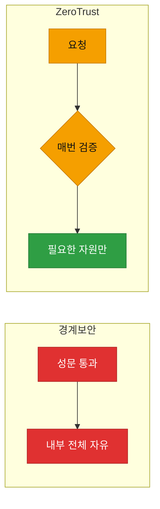

# 강의1 · Zero Trust 개념과 5대 원칙 (오전, 총 120분)

> **이 교시 한 문장:** "성벽 하나로 지키는" 낡은 보안을 버리고, **매 접근을 5가지 축(ID·Device·Network·Application·Policy)으로 검증**하는 Zero Trust를 이해합니다.

| 시간 | 소주제 | 핵심 한 줄 |
|------|--------|-----------|
| 00-20분 | 경계보안의 한계·ZT 등장 | "안은 안전"이 무너졌다 |
| 20-55분 | 5원칙 — ID·Device·Network | 누가·어떤 기기·어디로 |
| 55-85분 | 5원칙 — Application·Policy | 어떤 앱·어떤 상황 |
| 85-110분 | ZT vs 경계보안 비교 | 신뢰 전제의 차이 |
| 110-120분 | 정리 | PDP/PEP로 |

## 이 교시에 나오는 어려운 용어
| 용어 (한글발음) | 한 줄 뜻 (아주 쉽게) | 비유 |
|----------------|----------------------|------|
| **Zero Trust(제로 트러스트)** | 아무도 기본 신뢰 않고 매번 검증 | 사원증을 방마다 다시 확인 |
| **경계 기반 보안** | "안은 안전, 밖은 위험" 전제 | 성벽 하나로 지키기 |
| **MFA(엠에프에이)** | 비밀번호 + 추가 인증(문자·앱) | 열쇠 + 지문 |
| **마이크로 세그멘테이션** | 내부를 잘게 나눠 필요한 곳만 접근 | 건물을 방마다 잠금 |
| **PDP(피디피)** | 접근 허용 여부를 '판단'하는 두뇌 | 심사관 |
| **PEP(펩)** | 그 결정을 '집행'하는 문지기 | 개찰구 |
| **최소권한(least privilege)** | 딱 필요한 권한만 부여 | 필요한 방 열쇠만 |
| **지속적 검증** | 로그인 후에도 계속 재확인 | 순찰을 계속 돎 |

---

## ⏱️ 00-20분 · 경계 기반 보안의 한계와 Zero Trust 등장

!!! abstract "이 블록을 마치면"
    ✔ 경계보안의 한계와 ==ZT의 핵심 철학("절대 신뢰하지 말고 항상 검증")==을 설명한다

전통적 보안은 **"회사 네트워크 안은 안전, 밖은 위험"**이라는 전제였습니다(경계 기반). 성벽(방화벽) 하나로 안팎을 가르는 방식이죠.

그런데 **재택·클라우드·SaaS**(5일차)가 퍼지면서 '안과 밖'의 경계 자체가 흐려졌습니다. 직원은 집·카페에서, 데이터는 남의 클라우드에 있습니다. **성벽 안이 곧 안전이 아니게** 된 겁니다.

!!! example "쉬운 비유 — 성벽 vs 방마다 검문"
    경계보안은 **성문 하나만 통과하면 성 안을 자유롭게** 다니는 방식입니다. 문제는 도둑이 한 번 들어오면(계정 탈취) 막을 게 없다는 것. Zero Trust는 ==성 안에서도 방문마다 사원증을 다시 확인==합니다. "이미 들어왔으니 믿는다"가 없습니다.

!!! question "확인질문 · 나의 답"
    **Q. 직원이 이미 VPN으로 접속했다면, 내부의 모든 자원에 접근할 수 있게 하는 것이 왜 위험할까요?**
    A. VPN(성문) 하나만 통과하면 내부 전체에 접근되므로, **그 계정이 탈취되면** 공격자가 자유롭게 이동(측면 이동)하며 민감 자원에 닿습니다. "한 번 들어오면 신뢰"의 근본 약점입니다.

퀴즈<b>재택·클라우드 확산이 Zero Trust를 필요하게 만든 이유로 가장 적절한 것은?</b>

<button class="quiz-opt">인터넷 속도가 빨라져 보안이 느슨해졌기 때문</button>
<button class="quiz-opt" data-correct>직원·데이터가 회사 밖으로 흩어져 '안=안전'이라는 경계 전제가 더 이상 성립하지 않기 때문</button>
<button class="quiz-opt">방화벽 장비가 단종되었기 때문</button>
<button class="quiz-opt">VPN이 완전히 사라졌기 때문</button>

<b>정답: 2번.</b> 경계(성벽)가 흐려지자 "안이면 신뢰"가 위험해졌습니다. 그래서 위치가 아니라 매 접근을 검증하는 ZT가 필요해졌습니다.

<button class="quiz-retry">다시 풀기</button>

---

## ⏱️ 20-55분 · ZT 5대 원칙 — ID · Device · Network

!!! abstract "이 블록을 마치면"
    ✔ 앞 3개 축을 "무엇을 검증하는가"로 설명한다

### 🔬 깊이 보기 — ZT 5대 원칙 완전정복 (1/2)

Zero Trust는 접근 요청을 **5가지 축**으로 검증합니다. 오전엔 앞 3개.

**1. ID (신원): "이 사람이 진짜 그 사람인가?"**
비밀번호만으로는 부족 → **MFA(엠에프에이, 다중 인증)**로 문자·앱 인증을 추가합니다.
> ID: 이 사용자가 정말 김철수인가? (비밀번호 + 휴대폰 인증)

**2. Device (기기): "이 기기는 믿을 만한가?"**
백신·최신 패치·회사 등록 여부 등 **기기 상태(posture)**를 확인합니다.
> Device: 이 노트북이 회사 보안 기준(백신·암호화)을 충족하는가?

**3. Network (네트워크): "필요한 곳에만 닿는가?"**
내부를 잘게 나눠(**마이크로 세그멘테이션**) 요청이 필요한 자원에만 도달하게 합니다.
> Network: 이 요청이 꼭 필요한 자원에만 가는가? (옆 자원엔 못 감)

!!! question "확인질문 · 나의 답"
    **Q. 재택근무자가 개인 노트북(회사 보안 기준 미충족)으로 접속하려 하면 ZT는 어떤 축에서 걸러낼까요?**
    A. **Device(기기) 축**입니다. 백신·패치 등 기기 상태가 기준 미달이면, 신원(ID)이 맞아도 접근을 거부하거나 제한합니다.

퀴즈<b>비밀번호가 유출됐어도 MFA(다중 인증)가 있으면 계정 탈취를 막을 수 있는 이유로 가장 적절한 것은?</b>

<button class="quiz-opt">MFA가 비밀번호를 자동으로 바꿔 주기 때문</button>
<button class="quiz-opt">MFA가 해커의 IP를 차단하기 때문</button>
<button class="quiz-opt" data-correct>비밀번호 외에 '본인만 가진 두 번째 요소(휴대폰 인증 등)'를 추가로 요구해, 비밀번호만으로는 로그인이 안 되기 때문</button>
<button class="quiz-opt">MFA가 통신을 암호화하기 때문</button>

<b>정답: 3번.</b> MFA는 '아는 것(비밀번호)' + '가진 것(휴대폰)'을 함께 요구합니다. 비밀번호가 새도 두 번째 요소가 없으면 막힙니다.

<button class="quiz-retry">다시 풀기</button>

---

## ⏱️ 55-85분 · ZT 5대 원칙 — Application · Policy

!!! abstract "이 블록을 마치면"
    ✔ 뒤 2개 축과 ==상황에 따라 정책이 바뀌는 '위험 기반 인증'==을 이해한다

### 🔬 깊이 보기 — ZT 5대 원칙 완전정복 (2/2)

**4. Application (애플리케이션): "이 앱에 접근 권한이 있나?"**
접속만 되면 다 되는 게 아니라, **특정 앱 단위**로 접근을 허용합니다.
> Application: 이 사용자가 이 앱(예: 인사시스템)에 권한이 있는가?

**5. Policy (정책): "지금 이 상황에서 허용해도 되나?"**
접속 시간·위치·위험도에 따라 정책이 **동적으로** 바뀝니다(위험 기반 인증).
> Policy: 평소와 다른 해외 IP에서 접속 → 추가 인증 요구 또는 차단

!!! tip "실무 팁"
    5축을 한 문장으로: =="**누가**(ID) **어떤 기기로**(Device) **어디를 통해**(Network) **어떤 앱에**(Application) **어떤 상황에서**(Policy) 접근하는가"==를 매번 확인. 이 다섯 질문이 곧 ZT입니다.

!!! question "확인질문 · 나의 답"
    **Q. 평소와 다른 국가에서 로그인 시도가 발생하면 Policy 축에서는 어떤 조치를 취할 수 있을까요?**
    A. 위험도가 높다고 판단해 **추가 인증(MFA)을 요구**하거나, **접근을 차단**하거나, **권한을 줄여** 허용할 수 있습니다. 상황(위험)에 따라 정책 강도를 동적으로 올리는 것이 위험 기반 인증입니다.

퀴즈<b>ZT의 Policy 축이 '해외 IP 접속 시 추가 인증'처럼 상황마다 다르게 작동하는 이유로 가장 적절한 것은?</b>

<button class="quiz-opt">해외에서는 인터넷이 항상 느리기 때문</button>
<button class="quiz-opt">모든 해외 접속은 반드시 공격이기 때문</button>
<button class="quiz-opt" data-correct>위험도(평소와 다른 시간·위치 등)에 따라 인증 강도를 동적으로 조절해, 의심스러울 때만 더 강하게 검증하려는 것이기 때문</button>
<button class="quiz-opt">해외 IP는 로그를 남길 수 없기 때문</button>

<b>정답: 3번.</b> 위험 기반 인증은 '정상은 편하게, 의심스러우면 강하게'입니다. 모든 해외 접속이 공격(2번)인 것은 아니므로, 무조건 차단이 아니라 상황별 조절입니다.

<button class="quiz-retry">다시 풀기</button>

---

## ⏱️ 85-110분 · ZT vs 경계보안 비교

!!! abstract "이 블록을 마치면"
    ✔ 두 모델을 기준별로 비교해 표로 정리한다

| 기준 | 경계 기반 보안 | Zero Trust |
|------|----------------|------------|
| 신뢰 전제 | 안은 신뢰, 밖은 불신 | ==아무도 기본 신뢰 안 함== |
| 검증 시점 | 성문(한 번) 통과 시 | 매 접근마다 반복 |
| 접근 범위 | 들어오면 내부 전체 | 필요한 자원만(최소권한) |
| 계정 탈취 시 | 내부 전체 위험 | 자원별로 다시 막힘 |

!!! question "확인질문 · 나의 답"
    **Q. 경계보안은 '한 번 들어오면 신뢰'하는 반면 ZT는 무엇을 매번 반복할까요?**
    A. **검증(인증·인가)**을 매 접근마다 반복합니다. "이미 들어왔으니 믿는다"가 없고, 자원에 접근할 때마다 ID·기기·상황을 다시 확인합니다.

퀴즈<b>계정 하나가 탈취됐을 때 Zero Trust가 경계보안보다 피해를 줄일 수 있는 이유로 가장 적절한 것은?</b>

<button class="quiz-opt">ZT는 비밀번호를 매일 자동으로 바꾸기 때문</button>
<button class="quiz-opt" data-correct>ZT는 자원마다 매번 다시 검증하고 최소권한만 주므로, 한 계정을 뺏겨도 내부 전체가 뚫리지 않기 때문</button>
<button class="quiz-opt">ZT에서는 계정 탈취가 원천적으로 불가능하기 때문</button>
<button class="quiz-opt">ZT는 해외 접속을 전부 막기 때문</button>

<b>정답: 2번.</b> 경계보안은 성문만 뚫리면 내부 전체가 열리지만, ZT는 자원별 재검증 + 최소권한이라 피해 범위가 좁습니다. 탈취 자체를 100% 막는(3번) 것은 아닙니다.

<button class="quiz-retry">다시 풀기</button>

---

## ⏱️ 110-120분 · 정리 & 오후 예고

- **ZT 철학**: "절대 신뢰하지 말고 항상 검증"
- **5대 축**: ID(누가)·Device(어떤 기기)·Network(어디로)·Application(어떤 앱)·Policy(어떤 상황)
- **경계보안 대비**: 매 접근 검증 + 최소권한 → 계정 탈취 피해 최소화

**오후 예고:** 그럼 이 검증을 **누가 판단(PDP)하고 누가 집행(PEP)**할까요? 그 구조와 최소권한·지속검증을 봅니다.

---

## ✅ 가르칠 준비 체크리스트 (강의1)

- [ ] 경계보안 한계를 '성벽' 비유로 설명한다
- [ ] ZT 5축을 각각 한 문장 질문으로 말한다
- [ ] MFA가 왜 계정 탈취를 막는지 설명한다
- [ ] ZT vs 경계보안 비교표를 그린다
- [ ] 확인질문 3개 + 퀴즈에 답한다

*[MFA]: Multi-Factor Authentication — 비밀번호 외에 추가 요소로 하는 다중 인증
*[VPN]: Virtual Private Network — 공용망 위 암호화된 사설 통로
