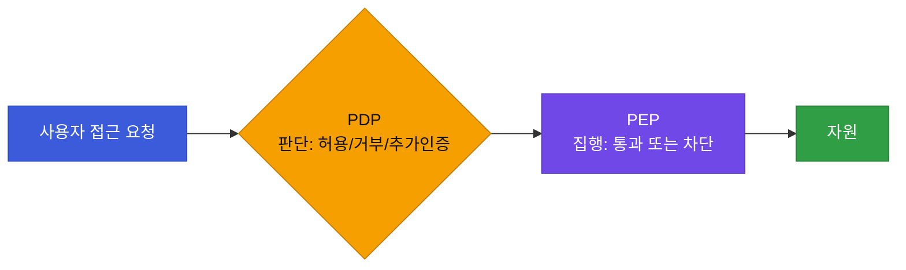
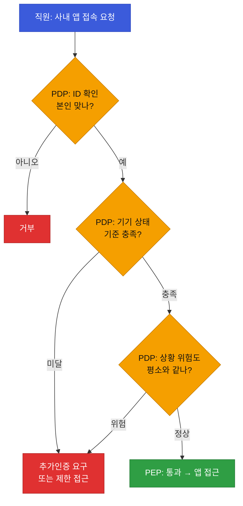

# 강의2 · PDP/PEP 구조와 최소권한·지속검증 (오후, 총 120분)

> **이 교시 한 문장:** Zero Trust를 실제로 돌리는 **두 부품 — 판단하는 두뇌(PDP)와 집행하는 문지기(PEP)** — 를 이해하고, 최소권한·지속검증으로 시나리오를 설계합니다.

| 시간 | 소주제 | 핵심 한 줄 |
|------|--------|-----------|
| 00-25분 | PDP와 PEP | 판단과 집행의 분리 |
| 25-55분 | PDP/PEP 흐름도 | 요청→판단→집행 순서 |
| 55-80분 | 최소권한 심화 | default deny에서 출발 |
| 80-105분 | 지속검증·위험기반인증 | 로그인 후에도 계속 확인 |
| 105-120분 | 스코어링 예고 | ZT 성숙도 점수화 |

## 이 교시에 나오는 어려운 용어
| 용어 (한글발음) | 한 줄 뜻 (아주 쉽게) | 비유 |
|----------------|----------------------|------|
| **Zero Trust(제로 트러스트)** | 아무도 기본 신뢰 않고 매번 검증 | 사원증을 방마다 다시 확인 |
| **경계 기반 보안** | "안은 안전, 밖은 위험" 전제 | 성벽 하나로 지키기 |
| **MFA(엠에프에이)** | 비밀번호 + 추가 인증(문자·앱) | 열쇠 + 지문 |
| **마이크로 세그멘테이션** | 내부를 잘게 나눠 필요한 곳만 접근 | 건물을 방마다 잠금 |
| **PDP(피디피)** | 접근 허용 여부를 '판단'하는 두뇌 | 심사관 |
| **PEP(펩)** | 그 결정을 '집행'하는 문지기 | 개찰구 |
| **최소권한(least privilege)** | 딱 필요한 권한만 부여 | 필요한 방 열쇠만 |
| **지속적 검증** | 로그인 후에도 계속 재확인 | 순찰을 계속 돎 |

---

## ⏱️ 00-25분 · PDP와 PEP

!!! abstract "이 블록을 마치면"
    ✔ PDP(판단)와 PEP(집행)의 역할과 ==분리되어 있는 이유==를 설명한다

Zero Trust의 "매번 검증"을 실제로 담당하는 두 부품이 있습니다.

- **PDP (Policy Decision Point, 정책 결정점) = 두뇌/심사관**: 이 접근을 **허용/거부/추가인증** 중 무엇으로 할지 **판단**.
- **PEP (Policy Enforcement Point, 정책 집행점) = 문지기/개찰구**: PDP의 결정을 **실제로 집행**(통과시키거나 차단).



!!! example "쉬운 비유 — 콘서트장"
    **PDP = 매표소 심사관**(표·신분 확인 후 "입장 가능" 판단), **PEP = 게이트 개찰구**(그 판단대로 문을 열거나 막음). 판단과 집행을 나누면, 심사 규칙(PDP)을 바꿔도 개찰구(PEP)는 그대로 쓸 수 있습니다.

!!! question "확인질문"
    **Q. PDP가 '거부'라고 판단했는데 PEP가 이를 무시하고 통과시킨다면 어떤 문제가 생길까요?**

    **A.** 아무리 똑똑하게 판단해도 **집행이 안 되면 소용없습니다.** 막아야 할 접근이 그대로 통과돼 **보안이 무너져요.** 그래서 PEP(문지기)는 PDP(심사관)의 결정을 반드시 그대로 따라야 합니다.

<div class="quiz">
<p class="quiz-q"><span class="tag">퀴즈</span><b>Zero Trust에서 판단(PDP)과 집행(PEP)을 분리해 두는 이유로 가장 적절한 것은?</b></p>
<button class="quiz-opt">두 장비를 쓰면 항상 더 빠르기 때문</button>
<button class="quiz-opt" data-correct>판단 규칙(정책)을 바꿔도 집행 지점은 그대로 두고, 여러 집행 지점을 하나의 판단 두뇌로 일관되게 통제할 수 있기 때문</button>
<button class="quiz-opt">PDP는 실제로는 아무 일도 하지 않기 때문</button>
<button class="quiz-opt">PEP가 없어도 보안이 유지되기 때문</button>
<div class="quiz-explain"><b>정답: 2번.</b> 두뇌(PDP)와 문지기(PEP)를 나누면 정책을 중앙에서 일관되게 관리하고, 곳곳의 집행 지점에 동일 기준을 적용할 수 있습니다.</div>
<button class="quiz-retry">다시 풀기</button>
</div>

---

## ⏱️ 25-55분 · PDP/PEP 흐름 다이어그램

!!! abstract "이 블록을 마치면"
    ✔ 구체 시나리오로 판단 기준이 흐름의 어디서 작동하는지 짚는다

**시나리오:** 직원이 사내 앱에 접속 요청 → PDP가 ID/Device/상황 확인 → 결정 → PEP 집행.



!!! question "확인질문"
    **Q. 이 흐름에서 만약 기기 보안 상태가 기준 미달이면 PDP는 어떤 결정을 내려야 할까요?**

    **A.** 그대로 통과시키면 안 됩니다. **거부하거나, 추가 인증을 요구하거나, 읽기만 되게 제한**해야 해요. 사람이 본인이 맞아도(신원 통과), 기기 상태에서 걸리면 막아야 합니다.

<div class="quiz">
<p class="quiz-q"><span class="tag">퀴즈</span><b>PDP가 ID·Device·상황을 '순서대로 여러 관문'으로 확인하는 방식이 주는 이점으로 가장 적절한 것은?</b></p>
<button class="quiz-opt">관문이 많을수록 접속 속도가 빨라지기 때문</button>
<button class="quiz-opt" data-correct>한 축만 맞아도 통과시키지 않고 여러 조건을 모두 만족해야 허용하므로, 한 요소가 뚫려도 다른 관문에서 걸러지기 때문</button>
<button class="quiz-opt">관문 중 하나만 통과하면 나머지는 건너뛰기 때문</button>
<button class="quiz-opt">PDP가 판단을 PEP에게 넘기기 때문</button>
<div class="quiz-explain"><b>정답: 2번.</b> 여러 축을 AND로 검증하면 방어가 겹겹이 됩니다(다층 방어). 신원이 맞아도 기기·상황에서 걸리면 막힙니다.</div>
<button class="quiz-retry">다시 풀기</button>
</div>

---

## ⏱️ 55-80분 · 최소권한 원칙 복습과 심화

!!! abstract "이 블록을 마치면"
    ✔ ==최소권한이 'default deny(기본 거부)'에서 출발==한다는 점을 설명한다

**최소권한(least privilege)**은 업무에 **딱 필요한 만큼만** 권한을 주는 원칙입니다. ZT 관점에서 핵심은 출발점이 **"기본적으로 아무 권한도 없음(default deny)"**이라는 것 — 필요한 것만 하나씩 열어 줍니다.

!!! example "쉬운 비유 — 회사 열쇠"
    신입에게 처음부터 **모든 방 마스터키**를 주는 게 아니라, ==자기 사무실 열쇠만== 주고 필요할 때 회의실 열쇠를 추가로 받는 방식입니다. 이게 4일차 방화벽의 '화이트리스트'와 같은 사고입니다.

!!! question "확인질문"
    **Q. 신입사원에게 처음부터 모든 시스템 접근권한을 주는 것과, 필요할 때마다 요청받아 부여하는 것 — ZT 철학엔 어느 쪽이 맞을까요?**

    **A.** **필요할 때마다 요청받아 주는 쪽**입니다. Zero Trust는 "처음엔 아무 권한 없음"에서 시작해, 꼭 필요한 것만 하나씩 열어줘요. 처음부터 다 주면, 계정을 뺏기거나 오남용될 때 피해가 커집니다.

<div class="quiz">
<p class="quiz-q"><span class="tag">퀴즈</span><b>Zero Trust의 최소권한이 'default deny(기본 거부)'에서 출발하는 이유로 가장 적절한 것은?</b></p>
<button class="quiz-opt">권한을 주는 것이 기술적으로 불가능하기 때문</button>
<button class="quiz-opt" data-correct>기본을 '아무 권한 없음'으로 두고 필요한 것만 열어야, 불필요한 접근 경로와 탈취 시 피해를 최소화할 수 있기 때문</button>
<button class="quiz-opt">거부가 허용보다 처리 속도가 빠르기 때문</button>
<button class="quiz-opt">신입사원은 원래 시스템을 쓸 수 없기 때문</button>
<div class="quiz-explain"><b>정답: 2번.</b> "다 막고 필요한 것만"이 화이트리스트·최소권한의 핵심입니다. 노출 면을 줄여 탈취·오남용 피해를 최소화합니다.</div>
<button class="quiz-retry">다시 풀기</button>
</div>

---

## ⏱️ 80-105분 · 지속적 검증과 위험 기반 인증

!!! abstract "이 블록을 마치면"
    ✔ ==로그인 한 번이 아니라 세션 내내 재검증==하는 이유를 설명한다

전통 방식은 **로그인 시점에 한 번만** 검증했습니다. ZT는 **세션 내내 상태 변화를 지속적으로 재검증**합니다.

```text
로그인 시점: 정상 인증 (한국, 회사 노트북)
30분 후: 갑자기 다른 국가 IP로 요청 → 재검증 트리거
       → 추가 인증 요구 또는 세션 강제 종료
```

!!! question "확인질문"
    **Q. 로그인 이후 세션을 끊지 않고 계속 유지하면, 중간에 계정이 탈취돼도 이를 어떻게 알아챌 수 있을까요?**

    **A.** **계속 지켜보기(지속적 검증)**로 알아챕니다. 로그인 뒤에도 "갑자기 다른 나라에서 접속", "기기가 바뀜" 같은 이상한 변화를 감지하면, 다시 인증을 요구하거나 연결을 끊어요. 로그인 때 딱 한 번만 확인하면, 그 뒤에 탈취돼도 못 잡습니다.

<div class="quiz">
<p class="quiz-q"><span class="tag">퀴즈</span><b>로그인 시점에 한 번만 검증하는 방식의 약점을 ZT의 '지속적 검증'이 보완하는 이유로 가장 적절한 것은?</b></p>
<button class="quiz-opt">지속적 검증이 로그인 속도를 높이기 때문</button>
<button class="quiz-opt">한 번 인증하면 세션이 자동으로 종료되기 때문</button>
<button class="quiz-opt" data-correct>로그인 이후 계정이 탈취되거나 상황이 바뀌어도, 세션 중 재검증으로 이상을 잡아 대응할 수 있기 때문</button>
<button class="quiz-opt">지속적 검증은 비밀번호를 없애 주기 때문</button>
<div class="quiz-explain"><b>정답: 3번.</b> 한 번 검증은 '로그인 후'를 못 봅니다. 지속적 검증 + 위험 기반 인증으로 세션 중 이상(위치·기기 변화)을 감지해 재인증·차단합니다.</div>
<button class="quiz-retry">다시 풀기</button>
</div>

---

## ⏱️ 105-120분 · 보안 자세 점검·스코어링 예고

!!! abstract "이 블록을 마치면"
    ✔ ZT 성숙도를 점수화하는 접근을 이해한다(캡스톤 연결)

5축 + 최소권한 + 지속검증을 종합해, 고객 환경의 **ZT 성숙도를 점수화(스코어링)**할 수 있습니다.

| 스코어링 항목(예시) | 배점 |
|---------------------|:---:|
| MFA 적용률 | 20 |
| 기기 보안 점검 비율 | 20 |
| 최소권한 준수율 | 20 |
| 마이크로 세그멘테이션 적용 | 20 |
| 위험 기반 인증 적용 | 20 |

> 이 점수 체계가 **캡스톤의 'ZT 보안 자세 점검·스코어링'**의 뼈대가 됩니다. (오늘 실습에서 A사 점수를 매겨봅니다)

!!! question "확인질문"
    **Q. 이런 점수 체계가 있으면, 고객사에게 '보안 수준이 어느 정도'라고 설명하기 더 쉬워질까요?**

    **A.** 네. 막연히 "안전합니다" 대신 **"5개 중 3개 충족, 60점, 특히 MFA가 약함"**처럼 근거와 고칠 점을 콕 집어 말할 수 있습니다. (7일차 문서화와도 이어집니다.)

---

## ✅ 가르칠 준비 체크리스트 (강의2)

- [ ] PDP(판단)/PEP(집행)를 '심사관/개찰구'로 설명한다
- [ ] PDP/PEP 흐름도를 다층 검증(ID→Device→상황)으로 그린다
- [ ] 최소권한이 default deny에서 출발함을 설명한다
- [ ] 지속적 검증이 왜 필요한지 설명한다
- [ ] 스코어링 5항목을 들고 캡스톤 연결을 설명한다
- [ ] 확인질문 4개 + 퀴즈에 답한다

*[PDP]: Policy Decision Point — 접근 허용 여부를 판단하는 정책 결정점
*[PEP]: Policy Enforcement Point — 그 결정을 집행하는 정책 집행점
*[MFA]: Multi-Factor Authentication — 다중 인증
