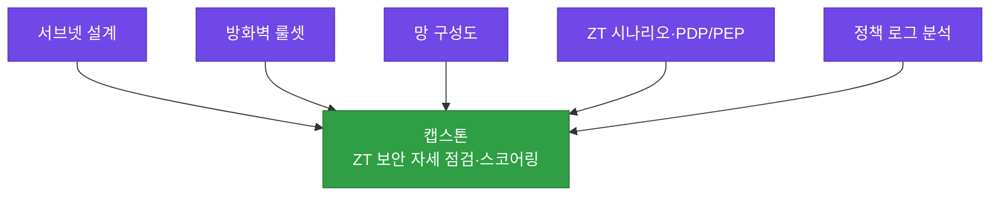

# 강의 · 이슈 유형 정리와 도식화 기법 (통합, 총 120분)

> **이 교시 한 문장:** 7일간 배운 지식을 **한 장의 지도**로 잇고, 실제 이슈를 **3유형으로 분류**해 **플로우차트·타임라인**으로 그리는 법을 익힙니다.

| 시간 | 소주제 | 핵심 한 줄 |
|------|--------|-----------|
| 00-20분 | 1~7일차 종합 지도 | 흩어진 것을 하나로 |
| 20-45분 | 이슈 3유형 분류 | 장애·위협·접근통제 |
| 45-70분 | 플로우차트·타임라인 | 흐름과 시간으로 도식화 |
| 70-95분 | 팀별 시나리오 도식화 | 직접 그려보기 |
| 95-120분 | 캡스톤 연계·발표 준비 | 산출물이 어디로 쓰이나 |

## 이 교시에 나오는 어려운 용어

| 용어 (한글발음) | 한 줄 뜻 (아주 쉽게) | 비유 |
|----------------|----------------------|------|
| **장애 이슈** | 연결·성능·서비스가 안 되는 문제 | 차가 안 굴러감 |
| **위협 이슈** | 공격(스푸핑·대입·SYN Flood 등) | 도둑 침입 |
| **접근통제 이슈** | 과다권한·최소권한 위반 | 아무나 금고 접근 |
| **플로우차트(flowchart)** | 증상→진단→원인→조치 흐름도 | 순서도 |
| **타임라인(timeline)** | 사고를 시간 순서로 정리 | 사건 일지 |
| **인과(cause-effect)** | 무엇이 원인이고 무엇이 결과인가 | 도미노 |
| **과다권한(excessive privilege)** | 필요 이상으로 많이 준 권한 | 마스터키 남발 |
| **DGA(디지에이)** | 악성코드의 무작위 도메인 생성 | 대포폰 번호 |
| **SOAR(쏘어)** | 보안 대응을 자동화하는 것(5과목) | 자동 소방 시스템 |
| **스코어링(scoring)** | 보안 수준을 점수로 매기기 | 건강 점수 |
| **캡스톤(capstone, 캡스톤)** | 배운 걸 모아 만드는 최종 프로젝트 | 졸업 작품 |

---

## ⏱️ 00-20분 · 1~7일차 종합 지도

!!! abstract "이 블록을 마치면"
    ✔ 2과목 전체 흐름을 한 문장으로 잇는다

지금까지의 여정을 한 장으로 봅니다.


!!! tip "한 문장으로 잇기"
    ==네트워크의 '지도(OSI)'를 그리고 → 주소를 '나누고(서브넷)' → 이름을 '찾고(DNS)' → 통로를 '지키고(VPN·방화벽)' → 흐려진 경계를 '측정·재정의(클라우드·ZT)'하고 → 그 결과를 '기록·설명(로그·문서)'한다.==

!!! question "확인질문"
    **Q. 7일 중 가장 어렵게 느껴졌던 개념은 무엇이었나요?**

    **A.** (강사 스스로 답: 예 — 서브네팅 계산, PDP/PEP 흐름 등. 학생에게도 이 질문으로 복습 지점을 파악한다.)

<div class="quiz">
<p class="quiz-q"><span class="tag">퀴즈</span><b>Day1(OSI)~Day6(Zero Trust)의 흐름을 관통하는 하나의 큰 방향으로 가장 적절한 것은?</b></p>
<button class="quiz-opt">장비를 싸게 사는 방법을 배우는 흐름</button>
<button class="quiz-opt" data-correct>네트워크의 기본 구조를 이해한 뒤, 경계가 흐려진 환경에서 '매 접근을 검증'하는 보안(ZT)으로 나아가는 흐름</button>
<button class="quiz-opt">프로그래밍 언어를 순서대로 배우는 흐름</button>
<button class="quiz-opt">서로 관련 없는 주제들을 나열한 것</button>
<div class="quiz-explain"><b>정답: 2번.</b> 기초(구조)→보안(통로 지키기)→ZT(경계 재정의)로 이어지는 하나의 이야기입니다. 뒤 과목(접근통제·이상탐지)의 밑바탕이 됩니다.</div>
<button class="quiz-retry">다시 풀기</button>
</div>

---

## ⏱️ 20-45분 · 장애·위협·접근통제 이슈 유형 분류

!!! abstract "이 블록을 마치면"
    ✔ 이슈를 3유형으로 나누고 배운 개념과 연결한다

### 🔬 깊이 보기 — 이슈 3유형 완전정복

실무에서 만나는 이슈는 크게 세 갈래입니다. 배운 것과 연결해 정리합니다.

| 유형 | 예시 | 연결된 배운 개념 |
|------|------|-----------------|
| **장애** (안 됨/느림) | 연결 장애·성능 저하·서비스 다운 | 계층 진단(Day1)·품질지표(Day5) |
| **위협** (공격) | DNS 스푸핑·무차별 대입·SYN Flood | DNS(Day3)·핸드셰이크(Day1)·방화벽(Day4) |
| **접근통제** (권한) | 과다권한·최소권한 위반 | Zero Trust·최소권한(Day6)·정책로그(Day7) |

**핵심:** 각 이슈는 **정책 로그 필드**와 연결됩니다. 예: 위협·접근통제 이슈는 `action=deny`, `risk_score`가 높은 로그로 드러납니다.

!!! question "확인질문"
    **Q. '특정 사이트만 안 열린다'는 증상은 어떤 장애 유형에 가까울까요?**

    **A.** **연결/서비스 장애**에 가깝습니다. 다른 사이트는 되는데 그 사이트만 안 되면, 그 도메인의 DNS(Day3)나 경로·방화벽(Day4) 문제일 수 있어요. Day1의 계층 진단으로 어디가 막혔는지 좁혀갑니다.

<div class="quiz">
<p class="quiz-q"><span class="tag">퀴즈</span><b>"무작위 문자열 도메인을 대량 조회하는 PC"는 어떤 이슈 유형이며 어느 날 배운 개념과 연결되나?</b></p>
<button class="quiz-opt">장애 이슈 — Day5 품질지표</button>
<button class="quiz-opt" data-correct>위협 이슈 — Day3의 DNS(DGA·악성코드 C2 통신)</button>
<button class="quiz-opt">접근통제 이슈 — Day6 최소권한</button>
<button class="quiz-opt">장애 이슈 — Day2 서브네팅</button>
<div class="quiz-explain"><b>정답: 2번.</b> DGA 스타일 대량 조회는 악성코드 감염(위협)의 신호로, Day3 DNS에서 배웠습니다. 이렇게 증상을 유형+개념으로 연결하는 게 오늘의 핵심입니다.</div>
<button class="quiz-retry">다시 풀기</button>
</div>

---

## ⏱️ 45-70분 · 플로우차트·타임라인으로 이슈 도식화

!!! abstract "이 블록을 마치면"
    ✔ ==증상→진단→원인→조치 흐름과 사고 타임라인==을 그린다

**플로우차트**: 대응 과정을 순서로.


**타임라인**: 사고를 시간 순으로.
```text
09:15  kim01 인사시스템 접근 거부 (기기 미달)
09:20  같은 계정 deny 반복 시작
09:40  새벽까지 deny 37건 누적 → 계정 잠금
```

!!! question "확인질문"
    **Q. 타임라인 형태로 사고를 정리하면, 표로 나열하는 것보다 어떤 점이 더 잘 보일까요?**

    **A.** **시간 순서와 원인-결과(무엇이 먼저 있었고, 무엇으로 번졌나)**가 잘 보입니다. "언제 시작돼 어떻게 퍼졌는지"를 한눈에 알 수 있어, 초기 대응(5과목 SOAR)이나 사후 분석에 유리해요.

<div class="quiz">
<p class="quiz-q"><span class="tag">퀴즈</span><b>보안 사고를 '타임라인'으로 정리하는 것이 특히 유용한 이유로 가장 적절한 것은?</b></p>
<button class="quiz-opt">타임라인이 표보다 예쁘기 때문</button>
<button class="quiz-opt" data-correct>사건의 시간 순서와 인과(무엇이 먼저 일어나 어떻게 번졌는지)가 한눈에 드러나기 때문</button>
<button class="quiz-opt">타임라인은 데이터를 자동으로 분석해 주기 때문</button>
<button class="quiz-opt">표는 사고 정리에 쓸 수 없기 때문</button>
<div class="quiz-explain"><b>정답: 2번.</b> 타임라인은 '순서와 인과'를 보여 줍니다. 초동 대응·사후 리뷰에서 "언제 시작돼 어떻게 확산됐나"를 파악하는 데 강합니다.</div>
<button class="quiz-retry">다시 풀기</button>
</div>

---

## ⏱️ 70-95분 · 팀별 시나리오 도식화 작업

!!! abstract "이 블록을 마치면"
    ✔ 한 이슈를 골라 배운 도식화 기법으로 표현한다

팀별로 장애/위협/접근통제 이슈 중 하나를 골라, **플로우차트 또는 타임라인**으로 대응 흐름을 그립니다. (예: "DNS 스푸핑 의심 사고")

!!! tip "실무 팁"
    도식에 **"이 단계에서 며칠차 개념이 쓰였는지"**를 라벨로 달면(예: 진단 단계=Day1 계층 진단), 학습이 실무에 어떻게 연결되는지가 드러납니다.

---

## ⏱️ 95-120분 · 캡스톤 연계 안내 및 발표 준비

!!! abstract "이 블록을 마치면"
    ✔ 2과목 산출물이 캡스톤 어디에 쓰이는지 설명한다

2과목의 산출물들이 캡스톤으로 이어집니다.



!!! question "확인질문"
    **Q. (스코어링 관련) 이런 점수 체계가 있으면, 고객사에게 '보안 수준이 어느 정도'라고 설명하기 더 쉬워질까요?**

    **A.** 네. 산출물(구성도·룰셋·ZT 시나리오·로그 분석)을 근거로 **점수와 고칠 점을 구체적으로** 보여줄 수 있어요. 오늘 배운 도식화·문서화가 그 설명을 뒷받침합니다.

<div class="quiz">
<p class="quiz-q"><span class="tag">종합 퀴즈</span><b>2과목의 여러 산출물(구성도·룰셋·ZT 시나리오·로그 분석)이 캡스톤으로 이어지는 방식으로 가장 적절한 것은?</b></p>
<button class="quiz-opt">서로 관련 없어 캡스톤에서는 새로 만든다</button>
<button class="quiz-opt" data-correct>각 산출물이 'ZT 보안 자세 점검·스코어링'의 근거 자료로 재사용되어, 고객 환경을 진단·설명하는 데 쓰인다</button>
<button class="quiz-opt">산출물은 발표용일 뿐 캡스톤과 무관하다</button>
<button class="quiz-opt">캡스톤은 코드만 쓰고 문서는 버린다</button>
<div class="quiz-explain"><b>정답: 2번.</b> 2과목 산출물은 캡스톤 스코어링의 입력이 됩니다. 그래서 매 실습 산출물을 잘 남겨두는 것이 중요합니다.</div>
<button class="quiz-retry">다시 풀기</button>
</div>

---

## ✅ 가르칠 준비 체크리스트 (통합 강의)

- [ ] 1~7일차를 한 문장 흐름으로 잇는다
- [ ] 이슈를 장애·위협·접근통제 3유형으로 분류하고 개념과 연결한다
- [ ] 플로우차트·타임라인으로 이슈를 도식화한다
- [ ] 2과목 산출물이 캡스톤 스코어링으로 이어짐을 설명한다
- [ ] 확인질문 4개 + 퀴즈에 답한다

*[SOAR]: Security Orchestration, Automation and Response — 보안 자동 대응(5과목)
*[DGA]: Domain Generation Algorithm — 악성코드가 무작위 도메인을 대량 생성하는 기법
