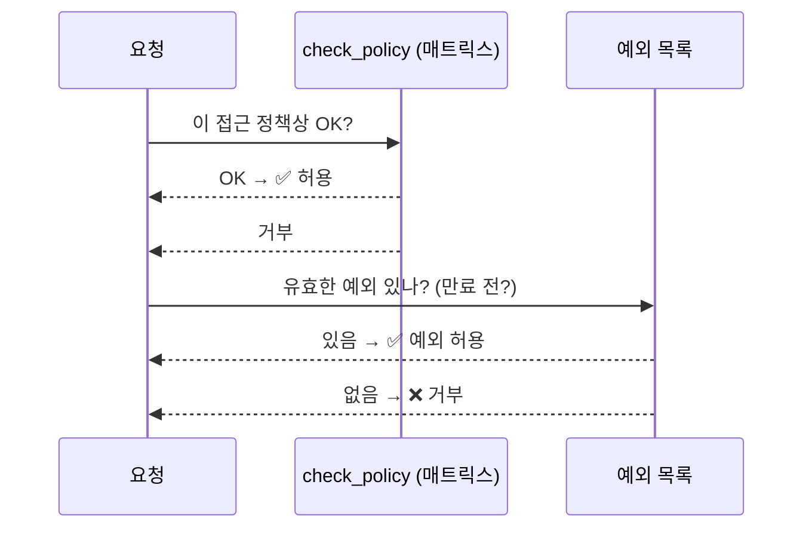

# 강의2 · 최소권한 정책 설계 기준 (오후, 총 120분)

> **이 교시 한 문장:** "필요한 최소한"을 **부서×시스템 권한 매트릭스**로 명확히 하고, 그 판단(정책+예외)을 **파이썬 코드**로 만듭니다.

| 시간 | 소주제 | 핵심 한 줄 |
|------|--------|-----------|
| 00-20분 | 최소권한 원칙 심화 | "필요한 만큼만"을 기준으로 |
| 20-50분 | 직무 기반 권한 매트릭스 | 부서×시스템 표로 명시 |
| 50-75분 | 예외 관리 원칙 | 승인자·만료일과 함께 기록 |
| 75-100분 | 매트릭스·예외를 코드로 | `check_policy()`·`is_exception_valid()` |
| 100-120분 | 정책+예외 통합 판단 | `evaluate_access()` = PDP |

## 이 교시에 나오는 어려운 용어

| 용어 (한글발음) | 한 줄 뜻 (아주 쉽게) | 비유 |
|----------------|----------------------|------|
| **최소권한(least privilege)** | 업무에 꼭 필요한 만큼만 권한 부여 | 필요한 방 열쇠만 |
| **권한 매트릭스(matrix)** | 부서×시스템 접근 수준을 적은 표 | 좌석 배치도 |
| **접근 수준(level)** | 조회 < 수정 < 관리자 순 등급 | 출입 등급 |
| **예외(exception)** | 매트릭스 기준을 벗어난 허용 | 임시 출입증 |
| **만료일(expiry)** | 그 예외가 끝나는 날짜 | 유통기한 |
| **`check_policy()`** | 매트릭스대로 되는지 검사하는 함수 | 규정 대조 |
| **`evaluate_access()`** | 정책+예외를 합쳐 최종 판단 | 종합 심사 |
| **PDP(피디피)** | 접근 허용을 판단하는 두뇌 | 심사관 |
| **`.index()`** | 목록에서 몇 번째인지 알려주는 것 | 순번 찾기 |
| **default deny(기본 거부)** | 정의 안 된 건 일단 막기 | 명단에 없으면 거부 |

---

## ⏱️ 00-20분 · 최소권한 원칙 심화 (2과목 연계)

!!! info "📘 학습자 뷰 · 처음 보는 나"
    **최소권한(least privilege)** = 업무에 **꼭 필요한 만큼만** 권한을 주는 원칙입니다.
    2과목에서 "기본은 아무 권한 없음(default deny)에서 출발"이라고 배웠죠. 오늘은 그 "필요한 만큼"을 **누가, 어떻게 정하는지**를 구체적 기준(표)으로 만듭니다.

!!! example "🎓 강사 뷰 · 가르치는 나"
    - **예상 질문:** *"'필요한 만큼'은 누가 정해요?"* → 보통 **업무 책임자(부서장)**가 "이 직무엔 이게 필요"라고 정하고, 보안팀이 검토합니다. 감으로가 아니라 **직무 기준**으로요.
    - **연결:** 강의1의 RBAC(역할)이 "누가 무슨 권한 묶음을 갖나"였다면, 오늘은 "그 권한을 **어디까지** 허용할지"를 표로 정합니다.

!!! question "확인질문"
    **Q. '필요한 최소한'이라는 말은 누가 어떻게 판단해야 할까요?**

    **A.** 감이 아니라 **직무(하는 일) 기준**으로 정합니다. 보통 그 업무를 아는 **부서 책임자**가 "이 일엔 이 시스템의 이 수준까지 필요"라고 제시하고, 보안팀이 검토·승인합니다. 그래야 근거가 남고 과다권한을 막습니다.

<div class="quiz">
<p class="quiz-q"><span class="tag">퀴즈</span><b>최소권한 원칙에서 "필요한 만큼"을 정할 때 가장 바람직한 방식은?</b></p>
<button class="quiz-opt">모두에게 넉넉히 주고 문제 생기면 줄인다</button>
<button class="quiz-opt" data-correct>직무(하는 일)를 기준으로 필요한 것만 정하고, 책임자·보안팀이 검토해 근거를 남긴다</button>
<button class="quiz-opt">가장 높은 권한을 기본으로 준다</button>
<button class="quiz-opt">개인이 원하는 대로 신청하면 다 준다</button>
<div class="quiz-explain"><b>정답: 2번.</b> 최소권한은 '직무 기준 + 근거'입니다. 넉넉히 주는(1번)·최고권한 기본(3번)은 정반대(과다권한)입니다.</div>
<button class="quiz-retry">다시 풀기</button>
</div>

---

## ⏱️ 20-50분 · 직무 기반 권한 매트릭스 설계

!!! abstract "이 블록을 마치면"
    ✔ 부서×시스템 표로 "누가 어디에 어느 수준까지" 접근할지 명시한다

### 🔬 깊이 보기 — 권한 매트릭스 완전정복

**1단계 · 왜 표인가?** 말로 하면 빠지고 겹칩니다. **부서(행) × 시스템(열)** 표로 그리면 한눈에 보입니다.

| | 고객DB | 재무시스템 | 보안관제시스템 |
|-----|:---:|:---:|:---:|
| 영업팀 | 조회 | — | — |
| 재무팀 | — | 수정 | — |
| 보안관제팀 | — | — | 관리자 |

**2단계 · 접근 수준(level)에 순서가 있다:** ==`조회 < 수정 < 관리자`==. 조회만 되는 사람이 관리자를 요구하면 거부해야 합니다.

**3단계 · 빈칸(—)의 의미:** "접근 권한 없음". 매트릭스에 **정의 안 된 접근은 기본 거부(default deny)**입니다.

!!! example "🎓 강사 뷰"
    시연 포인트: 빈 표를 띄워놓고 학생과 **함께 채워** 보세요. "영업팀이 재무시스템에 접근해야 할까요?" 같은 질문으로요. 채우는 과정에서 최소권한 감각이 생깁니다.

!!! question "확인질문"
    **Q. 이 매트릭스가 없다면, 새로운 시스템이 생겼을 때 누가 접근해야 하는지 어떻게 결정하게 될까요?**

    **A.** 기준이 없으니 **그때그때 감이나 요청에 따라** 주게 됩니다. 그러면 불필요한 접근이 쌓여 **과다권한**이 생기기 쉽습니다. 매트릭스가 있으면 "이 직무엔 이 수준"이라는 일관된 기준으로 결정할 수 있습니다.

<div class="quiz">
<p class="quiz-q"><span class="tag">퀴즈</span><b>권한 매트릭스에서 어떤 부서·시스템 칸이 비어 있다(—)면, 그 의미로 가장 적절한 것은?</b></p>
<button class="quiz-opt">아직 정하지 않았으니 일단 다 허용한다</button>
<button class="quiz-opt" data-correct>정의되지 않은 접근이므로 기본적으로 거부(default deny)한다</button>
<button class="quiz-opt">관리자만 접근할 수 있다</button>
<button class="quiz-opt">조회만 허용한다</button>
<div class="quiz-explain"><b>정답: 2번.</b> 최소권한의 출발은 "정의 안 된 건 막는다"입니다. 비었다고 허용(1번)하면 과다권한이 됩니다.</div>
<button class="quiz-retry">다시 풀기</button>
</div>

---

## ⏱️ 50-75분 · 예외 관리 원칙

!!! info "📘 학습자 뷰 · 처음 보는 나"
    현실에선 매트릭스 기준을 **잠깐 벗어나야 할 때**가 있습니다(예: 영업팀 직원이 프로젝트 때문에 2주만 재무시스템 조회). 이런 **예외**는 반드시 **승인자 + 만료일**과 함께 기록합니다.

!!! warning "🎓 강사 뷰 · 만료일이 없으면?"
    예외에 **만료일을 안 넣으면**, 그 권한이 **영원히 남아** 과다권한이 됩니다. "2주만"이 "3년째"가 되는 거죠. 그래서 예외는 ==반드시 만료일과 승인자를 함께== 기록하고, 지나면 자동 회수합니다.

!!! question "확인질문"
    **Q. 예외 권한에 만료일을 설정하지 않으면 나중에 어떤 문제가 생길까요?**

    **A.** 그 권한이 **끝나지 않고 계속 남습니다.** "잠깐만" 준 권한이 잊혀진 채 유지되면, 나중에 **과다권한**이 되어 계정 탈취 시 피해가 커집니다. 그래서 예외엔 만료일이 필수입니다.

<div class="quiz">
<p class="quiz-q"><span class="tag">퀴즈</span><b>매트릭스 기준을 벗어난 예외 권한을 부여할 때 반드시 함께 기록해야 하는 것은?</b></p>
<button class="quiz-opt">그 사람의 비밀번호</button>
<button class="quiz-opt">사용할 컴퓨터의 사양</button>
<button class="quiz-opt" data-correct>승인자와 만료일 (누가 허락했고 언제 끝나는지)</button>
<button class="quiz-opt">아무것도 기록할 필요 없다</button>
<div class="quiz-explain"><b>정답: 3번.</b> 예외는 "누가 허락했고(승인자) 언제 끝나는지(만료일)"가 핵심입니다. 없으면 권한이 영영 남아 과다권한이 됩니다.</div>
<button class="quiz-retry">다시 풀기</button>
</div>

---

## ⏱️ 75-100분 · 매트릭스와 예외를 코드로

!!! abstract "이 블록을 마치면"
    ✔ `check_policy()`를 한 줄씩 이해하고 실행한다

### 💻 코드 완전 해부 — `check_policy()`

```python
def check_policy(dept, system, requested_level, matrix):
    allowed = matrix.get(dept, {}).get(system)          # ①
    if allowed is None:                                 # ②
        return False, '매트릭스에 정의되지 않은 접근'
    levels = ['조회', '수정', '관리자']                  # ③
    if levels.index(requested_level) > levels.index(allowed):  # ④
        return False, f'허용 수준({allowed}) 초과 요청'
    return True, '정책 준수'                             # ⑤
```

| 줄 | 하는 일 | 왜 |
|:--:|---------|-----|
| **①** | 매트릭스에서 그 부서·시스템의 허용 수준을 꺼냄 | `.get`이라 없는 칸도 에러 없이 `None` |
| **②** | 허용값이 없으면(빈칸) 거부 | ==정의 안 된 접근 = 기본 거부== |
| **③** | 수준에 순서를 매김(조회 0 < 수정 1 < 관리자 2) | 숫자로 비교하려고 |
| **④** | 요청 수준이 허용 수준보다 **높으면** 거부 | "조회만 되는데 관리자 요구" 차단 |
| **⑤** | 여기까지 통과하면 허용 | 정책 준수 |

!!! success "✍️ 지금 직접 쳐보기 (5분)"
    ```python
    matrix = {'영업팀': {'고객DB': '조회'}}
    ```

    1. `check_policy('영업팀', '고객DB', '조회', matrix)` → 예측 후 실행 (`(True, '정책 준수')`?)
    2. `check_policy('영업팀', '고객DB', '관리자', matrix)` → 왜 거부일까요?
    3. `check_policy('영업팀', '재무시스템', '조회', matrix)` → 빈칸이면 어떻게 되나요?

!!! question "확인질문"
    **Q. '조회' 권한만 허용된 부서가 '관리자' 권한을 요청하면 이 함수는 어떻게 판단할까요?**

    **A.** **거부**합니다. `levels.index('관리자')`(=2)가 `levels.index('조회')`(=0)보다 크므로, ④ 줄에서 "허용 수준 초과 요청"으로 막습니다. 낮은 권한만 있는 사람이 더 높은 권한을 못 갖게 하는 거예요.

<div class="quiz">
<p class="quiz-q"><span class="tag">퀴즈</span><b><code>check_policy()</code>가 <code>levels = ['조회','수정','관리자']</code>의 순서(index)를 쓰는 이유로 가장 적절한 것은?</b></p>
<button class="quiz-opt">글자 수를 세기 위해서</button>
<button class="quiz-opt" data-correct>접근 수준에 높낮이가 있어, 요청 수준이 허용 수준보다 높은지 숫자로 비교하려고</button>
<button class="quiz-opt">한글을 영어로 바꾸기 위해서</button>
<button class="quiz-opt">목록을 알파벳순으로 정렬하기 위해서</button>
<div class="quiz-explain"><b>정답: 2번.</b> 조회<수정<관리자의 '순서'를 index(0·1·2)로 바꿔, "요청 > 허용"이면 거부합니다.</div>
<button class="quiz-retry">다시 풀기</button>
</div>

---

## ⏱️ 100-120분 · 정책+예외 통합 판단 = PDP를 코드로

!!! abstract "이 블록을 마치면"
    ✔ ==`evaluate_access()`가 2과목의 PDP를 코드로 구현==한 것임을 안다

정책(매트릭스)으로 거부돼도, **유효한 예외가 있으면 허용**해야 합니다. 이 둘을 합치는 게 `evaluate_access()`입니다.

```python
def evaluate_access(user, dept, system, level, matrix, exceptions):
    ok, reason = check_policy(dept, system, level, matrix)   # ① 먼저 정책 검사
    if ok:
        return True, reason                                  # ② 정책 통과면 바로 허용
    for exc in exceptions:                                   # ③ 아니면 예외 목록 확인
        if exc['user'] == user and exc['system'] == system and is_exception_valid(exc):
            return True, '예외 승인으로 허용'                 # ④ 유효한 예외면 허용
    return False, reason                                     # ⑤ 둘 다 아니면 거부
```



**이게 바로 2과목의 PDP(판단하는 두뇌)를 코드로 만든 것**입니다. 판단 결과(허용/거부/이유)를 돌려주면, 실제 차단은 PEP가 합니다.

!!! question "확인질문"
    **Q. 이 `evaluate_access()` 함수는 2과목에서 배운 PDP의 역할과 어떻게 대응될까요?**

    **A.** PDP는 "이 접근을 허용할지 **판단**하는 두뇌"였죠. `evaluate_access()`가 정확히 그 일을 합니다 — 정책과 예외를 종합해 **허용/거부와 이유를 결정**해 돌려줍니다. 그 결정을 실제로 집행(차단)하는 건 PEP의 몫이고요.

<div class="quiz">
<p class="quiz-q"><span class="tag">퀴즈</span><b><code>evaluate_access()</code>가 정책 검사에서 거부된 뒤에도 예외 목록을 확인하는 이유로 가장 적절한 것은?</b></p>
<button class="quiz-opt">예외가 정책보다 항상 우선하기 때문</button>
<button class="quiz-opt" data-correct>매트릭스 기준을 벗어나지만 승인·기간이 유효한 예외는 허용해야, 현실의 일시적 필요를 안전하게 처리할 수 있기 때문</button>
<button class="quiz-opt">예외는 만료일이 없어 항상 유효하기 때문</button>
<button class="quiz-opt">정책 검사 결과를 무시하기 위해서</button>
<div class="quiz-explain"><b>정답: 2번.</b> 정책이 기본이되, 승인+만료 유효한 예외만 추가로 허용합니다. 예외가 항상 우선(1번)하거나 만료가 없는(3번) 게 아닙니다.</div>
<button class="quiz-retry">다시 풀기</button>
</div>

---

## ✅ 가르칠 준비 체크리스트 (강의2)

- [ ] 최소권한의 "필요한 만큼"을 누가·어떻게 정하는지 설명한다
- [ ] 부서×시스템 권한 매트릭스를 그리고 빈칸=기본 거부를 설명한다
- [ ] 예외에 승인자·만료일이 필요한 이유를 설명한다
- [ ] `check_policy()`를 한 줄씩 설명하고 직접 실행한다
- [ ] `evaluate_access()`가 PDP를 코드로 구현한 것임을 설명한다
- [ ] 확인질문 5개 + 퀴즈에 답한다

*[PDP]: Policy Decision Point — 접근 허용을 판단하는 정책 결정점
*[PEP]: Policy Enforcement Point — 그 결정을 집행하는 정책 집행점
