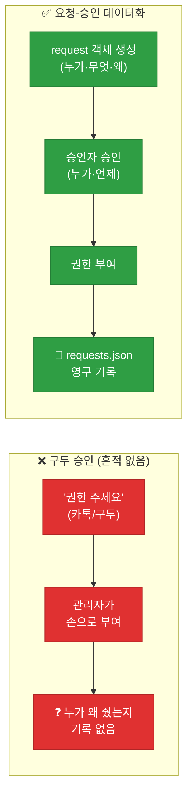
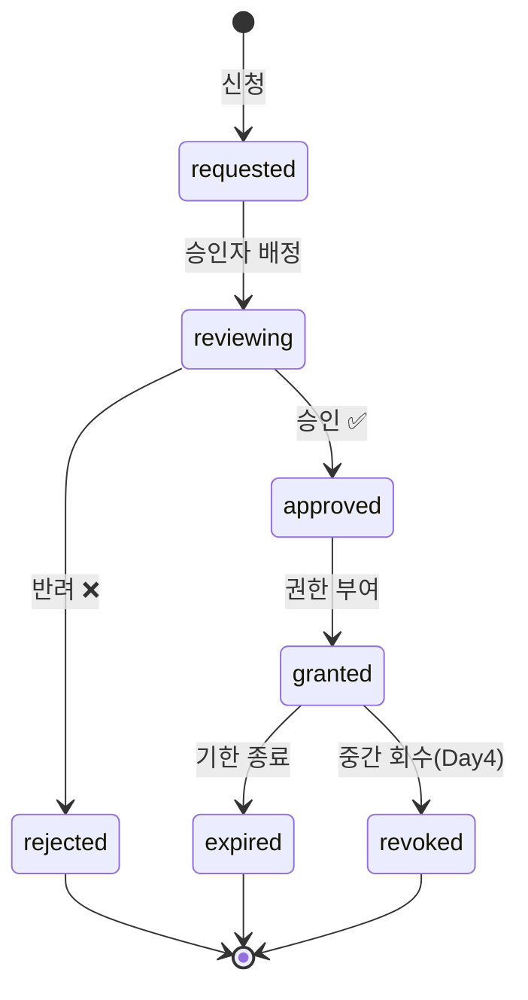
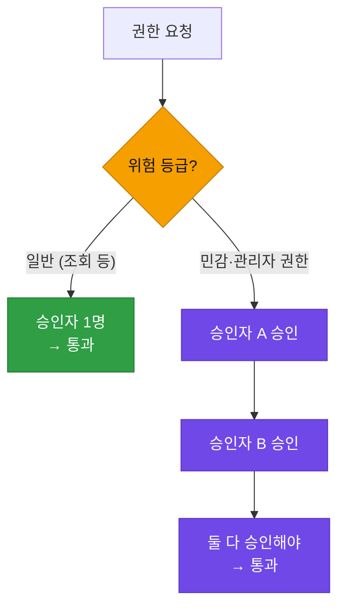

# 강의1 · 접근 요청-승인 프로세스 설계와 요청 데이터 구조 (오전, 총 120분)

> **이 교시 한 문장:** 권한을 주고받는 일을 사람의 기억이 아니라 **상태(status)를 가진 데이터**로 관리해서, "누가·언제·왜·누구 승인으로" 권한을 얻었는지 **자동으로 남게** 만듭니다.

| 시간 | 소주제 | 핵심 한 줄 |
|------|--------|-----------|
| 00-20분 | 왜 요청-승인이 필요한가 | 권한 부여에 '근거와 흔적'을 남긴다 |
| 20-45분 | 요청의 상태 단계 정의 | requested→reviewing→approved→granted→expired |
| 45-70분 | SLA와 승인자 (이중승인) | 언제까지·누가 승인하나 |
| 70-95분 | 요청 데이터 구조 설계 | 딕셔너리 하나에 모든 근거를 담기 |
| 95-120분 | 정리 & 오후 예고 | 데이터가 준비되면 로직은 쉬워진다 |

## 이 교시에 나오는 어려운 용어

| 용어 (한글발음) | 한 줄 뜻 (아주 쉽게) | 비유 |
|----------------|----------------------|------|
| **워크플로우(Workflow, 워크플로우)** | 정해진 순서로 흘러가는 업무 절차 | 민원서류 처리 단계 |
| **상태(status, 스테이터스)** | 지금 이 요청이 어느 단계에 있나 | 택배 "배송중/완료" |
| **상태 전이(state transition, 스테이트 트랜지션)** | 한 상태에서 다음 상태로 넘어감 | 신청→심사→승인 이동 |
| **상태 머신(state machine, 스테이트 머신)** | 정해진 순서로만 상태가 바뀌게 하는 규칙 | 신호등(빨강→초록만) |
| **요청(request, 리퀘스트)** | "이 권한 주세요"라는 신청 건 | 출입증 신청서 |
| **승인(approve, 어프루브)** | 요청을 허락함 | 결재 도장 |
| **반려(reject, 리젝트)** | 요청을 거절함 | 반송 도장 |
| **부여(grant, 그랜트)** | 실제로 권한을 넣어줌 | 열쇠 지급 |
| **만료(expire, 익스파이어)** | 유효기간이 끝나 무효가 됨 | 임시출입증 기한 종료 |
| **회수(revoke, 리보크)** | 줬던 권한을 도로 뺏음 | 열쇠 반납 |
| **SLA(에스엘에이)** | 언제까지 처리하겠다는 약속 시간 | "24시간 내 답변" |
| **이중승인(dual approval, 듀얼 어프루벌)** | 두 사람이 함께 승인해야 통과 | 금고 열쇠 2개 |
| **감사 추적(audit trail, 오딧 트레일)** | 나중에 되짚을 수 있는 기록 흔적 | CCTV 로그 |
| **ISO 8601(아이소 8601)** | 날짜·시간을 적는 국제 표준 형식 | `2026-09-01T14:30:00` |

---

## ⏱️ 00-20분 · 왜 요청-승인 절차가 필요한가

!!! info "📘 학습자 뷰 · 처음 보는 나"
    Day 1에서는 "kim01은 영업담당자 역할이 있으니 고객조회 가능"까지 만들었습니다.
    그런데 현실에선 질문이 하나 더 생깁니다. **"kim01은 애초에 그 역할을 어떻게 받았지?"**

    - 나쁜 방식: 관리자가 슬랙(Slack)으로 "권한 좀 주세요" 요청받고 → 손으로 넣어줌 → **기록이 안 남음**
    - 좋은 방식: **요청서(request)**를 데이터로 만들고 → 승인자가 승인 → 코드가 부여 → **전 과정이 로그로 남음**

    오늘 만드는 건 이 "좋은 방식"입니다. 핵심은 권한을 주는 행위마다 **근거(누가 요청, 누가 승인, 언제, 왜)를 데이터로 강제**하는 것입니다.

### 🔬 깊이 보기 — "기록이 없다"가 왜 사고인가

보안에서 가장 무서운 문장은 "누가 이 권한을 줬는지 모르겠어요"입니다. 아래를 비교해 보세요.



감사(audit) 상황에서 "이 계정이 재무시스템 수정 권한을 6개월째 갖고 있는데 근거가 뭐냐"는 질문이 들어옵니다. 왼쪽 방식은 답을 못 합니다. 오른쪽 방식은 `requests.json`을 열어 **"req-1001, kim01이 2026-09-01에 요청, finance_manager가 승인"**을 즉시 보여줍니다. 이게 ==감사 추적(audit trail)==입니다.

!!! example "🎓 강사 뷰 · 가르치는 나"

    - **도입 멘트:** *"Day 1이 '문에 자물쇠를 다는 법'이었다면, Day 2는 '누가 열쇠를 신청하고, 누가 내주고, 그걸 어디에 적어두는가'입니다. 자물쇠보다 이 대장(臺帳)이 감사 때 더 중요합니다."*
    - **예상 질문 & 답:**
        - *"그냥 관리자가 주면 안 돼요? 왜 절차를 만들어요?"* → 5명일 땐 됩니다. 500명·감사대상이면 "왜 줬는지" 답할 근거가 없어 사고로 이어집니다. 절차 = 자기방어 기록입니다.
        - *"이거 결재 시스템이랑 뭐가 달라요?"* → 개념은 같습니다. 우리는 그걸 **파이썬 데이터로 축소 구현**해서 원리를 이해하는 겁니다.
    - **시간 배분:** '왜'에 15분. 결재/전자문서 경험담을 물어 공감대 형성 후, "그걸 코드로 최소 구현한다"로 넘어가기.

!!! question "확인질문"
    **Q. 권한을 관리자가 그때그때 손으로 부여하는 방식의 가장 큰 문제는 무엇일까요?**

    **A.** **근거와 기록이 안 남는다**는 점입니다.

    나중에 "이 사람이 왜 이 권한을 갖고 있지?"라는 질문에 답할 수 없습니다. 요청-승인을 데이터로 만들면 "누가 요청했고, 누가 언제 승인했는지"가 자동으로 기록돼 감사에 대응할 수 있습니다.

<div class="quiz">
<p class="quiz-q"><span class="tag">퀴즈</span><b>권한 부여를 구두(카톡·전화)로 처리하지 않고 요청-승인 '데이터'로 만드는 가장 큰 이유는?</b></p>
<button class="quiz-opt">데이터로 만들면 권한 부여 속도가 빨라지기 때문</button>
<button class="quiz-opt" data-correct>누가·언제·왜 권한을 받았는지 근거가 기록으로 남아 나중에 감사에 답할 수 있기 때문</button>
<button class="quiz-opt">구두 승인은 파이썬으로 표현할 수 없기 때문</button>
<button class="quiz-opt">데이터로 만들면 승인자가 필요 없어지기 때문</button>
<div class="quiz-explain"><b>정답: 2번.</b> 핵심 가치는 속도가 아니라 '흔적(audit trail)'입니다. 승인자는 오히려 데이터로도 반드시 존재합니다(4번 오답). 감사 때 근거를 대는 능력이 요청-승인 자동화의 존재 이유입니다.</div>
<button class="quiz-retry">다시 풀기</button>
</div>

---

## ⏱️ 20-45분 · 요청의 상태 단계 정의 (상태 머신)

!!! abstract "이 블록을 마치면"
    ✔ 권한 요청이 거치는 ==상태 5~6단계를 순서대로== 말하고 ✔ 왜 '아무 순서로나' 못 바뀌게 막아야 하는지 안다

!!! info "📘 학습자 뷰 · 처음 보는 나"
    요청 하나는 살아있는 동안 **여러 단계(상태)**를 지납니다. 택배의 "접수 → 배송중 → 배송완료"처럼요.

    | 상태값 | 뜻 | 다음으로 갈 수 있는 곳 |
    |--------|-----|----------------------|
    | `requested` | 방금 신청됨 | reviewing |
    | `reviewing` | 승인자가 검토 중 | approved / rejected |
    | `approved` | 승인됨 (아직 권한은 안 들어감) | granted |
    | `rejected` | 반려됨 (끝) | — |
    | `granted` | 실제로 권한이 부여됨 | expired / revoked |
    | `expired` | 유효기간 종료 | — |
    | `revoked` | 중간에 회수됨 (Day4) | — |

    핵심 규칙: **정해진 화살표로만** 이동할 수 있습니다. `requested`에서 곧바로 `granted`로 뛰면 안 됩니다(검토·승인을 건너뛴 것이니까요).

### 🔬 깊이 보기 — 상태 머신: 순서를 어기면 코드가 막는다

이걸 **상태 머신(state machine)**이라고 합니다. 신호등이 빨강에서 바로 초록으로 못 가고 규칙대로만 바뀌는 것과 같습니다.



**왜 이렇게 막나요?** 만약 순서를 강제하지 않으면, 검토(`reviewing`)나 승인(`approved`)을 건너뛰고 곧바로 권한을 부여(`granted`)하는 코드나 실수가 가능해집니다. 그게 바로 **권한 우회**입니다. 오후(강의2)에 만들 `approve_request()`는 "지금 `reviewing`이 아니면 승인 자체를 거부"하는데, 그게 이 화살표를 코드로 강제하는 것입니다.

!!! example "🎓 강사 뷰 · 가르치는 나"

    - **비유:** *"상태값은 서류 봉투에 찍힌 도장입니다. '접수' 도장 없이 '승인' 도장을 먼저 찍을 순 없죠. 코드도 그 순서를 검사합니다."*
    - **예상 질문 & 답:**
        - *"상태를 그냥 True/False로 하면 안 돼요?"* → 안 됩니다. True/False는 2가지뿐인데 요청은 6가지 상태가 있고, "반려됨"과 "만료됨"은 둘 다 '비활성'이지만 **의미가 다릅니다**(감사 때 구분 필요).
        - *"revoked랑 expired 차이가 뭐예요?"* → `expired`는 **시간이 지나 자동 종료**, `revoked`는 **사람/봇이 의도적으로 회수**(Day4). 원인이 다릅니다.
    - **시연:** 화이트보드에 화살표를 그리고 "여기서 여기로 바로 갈 수 있나?"를 학생에게 묻기. 못 가는 화살표를 찾게 하면 상태 머신을 체득합니다.

!!! question "확인질문"
    **Q. `requested` 상태의 요청을 검토·승인 없이 바로 `granted`로 만들면 무엇이 문제일까요?**

    **A.** **검토와 승인을 건너뛴 권한 부여**가 됩니다.

    즉 아무도 "이 권한을 줘도 되는가"를 확인하지 않았는데 권한이 들어간 것입니다. 상태 머신은 `requested → reviewing → approved → granted` 순서를 강제해서, 승인 단계를 건너뛰는 우회를 코드 차원에서 막습니다.

<div class="quiz">
<p class="quiz-q"><span class="tag">퀴즈</span><b>요청의 상태를 <code>True/False</code>(활성/비활성) 두 개가 아니라 여러 단계(<code>requested·reviewing·approved·rejected·granted·expired</code>)로 나누는 이유로 가장 적절한 것은?</b></p>
<button class="quiz-opt">단계가 많을수록 시스템이 안전해진다는 규칙이 있기 때문</button>
<button class="quiz-opt" data-correct>'반려됨'과 '만료됨'처럼 겉으론 다 비활성이지만 원인이 달라, 감사·처리 시 구분이 필요하기 때문</button>
<button class="quiz-opt">파이썬은 True/False를 지원하지 않기 때문</button>
<button class="quiz-opt">상태가 많으면 승인자가 필요 없어지기 때문</button>
<div class="quiz-explain"><b>정답: 2번.</b> `rejected`(사람이 거절)와 `expired`(시간이 지나 종료)는 둘 다 '지금은 권한 없음'이지만 **원인과 후속조치가 다릅니다**. 상태를 세분화해야 "왜 이렇게 됐나"를 추적할 수 있습니다.</div>
<button class="quiz-retry">다시 풀기</button>
</div>

!!! tip "🧠 파인만 자가진단"
    안 보고 말할 수 있으면 통과입니다.

    1. 요청 상태 5~6개를 **순서대로** 나열하기
    2. `reviewing`에서 갈 수 있는 두 갈래는?
    3. `expired`와 `revoked`의 **차이**를 한 문장으로

---

## ⏱️ 45-70분 · SLA와 승인자 — 언제까지, 누가 승인하나

!!! info "📘 학습자 뷰 · 처음 보는 나"
    상태 흐름만으로는 부족합니다. 두 가지를 더 정해야 합니다.

    - **SLA(에스엘에이, Service Level Agreement)** = "이 요청은 **몇 시간 안에** 처리하겠다"는 약속. 예: 일반 권한 24시간, 민감 권한 48시간.
    - **승인자(approver)** = 누가 승인 도장을 찍나. 권한 등급에 따라 **한 명 승인** 또는 **두 명 승인(이중승인)**.

    왜 SLA가 필요할까요? SLA가 없으면 요청이 `reviewing`에 **영원히 방치**될 수 있습니다. 신청자는 하염없이 기다리고요. SLA는 "24시간 넘으면 경고 알림"의 기준이 됩니다.

### 🔬 깊이 보기 — 이중승인(dual approval): 왜 두 명인가

일반 권한은 한 명이 승인해도 됩니다. 하지만 **관리자(admin) 권한**처럼 위험한 권한은 **두 명이 함께 승인**해야 합니다.



**핵심 원리:** 한 사람이 실수하거나 매수당해도, **두 번째 사람이 막을 수 있습니다.** 은행 금고에 열쇠가 두 개인 것과 같은 원리(**분리 통제, separation of duties**)입니다. 이중승인은 위험이 큰 권한일수록 "한 사람의 판단에 전부 걸지 않는다"는 안전장치입니다.

!!! example "🎓 강사 뷰 · SLA를 감시로 연결"
    SLA는 숫자로만 두면 의미가 없고, **감시(monitoring)**와 연결돼야 합니다.
    오후에 만들 `check_sla_breach()`가 "요청 시각 + SLA 시간 < 지금"이면 '기한 초과'로 잡아냅니다.
    즉 SLA는 **알림의 방아쇠**입니다 — "24시간 지났는데 아직 reviewing인 요청 3건"을 보안팀장에게 자동 보고하는 기준이 됩니다.

!!! question "확인질문"
    **Q. 관리자 권한처럼 위험한 권한에 '이중승인(두 명 승인)'을 요구하는 이유는 무엇일까요?**

    **A.** **한 사람의 실수나 부정을 두 번째 사람이 막기 위해서**입니다.

    승인자가 한 명이면 그 사람이 잘못 판단하거나 나쁜 의도로 승인해도 그대로 통과됩니다. 두 명이 함께 승인하게 하면(이중승인), 위험한 권한일수록 검증이 한 번 더 걸립니다. 은행 금고 열쇠가 두 개인 것과 같은 원리입니다.

<div class="quiz">
<p class="quiz-q"><span class="tag">퀴즈</span><b>요청 데이터에 <code>sla_hours</code>(처리기한)를 넣어두면 나중에 어떤 자동화가 가능해지는가?</b></p>
<button class="quiz-opt">요청이 자동으로 승인된다</button>
<button class="quiz-opt">승인자가 자동으로 배정된다</button>
<button class="quiz-opt" data-correct>'요청 시각 + sla_hours'가 현재보다 이전이면 기한 초과로 자동 탐지해 알림을 보낼 수 있다</button>
<button class="quiz-opt">요청이 자동으로 삭제된다</button>
<div class="quiz-explain"><b>정답: 3번.</b> SLA는 '자동 승인'이 아니라 '기한 감시'의 기준입니다. 기한이 지나도록 처리 안 된 요청을 골라내(check_sla_breach) 담당자에게 알리는 데 씁니다. 자동 승인(1번)은 오히려 위험합니다.</div>
<button class="quiz-retry">다시 풀기</button>
</div>

---

## ⏱️ 70-95분 · 요청 데이터 구조 설계

!!! abstract "이 블록을 마치면"
    ✔ 요청 하나를 표현하는 ==딕셔너리에 어떤 필드가 왜 들어가는지== 설명할 수 있다

### 🧱 파이썬 브릿지 — 이 코드에 필요한 파이썬 (미리 5분)

| 문법 | 뜻 | 예시 |
|------|-----|------|
| `dict` `{키: 값}` | 한 요청의 여러 정보를 한 상자에 | `{'id': 'req-1001', 'status': 'requested'}` |
| `datetime.now()` | 지금 시각 객체 | `2026-09-01 14:30:00` |
| `.isoformat()` | 시각을 표준 문자열로 | `'2026-09-01T14:30:00'` |
| `str`(문자열) | 글자 데이터 | `'kim01'`, `'재무시스템'` |

> 시각을 **문자열(ISO 8601)**로 저장하는 이유: JSON 파일에 그대로 적히고, 어느 시스템에서든 다시 날짜로 읽을 수 있기 때문입니다.

### 💻 코드 완전 해부 — 요청 딕셔너리

```python
from datetime import datetime

request = {
    'id': 'req-1001',                       # ①
    'user': 'kim01',                        # ②
    'system': '재무시스템',                  # ③
    'level': '수정',                         # ④
    'status': 'requested',                  # ⑤
    'requested_at': datetime.now().isoformat(),  # ⑥
    'approver': 'finance_manager',          # ⑦
    'sla_hours': 24,                        # ⑧
}
```

| 필드 | 무엇을 담나 | 왜 필요한가 |
|:----:|-------------|-------------|
| **① id** | 요청 고유번호 | 나중에 이 요청 하나를 콕 집어 찾기 위해 |
| **② user** | 누가 요청했나 | 감사 추적의 '누가' |
| **③ system** | 어떤 자원에 대한 권한인가 | 감사 추적의 '무엇을' |
| **④ level** | 권한 수준(조회/수정/삭제) | 위험도 판단·이중승인 여부 |
| **⑤ status** | 지금 어느 단계인가 | 상태 머신의 현재 위치 |
| **⑥ requested_at** | 언제 요청했나 | SLA 계산의 기준 시각 |
| **⑦ approver** | 누가 승인하나 | 감사 추적의 '누구 승인' |
| **⑧ sla_hours** | 몇 시간 안에 처리? | 기한 초과 감시 기준 |

!!! warning "🎓 강사 뷰 · 이 필드를 빼면? (자주 나오는 질문)"

    - **`id`를 빼면?** → 요청이 100개 쌓였을 때 "3번째 요청"을 정확히 지목할 방법이 사라집니다. 고유 id는 데이터의 주민번호입니다.
    - **`requested_at`을 빼면?** → SLA(기한 초과)를 계산할 **기준 시각**이 없어 감시가 불가능해집니다.
    - **`approver`를 미리 안 정하면?** → 요청이 왔는데 "누가 승인할지"를 매번 사람이 정해야 해서 자동화가 멈춥니다.

### ✍️ 지금 직접 쳐보기 (5분)

!!! success "✍️ 직접 쳐보기 — 요청 하나 만들어 보기"
    노트북 셀에 아래를 **직접 쳐서** 실행해 봅니다.

    1. 위 `request` 딕셔너리를 그대로 쳐서 만들고, `print(request['status'])`로 현재 상태를 확인.
    2. `request['level']`을 `'삭제'`로 바꿔 보고, "이 권한은 이중승인이 필요할까?"를 말로 판단.
    3. `request2 = {...}`로 **두 번째 요청**을 `id='req-1002'`, `user='lee02'`로 만들어 봅니다.
    4. `requests = [request, request2]` 리스트에 담고 `len(requests)`로 개수 확인.

    > 🎓 강사 팁: 여기서 만든 리스트가 오후에 `requests.json`으로 **파일 저장**됩니다. "데이터를 먼저 잘 설계하면 로직은 쉬워진다"를 체감시키세요.

!!! question "확인질문"
    **Q. 요청 딕셔너리에서 `requested_at`(요청 시각)을 빼면, 어떤 자동화가 불가능해질까요?**

    **A.** **SLA(기한 초과) 감시**가 불가능해집니다.

    "요청 시각 + 처리기한(sla_hours)"이 지금보다 이전인지를 계산해서 기한 초과를 잡아내는데, 기준이 되는 요청 시각이 없으면 이 계산 자체를 할 수 없습니다.

<div class="quiz">
<p class="quiz-q"><span class="tag">퀴즈</span><b>요청 데이터에 <code>id</code>(고유번호) 필드를 반드시 넣는 이유로 가장 적절한 것은?</b></p>
<button class="quiz-opt">id가 있으면 요청이 자동으로 승인되기 때문</button>
<button class="quiz-opt" data-correct>요청이 여러 개 쌓여도 특정 요청 하나를 정확히 지목해 조회·수정·추적할 수 있기 때문</button>
<button class="quiz-opt">id는 파이썬 딕셔너리의 필수 문법이기 때문</button>
<button class="quiz-opt">id가 있으면 SLA를 계산할 수 있기 때문</button>
<div class="quiz-explain"><b>정답: 2번.</b> 고유 id는 데이터의 '주민번호'로, 수많은 요청 중 하나를 콕 집어내는 열쇠입니다. SLA 계산은 `requested_at`이 담당하고(4번 오답), 딕셔너리에 id가 문법상 필수는 아닙니다(3번 오답).</div>
<button class="quiz-retry">다시 풀기</button>
</div>

---

## ⏱️ 95-120분 · 정리 & 오후 예고

!!! abstract "이 블록을 마치면"
    ✔ 오전에 만든 '데이터 설계'가 오후의 '로직'으로 어떻게 이어지는지 안다

**오전 정리:**

1. 권한 부여는 **근거·흔적**을 남겨야 한다 → 요청-승인을 데이터로
2. 요청은 **상태 머신**(requested→reviewing→approved→granted→expired)으로 흐른다
3. **SLA**(처리기한)와 **이중승인**(위험 권한)으로 안전장치를 건다
4. 요청 하나를 **딕셔너리**로 설계했다(id·user·system·level·status·requested_at·approver·sla_hours)

!!! tip "🎓 강사 뷰 · 오후로 넘어가는 다리"
    *"오전에 '데이터 그릇'을 잘 설계했으니, 오후엔 그 그릇을 다루는 '숟가락(함수)'을 만듭니다.
    `approve_request()`(승인), `check_sla_breach()`(기한 감시), 그리고 Day1의 `evaluate_access()`를 불러 '정책까지 통과해야 승인'하는 연동을 봅니다. 데이터를 잘 만들어 두면 로직은 놀랄 만큼 짧아집니다."*

!!! question "확인질문"
    **Q. 오전에 요청 데이터 구조를 먼저 설계하고 오후에 로직을 만드는 순서가, 반대 순서보다 나은 이유는?**

    **A.** **다룰 데이터의 모양이 확정돼야 로직이 단순해지기 때문**입니다.

    승인 함수가 `status`를 바꾸려면 `status` 필드가 이미 있어야 하고, SLA 감시가 계산하려면 `requested_at`·`sla_hours`가 있어야 합니다. 데이터를 먼저 잘 설계하면 함수는 "그 필드를 읽고 바꾸기"만 하면 돼서 짧고 명확해집니다.

---

## ✅ 가르칠 준비 체크리스트 (강의1)

- [ ] 구두 승인의 문제(기록 없음)를 예로 설명한다
- [ ] 요청 상태 5~6단계를 순서대로 그린다
- [ ] 상태 머신이 '순서 건너뛰기'를 막는다는 걸 설명한다
- [ ] SLA와 이중승인의 목적을 각각 설명한다
- [ ] 요청 딕셔너리 8개 필드가 각각 왜 필요한지 말한다
- [ ] `id`·`requested_at`을 빼면 무엇이 안 되는지 설명한다
- [ ] 확인질문 5개 + 퀴즈에 답한다

*[SLA]: Service Level Agreement — 처리 기한 약속
*[RBAC]: Role-Based Access Control — 역할 기반 접근통제
*[ISO 8601]: 날짜·시간 국제 표준 표기(YYYY-MM-DDThh:mm:ss)
