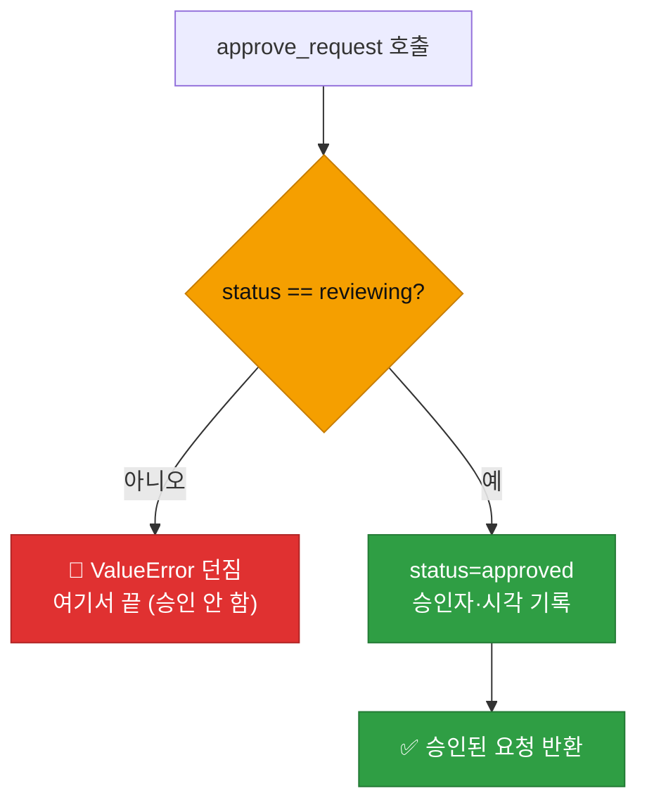
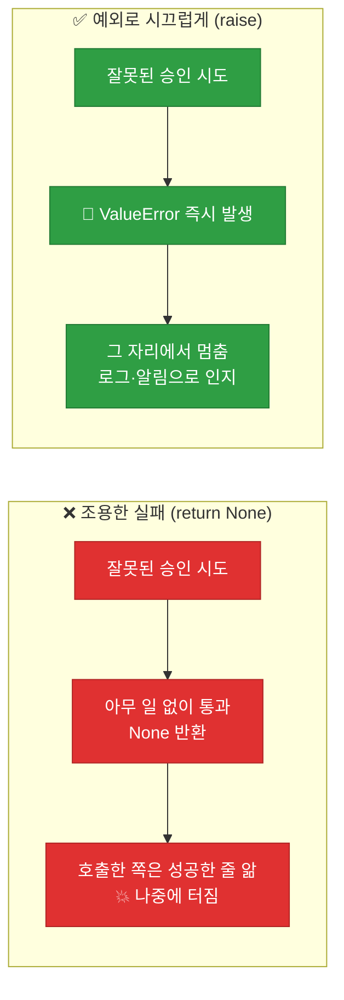
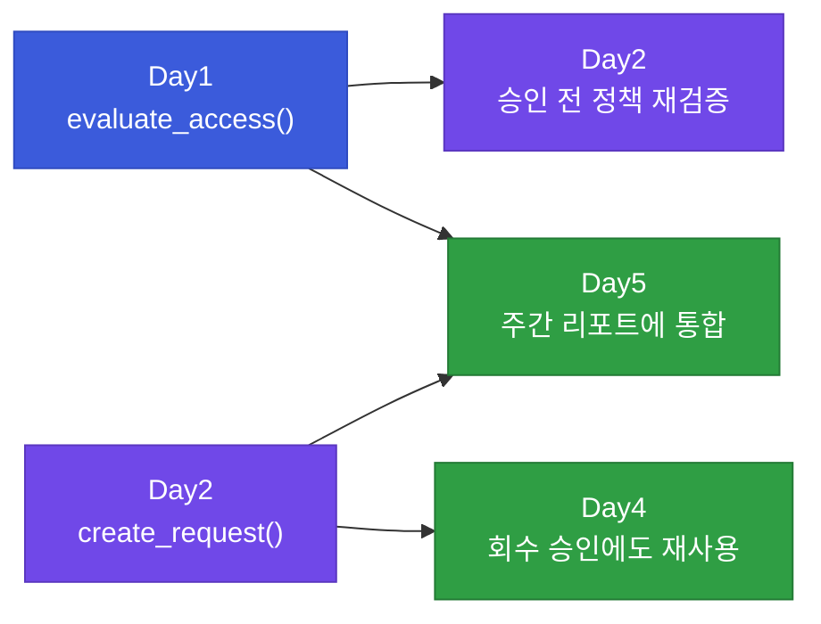

# 강의2 · 승인 함수·SLA 감시·정책 연동 구현 (오후, 총 120분)

> **이 교시 한 문장:** 오전에 설계한 요청 데이터를, **상태를 안전하게 바꾸는 함수(`approve_request`)** 와 **기한을 감시하는 함수(`check_sla_breach`)** 로 다루고, Day1의 `evaluate_access()`를 연동해 "**정책까지 통과해야 승인**"되게 만듭니다.

| 시간 | 소주제 | 핵심 한 줄 |
|------|--------|-----------|
| 00-25분 | `approve_request()` — 상태 전이 검증 | 잘못된 상태면 승인 자체를 거부 |
| 25-50분 | 왜 예외(ValueError)를 던지나 | 조용히 실패하지 않고 시끄럽게 막기 |
| 50-75분 | `check_sla_breach()` — 기한 감시 | 시간 계산으로 지연 요청 색출 |
| 75-100분 | `requests.json` 저장 & 정책 연동 | 승인 전에 evaluate_access로 재검증 |
| 100-120분 | 정리 & 실습 안내 | 요청→승인→부여 한 바퀴 |

## 이 교시에 나오는 어려운 용어

| 용어 (한글발음) | 한 줄 뜻 (아주 쉽게) | 비유 |
|----------------|----------------------|------|
| **예외(Exception, 익셉션)** | 문제 상황을 알리며 코드를 멈추는 신호 | 화재경보 |
| **`raise`(레이즈)** | 예외를 일부러 발생시키다 | 경보 버튼 누르기 |
| **`ValueError`(밸류에러)** | "값이 잘못됐다"는 표준 예외 | "규격 미달" 딱지 |
| **가드 절(guard clause, 가드 클로즈)** | 함수 앞에서 잘못된 입력을 먼저 걸러냄 | 입구 검문소 |
| **조용한 실패(silent failure)** | 문제가 나도 아무 티 안 나는 것 | 소리 안 나는 경보 |
| **`timedelta`(타임델타)** | 시간의 '차이/길이'를 나타냄 | "3시간 뒤" |
| **직렬화(serialize, 시리얼라이즈)** | 데이터를 파일에 적을 형태로 바꿈 | 짐을 상자에 포장 |
| **`json.dump`(제이슨 덤프)** | 파이썬 데이터를 JSON 파일로 저장 | 상자에 담아 보관 |
| **`ensure_ascii=False`** | 한글이 깨지지 않게 그대로 저장 | 한글 라벨 유지 |
| **원자성(atomicity, 애터미시티)** | 다 되든 아무것도 안 되든, 중간은 없음 | 계좌이체(둘 다 or 취소) |
| **정책 연동(policy integration)** | 승인 전에 정책 규칙도 확인 | 도장 전 규정 재확인 |
| **PDP(피디피)** | 접근 가부를 판단하는 부품(Day1) | 심사관 |

---

## ⏱️ 00-25분 · `approve_request()` — 상태 전이 검증

!!! info "📘 학습자 뷰 · 처음 보는 나"
    승인이란 요청의 `status`를 `reviewing` → `approved`로 바꾸는 일입니다.
    그런데 **아무 요청이나 승인하면 안 됩니다.** 이미 반려된 요청, 이미 부여된 요청을 또 승인하면 이상하죠.
    그래서 `approve_request()`는 **"지금 `reviewing` 상태인지 먼저 확인"**한 뒤에만 승인합니다.

### 💻 코드 완전 해부 — `approve_request()` 한 줄씩

```python
def approve_request(request, approver):
    if request['status'] != 'reviewing':                       # ①
        raise ValueError(f"승인 불가: 현재 상태 {request['status']}")  # ②
    request['status'] = 'approved'                             # ③
    request['approved_by'] = approver                         # ④
    request['approved_at'] = datetime.now().isoformat()       # ⑤
    return request                                            # ⑥
```

| 줄 | 이 줄이 하는 일 | 왜 이렇게 |
|:--:|----------------|-----------|
| **①** | 지금 상태가 `reviewing`이 **아닌지** 검사 | 검토 중인 요청만 승인 가능(상태 머신 강제) |
| **②** | 아니면 **에러를 던지고 즉시 중단** | 잘못된 승인을 **조용히 넘기지 않음** |
| **③** | 통과 시 상태를 `approved`로 변경 | 실제 승인 처리 |
| **④** | **누가** 승인했는지 기록 | 감사 추적('누구 승인') |
| **⑤** | **언제** 승인했는지 기록 | 감사 추적('언제') |
| **⑥** | 바뀐 요청을 돌려줌 | 다음 단계(부여)로 넘기기 위해 |

**①②가 이 함수의 심장입니다.** "reviewing이 아니면 승인 못 한다"는 규칙이 상태 머신의 화살표를 코드로 지키는 부분입니다.

!!! example "🎓 강사 뷰 · ①의 조건을 눈여겨보게 하기"
    - `!=` (같지 않다)를 쓴 이유: "**허용 상태(reviewing)가 아니면 전부 거부**"라는 **화이트리스트** 사고입니다. `if status == 'rejected'`처럼 나쁜 상태를 하나씩 막으면(블랙리스트) 빠뜨린 상태가 생깁니다.
    - 학생에게 물어보기: *"이미 `approved`된 요청을 또 `approve_request()`에 넣으면?"* → ① 검사에 걸려 에러. **이중 승인 방지**가 공짜로 따라옵니다.

### 🔬 깊이 보기 — 가드 절(guard clause): 나쁜 입력을 문 앞에서 막기

①②처럼 **함수 맨 앞에서 조건을 검사해 잘못된 경우 즉시 빠져나가는 것**을 가드 절이라고 합니다.



가드 절이 없으면 잘못된 요청도 아래로 흘러가 `status`를 덮어써 버립니다. 문 앞(가드)에서 걸러내면 **본문 로직은 "정상 입력"만 신경 쓰면 되므로 단순·안전**해집니다.

!!! question "확인질문"
    **Q. `approve_request()`가 맨 앞에서 `status == 'reviewing'`을 먼저 확인하는 이유는?**

    **A.** **검토 중인 요청만 승인하도록 상태 순서를 강제하기 위해서**입니다.

    이 검사가 없으면 이미 반려됐거나 이미 부여된 요청도 다시 승인돼 상태가 뒤죽박죽이 됩니다. 문 앞에서 "지금 reviewing이 맞나"를 확인해(가드 절), 잘못된 상태의 요청은 아예 본문에 들어오지 못하게 막습니다.

<div class="quiz">
<p class="quiz-q"><span class="tag">퀴즈</span><b><code>approve_request()</code>에서 <code>if request['status'] != 'reviewing'</code> 검사를 <b>지우면</b> 생기는 문제로 가장 적절한 것은?</b></p>
<button class="quiz-opt">함수가 실행되지 않는다</button>
<button class="quiz-opt" data-correct>이미 반려·부여된 요청도 다시 'approved'로 덮어써져 상태 순서가 무너진다</button>
<button class="quiz-opt">모든 요청이 자동으로 반려된다</button>
<button class="quiz-opt">승인 속도가 느려진다</button>
<div class="quiz-explain"><b>정답: 2번.</b> 이 가드 절은 상태 머신의 순서를 지키는 장치입니다. 지우면 어떤 상태의 요청이든 무조건 approved로 바뀌어, 검토·반려 이력이 뭉개집니다.</div>
<button class="quiz-retry">다시 풀기</button>
</div>

---

## ⏱️ 25-50분 · 왜 예외(ValueError)를 던지나 — '조용한 실패'의 위험

!!! info "📘 학습자 뷰 · 처음 보는 나"
    잘못된 승인을 만났을 때 함수가 할 수 있는 선택은 두 가지입니다.

    - **A. 조용히 아무것도 안 함** (`return None`) — 겉보기엔 문제없어 보임
    - **B. 시끄럽게 에러를 던짐** (`raise ValueError`) — 즉시 멈추고 알림

    보안에서는 **B가 맞습니다.** 잘못된 상태 전이는 "그냥 넘어가면" 안 되고, **누군가 반드시 알아채야** 하는 사건이니까요.

### 🔬 깊이 보기 — 조용한 실패(silent failure)가 부르는 사고



**조용한 실패의 무서움:** 승인이 실패했는데 호출한 코드는 "성공했다"고 착각하고 다음 단계(권한 부여)로 넘어갑니다. 문제가 **한참 뒤 엉뚱한 곳에서** 터져 원인 찾기가 지옥이 됩니다. 예외를 던지면 **문제가 난 바로 그 줄**에서 멈추므로 원인이 명확합니다.

!!! example "🎓 강사 뷰 · ValueError를 고른 이유"
    - 파이썬엔 여러 예외가 있는데, **"값이 잘못됨"**엔 `ValueError`가 표준입니다. 상태값이 규칙에 안 맞으니 딱 맞죠.
    - 실무 팁: 에러 메시지에 `{request['status']}`를 넣어 **"무엇이 잘못됐는지"**를 담습니다. `"승인 불가"`만 있으면 디버깅이 어렵고, `"승인 불가: 현재 상태 rejected"`면 즉시 원인이 보입니다.

!!! question "확인질문"
    **Q. 잘못된 승인 시도에 대해 `raise ValueError`로 에러를 던지는 것이, 그냥 아무 일도 안 하는 것보다 나은 이유는?**

    **A.** **문제를 바로 그 자리에서 드러내기 때문**입니다.

    조용히 넘기면 호출한 쪽은 승인이 된 줄 알고 다음 단계로 넘어가, 문제가 한참 뒤 엉뚱한 곳에서 터집니다. 예외를 던지면 잘못된 승인이 일어난 바로 그 줄에서 멈추고 로그·알림으로 알 수 있어, 원인 파악과 대응이 빨라집니다.

<div class="quiz">
<p class="quiz-q"><span class="tag">퀴즈</span><b>보안 처리 함수에서 잘못된 입력에 대해 '조용히 <code>None</code> 반환'보다 '예외를 던지기'가 권장되는 핵심 이유는?</b></p>
<button class="quiz-opt">예외를 던지면 코드가 더 빨라지기 때문</button>
<button class="quiz-opt">None은 파이썬에서 사용할 수 없기 때문</button>
<button class="quiz-opt" data-correct>실패가 감춰지지 않고 즉시 드러나, 잘못된 상태로 다음 단계가 진행되는 것을 막기 때문</button>
<button class="quiz-opt">예외를 던지면 승인이 자동으로 완료되기 때문</button>
<div class="quiz-explain"><b>정답: 3번.</b> 보안에서 '조용한 실패'는 위험합니다. 실패를 숨기면 잘못된 권한 부여로 이어질 수 있으니, 예외로 즉시 멈추게 하는 편이 안전합니다.</div>
<button class="quiz-retry">다시 풀기</button>
</div>

---

## ⏱️ 50-75분 · `check_sla_breach()` — 기한 초과 요청 감시

!!! abstract "이 블록을 마치면"
    ✔ 시각 계산으로 ==기한을 넘긴 요청을 자동으로 골라내는== 함수를 이해한다

### 🧱 파이썬 브릿지 — 시간 계산 (미리 5분)

| 문법 | 뜻 | 예시 |
|------|-----|------|
| `datetime.fromisoformat(s)` | 문자열을 다시 시각으로 | `'2026-09-01T14:30' → datetime` |
| `datetime.now()` | 지금 시각 | 현재 |
| `timedelta(hours=24)` | 24시간이라는 '길이' | 기한 |
| 시각 + timedelta | 마감 시각 계산 | 요청시각 + 24h = 마감 |
| 시각 비교 `<` | 어느 쪽이 먼저인가 | 마감 < 지금 → 초과 |

### 💻 코드 완전 해부 — `check_sla_breach()`

```python
from datetime import datetime, timedelta

def check_sla_breach(requests):
    breached = []                                             # ①
    now = datetime.now()                                     # ②
    for r in requests:                                       # ③
        if r['status'] != 'reviewing':                      # ④
            continue
        requested = datetime.fromisoformat(r['requested_at'])# ⑤
        deadline = requested + timedelta(hours=r['sla_hours'])# ⑥
        if deadline < now:                                  # ⑦
            breached.append(r)                              # ⑧
    return breached                                         # ⑨
```

| 줄 | 하는 일 | 왜 |
|:--:|---------|-----|
| **①** | 기한 초과 요청을 담을 빈 목록 | 결과 모으기 |
| **②** | '지금'을 한 번만 계산 | 반복마다 재계산 안 하려고 |
| **③** | 모든 요청을 하나씩 | 전수 검사 |
| **④** | `reviewing`이 아니면 건너뜀 | 이미 처리된 건 감시 대상 아님 |
| **⑤** | 저장된 문자열을 시각으로 복원 | 계산하려면 시각 객체 필요 |
| **⑥** | 요청시각 + 기한 = **마감시각** | SLA를 실제 시각으로 |
| **⑦** | 마감이 지금보다 **이전**이면 = 초과 | 기한 넘김 판정 |
| **⑧** | 초과 요청을 결과에 추가 | 색출 |
| **⑨** | 초과 목록 반환 | 알림·리포트로 넘기기 |

!!! warning "🎓 강사 뷰 · ④를 빼면?"
    ④ `if status != 'reviewing': continue`를 빼면, **이미 승인·반려된 요청까지** 기한 초과로 잡습니다. SLA 감시는 **아직 처리 안 된(reviewing)** 요청에만 의미가 있으니, ④가 감시 대상을 올바르게 좁혀 줍니다.

### ✍️ 지금 직접 쳐보기 (5분) — 경계값 실험

!!! success "✍️ 직접 쳐보기 — 기한 딱 걸치는 순간"
    1. 요청 하나를 만들되 `requested_at`을 **25시간 전**으로 직접 넣어 봅니다.
       ```python
       from datetime import datetime, timedelta
       past = (datetime.now() - timedelta(hours=25)).isoformat()
       req = {'status':'reviewing', 'requested_at': past, 'sla_hours': 24}
       ```
    2. `check_sla_breach([req])`를 실행 → 결과에 잡히나요? (24시간 기한을 25시간이 넘었으니 **잡혀야** 정상)
    3. `sla_hours`를 `48`로 바꿔 다시 실행 → 이번엔 안 잡히죠? (25시간 < 48시간)
    4. `status`를 `'approved'`로 바꿔 실행 → ④ 때문에 안 잡힘을 확인.

    > 🎓 강사 팁: **경계값(딱 걸치는 시간)**을 직접 만들어 보면 "부등호 방향(`<` vs `<=`)"의 미묘함을 체감합니다. 시험에도 자주 나오는 지점입니다.

!!! question "확인질문"
    **Q. `check_sla_breach()`가 `status != 'reviewing'`인 요청을 건너뛰는(`continue`) 이유는?**

    **A.** **아직 처리 안 된 요청만 기한 감시 대상이기 때문**입니다.

    이미 승인·반려·부여된 요청은 처리가 끝난 것이라, 기한을 넘겼는지 따질 필요가 없습니다. 검토 중(reviewing)인 요청만 "제때 처리되고 있나"를 확인하면 됩니다.

<div class="quiz">
<p class="quiz-q"><span class="tag">퀴즈</span><b><code>deadline = requested + timedelta(hours=r['sla_hours'])</code> 뒤에 <code>if deadline < now</code>로 판정하는 것의 의미는?</b></p>
<button class="quiz-opt">요청이 미래에 처리될 예정이라는 뜻</button>
<button class="quiz-opt" data-correct>마감 시각이 이미 현재보다 과거 = 기한을 넘겼다는 뜻</button>
<button class="quiz-opt">요청 시각이 잘못 입력됐다는 뜻</button>
<button class="quiz-opt">SLA가 0시간이라는 뜻</button>
<div class="quiz-explain"><b>정답: 2번.</b> '요청시각 + 기한'이 마감입니다. 그 마감이 '지금'보다 이전(<)이면 이미 기한을 넘긴 것이죠. 부등호 방향이 판정의 핵심입니다.</div>
<button class="quiz-retry">다시 풀기</button>
</div>

---

## ⏱️ 75-100분 · `requests.json` 저장과 정책 연동

!!! abstract "이 블록을 마치면"
    ✔ 요청을 ==파일로 영구 저장==하고 ✔ 승인 전에 ==Day1 정책을 재검증==하는 이유를 안다

### 요청을 파일로 — `json.dump`

```python
import json

def save_requests(requests, path='config/requests.json'):
    with open(path, 'w', encoding='utf-8') as f:
        json.dump(requests, f, ensure_ascii=False, indent=2)
```

- `ensure_ascii=False` → **한글이 `\uXXXX`로 깨지지 않고** '재무시스템' 그대로 저장됩니다.
- `indent=2` → 사람이 읽기 좋게 들여쓰기.
- 이렇게 저장해두면 프로그램을 껐다 켜도 요청 이력이 남습니다(감사 추적의 실체).

### 💻 코드 완전 해부 — 정책 연동 승인 `approve_request_with_policy_check()`

승인 도장을 찍기 전에, **Day1의 `evaluate_access()`로 "이 사람이 정책상 이 자원에 접근 가능한가"를 한 번 더 확인**합니다.

```python
def approve_request_with_policy_check(request, approver, roles, user_roles, policy):
    allowed = evaluate_access(request['user'], request['system'],  # ①
                              roles, user_roles, policy)
    if not allowed:                                                # ②
        request['status'] = 'rejected'                            # ③
        request['reject_reason'] = '정책 위반'                     # ④
        return request
    return approve_request(request, approver)                     # ⑤
```

| 줄 | 하는 일 | 왜 |
|:--:|---------|-----|
| **①** | Day1의 `evaluate_access()` **재사용**해 정책 판단 | 승인자 판단 + 정책 판단, **이중 검증** |
| **②** | 정책상 불가면 | 승인자가 실수로 눌러도 정책이 막음 |
| **③④** | 자동 반려 + 사유 기록 | 왜 막혔는지 흔적 |
| **⑤** | 정책 통과 시에만 실제 승인 | 정상 승인 진행 |

!!! example "🎓 강사 뷰 · '이중 검증'의 의미"
    - 승인자(사람)도 실수할 수 있습니다. `evaluate_access()`(정책 코드)를 승인 앞단에 두면, **사람이 잘못 승인해도 정책이 최종 방어선**이 됩니다.
    - 이게 어제(Day1) 만든 함수를 **오늘 그대로 불러 쓰는** 첫 사례입니다. *"우리가 만드는 함수들이 레고 블록처럼 서로 끼워진다"*를 강조하세요. Day4에선 `create_request()`가 회수에도 재사용됩니다.

### 🔬 깊이 보기 — 함수 재사용이 만드는 '모듈'



각 Day의 함수가 **다음 Day에서 재사용**되며 하나의 `access_control` 모듈로 쌓입니다. "한 번 잘 만든 함수는 계속 재활용된다"는 게 오늘의 큰 그림입니다.

!!! question "확인질문"
    **Q. 승인 도장을 찍기 전에 Day1의 `evaluate_access()`(정책 판단)를 한 번 더 호출하면 무엇이 좋아질까요?**

    **A.** **승인자(사람)의 판단과 정책(코드)의 판단이 이중으로 걸립니다.**

    승인자가 실수로 승인 버튼을 눌러도, 정책상 접근이 안 되는 요청이면 코드가 자동으로 반려합니다. 사람의 실수를 코드가 막아주는 최종 방어선이 되는 것입니다.

<div class="quiz">
<p class="quiz-q"><span class="tag">퀴즈</span><b><code>json.dump(...)</code>에 <code>ensure_ascii=False</code>를 주는 이유는?</b></p>
<button class="quiz-opt">파일 크기를 줄이기 위해</button>
<button class="quiz-opt" data-correct>'재무시스템' 같은 한글이 \uXXXX로 깨지지 않고 그대로 저장돼 사람이 읽을 수 있게 하기 위해</button>
<button class="quiz-opt">JSON을 자동으로 암호화하기 위해</button>
<button class="quiz-opt">저장 속도를 높이기 위해</button>
<div class="quiz-explain"><b>정답: 2번.</b> 기본값(ensure_ascii=True)이면 한글이 유니코드 escape로 저장돼 사람이 못 읽습니다. False로 두면 한글 원문이 그대로 남아 감사·확인이 쉽습니다.</div>
<button class="quiz-retry">다시 풀기</button>
</div>

!!! tip "🧠 파인만 자가진단"
    안 보고 말할 수 있으면 통과입니다.

    1. `approve_request()`가 **맨 먼저** 확인하는 것과, 통과 못 하면 하는 일
    2. '조용한 실패'가 왜 위험한지 한 문장으로
    3. `check_sla_breach()`가 요청을 '기한 초과'로 판정하는 조건 한 줄
    4. 승인 전에 `evaluate_access()`를 부르는 이유

---

## ⏱️ 100-120분 · 정리 & 실습 안내

**오후 정리:**

1. `approve_request()` — **가드 절**로 `reviewing`만 승인, 아니면 **`ValueError`**
2. 예외를 던져 **조용한 실패**를 피한다(문제를 그 자리에서 드러냄)
3. `check_sla_breach()` — 요청시각+기한 vs 지금을 비교해 **지연 요청 색출**
4. `requests.json`에 저장(`ensure_ascii=False`)해 **감사 추적**
5. 승인 전 `evaluate_access()` 재검증 = **사람+정책 이중 방어**

!!! note "실습 예고 (오후 실습 120분)"
    `request_flow.py`에 `create_request()`·`approve_request()`·`check_sla_breach()`를 완성하고,
    요청 3건(정상 승인 / 정책 위반 자동 반려 / SLA 초과)을 만들어 한 바퀴 돌려 봅니다.
    상세 단계는 [실습 페이지](practice.md)에서.

!!! question "확인질문"
    **Q. 오늘 만든 `create_request()`가 Day4에서 '권한 회수 승인'에도 그대로 쓰인다는 것은 무엇을 보여줄까요?**

    **A.** **잘 설계한 함수는 상황이 달라도 재사용된다**는 것을 보여줍니다.

    '요청-승인'이라는 구조는 권한을 줄 때든 뺏을 때든 똑같이 필요합니다. `create_request()`를 처음부터 범용으로 만들어 두었기 때문에, Day4에서 회수 승인 요청을 만들 때 새로 짜지 않고 그대로 불러 쓸 수 있습니다. 이것이 모듈화의 힘입니다.

---

## ✅ 가르칠 준비 체크리스트 (강의2)

- [ ] `approve_request()`의 가드 절(①②)을 한 줄씩 설명한다
- [ ] `!=`로 '허용 상태만 통과'시키는 화이트리스트 사고를 설명한다
- [ ] '조용한 실패' vs '예외 던지기'를 비교 설명한다
- [ ] `check_sla_breach()`의 시각 계산(⑤⑥⑦)을 설명한다
- [ ] 경계값(딱 걸치는 시간) 실험을 직접 돌려 본다
- [ ] `ensure_ascii=False`의 효과를 설명한다
- [ ] 승인 전 `evaluate_access()` 연동의 '이중 방어'를 설명한다
- [ ] 확인질문 5개 + 퀴즈에 답한다

*[PDP]: Policy Decision Point — 접근 가부를 판단하는 부품(Day1의 evaluate_access)
*[SLA]: Service Level Agreement — 처리 기한 약속
*[JSON]: JavaScript Object Notation — 키·값 데이터 형식
