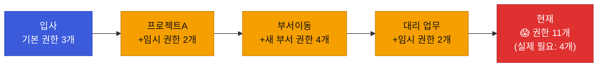
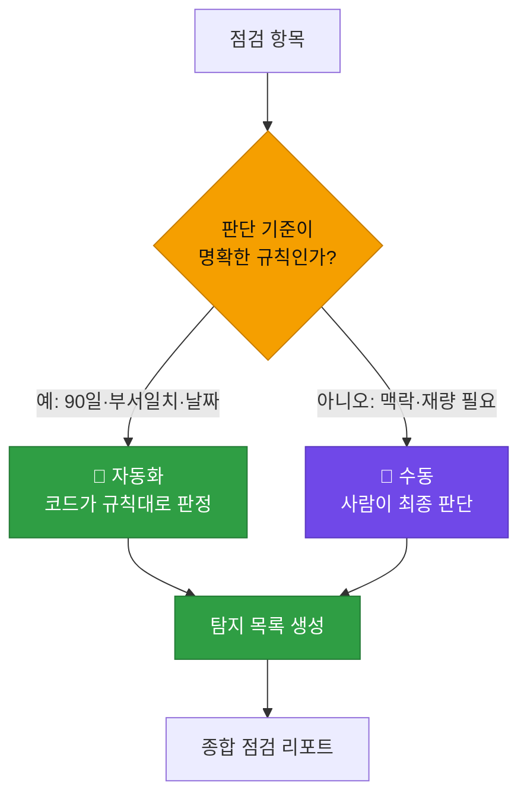
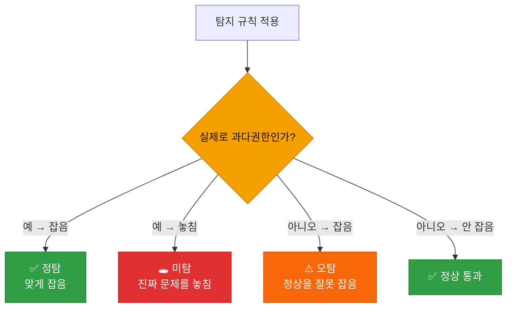
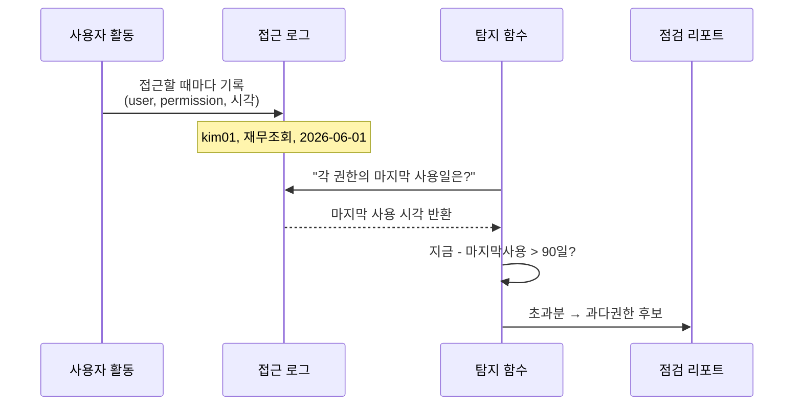

# 강의1 · 정기 점검의 필요성과 과다권한 탐지 전략 (오전, 총 120분)

> **이 교시 한 문장:** 권한은 주기만 하고 안 걷으면 시간이 갈수록 쌓여 위험해집니다. 왜 **정기 점검(access review)** 이 필요한지, **과다권한(Over-privilege)** 이 무엇이며 어떤 **신호**로 탐지하는지를 배웁니다.

| 시간 | 소주제 | 핵심 한 줄 |
|------|--------|-----------|
| 00-20분 | 왜 정기 점검이 필요한가 | 권한은 주기만 하면 계속 쌓인다 |
| 20-45분 | 점검 주기와 항목 | 무엇을 얼마나 자주 보나 |
| 45-75분 | 과다권한(Over-privilege) 정의 | '필요 이상'을 어떻게 정의하나 |
| 75-100분 | 탐지 접근법 3가지 | 미사용·부서불일치·예외만료 |
| 100-120분 | 정리 & 오후 예고 | 신호를 코드로 바꾸기 |

## 이 교시에 나오는 어려운 용어

| 용어 (한글발음) | 한 줄 뜻 (아주 쉽게) | 비유 |
|----------------|----------------------|------|
| **정기 점검(access review, 액세스 리뷰)** | 준 권한이 아직 적절한지 주기적으로 재확인 | 정기 건강검진 |
| **과다권한(Over-privilege, 오버 프리빌리지)** | 필요 이상으로 많이 가진 권한 | 안 쓰는 방 열쇠 다 들고 다님 |
| **권한 크리프(privilege creep, 프리빌리지 크맆)** | 권한이 슬금슬금 쌓이는 현상 | 이사 다녀도 안 버린 짐 |
| **최소권한(least privilege, 리스트 프리빌리지)** | 꼭 필요한 권한만 갖기 | 필요한 열쇠만 |
| **미사용 권한(unused permission)** | 오래 안 쓴 권한 | 몇 달째 안 연 서랍 |
| **부서 불일치(dept mismatch)** | 지금 부서와 안 맞는 권한 | 이사 갔는데 옛집 열쇠 |
| **예외 만료(exception expiry)** | 임시 허가의 기한 종료 | 임시출입증 기한 끝 |
| **접근 로그(access log, 액세스 로그)** | 누가 언제 무엇에 접근했나 기록 | 출입 기록부 |
| **탐지(detection, 디텍션)** | 이상한 것을 찾아냄 | CCTV로 발견 |
| **오탐(false positive, 폴스 포지티브)** | 정상인데 이상하다고 잘못 잡음 | 멀쩡한데 알람 울림 |
| **미탐(false negative, 폴스 네거티브)** | 진짜 문제인데 못 잡음 | 도둑을 놓침 |
| **경계값(boundary value)** | 기준에 딱 걸치는 값(예: 90일째) | 정확히 마감일 |
| **컴플라이언스(compliance, 컴플라이언스)** | 법·규정 준수 | 규칙 지키기 |

---

## ⏱️ 00-20분 · 왜 정기 점검이 필요한가

!!! info "📘 학습자 뷰 · 처음 보는 나"
    권한은 **줄 때는 신경 쓰지만, 걷을 때는 잘 잊습니다.** 그래서 시간이 지나면 이런 일이 생깁니다.

    - 프로젝트 때문에 임시로 준 권한을 → 프로젝트 끝나도 **안 걷음**
    - 부서를 옮겼는데 → 옛 부서 권한이 **그대로 남음**
    - 퇴사했는데 → 계정이 **살아 있음**

    이렇게 슬금슬금 권한이 쌓이는 걸 **권한 크리프(privilege creep)** 라고 합니다.
    Day1의 '최소권한(꼭 필요한 만큼만)'을 **유지하려면**, 주기적으로 "이 권한 아직 필요해?"를 되물어야 합니다. 그게 **정기 점검(access review)** 입니다.

### 🔬 깊이 보기 — 권한 크리프: 왜 저절로 쌓이나

권한을 **더할 이유**는 업무마다 계속 생기지만, **뺄 이유**는 아무도 챙기지 않습니다. 그래서 그냥 두면 권한은 **단조 증가**합니다. 위 사람은 지금 실제로 4개만 필요한데 11개를 갖고 있죠. 이 7개의 초과분이 ==과다권한==이고, 공격자가 이 계정을 탈취하면 그 11개 전부가 무기가 됩니다.

!!! example "🎓 강사 뷰 · 가르치는 나"

    - **도입 멘트:** *"권한은 살찌기 쉽고 빼기 어렵습니다. 정기 점검은 권한의 '다이어트'예요. 안 하면 계정 하나하나가 비대해져서, 털렸을 때 피해가 커집니다."*
    - **공감 질문:** *"여러분 회사 계정, 지금도 예전 프로젝트 권한 남아 있지 않나요?"* → 대부분 그렇습니다. 실감시키기 좋은 질문.
    - **연결:** Day1 최소권한이 '이상(理想)'이라면, 오늘 점검은 그 이상을 **시간이 지나도 유지하는 실천**입니다.

!!! question "확인질문"
    **Q. 권한을 한번 주고 나서 정기적으로 점검하지 않으면, 시간이 지날수록 어떤 문제가 쌓일까요?**

    **A.** **권한이 필요 이상으로 계속 쌓입니다(권한 크리프).**

    권한은 업무 때문에 더할 일은 많은데 뺄 일은 아무도 챙기지 않아, 그냥 두면 계속 늘어납니다. 그 결과 실제 필요보다 훨씬 많은 권한을 가진 '과다권한' 계정이 생기고, 이 계정이 털리면 피해 범위가 그만큼 커집니다.

퀴즈<b>'권한 크리프(privilege creep)'가 시간이 지나며 저절로 심해지는 근본 이유로 가장 적절한 것은?</b>

<button class="quiz-opt">권한 시스템이 오래되면 자동으로 권한을 늘리기 때문</button>
<button class="quiz-opt" data-correct>업무마다 권한을 '더할' 이유는 계속 생기지만 '뺄' 책임은 아무도 챙기지 않아 권한이 단조 증가하기 때문</button>
<button class="quiz-opt">직원이 늘어나면 1인당 권한도 자동으로 늘기 때문</button>
<button class="quiz-opt">파이썬 딕셔너리는 값을 지울 수 없기 때문</button>

<b>정답: 2번.</b> 권한은 더하기 쉽고 빼기 어렵습니다. 뺄 책임이 명시되지 않으면 계속 쌓이므로, 정기 점검이라는 '빼는 절차'를 제도화해야 합니다.

<button class="quiz-retry">다시 풀기</button>

---

## ⏱️ 20-45분 · 점검 주기와 항목

!!! info "📘 학습자 뷰 · 처음 보는 나"
    점검은 **얼마나 자주(주기)** 그리고 **무엇을(항목)** 보는지가 핵심입니다.

    | 점검 항목 | 무엇을 보나 | 자동/수동 |
    |-----------|-------------|-----------|
    | 90일 미사용 권한 | 오래 안 쓴 권한 | 🤖 자동 (로그 분석) |
    | 부서 불일치 | 현재 부서와 안 맞는 권한 | 🤖 자동 (부서 대조) |
    | 만료된 예외 승인 | 기한 지난 임시 권한 | 🤖 자동 (날짜 비교) |
    | 민감 권한 보유자 | 관리자 등 위험 권한 | 👤 수동 (사람이 재검토) |

    앞의 3개는 **규칙이 명확해 코드로 자동화**됩니다. 마지막 하나는 **판단이 필요해 사람이** 봐야 하고요.

### 🔬 깊이 보기 — 왜 어떤 건 자동, 어떤 건 수동인가

**자동화의 경계선은 "규칙이 명확한가"입니다.** "90일 넘게 안 썼다"는 숫자로 딱 떨어지니 코드가 판정합니다. 반면 "이 관리자 권한이 정말 필요한가"는 **업무 맥락과 재량**이 필요해서, 코드는 '후보만 추려주고' 사람이 최종 결정합니다. 자동화의 목표는 **사람을 없애는 게 아니라, 사람이 봐야 할 것만 남기는 것**입니다.

!!! example "🎓 강사 뷰 · 자동/수동 경계 강조"
    *"자동화가 '사람 대체'라고 오해하기 쉬운데, 실제론 '사람의 눈을 아껴 진짜 중요한 데 쓰게' 하는 겁니다. 90일 미사용 500건을 사람이 다 볼 순 없죠. 코드가 30건으로 줄여주면, 사람은 그 30건의 민감 권한만 깊이 봅니다."*

!!! question "확인질문"
    **Q. '90일 미사용 권한 탐지'는 자동화하고, '민감 권한 보유자 재검토'는 사람이 하는 이유는 무엇일까요?**

    **A.** **판단 기준이 명확한지 여부가 다르기 때문**입니다.

    "90일 넘게 안 썼다"는 날짜 계산으로 딱 떨어지는 규칙이라 코드가 판정할 수 있습니다. 반면 "이 관리자 권한이 지금도 꼭 필요한가"는 업무 맥락과 재량 판단이 필요해서, 코드는 후보만 추려주고 사람이 최종 결정을 내려야 합니다.

퀴즈<b>접근 점검에서 자동화(코드)와 수동(사람)을 나누는 가장 합리적인 기준은?</b>

<button class="quiz-opt">데이터 양 — 많으면 사람, 적으면 코드</button>
<button class="quiz-opt" data-correct>판단 기준의 명확성 — 규칙이 딱 떨어지면 코드, 맥락·재량이 필요하면 사람</button>
<button class="quiz-opt">권한의 개수 — 개수가 많으면 무조건 자동</button>
<button class="quiz-opt">부서 이름 — 개발부서면 자동, 아니면 수동</button>

<b>정답: 2번.</b> 자동화의 경계는 '규칙이 명확한가'입니다. 명확한 규칙(90일·날짜·부서일치)은 코드가, 재량이 필요한 판단(민감 권한 필요성)은 사람이 맡아 서로의 강점을 씁니다.

<button class="quiz-retry">다시 풀기</button>

---

## ⏱️ 45-75분 · 과다권한(Over-privilege)이란 무엇인가

!!! abstract "이 블록을 마치면"
    ✔ '필요 이상의 권한'을 ==어떤 신호로 판정하는지== 세 가지로 말할 수 있다

!!! info "📘 학습자 뷰 · 처음 보는 나"
    **과다권한 = "지금 이 사람에게 필요한 것보다 많이 가진 권한"** 입니다.
    문제는 "필요한 만큼"을 코드가 어떻게 아느냐입니다. 마음속을 읽을 순 없으니, **관찰 가능한 신호(signal)** 로 대신 추정합니다.

    | 신호 | 의심 논리 |
    |------|-----------|
    | **오래 안 씀** | 90일간 한 번도 안 썼다면, 지금은 필요 없을 가능성 |
    | **부서와 안 맞음** | 영업팀인데 개발서버 권한? 부서 이동 잔재 의심 |
    | **예외 기한 지남** | "이번 달만" 준 임시 권한이 아직 살아 있음 |

    이 신호들은 **확정이 아니라 '후보'** 를 만듭니다. 그래서 탐지 결과는 '이 권한들이 과다권한일 **가능성**이 있으니 검토하라'는 목록입니다.

### 🔬 깊이 보기 — 오탐(false positive)과 미탐(false negative)

탐지 규칙은 완벽하지 않아 두 종류의 실수를 합니다.

- **오탐(false positive):** 정상 권한을 "과다"로 잘못 잡음 → 필요한 권한을 뺏어 **업무 마비**
- **미탐(false negative):** 진짜 과다권한을 놓침 → **위험 방치**

그래서 오늘의 탐지는 **곧바로 회수하지 않고 '후보 목록'만** 만듭니다(회수는 Day4). 오탐으로 멀쩡한 권한을 자동으로 지우면 큰 사고가 나니까, "탐지는 자동 / 회수 결정은 신중히"로 나누는 겁니다.

!!! example "🎓 강사 뷰 · '탐지≠회수'를 못 박기"
    *"오늘 배우는 걸로 '수상한 목록'까지만 만듭니다. 지우는 건 내일(Day4)이에요. 왜 나눌까요? 자동 탐지가 정상 권한을 오탐하면, 그걸 즉시 지웠을 때 사람들이 일을 못 하게 됩니다. 탐지는 기계가 빠르게, 회수는 사람이 신중하게."*

!!! question "확인질문"
    **Q. 과다권한을 '탐지'하는 것과 '즉시 회수'하는 것을 굳이 분리하는 이유는?**

    **A.** **탐지 규칙에는 오탐(정상을 잘못 잡음)이 있을 수 있기 때문**입니다.

    "90일 미사용"이라 잡혔지만 사실 곧 쓸 정당한 권한일 수도 있습니다. 이걸 자동으로 즉시 지우면 필요한 권한이 사라져 업무가 마비됩니다. 그래서 탐지(기계가 빠르게 후보 색출)와 회수(사람이 신중히 결정)를 나눠, 오탐 피해를 막습니다.

퀴즈<b>과다권한 탐지 결과를 '후보 목록'으로만 만들고 자동으로 즉시 삭제하지 않는 이유로 가장 적절한 것은?</b>

<button class="quiz-opt">삭제가 파이썬으로는 불가능하기 때문</button>
<button class="quiz-opt" data-correct>탐지에는 오탐이 있어, 정상 권한을 자동 삭제하면 업무 마비 같은 큰 피해가 날 수 있기 때문</button>
<button class="quiz-opt">후보 목록이 삭제보다 코드가 짧기 때문</button>
<button class="quiz-opt">삭제하면 로그가 남지 않기 때문</button>

<b>정답: 2번.</b> 자동 탐지는 빠르지만 오탐 위험이 있습니다. 오탐된 정상 권한을 즉시 지우면 사람들이 일을 못 하게 되므로, 회수는 사람 검토를 거치도록 분리합니다(Day4).

<button class="quiz-retry">다시 풀기</button>

!!! tip "🧠 파인만 자가진단"
    안 보고 말할 수 있으면 통과입니다.

    1. 과다권한을 판정하는 **세 가지 신호**
    2. 오탐과 미탐의 **차이**, 그리고 과다권한에선 어느 쪽 피해가 즉각적인지
    3. 왜 '탐지'와 '회수'를 **다른 날**로 나눴는지

---

## ⏱️ 75-100분 · 탐지 접근법 3가지 — 코드로 가는 다리

!!! info "📘 학습자 뷰 · 처음 보는 나"
    오후에 코드로 만들 탐지 3종을 미리 그림으로 이해합니다.

    - **① 미사용 탐지:** 접근 로그를 보고 "마지막 사용일이 90일보다 오래됐나" → `detect_unused_permissions()`
    - **② 부서 불일치 탐지:** 현재 부서와 권한의 부서 태그를 비교 → `detect_dept_mismatch()`
    - **③ 예외 만료 탐지:** 예외의 만료일이 오늘보다 과거인가 (Day1 `is_exception_valid` 재사용)

    셋 다 공통 패턴은 **"기준값과 비교 → 어긋나면 후보에 추가"** 입니다.

### 🔬 깊이 보기 — 접근 로그(access log)가 탐지의 연료

탐지가 가능한 근본 이유는 **접근할 때마다 로그가 남기 때문**입니다. "언제 마지막으로 썼나"를 로그가 알려주니, "90일 안 썼다"를 계산할 수 있죠. **로그가 없으면 미사용 탐지는 불가능**합니다 — 그래서 2과목·Day2에서 배운 '모든 조치는 로그로 남긴다'가 여기서 빛을 발합니다.

!!! example "🎓 강사 뷰 · 로그의 가치를 연결"
    *"Day2에서 '기록을 남겨라' 했죠. 오늘 그 기록이 왜 중요한지 드러납니다. 접근 로그가 있어야 '안 쓴 권한'을 찾을 수 있어요. 데이터를 남겨두는 습관이 나중에 탐지·감사의 재료가 됩니다."*

!!! question "확인질문"
    **Q. '90일 미사용 권한'을 탐지하려면 반드시 있어야 하는 데이터는 무엇일까요?**

    **A.** **접근 로그(누가 언제 무엇에 접근했는지 기록)** 입니다.

    "마지막으로 쓴 날"을 알아야 "그로부터 90일이 지났나"를 계산할 수 있는데, 그 마지막 사용일은 접근 로그에서만 알 수 있습니다. 로그가 없으면 미사용 여부 자체를 판단할 수 없습니다.

퀴즈<b>세 가지 탐지(미사용·부서불일치·예외만료)가 공유하는 공통 코드 패턴은?</b>

<button class="quiz-opt">사용자에게 이메일을 보낸다</button>
<button class="quiz-opt">권한을 즉시 삭제한다</button>
<button class="quiz-opt" data-correct>어떤 기준값과 비교해서, 어긋나는 항목을 후보 목록에 모은다</button>
<button class="quiz-opt">비밀번호를 재설정한다</button>

<b>정답: 3번.</b> 셋 다 '기준(90일·현재부서·만료일)과 비교 → 어긋나면 후보에 append'라는 같은 뼈대입니다. 탐지 단계에서는 삭제(2번)를 하지 않습니다.

<button class="quiz-retry">다시 풀기</button>

---

## ⏱️ 100-120분 · 정리 & 오후 예고

**오전 정리:**

1. 권한은 그냥 두면 쌓인다(**권한 크리프**) → **정기 점검**으로 되돌아본다
2. 점검 항목은 **자동(규칙 명확)** 과 **수동(재량 필요)** 으로 나뉜다
3. **과다권한**은 미사용·부서불일치·예외만료 **신호**로 후보를 만든다
4. 탐지에는 **오탐/미탐**이 있어, **탐지(자동)와 회수(신중)를 분리**한다
5. 탐지의 연료는 **접근 로그**다

!!! tip "🎓 강사 뷰 · 오후로"
    *"오전에 '무엇을 왜 탐지하나'를 정리했으니, 오후엔 그걸 함수 두 개로 만듭니다. `detect_unused_permissions()`와 `detect_dept_mismatch()`. 특히 '딱 90일째'라는 경계값에서 코드가 어떻게 흔들리는지를 직접 실험합니다."*

!!! question "확인질문"
    **Q. 오늘 만든 '과다권한 후보 목록'은 내일(Day4) 어떤 입력으로 쓰일까요?**

    **A.** **자동 회수봇(run_revocation_bot)의 입력**으로 쓰입니다.

    Day3에서 "수상한 권한 후보"를 찾아내면, Day4에서는 그 후보들을 위험도에 따라 분류해 '알림 후 유예 회수' 또는 '승인 후 회수'로 처리합니다. 즉 오늘의 탐지 결과가 내일 회수 자동화의 재료가 됩니다.

---

## ✅ 가르칠 준비 체크리스트 (강의1)

- [ ] 권한 크리프를 예(입사→프로젝트→이동)로 설명한다
- [ ] 점검 항목의 자동/수동 구분 기준(규칙 명확성)을 설명한다
- [ ] 과다권한을 판정하는 세 신호를 든다
- [ ] 오탐/미탐을 구분하고, 왜 즉시 회수 안 하는지 설명한다
- [ ] 탐지의 연료가 접근 로그임을 Day2와 연결한다
- [ ] 오늘 결과가 Day4 회수봇 입력이 됨을 안내한다
- [ ] 확인질문 5개 + 퀴즈에 답한다

*[access review]: 정기 접근 점검 — 부여된 권한의 적절성 재확인
*[least privilege]: 최소권한 — 꼭 필요한 권한만 부여
*[false positive]: 오탐 — 정상을 이상으로 잘못 판정
