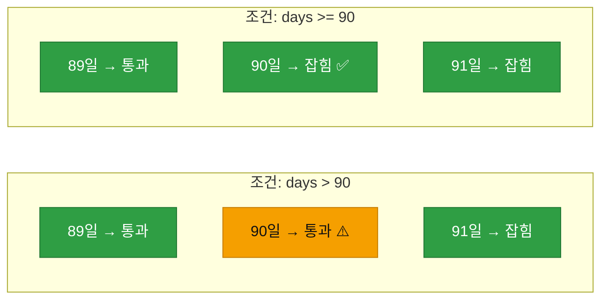
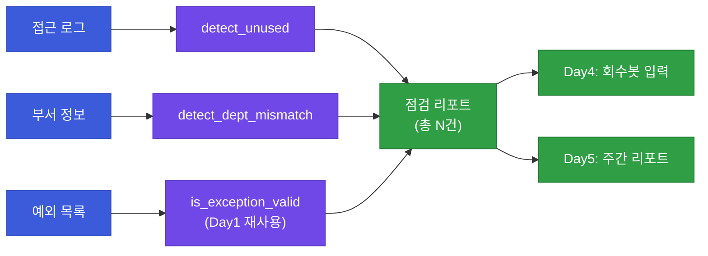

# 강의2 · 미사용·부서불일치 탐지 함수와 종합 리포트 (오후, 총 120분)

> **이 교시 한 문장:** 오전에 정리한 탐지 신호를 **실제 함수 두 개(`detect_unused_permissions`, `detect_dept_mismatch`)** 로 만들고, 둘을 묶어 **종합 점검 리포트**를 생성합니다. 특히 '딱 90일째' 경계값에서 부등호가 어떻게 결과를 바꾸는지 손으로 확인합니다.

| 시간 | 소주제 | 핵심 한 줄 |
|------|--------|-----------|
| 00-25분 | `detect_unused_permissions()` 해부 | 마지막 사용일과 90일 비교 |
| 25-50분 | 경계값(90일째)과 부등호 | `>` 냐 `>=` 냐가 사람을 가른다 |
| 50-75분 | `detect_dept_mismatch()` 해부 | 현재 부서와 권한 부서 대조 |
| 75-100분 | 종합 리포트 생성 | 세 탐지를 한 딕셔너리로 |
| 100-120분 | 정리 & 실습 안내 | 후보 목록을 Day4로 |

## 이 교시에 나오는 어려운 용어

| 용어 (한글발음) | 한 줄 뜻 (아주 쉽게) | 비유 |
|----------------|----------------------|------|
| **접근 로그(access log)** | 누가 언제 무엇에 접근했나 기록 | 출입 기록부 |
| **`max()`(맥스)** | 여러 값 중 가장 큰(늦은) 것 | 가장 최근 날짜 고르기 |
| **리스트 컴프리헨션(list comprehension)** | 한 줄로 목록을 만드는 문법 | 조건에 맞는 것만 골라 담기 |
| **`(now - last).days`** | 두 시각 차이를 '일수'로 | 며칠 지났나 |
| **경계값(boundary value)** | 기준에 딱 걸치는 값(90일째) | 마감일 당일 |
| **오프바이원(off-by-one)** | 하나 차이로 어긋나는 실수 | 1층/0층 헷갈림 |
| **`>` vs `>=`** | '초과'와 '이상'의 차이 | 90 넘김 vs 90 포함 |
| **부서 이력(dept history)** | 부서가 바뀐 기록 | 인사 발령 내역 |
| **집계(aggregation, 애그리게이션)** | 여러 결과를 하나로 모음 | 부서별 합계 |
| **딕셔너리 병합** | 여러 결과를 한 딕셔너리로 | 리포트 한 장에 모으기 |
| **`len()`(렌)** | 개수 세기 | 몇 건인지 |
| **정탐/오탐/미탐** | 맞게/잘못/놓친 탐지 | 알람의 정확도 |

---

## ⏱️ 00-25분 · `detect_unused_permissions()` 완전 해부

!!! abstract "이 블록을 마치면"
    ✔ 접근 로그에서 ==마지막 사용일을 뽑아 90일과 비교==하는 흐름을 한 줄씩 안다

### 🧱 파이썬 브릿지 — 이 함수에 필요한 파이썬 (미리 5분)

| 문법 | 뜻 | 예시 |
|------|-----|------|
| `for user, roles in user_roles.items()` | 딕셔너리를 키·값 함께 순회 | `'kim01', ['영업담당자']` |
| 리스트 컴프리헨션 | 조건에 맞는 것만 골라 목록 | `[l for l in logs if l['user']==u]` |
| `max(날짜들)` | 가장 최근(늦은) 날짜 | 마지막 사용일 |
| `(now - last).days` | 시각 차이를 일수로 | `95` |

### 💻 코드 완전 해부 — `detect_unused_permissions()`

```python
from datetime import datetime

def detect_unused_permissions(user_roles, access_logs, days=90):
    now = datetime.now()                                          # ①
    candidates = []                                               # ②
    for user, roles in user_roles.items():                       # ③
        used = [datetime.fromisoformat(l['at'])                  # ④
                for l in access_logs if l['user'] == user]
        if not used:                                             # ⑤
            candidates.append({'user': user, 'reason': '사용 기록 없음'})
            continue
        last = max(used)                                         # ⑥
        if (now - last).days > days:                             # ⑦
            candidates.append({'user': user, 'reason': f'{(now-last).days}일 미사용'})
    return candidates                                            # ⑧
```

| 줄 | 하는 일 | 왜 |
|:--:|---------|-----|
| **①** | '지금'을 한 번 계산 | 비교 기준 시각 |
| **②** | 과다권한 후보 담을 목록 | 결과 모으기 |
| **③** | 사용자별로 순회 | 각자 따로 판정 |
| **④** | 이 사용자의 접근 로그만 골라 시각 목록으로 | 마지막 사용일을 구하려고 |
| **⑤** | 로그가 아예 없으면 | 한 번도 안 쓴 권한 → 후보(강한 신호) |
| **⑥** | 여러 사용 중 **가장 최근** 것 | "마지막 사용일" |
| **⑦** | 마지막 사용이 90일보다 오래면 | 미사용 판정 |
| **⑧** | 후보 목록 반환 | Day4 회수봇 입력 |

!!! warning "🎓 강사 뷰 · ⑤와 ⑥을 눈여겨보게 하기"
    - **⑤(로그 없음)를 빼면?** → 아래 ⑥ `max([])`에서 **빈 목록 에러**가 납니다. "한 번도 안 쓴 사용자"를 먼저 걸러야 안전하고, 사실 이 경우가 **가장 확실한 미사용**입니다.
    - **⑥ `max()`의 의미:** 여러 번 접근했다면 그중 **가장 최근**이 기준입니다. 최근에 한 번이라도 썼으면 미사용이 아니니까요. `min()`을 쓰면 첫 사용일이 돼서 완전히 틀립니다.

!!! question "확인질문"
    **Q. 여러 접근 기록 중 `max()`(가장 최근)를 기준으로 미사용을 판정하는 이유는?**

    **A.** **최근에 한 번이라도 썼으면 미사용이 아니기 때문**입니다.

    "안 쓴 권한"의 기준은 마지막으로 쓴 날입니다. 여러 접근 기록 중 가장 최근 것이 90일보다 오래됐을 때만 진짜 미사용이죠. 만약 `min()`(첫 사용일)을 쓰면, 최근까지 잘 쓰던 권한도 미사용으로 잘못 잡히는 오탐이 생깁니다.

<div class="quiz">
<p class="quiz-q"><span class="tag">퀴즈</span><b><code>used</code>가 빈 목록일 때(⑤) 곧바로 후보에 넣고 <code>continue</code>하지 않으면 생기는 문제는?</b></p>
<button class="quiz-opt">함수가 무한 반복된다</button>
<button class="quiz-opt" data-correct>다음 줄 <code>max(used)</code>에서 빈 목록을 받아 에러가 발생한다</button>
<button class="quiz-opt">모든 사용자가 정상으로 처리된다</button>
<button class="quiz-opt">90일이 180일로 바뀐다</button>
<div class="quiz-explain"><b>정답: 2번.</b> `max([])`는 "빈 시퀀스" 에러(ValueError)를 냅니다. 로그가 아예 없는 사용자를 먼저 걸러내야 안전하고, 사실 이 경우가 가장 확실한 미사용 신호입니다.</div>
<button class="quiz-retry">다시 풀기</button>
</div>

---

## ⏱️ 25-50분 · 경계값(90일째)과 부등호 — `>` 냐 `>=` 냐

!!! abstract "이 블록을 마치면"
    ✔ ==딱 90일째 걸친 권한==이 잡히느냐 마느냐가 부등호 하나에 달렸음을 안다

!!! info "📘 학습자 뷰 · 처음 보는 나"
    ⑦ 줄의 조건을 다시 봅시다.

    - `(now - last).days > 90` → **90일은 통과**(안 잡힘), 91일부터 잡힘
    - `(now - last).days >= 90` → **90일부터 잡힘**

    "90일 미사용"이라는 정책이 **정확히 90일째인 사람을 포함하는지**에 따라 부등호를 골라야 합니다. 이 **하나 차이(off-by-one)** 가 실제로 다른 사람을 잡거나 놓칩니다.

### 🔬 깊이 보기 — off-by-one이 보안에서 오탐/미탐으로



정책 문서에 "90일 이상 미사용"이라 쓰여 있다면 `>= 90`이 맞습니다. "90일 초과"라면 `> 90`이고요. **말과 코드를 정확히 맞추는 게 핵심**입니다. 이 한 글자 차이가 감사에서 "왜 이 사람은 안 잡혔죠?"라는 지적으로 돌아옵니다.

### ✍️ 지금 직접 쳐보기 (7분) — 경계값 실험

!!! success "✍️ 직접 쳐보기 — 딱 90일째를 만들어 보기"
    ```python
    from datetime import datetime, timedelta
    exactly_90 = (datetime.now() - timedelta(days=90)).isoformat()
    logs = [{'user': 'kim01', 'at': exactly_90}]
    user_roles = {'kim01': ['영업담당자']}
    ```

    1. ⑦ 조건이 `> days`인 함수로 `detect_unused_permissions(user_roles, logs, days=90)` 실행 → kim01이 **안 잡히죠?** (90 > 90 은 거짓)
    2. 함수의 `>`를 `>=`로 **한 글자만** 바꿔 다시 실행 → 이번엔 **잡힙니다.**
    3. `timedelta(days=91)`로 바꾸면 두 버전 다 잡힘을 확인.

    > 🎓 강사 팁: "정책 문장(이상/초과)을 코드 부등호로 옮기는 순간이 버그의 단골 지점"이라고 못 박으세요. 학생이 한 글자 바꿔 결과가 뒤집히는 걸 눈으로 보면 평생 안 잊습니다.

!!! question "확인질문"
    **Q. 정책 문서에 "90일 **이상** 미사용 시 점검 대상"이라 적혀 있다면, 코드 조건은 `> 90`과 `>= 90` 중 무엇이어야 할까요?**

    **A.** **`>= 90`(이상)** 이어야 합니다.

    "이상"은 90일째를 포함하는 표현이므로, 딱 90일 된 권한도 잡혀야 합니다. `> 90`(초과)은 90일째를 통과시켜 정책과 어긋납니다. 정책 문장의 '이상/초과'를 부등호로 정확히 옮기는 것이 핵심입니다.

<div class="quiz">
<p class="quiz-q"><span class="tag">퀴즈</span><b>"90일 초과 미사용"이라는 정책을 코드로 옮길 때 올바른 조건과 그 이유는?</b></p>
<button class="quiz-opt"><code>>= 90</code> — 90일째도 포함해야 하므로</button>
<button class="quiz-opt" data-correct><code>> 90</code> — '초과'는 90을 넘어선 값만 뜻하므로 90일째는 제외</button>
<button class="quiz-opt"><code>== 90</code> — 정확히 90일만 잡으면 되므로</button>
<button class="quiz-opt"><code>< 90</code> — 90일 미만을 잡아야 하므로</button>
<div class="quiz-explain"><b>정답: 2번.</b> '초과'는 기준을 넘어선 값(91일부터)이므로 `> 90`입니다. '이상'이면 `>= 90`이고요. 정책 문장의 단어를 부등호로 정확히 옮기는 것이 off-by-one 버그를 막는 길입니다.</div>
<button class="quiz-retry">다시 풀기</button>
</div>

---

## ⏱️ 50-75분 · `detect_dept_mismatch()` 완전 해부

!!! info "📘 학습자 뷰 · 처음 보는 나"
    두 번째 신호는 **부서 불일치**입니다. "지금 부서와 안 맞는 권한"을 찾습니다.
    예: `kim01`이 지금 '재무팀'인데 '영업_고객조회' 권한이 있으면, 영업팀 때 받은 잔재일 수 있습니다.

### 💻 코드 완전 해부 — `detect_dept_mismatch()`

```python
def detect_dept_mismatch(user_dept, role_dept, user_roles):
    candidates = []                                          # ①
    for user, roles in user_roles.items():                  # ②
        current = user_dept.get(user)                       # ③
        for role in roles:                                  # ④
            owner_dept = role_dept.get(role)                # ⑤
            if owner_dept and owner_dept != current:        # ⑥
                candidates.append({                         # ⑦
                    'user': user, 'role': role,
                    'reason': f'{current} 소속인데 {owner_dept} 권한 보유'
                })
    return candidates                                       # ⑧
```

| 줄 | 하는 일 | 왜 |
|:--:|---------|-----|
| **①** | 후보 목록 | 결과 모으기 |
| **②** | 사용자별 순회 | 각자 판정 |
| **③** | 이 사용자의 **현재 부서** | 비교 기준 |
| **④** | 그가 가진 역할 하나씩 | 역할마다 확인 |
| **⑤** | 그 역할이 **원래 속한 부서** | 권한의 소속 |
| **⑥** | 소속이 있고, **현재 부서와 다르면** | 불일치 판정 |
| **⑦** | 후보에 추가(이유 포함) | 근거 남기기 |
| **⑧** | 후보 반환 | 리포트로 |

!!! example "🎓 강사 뷰 · ⑥의 `owner_dept and` 를 짚기"
    - `if owner_dept and ...` — 앞의 `owner_dept`를 왜 확인할까요? 부서 태그가 **없는(None) 역할**(예: 전사 공통 권한)은 비교 대상이 아니기 때문입니다. `None != '재무팀'`은 참이 돼서 **공통 권한까지 오탐**할 뻔합니다. `owner_dept and`가 그걸 막습니다.
    - 실무 확장: 부서 '이력(history)'을 보면 "언제 옮겼는지"까지 알 수 있어, "이동 후 30일 지났는데 옛 권한 유지" 같은 정교한 규칙도 가능합니다.

!!! question "확인질문"
    **Q. `if owner_dept and owner_dept != current`에서 앞의 `owner_dept`(존재 확인)를 빼면 어떤 오탐이 생길까요?**

    **A.** **부서 태그가 없는 전사 공통 권한까지 불일치로 잘못 잡힙니다.**

    부서가 지정되지 않은 권한은 `owner_dept`가 `None`인데, `None != '재무팀'`은 참이 되어 후보에 들어가 버립니다. 앞에 `owner_dept and`를 두면 "부서 태그가 있는 권한"만 비교해서, 공통 권한을 오탐하지 않습니다.

<div class="quiz">
<p class="quiz-q"><span class="tag">퀴즈</span><b>부서 불일치 탐지에서 '현재 부서'와 '권한의 소속 부서'를 비교하는 근본 가정은?</b></p>
<button class="quiz-opt">부서가 다르면 그 사람은 퇴사한 것이다</button>
<button class="quiz-opt" data-correct>부서 이동 후 옛 부서 권한이 안 걷힌 잔재일 가능성이 있어, 재확인이 필요하다는 것</button>
<button class="quiz-opt">부서가 다르면 권한을 즉시 삭제해야 한다</button>
<button class="quiz-opt">부서 이름이 길면 위험하다</button>
<div class="quiz-explain"><b>정답: 2번.</b> 불일치는 '확정 위반'이 아니라 '의심 신호'입니다. 정당한 협업일 수도 있으니 후보로 올려 사람이 확인합니다. 즉시 삭제(3번)는 오탐 위험 때문에 안 합니다.</div>
<button class="quiz-retry">다시 풀기</button>
</div>

---

## ⏱️ 75-100분 · 종합 점검 리포트 생성

!!! abstract "이 블록을 마치면"
    ✔ 세 탐지 결과를 ==한 딕셔너리로 묶어== 점검 리포트를 만든다

### 💻 코드 완전 해부 — `generate_review_report()`

```python
def generate_review_report(user_roles, access_logs, user_dept, role_dept,
                           exceptions):
    unused   = detect_unused_permissions(user_roles, access_logs)     # ①
    mismatch = detect_dept_mismatch(user_dept, role_dept, user_roles) # ②
    expired  = [e for e in exceptions if not is_exception_valid(e)]   # ③
    return {                                                          # ④
        'unused': unused,
        'dept_mismatch': mismatch,
        'expired_exceptions': expired,
        'total_candidates': len(unused) + len(mismatch) + len(expired),
    }
```

| 줄 | 하는 일 | 왜 |
|:--:|---------|-----|
| **①** | 미사용 탐지 실행 | 신호 1 |
| **②** | 부서 불일치 탐지 | 신호 2 |
| **③** | **Day1 `is_exception_valid()` 재사용**해 만료 예외 색출 | 신호 3(재사용!) |
| **④** | 세 결과 + 총 건수를 한 딕셔너리로 | 리포트 한 장 |

!!! example "🎓 강사 뷰 · '한 장 요약'의 힘"
    - `total_candidates`(총 건수) 하나만 봐도 이번 점검 규모를 압니다. 보안팀장은 숫자로 우선순위를 정하고, 세부 목록으로 파고듭니다.
    - ③에서 **Day1 함수를 또 재사용**했습니다. "예외가 유효한가?"는 Day1에 이미 만들었으니 새로 짤 필요가 없죠. Day5에선 이 리포트가 **주간 리포트**로 확장됩니다.

### 🔬 깊이 보기 — 탐지 결과가 흘러가는 길



!!! question "확인질문"
    **Q. 종합 리포트에 세 목록뿐 아니라 `total_candidates`(총 건수)를 함께 넣는 이유는?**

    **A.** **한눈에 이번 점검의 규모를 파악하게 하기 위해서**입니다.

    세부 목록을 다 읽지 않아도 총 건수만 보면 "이번 주 점검 대상이 몇 건인지"를 즉시 알 수 있습니다. 보안팀장은 이 숫자로 우선순위와 심각도를 판단하고, 필요하면 세부 목록으로 들어갑니다. 요약 숫자와 상세 근거를 함께 주는 것이 좋은 리포트입니다.

<div class="quiz">
<p class="quiz-q"><span class="tag">퀴즈</span><b>만료 예외 탐지(③)에서 Day1의 <code>is_exception_valid()</code>를 새로 짜지 않고 재사용한 것이 보여주는 원칙은?</b></p>
<button class="quiz-opt">코드는 매번 새로 짜야 최신 상태가 된다</button>
<button class="quiz-opt" data-correct>한 번 잘 만든 함수는 다른 맥락에서도 그대로 재사용해 중복을 없앤다(모듈화)</button>
<button class="quiz-opt">함수는 만든 날에만 쓸 수 있다</button>
<button class="quiz-opt">재사용하면 코드가 느려진다</button>
<div class="quiz-explain"><b>정답: 2번.</b> '예외가 유효한가?'라는 판단은 Day1에 이미 구현됐으니, 점검에서도 그대로 불러 씁니다. 같은 로직을 다시 짜지 않는 것이 모듈화의 핵심 이득입니다.</div>
<button class="quiz-retry">다시 풀기</button>
</div>

!!! tip "🧠 파인만 자가진단"
    안 보고 말할 수 있으면 통과입니다.

    1. `detect_unused_permissions()`가 `max()`를 쓰는 이유
    2. "90일 이상"과 "90일 초과"의 부등호 차이
    3. `detect_dept_mismatch()`에서 `owner_dept and`가 막아 주는 오탐
    4. 종합 리포트가 Day4·Day5로 어떻게 이어지나

---

## ⏱️ 100-120분 · 정리 & 실습 안내

**오후 정리:**

1. `detect_unused_permissions()` — 로그의 **마지막 사용일(`max`)** 과 90일 비교
2. **경계값(90일째)** 에서 `>` vs `>=` — 정책 문장(이상/초과)과 정확히 맞춘다
3. `detect_dept_mismatch()` — 현재 부서 vs 권한 소속, `owner_dept and`로 공통권한 오탐 방지
4. `generate_review_report()` — 세 신호 + 총 건수, **Day1 함수 재사용**
5. 결과는 **후보 목록**일 뿐 — 회수는 Day4에서 신중히

!!! note "실습 예고 (오후 실습 120분)"
    `overprivilege.py`에 두 탐지 함수와 리포트 생성을 완성하고, **경계값(89·90·91일)** 테스트로 부등호를 검증합니다. 상세 단계는 [실습 페이지](practice.md)에서.

!!! question "확인질문"
    **Q. 오늘 만든 탐지 함수들이 '즉시 회수'가 아니라 '후보 목록 반환'으로 끝나는 설계가, 내일(Day4)과 어떻게 연결될까요?**

    **A.** **탐지(오늘)와 회수(내일)를 분리한 설계**입니다.

    오늘 함수는 "수상한 권한 후보"만 리포트로 만듭니다. 내일 Day4에서 그 후보들을 위험도에 따라 분류해, 일반 권한은 알림 후 유예 회수, 민감 권한은 승인 후 회수로 처리합니다. 탐지는 빠르게 기계가, 회수 결정은 신중하게 사람·절차가 맡도록 나눈 것입니다.

---

## ✅ 가르칠 준비 체크리스트 (강의2)

- [ ] `detect_unused_permissions()`를 한 줄씩(특히 ⑤⑥⑦) 설명한다
- [ ] `max()`를 쓰는 이유, `min()`이면 왜 틀리는지 설명한다
- [ ] 경계값(90일째)에서 `>`↔`>=`를 직접 바꿔 보인다
- [ ] '이상/초과' 정책 문장을 부등호로 옮기는 법을 설명한다
- [ ] `detect_dept_mismatch()`의 `owner_dept and` 오탐 방지를 설명한다
- [ ] 종합 리포트에서 Day1 함수 재사용을 짚는다
- [ ] 확인질문 5개 + 퀴즈에 답한다

*[off-by-one]: 하나 차이로 어긋나는 대표적 버그
*[access log]: 접근 로그 — 탐지의 근거 데이터
*[false positive]: 오탐 — 정상을 이상으로 잘못 판정
