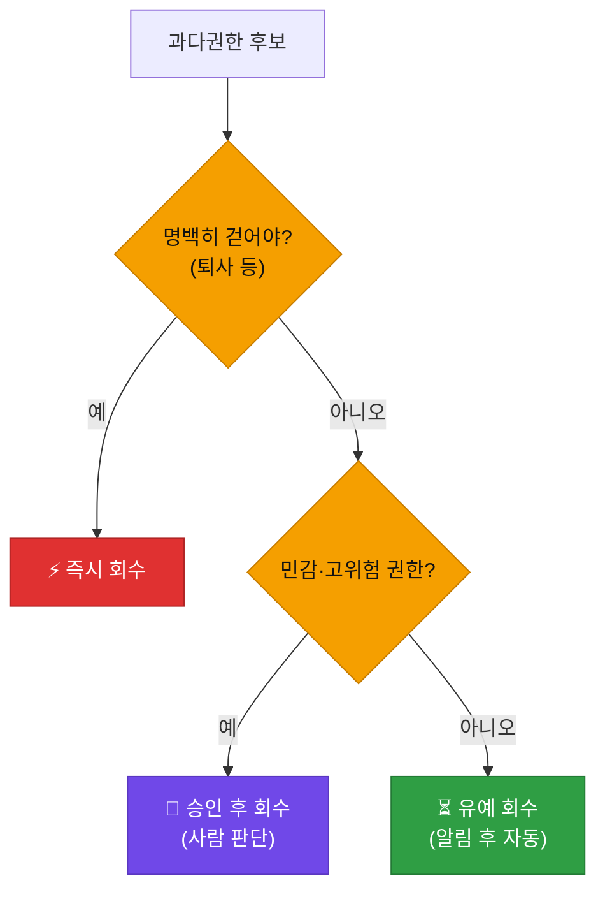
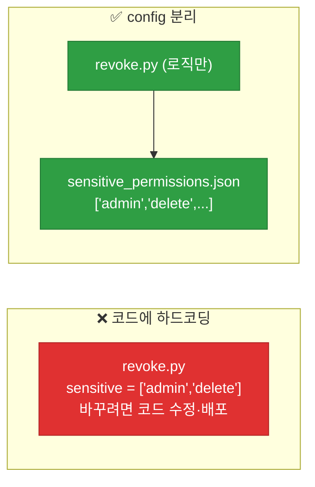
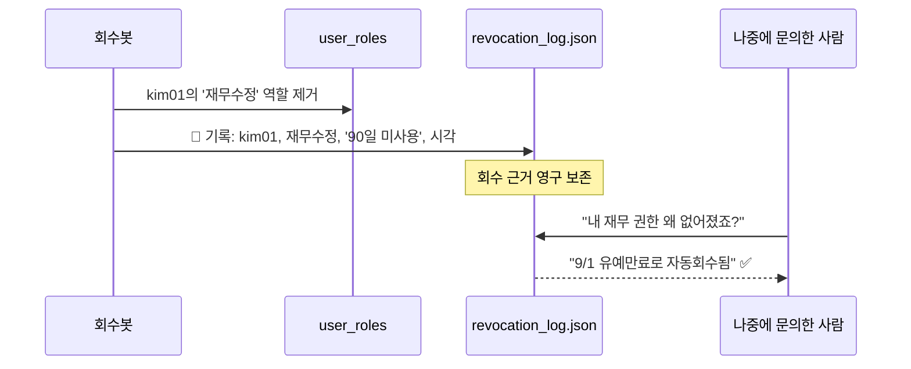
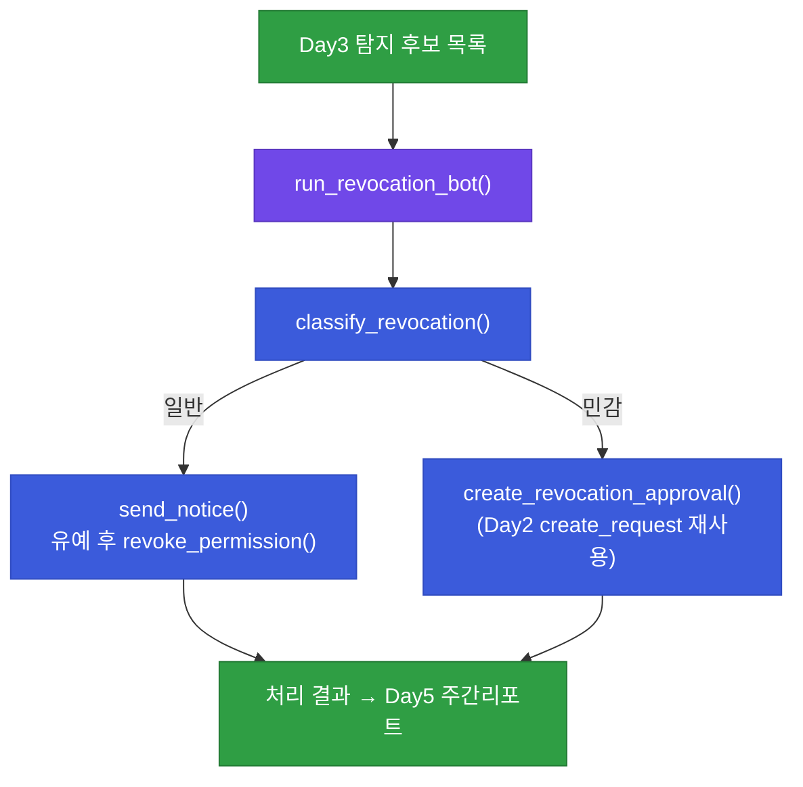

# 강의1 · 권한 회수 자동화 구현 (오전, 총 120분)

> **이 교시 한 문장:** Day3에서 탐지한 과다권한 후보를 **위험도에 따라 3가지로 분류**해, 일반 권한은 알림 후 유예 회수, 민감 권한은 승인 후 회수로 처리하는 **자동 회수봇**을 만듭니다. 모든 조치는 **로그**로 남깁니다.

| 시간 | 소주제 | 핵심 한 줄 |
|------|--------|-----------|
| 00-20분 | 탐지에서 회수로 — 회수 3유형 | 왜 즉시 회수는 위험한가 |
| 20-45분 | 회수 대상 분류 로직 | 위험도로 갈래를 나눈다 |
| 45-75분 | 유예 알림 & 자동 회수 | 걷되 반드시 로그를 남긴다 |
| 75-100분 | 승인 필요 대상 — Day2 재사용 | create_request()를 회수에도 |
| 100-120분 | 회수봇 통합 실행 | 캡스톤 회수봇의 원형 |

## 이 교시에 나오는 어려운 용어

| 용어 (한글발음) | 한 줄 뜻 (아주 쉽게) | 비유 |
|----------------|----------------------|------|
| **회수(revoke, 리보크)** | 줬던 권한을 도로 걷음 | 열쇠 반납받기 |
| **즉시 회수(immediate revoke)** | 지체 없이 바로 걷음 | 퇴사 즉시 카드 정지 |
| **유예 회수(grace-period revoke)** | 알림 후 기간 주고 걷음 | "3일 내 소명 없으면 정지" |
| **승인 후 회수(approval revoke)** | 사람 승인받고 걷음 | 결재 후 정지 |
| **위험도(risk level)** | 권한이 얼마나 위험한가 | 조회 < 수정 < 삭제 |
| **민감 권한(sensitive permission)** | 특히 위험한 권한 | 관리자·삭제 권한 |
| **config 분리(configuration)** | 설정값을 코드 밖 파일로 | 규칙표를 따로 보관 |
| **하드코딩(hard-coding)** | 값을 코드에 직접 박음 | 벽에 못으로 박기 |
| **로그(log)** | 무슨 일이 있었는지 기록 | 작업 일지 |
| **감사 추적(audit trail)** | 되짚을 수 있는 기록 흔적 | CCTV 기록 |
| **오케스트레이션(orchestration)** | 여러 단계를 하나로 지휘 | 오케스트라 지휘자 |
| **멱등성(idempotency, 이멱던시)** | 여러 번 해도 결과 같음 | 스위치 여러 번 눌러도 꺼짐은 꺼짐 |

---

## ⏱️ 00-20분 · 탐지에서 회수로 — 회수 3유형

!!! info "📘 학습자 뷰 · 처음 보는 나"
    Day3에서 "이 권한 수상하다"는 후보를 찾았습니다. 이제 걷어내야 하는데, **모두 똑같이 걷으면 안 됩니다.**

    - **즉시 회수:** 퇴사자 계정처럼 **명백히 걷어야 할 것** → 지체 없이
    - **유예 회수:** 90일 미사용처럼 **아마 필요 없지만 확실치 않은 것** → 알림 후 기간 주고
    - **승인 후 회수:** 관리자 권한처럼 **잘못 걷으면 큰일 나는 것** → 사람 승인받고

    핵심 질문: **왜 탐지처럼 회수도 전부 자동 즉시 처리하면 안 될까요?** 오탐(정상을 잘못 잡음) 때문입니다. 정상 권한을 자동으로 즉시 걷으면 그 사람은 갑자기 일을 못 하게 됩니다.

### 🔬 깊이 보기 — 위험도 × 확신도로 회수 방식이 갈린다



두 축이 방식을 결정합니다. **확신도**(명백한가)와 **위험도**(잘못 걷으면 큰일인가)입니다. 확신이 높으면 즉시, 위험이 높으면 사람 승인, 그 사이는 유예. 이렇게 나누면 **오탐 피해를 최소화하면서도 위험은 방치하지 않습니다.**

!!! example "🎓 강사 뷰 · '즉시 회수의 위험'을 못 박기"
    - *"탐지는 다 자동으로 해도 됩니다. 목록만 만드니까요. 그런데 회수는 실제로 권한을 없애는 행위라, 오탐이면 사람이 일을 못 합니다. 그래서 회수는 '얼마나 확실한가·얼마나 위험한가'로 갈래를 나눕니다."*
    - 반례 질문: *"그럼 다 승인받으면 안전하지 않나요?"* → 그러면 퇴사자 계정도 승인 기다리며 며칠 살아 있게 됩니다. **명백한 건 빨라야** 하죠. 그래서 3유형입니다.

!!! question "확인질문"
    **Q. 탐지는 전부 자동으로 해도 되지만, 회수는 왜 바로 자동 실행하면 위험할 수 있을까요?**

    **A.** **회수는 실제로 권한을 없애는 행위라, 오탐이면 정상 권한까지 사라지기 때문**입니다.

    탐지는 '후보 목록'만 만들어 아무 피해가 없지만, 자동 즉시 회수는 잘못 잡힌 정상 권한을 곧바로 없애 그 사람이 갑자기 일을 못 하게 만듭니다. 그래서 명백한 건 즉시, 애매한 건 유예, 위험한 건 승인 후로 나눠 오탐 피해를 줄입니다.

<div class="quiz">
<p class="quiz-q"><span class="tag">퀴즈</span><b>회수를 '즉시/유예/승인후' 세 가지로 나누는 판단축으로 가장 적절한 것은?</b></p>
<button class="quiz-opt">권한 이름의 길이와 부서 크기</button>
<button class="quiz-opt" data-correct>얼마나 확실한가(확신도)와 잘못 걷으면 얼마나 위험한가(위험도)</button>
<button class="quiz-opt">사용자의 근속연수와 직급</button>
<button class="quiz-opt">권한을 부여한 날짜의 요일</button>
<div class="quiz-explain"><b>정답: 2번.</b> 확신이 높으면 즉시, 위험이 크면 사람 승인, 그 사이는 유예. 두 축으로 오탐 피해와 위험 방치를 동시에 줄이는 설계입니다.</div>
<button class="quiz-retry">다시 풀기</button>
</div>

---

## ⏱️ 20-45분 · 회수 대상 분류 로직

!!! abstract "이 블록을 마치면"
    ✔ 위험도에 따라 =='승인 필요'와 '알림 후 유예 회수'로 나누는== 함수를 안다

### 💻 코드 완전 해부 — `classify_revocation()`

```python
def classify_revocation(candidate, sensitive_permissions):
    if candidate['permission'] in sensitive_permissions:   # ①
        return 'approval_required'                          # ②
    return 'notice_then_revoke'                             # ③
```

| 줄 | 하는 일 | 왜 |
|:--:|---------|-----|
| **①** | 이 권한이 **민감 권한 목록**에 있나 확인 | 위험도 판정 |
| **②** | 있으면 **승인 필요**로 분류 | 잘못 걷으면 큰일 → 사람 판단 |
| **③** | 아니면 **알림 후 유예 회수** | 일반 권한 → 자동 유예 |

간단해 보이지만 **핵심은 `sensitive_permissions`를 어디서 가져오느냐**입니다.

### 🔬 깊이 보기 — 왜 민감 권한 목록을 config로 분리하나



민감 권한 목록은 **자주 바뀝니다**(새 시스템 도입, 규정 변경). 코드에 박아두면(하드코딩) 바꿀 때마다 코드를 수정·재배포해야 하고, 실수 위험도 큽니다. **JSON config로 빼면** 보안 담당자가 목록만 고치면 되고, 코드는 그대로입니다. Day1의 "데이터는 JSON으로" 원칙의 반복입니다.

!!! example "🎓 강사 뷰 · config 분리를 반복 강조"
    *"이 원칙이 3과목 내내 반복됩니다. 역할·권한(Day1), 민감권한(오늘), 조건 허용목록(오후)까지 전부 config로 뺍니다. '바뀔 수 있는 값은 코드 밖으로'가 몸에 배게 하세요."*

!!! question "확인질문"
    **Q. `sensitive_permissions` 목록을 코드에 하드코딩하지 않고 config 파일로 분리해야 하는 이유는?**

    **A.** **민감 권한 목록은 자주 바뀌는데, 코드에 박아두면 바꿀 때마다 코드 수정·재배포가 필요하기 때문**입니다.

    JSON config로 빼면 보안 담당자가 목록만 고치면 되고 로직(코드)은 건드리지 않아, 안전하고 빠르게 바꿀 수 있습니다. "바뀔 수 있는 값은 코드 밖으로"라는 원칙입니다.

<div class="quiz">
<p class="quiz-q"><span class="tag">퀴즈</span><b><code>classify_revocation()</code>이 민감 권한을 'approval_required'로 분류하는 목적은?</b></p>
<button class="quiz-opt">민감 권한은 회수 속도를 높이려고</button>
<button class="quiz-opt" data-correct>잘못 걷으면 피해가 큰 권한이라, 자동으로 걷지 않고 사람 승인을 한 번 더 거치게 하려고</button>
<button class="quiz-opt">민감 권한은 로그를 남기지 않으려고</button>
<button class="quiz-opt">민감 권한은 config에 넣을 수 없어서</button>
<div class="quiz-explain"><b>정답: 2번.</b> 고위험 권한은 오탐 회수 시 피해가 크므로, 자동 처리 대신 사람 승인 절차(Day2 재사용)를 거칩니다. 일반 권한만 유예 자동 회수합니다.</div>
<button class="quiz-retry">다시 풀기</button>
</div>

---

## ⏱️ 45-75분 · 유예 알림 및 자동 회수 함수

!!! abstract "이 블록을 마치면"
    ✔ 권한을 실제로 걷는 함수가 왜 ==반드시 로그를 남겨야== 하는지 안다

### 💻 코드 완전 해부 — `revoke_permission()`

```python
def revoke_permission(user, role, user_roles):
    if role in user_roles.get(user, []):                          # ①
        user_roles[user].remove(role)                             # ②
        log_revocation(user, role, reason='미사용 90일 초과, 유예기간 만료')  # ③
        return True                                               # ④
    return False                                                  # ⑤
```

| 줄 | 하는 일 | 왜 |
|:--:|---------|-----|
| **①** | 그 사용자가 실제로 그 역할을 **갖고 있나** 확인 | 없는 걸 지우려다 에러 방지 |
| **②** | 역할 목록에서 제거 | 실제 회수 |
| **③** | **누가·무엇을·왜** 걷었는지 로그 | 감사 추적(가장 중요) |
| **④** | 회수 성공 반환 | 결과 통지 |
| **⑤** | 없으면 아무 일 없이 False | **멱등성**(이미 없으면 그대로) |

!!! warning "🎓 강사 뷰 · ①⑤가 만드는 '멱등성'"
    - ①에서 "갖고 있을 때만" 지우므로, **같은 회수를 두 번 실행해도** 두 번째는 조용히 False입니다. 이게 **멱등성**(여러 번 해도 결과 동일)입니다. 회수봇이 실수로 두 번 돌아도 안전하죠.
    - ③ **로그가 이 함수의 존재 이유의 절반**입니다. 권한을 걷는 것보다 "왜 걷었는지 남기는 것"이 감사에서 더 중요할 때가 많습니다.

### 🔬 깊이 보기 — 로그가 없으면 무슨 일이 생기나



로그가 없으면 마지막 답변이 **"모르겠는데요"** 가 됩니다. 사용자는 억울하고, 담당자는 원인을 못 찾습니다. 로그가 있으면 "언제·왜 걷었는지"를 즉시 답할 수 있어, **회수의 정당성**을 증명합니다.

### ✍️ 지금 직접 쳐보기 (5분)

!!! success "✍️ 직접 쳐보기 — 멱등성 확인"
    ```python
    user_roles = {'kim01': ['영업담당자', '임시_재무조회']}
    revoke_permission('kim01', '임시_재무조회', user_roles)  # → True (걷힘)
    print(user_roles['kim01'])                              # → ['영업담당자']
    revoke_permission('kim01', '임시_재무조회', user_roles)  # → ??? 예측!
    ```

    1. 두 번째 호출은 무엇을 반환할까요? → **예측 후 실행**(이미 없으니 `False`).
    2. 두 번 실행해도 `user_roles`가 깨지지 않음을 확인 → 이게 멱등성입니다.
    3. `log_revocation`을 잠깐 `print`로 대체해, 회수 때마다 기록이 찍히는지 눈으로 봅니다.

!!! question "확인질문"
    **Q. 회수 이력을 로그로 남기지 않으면, 나중에 "왜 이 권한이 없어졌지?"라는 문의에 어떻게 답할 수 있을까요?**

    **A.** **답할 수 없습니다.**

    로그가 없으면 "언제·왜·무슨 근거로 걷었는지"를 알 방법이 없어, 문의에 "모르겠다"밖에 못 합니다. `log_revocation()`으로 회수 때마다 사용자·권한·사유·시각을 남기면, 나중에 "9월 1일 유예 만료로 자동 회수됨"처럼 근거를 즉시 댈 수 있습니다.

<div class="quiz">
<p class="quiz-q"><span class="tag">퀴즈</span><b><code>revoke_permission()</code>이 <code>if role in user_roles.get(user, [])</code>로 먼저 확인하고 없으면 <code>False</code>를 반환하는 설계가 주는 이점은?</b></p>
<button class="quiz-opt">회수가 두 배 빨라진다</button>
<button class="quiz-opt" data-correct>같은 회수를 여러 번 실행해도 에러 없이 안전하다(멱등성)</button>
<button class="quiz-opt">로그를 남기지 않아도 된다</button>
<button class="quiz-opt">민감 권한이 자동으로 분류된다</button>
<div class="quiz-explain"><b>정답: 2번.</b> '있을 때만 제거'이므로 두 번째 호출은 조용히 False가 됩니다. 봇이 실수로 중복 실행해도 안전한 멱등성을 줍니다. 로그(3번)는 여전히 반드시 남깁니다.</div>
<button class="quiz-retry">다시 풀기</button>
</div>

---

## ⏱️ 75-100분 · 승인 필요 대상 처리 — Day2 모듈 재사용

!!! info "📘 학습자 뷰 · 처음 보는 나"
    `approval_required`로 분류된 대상(민감 권한)은 자동으로 못 걷습니다. **사람 승인**이 필요하죠.
    그런데 '요청-승인 구조'는 Day2에서 이미 만들었습니다! 그래서 **새로 짜지 않고 재사용**합니다.

### 💻 코드 완전 해부 — `create_revocation_approval()`

```python
def create_revocation_approval(candidate, approver):
    return create_request(                        # ← Day2 함수 그대로!
        user=candidate['user'],
        system=candidate['permission'],
        level='회수',                              # ① level만 '회수'로
        status='reviewing',                       # ② 바로 검토 상태로
        approver=approver,
        sla_hours=48,                             # ③ 회수는 좀 더 여유
    )
```

| 포인트 | 설명 |
|--------|------|
| **재사용** | Day2의 `create_request()`를 **그대로** 호출 — 요청이든 회수든 '승인 절차'는 같은 구조 |
| **① level='회수'** | 부여 요청과 구분하는 라벨 |
| **② status='reviewing'** | 이미 봇이 후보를 올린 것이니 바로 검토 단계 |
| **③ sla_hours=48** | 회수 승인은 신중히 → 기한을 넉넉히 |

!!! example "🎓 강사 뷰 · 재사용의 '아하 포인트'"
    *"여기가 3과목에서 가장 짜릿한 순간입니다. '권한을 줄 때'와 '뺏을 때'가 완전히 반대 같지만, **둘 다 승인 절차가 필요하다**는 점에서 똑같습니다. Day2에 만든 요청-승인 구조가 방향만 바꿔 그대로 쓰입니다. 이게 함수를 범용으로 잘 설계했을 때의 보상이에요."*

!!! question "확인질문"
    **Q. Day2에 만든 `create_request()` 함수를 '회수 승인'에도 재사용할 수 있다는 것은 무엇을 보여줄까요?**

    **A.** **'승인 절차'라는 구조가 권한을 줄 때든 뺏을 때든 동일하다**는 것을 보여줍니다.

    부여와 회수는 방향이 반대지만, "요청을 만들고 → 승인자가 검토·승인한다"는 뼈대는 똑같습니다. `create_request()`를 처음부터 범용으로 설계했기 때문에, 회수 승인에서도 새로 짜지 않고 그대로 불러 쓸 수 있습니다. 잘 만든 함수가 재사용되는 모듈화의 힘입니다.

<div class="quiz">
<p class="quiz-q"><span class="tag">퀴즈</span><b>회수 승인에 Day2의 <code>create_request()</code>를 재사용하면서 <code>level='회수'</code>, <code>sla_hours=48</code>로 바꾼 이유로 가장 적절한 것은?</b></p>
<button class="quiz-opt">회수는 요청보다 코드가 복잡해서</button>
<button class="quiz-opt" data-correct>구조는 재사용하되, 부여와 구분(level)하고 신중한 판단을 위해 기한을 넉넉히(sla) 주려고</button>
<button class="quiz-opt">회수는 로그가 필요 없어서</button>
<button class="quiz-opt">create_request는 회수에만 쓸 수 있어서</button>
<div class="quiz-explain"><b>정답: 2번.</b> 승인 구조 자체는 그대로 재사용하고, 맥락에 맞게 라벨(회수)과 기한(넉넉히)만 조정합니다. 범용 함수에 인자만 바꿔 다른 상황에 맞추는 전형적 재사용입니다.</div>
<button class="quiz-retry">다시 풀기</button>
</div>

---

## ⏱️ 100-120분 · 회수봇 통합 실행 함수

!!! abstract "이 블록을 마치면"
    ✔ 탐지 결과를 받아 ==분류→알림/회수 또는 승인요청까지== 잇는 회수봇을 안다

### 💻 코드 완전 해부 — `run_revocation_bot()`

```python
def run_revocation_bot(candidates, sensitive_permissions):
    results = []                                                  # ①
    for c in candidates:                                         # ②
        category = classify_revocation(c, sensitive_permissions) # ③
        if category == 'notice_then_revoke':                    # ④
            send_notice(c)
            results.append({'candidate': c, 'action': 'notice_sent'})
        else:                                                   # ⑤
            req = create_revocation_approval(c, approver='security_lead')
            results.append({'candidate': c, 'action': 'approval_requested'})
    return results                                              # ⑥
```

| 줄 | 하는 일 | 왜 |
|:--:|---------|-----|
| **①** | 처리 결과 담을 목록 | 무엇을 했는지 기록 |
| **②** | Day3 탐지 후보를 하나씩 | 전수 처리 |
| **③** | 위험도로 분류 | 갈래 결정 |
| **④** | 일반 권한 → 알림 + 유예 | 자동 처리 |
| **⑤** | 민감 권한 → 승인 요청 생성(Day2) | 사람 판단 |
| **⑥** | 처리 내역 반환 | Day5 리포트로 |

### 🔬 깊이 보기 — 오케스트레이션: 작은 함수들을 지휘한다



`run_revocation_bot()`은 스스로 판단을 많이 하지 않습니다. **작은 함수들(분류·알림·회수·승인생성)을 순서대로 부르는 지휘자**일 뿐이죠. 이걸 **오케스트레이션**이라 합니다. 각 함수가 한 가지만 잘하면, 지휘자는 그것들을 엮기만 하면 됩니다 — 그래서 읽기 쉽고 고치기 쉽습니다.

!!! example "🎓 강사 뷰 · 캡스톤 연결"
    *"이 `run_revocation_bot()`이 캡스톤에서 '과다권한 자동 회수봇'으로 발전합니다. 오늘은 뼈대만, 캡스톤에선 1과목 AI Agent의 도구로 등록돼 'Agent가 회수봇을 호출'하는 형태가 됩니다. 오늘 만든 게 최종 산출물의 심장이라는 걸 학생에게 각인시키세요."*

!!! question "확인질문"
    **Q. 이 `run_revocation_bot()` 함수가 나중에 캡스톤에서 어떤 이름의 봇으로 발전하게 될까요?**

    **A.** **과다권한 자동 회수봇**으로 발전합니다.

    오늘은 탐지 후보를 분류→알림/유예회수 또는 승인요청으로 잇는 뼈대만 만들지만, 캡스톤에서는 이 함수가 1과목 AI Agent의 도구(tool)로 등록되어, Agent가 정기적으로 호출해 과다권한을 자동으로 걷어내는 완성형 회수봇이 됩니다.

<div class="quiz">
<p class="quiz-q"><span class="tag">퀴즈</span><b><code>run_revocation_bot()</code>이 직접 복잡한 판단을 하지 않고 작은 함수들(분류·알림·승인생성)을 순서대로 호출하는 구조의 이점은?</b></p>
<button class="quiz-opt">함수가 많을수록 무조건 빠르다</button>
<button class="quiz-opt" data-correct>각 함수가 한 가지만 담당해, 지휘 함수는 엮기만 하면 되고 읽기·수정이 쉬워진다(오케스트레이션)</button>
<button class="quiz-opt">작은 함수는 로그를 남기지 않아도 된다</button>
<button class="quiz-opt">봇이 사람 승인을 건너뛸 수 있다</button>
<div class="quiz-explain"><b>정답: 2번.</b> 한 함수가 한 가지 책임만 지면(단일 책임), 이를 조합하는 오케스트레이터는 단순해집니다. 각 부품을 따로 테스트·수정할 수 있어 유지보수가 쉬워집니다.</div>
<button class="quiz-retry">다시 풀기</button>
</div>

!!! tip "🧠 파인만 자가진단"
    안 보고 말할 수 있으면 통과입니다.

    1. 회수 3유형과 각각을 고르는 기준
    2. `revoke_permission()`이 로그를 남기는 이유, 멱등성이란 무엇인가
    3. Day2 `create_request()`가 회수에 재사용되는 이유
    4. 오케스트레이션이 무엇이고 왜 유지보수에 좋은가

---

## ⏱️ 정리

**오전 정리:**

1. 회수는 **확신도×위험도**로 3유형(즉시/유예/승인후)으로 나눈다
2. `classify_revocation()` — 민감 권한 목록(**config 분리**)으로 갈래 결정
3. `revoke_permission()` — **로그 필수**, '있을 때만 제거'로 **멱등성**
4. 승인 필요 대상은 **Day2 `create_request()` 재사용**
5. `run_revocation_bot()` — 작은 함수들을 엮는 **오케스트레이션**, 캡스톤 회수봇의 원형

오후에는 접근 판단을 "누가·무엇"에서 **"언제·어디서·어떤 기기로"** 까지 넓히고, 최종 통합 엔진을 완성합니다.

---

## ✅ 가르칠 준비 체크리스트 (강의1)

- [ ] 회수 3유형과 판단축(확신도·위험도)을 설명한다
- [ ] 왜 회수는 탐지와 달리 즉시 자동화가 위험한지 설명한다
- [ ] 민감 권한 목록을 config로 빼는 이유를 설명한다
- [ ] `revoke_permission()`의 로그·멱등성을 설명한다
- [ ] Day2 `create_request()` 재사용을 시연한다
- [ ] `run_revocation_bot()`의 오케스트레이션 구조를 설명한다
- [ ] 확인질문 5개 + 퀴즈에 답한다

*[revoke]: 회수 — 부여된 권한을 걷어냄
*[idempotency]: 멱등성 — 여러 번 실행해도 결과가 같음
*[orchestration]: 오케스트레이션 — 작은 단계들을 하나로 지휘
