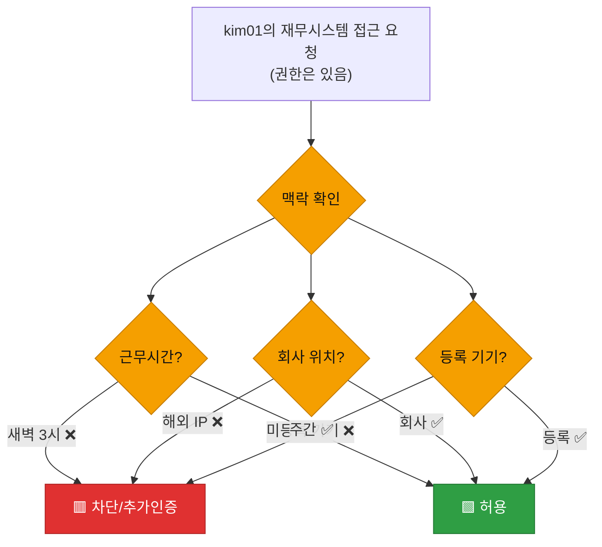
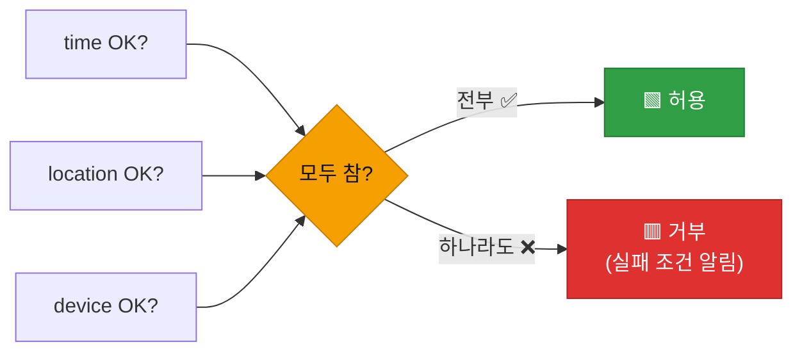
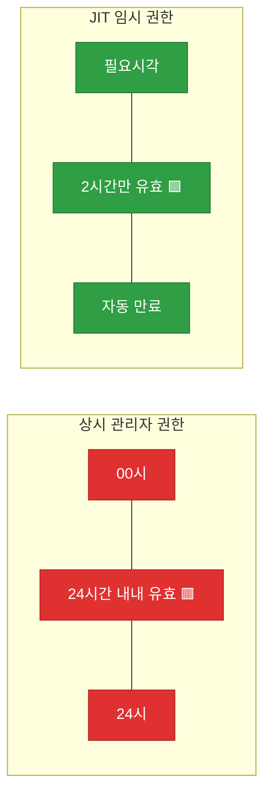
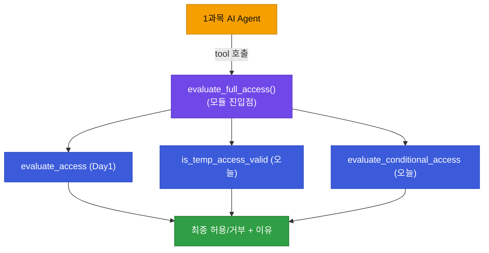

# 강의2 · 조건 기반 정책과 임시권한(JIT) (오후, 총 120분)

> **이 교시 한 문장:** 지금까지의 정책은 "누가 무엇에"만 봤습니다. 여기에 **언제·어디서·어떤 기기로**라는 조건과, 필요할 때만 잠깐 주는 **임시권한(JIT)** 을 더해, 접근통제 모듈의 **최종 판단 엔진**을 완성합니다.

| 시간 | 소주제 | 핵심 한 줄 |
|------|--------|-----------|
| 00-20분 | 정적 정책의 한계와 조건 유형 | '누가 무엇' 다음은 '언제 어디서' |
| 20-50분 | 조건 평가 함수 구현 | 여러 조건을 AND로 묶기 |
| 50-75분 | 임시권한(JIT) 개념과 구현 | 필요할 때만 2시간 |
| 75-100분 | 정책 엔진 최종 통합 | evaluate_full_access |
| 100-120분 | 정리 & 실습 안내 | 접근통제 모듈의 심장 완성 |

## 이 교시에 나오는 어려운 용어

| 용어 (한글발음) | 한 줄 뜻 (아주 쉽게) | 비유 |
|----------------|----------------------|------|
| **정적 정책(static policy)** | 상황과 무관하게 고정된 규칙 | 항상 같은 출입 규정 |
| **조건 기반 정책(conditional policy)** | 상황(시간·위치·기기)에 따라 달라지는 규칙 | 야간엔 더 엄격한 출입 |
| **임시권한(JIT Access, 제이아이티)** | 필요한 순간에만 짧게 주는 권한 | 방문객 임시 출입증 |
| **JIT(Just-In-Time)** | "필요한 바로 그때만" | 주문 즉시 생산 |
| **공격 표면(attack surface)** | 공격당할 수 있는 범위 | 열린 창문의 개수 |
| **AND 조건** | 모든 조건이 참이어야 통과 | 자물쇠 여러 개 다 풀기 |
| **`datetime.now().hour`** | 지금이 몇 시인가 | 시계의 시침 |
| **`timedelta(hours=2)`** | 2시간 길이 | 만료까지 시간 |
| **만료(expiry)** | 유효기간 종료 | 임시증 기한 끝 |
| **화이트리스트(whitelist)** | 허용 목록(이 안에 있어야 통과) | 초대 명단 |
| **최소 노출(minimize exposure)** | 위험을 드러내는 시간·범위를 줄임 | 금고를 잠깐만 연다 |
| **진입점(entry point)** | 외부에서 부르는 대표 함수 | 건물 정문 |

---

## ⏱️ 00-20분 · 정적 정책의 한계와 조건 유형

!!! info "📘 학습자 뷰 · 처음 보는 나"
    지금까지 만든 정책은 **"kim01은 재무시스템 접근 가능"** 처럼 상황과 무관하게 고정(**정적**)이었습니다.
    그런데 현실에선 같은 사람, 같은 권한이라도 **상황**이 다르면 다르게 다뤄야 합니다.

    - **시간:** 평소 근무시간(9-18시) vs **새벽 3시** 접근
    - **위치:** 회사 IP vs **해외 낯선 IP**
    - **디바이스:** 등록된 회사 노트북 vs **처음 보는 기기**

    새벽 3시에 해외 IP로 재무시스템에 들어온다면? 권한은 있어도 **의심스럽습니다.** 이게 2과목 Zero Trust의 "매번, 맥락까지 검증"과 이어집니다.

### 🔬 깊이 보기 — 왜 같은 권한도 맥락으로 다뤄야 하나



권한(누가·무엇)은 **최소 조건**일 뿐, **충분 조건이 아닙니다.** 권한이 있어도 맥락이 이상하면 막거나 추가 인증을 요구합니다. 탈취된 계정은 대개 **평소와 다른 시간·위치·기기**로 나타나므로, 조건 검사가 탈취 피해를 크게 줄입니다.

!!! example "🎓 강사 뷰 · 2과목 ZT와 잇기"
    *"2과목에서 'ZT는 매 요청을 검증한다'고 배웠죠. 무엇을 검증할까요? 바로 이 맥락(시간·위치·기기)입니다. 오늘 그걸 코드로 만듭니다. 권한 확인(Day1)이 1차 관문이면, 조건 확인은 2차 관문이에요."*

!!! question "확인질문"
    **Q. 같은 사람의 같은 권한이라도, 평소 근무시간과 새벽 3시에 접근하는 것을 왜 다르게 취급해야 할까요?**

    **A.** **탈취된 계정은 대개 평소와 다른 시간·위치·기기로 나타나기 때문**입니다.

    권한이 있다는 것은 최소 조건일 뿐입니다. 정상 사용자는 보통 근무시간·회사 위치에서 접근하는데, 새벽 3시 접근은 계정 탈취나 이상 행위일 가능성이 있습니다. 그래서 권한과 별개로 맥락(시간·위치·기기)을 확인해 의심스러우면 차단하거나 추가 인증을 요구합니다.

<div class="quiz">
<p class="quiz-q"><span class="tag">퀴즈</span><b>권한이 있는데도 시간·위치·디바이스 조건을 추가로 검사하는 근본 이유는?</b></p>
<button class="quiz-opt">권한 확인만으로는 시스템이 느려지기 때문</button>
<button class="quiz-opt" data-correct>권한(누가·무엇)은 최소 조건일 뿐, 탈취된 계정은 평소와 다른 맥락에서 나타나므로 맥락 검증이 피해를 줄이기 때문</button>
<button class="quiz-opt">조건 검사를 하면 로그가 필요 없어지기 때문</button>
<button class="quiz-opt">시간·위치는 권한보다 항상 더 중요하기 때문</button>
<div class="quiz-explain"><b>정답: 2번.</b> 권한은 '필요조건'이지 '충분조건'이 아닙니다. 맥락 검사는 정당한 권한을 가진 계정이 탈취됐을 때의 이상 접근을 걸러내는 2차 방어선입니다.</div>
<button class="quiz-retry">다시 풀기</button>
</div>

---

## ⏱️ 20-50분 · 조건 평가 함수 구현

!!! abstract "이 블록을 마치면"
    ✔ 여러 조건을 ==AND로 묶어 하나라도 실패하면 거부==하는 함수를 안다

### 💻 코드 완전 해부 — 조건 검사 함수들

```python
from datetime import datetime

def check_time_condition(request_time, start=9, end=18):     # ①
    return start <= request_time.hour < end                  # ②

def evaluate_conditional_access(request_time, ip, device_ok):
    checks = {                                                # ③
        'time': check_time_condition(request_time),
        'device': device_ok,
    }
    failed = [k for k, v in checks.items() if not v]         # ④
    return (not failed), failed                              # ⑤
```

| 줄 | 하는 일 | 왜 |
|:--:|---------|-----|
| **①** | 근무시간 기준(9-18시)을 인자로 | config로 바꾸기 쉽게 |
| **②** | 지금 시(hour)가 9 이상 18 미만인가 | 근무시간 판정 |
| **③** | 여러 조건을 딕셔너리로 모음 | 어떤 조건이 실패했는지 이름표 유지 |
| **④** | **실패한 조건들만** 골라 목록 | "왜 막혔는지" 알려주려고 |
| **⑤** | 실패가 없으면 허용, 실패 목록도 반환 | 결과 + 이유 |

!!! example "🎓 강사 뷰 · ⑤의 '이유까지 반환'을 강조"
    - 단순히 `True/False`만 주지 않고 **실패한 조건 목록(`failed`)** 도 함께 줍니다. *"거부됨"* 보다 *"거부됨: time, device 조건 실패"* 가 훨씬 유용하죠(Day2 에러 메시지 원칙과 같음).
    - `②`의 `start <= hour < end` — 파이썬은 이렇게 **연쇄 비교**가 됩니다. 9시 포함, 18시 미포함. 여기도 경계값(9시·18시)을 물어보세요.

### 🔬 깊이 보기 — AND 조건: 하나라도 실패하면 거부



보안 조건은 **AND(모두 만족)** 로 묶습니다. 시간·위치·기기 중 **하나라도** 이상하면 거부죠. OR(하나만 만족)로 묶으면 "기기는 이상하지만 시간은 맞으니 통과" 같은 구멍이 생깁니다. **가장 엄격한 조건이 전체를 지배**하게 하는 게 안전합니다.

### ✍️ 지금 직접 쳐보기 (5분)

!!! success "✍️ 직접 쳐보기 — 새벽 접근 막아 보기"
    ```python
    from datetime import datetime
    dawn = datetime(2026, 9, 1, 3, 0)   # 새벽 3시
    day  = datetime(2026, 9, 1, 14, 0)  # 오후 2시
    print(check_time_condition(dawn))   # 예측 후 실행
    print(check_time_condition(day))    # 예측 후 실행
    ```

    1. 새벽 3시는 `False`, 오후 2시는 `True`가 나오는지 확인.
    2. `evaluate_conditional_access(dawn, ip='1.2.3.4', device_ok=True)`를 실행 → `(False, ['time'])`이 나오죠? 실패 이유가 time임을 확인.
    3. `device_ok=False`로 바꾸면 실패 목록이 어떻게 되나요? → **예측 후 실행**(`['time','device']`).

!!! question "확인질문"
    **Q. 여러 접근 조건을 OR(하나만 만족)가 아니라 AND(모두 만족)로 묶는 이유는?**

    **A.** **하나라도 이상하면 막아야 안전하기 때문**입니다.

    OR로 묶으면 "기기는 미등록이지만 시간은 근무시간이니 통과"처럼 한 조건만 맞아도 뚫리는 구멍이 생깁니다. AND로 묶으면 시간·위치·기기가 전부 정상일 때만 허용되어, 가장 엄격한 조건이 전체를 지배합니다. 보안에서는 이렇게 조건을 엄격하게 결합합니다.

<div class="quiz">
<p class="quiz-q"><span class="tag">퀴즈</span><b><code>evaluate_conditional_access()</code>가 <code>True/False</code>만이 아니라 <code>failed</code>(실패한 조건 목록)도 함께 반환하는 이점은?</b></p>
<button class="quiz-opt">코드가 짧아진다</button>
<button class="quiz-opt" data-correct>왜 거부됐는지(어떤 조건이 실패했는지) 알 수 있어 디버깅·사용자 안내·감사에 유용하다</button>
<button class="quiz-opt">조건 검사를 건너뛸 수 있다</button>
<button class="quiz-opt">AND가 OR로 바뀐다</button>
<div class="quiz-explain"><b>정답: 2번.</b> "거부됨"만으로는 원인을 모릅니다. 실패 조건 목록을 함께 주면 "time·device 실패로 거부"처럼 구체적 사유를 남겨, Day2의 에러 메시지 원칙과 같은 이점을 줍니다.</div>
<button class="quiz-retry">다시 풀기</button>
</div>

---

## ⏱️ 50-75분 · 임시권한(JIT Access) 개념과 구현

!!! info "📘 학습자 뷰 · 처음 보는 나"
    **임시권한(JIT, Just-In-Time Access)** = 평소엔 권한이 **없다가**, 필요한 순간에만 **짧게(예: 2시간)** 주고 자동으로 만료시키는 방식입니다.

    - 상시 관리자 권한: 24시간 내내 열려 있음 → 털리면 **언제든** 악용 가능
    - 임시 관리자 권한: 필요할 때 2시간만 → 나머지 시간엔 **줄 게 없음**

    "필요한 바로 그때만"이 JIT의 뜻입니다. 위험을 **시간 축으로** 줄이는 거죠.

### 💻 코드 완전 해부 — JIT 부여·검증

```python
from datetime import datetime, timedelta

def grant_temporary_access(user, permission, duration_hours=2):
    return {                                                       # ①
        'user': user,
        'permission': permission,
        'expires_at': (datetime.now()
                       + timedelta(hours=duration_hours)).isoformat(),  # ②
    }

def is_temp_access_valid(temp_access):
    return datetime.now() < datetime.fromisoformat(temp_access['expires_at'])  # ③
```

| 줄 | 하는 일 | 왜 |
|:--:|---------|-----|
| **①** | 임시권한 객체 생성 | 누구에게·무엇을·언제까지 |
| **②** | **지금 + 2시간 = 만료시각** 을 저장 | 자동 만료의 기준 |
| **③** | 지금이 만료시각보다 **이전**이면 유효 | 시간이 지나면 저절로 무효 |

!!! example "🎓 강사 뷰 · '공격 표면을 시간으로 줄인다'"
    - 핵심 메시지: *"상시 권한은 24시간 열린 창문, JIT는 2시간만 열리는 창문입니다. 공격자가 침입할 수 있는 **시간 창(window)** 이 12배 줄어들죠."* 이게 **공격 표면 축소**입니다.
    - ③은 별도 삭제 코드가 필요 없습니다. **시각 비교만으로** 만료가 처리되니, "지우는 걸 깜빡해서 남는" 문제가 원천 차단됩니다. 이 우아함을 짚어 주세요.

### 🔬 깊이 보기 — 상시 권한 vs JIT, 위험 노출 시간



!!! question "확인질문"
    **Q. 상시 부여된 관리자 권한과, 필요할 때만 2시간 부여되는 임시 관리자 권한 중, 침해 위험 관점에서 어느 쪽이 더 안전할까요?**

    **A.** **임시 관리자 권한(JIT)** 이 더 안전합니다.

    상시 권한은 24시간 내내 열려 있어, 계정이 털리면 언제든 악용될 수 있습니다. JIT는 필요한 2시간만 권한이 존재하고 나머지 시간엔 걷어갈 것 자체가 없으므로, 공격자가 악용할 수 있는 시간 창이 크게 줄어듭니다. 이것이 위험을 시간 축으로 줄이는 '공격 표면 축소'입니다.

<div class="quiz">
<p class="quiz-q"><span class="tag">퀴즈</span><b>JIT 임시권한이 <code>expires_at</code>(만료시각)만 저장하고 별도의 '삭제 스케줄러' 없이 <code>is_temp_access_valid()</code>의 시각 비교로 만료를 처리하는 것의 장점은?</b></p>
<button class="quiz-opt">만료시각을 저장하면 권한이 영원히 유지된다</button>
<button class="quiz-opt" data-correct>'지우는 것을 깜빡하는' 문제가 원천적으로 없다 — 시간이 지나면 자동으로 무효가 되므로</button>
<button class="quiz-opt">시각 비교는 로그를 남기지 않아도 된다</button>
<button class="quiz-opt">만료시각이 있으면 조건 검사가 필요 없다</button>
<div class="quiz-explain"><b>정답: 2번.</b> 만료를 '시각 비교'로 판정하면, 삭제 작업을 따로 돌릴 필요가 없어 '회수 누락'이 생기지 않습니다. 권한 크리프(Day3)를 구조적으로 막는 우아한 설계입니다.</div>
<button class="quiz-retry">다시 풀기</button>
</div>

---

## ⏱️ 75-100분 · 정책 엔진 최종 통합 — `evaluate_full_access()`

!!! abstract "이 블록을 마치면"
    ✔ Day1 정책 + 오늘 조건 + 임시권한을 ==하나의 판단 엔진으로== 합친다

### 💻 코드 완전 해부 — 최종 통합 함수

```python
def evaluate_full_access(user, resource, request_time, ip, device_ok,
                         roles, user_roles, policy, temp_accesses):
    # ① 1차: Day1 정책 매트릭스 (누가·무엇)
    if evaluate_access(user, resource, roles, user_roles, policy):
        base_ok = True
    # ② 임시권한(JIT)으로도 허용 가능
    elif any(t['user'] == user and t['permission'] == resource
             and is_temp_access_valid(t) for t in temp_accesses):
        base_ok = True
    else:
        return False, ['no_permission']              # ③ 권한 자체가 없음

    # ④ 2차: 조건(시간·위치·기기)
    cond_ok, failed = evaluate_conditional_access(request_time, ip, device_ok)
    return (base_ok and cond_ok), failed             # ⑤
```

| 줄 | 하는 일 | 왜 |
|:--:|---------|-----|
| **①** | Day1 `evaluate_access()` — 정적 권한 확인 | 1차 관문(누가·무엇) |
| **②** | 없으면 **유효한 임시권한(JIT)** 이 있나 | JIT로 임시 허용 경로 |
| **③** | 둘 다 없으면 즉시 거부 | 권한 자체가 없음 |
| **④** | 권한이 있으면 **조건까지** 확인 | 2차 관문(언제·어디서·기기) |
| **⑤** | **권한 AND 조건** 둘 다 참이어야 최종 허용 | 두 관문 모두 통과 |

**두 관문 구조입니다.** 1차(권한: 정적 또는 JIT) → 2차(조건). 둘 다 통과해야 접근이 허용됩니다. Day1~오늘까지 만든 함수가 **한 함수 안에서 재사용**되며 모듈의 심장이 완성됩니다.

### 🔬 깊이 보기 — 모듈의 진입점(entry point)이 되다



`evaluate_full_access()`가 접근통제 모듈의 **정문(진입점)** 입니다. 외부(1과목 AI Agent)는 이 함수 하나만 부르면 되고, 내부의 복잡한 판단(Day1~오늘)은 이 함수가 알아서 조율합니다. **복잡함을 안으로 숨기고, 밖에는 단순한 문 하나만** 내주는 게 좋은 모듈 설계입니다.

!!! example "🎓 강사 뷰 · Day5·캡스톤으로"
    *"이 함수 이름을 캡스톤에서 `tool_router`에 등록합니다(Day5에서 실습). `tool_registry['evaluate_access'] = evaluate_full_access` 이렇게요. 그럼 AI Agent가 '접근 판단이 필요할 때' 이 함수를 도구로 호출합니다. 오늘 만든 게 캡스톤의 진짜 심장입니다."*

!!! question "확인질문"
    **Q. 이 `evaluate_full_access()` 통합 함수가 1과목 AI Agent의 `tool_router`에 등록되면, Agent는 어떤 방식으로 접근통제 기능을 쓰게 될까요?**

    **A.** **함수 하나를 '도구(tool)'로 호출**하게 됩니다.

    AI Agent는 내부의 복잡한 판단(정책·조건·임시권한)을 알 필요 없이, 진입점인 `evaluate_full_access()` 하나만 호출하면 됩니다. 이 함수가 안에서 Day1 정책·오늘 조건·JIT를 알아서 조율해 "허용/거부 + 이유"를 돌려주므로, Agent는 그 결과만 받아 다음 행동을 결정합니다.

<div class="quiz">
<p class="quiz-q"><span class="tag">퀴즈</span><b><code>evaluate_full_access()</code>가 내부에서 Day1 정책·조건 검사·JIT를 조율하되 외부에는 함수 하나만 노출하는 설계의 이점은?</b></p>
<button class="quiz-opt">함수 하나면 로그가 필요 없다</button>
<button class="quiz-opt" data-correct>복잡한 판단을 내부에 숨기고 외부(AI Agent)에는 단순한 진입점 하나만 줘, 사용하는 쪽이 쉬워진다</button>
<button class="quiz-opt">조건 검사를 생략할 수 있다</button>
<button class="quiz-opt">권한과 조건을 OR로 합칠 수 있다</button>
<div class="quiz-explain"><b>정답: 2번.</b> '복잡함은 안으로, 단순한 문은 밖으로'가 좋은 모듈 설계입니다. 진입점 하나만 노출하면 호출하는 쪽(Agent)은 내부를 몰라도 되고, 내부는 자유롭게 개선할 수 있습니다.</div>
<button class="quiz-retry">다시 풀기</button>
</div>

!!! tip "🧠 파인만 자가진단"
    안 보고 말할 수 있으면 통과입니다.

    1. 정적 정책의 한계와 조건 3유형(시간·위치·기기)
    2. 조건을 AND로 묶는 이유
    3. JIT가 상시 권한보다 안전한 이유(공격 표면)
    4. `evaluate_full_access()`의 두 관문 구조, 왜 진입점이 하나여야 하나

---

## ⏱️ 100-120분 · 정리 & 실습 안내

**오후 정리:**

1. 정적 정책의 한계 → **조건(시간·위치·기기)** 을 더한다
2. 조건은 **AND**로 묶고, 실패 이유까지 반환한다
3. **JIT 임시권한** — 필요할 때만 짧게, 시각 비교로 자동 만료(공격 표면 축소)
4. `evaluate_full_access()` — **두 관문(권한→조건)**, Day1~오늘 함수 재사용, 모듈의 **진입점**

!!! note "실습 예고 (오후 실습 120분)"
    `revoke.py`(회수봇)와 `conditional.py`(조건·JIT)를 완성하고, `evaluate_full_access()`로 통합합니다.
    4가지 테스트(일반권한 자동회수 / 민감권한 승인요청 / 조건 미충족 거부 / 임시권한 허용)를 돌립니다. 상세는 [실습 페이지](practice.md).

!!! question "확인질문"
    **Q. 오늘 하루로 접근통제 '판단'(evaluate_full_access)과 '회수'(run_revocation_bot)가 모두 완성됐습니다. 내일(Day5)은 무엇을 할 차례일까요?**

    **A.** **1~4일차 산출물을 하나로 통합하고, 결과를 리포트로 자동화**할 차례입니다.

    Day1~4에서 만든 함수들(RBAC·정책·요청승인·탐지·회수·조건)이 흩어져 있으니, Day5에서 이들을 `access_control` 모듈로 묶고, 주간 점검 리포트를 자동 생성하며, 1과목 `tool_router`에 등록해 AI Agent가 호출할 수 있게 연결합니다. 즉 '완성과 통합'의 날입니다.

---

## ✅ 가르칠 준비 체크리스트 (강의2)

- [ ] 정적 정책의 한계를 새벽 3시 예로 설명한다
- [ ] `check_time_condition()`의 연쇄 비교(9<=h<18)를 설명한다
- [ ] 조건을 AND로 묶는 이유, 실패 이유 반환의 가치를 설명한다
- [ ] JIT의 공격 표면 축소를 상시 권한과 대비해 설명한다
- [ ] 시각 비교만으로 만료되는 우아함(회수 누락 없음)을 짚는다
- [ ] `evaluate_full_access()`의 두 관문·진입점 개념을 설명한다
- [ ] 확인질문 5개 + 퀴즈에 답한다

*[JIT]: Just-In-Time Access — 필요한 순간에만 짧게 주는 임시권한
*[attack surface]: 공격 표면 — 공격당할 수 있는 범위
*[entry point]: 진입점 — 외부에서 호출하는 대표 함수
