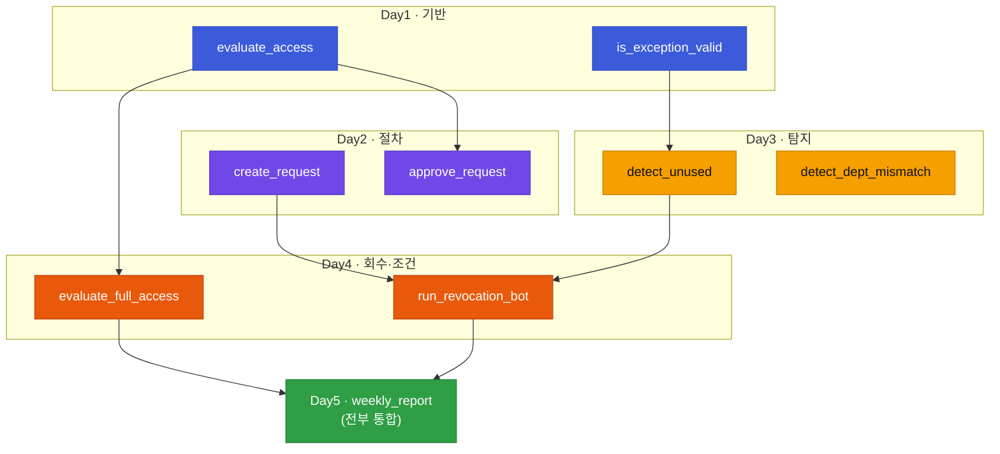
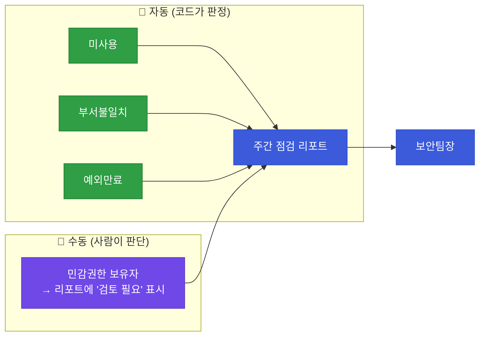
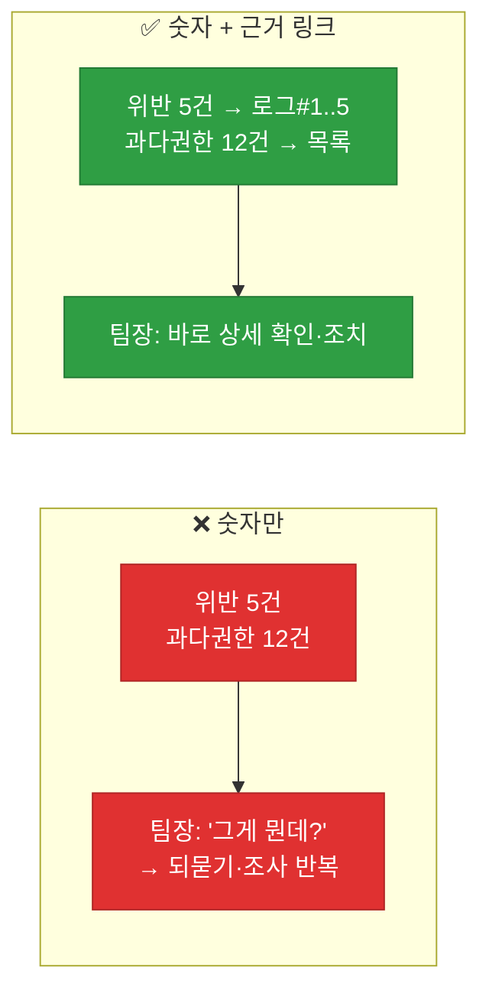
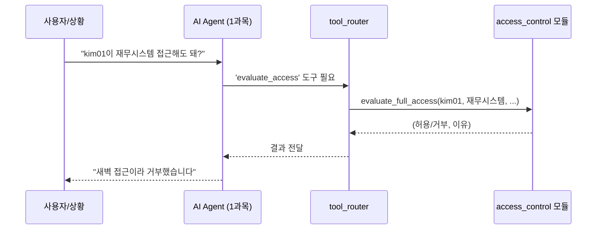

# 강의1 · 점검 체크리스트와 리포트 자동화 설계 (오전, 총 120분)

> **이 교시 한 문장:** 1~4일차에 만든 조각들이 어떻게 서로 맞물리는지 **한 장의 지도**로 정리하고, 정기 점검 **체크리스트**와 주간 **리포트 구조**를 설계하며, 1과목 AI Agent와의 **연동 지점**을 확인합니다.

| 시간 | 소주제 | 핵심 한 줄 |
|------|--------|-----------|
| 00-25분 | 1~4일차 종합 지도 | 조각들이 어떻게 맞물리나 |
| 25-55분 | 권한 점검 체크리스트 완성 | 자동 3 + 수동 1 |
| 55-85분 | 결과 리포트 자동화 설계 | 무엇을 한 장에 담나 |
| 85-110분 | agent_core 연동 지점 | 함수를 도구로 등록 |
| 110-120분 | 정리 | 설계 확정 → 오후 구현 |

## 이 교시에 나오는 어려운 용어

| 용어 (한글발음) | 한 줄 뜻 (아주 쉽게) | 비유 |
|----------------|----------------------|------|
| **통합(integration, 인테그레이션)** | 흩어진 부품을 하나로 합침 | 부품 조립해 완성차 |
| **모듈(module, 모듈)** | 관련 함수를 묶은 하나의 단위 | 부서 하나 |
| **오케스트레이션(orchestration)** | 여러 부품을 순서대로 지휘 | 지휘자 |
| **체크리스트(checklist)** | 빠짐없이 확인할 항목 목록 | 비행 전 점검표 |
| **주간 리포트(weekly report)** | 한 주간 상황 요약 보고서 | 주간 업무보고 |
| **임계치(threshold, 스레숄드)** | 넘으면 조치하는 기준값 | 경보 온도 |
| **tool_router(툴 라우터)** | AI Agent가 도구를 고르는 장치 | 연장통에서 도구 꺼내기 |
| **tool_registry(툴 레지스트리)** | 도구 이름↔함수 연결표 | 도구 목록표 |
| **도구 등록(tool registration)** | 함수를 Agent가 쓸 도구로 올림 | 연장통에 넣기 |
| **컴플라이언스(compliance)** | 법·규정 준수 | 규칙 지키기 |
| **근거 링크(evidence link)** | 숫자의 출처가 되는 상세 기록 | 각주·출처 |
| **단일 책임(single responsibility)** | 한 함수는 한 가지만 | 한 사람 한 역할 |

---

## ⏱️ 00-25분 · 1~4일차 종합 지도

!!! info "📘 학습자 뷰 · 처음 보는 나"
    지난 4일을 되짚어 봅시다. 각 날이 **다음 날의 재료**가 되며 쌓였습니다.

    | Day | 만든 것 | 다음 날에서 재사용 |
    |-----|---------|-------------------|
    | Day1 | RBAC, `evaluate_access()`, `is_exception_valid()` | Day2 승인검증, Day3 예외탐지, Day4 최종엔진 |
    | Day2 | 요청-승인, `create_request()` | Day4 **회수 승인**에 재사용 |
    | Day3 | 과다권한 탐지 후보 | Day4 회수봇 **입력** |
    | Day4 | 회수봇, `evaluate_full_access()` | Day5 리포트·연동 |
    | Day5 | **통합 + 리포트 + 연동** | 캡스톤 완성본 |

    오늘의 메시지: **"우리는 5일간 레고 블록을 만들었고, 오늘 그걸 하나의 완성품으로 조립한다."**

### 🔬 깊이 보기 — 모듈이 쌓여온 길 (재사용 지도)



화살표가 **재사용의 흐름**입니다. `create_request`(Day2)가 `run_revocation_bot`(Day4)으로, `evaluate_access`(Day1)가 곳곳으로 흘러갑니다. 오늘의 `weekly_report`는 이 모든 걸 한자리에 모읍니다.

!!! example "🎓 강사 뷰 · 재사용 사례를 짚어 성취감 주기"
    *"가장 많이 재사용된 게 뭘까요? Day2의 `create_request()`입니다. 부여 요청에도, 회수 승인에도 쓰였죠. '한 번 잘 만든 함수는 계속 산다'는 걸 이 5일이 증명합니다. 여러분이 만든 게 버려지지 않고 계속 쓰인 겁니다."*

!!! question "확인질문"
    **Q. 이 4일 중 어느 모듈이 서로 가장 많이 재사용되었나요?**

    **A.** **Day2의 `create_request()`** 가 대표적입니다.

    권한을 '부여'할 때의 요청-승인에도 쓰였고, Day4에서 권한을 '회수'할 때의 승인 요청(`create_revocation_approval`)에도 그대로 재사용됐습니다. 방향(부여/회수)은 반대지만 '승인 절차'라는 구조가 같아, 한 번 만든 함수를 여러 맥락에서 쓴 것입니다. Day1의 `evaluate_access()`도 승인 검증·최종 엔진 등 여러 곳에서 재사용됐습니다.

<div class="quiz">
<p class="quiz-q"><span class="tag">퀴즈</span><b>3과목 5일 내내 '한 번 만든 함수를 다음 날 재사용'하는 방식으로 쌓아온 것이 주는 실질적 이점은?</b></p>
<button class="quiz-opt">코드 줄 수가 많아져 더 전문적으로 보인다</button>
<button class="quiz-opt" data-correct>같은 로직을 다시 짜지 않아 중복·버그가 줄고, 각 함수를 개선하면 그것을 쓰는 모든 곳이 함께 좋아진다</button>
<button class="quiz-opt">함수가 많으면 실행이 자동으로 빨라진다</button>
<button class="quiz-opt">재사용하면 로그를 남길 필요가 없다</button>
<div class="quiz-explain"><b>정답: 2번.</b> 재사용의 핵심 이득은 중복 제거와 일관성입니다. `create_request`를 한 번 고치면 부여·회수 승인이 동시에 개선됩니다. 이것이 모듈화로 얻는 유지보수성입니다.</div>
<button class="quiz-retry">다시 풀기</button>
</div>

---

## ⏱️ 25-55분 · 권한 점검 체크리스트 완성

!!! info "📘 학습자 뷰 · 처음 보는 나"
    정기 점검 때 담당자가 **빠짐없이** 따라야 할 최종 체크리스트를 확정합니다.

    | # | 점검 항목 | 판단 기준 | 자동/수동 | 담당 함수 |
    |---|-----------|-----------|-----------|-----------|
    | 1 | 90일 미사용 권한 | 마지막 사용 > 90일 | 🤖 자동 | `detect_unused_permissions` |
    | 2 | 부서 불일치 권한 | 현재부서 ≠ 권한부서 | 🤖 자동 | `detect_dept_mismatch` |
    | 3 | 만료된 예외 승인 | 만료일 < 오늘 | 🤖 자동 | `is_exception_valid` |
    | 4 | 민감 권한 보유자 재검토 | 업무 필요성 재판단 | 👤 수동 | (사람) |

    앞 3개는 Day3에서 만든 **함수가 자동 판정**, 4번은 **사람이 맥락으로 판단**합니다.

### 🔬 깊이 보기 — 자동/수동의 경계를 리포트가 어떻게 다루나



**리포트는 자동/수동을 없애지 않고 함께 담습니다.** 자동 항목은 "이만큼 잡혔다"는 결과를, 수동 항목은 "이건 사람이 봐야 한다"는 표시를 올립니다. 자동화의 역할은 사람의 판단을 **없애는** 게 아니라 **집중시키는** 것입니다 — 미사용 500건은 코드가 걸러 주고, 사람은 민감 권한 몇 건만 깊이 봅니다.

!!! question "확인질문"
    **Q. 이 체크리스트에서 자동화 가능한 항목과 사람이 반드시 봐야 하는 항목은 어떻게 구분될까요?**

    **A.** **판단 기준이 명확한 규칙인지로 구분됩니다.**

    "90일 미사용", "부서 불일치", "예외 만료일 경과"는 날짜·값 비교로 딱 떨어지는 규칙이라 코드가 자동 판정합니다. 반면 "이 민감 권한이 지금도 업무상 꼭 필요한가"는 맥락과 재량이 필요한 판단이라 사람이 봐야 합니다. 자동화는 사람이 봐야 할 것만 남겨 집중하게 해 줍니다.

<div class="quiz">
<p class="quiz-q"><span class="tag">퀴즈</span><b>점검 체크리스트에서 '민감 권한 보유자 재검토'만 수동으로 두는 이유로 가장 적절한 것은?</b></p>
<button class="quiz-opt">민감 권한은 코드로 조회할 수 없어서</button>
<button class="quiz-opt" data-correct>"지금도 업무상 꼭 필요한가"는 맥락·재량이 필요한 판단이라 명확한 규칙으로 자동화하기 어렵기 때문</button>
<button class="quiz-opt">민감 권한은 개수가 항상 0이라서</button>
<button class="quiz-opt">수동이 자동보다 항상 더 안전해서</button>
<div class="quiz-explain"><b>정답: 2번.</b> 자동/수동의 경계는 '규칙의 명확성'입니다. 필요성 판단은 업무 맥락이 필요해 사람 몫이고, 날짜·값 비교로 되는 항목은 코드 몫입니다.</div>
<button class="quiz-retry">다시 풀기</button>
</div>

---

## ⏱️ 55-85분 · 접근통제 결과 리포트 자동화 설계

!!! abstract "이 블록을 마치면"
    ✔ 주간 리포트에 ==무엇을·어떤 형태로 담을지== 설계할 수 있다

!!! info "📘 학습자 뷰 · 처음 보는 나"
    주간 리포트에는 1~4일차 모든 모듈의 현황을 종합합니다.

    | 리포트 항목 | 출처 모듈 | 형태 |
    |-------------|-----------|------|
    | 정책 위반 건수 | Day1 정책 | 숫자 + 근거 링크 |
    | 요청 처리 현황(대기/승인/반려) | Day2 요청승인 | 숫자 |
    | 과다권한 후보 수 | Day3 탐지 | 숫자 + 목록 |
    | 회수 이력 | Day4 회수봇 | 숫자 + 로그 링크 |

    핵심 설계 원칙: **숫자만 주지 말고 '근거 링크'를 함께** 준다. "위반 5건"만 있으면 팀장은 "어떤 5건?"을 되물어야 합니다. "위반 5건 → 상세 로그"가 있으면 바로 확인합니다.

### 🔬 깊이 보기 — 숫자만 vs 숫자+근거



!!! example "🎓 강사 뷰 · '요약 + 상세'의 균형"
    *"좋은 리포트는 두 층입니다. 맨 위엔 **한눈에 보는 숫자**(총 몇 건), 그 아래엔 **파고들 근거**(어떤 건들). 바쁜 팀장은 숫자만 보고, 조사할 땐 근거로 내려갑니다. Day3 리포트에 `total_candidates`와 세부 목록을 함께 둔 것과 같은 원리예요."*

!!! question "확인질문"
    **Q. 이 리포트를 매주 자동 생성해 보안팀장에게 메일로 보낸다면(1과목 알림 연동), 팀장의 업무는 어떻게 바뀔까요?**

    **A.** **직접 조회·집계하는 일이 사라지고, '검토·판단'에 집중하게 됩니다.**

    지금까지는 팀장이 여러 시스템을 돌며 "위반이 몇 건인지, 과다권한이 얼마나 되는지"를 직접 확인해야 했습니다. 자동 리포트가 매주 숫자와 근거를 정리해 오면, 팀장은 수집·집계 대신 "이 건들을 어떻게 조치할지"라는 판단에만 시간을 씁니다. 반복 작업을 코드가, 의사결정을 사람이 맡는 분업이 완성됩니다.

<div class="quiz">
<p class="quiz-q"><span class="tag">퀴즈</span><b>주간 리포트에 '건수'만 넣는 것보다 '건수 + 근거 로그 링크'를 함께 넣는 것이 나은 이유는?</b></p>
<button class="quiz-opt">링크가 있으면 리포트 파일이 작아진다</button>
<button class="quiz-opt" data-correct>숫자로 규모를 빠르게 파악하고, 필요하면 근거로 바로 파고들 수 있어 되묻기·재조사가 줄기 때문</button>
<button class="quiz-opt">근거 링크는 자동으로 문제를 해결해 준다</button>
<button class="quiz-opt">건수는 부정확하지만 링크는 정확하기 때문</button>
<div class="quiz-explain"><b>정답: 2번.</b> 좋은 리포트는 '요약(숫자)'과 '상세(근거)'를 함께 줍니다. 요약으로 우선순위를 정하고 상세로 조치하니, 팀장이 다시 자료를 요청할 필요가 없습니다.</div>
<button class="quiz-retry">다시 풀기</button>
</div>

---

## ⏱️ 85-110분 · agent_core 연동 지점 확인

!!! info "📘 학습자 뷰 · 처음 보는 나"
    지금까지 만든 함수를 **1과목 AI Agent가 부를 수 있게** 등록합니다. 방법은 놀랄 만큼 간단합니다.

    ```python
    tool_registry['evaluate_access']     = access_control.evaluate_full_access
    tool_registry['run_revocation_bot']  = access_control.run_revocation_bot
    ```

    `tool_registry`는 **"도구 이름 → 실제 함수"** 를 잇는 표입니다. 여기 등록하면, AI Agent가 "접근 판단이 필요해" 싶을 때 `evaluate_access`라는 이름으로 우리 함수를 **도구처럼 꺼내 씁니다.**

### 🔬 깊이 보기 — 함수가 'AI Agent의 도구'가 되는 원리



여기서 중요한 건, **AI Agent는 우리 함수의 내부를 전혀 몰라도** 된다는 점입니다. 이름(`evaluate_access`)과 입출력 약속만 알면 됩니다. 우리가 진입점(`evaluate_full_access`)을 잘 만들어 뒀기 때문에(Day4), 등록 두 줄로 AI가 접근통제 능력을 갖게 됩니다.

!!! example "🎓 강사 뷰 · 3과목이 캡스톤에서 사는 법"
    *"3과목이 왜 중요할까요? 1과목이 'AI Agent의 뇌'라면, 3과목은 그 뇌가 쓰는 '접근통제 손발'입니다. 오늘 등록 두 줄로 우리 손발이 뇌에 연결됩니다. 여러분이 5일간 만든 게 캡스톤에서 실제로 호출된다는 걸 보여주세요."*

!!! question "확인질문"
    **Q. `tool_registry['evaluate_access'] = evaluate_full_access`처럼 등록해두면, AI Agent는 어떤 방식으로 접근통제 기능을 '호출'하게 될까요?**

    **A.** **'evaluate_access'라는 이름으로 도구를 꺼내 함수를 실행**합니다.

    AI Agent는 접근 판단이 필요할 때 `tool_registry`에서 그 이름에 연결된 함수(`evaluate_full_access`)를 찾아 호출하고, 돌아온 "허용/거부 + 이유"를 받아 다음 행동을 정합니다. Agent는 함수 내부(정책·조건·JIT)를 몰라도 이름과 입출력만으로 접근통제 능력을 쓸 수 있습니다.

<div class="quiz">
<p class="quiz-q"><span class="tag">퀴즈</span><b>우리가 만든 함수를 <code>tool_registry</code>에 등록해 AI Agent의 도구로 만들 때, Day4에서 <code>evaluate_full_access()</code>를 '진입점 하나'로 설계해 둔 것이 왜 도움이 되는가?</b></p>
<button class="quiz-opt">함수 이름이 길어야 등록되기 때문</button>
<button class="quiz-opt" data-correct>Agent는 복잡한 내부를 몰라도 진입점 함수 하나만 호출하면 되므로, 등록과 사용이 간단해지기 때문</button>
<button class="quiz-opt">진입점이 있으면 로그가 자동 생성되기 때문</button>
<button class="quiz-opt">tool_registry는 함수가 하나일 때만 작동하기 때문</button>
<div class="quiz-explain"><b>정답: 2번.</b> '복잡함은 안으로, 단순한 문은 밖으로'(Day4) 설계 덕분에, 도구로 등록할 때 진입점 하나만 연결하면 됩니다. 내부가 아무리 복잡해도 Agent 입장에선 함수 하나입니다.</div>
<button class="quiz-retry">다시 풀기</button>
</div>

!!! tip "🧠 파인만 자가진단"
    안 보고 말할 수 있으면 통과입니다.

    1. 5일간 가장 많이 재사용된 함수와 그 이유
    2. 점검 체크리스트의 자동 3항목과 수동 1항목
    3. 리포트에 '숫자 + 근거'를 함께 담는 이유
    4. 함수가 AI Agent의 '도구'가 되는 원리(tool_registry)

---

## ⏱️ 110-120분 · 정리

**오전 정리:**

1. 5일간의 함수는 **서로 재사용**되며 쌓였다(특히 `create_request`)
2. 점검 체크리스트: **자동 3(미사용·부서·예외) + 수동 1(민감권한)**
3. 리포트는 **숫자 + 근거 링크**를 함께 담는다(요약+상세)
4. 핵심 함수를 **`tool_registry`에 등록**하면 AI Agent의 도구가 된다

오후에는 이 설계를 `weekly_report.py`로 **실제 구현**하고, 저장·알림·코드 리뷰까지 마칩니다.

---

## ✅ 가르칠 준비 체크리스트 (강의1)

- [ ] 1~4일차 재사용 관계를 지도로 설명한다
- [ ] 가장 많이 재사용된 함수를 짚는다
- [ ] 점검 체크리스트의 자동/수동 구분을 설명한다
- [ ] 리포트의 '숫자+근거' 원칙을 설명한다
- [ ] `tool_registry` 등록으로 AI Agent 도구가 되는 원리를 설명한다
- [ ] Day4 진입점 설계가 연동을 쉽게 함을 연결한다
- [ ] 확인질문 5개 + 퀴즈에 답한다

*[tool_router]: AI Agent가 등록된 도구(함수)를 골라 호출하는 장치
*[integration]: 통합 — 흩어진 모듈을 하나로 합침
*[threshold]: 임계치 — 넘으면 조치하는 기준값
