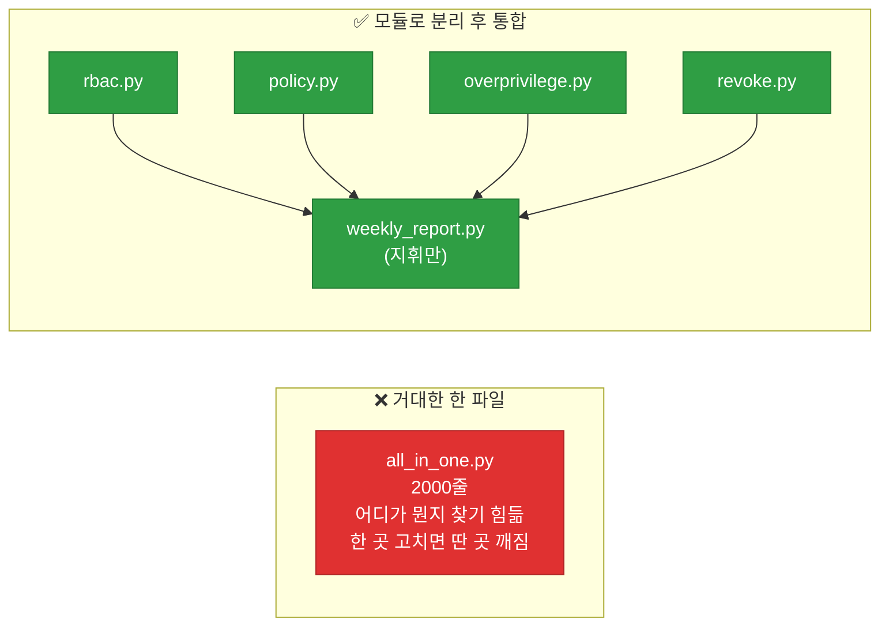
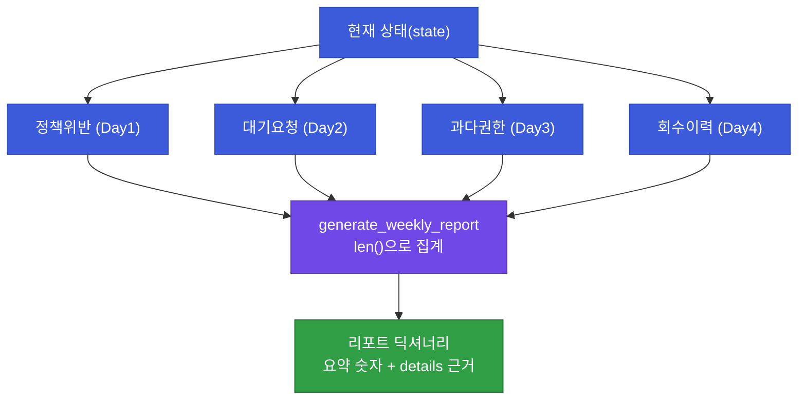
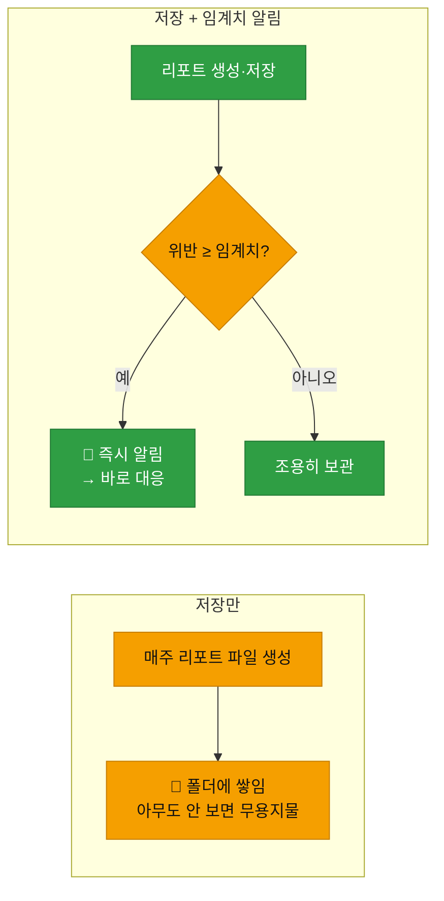
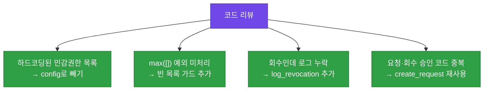

# 강의2 · 주간 리포트 통합 구현과 최종 리뷰 (오후, 총 120분)

> **이 교시 한 문장:** 1~4일차 모듈을 모두 import하는 `weekly_report.py`를 라이브 코딩하고, `generate_weekly_report()`로 현황을 종합해 **파일 저장 + 임계치 알림**까지 붙인 뒤, 코드 리뷰 체크리스트로 모듈 전체를 점검합니다.

| 시간 | 소주제 | 핵심 한 줄 |
|------|--------|-----------|
| 00-25분 | `weekly_report.py` 오케스트레이션 골격 | 여러 모듈을 한자리에 |
| 25-55분 | `generate_weekly_report()` 구현 | 건수 + 근거를 종합 |
| 55-80분 | 파일 저장 & 알림 연동 | 저장만 vs 알림까지 |
| 80-105분 | 전체 코드 리뷰 체크리스트 | 내 코드의 약점 찾기 |
| 105-120분 | 발표 준비 안내 | 모듈 구조도 + 데모 |

## 이 교시에 나오는 어려운 용어

| 용어 (한글발음) | 한 줄 뜻 (아주 쉽게) | 비유 |
|----------------|----------------------|------|
| **import(임포트)** | 다른 파일의 함수를 가져다 씀 | 옆 부서 사람 부르기 |
| **`from X import *`** | X의 모든 함수를 가져옴 | 통째로 빌리기 |
| **오케스트레이션(orchestration)** | 여러 부품을 순서대로 지휘 | 지휘자 |
| **관심사 분리(separation of concerns)** | 파일마다 한 가지 일만 | 부서별 업무 분담 |
| **집계(aggregation)** | 여러 결과를 하나로 모음 | 부서별 합계 |
| **`len()`(렌)** | 개수 세기 | 몇 건 |
| **f-string(에프 스트링)** | 값을 문자열에 끼워넣기 | 빈칸 채우기 |
| **임계치(threshold)** | 넘으면 조치하는 기준 | 경보 온도 |
| **알림 연동(alert integration)** | 조건 충족 시 통지 보냄 | 화재 시 사이렌 |
| **코드 리뷰(code review)** | 코드의 문제를 함께 점검 | 원고 교정 |
| **회귀 위험(regression)** | 고치다 딴 걸 망가뜨림 | 한쪽 누르니 반대쪽 튀어나옴 |
| **재현성(reproducibility)** | 같은 입력이면 같은 결과 | 레시피대로면 같은 맛 |

---

## ⏱️ 00-25분 · `weekly_report.py` 오케스트레이션 골격

!!! info "📘 학습자 뷰 · 처음 보는 나"
    지금까지 파일이 여러 개(rbac·policy·request_flow·overprivilege·revoke·conditional)로 나뉘어 있었죠. 오늘 새 파일 `weekly_report.py`가 **이들을 모두 불러와 지휘**합니다.

    ```python
    from rbac import *
    from policy import *
    from request_flow import *
    from overprivilege import *
    from revoke import *
    from conditional import *
    ```

    핵심 질문: **왜 처음부터 한 파일에 다 안 짜고, 여러 파일로 나눴다가 여기서 합칠까요?**

### 🔬 깊이 보기 — 왜 파일을 나눴다 합치나 (관심사 분리)



**관심사 분리(separation of concerns)** 의 힘입니다. 파일마다 한 주제만 담으면:

- **찾기 쉽다** — 회수 문제는 `revoke.py`만 보면 됩니다.
- **고치기 안전하다** — `revoke.py`를 고쳐도 `policy.py`는 안 건드립니다(회귀 위험↓).
- **나눠 개발** — 여러 사람이 각 파일을 동시에 작업.

거대한 한 파일은 처음엔 편하지만, 커질수록 "어디가 뭔지" 미궁이 됩니다.

!!! example "🎓 강사 뷰 · `import *`의 명암도 언급"
    *"`from x import *`는 편하지만, 실무에선 이름 충돌 위험 때문에 `from rbac import has_permission`처럼 명시적으로 쓰는 걸 권합니다. 오늘은 교육용으로 통째 import를 쓰되, '실무에선 필요한 것만 콕 집는다'를 한마디 덧붙이세요."*

!!! question "확인질문"
    **Q. 여러 모듈을 한 파일에서 import해서 쓰는 것이, 처음부터 하나의 거대한 파일로 짜는 것보다 왜 유지보수에 유리할까요?**

    **A.** **파일마다 한 가지 주제만 담아, 찾기 쉽고 고치기 안전하기 때문**입니다.

    회수 로직 문제는 `revoke.py`만, 정책 문제는 `policy.py`만 보면 됩니다. 한 파일을 고쳐도 다른 파일은 건드리지 않으니 "고치다 딴 걸 망가뜨리는" 회귀 위험이 줄고, 여러 사람이 각 모듈을 동시에 작업할 수도 있습니다. 거대한 한 파일은 커질수록 어디가 무엇인지 찾기 어려워집니다.

<div class="quiz">
<p class="quiz-q"><span class="tag">퀴즈</span><b><code>weekly_report.py</code>가 다른 모듈을 import해 '지휘'만 하고 실제 판단 로직은 각 모듈에 두는 구조의 이점으로 가장 적절한 것은?</b></p>
<button class="quiz-opt">import를 많이 하면 실행이 빨라진다</button>
<button class="quiz-opt" data-correct>각 모듈이 한 가지 책임만 지고, 통합 파일은 흐름만 조율해 전체가 읽기·수정하기 쉬워진다</button>
<button class="quiz-opt">한 파일에 다 넣는 것보다 코드 총량이 항상 줄어든다</button>
<button class="quiz-opt">import한 모듈은 테스트할 필요가 없어진다</button>
<div class="quiz-explain"><b>정답: 2번.</b> 관심사 분리 + 오케스트레이션입니다. 각 모듈은 자기 일만, 통합 파일은 순서만. 코드 총량이 주는 건 아니고(3번 오답), 구조가 명확해져 유지보수가 쉬워지는 것이 이점입니다.</div>
<button class="quiz-retry">다시 풀기</button>
</div>

---

## ⏱️ 25-55분 · `generate_weekly_report()` 구현

!!! abstract "이 블록을 마치면"
    ✔ 각 모듈의 현황을 ==하나의 리포트 딕셔너리로 종합==하는 함수를 안다

### 💻 코드 완전 해부 — `generate_weekly_report()`

```python
def generate_weekly_report(state):
    violations   = find_policy_violations(state)                 # ①
    pending      = [r for r in state['requests']                 # ②
                    if r['status'] == 'reviewing']
    candidates   = detect_unused_permissions(state['user_roles'],
                                             state['access_logs']) # ③
    revocations  = load_revocation_log()                          # ④
    return {                                                      # ⑤
        'policy_violations': len(violations),
        'pending_requests': len(pending),
        'overprivilege_candidates': len(candidates),
        'revocations_this_week': len(revocations),
        'details': {                                             # ⑥ 근거
            'violations': violations,
            'candidates': candidates,
        },
    }
```

| 줄 | 하는 일 | 왜 |
|:--:|---------|-----|
| **①** | Day1 정책으로 위반 색출 | 위반 현황 |
| **②** | `reviewing` 상태만 = 대기 요청 | 처리 대기 현황 |
| **③** | Day3 탐지로 과다권한 후보 | 탐지 현황 |
| **④** | Day4 회수 로그 불러오기 | 이번 주 회수 |
| **⑤** | 각 항목을 **`len()`으로 건수화** | 한눈 요약 |
| **⑥** | 세부 목록을 **`details`에 근거로** | 파고들 상세(강의1 원칙) |

**⑤(요약 숫자) + ⑥(상세 근거)** 이 함께 있는 게 핵심입니다. 강의1에서 설계한 "숫자 + 근거"를 코드로 실현한 것입니다.

!!! example "🎓 강사 뷰 · 이 함수도 '지휘자'"
    - `generate_weekly_report()`는 스스로 탐지·판정을 하지 않습니다. 각 모듈 함수를 부르고 **`len()`으로 세어 모을** 뿐이죠. Day4 `run_revocation_bot`과 같은 오케스트레이션 패턴입니다.
    - 학생 질문 유도: *"여기에 Day4 회수 건수를 넣으려면 어느 함수를 부르면 될까?"* → `load_revocation_log()`. 5일치 함수가 여기서 한 번에 소환되는 걸 체감시키세요.

### 🔬 깊이 보기 — 리포트 한 장이 만들어지는 흐름



!!! question "확인질문"
    **Q. 이 리포트에 숫자(건수)만 있는 것과, 건수 + 근거 로그가 함께 있는 것 중, 보안팀장에게는 어느 쪽이 유용할까요?**

    **A.** **건수 + 근거가 함께 있는 쪽**이 유용합니다.

    건수만 있으면 "위반 5건"을 보고도 "어떤 5건인지" 다시 물어봐야 합니다. `details`에 근거 목록이 함께 있으면, 팀장은 요약 숫자로 규모를 파악한 뒤 곧바로 상세를 열어 조치할 수 있습니다. 요약(빠른 파악)과 근거(즉시 조치)를 모두 주는 것이 실무에 쓸 수 있는 리포트입니다.

<div class="quiz">
<p class="quiz-q"><span class="tag">퀴즈</span><b><code>generate_weekly_report()</code>가 각 항목을 <code>len()</code>으로 세어 요약하면서도 <code>details</code>에 원본 목록을 함께 담는 설계의 목적은?</b></p>
<button class="quiz-opt">len()이 목록보다 정확해서</button>
<button class="quiz-opt" data-correct>맨 위 요약 숫자로 빠르게 규모를 알고, 필요하면 details 근거로 파고들 수 있게 하려고</button>
<button class="quiz-opt">details가 있으면 알림이 자동으로 나가서</button>
<button class="quiz-opt">숫자와 목록 중 하나만 있으면 에러가 나서</button>
<div class="quiz-explain"><b>정답: 2번.</b> 강의1에서 설계한 '요약 + 상세' 원칙을 코드로 옮긴 것입니다. 숫자로 우선순위를, 근거로 조치를 지원합니다.</div>
<button class="quiz-retry">다시 풀기</button>
</div>

---

## ⏱️ 55-80분 · 리포트 파일 저장과 알림 연동

!!! info "📘 학습자 뷰 · 처음 보는 나"
    리포트를 만들었으면 **저장**하고, 심각하면 **알립니다.**

    ```python
    def save_and_alert(report, threshold=10):
        fname = f"access_control_weekly_report_{today_str()}.md"   # ①
        write_markdown(report, fname)                              # ②
        if report['policy_violations'] >= threshold:               # ③
            send_alert(f"⚠️ 정책 위반 {report['policy_violations']}건 — 확인 요망")  # ④
    ```

    - ① 날짜가 들어간 파일명 → 매주 다른 파일로 이력이 쌓임
    - ② 마크다운으로 저장(1과목 '템플릿+데이터 결합' 재사용)
    - ③ 위반이 **임계치(10건)** 이상이면
    - ④ 알림 발송

### 🔬 깊이 보기 — '저장만' vs '알림까지'의 실무 차이



**저장만 하면 '누군가 열어봐야' 의미가 생깁니다.** 바쁜 팀은 안 열어보기 쉽죠. **임계치 알림**을 붙이면, 평소엔 조용하다가 **심각할 때만** 능동적으로 알립니다("push"). 사람의 주의를 아껴 진짜 중요한 순간에만 쓰는 겁니다.

!!! example "🎓 강사 뷰 · 임계치의 의미"
    *"임계치가 없으면 매주 알림이 와서 '알림 피로'로 다 무시하게 됩니다. 임계치는 '이 정도면 사람을 깨울 만하다'의 선이에요. 너무 낮으면 시끄럽고, 너무 높으면 놓칩니다. 이 균형이 실무 감각입니다."*

!!! question "확인질문"
    **Q. 매주 리포트를 자동 생성해 저장만 하는 것과, 특정 조건에서 알림까지 보내는 것 사이엔 어떤 실무 차이가 있을까요?**

    **A.** **저장만 하면 누군가 열어봐야 의미가 생기지만, 알림은 심각할 때 능동적으로 주의를 끕니다.**

    저장만 하는 리포트는 바쁜 팀이 안 열어보면 무용지물이 되기 쉽습니다. 임계치 알림을 붙이면 평소엔 조용히 쌓이다가, 위반이 기준을 넘는 순간 자동으로 통지가 가서 즉시 대응할 수 있습니다. 사람의 주의를 정말 필요한 순간에만 쓰게 하는 차이입니다.

<div class="quiz">
<p class="quiz-q"><span class="tag">퀴즈</span><b>리포트에 <code>if violations >= threshold</code> 같은 임계치 알림을 두되 매주 무조건 알리지는 않는 설계의 이유는?</b></p>
<button class="quiz-opt">알림은 파일 저장보다 느려서</button>
<button class="quiz-opt" data-correct>매번 알리면 '알림 피로'로 다 무시하게 되므로, 심각한 경우에만 알려 주의를 아끼려고</button>
<button class="quiz-opt">임계치가 없으면 리포트를 저장할 수 없어서</button>
<button class="quiz-opt">threshold가 있으면 위반이 자동으로 사라져서</button>
<div class="quiz-explain"><b>정답: 2번.</b> 모든 것을 알리면 아무것도 안 보게 됩니다(알림 피로). 임계치는 '사람을 깨울 만한 수준'의 선을 그어, 알림의 신뢰도를 지킵니다.</div>
<button class="quiz-retry">다시 풀기</button>
</div>

---

## ⏱️ 80-105분 · 전체 코드 리뷰 체크리스트

!!! abstract "이 블록을 마치면"
    ✔ `access_control/` 전체를 ==스스로 점검하는 기준==을 갖는다

!!! info "📘 학습자 뷰 · 처음 보는 나"
    5일간 만든 코드를 **네 가지 기준**으로 되돌아봅니다.

    | 리뷰 항목 | 확인 질문 | 관련 배운 날 |
    |-----------|-----------|--------------|
    | **config 하드코딩** | 바뀔 값을 코드에 박아두지 않았나? | Day1·Day4 |
    | **예외처리 누락** | 없는 키·빈 목록에서 에러 안 나나? | Day1·Day3 |
    | **로깅 일관성** | 모든 회수·승인이 로그를 남기나? | Day2·Day4 |
    | **함수 재사용성** | 같은 로직을 중복해 짜지 않았나? | 전체 |

### 🔬 깊이 보기 — 코드 리뷰가 잡아내는 대표 결함



이 네 가지는 3과목 내내 **반복 강조된 원칙**입니다. 리뷰는 "새 지식"이 아니라 "배운 원칙을 내 코드에 적용했나"의 자기 점검입니다.

!!! example "🎓 강사 뷰 · 리뷰를 학습 마무리로"
    *"이 체크리스트가 사실 3과목 전체 요약입니다. config 분리(Day1·4), 예외 안전(Day1·3), 로그(Day2·4), 재사용(전체). 자기 코드에서 하나씩 찾아 고치게 하면, 5일 배운 게 손끝에 남습니다."*

!!! question "확인질문"
    **Q. 코드 리뷰 체크리스트 중 스스로 가장 취약하다고 생각하는 항목은 무엇이고, 왜 그럴까요? (자기 성찰)**

    **A.** (정답이 정해진 질문이 아니라 자기 점검용입니다.)

    예시 답변: "예외처리 누락이 가장 취약합니다. 정상 흐름은 잘 짜지만 없는 키·빈 목록 같은 경계 상황을 자주 빠뜨려, `max([])`나 `dict[없는키]`에서 에러가 났던 경험이 있습니다. 그래서 함수마다 `.get(키, 기본값)`과 빈 목록 가드를 먼저 확인하는 습관을 들이려 합니다." — 이렇게 구체적 약점과 개선 방향을 말하면 좋습니다.

<div class="quiz">
<p class="quiz-q"><span class="tag">퀴즈</span><b>이 코드 리뷰 체크리스트(config 분리·예외처리·로깅·재사용)가 사실상 무엇을 담고 있는가?</b></p>
<button class="quiz-opt">파이썬 최신 문법 목록</button>
<button class="quiz-opt" data-correct>3과목 5일간 반복 강조된 핵심 원칙들 — 자기 코드에 적용됐는지 점검하는 요약</button>
<button class="quiz-opt">외부 라이브러리 설치 순서</button>
<button class="quiz-opt">발표 슬라이드 디자인 규칙</button>
<div class="quiz-explain"><b>정답: 2번.</b> 리뷰 항목은 새 지식이 아니라 배운 원칙(데이터 분리·예외 안전·로그·모듈화)의 자기 점검판입니다. 리뷰가 곧 3과목 복습입니다.</div>
<button class="quiz-retry">다시 풀기</button>
</div>

!!! tip "🧠 파인만 자가진단"
    안 보고 말할 수 있으면 통과입니다.

    1. 파일을 나눴다 `weekly_report.py`에서 합치는 이유(관심사 분리)
    2. `generate_weekly_report()`가 '요약 + 근거'를 함께 담는 이유
    3. '저장만' vs '임계치 알림'의 차이
    4. 코드 리뷰 4항목과 각각 배운 날

---

## ⏱️ 105-120분 · 발표 준비 안내

**오후 정리:**

1. `weekly_report.py`가 6개 모듈을 **import해 지휘**(관심사 분리 + 오케스트레이션)
2. `generate_weekly_report()` — 각 모듈 현황을 **`len()` 집계 + `details` 근거**
3. 날짜별 파일 **저장** + **임계치 알림**(알림 피로 방지)
4. 코드 리뷰 4항목 = 3과목 원칙의 **자기 점검**

!!! note "실습·발표 예고 (오후 실습 120분)"
    `weekly_report.py`를 완성하고, `tool_router.py`에 핵심 함수를 등록해 연동을 확인한 뒤, 5분 발표(모듈 구조도 + 데모)를 준비합니다. 상세는 [실습 페이지](practice.md).

!!! success "🎉 3과목 5일 완주"
    RBAC(Day1) → 요청·승인(Day2) → 탐지(Day3) → 회수·조건(Day4) → 통합·리포트(Day5).
    흩어진 함수들이 하나의 `access_control` 모듈로 완성됐고, 1과목 AI Agent가 호출할 도구가 됐습니다.
    **이 모듈이 캡스톤 '접근통제 자동화'의 완성본입니다.**

---

## ✅ 가르칠 준비 체크리스트 (강의2)

- [ ] 관심사 분리(파일 나눔)의 이점을 거대 파일과 대비해 설명한다
- [ ] `generate_weekly_report()`의 집계(⑤)+근거(⑥) 구조를 설명한다
- [ ] '저장만' vs '임계치 알림'의 실무 차이를 설명한다
- [ ] 알림 피로와 임계치 균형을 설명한다
- [ ] 코드 리뷰 4항목이 3과목 원칙 요약임을 짚는다
- [ ] `tool_router` 등록으로 캡스톤에 연결됨을 안내한다
- [ ] 확인질문 5개 + 퀴즈에 답한다

*[separation of concerns]: 관심사 분리 — 파일·함수마다 한 가지 일만
*[threshold]: 임계치 — 알림을 보낼 기준값
*[regression]: 회귀 — 고치다 다른 것을 망가뜨리는 위험
