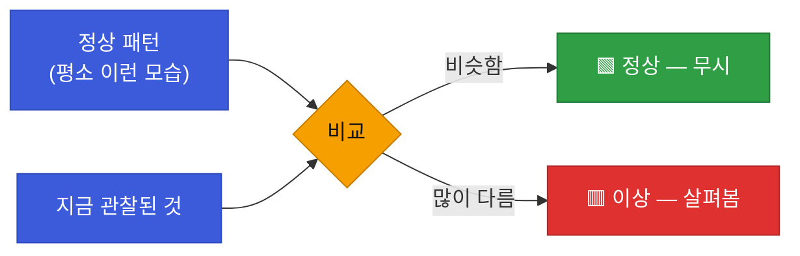
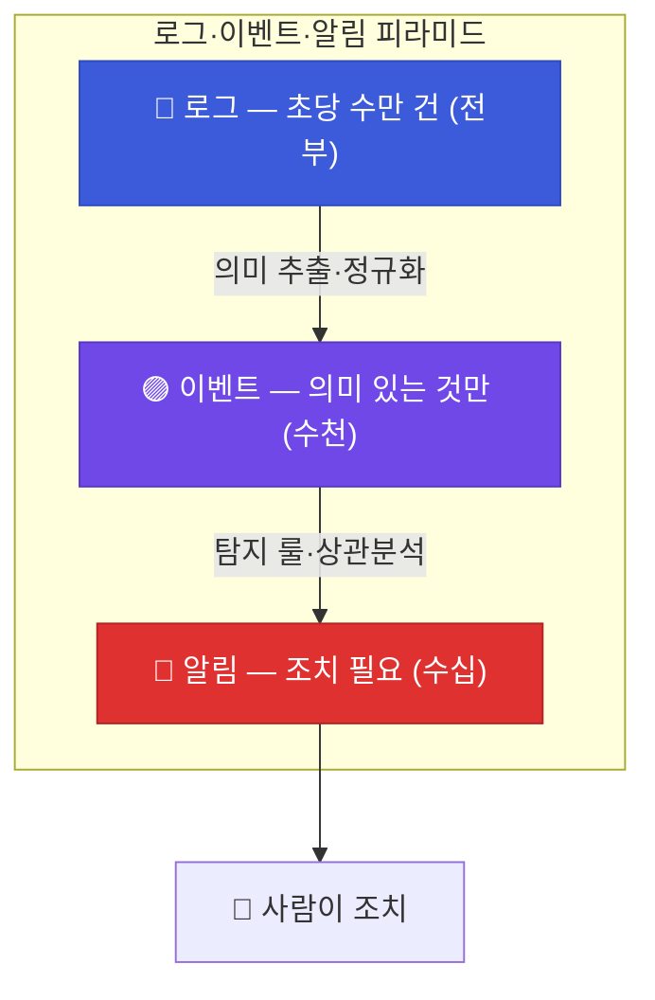
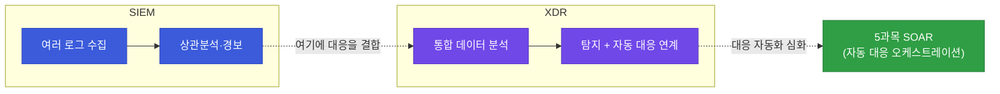
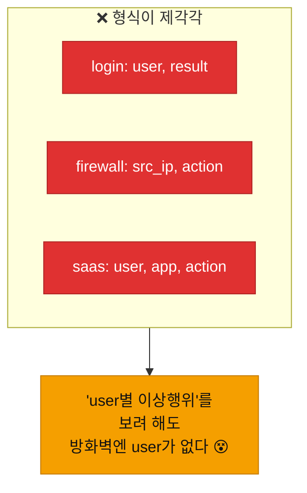

# 강의1 · 로그·이벤트·알림과 SIEM/XDR (오전, 총 120분)

> **이 교시 한 문장:** 이상탐지는 "쏟아지는 로그를 어떻게 사람이 조치할 몇 건으로 줄이나"의 문제이며, 그 계층(로그→이벤트→알림)과 그것을 다루는 시스템(SIEM·XDR)의 큰 그림을 잡습니다.

| 시간 | 소주제 | 핵심 한 줄 |
|------|--------|-----------|
| 00-20분 | 1~3과목 복습 — 왜 이상탐지인가 | 지금까지도 '정상 vs 비정상'을 나눴다 |
| 20-45분 | 로그 vs 이벤트 vs 알림 | 아래는 많고, 위로 갈수록 적고 중요 |
| 45-75분 | SIEM과 XDR 개념 | 모아서 분석(SIEM) → 대응까지(XDR) |
| 75-100분 | 실습 데이터셋 소개 | 3개 로그, 형식이 다르다 |
| 100-120분 | 정리 | 통합하려면 정규화가 필요 |

## 이 교시에 나오는 어려운 용어

| 용어 (한글발음) | 한 줄 뜻 (아주 쉽게) | 비유 |
|----------------|----------------------|------|
| **로그(log, 로그)** | 시스템에 일어난 모든 원시 기록 | CCTV 원본 영상 전체 |
| **이벤트(event, 이벤트)** | 의미 단위로 정리된 로그 | "누가 문 열었다" 한 장면 |
| **알림(alert, 얼럿)** | 사람이 조치해야 할 중요한 이벤트 | 경비실 경보음 |
| **SIEM(씸)** | 여러 로그를 모아 분석·경보하는 시스템 | 관제실 통합 모니터 |
| **XDR(엑스디알)** | 탐지에 자동 대응까지 결합한 시스템 | 경보+자동 잠금장치 |
| **엔드포인트(endpoint)** | PC·서버 등 개별 단말 | 각 사무실 |
| **상관분석(correlation)** | 흩어진 이벤트를 이어 하나의 사건으로 | 여러 CCTV를 이어 붙이기 |
| **경보 피로(alert fatigue)** | 알림이 너무 많아 무뎌짐 | 양치기 소년 효과 |
| **정규화(normalization)** | 서로 다른 형식을 공통 틀로 통일 | 다른 서식을 한 양식으로 |
| **스키마(schema, 스키마)** | 데이터의 정해진 구조·틀 | 서류 양식 |
| **CSV(씨에스브이)** | 쉼표로 나눈 표 데이터 파일 | 엑셀 표를 텍스트로 |
| **파싱(parsing)** | 원시 데이터에서 의미를 뽑아냄 | 문장에서 핵심 추리기 |

---

## ⏱️ 00-20분 · 1~3과목 복습 — 왜 이상탐지가 필요한가

!!! info "📘 학습자 뷰 · 처음 보는 나"
    사실 우리는 이미 여러 번 "정상과 비정상을 구분"해 왔습니다.

    - **1과목:** 로그를 파싱·요약하며 "이상한 줄"을 골랐습니다.
    - **2과목:** 네트워크 품질지표·정책 로그에서 "비정상 지연·차단"을 봤습니다.
    - **3과목:** 과다권한을 "정상 권한과 다른 것"으로 탐지했습니다.

    4과목은 이 흩어진 감각을 **하나의 이상탐지 체계**로 묶습니다. 핵심 질문은 늘 같습니다: **"무엇이 정상이고, 무엇이 그와 다른가?"**

### 🔬 깊이 보기 — 이상탐지는 결국 '차이 찾기'다

모든 이상탐지의 뿌리는 이 그림입니다. **"정상이 무엇인지"를 먼저 정하고**(Day2의 베이스라인), 지금 것을 거기에 비교합니다. 그래서 "정상을 모르면 비정상도 모른다"가 4과목의 첫 번째 진리입니다.

!!! example "🎓 강사 뷰 · 가르치는 나"

    - **도입 멘트:** *"여러분은 이미 3번이나 이상탐지를 했습니다. 다만 그때그때 손으로 했죠. 오늘부터는 그걸 '체계'로 만듭니다. 초당 수만 건이 쏟아져도 자동으로 걸러내는 체계요."*
    - **연결 질문:** 각 과목에서 '정상 vs 비정상'을 나눴던 순간을 학생이 스스로 떠올리게 하면, 4과목이 '새 것'이 아니라 '종합'임을 이해합니다.

!!! question "확인질문"
    **Q. 지금까지 배운 과목 중 '정상 패턴과 비정상 패턴을 구분'하는 작업이 등장했던 사례를 떠올려볼까요?**

    **A.** 여러 번 있었습니다.

    - **1과목**: 로그를 파싱하며 에러·이상 줄을 골라냈습니다.
    - **2과목**: 네트워크 지연·방화벽 차단 로그에서 비정상 상황을 봤습니다.
    - **3과목**: 과다권한(평소와 다른 권한 보유)을 탐지했습니다.

    이 모두가 "정상이 무엇인지 정하고, 그와 다른 것을 찾는" 이상탐지의 축소판이었습니다. 4과목은 이를 하나의 체계로 통합합니다.

퀴즈<b>모든 이상탐지가 공통으로 전제하는 것으로 가장 적절한 것은?</b>

<button class="quiz-opt">이상은 항상 밤에만 발생한다는 것</button>
<button class="quiz-opt" data-correct>'정상이 무엇인지'를 먼저 정의해야, 그와 다른 '비정상'을 판단할 수 있다는 것</button>
<button class="quiz-opt">로그가 많을수록 탐지가 쉬워진다는 것</button>
<button class="quiz-opt">비정상은 사람만 판단할 수 있다는 것</button>

<b>정답: 2번.</b> "정상을 모르면 비정상도 모른다"가 이상탐지의 출발점입니다. 그래서 Day2에서 '베이스라인(평소 패턴)'을 먼저 만듭니다.

<button class="quiz-retry">다시 풀기</button>

---

## ⏱️ 20-45분 · 로그 vs 이벤트 vs 알림 (피라미드)

!!! info "📘 학습자 뷰 · 처음 보는 나"
    세 단어를 계층으로 이해하면 이상탐지 전체가 보입니다.

    | 층 | 무엇 | 양 | 예시 |
    |----|------|-----|------|
    | **로그** | 발생한 모든 원시 기록 | 초당 수만 건 | 접속·클릭·조회 전부 |
    | **이벤트** | 의미 단위로 정리된 로그 | 로그보다 적음 | "로그인 실패", "VPN 접속" |
    | **알림** | 조치가 필요한 중요 이벤트 | 아주 적음 | "동일 계정 10회 로그인 실패" |

    아래(로그)는 **엄청 많고**, 위(알림)로 갈수록 **적고 중요**합니다. 이상탐지의 일은 이 피라미드에서 **아래를 위로 걸러 올리는 것**입니다.

### 🔬 깊이 보기 — 왜 로그를 전부 알림으로 보내면 안 되나

만약 로그를 **전부 알림으로** 보낸다면? 담당자는 초당 수만 개의 알림에 파묻힙니다. 이걸 **경보 피로(alert fatigue)** 라고 합니다. 알림이 너무 많으면 사람은 결국 **다 무시**하게 되고, 진짜 중요한 것도 놓칩니다("양치기 소년"). 그래서 이상탐지는 **정확히 걸러 소수의 알림만** 올려야 합니다. 이 "거르기"가 4과목 전체의 목표입니다.

!!! example "🎓 강사 뷰 · 피라미드를 몸에 새기기"
    *"이 삼각형 하나가 4과목 전체 지도입니다. 오늘(Day1)은 맨 아래 로그를 이벤트로 정리하고, Day2~3은 이벤트에서 알림을 뽑는 탐지 룰을 만들고, Day4는 그 알림의 정확도를 높이고, Day5는 알림을 AI로 요약합니다. 매일 이 삼각형의 어느 층을 다루는지 짚어 주세요."*

!!! question "확인질문"
    **Q. 모든 로그를 그대로 알림으로 보낸다면 담당자는 어떤 문제를 겪게 될까요?**

    **A.** **경보 피로(alert fatigue)** 를 겪습니다.

    초당 수만 건의 알림이 쏟아지면 사람이 도저히 다 볼 수 없어, 결국 알림 전체를 무시하게 됩니다. 그러면 그 속에 섞인 진짜 중요한 위협도 함께 놓치게 됩니다. 그래서 이상탐지는 로그를 이벤트로, 다시 소수의 중요한 알림으로 걸러 올려서, 사람이 조치할 만한 양만 남겨야 합니다.

퀴즈<b>로그·이벤트·알림 피라미드에서 '위로 갈수록' 나타나는 특징으로 옳은 것은?</b>

<button class="quiz-opt">양이 많아지고 중요도는 낮아진다</button>
<button class="quiz-opt" data-correct>양은 적어지고 중요도(조치 필요성)는 높아진다</button>
<button class="quiz-opt">양과 중요도가 모두 그대로다</button>
<button class="quiz-opt">양은 그대로이고 중요도만 낮아진다</button>

<b>정답: 2번.</b> 로그(많고 원시적) → 이벤트(의미 단위) → 알림(적고 조치 필요). 이상탐지는 아래를 정확히 걸러 위의 소수 알림으로 올리는 일입니다.

<button class="quiz-retry">다시 풀기</button>

!!! tip "🧠 파인만 자가진단"
    안 보고 말할 수 있으면 통과입니다.

    1. 로그·이벤트·알림을 **양과 중요도**로 비교하기
    2. 경보 피로가 무엇이고 왜 위험한지 한 문장으로
    3. 이상탐지의 목표를 피라미드로 설명하기

---

## ⏱️ 45-75분 · SIEM과 XDR 개념

!!! info "📘 학습자 뷰 · 처음 보는 나"
    피라미드를 자동으로 처리해 주는 시스템이 있습니다.

    - **SIEM(씸, Security Information and Event Management):** 여러 시스템의 로그를 **한 곳에 모아 분석·경보**합니다. "관제실의 통합 모니터"입니다.
    - **XDR(엑스디알, Extended Detection and Response):** 엔드포인트·네트워크·클라우드 데이터를 통합 분석하고, 여기에 **자동 대응까지 연계**합니다. SIEM의 "분석"에 **"대응"** 을 더한 것입니다.

    한 줄 비교: **SIEM = 모아서 분석 / XDR = 분석 + 자동 대응.**

### 🔬 깊이 보기 — SIEM에서 XDR로, 그리고 SOAR로

**흐름을 기억하세요.** SIEM(분석)이 기본이고, XDR은 거기에 "탐지되면 자동으로 막는다"를 결합합니다. 그리고 그 **자동 대응을 본격적으로 오케스트레이션하는 게 5과목 SOAR**입니다. 즉 4과목(탐지)은 5과목(대응)의 앞단입니다 — "탐지가 있어야 대응할 게 있다."

!!! example "🎓 강사 뷰 · 우리가 만드는 건 무엇?"
    *"우리는 상용 SIEM/XDR을 쓰는 게 아니라, 그 원리를 파이썬으로 축소 구현합니다. 로그 수집(오늘)·탐지 룰(Day2~3)·튜닝(Day4)·요약(Day5)이 바로 SIEM이 내부에서 하는 일이에요. 원리를 알면 어떤 상용 제품을 만나도 이해합니다."*

!!! question "확인질문"
    **Q. SIEM은 '분석'에 집중한다면, XDR은 여기에 무엇을 추가로 결합할까요?**

    **A.** **자동 대응(Response)** 을 결합합니다.

    SIEM은 여러 로그를 모아 상관분석하고 경보를 울리는 '분석·탐지'가 중심입니다. XDR은 여기에 "탐지되면 자동으로 차단·격리한다"는 대응을 연계해, 탐지에서 대응까지 이어지게 합니다. 이 자동 대응을 더 본격적으로 다루는 것이 5과목 SOAR입니다.

퀴즈<b>SIEM과 XDR의 관계를 가장 잘 설명한 것은?</b>

<button class="quiz-opt">XDR은 SIEM보다 로그를 적게 수집한다</button>
<button class="quiz-opt" data-correct>SIEM이 '모아서 분석·경보'라면, XDR은 여기에 '탐지 후 자동 대응 연계'를 더한 것이다</button>
<button class="quiz-opt">SIEM과 XDR은 완전히 무관한 별개 기술이다</button>
<button class="quiz-opt">XDR은 사람만, SIEM은 기계만 쓴다</button>

<b>정답: 2번.</b> SIEM(분석 중심) + 자동 대응 = XDR. 그 대응 자동화를 심화하면 5과목 SOAR로 이어집니다. 4과목(탐지)은 대응의 앞단입니다.

<button class="quiz-retry">다시 풀기</button>

---

## ⏱️ 75-100분 · 이번 과목 실습 데이터셋 소개

!!! info "📘 학습자 뷰 · 처음 보는 나"
    4과목 내내 쓸 가상 A사의 **3개 로그**를 봅니다. 형식이 **제각각**인 게 포인트입니다.

    | 파일 | 컬럼(형식) | 담는 것 |
    |------|-----------|---------|
    | `login_logs.csv` | timestamp, user, ip, **result** | 로그인 성공/실패 |
    | `firewall_logs.csv` | timestamp, src_ip, dst_ip, port, **action** | 방화벽 허용/차단 |
    | `saas_logs.csv` | timestamp, user, app, action, ip | SaaS 앱 사용 |

    문제: 세 파일의 **컬럼 이름·구조가 다릅니다.** 로그인은 `user`가 있는데 방화벽은 `src_ip`만 있죠. 이대로는 함께 분석할 수 없습니다.

### 🔬 깊이 보기 — 형식이 다르면 왜 통합 분석이 안 되나

"user별로 로그인 실패 후 SaaS 대량 다운로드가 있었나?"를 보려면 세 로그를 **한 사람(user) 기준으로 이어야** 합니다. 그런데 컬럼 이름이 다르면 이을 수가 없죠. 그래서 **다음 단계(오후)에서 공통 스키마로 정규화**합니다 — 이게 이상탐지의 진짜 첫 삽입니다.

!!! question "확인질문"
    **Q. 세 가지 로그 소스가 다른 형식으로 되어 있는데, 이걸 하나로 통합 분석하려면 무엇이 필요할까요?**

    **A.** **공통 스키마로의 정규화**가 필요합니다.

    로그인·방화벽·SaaS 로그는 컬럼 이름과 구조가 제각각이라 그대로는 함께 분석할 수 없습니다. 세 로그를 `timestamp·user·source·event_type·detail` 같은 하나의 공통 틀(스키마)로 변환하면, 사용자·시간 기준으로 이어서 "한 사람의 여러 행동"을 함께 볼 수 있게 됩니다.

퀴즈<b>서로 형식이 다른 3개 로그를 통합 분석하기 전에 '정규화'가 반드시 필요한 이유는?</b>

<button class="quiz-opt">정규화하면 로그 용량이 줄어들기 때문</button>
<button class="quiz-opt" data-correct>컬럼 구조가 제각각이면 user·시간 등 공통 기준으로 이어 분석할 수 없기 때문</button>
<button class="quiz-opt">정규화는 로그를 자동으로 암호화하기 때문</button>
<button class="quiz-opt">정규화하면 탐지 룰이 필요 없어지기 때문</button>

<b>정답: 2번.</b> "user별 이상행위"를 보려면 모든 로그가 같은 틀(user·timestamp 등)을 가져야 합니다. 정규화가 그 공통 틀을 만들어 상관분석(Day3)을 가능하게 합니다.

<button class="quiz-retry">다시 풀기</button>

---

## ⏱️ 100-120분 · 정리

**오전 정리:**

1. 이상탐지 = **정상과 다른 것 찾기** (1~3과목의 종합)
2. **로그→이벤트→알림 피라미드** — 아래는 많고, 위는 적고 중요
3. 다 알리면 **경보 피로** → 정확히 걸러야 한다
4. **SIEM**(모아서 분석) → **XDR**(분석+대응) → **SOAR**(5과목)
5. 3개 로그는 형식이 달라 → **공통 스키마 정규화**가 첫걸음

!!! tip "🎓 강사 뷰 · 오후로"
    *"이론은 여기까지. 오후엔 실제로 pandas를 켜고 로그를 만져 봅니다. CSV를 읽고, 지저분한 값을 청소하고, 세 로그를 하나의 틀로 정규화합니다. 이게 앞으로 5일간 쓸 데이터의 '입구'를 만드는 일이에요."*

---

## ✅ 가르칠 준비 체크리스트 (강의1)

- [ ] 1~3과목이 모두 '정상 vs 비정상'이었음을 연결한다
- [ ] 로그·이벤트·알림을 양·중요도로 구분한다
- [ ] 경보 피로가 왜 생기고 왜 위험한지 설명한다
- [ ] SIEM vs XDR을 '분석 vs 분석+대응'으로 구분한다
- [ ] XDR→SOAR(5과목) 연결을 언급한다
- [ ] 3개 로그의 형식 차이와 정규화 필요성을 설명한다
- [ ] 확인질문 4개 + 퀴즈에 답한다

*[SIEM]: Security Information and Event Management — 로그 통합 분석·경보
*[XDR]: Extended Detection and Response — 통합 탐지 + 자동 대응
*[alert fatigue]: 경보 피로 — 알림 과다로 무뎌지는 현상
*[normalization]: 정규화 — 다른 형식을 공통 틀로 통일
