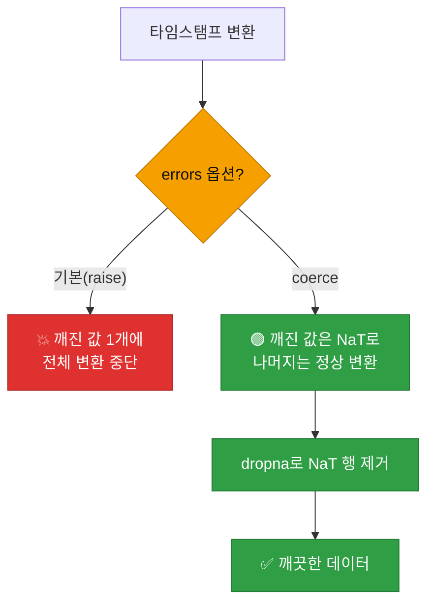
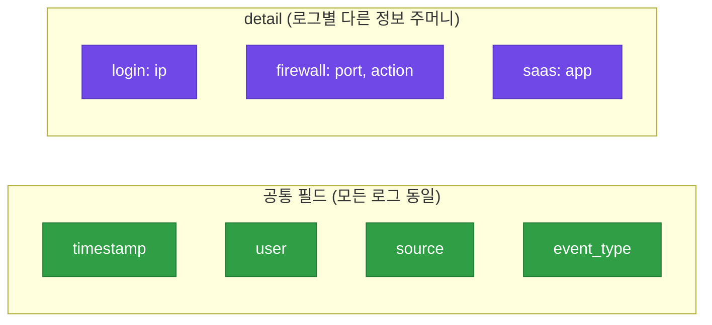
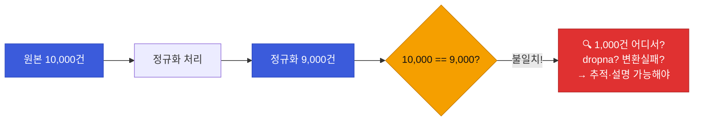

# 강의2 · pandas 로그 탐색·전처리·정규화 (오후, 총 120분)

> **이 교시 한 문장:** 표 데이터를 다루는 새 도구 **pandas(판다스)** 로 로그 CSV를 읽고·탐색하고·청소한 뒤, 형식이 다른 3개 로그를 **공통 스키마로 정규화**해 이상탐지의 입구를 만듭니다.

| 시간 | 소주제 | 핵심 한 줄 |
|------|--------|-----------|
| 00-25분 | pandas로 로그 탐색 | read_csv·head·value_counts |
| 25-50분 | 전처리 — 결측치·이상형식 | to_datetime(coerce)·dropna |
| 50-80분 | 3개 로그 공통 스키마 정규화 | 다른 컬럼을 한 틀로 |
| 80-105분 | 정규화 결과 저장·검증 | 전후 건수 비교 습관 |
| 105-120분 | 실습 안내 | normalize.py 완성 |

## 이 교시에 나오는 어려운 용어

| 용어 (한글발음) | 한 줄 뜻 (아주 쉽게) | 비유 |
|----------------|----------------------|------|
| **pandas(판다스)** | 표 데이터를 다루는 파이썬 도구 | 코드로 쓰는 엑셀 |
| **DataFrame(데이터프레임)** | pandas의 '표' 객체 | 엑셀 시트 한 장 |
| **`read_csv()`** | CSV 파일을 표로 읽음 | 엑셀 파일 열기 |
| **`head()`** | 위에서 몇 줄만 미리보기 | 표 맨 앞장 넘겨보기 |
| **`value_counts()`** | 값별 개수 세기 | 항목별 집계표 |
| **결측치(missing value)** | 비어 있는 값 | 빈칸 |
| **`to_datetime()`** | 문자열을 날짜·시각으로 변환 | 글자를 진짜 날짜로 |
| **`errors='coerce'`** | 변환 실패 시 빈 값(NaT)으로 | 불량품은 빈칸 처리 |
| **`NaT`/`NaN`** | 날짜 없음 / 값 없음 표시 | 빈칸 표식 |
| **`dropna()`** | 빈 값이 있는 행을 버림 | 불량 행 골라 버리기 |
| **정규화(normalization)** | 다른 형식을 공통 틀로 | 다른 서식을 한 양식으로 |
| **`json.dump`** | 파이썬 데이터를 JSON 파일로 | 상자에 담아 저장 |
| **데이터 손실 검증(reconciliation)** | 전후 건수 대조로 누락 확인 | 입출고 수량 대조 |

---

## ⏱️ 00-25분 · pandas로 로그 탐색하기

!!! abstract "이 블록을 마치면"
    ✔ pandas로 CSV를 읽고 ==`head()`·`value_counts()`로 데이터를 훑는== 법을 안다

### 🧱 파이썬 브릿지 — pandas는 '코드로 쓰는 엑셀' (미리 10분)

4과목의 새 도구 **pandas**를 처음 만납니다. 딱 이 그림만 잡으세요.

| 개념 | 뜻 | 엑셀에 비유 |
|------|-----|------------|
| `import pandas as pd` | pandas를 `pd`란 별명으로 부름 | 엑셀 프로그램 켜기 |
| **DataFrame(df)** | 행·열로 된 표 객체 | 시트 한 장 |
| `df['result']` | 'result' **열(컬럼) 전체** | 한 열 선택 |
| `df.head()` | 위 5줄 미리보기 | 맨 앞 몇 행 보기 |
| `df['result'].value_counts()` | 값별 개수 집계 | 피벗 개수 세기 |

> pandas는 "표를 통째로 다루는" 도구입니다. 한 줄씩 `for`로 돌지 않고, **열 전체를 한 번에** 계산합니다. 이 사고 전환이 4과목의 핵심입니다.

### 💻 코드 완전 해부 — 로그 탐색

```python
import pandas as pd                              # ①

df = pd.read_csv('login_logs.csv')               # ②
print(df.head())                                 # ③
print(df['result'].value_counts())               # ④
```

| 줄 | 하는 일 | 왜 |
|:--:|---------|-----|
| **①** | pandas를 `pd`로 불러옴 | 표 도구 준비 |
| **②** | CSV를 DataFrame(표)으로 읽음 | 로그를 다룰 수 있게 |
| **③** | 위 5줄 미리보기 | "데이터가 어떻게 생겼나" 먼저 확인 |
| **④** | `result` 열의 값별 개수 | 성공/실패가 각각 몇 건인지 |

`value_counts()` 결과 예:
```text
success    9820
fail        180
```
→ 전체 1만 건 중 실패 180건(1.8%)임을 **한 줄로** 압니다.

!!! example "🎓 강사 뷰 · '먼저 훑어본다'는 습관"
    *"데이터를 받으면 곧바로 탐지 코드를 짜지 말고, `head()`로 모양을 보고 `value_counts()`로 분포를 봅니다. 이 '탐색'을 건너뛰면, 엉뚱한 가정으로 코드를 짜다 나중에 크게 헤맵니다. 데이터 분석의 첫 단추예요."*

!!! question "확인질문"
    **Q. `value_counts()`로 `result` 컬럼을 확인하면 전체 로그인 시도 중 실패 비율을 바로 알 수 있는데, 이게 왜 유용할까요?**

    **A.** **정상의 기준(베이스라인)을 잡는 출발점이기 때문**입니다.

    실패가 평소 1.8% 정도라는 걸 알면, 어느 날 실패가 갑자기 20%로 뛰었을 때 "이상하다"고 판단할 수 있습니다. 분포를 모르면 특정 수치가 많은지 적은지 판단할 기준이 없습니다. `value_counts()`는 데이터의 평소 모습을 한눈에 보여줘, 이후 탐지 기준을 세우는 데 쓰입니다.

<div class="quiz">
<p class="quiz-q"><span class="tag">퀴즈</span><b>탐지 코드를 짜기 전에 <code>head()</code>·<code>value_counts()</code>로 데이터를 먼저 탐색하는 습관이 중요한 이유는?</b></p>
<button class="quiz-opt">탐색을 하면 코드 실행이 빨라지기 때문</button>
<button class="quiz-opt" data-correct>데이터의 실제 모양·분포를 확인해, 잘못된 가정으로 코드를 짜는 실수를 막기 때문</button>
<button class="quiz-opt">head()가 데이터를 자동으로 청소해 주기 때문</button>
<button class="quiz-opt">value_counts()가 이상을 자동 탐지하기 때문</button>
<div class="quiz-explain"><b>정답: 2번.</b> 데이터를 안 보고 짜면 "result 값이 success/fail일 것"이라는 가정이 틀렸을 때 크게 헤맵니다. 탐색은 그 가정을 먼저 검증하는 안전장치입니다.</div>
<button class="quiz-retry">다시 풀기</button>
</div>

---

## ⏱️ 25-50분 · 전처리 — 결측치·이상 형식 처리

!!! info "📘 학습자 뷰 · 처음 보는 나"
    실제 로그는 **지저분합니다.** 빈 값, 깨진 타임스탬프(`2026-13-99`처럼 말도 안 되는 날짜)가 섞여 있죠. 이걸 그대로 두면 나중에 계산이 다 틀어집니다. 그래서 **청소(전처리)** 를 먼저 합니다.

### 💻 코드 완전 해부 — 청소하기

```python
df['timestamp'] = pd.to_datetime(df['timestamp'], errors='coerce')  # ①
df = df.dropna(subset=['timestamp', 'user'])                        # ②
```

| 줄 | 하는 일 | 왜 |
|:--:|---------|-----|
| **①** | 문자열 타임스탬프를 **진짜 날짜**로 변환 | 시간 계산(정렬·차이)을 하려면 필요 |
| ① `errors='coerce'` | 변환 **실패한 값은 빈 값(NaT)** 으로 | 깨진 날짜에서 에러로 멈추지 않게 |
| **②** | timestamp·user가 **빈 행을 버림** | 핵심 정보 없는 로그는 분석 불가 |

!!! warning "🎓 강사 뷰 · `errors='coerce'`가 핵심"
    - `errors='coerce'` 없이 `to_datetime`을 하면, 깨진 날짜 하나에서 **에러로 전체가 멈춥니다.** `coerce`는 "변환 안 되는 건 빈 값(NaT)으로 두고 넘어가라"는 뜻이라, 지저분한 실데이터를 견딥니다.
    - 그 다음 `dropna`로 그 빈 값(NaT) 행을 버립니다. **①(빈 값 만들기) → ②(빈 값 버리기)** 가 한 쌍입니다.

### 🔬 깊이 보기 — 왜 '깨진 날짜'를 에러 대신 빈 값으로?



핵심은 **"나쁜 데이터 하나가 전체를 멈추게 하지 마라"** 입니다. 실무 로그엔 항상 깨진 값이 섞여 있으니, `coerce`로 격리하고 `dropna`로 걷어냅니다. Day3의 예외 안전(`.get`, 빈 목록 가드)과 같은 정신입니다.

!!! question "확인질문"
    **Q. `errors='coerce'` 옵션은 형식이 이상한 타임스탬프를 어떻게 처리할까요?**

    **A.** **에러를 내지 않고 빈 값(NaT)으로 바꿉니다.**

    예를 들어 `2026-13-99`처럼 날짜로 해석할 수 없는 값을 만나면, 기본 설정은 에러를 내며 전체 변환을 멈춥니다. 하지만 `errors='coerce'`를 주면 그런 값만 NaT(날짜 없음)로 표시하고 나머지는 정상 변환합니다. 그 뒤 `dropna()`로 NaT 행을 걷어내면 됩니다. 지저분한 실데이터를 안전하게 다루는 방법입니다.

<div class="quiz">
<p class="quiz-q"><span class="tag">퀴즈</span><b><code>pd.to_datetime(df['timestamp'], errors='coerce')</code> 다음에 <code>dropna(subset=['timestamp'])</code>를 이어 쓰는 이유는?</b></p>
<button class="quiz-opt">coerce가 모든 행을 삭제하기 때문에 복구하려고</button>
<button class="quiz-opt" data-correct>coerce가 깨진 날짜를 NaT(빈 값)로 만들어 두면, dropna가 그 NaT 행을 걷어내 깨끗한 데이터만 남기기 때문</button>
<button class="quiz-opt">dropna가 타임스탬프를 자동으로 고쳐 주기 때문</button>
<button class="quiz-opt">두 함수를 이어 써야 실행 속도가 빨라지기 때문</button>
<div class="quiz-explain"><b>정답: 2번.</b> 'coerce로 격리 → dropna로 제거'가 한 쌍입니다. 깨진 값을 NaT로 표시한 뒤 그 행을 버려, 나쁜 데이터 하나가 전체를 망치지 않게 합니다.</div>
<button class="quiz-retry">다시 풀기</button>
</div>

---

## ⏱️ 50-80분 · 3개 로그 소스 공통 스키마 정규화

!!! abstract "이 블록을 마치면"
    ✔ 컬럼이 다른 로그를 ==하나의 공통 틀(dict)로 변환하는 함수==를 안다

!!! info "📘 학습자 뷰 · 처음 보는 나"
    공통 스키마(모든 로그가 따를 하나의 틀)를 이렇게 정합니다.

    | 필드 | 뜻 |
    |------|-----|
    | `timestamp` | 언제 |
    | `user` | 누가 |
    | `source` | 어느 로그에서(login/firewall/saas) |
    | `event_type` | 무슨 일(login_failed 등) |
    | `detail` | 나머지 상세(ip 등)를 담는 주머니 |

    각 로그를 이 틀로 바꾸는 **변환 함수**를 하나씩 만듭니다.

### 💻 코드 완전 해부 — `normalize_login()`

```python
def normalize_login(row):
    return {
        'timestamp': row['timestamp'],                                    # ①
        'user': row['user'],                                              # ②
        'source': 'login',                                                # ③
        'event_type': 'login_failed' if row['result'] == 'fail'           # ④
                      else 'login_success',
        'detail': {'ip': row['ip']},                                      # ⑤
    }
```

| 줄 | 하는 일 | 왜 |
|:--:|---------|-----|
| **①②** | 공통 필드로 그대로 옮김 | 언제·누가는 모든 로그 공통 |
| **③** | 출처를 `'login'`으로 고정 | 나중에 어느 로그였는지 구분 |
| **④** | `result`를 **표준 event_type**으로 번역 | `fail`→`login_failed`로 통일 |
| **⑤** | 로그인 고유 정보(ip)는 `detail`에 | 공통 틀은 유지, 나머지는 주머니에 |

**포인트:** `④`가 정규화의 심장입니다. 로그인 로그의 `result='fail'`을, 방화벽·SaaS와도 통하는 표준 표현 `event_type='login_failed'`로 **번역**합니다. `normalize_firewall()`·`normalize_saas()`도 같은 틀로 각자의 컬럼을 번역합니다.

### 🔬 깊이 보기 — `detail` 주머니가 있는 이유



세 로그는 **공통 정보(언제·누가·무슨 유형)** 는 같지만, **고유 정보** 는 다릅니다(로그인엔 ip, 방화벽엔 port). 공통은 **평평한 필드**로 통일하고, 로그마다 다른 건 `detail`이라는 **주머니**에 담습니다. 그러면 "공통 필드로는 함께 분석하고, 필요할 때 detail을 열어 상세를 본다"가 가능해집니다. 유연함과 통일성을 동시에 얻는 설계입니다.

!!! question "확인질문"
    **Q. 왜 서로 다른 로그를 공통 스키마로 통일해야 다음 단계(분류·탐지)가 쉬워질까요?**

    **A.** **모든 탐지 함수가 하나의 틀만 알면 되기 때문**입니다.

    로그마다 컬럼이 다르면, 탐지 함수도 로그마다 따로 만들어야 합니다. 공통 스키마로 통일하면 `event_type`, `user`, `timestamp`라는 같은 필드만 보면 되므로, 탐지 룰 하나가 세 로그 모두에 적용됩니다. 또 user·시간 기준으로 여러 로그를 이어 상관분석(Day3)도 할 수 있게 됩니다. 통일된 입구가 뒤의 모든 단계를 단순하게 만듭니다.

<div class="quiz">
<p class="quiz-q"><span class="tag">퀴즈</span><b>정규화에서 공통 필드(timestamp·user·event_type) 외의 로그별 고유 정보를 <code>detail</code> 주머니에 따로 담는 설계의 이점은?</b></p>
<button class="quiz-opt">detail이 있으면 로그 용량이 줄어든다</button>
<button class="quiz-opt" data-correct>공통 필드로는 모든 로그를 함께 분석하고, 로그별 상세는 detail에 보존해 유연성과 통일성을 동시에 얻는다</button>
<button class="quiz-opt">detail은 탐지에서 절대 쓰이지 않아 버리는 칸이다</button>
<button class="quiz-opt">detail이 있으면 정규화가 필요 없어진다</button>
<div class="quiz-explain"><b>정답: 2번.</b> 공통은 평평하게(함께 분석), 고유는 detail 주머니에(정보 보존). IOC 매칭(Day3)에서 detail의 ip를 꺼내 쓰는 등, detail은 나중에 요긴하게 열립니다.</div>
<button class="quiz-retry">다시 풀기</button>
</div>

---

## ⏱️ 80-105분 · 정규화 결과 저장과 검증

!!! info "📘 학습자 뷰 · 처음 보는 나"
    세 로그를 정규화해 **하나의 리스트**로 합치고, JSON으로 저장합니다. 그리고 **꼭 검증**합니다.

### 💻 코드 완전 해부 — 저장 + 건수 검증

```python
import json

with open('normalized_events.json', 'w', encoding='utf-8') as f:   # ①
    json.dump(all_events, f, ensure_ascii=False, indent=2)         # ②

print(f'원본 {total_raw}건 -> 정규화 {len(all_events)}건')          # ③
```

| 줄 | 하는 일 | 왜 |
|:--:|---------|-----|
| **①②** | 통합 이벤트를 JSON으로 저장(`ensure_ascii=False`) | 다음 단계가 읽을 입력 파일 |
| **③** | **원본 건수 vs 정규화 건수** 를 찍음 | 데이터가 사라졌는지 즉시 확인 |

③이 오늘의 **가장 중요한 습관**입니다. 원본 1만 건인데 정규화가 9천 건이면, **1천 건이 어디서 사라졌는지** 추적해야 합니다(대개 `dropna`에서 버려진 것).

### 🔬 깊이 보기 — '건수 대조'가 조용한 버그를 잡는다



데이터가 조용히 사라지는 건 **가장 찾기 어려운 버그**입니다. 에러도 안 나고, 결과만 슬쩍 틀리죠. **전후 건수 대조**는 이 조용한 손실을 시끄럽게 만드는 안전장치입니다. "줄었다면 왜 줄었는지 설명할 수 있어야 한다"가 원칙입니다.

!!! example "🎓 강사 뷰 · 검증 습관을 각인"
    *"코드가 돌아간다고 맞는 게 아닙니다. `dropna`가 예상보다 많이 버렸을 수도 있어요. 건수를 찍어 보고 '이만큼 줄어든 게 맞나?'를 늘 자문하세요. 이 습관 하나가 나중에 큰 사고를 막습니다."*

!!! question "확인질문"
    **Q. 정규화 후 건수가 원본보다 줄었다면 어디서 데이터가 사라졌는지 어떻게 추적할 수 있을까요?**

    **A.** **각 단계별로 건수를 찍어 보며 어느 단계에서 줄었는지 좁혀갑니다.**

    보통은 `dropna()`에서 timestamp·user가 빈 행을 버렸거나, `to_datetime(coerce)`에서 깨진 날짜가 NaT가 되어 제거된 경우입니다. 원본 → 전처리 후 → 정규화 후 건수를 각각 출력하면, 어느 지점에서 몇 건이 빠졌는지 보이고, 그게 의도한 제거인지(불량 데이터) 실수인지 판단할 수 있습니다.

<div class="quiz">
<p class="quiz-q"><span class="tag">퀴즈</span><b>정규화 코드 끝에 <code>print(f'원본 {total_raw}건 -> 정규화 {len(all_events)}건')</code>을 넣는 목적으로 가장 적절한 것은?</b></p>
<button class="quiz-opt">코드 실행 속도를 측정하려고</button>
<button class="quiz-opt" data-correct>데이터가 조용히 사라졌는지 전후 건수로 대조해, 예상치 못한 손실을 즉시 발견하려고</button>
<button class="quiz-opt">JSON 파일 크기를 줄이려고</button>
<button class="quiz-opt">사용자에게 진행률을 보여주려고</button>
<div class="quiz-explain"><b>정답: 2번.</b> 데이터 손실은 에러 없이 결과만 틀어지는 조용한 버그입니다. 전후 건수 대조가 이를 드러내는 안전장치이고, "줄었다면 왜인지 설명할 수 있어야" 합니다.</div>
<button class="quiz-retry">다시 풀기</button>
</div>

!!! tip "🧠 파인만 자가진단"
    안 보고 말할 수 있으면 통과입니다.

    1. pandas의 DataFrame을 엑셀에 비유해 설명하기
    2. `errors='coerce'` + `dropna`가 한 쌍인 이유
    3. 공통 스키마의 5필드와 `detail` 주머니의 역할
    4. 전후 건수 대조를 왜 하는지

---

## ⏱️ 105-120분 · 실습 안내

**오후 정리:**

1. **pandas** = 코드로 쓰는 엑셀 — `read_csv`·`head`·`value_counts`로 탐색
2. **전처리** — `to_datetime(coerce)`로 깨진 날짜 격리, `dropna`로 제거
3. **정규화** — 다른 컬럼을 공통 5필드 + `detail` 주머니로 번역
4. **검증** — 전후 건수 대조로 조용한 손실 색출

!!! note "실습 예고 (오후 실습 120분)"
    `explore_logs.py`로 3개 로그를 탐색하고, `normalize.py`에 `normalize_login/firewall/saas()`를 구현해 `normalized_events.json`으로 통합 저장합니다. 상세는 [실습 페이지](practice.md).

---

## ✅ 가르칠 준비 체크리스트 (강의2)

- [ ] pandas DataFrame을 엑셀에 비유해 소개한다
- [ ] `read_csv`·`head`·`value_counts`를 시연한다
- [ ] `errors='coerce'`와 `dropna`의 쌍을 설명한다
- [ ] 공통 스키마 5필드와 `detail` 주머니를 설명한다
- [ ] `normalize_login()`의 event_type 번역(④)을 짚는다
- [ ] 전후 건수 대조 습관을 강조한다
- [ ] 확인질문 4개 + 퀴즈에 답한다

*[pandas]: 파이썬 표 데이터 분석 라이브러리
*[DataFrame]: pandas의 행·열 표 객체
*[NaT]: Not a Time — pandas의 '날짜 없음' 표식
*[schema]: 스키마 — 데이터의 정해진 구조·틀
