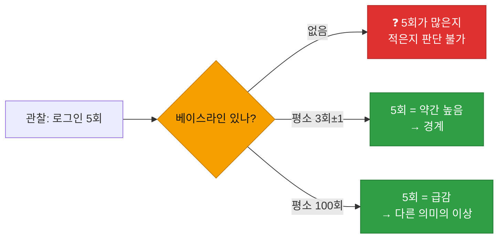
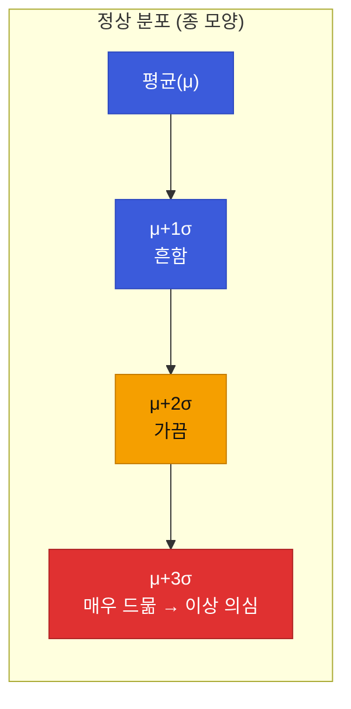
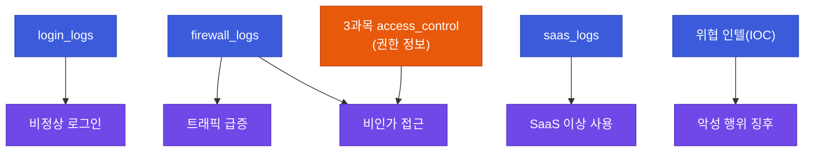
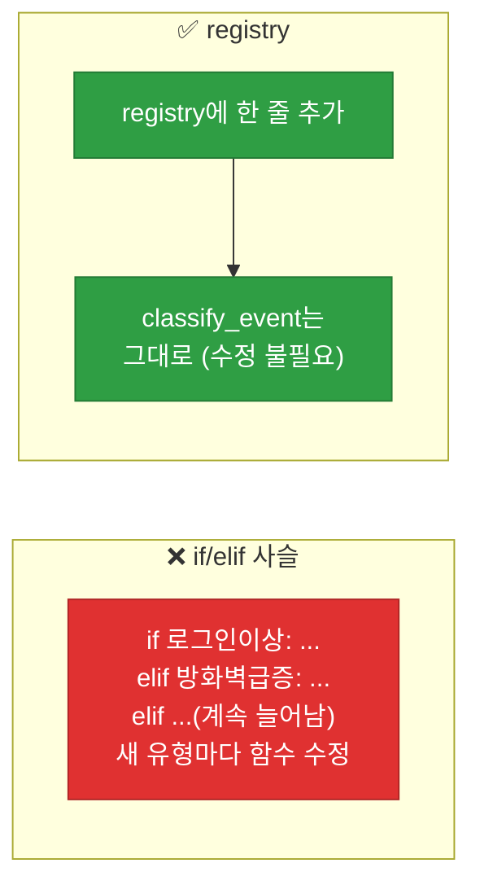

# 강의1 · 베이스라인 설정과 이벤트 유형 분류 (오전, 총 120분)

> **이 교시 한 문장:** "비정상"을 판단하려면 먼저 "정상(베이스라인)"을 통계로 정의해야 하며, 관제 이벤트를 유형별로 나눠 여러 판단 함수를 **딕셔너리에 등록해 순회하는** 분류 구조를 설계합니다.

| 시간 | 소주제 | 핵심 한 줄 |
|------|--------|-----------|
| 00-20분 | 베이스라인이란 | 정상을 알아야 비정상을 안다 |
| 20-45분 | 베이스라인 설정 방법 | 통계 기반 vs 규칙 기반 |
| 45-75분 | 5대 관제 이벤트 유형 | 유형과 로그 소스 짝짓기 |
| 75-100분 | 분류기 등록 구조 | classifier_registry 패턴 |
| 100-120분 | 정리 | 분류 다음은 탐지 룰 |

## 이 교시에 나오는 어려운 용어

| 용어 (한글발음) | 한 줄 뜻 (아주 쉽게) | 비유 |
|----------------|----------------------|------|
| **베이스라인(baseline, 베이스라인)** | 평소 정상 패턴을 정리한 기준 | 평상시 체온 36.5도 |
| **평균(mean)** | 값들의 한가운데 | 반 평균 점수 |
| **표준편차(std, 스탠다드 디비에이션)** | 값들이 평균에서 얼마나 흩어졌나 | 점수 편차 |
| **정규분포(normal distribution)** | 평균 근처가 많은 종 모양 분포 | 종 모양 그래프 |
| **규칙 기반(rule-based)** | 사람이 정한 고정 규칙 | "하루 10회 이상" |
| **통계 기반(statistical)** | 데이터 통계로 기준 산출 | "평균+3σ 초과" |
| **`groupby()`** | 기준별로 묶어 집계 | 반별로 성적 묶기 |
| **`describe()`** | 평균·표준편차 등 요약 통계 | 성적 요약표 |
| **관제(monitoring)** | 보안 상황을 지켜봄 | 관제탑 감시 |
| **레지스트리(registry, 레지스트리)** | 이름↔함수 등록표 | 도구 목록판 |
| **분류(classification)** | 이벤트에 유형 딱지 붙이기 | 우편물 분류 |
| **콜드 스타트(cold start)** | 데이터가 적어 기준 못 세움 | 신규 회원 정보 부족 |

---

## ⏱️ 00-20분 · 베이스라인(Baseline)이란

!!! info "📘 학습자 뷰 · 처음 보는 나"
    "이 사용자가 오늘 로그인 5회 했다"—이게 많은 걸까요, 적은 걸까요? **모릅니다.** 이 사람이 평소 몇 번 하는지를 모르니까요.

    - 평소 하루 3회 하던 사람의 5회 → 조금 많지만 정상 범위
    - 평소 하루 100회 하던 시스템 계정의 5회 → 오히려 **너무 적어서** 이상

    **베이스라인 = "이 대상의 평소 정상 패턴을 정리해 둔 기준"** 입니다. 비정상은 언제나 **이 기준과의 차이**로 정의됩니다.

### 🔬 깊이 보기 — 베이스라인 없이는 숫자가 무의미하다



같은 "5회"라도 베이스라인에 따라 정상일 수도, 이상일 수도 있습니다. 숫자 자체엔 의미가 없고, **평소와의 차이**에만 의미가 있습니다. 그래서 탐지의 첫 단계는 늘 "평소가 어땠나"를 아는 것입니다.

!!! example "🎓 강사 뷰 · 체온 비유로 시작"
    *"정상 체온이 36.5도인 걸 아니까 38도가 '열'이라고 판단하죠. 만약 정상 체온을 모르면 38도가 높은 건지도 모릅니다. 베이스라인은 바로 그 '정상 체온'이에요. 보안에서도 평소를 알아야 이상을 압니다."*

!!! question "확인질문"
    **Q. 베이스라인 없이 '로그인 5회'가 많은지 적은지 어떻게 판단할 수 있을까요?**

    **A.** **판단할 수 없습니다.**

    5회라는 숫자 자체에는 의미가 없습니다. 그 사용자가 평소 하루에 몇 번 로그인하는지(베이스라인)를 알아야, 5회가 평소보다 많은지 적은지 비교할 수 있습니다. 평소 3회 하던 사람이면 다소 높은 것이고, 평소 100회 하던 계정이면 오히려 비정상적으로 적은 것입니다. 이상은 언제나 평소와의 차이로 정의됩니다.

<div class="quiz">
<p class="quiz-q"><span class="tag">퀴즈</span><b>이상탐지에서 베이스라인(평소 정상 패턴)을 먼저 세워야 하는 근본 이유는?</b></p>
<button class="quiz-opt">베이스라인이 있으면 로그 수집이 빨라져서</button>
<button class="quiz-opt" data-correct>관찰된 숫자가 '많은지 적은지'는 평소 기준과 비교해야만 판단할 수 있어서</button>
<button class="quiz-opt">베이스라인이 공격을 자동으로 차단해서</button>
<button class="quiz-opt">베이스라인이 로그를 자동으로 정규화해서</button>
<div class="quiz-explain"><b>정답: 2번.</b> 숫자 자체는 의미가 없고 '평소와의 차이'에만 의미가 있습니다. 베이스라인은 그 비교 기준(정상 체온 같은)입니다.</div>
<button class="quiz-retry">다시 풀기</button>
</div>

---

## ⏱️ 20-45분 · 베이스라인 설정 방법 — 통계 vs 규칙

!!! info "📘 학습자 뷰 · 처음 보는 나"
    베이스라인을 정하는 두 가지 길이 있습니다.

    | 방법 | 어떻게 | 장점 | 단점 |
    |------|--------|------|------|
    | **규칙 기반** | 사람이 고정값 정함 ("하루 10회 이상") | 단순·이해 쉬움 | 사람마다 다른데 일괄 적용 |
    | **통계 기반** | 데이터로 평균·표준편차 산출 | 대상별 맞춤 | 데이터 적으면 부정확 |

    예: 통계 기반은 `평균 + 3×표준편차`를 넘으면 이상으로 봅니다. "평소 흩어짐(표준편차)의 3배를 벗어날 만큼 특이하다"는 뜻입니다.

### 💻 코드 — 통계 베이스라인 계산

```python
user_baseline = df.groupby('user')['event_type'].count().describe()
# 사용자별 이벤트 수를 세고(groupby+count),
# 그 분포의 평균·표준편차 등을 요약(describe)
```

`groupby('user')`로 **사용자별로 묶어** 이벤트 수를 세고, `describe()`로 평균·표준편차를 뽑습니다. 이 평균·표준편차가 "평소보다 훨씬 많음"을 판단하는 기준이 됩니다.

### 🔬 깊이 보기 — 평균 + 3σ(시그마): '흔치 않음'의 통계적 선



정상 데이터가 종 모양(정규분포)이라면, **평균에서 3σ 밖은 전체의 0.3%도 안 되는 매우 드문 영역**입니다. 그래서 "μ+3σ 초과"를 이상 후보로 봅니다. 규칙 기반("10회 이상")보다 정교한 이유는, **대상마다 다른 평소 수준을 자동 반영**하기 때문입니다.

!!! example "🎓 강사 뷰 · 콜드 스타트 문제 짚기"
    *"통계 기반의 약점을 꼭 물어보세요 — 신규 입사자는 데이터가 없어 평균·표준편차를 못 냅니다(콜드 스타트). 이럴 땐 '부서 평균' 같은 대체 베이스라인을 쓰거나, 데이터가 쌓일 때까지 규칙 기반을 임시로 씁니다. 두 방법은 배타적이 아니라 상황에 맞게 섞습니다."*

!!! question "확인질문"
    **Q. 신규 입사자처럼 데이터가 적은 사용자는 베이스라인을 어떻게 설정해야 할까요?**

    **A.** **개인 데이터가 쌓일 때까지 대체 기준을 씁니다.**

    신규 입사자는 과거 활동이 적어 개인 평균·표준편차를 신뢰할 수 없습니다(콜드 스타트). 이럴 때는 같은 부서·직군의 평균을 임시 베이스라인으로 쓰거나, 단순 규칙 기반("하루 N회 이상") 기준을 적용하다가, 개인 데이터가 충분히 쌓이면 통계 기반 개인 베이스라인으로 전환합니다. 상황에 따라 두 방법을 섞는 것이 실무적입니다.

<div class="quiz">
<p class="quiz-q"><span class="tag">퀴즈</span><b>통계 기반 베이스라인(평균+표준편차)이 단순 규칙 기반("하루 10회 이상")보다 정교할 수 있는 이유는?</b></p>
<button class="quiz-opt">통계는 항상 100% 정확하기 때문</button>
<button class="quiz-opt" data-correct>대상(사용자·시스템)마다 다른 평소 수준을 자동 반영해, 개인별 맞춤 기준을 만들기 때문</button>
<button class="quiz-opt">통계 기반은 데이터가 없어도 잘 작동하기 때문</button>
<button class="quiz-opt">규칙 기반은 코드로 구현할 수 없기 때문</button>
<div class="quiz-explain"><b>정답: 2번.</b> "10회 일괄"은 평소 3회인 사람과 100회인 계정에 똑같이 적용돼 부적절합니다. 통계 기반은 각자의 평균·편차로 맞춤 기준을 만듭니다. 단, 데이터가 적으면(콜드 스타트) 약해집니다(3번 오답).</div>
<button class="quiz-retry">다시 풀기</button>
</div>

---

## ⏱️ 45-75분 · 5대 관제 이벤트 유형

!!! info "📘 학습자 뷰 · 처음 보는 나"
    보안관제에서 흔히 보는 이벤트를 5가지로 나누고, **각각 어느 로그에서 주로 관찰되는지** 짝짓습니다.

    | 이벤트 유형 | 주요 로그 소스 | 다른 과목 연계 |
    |-------------|----------------|----------------|
    | 비정상 로그인 | `login_logs` | — |
    | 트래픽 급증 | `firewall_logs` | 2과목(네트워크) |
    | 비인가 접근 | `firewall_logs` + **3과목 access_control** | 3과목 권한 |
    | SaaS 이상 사용 | `saas_logs` | — |
    | 악성 행위 징후 | 여러 로그 + IOC | 2과목 DNS(DGA) |

    포인트: 유형마다 **봐야 할 로그가 다르고**, 어떤 건 **다른 과목의 데이터와 연계**해야 합니다. 특히 비인가 접근은 3과목의 권한 정보 없이는 판단할 수 없습니다.

### 🔬 깊이 보기 — 유형별로 다른 로그를 봐야 하는 이유



"비인가 접근 = 권한 없는데 접근 시도"인데, **'권한이 있는지'는 방화벽 로그만으론 모릅니다.** 3과목에서 만든 권한 매트릭스(`user_roles`, `roles`)를 가져와야 판단할 수 있죠. 이래서 이상탐지는 **다른 과목 모듈과 연계**됩니다 — 혼자 못 하는 판단이 있습니다.

!!! question "확인질문"
    **Q. '비인가 접근'을 탐지하려면 이상탐지 모듈이 3과목(접근통제)의 어떤 데이터와 연계되어야 할까요?**

    **A.** **3과목의 권한 정보(RBAC 데이터: `user_roles`, `roles`, 정책 매트릭스)** 와 연계돼야 합니다.

    "비인가 접근"은 "권한이 없는데 접근을 시도한 것"인데, 어떤 사용자가 어떤 자원에 권한이 있는지는 방화벽 로그만으로는 알 수 없습니다. 3과목에서 만든 역할·권한 데이터를 가져와야 "이 접근이 권한 범위 밖인지"를 판단할 수 있습니다. Day3에서 실제로 `evaluate_full_access()` 결과와 연계합니다.

<div class="quiz">
<p class="quiz-q"><span class="tag">퀴즈</span><b>5대 관제 이벤트 유형을 로그 소스와 짝짓는 작업이 탐지 설계에 중요한 이유는?</b></p>
<button class="quiz-opt">로그 소스가 많을수록 탐지가 자동으로 정확해져서</button>
<button class="quiz-opt" data-correct>유형마다 봐야 할 데이터가 달라, 어떤 로그(또는 다른 과목 데이터)를 봐야 그 이상을 잡을 수 있는지 정해지기 때문</button>
<button class="quiz-opt">모든 이벤트는 login_logs 하나로 탐지되기 때문</button>
<button class="quiz-opt">짝짓기를 하면 로그 용량이 줄어서</button>
<div class="quiz-explain"><b>정답: 2번.</b> 트래픽 급증은 방화벽 로그, SaaS 이상은 saas 로그, 비인가 접근은 방화벽+3과목 권한. 유형별로 필요한 데이터가 달라, 짝짓기가 탐지 설계의 지도가 됩니다.</div>
<button class="quiz-retry">다시 풀기</button>
</div>

---

## ⏱️ 75-100분 · 분류기 등록 구조 — `classifier_registry` 패턴

!!! abstract "이 블록을 마치면"
    ✔ 여러 판단 함수를 ==딕셔너리에 등록해 순회 적용하는== 구조를 안다

!!! info "📘 학습자 뷰 · 처음 보는 나"
    이벤트 하나에 여러 탐지 기준을 적용하려면, `if`를 잔뜩 늘어놓는 대신 **"이름→판단 함수" 딕셔너리**를 만들어 순회합니다.

### 💻 코드 완전 해부 — `classifier_registry`

```python
classifier_registry = {                              # ①
    '비정상 로그인': is_suspicious_login,
    '방화벽 차단 급증': is_firewall_spike,
}

def classify_event(event):
    tags = [name for name, func in classifier_registry.items()  # ②
            if func(event)]                                     # ③
    return tags if tags else ['미분류']                          # ④
```

| 줄 | 하는 일 | 왜 |
|:--:|---------|-----|
| **①** | "유형 이름 → 판단 함수" 등록표 | 새 탐지는 여기 한 줄만 추가 |
| **②③** | 각 판단 함수를 이벤트에 적용, **참인 것의 이름**만 수집 | 한 이벤트에 여러 태그 가능 |
| **④** | 아무 데도 안 걸리면 `'미분류'` | 누락 없이 전부 태그 |

!!! example "🎓 강사 뷰 · 3번째 만나는 registry 패턴"
    - *"이 구조, 어디서 봤죠? 1과목 `tool_registry`, 3과목에서도 도구 등록에 썼습니다. **'이름→함수 딕셔너리로 여러 동작을 갈아끼운다'**는 같은 패턴이 반복됩니다. 한 번 익히면 계속 씁니다."*
    - **확장성 강조:** 새 탐지 유형이 생기면 `if/elif`를 고치는 게 아니라 **딕셔너리에 한 줄** 추가하면 됩니다. `classify_event()`는 손댈 필요 없죠. 이게 registry의 힘입니다.

### 🔬 깊이 보기 — registry가 `if/elif` 사슬을 이기는 이유



`if/elif`로 짜면 새 유형마다 `classify_event()` 본문을 뜯어고쳐야 합니다(수정할 때마다 버그 위험). registry는 **데이터(딕셔너리)에 추가**만 하면 되고 로직은 불변입니다. "코드는 그대로, 데이터만 바꾼다"—3·4과목 내내 반복된 원칙입니다.

!!! question "확인질문"
    **Q. 1과목에서 만든 `tool_registry` 패턴과 오늘의 `classifier_registry`, 구조가 비슷한 이유는 무엇일까요?**

    **A.** **둘 다 "이름 → 함수" 딕셔너리로 여러 동작을 유연하게 관리하는 같은 패턴이기 때문**입니다.

    `tool_registry`는 도구 이름으로 함수를, `classifier_registry`는 이벤트 유형 이름으로 판단 함수를 연결합니다. 목적은 달라도 "새 항목은 딕셔너리에 한 줄 추가하면 되고, 이를 순회·적용하는 코드는 고칠 필요 없다"는 구조가 동일합니다. 확장에 강하고 수정 위험이 적어, 여러 과목에서 반복해 쓰는 설계입니다.

<div class="quiz">
<p class="quiz-q"><span class="tag">퀴즈</span><b>탐지 유형을 <code>if/elif</code> 사슬 대신 <code>classifier_registry</code> 딕셔너리로 관리할 때의 핵심 이점은?</b></p>
<button class="quiz-opt">딕셔너리가 if보다 실행이 항상 빠르기 때문</button>
<button class="quiz-opt" data-correct>새 탐지 유형을 추가할 때 딕셔너리에 한 줄만 넣으면 되고, 순회 로직(classify_event)은 고치지 않아도 되기 때문</button>
<button class="quiz-opt">registry를 쓰면 탐지 함수가 필요 없어지기 때문</button>
<button class="quiz-opt">if/elif는 파이썬에서 지원되지 않기 때문</button>
<div class="quiz-explain"><b>정답: 2번.</b> registry는 '데이터에 추가, 로직은 불변'입니다. 확장 시 본문을 안 건드려 버그 위험이 적습니다. 이 패턴은 tool_registry(1·3과목)와 동일합니다.</div>
<button class="quiz-retry">다시 풀기</button>
</div>

!!! tip "🧠 파인만 자가진단"
    안 보고 말할 수 있으면 통과입니다.

    1. 베이스라인이 필요한 이유를 체온에 비유해 설명
    2. 통계 기반 vs 규칙 기반의 장단점, 콜드 스타트 대처
    3. 비인가 접근이 왜 3과목 데이터와 연계돼야 하는지
    4. registry 패턴이 `if/elif`보다 나은 이유

---

## ⏱️ 100-120분 · 정리

**오전 정리:**

1. **베이스라인** — 평소를 알아야 이상을 안다(정상 체온)
2. **통계 기반(평균+3σ) vs 규칙 기반** — 상황 따라 섞고, 콜드 스타트 주의
3. **5대 이벤트 유형** — 유형마다 볼 로그가 다르고, 비인가 접근은 3과목 연계
4. **classifier_registry** — 이름→함수 딕셔너리, 확장에 강함(tool_registry와 동형)

오후에는 이 분류 위에 실제 탐지 룰(로그인 brute-force, 트래픽 급증)을 코드로 만듭니다.

---

## ✅ 가르칠 준비 체크리스트 (강의1)

- [ ] 베이스라인을 체온 비유로 설명한다
- [ ] 통계 기반의 평균+3σ 의미를 설명한다
- [ ] 콜드 스타트 문제와 대처를 설명한다
- [ ] 5대 이벤트 유형과 로그 소스를 짝짓는다
- [ ] 비인가 접근의 3과목 연계 필요성을 설명한다
- [ ] classifier_registry가 tool_registry와 같은 패턴임을 짚는다
- [ ] 확인질문 4개 + 퀴즈에 답한다

*[baseline]: 베이스라인 — 평소 정상 패턴 기준
*[registry]: 레지스트리 — 이름↔함수 등록 딕셔너리 패턴
*[cold start]: 콜드 스타트 — 데이터가 적어 기준을 못 세우는 문제
