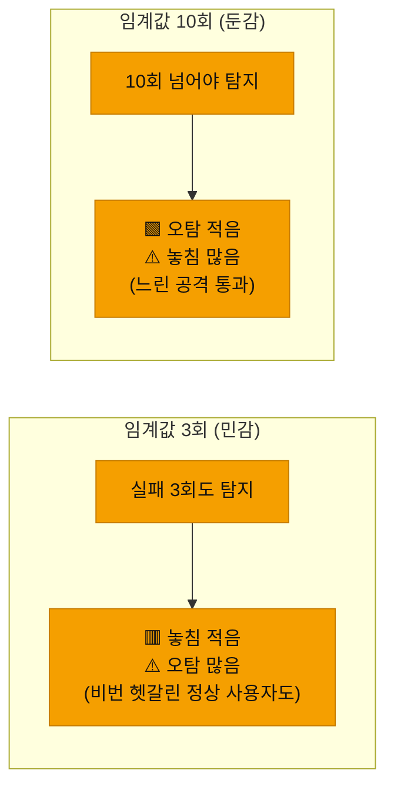
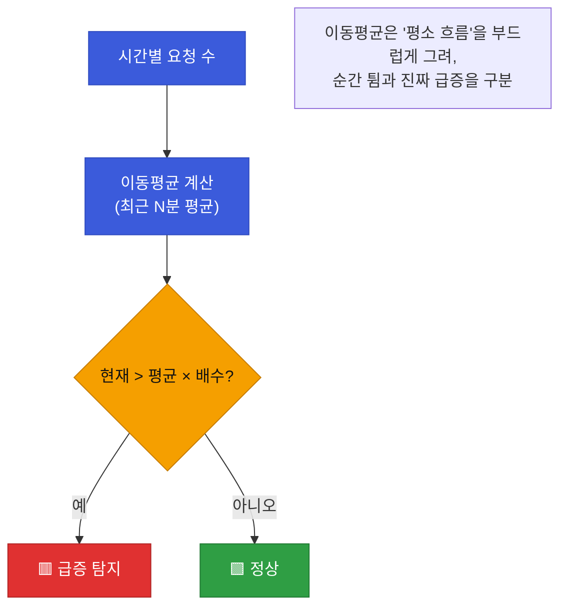
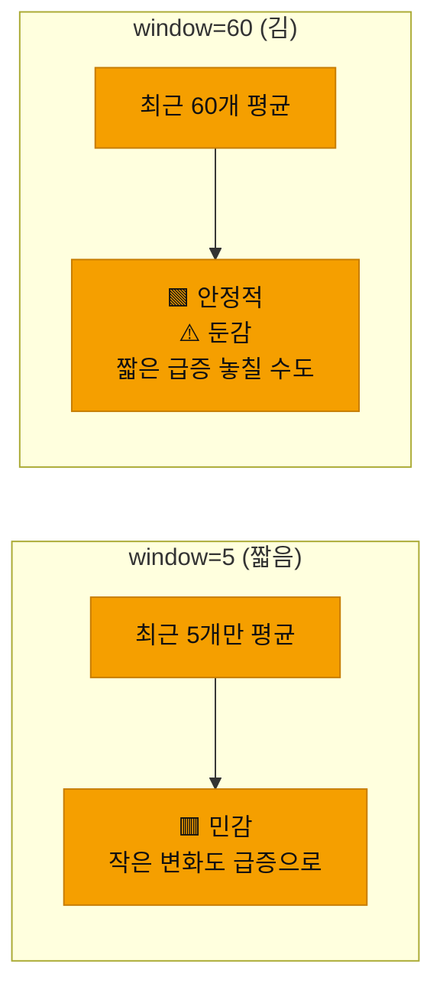

# 강의2 · 로그인·트래픽 탐지 룰 구현 (오후, 총 120분)

> **이 교시 한 문장:** 짧은 시간 안의 반복 로그인 실패(**brute-force**)와, 평소 대비 급증하는 트래픽(**이동평균 초과**)을 탐지하는 룰을 구현하고, 임계값을 바꾸면 탐지가 어떻게 민감해지는지 체감합니다.

| 시간 | 소주제 | 핵심 한 줄 |
|------|--------|-----------|
| 00-25분 | 비정상 로그인 탐지 룰 설계 | 시간창 + 임계값 |
| 25-50분 | 로그인 탐지 코드 구현 | detect_bruteforce + 시간창 보완 |
| 50-75분 | 트래픽 급증과 이동평균 | 튐 vs 추세 구분 |
| 75-100분 | 트래픽 탐지 코드(rolling) | window·multiplier 튜닝 |
| 100-120분 | 실습 안내 | 임계값을 config로 |

## 이 교시에 나오는 어려운 용어

| 용어 (한글발음) | 한 줄 뜻 (아주 쉽게) | 비유 |
|----------------|----------------------|------|
| **brute-force(브루트포스)** | 비밀번호를 마구 대입하는 공격 | 자물쇠 번호 다 눌러보기 |
| **시간창(time window, 타임 윈도우)** | "최근 N분" 같은 검사 구간 | 최근 10분만 보기 |
| **임계값(threshold, 스레숄드)** | 넘으면 탐지하는 기준 숫자 | 경보 온도 |
| **민감도(sensitivity)** | 얼마나 예민하게 잡나 | 경보 감도 |
| **오탐(false positive)** | 정상을 이상으로 잘못 잡음 | 헛경보 |
| **이동평균(moving average)** | 최근 N개의 평균을 계속 갱신 | 최근 5분 평균 |
| **`rolling()`(롤링)** | pandas의 이동창 계산 | 창을 밀며 평균 |
| **급증(spike, 스파이크)** | 값이 갑자기 확 뜀 | 그래프가 솟구침 |
| **추세(trend)** | 지속적인 증가/감소 흐름 | 꾸준히 오름 |
| **일시적 튐(transient)** | 잠깐 튀고 마는 것 | 순간 튐 |
| **multiplier(멀티플라이어)** | 평균의 몇 배를 이상으로 볼지 | 3배 초과 |
| **config 분리** | 설정값을 코드 밖 파일로 | 규칙표 따로 |

---

## ⏱️ 00-25분 · 비정상 로그인 탐지 룰 설계

!!! info "📘 학습자 뷰 · 처음 보는 나"
    **brute-force(무차별 대입)** 공격은 비밀번호를 계속 바꿔가며 로그인을 시도합니다. 그래서 **짧은 시간에 로그인 실패가 몰립니다.** 이걸 룰로 만들면:

    > 규칙: **최근 10분 내** 동일 사용자의 `login_failed`가 **5건 이상** → 탐지

    두 요소가 핵심입니다: **시간창(최근 10분)** 과 **임계값(5건)**. 이 둘을 어떻게 잡느냐가 탐지의 성격을 결정합니다.

### 🔬 깊이 보기 — 임계값을 낮추면? 민감도와 오탐의 시소



임계값은 **시소**입니다. 낮추면 민감해져 **놓침(미탐)은 줄지만 오탐이 늘고**, 높이면 반대입니다. "비밀번호를 세 번 헷갈린 정상 사용자"까지 잡으면 오탐이죠. **완벽한 값은 없고, 상황에 맞는 균형**을 찾는 것 — 이게 Day4 튜닝의 씨앗입니다.

!!! example "🎓 강사 뷰 · '정답 임계값은 없다'"
    *"학생들이 '5회가 맞나요, 3회가 맞나요' 물으면, '정답은 데이터가 정한다'고 답하세요. 우리 회사 정상 사용자가 평소 몇 번까지 실패하는지 보고 정합니다. 임계값은 신념이 아니라 실험의 결과예요."*

!!! question "확인질문"
    **Q. 임계값을 3회로 낮추면 탐지는 더 민감해지지만 어떤 부작용이 생길 수 있을까요?**

    **A.** **오탐(false positive)이 늘어납니다.**

    임계값을 낮추면 더 적은 실패도 탐지하므로 진짜 공격을 놓칠 확률(미탐)은 줄지만, 비밀번호를 몇 번 헷갈린 정상 사용자까지 "공격"으로 잡게 됩니다. 이런 헛경보가 많아지면 담당자가 알림에 무뎌지는 경보 피로로 이어집니다. 그래서 임계값은 민감도와 오탐 사이의 균형점을 데이터로 찾아야 합니다.

<div class="quiz">
<p class="quiz-q"><span class="tag">퀴즈</span><b>brute-force 탐지 임계값(실패 N회)을 낮출 때 나타나는 변화로 옳은 것은?</b></p>
<button class="quiz-opt">미탐도 줄고 오탐도 줄어 항상 좋아진다</button>
<button class="quiz-opt" data-correct>미탐(놓침)은 줄지만 오탐(헛경보)이 늘어난다 — 둘은 시소 관계다</button>
<button class="quiz-opt">탐지 자체가 작동하지 않게 된다</button>
<button class="quiz-opt">임계값은 탐지 결과에 영향을 주지 않는다</button>
<div class="quiz-explain"><b>정답: 2번.</b> 임계값은 민감도와 오탐의 시소입니다. 낮추면 민감(미탐↓ 오탐↑), 높이면 둔감(오탐↓ 미탐↑). 완벽한 값은 없고 균형을 찾는 것이 Day4 튜닝입니다.</div>
<button class="quiz-retry">다시 풀기</button>
</div>

---

## ⏱️ 25-50분 · 로그인 탐지 코드 구현

!!! abstract "이 블록을 마치면"
    ✔ ==실패 횟수 탐지 함수와, 빠진 '시간창' 조건을 보완하는== 법을 안다

### 💻 코드 완전 해부 — `detect_bruteforce()` (1차 버전)

```python
def detect_bruteforce(logs, user, window_min=10, threshold=5):
    recent = [l for l in logs                                   # ①
              if l['user'] == user and l['event_type'] == 'login_failed']
    return len(recent) >= threshold                             # ②
```

| 줄 | 하는 일 | 왜 |
|:--:|---------|-----|
| **①** | 이 사용자의 `login_failed`만 골라 모음 | 대상·유형 필터 |
| **②** | 그 개수가 임계값 이상이면 탐지 | 실패가 몰렸나 |

!!! warning "🎓 강사 뷰 · 이 코드의 '빠진 조건'을 학생이 찾게 하기"
    이 1차 버전엔 **버그가 있습니다.** 함수 이름·인자엔 `window_min=10`(10분)이 있는데, **①에서 시간 조건을 안 씁니다!** 그래서 지금은 "최근 10분"이 아니라 **전체 기간의 실패**를 셉니다. 어제 3번, 오늘 3번 실패한 정상 사용자도 총 6번이라 탐지되죠(오탐).

### ✍️ 지금 직접 쳐보기 (7분) — 시간창을 채워라

!!! success "✍️ 직접 쳐보기 — 빠진 시간 조건 보완"
    ①에 시간창 조건을 더해 봅니다. 아이디어: "가장 최근 실패 시각에서 `window_min`분 이내의 실패만" 세기.

    ```python
    from datetime import timedelta
    def detect_bruteforce(logs, user, window_min=10, threshold=5):
        fails = sorted([l for l in logs
                        if l['user']==user and l['event_type']=='login_failed'],
                       key=lambda x: x['timestamp'])
        if not fails:
            return False
        cutoff = fails[-1]['timestamp'] - timedelta(minutes=window_min)  # 최근 실패 기준
        recent = [f for f in fails if f['timestamp'] >= cutoff]          # 10분 이내만
        return len(recent) >= threshold
    ```

    1. 어제 3회 + 오늘 3회 실패 데이터로 1차 버전(시간창 없음)을 돌려 → **탐지됨**(오탐) 확인.
    2. 위 보완 버전으로 다시 → 10분 이내가 아니니 **탐지 안 됨** 확인.
    3. 오늘 10분 안에 6회 실패를 넣어 → **탐지됨** 확인.

    > 🎓 강사 팁: "이름엔 있는데 코드엔 없는 조건"을 찾는 훈련입니다. 실무 버그의 상당수가 이런 '반영 안 된 파라미터'예요.

!!! question "확인질문"
    **Q. `detect_bruteforce()`가 '최근 10분'이라는 시간 조건을 아직 반영하지 않았는데, 어떻게 보완해야 할까요?**

    **A.** **실패 이벤트를 시간으로 걸러, 시간창 안의 것만 세도록 고칩니다.**

    현재는 사용자·유형만 필터해서 전체 기간의 실패를 세므로, 오래 전 실패까지 합산되어 오탐이 납니다. 기준 시각(예: 가장 최근 실패 또는 현재)에서 `window_min`분 이전(cutoff)을 계산하고, `timestamp >= cutoff`인 실패만 남겨 그 개수를 임계값과 비교하면 "최근 10분 내"를 정확히 반영할 수 있습니다.

<div class="quiz">
<p class="quiz-q"><span class="tag">퀴즈</span><b>함수 인자에 <code>window_min=10</code>이 있는데 본문에서 시간 필터를 쓰지 않은 <code>detect_bruteforce()</code> 1차 버전의 문제는?</b></p>
<button class="quiz-opt">함수가 아예 실행되지 않는다</button>
<button class="quiz-opt" data-correct>시간창과 무관하게 전체 기간의 실패를 세어, 오래 전 실패까지 합산돼 오탐이 발생한다</button>
<button class="quiz-opt">모든 사용자를 무조건 탐지한다</button>
<button class="quiz-opt">window_min 값이 자동으로 0이 된다</button>
<div class="quiz-explain"><b>정답: 2번.</b> 파라미터는 선언됐지만 로직에 반영되지 않아, "최근 10분"이 아니라 "전체 실패 수"를 셉니다. 어제·오늘 나눠 실패한 정상 사용자도 잡히는 오탐이 생깁니다.</div>
<button class="quiz-retry">다시 풀기</button>
</div>

---

## ⏱️ 50-75분 · 트래픽 급증과 이동평균

!!! info "📘 학습자 뷰 · 처음 보는 나"
    **트래픽 급증** = 평소보다 요청·트래픽이 확 뛰는 것. 예: 평소 분당 100건인데 갑자기 800건. 문제는 **"급증"의 기준**입니다. 고정값("500건 이상")은 시간대마다 정상 수준이 달라 부적절하죠.

    그래서 **이동평균(moving average)** 을 씁니다. "최근 5분 평균"을 계속 갱신하며, **현재 값이 그 평균의 몇 배를 넘으면** 급증으로 봅니다.

    > 최근 5분 평균: 100건 / 이번 1분: 800건 → 평균의 8배 → 탐지

### 🔬 깊이 보기 — 일시적 튐 vs 지속적 추세, 이동평균이 구분한다



이동평균의 장점: **평소 흐름을 부드럽게** 만들어 줍니다. 고정 기준은 "점심시간엔 원래 많다" 같은 자연스러운 변동에 오탐하지만, 이동평균은 **최근 흐름 대비**로 보므로 그 변동을 흡수합니다. "지금이 최근 평소보다 유별난가?"를 묻는 거죠.

!!! example "🎓 강사 뷰 · '급증=공격' 아님을 짚기"
    *"트래픽 급증이 곧 공격은 아닙니다. 이벤트 티켓 오픈, 신제품 출시로도 정상 급증합니다. 그래서 탐지는 '의심 신호'일 뿐, 확정이 아니에요. 급증 + 다른 신호(비정상 IP 등)가 겹칠 때 위험이 커집니다 — Day3 상관분석의 예고입니다."*

!!! question "확인질문"
    **Q. 트래픽 급증이 반드시 공격이라고 단정할 수 있을까요? 정상적인 트래픽 증가와 어떻게 구분해야 할까요?**

    **A.** **단정할 수 없습니다.**

    이벤트 티켓 오픈, 신제품 출시, 마케팅 캠페인처럼 정상적인 이유로도 트래픽이 급증합니다. 그래서 급증은 '확정 위협'이 아니라 '의심 신호'로 다뤄야 합니다. 구분하려면 급증 하나만 보지 말고, 비정상 IP·비인가 접근·로그인 실패 같은 다른 신호와 함께 겹쳐 보는 상관분석(Day3)이 필요합니다. 여러 신호가 동시에 나타날 때 진짜 위협일 가능성이 높아집니다.

<div class="quiz">
<p class="quiz-q"><span class="tag">퀴즈</span><b>트래픽 급증 탐지에 고정 임계값("500건 이상") 대신 이동평균을 쓰는 이유로 가장 적절한 것은?</b></p>
<button class="quiz-opt">이동평균이 항상 더 작은 값을 주기 때문</button>
<button class="quiz-opt" data-correct>시간대별로 다른 평소 수준을 반영해, 자연스러운 변동은 흡수하고 '최근 흐름 대비 유별난' 급증만 잡기 때문</button>
<button class="quiz-opt">이동평균은 공격을 자동으로 차단하기 때문</button>
<button class="quiz-opt">고정 임계값은 pandas로 계산할 수 없기 때문</button>
<div class="quiz-explain"><b>정답: 2번.</b> 고정값은 "점심엔 원래 많다" 같은 정상 변동에 오탐합니다. 이동평균은 최근 흐름을 기준 삼아 그 변동을 흡수하고, 평소 대비 튀는 것만 잡습니다.</div>
<button class="quiz-retry">다시 풀기</button>
</div>

---

## ⏱️ 75-100분 · 트래픽 급증 탐지 코드 (`rolling`)

!!! abstract "이 블록을 마치면"
    ✔ pandas ==`rolling()`으로 이동평균을 구해 급증을 잡는== 코드를 안다

### 💻 코드 완전 해부 — `detect_traffic_spike()`

```python
def detect_traffic_spike(counts_series, window=5, multiplier=3):
    moving_avg = counts_series.rolling(window).mean()               # ①
    spikes = counts_series[counts_series > moving_avg * multiplier] # ②
    return spikes                                                   # ③
```

| 줄 | 하는 일 | 왜 |
|:--:|---------|-----|
| **①** | 최근 `window`개의 **이동평균** 계산 | 평소 흐름 만들기 |
| **②** | 현재 값이 **이동평균 × 배수** 를 넘는 지점만 | 급증 판정 |
| **③** | 급증한 지점들 반환 | 어디서 튀었나 |

`counts_series`는 시간별 요청 수(pandas Series)입니다. `rolling(5).mean()`은 "매 시점마다 직전 5개의 평균"을 만들어, `> 평균×3`인 곳을 급증으로 골라냅니다.

### 🔬 깊이 보기 — window 크기의 트레이드오프



window를 **크게** 하면 평균이 **더 많은 값으로 부드러워져 안정적**이지만, 그만큼 **둔감**해져 짧고 굵은 급증을 흐려버릴 수 있습니다. 작게 하면 민감하지만 잔변동에 흔들립니다. 로그인 임계값과 똑같은 **시소**죠. 적절한 window는 데이터로 실험해 정합니다.

!!! example "🎓 강사 뷰 · 임계값을 config로"
    *"`window`, `multiplier`, 로그인 `threshold` — 이 숫자들을 코드에 박지 말고 `config/detection_thresholds.json`으로 빼세요. 튜닝(Day4)할 때 코드를 안 건드리고 값만 바꿉니다. 3과목부터 계속 나온 'config 분리'가 여기서도 그대로 적용됩니다."*

!!! question "확인질문"
    **Q. `rolling(window=5)`에서 window 값을 크게 하면(예: 60) 이동평균은 더 안정적이 될까요, 더 민감해질까요?**

    **A.** **더 안정적(둔감)이 됩니다.**

    window를 키우면 더 많은 값의 평균을 내므로 이동평균선이 부드러워지고, 순간적인 잔변동에 잘 흔들리지 않습니다. 대신 짧고 굵은 급증도 평균에 희석되어 놓칠 수 있습니다(둔감). 반대로 window가 작으면 최근 소수 값만 반영해 민감하지만 잔변동에 자주 반응합니다. 안정성과 민감도는 트레이드오프라 데이터로 적절한 값을 찾아야 합니다.

<div class="quiz">
<p class="quiz-q"><span class="tag">퀴즈</span><b><code>detect_traffic_spike()</code>의 <code>window</code>를 5에서 60으로 늘렸을 때의 효과는?</b></p>
<button class="quiz-opt">이동평균이 더 민감해져 작은 변화도 다 잡는다</button>
<button class="quiz-opt" data-correct>이동평균이 더 부드럽고 안정적이 되지만, 짧고 굵은 급증은 희석되어 놓칠 수 있다</button>
<button class="quiz-opt">window는 결과에 영향을 주지 않는다</button>
<button class="quiz-opt">급증이 자동으로 사라진다</button>
<div class="quiz-explain"><b>정답: 2번.</b> 큰 window = 많은 값 평균 = 안정적이지만 둔감. 작은 window = 민감하지만 잔변동에 흔들림. window·multiplier는 config로 빼서 튜닝(Day4)합니다.</div>
<button class="quiz-retry">다시 풀기</button>
</div>

!!! tip "🧠 파인만 자가진단"
    안 보고 말할 수 있으면 통과입니다.

    1. brute-force가 왜 '짧은 시간 실패 급증'으로 나타나는지
    2. 임계값의 민감도-오탐 시소를 한 문장으로
    3. 이동평균이 고정 임계값보다 나은 이유
    4. window 크기의 안정성-민감도 트레이드오프

---

## ⏱️ 100-120분 · 실습 안내

**오후 정리:**

1. **로그인 brute-force** — 시간창 + 임계값, 임계값은 민감도-오탐 시소
2. `detect_bruteforce()`의 **빠진 시간창 조건**을 직접 보완
3. **트래픽 급증** — 고정값 대신 **이동평균 대비 배수**
4. `rolling(window).mean()` — window 크기는 안정성-민감도 트레이드오프
5. 임계값(threshold·window·multiplier)은 **config로 분리**

!!! note "실습 예고 (오후 실습 120분)"
    `classify.py`(registry), `login_detection.py`(brute-force, off-hour), `traffic_detection.py`(rolling spike)를 구현하고, 의도적 이상 케이스를 심어 탐지되는지 검증합니다. 임계값은 `config/detection_thresholds.json`으로. 상세는 [실습 페이지](practice.md).

---

## ✅ 가르칠 준비 체크리스트 (강의2)

- [ ] brute-force가 시간창+임계값으로 표현됨을 설명한다
- [ ] 임계값의 민감도-오탐 시소를 설명한다
- [ ] `detect_bruteforce()`의 빠진 시간 조건을 학생이 찾게 한다
- [ ] 이동평균이 고정 임계값보다 나은 이유를 설명한다
- [ ] `rolling()`의 window 트레이드오프를 설명한다
- [ ] 임계값 config 분리를 강조한다
- [ ] 확인질문 4개 + 퀴즈에 답한다

*[brute-force]: 무차별 대입 — 비밀번호 등을 반복 시도하는 공격
*[moving average]: 이동평균 — 최근 N개 값의 평균을 갱신하며 흐름을 파악
*[threshold]: 임계값 — 넘으면 탐지하는 기준
