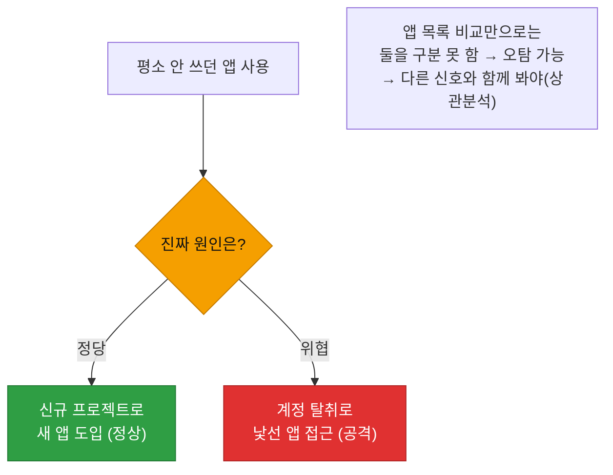
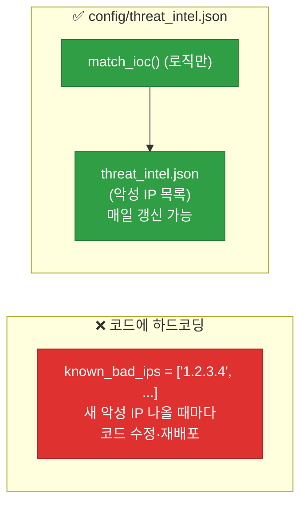
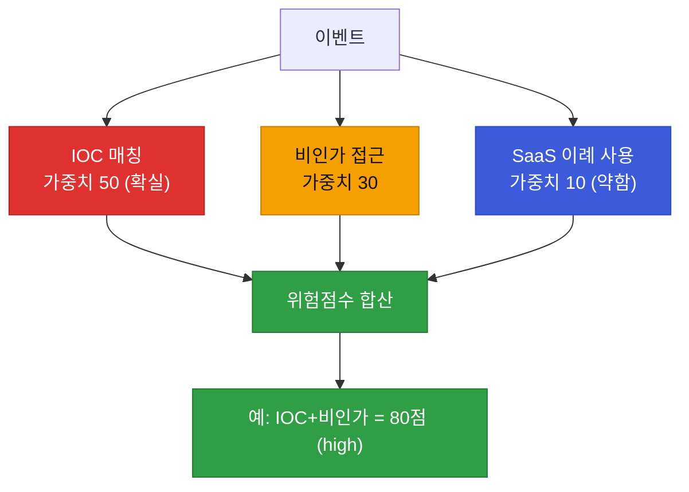

# 강의1 · 비인가접근·SaaS이상·악성행위 탐지와 위험점수 (오전, 총 120분)

> **이 교시 한 문장:** 권한 밖 접근(비인가), 안 쓰던 앱 사용(SaaS 이상), 알려진 악성 지표(IOC)를 각각 탐지하고, 그 결과를 **가중치로 합산한 하나의 위험점수**로 만들어 "얼마나 위험한가"를 수치화합니다.

| 시간 | 소주제 | 핵심 한 줄 |
|------|--------|-----------|
| 00-20분 | 비인가 접근 — 3과목 연결 | 권한 없는데 접근 시도 |
| 20-45분 | SaaS 이상 사용 탐지 | 평소 안 쓰던 앱 |
| 45-75분 | IOC 매칭 | 알려진 악성 지표 대조 |
| 75-100분 | 복합 위험점수 스코어링 | 신호를 가중치로 합산 |
| 100-120분 | 정리 | 개별 → 종합 |

## 이 교시에 나오는 어려운 용어

| 용어 (한글발음) | 한 줄 뜻 (아주 쉽게) | 비유 |
|----------------|----------------------|------|
| **비인가 접근(unauthorized access)** | 권한 없는데 접근 시도 | 출입증 없이 문 열려 함 |
| **SaaS(사스)** | 웹으로 쓰는 소프트웨어 | 구글 드라이브·슬랙 |
| **베이스라인 앱(baseline apps)** | 평소 쓰던 앱 목록 | 늘 다니던 가게 |
| **IOC(아이오씨)** | 침해의 증거가 되는 지표 | 범인 지문·인상착의 |
| **위협 인텔(threat intel)** | 알려진 악성 IP·도메인 정보 | 수배 명단 |
| **DGA(디지에이)** | 악성코드가 만드는 무작위 도메인 | 매일 바뀌는 가짜 주소 |
| **위험점수(risk score)** | 이벤트가 얼마나 위험한가 수치 | 위험도 점수판 |
| **가중치(weight)** | 신호마다 다른 중요도 | 항목별 배점 |
| **스코어링(scoring)** | 점수를 매기는 일 | 채점 |
| **`.get(키, 기본값)`** | 없으면 에러 대신 기본값 | 없으면 빈손 |
| **하드코딩(hard-coding)** | 값을 코드에 직접 박음 | 벽에 못 박기 |
| **탈취(account takeover)** | 계정을 빼앗아 악용 | 신분 도용 |

---

## ⏱️ 00-20분 · 비인가 접근이란 — 3과목과의 연결

!!! info "📘 학습자 뷰 · 처음 보는 나"
    **비인가 접근 = "권한이 없는데 접근을 시도한" 이벤트** 입니다. 그런데 "권한이 있는지"는 **3과목 데이터**가 없으면 모릅니다. 그래서 이상탐지(4과목)가 접근통제(3과목)를 **불러와 연계**합니다.

### 💻 코드 완전 해부 — `detect_unauthorized_access()`

```python
def detect_unauthorized_access(access_log, user_roles, roles):
    user = access_log['user']; resource = access_log['resource']   # ①
    allowed = any(resource in roles.get(r, [])                      # ②
                  for r in user_roles.get(user, []))
    return not allowed                                             # ③
```

| 줄 | 하는 일 | 왜 |
|:--:|---------|-----|
| **①** | 누가·무엇에 접근하려는지 꺼냄 | 판단 대상 |
| **②** | 그 사용자의 역할 중 하나라도 이 자원 권한이 있나 (3과목 데이터) | 권한 확인 |
| **③** | 권한이 **없으면** 비인가로 판정(`not allowed`) | 이상 신호 |

②는 3과목 Day1의 `has_permission()`과 똑같은 논리입니다. **어제 만든 판단을 이상탐지 관점에서 재사용**하는 거죠. `.get(user, [])`로 없는 사용자도 안전 처리하는 것도 3과목과 동일합니다.

!!! example "🎓 강사 뷰 · '실패한 접근'의 의미"
    *"3과목의 `evaluate_full_access()`가 False를 냈는데도 접근이 **시도**됐다면, 그건 단순 거부가 아니라 **탐지해야 할 사건**입니다. 정상 사용자는 권한 없는 데를 굳이 두드리지 않아요. 계속 두드린다면 탐색(정찰) 중일 수 있습니다."*

!!! question "확인질문"
    **Q. 3과목의 `evaluate_full_access()` 함수 결과가 False인 요청이 실제로 시도되었다면, 이건 어떤 이벤트로 분류해야 할까요?**

    **A.** **비인가 접근(unauthorized access) 이벤트** 로 분류해야 합니다.

    `evaluate_full_access()`가 False라는 것은 그 사용자가 그 자원에 접근할 권한이 없다는 뜻입니다. 그런데도 접근을 시도했다면, 단순한 정상 거부가 아니라 "권한 밖을 두드린" 의심스러운 행위입니다. 정상 사용자는 보통 권한 없는 자원에 접근하지 않으므로, 반복되는 비인가 접근 시도는 정찰·탐색 같은 공격 초기 단계일 수 있어 탐지 대상이 됩니다.

<div class="quiz">
<p class="quiz-q"><span class="tag">퀴즈</span><b>이상탐지의 비인가 접근 판단이 3과목 접근통제 데이터(user_roles·roles)를 가져와야만 가능한 이유는?</b></p>
<button class="quiz-opt">방화벽 로그가 암호화되어 있어서</button>
<button class="quiz-opt" data-correct>"권한이 있는지 없는지"는 로그만으로 알 수 없고, 권한 정보(RBAC)가 있어야 판단할 수 있어서</button>
<button class="quiz-opt">3과목 데이터가 더 빠르게 처리되어서</button>
<button class="quiz-opt">비인가 접근은 SaaS 로그에만 기록되어서</button>
<div class="quiz-explain"><b>정답: 2번.</b> "비인가 = 권한 밖 접근"인데, 접근 로그만으로는 그 사람에게 권한이 있는지 없는지 모릅니다. 3과목 권한 데이터와 대조해야 판단됩니다. 모듈 간 연계의 대표 사례입니다.</div>
<button class="quiz-retry">다시 풀기</button>
</div>

---

## ⏱️ 20-45분 · SaaS 이상 사용 탐지

!!! info "📘 학습자 뷰 · 처음 보는 나"
    **SaaS 이상 사용** = 평소 쓰던 앱 목록(**베이스라인 앱**)에 없던 앱을 갑자기 쓰는 것. 계정이 탈취되면 공격자가 낯선 앱에 접근하는 경우가 많습니다.

### 💻 코드 완전 해부 — `detect_saas_anomaly()`

```python
def detect_saas_anomaly(user_saas_events, baseline_apps):
    return [e for e in user_saas_events                             # ①
            if e['app'] not in baseline_apps.get(e['user'], [])]    # ②
```

| 줄 | 하는 일 | 왜 |
|:--:|---------|-----|
| **①** | SaaS 이벤트를 하나씩 | 전수 검사 |
| **②** | 그 앱이 **이 사용자의 평소 앱 목록에 없으면** 이상 | 베이스라인과 비교 |

Day2의 베이스라인 사고 그대로입니다. "평소 목록"과 다르면 후보로 올립니다. `.get(e['user'], [])`로 신규 사용자(평소 목록 없음)도 안전 처리하고요.

### 🔬 깊이 보기 — 이 룰만으로는 구분 못 하는 두 상황



**중요한 한계:** "새 앱 사용"은 정당한 신규 도입일 수도, 탈취일 수도 있습니다. 이 룰 하나로는 구분 못 하죠. 그래서 **다른 신호(비정상 위치, 로그인 실패 등)와 함께** 봐야 합니다 — 오후 상관분석의 필요성입니다. 단일 신호는 늘 '의심'이지 '확정'이 아닙니다.

!!! question "확인질문"
    **Q. 신규 프로젝트로 새로운 SaaS 앱을 정당하게 쓰기 시작한 경우와, 계정 탈취로 낯선 앱에 접근한 경우를 이 로직만으로 구분할 수 있을까요?**

    **A.** **구분할 수 없습니다.**

    `detect_saas_anomaly()`는 "평소 앱 목록에 없는 앱 사용"만 봅니다. 정당한 신규 도입도, 탈취로 인한 낯선 접근도 둘 다 "새 앱 사용"이라 이 룰만으로는 똑같이 걸립니다(오탐 가능). 구분하려면 접속 위치·시간·직전 로그인 실패 같은 다른 신호와 함께 봐야 합니다. 여러 신호가 겹칠 때(상관분석) 진짜 위협일 가능성이 높아집니다.

<div class="quiz">
<p class="quiz-q"><span class="tag">퀴즈</span><b>SaaS 이상 탐지(평소 앱 목록과 비교)가 '의심 신호'일 뿐 '확정'이 아닌 이유는?</b></p>
<button class="quiz-opt">SaaS 로그는 항상 부정확해서</button>
<button class="quiz-opt" data-correct>새 앱 사용은 정당한 신규 도입일 수도, 탈취일 수도 있어 이 신호 하나로는 구분되지 않아서</button>
<button class="quiz-opt">baseline_apps는 매번 비어 있어서</button>
<button class="quiz-opt">SaaS 앱은 위험하지 않아서</button>
<div class="quiz-explain"><b>정답: 2번.</b> 단일 신호는 양면성이 있습니다. 정당/위협을 가르려면 다른 맥락 신호와 겹쳐 봐야 하고, 그것이 오후의 상관분석입니다.</div>
<button class="quiz-retry">다시 풀기</button>
</div>

---

## ⏱️ 45-75분 · IOC(침해지표) 매칭

!!! info "📘 학습자 뷰 · 처음 보는 나"
    **IOC(Indicator of Compromise, 침해지표)** = 침해가 일어났음을 알려주는 증거. 알려진 **악성 IP·도메인·파일 해시** 등입니다. "범인의 지문·수배 명단"에 비유할 수 있죠.

    2과목 DNS에서 배운 **DGA 스타일 도메인**(악성코드가 만드는 무작위 도메인)도 IOC의 한 예입니다.

### 💻 코드 완전 해부 — `match_ioc()`

```python
def match_ioc(event, known_bad_ips):
    ip = event.get('detail', {}).get('ip')       # ①
    return ip in known_bad_ips                    # ②
```

| 줄 | 하는 일 | 왜 |
|:--:|---------|-----|
| **①** | 이벤트의 `detail`에서 ip를 안전하게 꺼냄 | Day1 `detail` 주머니 활용 |
| **②** | 그 ip가 **알려진 악성 목록**에 있나 | 수배 명단 대조 |

①에서 `.get('detail', {}).get('ip')`로 **이중 안전 꺼내기**를 합니다. `detail`이 없거나 `ip`가 없어도 에러 없이 `None`이 되죠(3과목 `.get` 원칙의 연장).

### 🔬 깊이 보기 — IOC 목록을 하드코딩하면 안 되는 이유



**IOC는 매일 바뀝니다.** 새 악성 IP가 수시로 발견되죠. 코드에 박아두면 목록이 바뀔 때마다 코드를 고쳐 재배포해야 합니다. `config/threat_intel.json`으로 빼면 **목록만 갱신**하면 되고, 위협 인텔 피드로 자동 업데이트도 가능합니다. 3·4과목 내내 반복된 "바뀌는 값은 코드 밖으로" 원칙입니다.

!!! question "확인질문"
    **Q. `known_bad_ips` 목록은 시간이 지나면서 계속 바뀌는데, 이걸 코드에 하드코딩하면 어떤 문제가 생길까요?**

    **A.** **목록이 바뀔 때마다 코드를 수정·재배포해야 합니다.**

    악성 IP는 매일 새로 발견되고 사라집니다. 코드에 박아두면 목록을 갱신할 때마다 개발자가 코드를 고치고 다시 배포해야 해서 느리고 위험합니다. `config/threat_intel.json` 같은 설정 파일로 분리하면 로직은 그대로 두고 목록만 갱신하면 되며, 위협 인텔 피드를 받아 자동으로 최신화할 수도 있습니다.

<div class="quiz">
<p class="quiz-q"><span class="tag">퀴즈</span><b><code>match_ioc()</code>에서 <code>event.get('detail', {}).get('ip')</code>처럼 <code>.get</code>을 이중으로 쓰는 이유는?</b></p>
<button class="quiz-opt">코드를 더 길게 보이려고</button>
<button class="quiz-opt" data-correct>detail이 없거나 그 안에 ip가 없어도 에러 없이 None을 얻어, 다양한 이벤트에 안전하게 적용하려고</button>
<button class="quiz-opt">ip를 자동으로 악성으로 만들려고</button>
<button class="quiz-opt">detail을 삭제하려고</button>
<div class="quiz-explain"><b>정답: 2번.</b> 이벤트마다 detail 구조가 다를 수 있습니다. `.get('detail', {}).get('ip')`는 어느 단계가 비어도 KeyError 없이 None을 반환해, 3과목의 `.get` 안전 원칙을 이어갑니다.</div>
<button class="quiz-retry">다시 풀기</button>
</div>

---

## ⏱️ 75-100분 · 복합 이벤트 위험점수 스코어링

!!! abstract "이 블록을 마치면"
    ✔ 여러 탐지 결과를 ==가중치로 합산해 하나의 위험점수==로 만드는 법을 안다

!!! info "📘 학습자 뷰 · 처음 보는 나"
    지금까지 만든 탐지 함수들의 결과를 **하나의 점수**로 합칩니다. 단, **신호마다 중요도(가중치)가 다릅니다.** IOC 매칭(알려진 악성)은 단순 이례 패턴보다 훨씬 확실한 위협이니 점수를 더 줍니다.

### 💻 코드 완전 해부 — `calculate_risk_score()`

```python
def calculate_risk_score(event, detectors, weight_table):
    score = 0                                          # ①
    for name, func in detectors.items():               # ②
        if func(event):                                # ③
            score += weight_table.get(name, 10)        # ④
    return score                                       # ⑤
```

| 줄 | 하는 일 | 왜 |
|:--:|---------|-----|
| **①** | 점수 0에서 시작 | 누적 준비 |
| **②** | 등록된 탐지 함수들을 순회(registry 패턴!) | 모든 신호 확인 |
| **③④** | 걸리면 **그 신호의 가중치**를 더함 | 신호별 중요도 반영 |
| **⑤** | 총점 반환 | 종합 위험도 |

②가 또 **registry 패턴**입니다. `detectors`는 "이름→탐지함수" 딕셔너리죠. ④의 `weight_table.get(name, 10)`은 "이 신호의 가중치, 없으면 기본 10"입니다.

### 🔬 깊이 보기 — 왜 신호마다 가중치가 다른가



**모든 신호가 같은 무게가 아닙니다.** IOC 매칭은 "이미 알려진 악성"이라 거의 확실한 위협(높은 가중치). 반면 "평소 안 쓰던 앱"은 정당할 수도 있어 약한 신호(낮은 가중치). 가중치로 이 차이를 반영하면, **확실한 위협이 여러 약한 신호에 묻히지 않습니다.** 위험점수는 "얼마나 확실하고 심각한가"를 하나의 숫자로 요약합니다.

!!! example "🎓 강사 뷰 · 가중치는 '전문가 지식의 수치화'"
    *"가중치를 정하는 건 보안 전문가의 판단을 숫자로 옮기는 일입니다. 'IOC는 SaaS 이례보다 5배 중요하다'는 경험을 50 vs 10으로 표현하죠. 이 값도 config로 빼서 조직마다 조정합니다."*

!!! question "확인질문"
    **Q. 탐지 함수마다 가중치(weight)를 다르게 주는 이유는 무엇일까요?**

    **A.** **신호마다 위협의 확실성·심각성이 다르기 때문**입니다.

    IOC 매칭은 이미 알려진 악성 지표와 일치한 것이라 거의 확실한 위협이지만, "평소 안 쓰던 앱 사용"은 정당한 신규 도입일 수도 있는 약한 신호입니다. 모든 신호에 같은 점수를 주면 확실한 위협이 여러 약한 신호에 묻힐 수 있습니다. 가중치를 다르게 주면 "IOC 매칭 한 건"이 "약한 신호 여러 건"보다 높은 위험점수를 받도록 해, 정말 위험한 것을 우선순위로 끌어올릴 수 있습니다.

<div class="quiz">
<p class="quiz-q"><span class="tag">퀴즈</span><b>위험점수 계산에서 IOC 매칭에 높은 가중치를, 단순 이례 패턴에 낮은 가중치를 주는 설계의 목적은?</b></p>
<button class="quiz-opt">계산을 빠르게 하려고</button>
<button class="quiz-opt" data-correct>확실한 위협(IOC)이 약한 신호 여러 개에 묻히지 않고 높은 점수로 드러나게 하려고</button>
<button class="quiz-opt">가중치가 높으면 자동으로 차단되기 때문에</button>
<button class="quiz-opt">모든 신호를 무시하기 위해</button>
<div class="quiz-explain"><b>정답: 2번.</b> 가중치는 신호의 신뢰도·심각성 차이를 반영합니다. 확실한 위협에 큰 무게를 줘, 위험점수가 "정말 위험한 것"을 우선순위로 올리게 만듭니다.</div>
<button class="quiz-retry">다시 풀기</button>
</div>

!!! tip "🧠 파인만 자가진단"
    안 보고 말할 수 있으면 통과입니다.

    1. 비인가 접근 탐지가 3과목과 연계돼야 하는 이유
    2. SaaS 이상 탐지가 '의심'일 뿐 '확정'이 아닌 이유
    3. IOC를 config로 빼야 하는 이유
    4. 위험점수에서 가중치를 다르게 주는 이유

---

## ⏱️ 100-120분 · 정리

**오전 정리:**

1. **비인가 접근** — 3과목 권한 데이터와 연계해 "권한 밖 접근" 탐지
2. **SaaS 이상** — 베이스라인 앱과 비교(단, 단일 신호는 의심일 뿐)
3. **IOC 매칭** — 알려진 악성 대조, 목록은 **config로**(매일 바뀜)
4. **위험점수** — 신호를 **가중치로 합산**(registry 패턴), 확실한 위협에 큰 무게

오후에는 이 개별 신호들을 **시간순으로 이어** 하나의 공격 시나리오로 재구성하는 상관분석을 배웁니다.

---

## ✅ 가르칠 준비 체크리스트 (강의1)

- [ ] 비인가 접근의 3과목 연계를 설명한다
- [ ] SaaS 이상 탐지의 한계(정당/위협 구분 불가)를 설명한다
- [ ] IOC 개념과 config 분리 이유를 설명한다
- [ ] `.get` 이중 안전 꺼내기를 짚는다
- [ ] 위험점수의 가중치 합산(registry 패턴)을 설명한다
- [ ] 가중치를 다르게 주는 이유를 설명한다
- [ ] 확인질문 4개 + 퀴즈에 답한다

*[IOC]: Indicator of Compromise — 침해지표(악성 IP·도메인 등)
*[threat intel]: 위협 인텔리전스 — 알려진 위협 정보
*[risk score]: 위험점수 — 여러 신호를 가중치로 합산한 위험 수치
