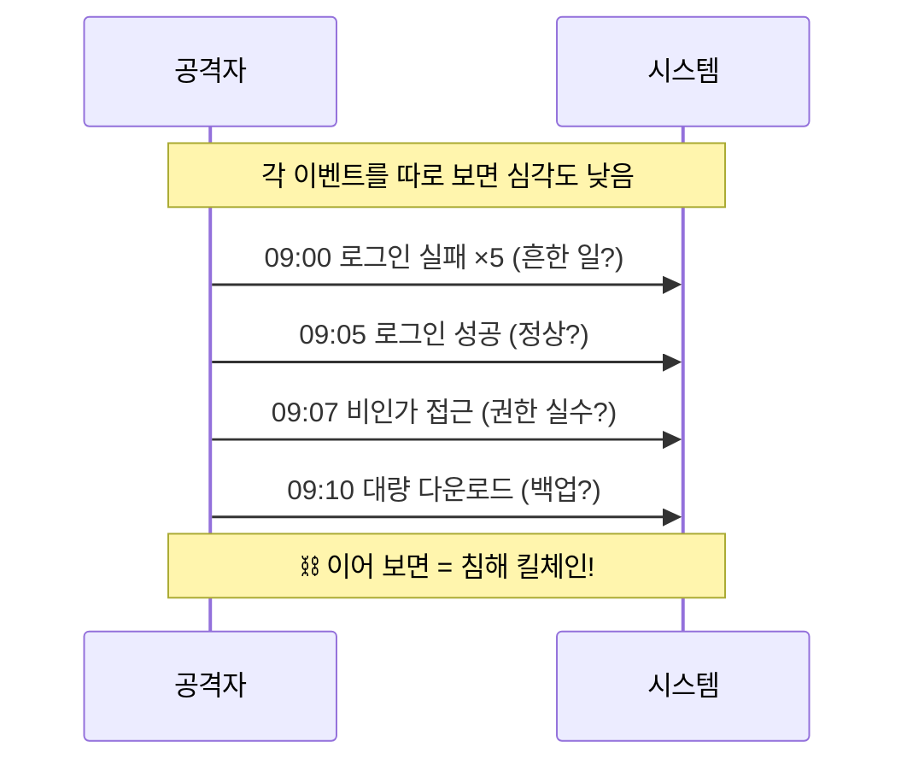
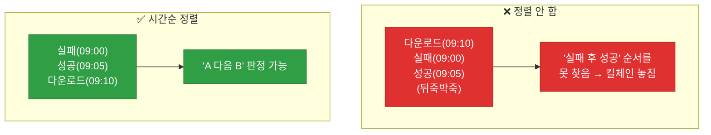
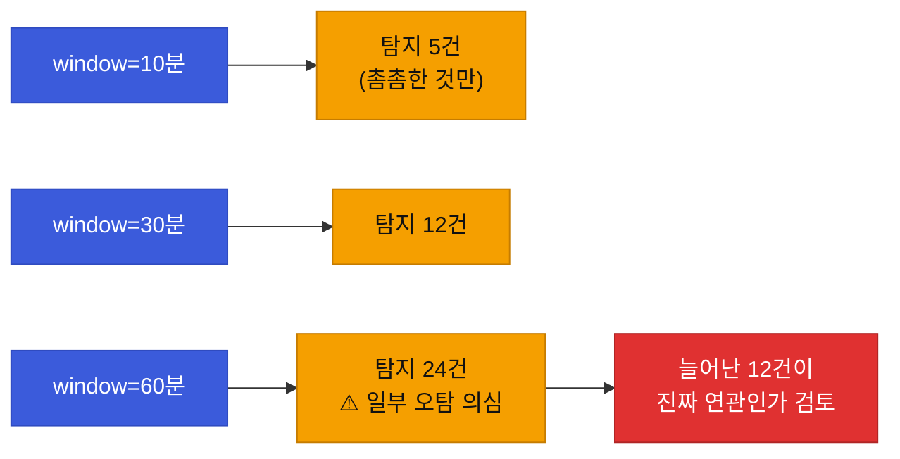

# 강의2 · 상관분석(Correlation)과 체이닝 규칙 (오후, 총 120분)

> **이 교시 한 문장:** 따로 보면 사소한 이벤트들도 **시간순으로 이으면** 하나의 공격 시나리오(킬체인)가 됩니다. 사용자별로 이벤트를 정렬하고, "A 발생 후 window분 내 B" 패턴을 찾는 **체이닝 규칙**으로 공격 흐름을 잡아냅니다.

| 시간 | 소주제 | 핵심 한 줄 |
|------|--------|-----------|
| 00-20분 | 단일 이벤트의 한계와 상관분석 | 이어 보면 다르게 보인다 |
| 20-50분 | 사용자별 시퀀스 구성 | 그룹핑 + 시간순 정렬 |
| 50-80분 | 시간 윈도우 체이닝 검사 | A→B 패턴 찾기 |
| 80-105분 | 임계값(window) 튜닝 실험 | 넓히면 탐지↑ 오탐도↑ |
| 105-120분 | 실습 안내 | 3단계 체이닝으로 확장 |

## 이 교시에 나오는 어려운 용어

| 용어 (한글발음) | 한 줄 뜻 (아주 쉽게) | 비유 |
|----------------|----------------------|------|
| **상관분석(correlation, 코릴레이션)** | 흩어진 이벤트를 이어 하나로 봄 | 여러 CCTV 이어 붙이기 |
| **킬체인(kill chain, 킬체인)** | 공격의 단계별 사슬 | 정찰→침투→유출 |
| **시퀀스(sequence)** | 시간순으로 늘어놓은 순서 | 사건 타임라인 |
| **`defaultdict`(디폴트딕트)** | 없는 키에 기본값을 자동 생성 | 없으면 빈 상자 자동 |
| **`sort(key=...)`** | 기준으로 정렬 | 시간순 줄 세우기 |
| **`lambda`(람다)** | 이름 없는 짧은 함수 | 즉석 계산식 |
| **시간 윈도우(time window)** | "N분 이내"라는 검사 구간 | 30분 안에 |
| **`timedelta`(타임델타)** | 시간의 길이·차이 | 30분 |
| **체이닝(chaining)** | 이벤트를 사슬로 연결 검사 | 도미노 연결 |
| **패턴(pattern)** | 찾으려는 이벤트 순서 | A 다음 B |
| **오탐(false positive)** | 정상을 이상으로 잘못 잡음 | 헛경보 |
| **튜닝(tuning)** | 값을 조정해 성능 개선 | 라디오 주파수 맞추기 |

---

## ⏱️ 00-20분 · 단일 이벤트의 한계와 상관분석

!!! info "📘 학습자 뷰 · 처음 보는 나"
    실제 공격은 한 방이 아니라 **여러 단계**로 이어집니다(**킬체인**). 예를 들어:

    ```
    09:00  로그인 실패 5회      (정찰 — 비번 추측)
    09:05  로그인 성공          (침투 — 뚫림)
    09:07  비인가 접근 시도      (내부 이동 — 권한 밖 탐색)
    09:10  대량 다운로드        (유출 — 데이터 반출)
    ```

    **하나씩 보면** 각각은 심각도가 낮아 보입니다("로그인 실패쯤이야"). 하지만 **이어서 보면** 명백한 공격 시나리오죠. 이렇게 흩어진 이벤트를 연결해 하나의 사건으로 재구성하는 게 **상관분석**입니다.

### 🔬 깊이 보기 — 따로 보면 사소, 이으면 공격



상관분석의 힘은 **"맥락"** 입니다. 로그인 성공 자체는 정상이지만, **직전에 실패 5회가 있었다면** 이야기가 달라집니다. 개별 이벤트의 심각도를 합치는 게 아니라, **순서와 연결**이 새로운 의미를 만듭니다. 이게 단일 룰 탐지(Day2)를 넘어서는 지점입니다.

!!! example "🎓 강사 뷰 · '1+1=3'의 직관"
    *"상관분석은 개별 신호를 더하는 게 아니라 '이야기'를 만드는 겁니다. 실패→성공→비인가→유출은 각각 10점씩 40점이 아니라, 이어졌다는 것만으로 '심각'이 됩니다. 순서가 곧 증거예요."*

!!! question "확인질문"
    **Q. 이 4개 이벤트(실패5회→성공→비인가→대량다운로드)를 따로따로만 본다면 심각도를 낮게 볼 수도 있는데, 왜 이어서 보면 다르게 보일까요?**

    **A.** **순서와 연결이 하나의 공격 시나리오(킬체인)를 드러내기 때문**입니다.

    개별 이벤트는 각각 흔하거나 사소해 보입니다. 로그인 실패도, 성공도, 다운로드도 일상적으로 일어나죠. 하지만 "실패가 반복되다가 성공하고, 곧바로 권한 밖을 뒤지고, 대량 다운로드로 이어졌다"는 순서는 정찰→침투→내부이동→유출이라는 전형적 공격 흐름입니다. 맥락(직전에 무슨 일이 있었나)이 각 이벤트의 의미를 바꾸므로, 이어서 봐야 진짜 위협이 보입니다.

<div class="quiz">
<p class="quiz-q"><span class="tag">퀴즈</span><b>상관분석이 개별 이벤트 탐지(Day2)보다 강력할 수 있는 근본 이유는?</b></p>
<button class="quiz-opt">이벤트 개수를 더 많이 세기 때문</button>
<button class="quiz-opt" data-correct>이벤트의 순서·연결(맥락)이 개별로는 안 보이던 공격 시나리오를 드러내기 때문</button>
<button class="quiz-opt">상관분석은 오탐이 전혀 없기 때문</button>
<button class="quiz-opt">개별 탐지는 로그를 안 쓰기 때문</button>
<div class="quiz-explain"><b>정답: 2번.</b> 상관분석은 신호를 단순 합산하지 않고 '순서와 맥락'으로 이야기를 만듭니다. 로그인 성공도 직전 실패 5회 뒤라면 의미가 달라집니다.</div>
<button class="quiz-retry">다시 풀기</button>
</div>

---

## ⏱️ 20-50분 · 사용자별 이벤트 시퀀스 구성

!!! abstract "이 블록을 마치면"
    ✔ 이벤트를 ==사용자별로 묶고 시간순 정렬==하는 함수를 안다

### 💻 코드 완전 해부 — `group_by_user()`

```python
from collections import defaultdict

def group_by_user(events):
    grouped = defaultdict(list)                       # ①
    for e in events:                                  # ②
        grouped[e['user']].append(e)                  # ③
    for user in grouped:                              # ④
        grouped[user].sort(key=lambda x: x['timestamp'])  # ⑤
    return grouped                                    # ⑥
```

| 줄 | 하는 일 | 왜 |
|:--:|---------|-----|
| **①** | 없는 키에 **자동으로 빈 리스트** 주는 딕셔너리 | `if 키 없으면` 안 써도 됨 |
| **②③** | 각 이벤트를 그 사용자 칸에 추가 | 사용자별로 모으기 |
| **④⑤** | 각 사용자의 이벤트를 **시간순 정렬** | 체이닝은 순서가 생명 |
| **⑥** | "사용자→시간순 이벤트" 반환 | 다음 단계 입력 |

!!! example "🎓 강사 뷰 · `defaultdict`의 편리함"
    - 보통 딕셔너리면 `if user not in grouped: grouped[user]=[]`를 매번 써야 합니다. `defaultdict(list)`는 **없는 키를 처음 만지면 자동으로 빈 리스트**를 만들어 줘, 그 검사를 생략합니다. 3과목 `setdefault`와 같은 목적의 더 깔끔한 도구죠.
    - ⑤ `sort(key=lambda x: x['timestamp'])` — "각 이벤트의 timestamp를 기준으로 정렬"입니다. `lambda`는 "이 값을 꺼내라"는 즉석 함수예요.

### 🔬 깊이 보기 — 정렬을 안 하면 체이닝이 무너진다



체이닝은 **"A 다음에 B가 왔나"** 를 봅니다. 그런데 이벤트가 시간순이 아니면 "다음"이라는 개념 자체가 성립 안 합니다. 그래서 정렬(⑤)이 체이닝의 **필수 전제**입니다. 정렬을 빠뜨리면 명백한 공격도 놓칩니다.

!!! question "확인질문"
    **Q. 이벤트를 시간순으로 정렬하지 않으면 다음 단계(체이닝 규칙 검사)에서 어떤 문제가 생길까요?**

    **A.** **"A 다음에 B" 순서를 판단할 수 없어 공격 흐름을 놓칩니다.**

    체이닝은 "로그인 실패 다음에 성공, 그다음 비인가 접근" 같은 순서를 찾는 것입니다. 이벤트가 시간순으로 정렬돼 있지 않으면 어느 것이 먼저이고 나중인지 알 수 없어, "다음에 왔다"는 판정 자체가 불가능해집니다. 그 결과 명백한 킬체인도 순서가 뒤섞여 탐지하지 못하게 됩니다. 그래서 정렬은 체이닝의 필수 전제입니다.

<div class="quiz">
<p class="quiz-q"><span class="tag">퀴즈</span><b><code>group_by_user()</code>에서 <code>defaultdict(list)</code>를 쓰는 이점은?</b></p>
<button class="quiz-opt">정렬을 자동으로 해 준다</button>
<button class="quiz-opt" data-correct>처음 보는 사용자 키를 만질 때 빈 리스트를 자동 생성해, 'if 키 없으면 만들기' 검사를 생략하게 해 준다</button>
<button class="quiz-opt">이벤트를 자동으로 탐지한다</button>
<button class="quiz-opt">timestamp를 자동으로 만든다</button>
<div class="quiz-explain"><b>정답: 2번.</b> `defaultdict(list)`는 없는 키 접근 시 빈 리스트를 자동 제공해 `append`를 바로 할 수 있게 합니다. 정렬(5번)은 별도로 `sort`가 담당합니다.</div>
<button class="quiz-retry">다시 풀기</button>
</div>

---

## ⏱️ 50-80분 · 시간 윈도우 기반 체이닝 검사

!!! abstract "이 블록을 마치면"
    ✔ =='A 발생 후 window분 이내 B 발생' 패턴을 찾는== 함수를 안다

### 💻 코드 완전 해부 — `check_chain()`

```python
from datetime import timedelta

def check_chain(user_events, pattern, window_minutes=30):
    for i, e in enumerate(user_events):                        # ①
        if e['event_type'] == pattern[0]:                      # ②
            window_end = e['timestamp'] + timedelta(minutes=window_minutes)  # ③
            following = [x for x in user_events[i+1:]           # ④
                         if x['timestamp'] <= window_end]
            if any(x['event_type'] == pattern[1] for x in following):  # ⑤
                return True
    return False                                               # ⑥
```

| 줄 | 하는 일 | 왜 |
|:--:|---------|-----|
| **①** | 이벤트를 순서대로(인덱스와 함께) | A를 찾기 위해 |
| **②** | 이게 패턴의 **첫 이벤트(A)** 인가 | 사슬 시작점 |
| **③** | A 시각 + window = **마감 시각** | "이내" 판정 기준 |
| **④** | A **이후**이면서 마감 안쪽인 이벤트들 | B 후보 구간 |
| **⑤** | 그 안에 패턴의 **두 번째(B)** 가 있나 | 사슬 완성 확인 |
| **⑥** | 끝까지 못 찾으면 False | 사슬 없음 |

**핵심은 ③④입니다.** "A 다음"이면서 "A 시각 + window 이내"인 것만 B 후보로 봅니다. 시간 제한이 없으면 "3일 뒤 다운로드"도 사슬로 잘못 엮이겠죠(오탐).

### ✍️ 지금 직접 쳐보기 (5분) — 3단계로 확장 상상

!!! success "✍️ 직접 쳐보기 — A→B→C 체이닝 설계"
    현재 `check_chain()`은 2단계(A→B)입니다. 3단계(A→B→C)로 넓히려면?

    1. `pattern = ['login_failed', 'login_success', 'unauthorized_access']`처럼 3개로.
    2. 아이디어: B를 찾은 지점부터 **다시 window 안에서 C를 찾는** 식으로 재귀·반복 확장.
    3. 종이에 "A 찾음 → B를 window 안에서 찾음 → 그 B부터 다시 window 안에서 C" 흐름을 그려 봅니다.

    > 🎓 강사 팁: 코드를 다 짜지 않아도, **"2단계 로직을 어떻게 이어 붙이면 N단계가 되나"** 를 말로 설명할 수 있으면 상관분석의 구조를 이해한 것입니다.

!!! question "확인질문"
    **Q. `pattern` 리스트가 2단계가 아니라 3단계(A→B→C)라면 이 함수를 어떻게 확장해야 할까요?**

    **A.** **B를 찾은 시점부터 다시 window 안에서 C를 찾는 단계를 이어 붙입니다.**

    지금은 "A를 찾고, A 이후 window 이내에서 B가 있는지"만 봅니다. 3단계로 넓히려면, B를 찾았을 때 그 B의 시각을 새 기준으로 삼아 "B 이후 window 이내에 C가 있는지"를 한 번 더 검사하면 됩니다. 이를 일반화하면 반복문이나 재귀로 pattern의 각 단계를 순서대로 이어 확인하는 구조가 되어, 몇 단계든 처리할 수 있습니다.

<div class="quiz">
<p class="quiz-q"><span class="tag">퀴즈</span><b><code>check_chain()</code>에서 <code>window_end = e['timestamp'] + timedelta(minutes=window_minutes)</code>로 시간 제한을 두는 이유는?</b></p>
<button class="quiz-opt">코드를 복잡하게 만들려고</button>
<button class="quiz-opt" data-correct>A 이후 아무 때나가 아니라 '짧은 시간 안'에 B가 이어져야 연관된 공격으로 볼 수 있어, 멀리 떨어진 무관한 이벤트를 오탐하지 않으려고</button>
<button class="quiz-opt">timedelta를 연습하려고</button>
<button class="quiz-opt">B를 자동으로 생성하려고</button>
<div class="quiz-explain"><b>정답: 2번.</b> 시간 창이 없으면 "3일 뒤 다운로드"도 사슬로 엮여 오탐이 납니다. window는 "연관 있다고 볼 만큼 가까운가"의 기준입니다.</div>
<button class="quiz-retry">다시 풀기</button>
</div>

---

## ⏱️ 80-105분 · 임계값(window) 튜닝 실험

!!! info "📘 학습자 뷰 · 처음 보는 나"
    `window_minutes`를 10분/30분/60분으로 바꾸면 탐지 건수가 달라집니다.

    - **좁게(10분):** 정말 촘촘히 이어진 것만 → 탐지 적음, 놓칠 수도(미탐)
    - **넓게(60분):** 느슨하게 이어진 것도 → 탐지 많음, **무관한 것까지 엮일 수도(오탐)**

    "적절한 window는 얼마인가?"에 **정답은 없습니다.** 데이터로 실험해 균형점을 찾습니다. 이게 Day4 튜닝의 예고편입니다.

### 🔬 깊이 보기 — 임계값은 신념이 아니라 실험의 결과



window를 60분으로 늘려 탐지가 2배가 됐다면, **늘어난 건들이 진짜 연관인지** 하나씩 봐야 합니다. 무관한 이벤트가 우연히 60분 안에 들어와 엮였다면 오탐이죠. **"탐지가 늘었다 = 좋다"가 아닙니다.** 늘어난 것의 질을 확인하는 게 데이터 기반 튜닝입니다.

!!! example "🎓 강사 뷰 · 실험 태도를 심기"
    *"학생이 'window 몇 분이 정답이에요?' 물으면, '직접 돌려 보고 오탐률을 보라'고 하세요. 4과목의 핵심 교훈은 '숫자는 실험으로 정한다'입니다. Day4에서 이걸 정밀도·재현율로 정량화합니다."*

!!! question "확인질문"
    **Q. window를 60분으로 늘렸더니 탐지 건수가 2배로 늘었다면, 이 중 일부는 오탐일 가능성이 있을까요? 어떻게 확인할 수 있을까요?**

    **A.** **네, 오탐일 가능성이 있고, 늘어난 건을 직접 검토해 확인합니다.**

    window를 넓히면 서로 무관한 이벤트도 60분이라는 긴 창 안에 우연히 함께 들어와 사슬로 엮일 수 있습니다. 그래서 탐지가 늘었다고 무조건 좋은 게 아닙니다. 확인하려면 새로 탐지된 건들을 하나씩 열어, A와 B가 실제로 같은 공격 흐름인지(같은 IP·연속된 맥락인지) 아니면 우연히 시간만 겹친 무관한 사건인지 살펴봐야 합니다. 이렇게 늘어난 탐지의 '질'을 검토하는 것이 데이터 기반 튜닝입니다.

<div class="quiz">
<p class="quiz-q"><span class="tag">퀴즈</span><b>상관분석의 <code>window_minutes</code>를 넓힐 때 나타나는 현상으로 옳은 것은?</b></p>
<button class="quiz-opt">탐지 건수가 줄고 오탐도 준다</button>
<button class="quiz-opt" data-correct>탐지 건수는 늘지만, 무관한 이벤트가 우연히 엮이는 오탐도 함께 늘 수 있다</button>
<button class="quiz-opt">window는 결과에 영향을 주지 않는다</button>
<button class="quiz-opt">공격이 자동으로 차단된다</button>
<div class="quiz-explain"><b>정답: 2번.</b> 넓은 창 = 느슨한 연결 = 탐지↑ 오탐↑. 좁은 창 = 촘촘한 연결만 = 탐지↓ 미탐↑. window·threshold 모두 실험으로 균형을 찾습니다(Day4에서 정량화).</div>
<button class="quiz-retry">다시 풀기</button>
</div>

!!! tip "🧠 파인만 자가진단"
    안 보고 말할 수 있으면 통과입니다.

    1. 단일 이벤트 vs 상관분석의 차이(맥락·순서)
    2. `group_by_user()`에서 정렬이 필수인 이유
    3. `check_chain()`의 window 시간 제한이 막는 오탐
    4. window를 넓힐 때의 탐지↑ 오탐↑ 트레이드오프

---

## ⏱️ 105-120분 · 실습 안내

**오후 정리:**

1. **상관분석** — 흩어진 이벤트를 순서·맥락으로 이어 킬체인 재구성
2. `group_by_user()` — `defaultdict`로 묶고 **시간순 정렬**(체이닝 필수 전제)
3. `check_chain()` — "A 다음 **window 이내** B" 패턴 탐지
4. **window 튜닝** — 넓히면 탐지↑ 오탐↑, 늘어난 건의 질을 검토

!!! note "실습 예고 (오후 실습 120분)"
    `advanced_detection.py`(비인가·SaaS·IOC), `correlation.py`(group_by_user·check_chain)를 구현하고, 3과목 config를 실제로 import해 연동하며, 3단계 체이닝을 테스트 데이터에 심어 검증합니다. 위험점수에 상관분석 결과를 가산합니다. 상세는 [실습 페이지](practice.md).

---

## ✅ 가르칠 준비 체크리스트 (강의2)

- [ ] 킬체인 예시로 상관분석의 필요성을 설명한다
- [ ] `group_by_user()`의 defaultdict·정렬을 설명한다
- [ ] 정렬이 체이닝의 전제임을 강조한다
- [ ] `check_chain()`의 window 시간 제한을 설명한다
- [ ] 2단계→3단계 확장 아이디어를 설명한다
- [ ] window 튜닝의 탐지-오탐 트레이드오프를 설명한다
- [ ] 확인질문 4개 + 퀴즈에 답한다

*[correlation]: 상관분석 — 흩어진 이벤트를 이어 하나의 사건으로 재구성
*[kill chain]: 킬체인 — 공격의 단계별 사슬(정찰→침투→이동→유출)
*[chaining]: 체이닝 — 이벤트를 시간 순서로 연결해 패턴을 찾는 검사
