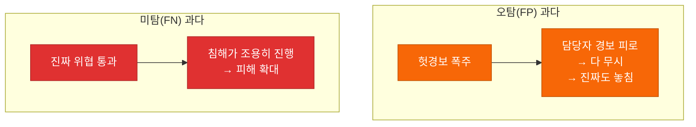
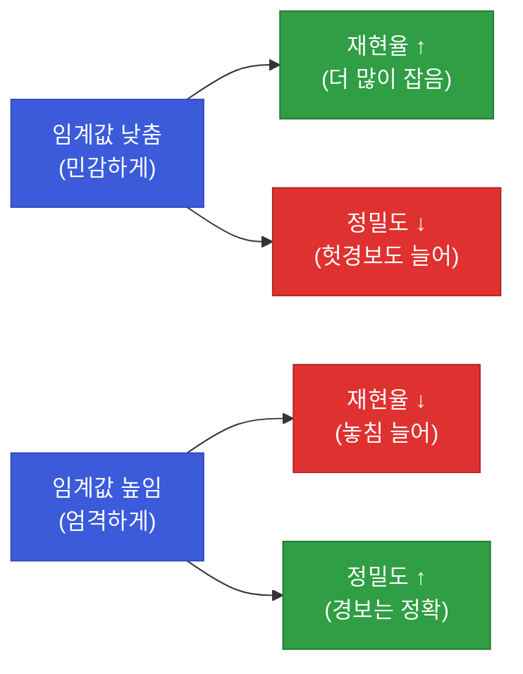
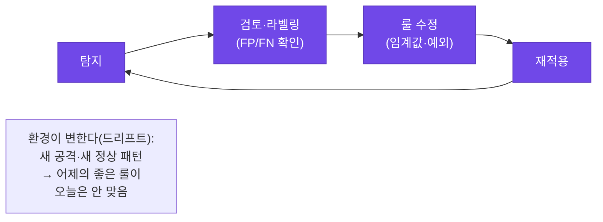

# 강의1 · 오탐·미탐 개념과 성능지표 (오전, 총 120분)

> **이 교시 한 문장:** 탐지 결과를 **혼동행렬(맞음/틀림 × 정상/이상)** 로 정리하고, **정밀도(경보의 정확성)** 와 **재현율(놓치지 않는 정도)** 의 트레이드오프를 이해해, "좋은 탐지"를 숫자로 말할 수 있게 됩니다.

| 시간 | 소주제 | 핵심 한 줄 |
|------|--------|-----------|
| 00-20분 | 오탐(FP)과 미탐(FN) | 두 방향의 실수 |
| 20-50분 | 정밀도와 재현율 | 경보 정확성 vs 놓침 방지 |
| 50-80분 | 어느 지표를 우선? | 초기엔 재현율 우선 |
| 80-105분 | 튜닝 프로세스 | 탐지→검토→수정→반복 |
| 105-120분 | 정리 | 측정해야 개선한다 |

## 이 교시에 나오는 어려운 용어

| 용어 (한글발음) | 한 줄 뜻 (아주 쉽게) | 비유 |
|----------------|----------------------|------|
| **오탐(False Positive, FP)** | 정상인데 이상이라 잘못 경보 | 멀쩡한데 화재경보 |
| **미탐(False Negative, FN)** | 이상인데 못 잡고 놓침 | 진짜 불인데 조용 |
| **정탐(True Positive, TP)** | 이상을 맞게 잡음 | 진짜 불에 경보 |
| **정상통과(True Negative, TN)** | 정상을 정상으로 넘김 | 멀쩡한데 조용 |
| **혼동행렬(confusion matrix)** | 맞음/틀림을 표로 정리 | 채점 매트릭스 |
| **정밀도(Precision, 프리시전)** | 경보 중 진짜 비율 | 경보의 정확성 |
| **재현율(Recall, 리콜)** | 실제 위협 중 잡은 비율 | 놓치지 않는 정도 |
| **트레이드오프(trade-off)** | 하나 얻으면 하나 잃음 | 시소 |
| **경보 피로(alert fatigue)** | 오탐 많아 무뎌짐 | 양치기 소년 |
| **라벨링(labeling)** | 정답(정상/이상)을 표시 | 채점 답안 |
| **튜닝 사이클(tuning cycle)** | 반복 개선 과정 | 조율 반복 |
| **드리프트(drift)** | 시간이 지나 패턴이 변함 | 유행이 바뀜 |

---

## ⏱️ 00-20분 · 오탐(False Positive)과 미탐(False Negative)

!!! info "📘 학습자 뷰 · 처음 보는 나"
    탐지는 두 방향으로 틀릴 수 있습니다.

    - **오탐(FP):** 실제로는 **정상인데** 이상이라고 **잘못 경보** (헛경보)
    - **미탐(FN):** 실제로는 **이상인데** 못 잡고 **놓침** (진짜 위협 통과)

    이걸 표(혼동행렬)로 정리하면 한눈에 보입니다.

    |  | 실제 정상 | 실제 이상 |
    |--|-----------|-----------|
    | **탐지: 정상(무시)** | ✅ TN (정상통과) | 🕳️ **FN (미탐)** |
    | **탐지: 이상(경보)** | ⚠️ **FP (오탐)** | ✅ TP (정탐) |

    대각선(TN·TP)이 맞은 것, 나머지(FP·FN)가 틀린 것입니다.

### 🔬 깊이 보기 — 오탐과 미탐, 어느 쪽이 더 무서운가



**둘 다 나쁘지만 방향이 다릅니다.** 오탐이 많으면 **경보 피로**로 담당자가 지쳐 결국 진짜도 놓칩니다(간접적 미탐). 미탐이 많으면 **위협이 조용히 통과**해 직접적 피해가 납니다. 보안에서는 대체로 **미탐이 더 치명적**(놓친 침해는 되돌릴 수 없음)이라, 초기엔 미탐을 줄이는 쪽으로 기웁니다 — 이게 뒤의 "재현율 우선"입니다.

!!! example "🎓 강사 뷰 · 표를 손으로 그리게 하기"
    *"혼동행렬 2×2를 학생이 직접 그리고, 실제 사례를 각 칸에 넣게 하세요. '비번 헷갈린 정상 사용자를 공격으로 경보'는 어디? → FP. 이렇게 채워 보면 개념이 손에 붙습니다."*

!!! question "확인질문"
    **Q. 보안관제 담당자 입장에서 오탐이 너무 많으면 어떤 문제가 생길까요? 미탐이 많으면 어떤 문제가 생길까요?**

    **A.** 방향이 다른 두 문제가 생깁니다.

    - **오탐 과다**: 헛경보가 쏟아져 담당자가 경보 피로에 빠지고, 결국 알림 전체를 무시하게 되어 그 속의 진짜 위협까지 놓치게 됩니다.
    - **미탐 과다**: 실제 위협이 탐지를 통과해 침해가 조용히 진행되고, 발견이 늦어져 피해가 커집니다.

    오탐은 '신뢰를 갉아먹어 간접적으로' 위협을 놓치게 하고, 미탐은 '직접적으로' 위협을 놓칩니다. 그래서 둘의 균형을 맞추되, 놓치면 되돌릴 수 없는 미탐을 특히 경계합니다.

<div class="quiz">
<p class="quiz-q"><span class="tag">퀴즈</span><b>혼동행렬에서 "실제로는 정상인데 이상이라고 경보한 것"은 무엇인가?</b></p>
<button class="quiz-opt">True Positive (정탐)</button>
<button class="quiz-opt" data-correct>False Positive (오탐)</button>
<button class="quiz-opt">False Negative (미탐)</button>
<button class="quiz-opt">True Negative (정상통과)</button>
<div class="quiz-explain"><b>정답: 2번.</b> 정상(실제) + 경보(탐지) = False Positive(오탐). 반대로 이상(실제)인데 무시(탐지)하면 False Negative(미탐)입니다. Positive/Negative는 '탐지가 경보했나', True/False는 '그게 맞았나'를 뜻합니다.</div>
<button class="quiz-retry">다시 풀기</button>
</div>

---

## ⏱️ 20-50분 · 정밀도(Precision)와 재현율(Recall)

!!! abstract "이 블록을 마치면"
    ✔ 두 지표의 ==공식과 서로 반대로 움직이는 관계==를 안다

!!! info "📘 학습자 뷰 · 처음 보는 나"
    혼동행렬의 네 숫자로 두 지표를 만듭니다.

    - **정밀도(Precision) = TP / (TP + FP)** → "경보한 것 중 **진짜** 비율" (경보가 얼마나 믿을 만한가)
    - **재현율(Recall) = TP / (TP + FN)** → "실제 위협 중 **잡아낸** 비율" (얼마나 안 놓치는가)

    쉽게: **정밀도 = 쏜 화살 중 명중률 / 재현율 = 표적 중 맞힌 비율.**

### 🔬 깊이 보기 — 왜 둘은 반대로 움직이나 (트레이드오프)



**임계값을 낮추면** 더 많이 경보하니 **재현율은 오르지만**(안 놓침), 헛경보가 섞여 **정밀도는 떨어집니다.** 반대로 높이면 경보는 정확(정밀도↑)하지만 놓침이 늘죠(재현율↓). **둘 다 100%는 불가능** — 한쪽을 얻으면 한쪽을 잃는 트레이드오프입니다. 그래서 "무엇을 우선할지"를 정해야 합니다.

!!! example "🎓 강사 뷰 · 극단 예로 직관 주기"
    *"극단을 생각해 보세요. '모든 걸 경보'하면 재현율 100%(다 잡음)지만 정밀도는 바닥(대부분 헛경보). '아무것도 경보 안 함'이면 정밀도는 정의 불가지만 미탐투성이. 현실은 이 사이 어딘가고, 어디에 설지가 전략입니다."*

!!! question "확인질문"
    **Q. 임계값을 낮춰서 탐지를 더 민감하게 만들면 재현율은 어떻게 변할까요? 정밀도는요?**

    **A.** **재현율은 올라가고, 정밀도는 내려갑니다.**

    임계값을 낮추면 더 많은 이벤트를 이상으로 경보합니다. 그만큼 실제 위협을 놓치지 않게 되어 재현율(실제 위협 중 잡은 비율)은 올라갑니다. 하지만 정상인 것까지 경보에 섞이므로 오탐(FP)이 늘어, 경보 중 진짜 비율인 정밀도는 떨어집니다. 둘은 반대로 움직이는 트레이드오프 관계라, 한쪽을 높이면 다른 쪽이 희생됩니다.

<div class="quiz">
<p class="quiz-q"><span class="tag">퀴즈</span><b>정밀도 = TP/(TP+FP), 재현율 = TP/(TP+FN)일 때, 오탐(FP)이 늘면 어느 지표가 직접 나빠지는가?</b></p>
<button class="quiz-opt">재현율만 나빠진다</button>
<button class="quiz-opt" data-correct>정밀도가 나빠진다 (분모의 FP가 커지므로)</button>
<button class="quiz-opt">두 지표 다 좋아진다</button>
<button class="quiz-opt">아무 변화 없다</button>
<div class="quiz-explain"><b>정답: 2번.</b> 정밀도 공식의 분모에 FP가 있어, 오탐이 늘면 정밀도가 떨어집니다. 재현율 공식엔 FP가 없어 직접 영향은 미탐(FN)이 좌우합니다. 공식을 보면 어느 실수가 어느 지표를 해치는지 보입니다.</div>
<button class="quiz-retry">다시 풀기</button>
</div>

---

## ⏱️ 50-80분 · 보안관제에서 어느 지표를 우선할 것인가

!!! info "📘 학습자 뷰 · 처음 보는 나"
    둘 다 못 챙기면 무엇을 우선할까요? 실무 전략은 이렇습니다.

    - **초기 탐지 단계:** **재현율 우선** — "일단 놓치지 말자." 오탐이 좀 늘어도 진짜 위협은 잡는다.
    - **이후 검토 단계:** **정밀도 확보** — 사람(또는 추가 룰)이 오탐을 걸러낸다.

    즉 **기계는 넓게 잡고(재현율), 사람이 좁혀 확인(정밀도)** 하는 2단계입니다.

### 🔬 깊이 보기 — '재현율 우선 → 사람 검토'가 SOAR로 이어진다


왜 이 순서일까요? **놓친 위협(미탐)은 되돌릴 수 없지만, 오탐은 검토로 걸러낼 수 있기** 때문입니다. 그래서 첫 그물은 넓게 치고(재현율), 사람이 좁힙니다. 이 "자동 탐지 → 사람 승인" 구조가 바로 5과목 SOAR의 **승인 게이트**입니다. 4과목 탐지가 5과목 대응의 앞단인 이유죠.

!!! example "🎓 강사 뷰 · '되돌릴 수 있나'로 판단"
    *"우선순위를 정하는 기준은 '어느 실수가 되돌릴 수 있나'입니다. 오탐은 나중에 걸러도 되지만, 미탐으로 털린 데이터는 못 되돌립니다. 그래서 초기엔 재현율. 다만 오탐이 너무 많으면 검토가 마비되니, 튜닝으로 균형을 잡습니다."*

!!! question "확인질문"
    **Q. 재현율을 우선한다는 것은, 오탐이 좀 늘더라도 무엇을 지키겠다는 뜻일까요?**

    **A.** **진짜 위협을 놓치지 않겠다(미탐을 줄이겠다)는 뜻**입니다.

    재현율은 "실제 위협 중 잡아낸 비율"이므로, 재현율을 우선한다는 것은 헛경보(오탐)가 다소 늘더라도 실제 위협은 최대한 다 잡겠다는 선택입니다. 놓친 위협(미탐)은 침해가 진행되어 되돌릴 수 없는 피해로 이어지지만, 오탐은 이후 사람 검토나 추가 룰로 걸러낼 수 있기 때문입니다. 그래서 초기 탐지는 넓게 잡고(재현율 우선), 검토 단계에서 정밀도를 확보합니다.

<div class="quiz">
<p class="quiz-q"><span class="tag">퀴즈</span><b>초기 자동 탐지 단계에서 정밀도보다 재현율을 우선하는 실무 논리로 가장 적절한 것은?</b></p>
<button class="quiz-opt">재현율이 계산하기 더 쉬워서</button>
<button class="quiz-opt" data-correct>놓친 위협(미탐)은 되돌릴 수 없지만, 오탐은 이후 사람 검토로 걸러낼 수 있어서</button>
<button class="quiz-opt">정밀도는 보안에서 중요하지 않아서</button>
<button class="quiz-opt">재현율이 높으면 오탐이 사라져서</button>
<div class="quiz-explain"><b>정답: 2번.</b> "되돌릴 수 있나"가 판단 기준입니다. 오탐은 검토로 정정 가능, 미탐은 이미 뚫린 것. 그래서 넓게 잡고(재현율) 사람이 좁힙니다 — 이 구조가 5과목 SOAR 승인 게이트입니다.</div>
<button class="quiz-retry">다시 풀기</button>
</div>

---

## ⏱️ 80-105분 · 튜닝 프로세스 개관

!!! info "📘 학습자 뷰 · 처음 보는 나"
    탐지 룰은 한 번 만들고 끝이 아닙니다. **반복 개선(튜닝 사이클)** 합니다.

    ```
    탐지 → 검토(사람이 오탐/미탐 라벨링) → 룰 수정 → 재적용 → 다시 탐지 …
    ```

### 🔬 깊이 보기 — 왜 튜닝은 한 번으로 안 끝나나



세상이 **계속 변하기(드리프트)** 때문입니다. 새 공격 기법이 나오고(미탐 증가), 정상 업무 패턴도 바뀝니다(오탐 증가). 어제 완벽했던 룰이 오늘은 안 맞죠. 그래서 튜닝은 **끝없는 순환**입니다. "한 번 잘 만들면 끝"이 아니라 "계속 돌본다"가 관제의 본질입니다.

!!! example "🎓 강사 뷰 · 3과목 정기점검과 연결"
    *"3과목에서 '권한도 정기 점검한다' 했죠. 탐지 룰도 똑같습니다. 만들고 방치하면 낡습니다. 정기적으로 성능을 재고 고치는 게 살아있는 보안이에요."*

!!! question "확인질문"
    **Q. 튜닝을 한 번만 하고 끝내지 않고 반복해야 하는 이유는 무엇일까요?**

    **A.** **환경이 계속 변하기 때문(드리프트)** 입니다.

    새로운 공격 기법이 등장하면 기존 룰이 그것을 놓치기 시작하고(미탐 증가), 회사의 정상 업무 패턴이 바뀌면 멀쩡한 활동을 이상으로 잡기 시작합니다(오탐 증가). 즉 어제 잘 맞던 룰이 시간이 지나면 안 맞게 됩니다. 그래서 탐지→검토→수정→재적용을 주기적으로 반복하며, 변하는 환경에 룰을 계속 맞춰야 합니다.

<div class="quiz">
<p class="quiz-q"><span class="tag">퀴즈</span><b>탐지룰 튜닝이 '한 번 하고 끝'이 아니라 반복 사이클이어야 하는 근본 이유는?</b></p>
<button class="quiz-opt">한 번에 완벽한 룰은 코드로 표현 불가능해서</button>
<button class="quiz-opt" data-correct>공격 기법과 정상 업무 패턴이 계속 변해(드리프트), 과거의 좋은 룰이 시간이 지나면 안 맞게 되기 때문</button>
<button class="quiz-opt">튜닝을 반복하면 로그가 늘어서</button>
<button class="quiz-opt">한 번만 하면 재현율이 0이 되어서</button>
<div class="quiz-explain"><b>정답: 2번.</b> 환경 변화(드리프트)로 룰이 낡습니다. 새 공격은 미탐을, 바뀐 정상 패턴은 오탐을 늘립니다. 3과목 정기점검처럼 탐지 룰도 계속 돌봐야 합니다.</div>
<button class="quiz-retry">다시 풀기</button>
</div>

!!! tip "🧠 파인만 자가진단"
    안 보고 말할 수 있으면 통과입니다.

    1. 혼동행렬 4칸(TP·FP·FN·TN)을 사례로 채우기
    2. 정밀도·재현율 공식과 트레이드오프
    3. 초기에 재현율을 우선하는 이유("되돌릴 수 있나")
    4. 튜닝이 반복돼야 하는 이유(드리프트)

---

## ⏱️ 105-120분 · 정리

**오전 정리:**

1. **혼동행렬** — TP·TN(맞음) / FP(오탐)·FN(미탐)
2. **정밀도**(경보 정확성) vs **재현율**(놓침 방지) — 반대로 움직이는 **트레이드오프**
3. **초기엔 재현율 우선** — 미탐은 못 되돌리고, 오탐은 검토로 거른다(→SOAR 승인 게이트)
4. **튜닝은 반복** — 드리프트 때문에 끝없이 돌본다

오후에는 이를 실제 코드로 측정(`evaluate_detector`)하고, 오탐을 분석해 룰을 개선합니다.

---

## ✅ 가르칠 준비 체크리스트 (강의1)

- [ ] 혼동행렬을 손으로 그리고 사례를 채운다
- [ ] 오탐·미탐의 서로 다른 위험을 설명한다
- [ ] 정밀도·재현율 공식과 트레이드오프를 설명한다
- [ ] 재현율 우선 전략과 그 이유를 설명한다
- [ ] 재현율 우선 → 사람 검토 → SOAR 연결을 언급한다
- [ ] 튜닝 사이클과 드리프트를 설명한다
- [ ] 확인질문 4개 + 퀴즈에 답한다

*[precision]: 정밀도 — 경보 중 진짜 위협 비율 TP/(TP+FP)
*[recall]: 재현율 — 실제 위협 중 잡아낸 비율 TP/(TP+FN)
*[confusion matrix]: 혼동행렬 — 탐지 결과를 맞음/틀림으로 정리한 표
*[drift]: 드리프트 — 시간이 지나며 패턴이 변하는 현상
