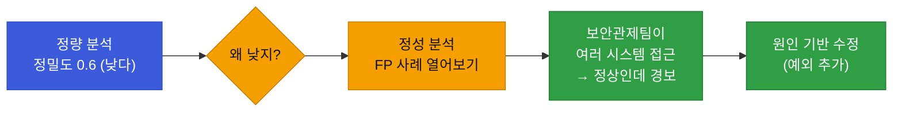
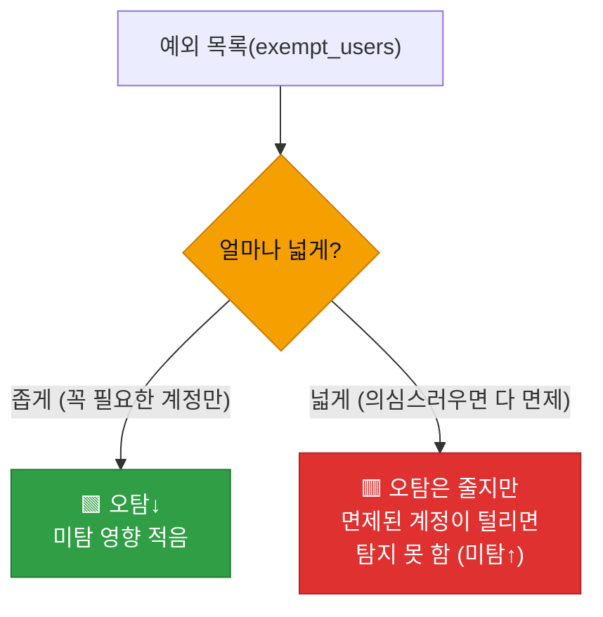
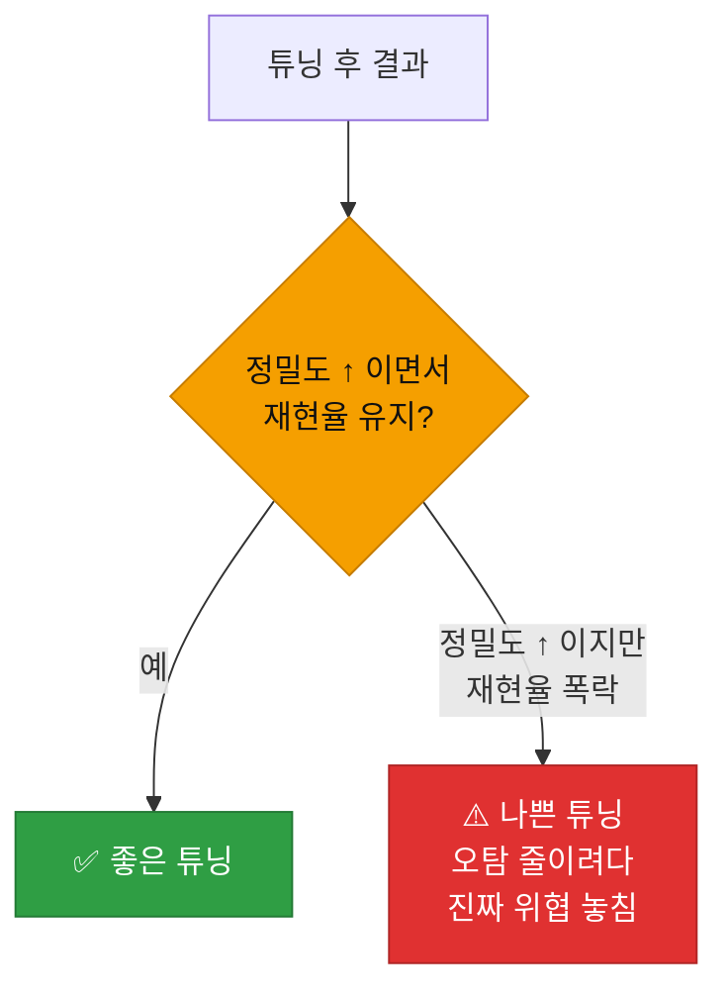

# 강의2 · 탐지룰 튜닝 실습 준비 (오후, 총 120분)

> **이 교시 한 문장:** 정답이 라벨링된 테스트셋으로 탐지 성능(정밀도·재현율)을 **함수로 측정**하고, 오탐(FP) 사례를 분석해 **예외 조건·임계값**으로 룰을 개선한 뒤, 튜닝 전후 성능을 비교합니다.

| 시간 | 소주제 | 핵심 한 줄 |
|------|--------|-----------|
| 00-25분 | 라벨링 테스트셋으로 성능 측정 | evaluate_detector 구현 |
| 25-55분 | 오탐 사례 분석 | 왜 헛경보가 났나 |
| 55-85분 | 룰 개선 — 예외 조건 추가 | exempt_users |
| 85-110분 | 튜닝 전후 성능 비교 | 개선인가 개악인가 |
| 110-120분 | 실습 안내 | 전후 표로 정리 |

## 이 교시에 나오는 어려운 용어

| 용어 (한글발음) | 한 줄 뜻 (아주 쉽게) | 비유 |
|----------------|----------------------|------|
| **라벨링 데이터셋(labeled dataset)** | 정답(정상/이상)이 붙은 데이터 | 채점된 답안지 |
| **`is_actual_anomaly`** | 실제로 이상인지 정답 필드 | 정답 칸 |
| **정답(ground truth)** | 실제 참값 | 모범답안 |
| **TP/FP/FN/TN** | 정탐/오탐/미탐/정상통과 | 채점 4칸 |
| **`if (tp+fp) else 0`** | 0으로 나누기 방지 | 분모 0 예외 |
| **예외 조건(exception)** | 특정 경우 탐지 제외 | 면제 명단 |
| **`exempt_users`** | 탐지 면제 사용자 목록 | 프리패스 명단 |
| **면제(exemption)** | 규칙 적용을 빼줌 | 통행 면제 |
| **개선(improvement)** | 성능이 나아짐 | 점수 상승 |
| **개악(regression)** | 고쳤는데 더 나빠짐 | 개선하려다 악화 |
| **과적합(overfitting)** | 특정 사례에만 맞춤 | 이 시험만 잘 봄 |
| **정성 분석(qualitative)** | 숫자 아닌 원인 분석 | 사례 뜯어보기 |

---

## ⏱️ 00-25분 · 라벨링된 테스트셋으로 성능 측정

!!! info "📘 학습자 뷰 · 처음 보는 나"
    성능을 측정하려면 **정답이 필요합니다.** 각 이벤트에 "실제로 이상인가"(`is_actual_anomaly`)가 미리 표시된 **라벨링 데이터셋**이 있어야, 탐지 결과와 정답을 비교할 수 있죠.

### 💻 코드 완전 해부 — `evaluate_detector()`

```python
def evaluate_detector(events_with_labels, detector_func):
    tp = fp = fn = tn = 0                                    # ①
    for e in events_with_labels:
        predicted = detector_func(e)                        # ② 탐지 결과
        actual = e['is_actual_anomaly']                     # ③ 정답
        if predicted and actual:      tp += 1               # ④ 맞게 잡음
        elif predicted and not actual: fp += 1              # ⑤ 헛경보
        elif not predicted and actual: fn += 1              # ⑥ 놓침
        else:                          tn += 1              # ⑦ 정상통과
    precision = tp / (tp + fp) if (tp + fp) else 0          # ⑧
    recall    = tp / (tp + fn) if (tp + fn) else 0          # ⑨
    return {'precision': precision, 'recall': recall}
```

| 줄 | 하는 일 | 왜 |
|:--:|---------|-----|
| **①** | 네 칸 카운터를 0으로 | 혼동행렬 집계 준비 |
| **②③** | 탐지 결과 vs 정답 | 비교의 두 축 |
| **④~⑦** | 네 경우로 분류해 카운트 | 혼동행렬 채우기 |
| **⑧⑨** | 정밀도·재현율 계산 | 성능 수치화 |
| ⑧⑨ `if (…) else 0` | 분모가 0이면 0 반환 | **0으로 나누기 에러 방지** |

!!! warning "🎓 강사 뷰 · ⑧⑨의 `if (tp+fp) else 0`을 짚기"
    - 만약 경보가 하나도 없으면 `tp+fp=0`이라 `tp/0`에서 **ZeroDivisionError**가 납니다. `if (tp+fp) else 0`이 그걸 막죠. 3과목의 `.get(키, 기본값)`과 같은 "0/빈 값 방어" 정신입니다.
    - ④~⑦의 순서: `predicted and actual` → `predicted and not actual` → … 네 경우가 **겹치지 않고 빠짐없이** 나뉩니다. 이 배타·완전 분류가 정확한 집계의 핵심입니다.

!!! question "확인질문"
    **Q. `evaluate_detector()`를 쓰려면 테스트 데이터에 반드시 어떤 정보가 미리 있어야 할까요? 실무에서는 이걸 누가 만들어줄까요?**

    **A.** **각 이벤트에 "실제로 이상인지" 정답(`is_actual_anomaly` 라벨)이 미리 있어야 합니다.**

    탐지 결과가 맞았는지 틀렸는지 판정하려면 비교할 정답(ground truth)이 필요합니다. 이 라벨이 없으면 정밀도·재현율을 계산할 수 없습니다. 실무에서는 보안 분석가가 과거 사건을 조사·검토해 "이건 진짜 공격이었다/아니었다"를 사람이 라벨링해 만듭니다. 즉 성능 측정에는 사람의 정답 판정이라는 기반 작업이 반드시 선행됩니다.

<div class="quiz">
<p class="quiz-q"><span class="tag">퀴즈</span><b><code>precision = tp/(tp+fp) if (tp+fp) else 0</code>에서 <code>if (tp+fp) else 0</code>을 붙이는 이유는?</b></p>
<button class="quiz-opt">계산을 빠르게 하려고</button>
<button class="quiz-opt" data-correct>경보가 하나도 없어 tp+fp가 0일 때 0으로 나누는 에러(ZeroDivisionError)를 막으려고</button>
<button class="quiz-opt">정밀도를 항상 0으로 만들려고</button>
<button class="quiz-opt">재현율을 계산하려고</button>
<div class="quiz-explain"><b>정답: 2번.</b> 분모가 0이면 파이썬은 에러를 냅니다. `if (tp+fp) else 0`은 "경보가 없으면 정밀도 0"으로 안전 처리합니다. 3과목의 빈 값 방어(.get)와 같은 정신입니다.</div>
<button class="quiz-retry">다시 풀기</button>
</div>

---

## ⏱️ 25-55분 · 오탐 사례 분석

!!! info "📘 학습자 뷰 · 처음 보는 나"
    숫자(정밀도가 낮다)만으론 못 고칩니다. **왜** 오탐이 났는지 **실제 FP 사례를 열어봐야** 합니다. 흔한 원인:

    - **임계값이 너무 낮음** — 정상 변동도 잡힘
    - **예외 상황 미고려** — 특정 부서·계정의 정당한 업무를 이상으로 봄
    - **베이스라인 부정확** — 평소 패턴을 잘못 잡음

### 🔬 깊이 보기 — 정량(숫자)과 정성(원인)은 짝이다



**숫자는 "무엇이 문제인지", 사례는 "왜 그런지"** 를 알려줍니다. 정밀도 0.6이라는 숫자만 보고 임계값을 무작정 올리면 미탐이 늘 수 있죠. FP 사례를 열어 "아, 보안관제팀이 원래 여러 시스템을 봐서 걸린 거구나"를 알아야 **정확한 처방**(그 팀 예외)이 나옵니다. 측정과 분석은 한 쌍입니다.

!!! example "🎓 강사 뷰 · '사례를 열어라'"
    *"학생이 성능이 낮으면 곧장 임계값부터 만지려 합니다. 말리세요. '먼저 FP 3건을 열어 공통점을 찾아라.' 원인을 모르고 손대면 다른 데가 터집니다. 데이터 분석은 탐정 일이에요."*

!!! question "확인질문"
    **Q. 특정 부서(예: 보안관제팀)가 업무상 자주 여러 시스템에 접근해 '비정상'으로 오탐되고 있다면 어떻게 룰을 개선해야 할까요?**

    **A.** **그 부서·계정을 탐지 예외로 두거나, 그들에 맞는 별도 기준을 적용합니다.**

    보안관제팀이 여러 시스템에 접근하는 것은 정당한 업무인데 일반 기준으로는 이상으로 잡힙니다. 이럴 땐 해당 계정을 예외 목록(`exempt_users`)에 넣어 그 룰을 면제하거나, 그 부서의 정상 패턴에 맞춘 더 높은 임계값·별도 베이스라인을 적용합니다. 즉 "정상인데 잡히는" 원인을 정확히 파악한 뒤, 그 맥락에 맞는 예외·조정으로 오탐을 줄입니다.

<div class="quiz">
<p class="quiz-q"><span class="tag">퀴즈</span><b>정밀도가 낮을 때 숫자만 보고 곧바로 임계값을 올리기보다 FP 사례를 먼저 열어보라고 하는 이유는?</b></p>
<button class="quiz-opt">사례를 열면 정밀도가 자동으로 올라서</button>
<button class="quiz-opt" data-correct>오탐의 진짜 원인을 알아야 정확한 처방이 나오고, 원인을 모르고 임계값만 올리면 미탐이 늘 수 있어서</button>
<button class="quiz-opt">임계값은 절대 바꾸면 안 되어서</button>
<button class="quiz-opt">사례 분석이 성능 측정을 대체해서</button>
<div class="quiz-explain"><b>정답: 2번.</b> 숫자(정량)는 문제를, 사례(정성)는 원인을 알려줍니다. 원인이 '특정 팀의 정당한 업무'라면 처방은 임계값이 아니라 예외 추가입니다. 원인 없이 손대면 다른 곳이 나빠집니다.</div>
<button class="quiz-retry">다시 풀기</button>
</div>

---

## ⏱️ 55-85분 · 룰 개선 — 예외 조건 추가

!!! abstract "이 블록을 마치면"
    ✔ ==예외 목록으로 특정 계정을 탐지에서 면제==하는 법과 그 위험을 안다

### 💻 코드 완전 해부 — 예외를 넣은 `is_suspicious_login()`

```python
def is_suspicious_login(event, exempt_users=None):
    exempt_users = exempt_users or []                     # ①
    if event['user'] in exempt_users:                     # ②
        return False                                      # ③
    return event['source'] == 'login' and \
           event['event_type'] == 'login_failed'          # ④
```

| 줄 | 하는 일 | 왜 |
|:--:|---------|-----|
| **①** | 예외 목록 없으면 빈 목록 | `None` 안전 처리 |
| **②③** | 예외 사용자면 **탐지 제외**(False) | 정당한 업무 오탐 방지 |
| **④** | 그 외엔 기존 로직대로 탐지 | 일반 사용자엔 그대로 |

### 🔬 깊이 보기 — 예외를 너무 넓히면 미탐이 는다



**예외는 양날의 검입니다.** 오탐을 줄이려 예외를 넓히면, **그 예외 계정이 진짜 공격당했을 때 탐지를 못 합니다**(미탐). 예외는 "정말 필요한 최소한"만 — 3과목 최소권한과 같은 정신입니다. 넓은 예외는 "이 계정은 뭘 해도 안 봐준다"는 사각지대를 만듭니다.

!!! example "🎓 강사 뷰 · 예외의 대가를 명시"
    *"예외는 공짜가 아닙니다. 편하다고 계정을 자꾸 예외에 넣으면, 그만큼 안 보는 영역이 늘어요. 예외를 추가할 땐 '이 계정이 털려도 괜찮은가?'를 반드시 물어야 합니다."*

!!! question "확인질문"
    **Q. 예외 목록(`exempt_users`)을 너무 넓게 잡으면 어떤 위험이 생길 수 있을까요?**

    **A.** **미탐(놓침)이 늘어납니다.**

    예외에 넣은 계정은 탐지에서 아예 제외되므로, 그 계정이 실제로 공격당하거나 탈취돼도 이상 신호를 잡지 못합니다. 오탐을 줄이려고 예외를 넓게 잡을수록 "무슨 일을 해도 감시하지 않는" 사각지대가 커지는 셈입니다. 그래서 예외는 정말 필요한 최소한의 계정에만 적용하고, 추가할 때마다 "이 계정이 털려도 감수할 수 있는가"를 따져야 합니다.

<div class="quiz">
<p class="quiz-q"><span class="tag">퀴즈</span><b>오탐을 줄이려고 <code>exempt_users</code>(탐지 면제 목록)를 넓게 잡을 때의 대가는?</b></p>
<button class="quiz-opt">정밀도가 떨어진다</button>
<button class="quiz-opt" data-correct>면제된 계정이 실제 공격당해도 탐지하지 못하는 사각지대가 생겨 미탐이 는다</button>
<button class="quiz-opt">탐지 속도가 느려진다</button>
<button class="quiz-opt">아무 대가도 없다</button>
<div class="quiz-explain"><b>정답: 2번.</b> 예외는 오탐(정밀도)을 줄이지만, 그 계정을 감시 대상에서 빼므로 미탐(재현율 저하)을 부릅니다. 최소한으로만 — 3과목 최소권한과 같은 원칙입니다.</div>
<button class="quiz-retry">다시 풀기</button>
</div>

---

## ⏱️ 85-110분 · 튜닝 전후 성능 비교

!!! info "📘 학습자 뷰 · 처음 보는 나"
    룰을 고쳤으면 **정말 나아졌는지 숫자로 확인**합니다. 튜닝 전/후의 정밀도·재현율을 나란히 비교하죠.

    | | 정밀도 | 재현율 |
    |--|--------|--------|
    | 튜닝 전 | 0.60 | 0.90 |
    | 튜닝 후 | 0.85 | 0.88 |

    위 예는 **좋은 튜닝**입니다 — 정밀도가 크게 올랐는데(0.60→0.85) 재현율은 거의 안 떨어졌죠(0.90→0.88).

### 🔬 깊이 보기 — '개선'인지 '개악'인지 판단하기



**주의:** 정밀도만 보면 속습니다. 정밀도가 0.60→0.95로 올랐어도 **재현율이 0.90→0.40으로 폭락**했다면? 오탐을 줄이려다 **진짜 위협의 절반 이상을 놓친** 개악입니다. 특히 보안은 재현율(안 놓침)이 중요하니, **두 지표를 함께** 봐야 합니다. 한 숫자만 보고 "개선됐다"고 하면 안 됩니다.

!!! example "🎓 강사 뷰 · '한 지표만 보지 마라'"
    *"튜닝 후 정밀도가 올랐다고 좋아하는 학생에게 '재현율은?'을 꼭 물으세요. 오탐을 줄이는 가장 쉬운 방법은 '아무것도 경보 안 하기'인데, 그럼 재현율이 0이죠. 두 지표를 같이 봐야 속지 않습니다."*

!!! question "확인질문"
    **Q. 튜닝 후 정밀도는 올라갔는데 재현율이 크게 떨어졌다면, 이 튜닝은 좋은 튜닝이라고 할 수 있을까요?**

    **A.** **좋은 튜닝이라고 하기 어렵습니다.**

    정밀도가 올랐다는 것은 헛경보가 줄었다는 뜻이지만, 재현율이 크게 떨어졌다는 것은 진짜 위협을 그만큼 더 많이 놓치게 됐다는 뜻입니다. 특히 보안에서는 놓친 위협(미탐)이 되돌릴 수 없는 피해로 이어지므로, 오탐을 줄이려다 실제 위협의 상당수를 놓쳤다면 오히려 개악일 수 있습니다. 튜닝의 좋고 나쁨은 정밀도 하나가 아니라 정밀도와 재현율을 함께 보고, 그 조직이 무엇을 우선하는지에 비춰 판단해야 합니다.

<div class="quiz">
<p class="quiz-q"><span class="tag">퀴즈</span><b>튜닝 결과를 평가할 때 정밀도와 재현율을 '함께' 봐야 하는 이유는?</b></p>
<button class="quiz-opt">두 지표는 항상 같은 방향으로 움직여서</button>
<button class="quiz-opt" data-correct>한 지표만 보면 속을 수 있어서 — 정밀도만 올리려 오탐을 줄이면 재현율(안 놓침)이 폭락할 수 있기 때문</button>
<button class="quiz-opt">재현율은 계산이 불가능해서</button>
<button class="quiz-opt">정밀도가 높으면 재현율은 볼 필요가 없어서</button>
<div class="quiz-explain"><b>정답: 2번.</b> 오탐을 줄이는 가장 쉬운 길은 '경보를 안 하기'인데 그럼 재현율이 0이 됩니다. 트레이드오프 때문에 두 지표를 같이 봐야 진짜 개선인지 알 수 있습니다.</div>
<button class="quiz-retry">다시 풀기</button>
</div>

!!! tip "🧠 파인만 자가진단"
    안 보고 말할 수 있으면 통과입니다.

    1. `evaluate_detector()`가 네 경우를 어떻게 세는지
    2. 정량(숫자)과 정성(사례) 분석이 왜 짝인지
    3. 예외 목록을 넓히면 무엇이 나빠지는지
    4. 튜닝 평가에서 두 지표를 함께 봐야 하는 이유

---

## ⏱️ 110-120분 · 실습 안내

**오후 정리:**

1. `evaluate_detector()` — 라벨(정답)로 혼동행렬을 세어 **정밀도·재현율** 계산(0 나눗셈 방어)
2. **오탐 사례 분석** — 숫자(정량) + 원인(정성)은 짝
3. **예외 조건**(`exempt_users`) — 오탐↓ 되지만 넓히면 미탐↑(최소한만)
4. **전후 비교** — 두 지표를 **함께** 봐야 개선/개악 판단

!!! note "실습 예고 (오후 실습 120분)"
    `evaluation.py`에 `evaluate_detector()`를 구현하고, 라벨링 테스트셋(30건)으로 초기 성능을 측정합니다. FP 3건 이상을 분석해 원인을 기록하고, 예외·임계값으로 1회 이상 튜닝 후 전후를 표로 비교합니다. 상세는 [실습 페이지](practice.md).

---

## ✅ 가르칠 준비 체크리스트 (강의2)

- [ ] `evaluate_detector()`의 네 경우 집계를 설명한다
- [ ] 0 나눗셈 방어(`if (tp+fp) else 0`)를 짚는다
- [ ] 정량+정성 분석의 짝을 설명한다
- [ ] 예외 조건의 오탐↓·미탐↑ 양면을 설명한다
- [ ] 전후 비교에서 두 지표를 함께 보는 이유를 설명한다
- [ ] 좋은 튜닝 vs 나쁜 튜닝 사례를 든다
- [ ] 확인질문 4개 + 퀴즈에 답한다

*[labeled dataset]: 라벨링 데이터셋 — 정답(정상/이상)이 표시된 데이터
*[ground truth]: 정답 — 실제 참값
*[exemption]: 예외/면제 — 특정 대상을 탐지에서 제외
