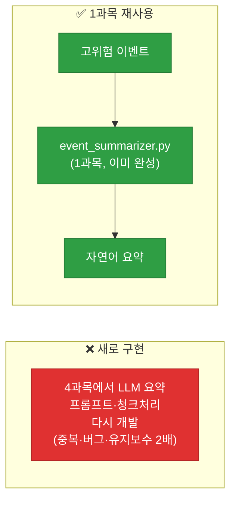
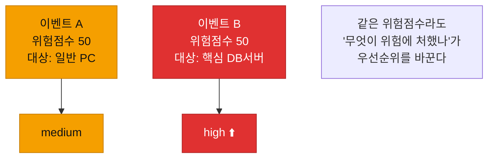
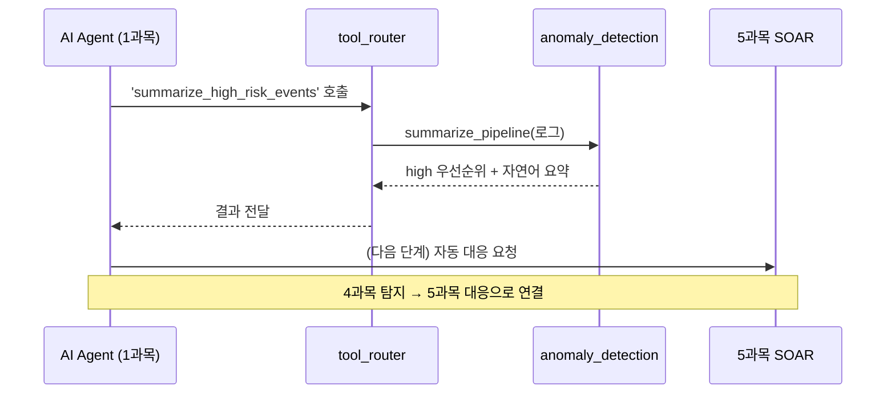

# 강의1 · AI 기반 우선순위 분류와 파이프라인 통합 설계 (오전, 총 120분)

> **이 교시 한 문장:** 1~4일차 조각을 한 파이프라인으로 잇는 큰 그림을 그리고, 탐지 이벤트를 **1과목 LLM 요약**에 연결하며, **위험점수+상관분석+자산중요도**로 high/medium/low 우선순위를 매기는 기준을 설계합니다.

| 시간 | 소주제 | 핵심 한 줄 |
|------|--------|-----------|
| 00-20분 | 1~4일차 종합 지도 | 파이프라인 한 장 |
| 20-50분 | 1과목 LLM 요약 연결 | 새로 안 짜고 재사용 |
| 50-80분 | 우선순위 분류 기준 | 점수+상관+자산중요도 |
| 80-105분 | agent_core 연동 지점 | 도구로 등록 |
| 105-120분 | 정리 | 설계 → 오후 구현 |

## 이 교시에 나오는 어려운 용어

| 용어 (한글발음) | 한 줄 뜻 (아주 쉽게) | 비유 |
|----------------|----------------------|------|
| **파이프라인(pipeline)** | 단계들이 물 흐르듯 이어진 처리 흐름 | 공장 컨베이어 |
| **LLM(엘엘엠)** | 대규모 언어모델(AI 요약·생성) | 똑똑한 요약 비서 |
| **요약(summarization)** | 긴 내용을 짧게 정리 | 핵심만 추리기 |
| **우선순위(priority)** | 무엇을 먼저 볼지 순서 | 응급실 트리아지 |
| **자산 중요도(asset criticality)** | 그 자산이 얼마나 중요한가 | DB서버 > 일반 PC |
| **트리아지(triage)** | 긴급도로 처리 순서 정하기 | 응급 분류 |
| **오케스트레이션(orchestration)** | 단계들을 순서대로 지휘 | 지휘자 |
| **재사용(reuse)** | 만든 것을 다시 씀 | 부품 재활용 |
| **tool_registry(툴 레지스트리)** | 도구 이름↔함수 등록표 | 연장통 목록 |
| **청크(chunk)** | 큰 데이터를 나눈 조각 | 큰 문서를 페이지로 |
| **초동대응(initial response)** | 사건 초기 첫 대응 | 응급 처치 |
| **비용(cost)** | LLM 호출에 드는 돈·시간 | 요약당 요금 |

---

## ⏱️ 00-20분 · 1~4일차 종합 지도

!!! info "📘 학습자 뷰 · 처음 보는 나"
    지난 4일이 하나의 **파이프라인(처리 흐름)** 으로 이어집니다.

    | Day | 만든 것 | 파이프라인 단계 |
    |-----|---------|----------------|
    | Day1 | 정규화 | ① 입력 정리 |
    | Day2 | 분류 + 개별 탐지룰 | ② 신호 감지 |
    | Day3 | 고급 탐지 + 위험점수 + 상관분석 | ③ 종합 판단 |
    | Day4 | 튜닝(정밀도·재현율) | ④ 정확도 개선 |
    | Day5 | **통합 + AI 요약 + 우선순위** | ⑤ 완성·전달 |

    오늘은 이 흐름을 하나로 잇습니다: **로그 → 정규화 → 탐지 → 점수 → 우선순위 → 요약.**

### 🔬 깊이 보기 — 조각들이 한 흐름으로


각 Day가 파이프라인의 한 단계였습니다. 오늘은 이 단계들을 **컨베이어 벨트처럼** 이어, "로그를 넣으면 요약 리포트가 나오는" 자동 흐름을 만듭니다.

!!! example "🎓 강사 뷰 · 1과목 스킬이 가장 많이 재사용됨"
    *"이 4일 동안 1과목(AI·자동화 기초)의 스킬이 계속 쓰였습니다. CSV/JSON 처리(Day1), registry 패턴(Day2), 그리고 오늘 LLM 요약까지. 1과목이 '도구 상자'였다면 4과목은 그 도구로 집을 지은 거예요."*

!!! question "확인질문"
    **Q. 이 4일 중 1과목(AI·자동화 기초)의 어떤 스킬이 가장 많이 재사용되었나요?**

    **A.** 여러 스킬이 재사용됐습니다.

    - **CSV/JSON 처리**: Day1 로그 읽기·정규화 저장에 그대로 쓰였습니다.
    - **registry 패턴(tool_registry)**: Day2 `classifier_registry`, Day3 위험점수의 `detectors`로 반복 등장했습니다.
    - **LLM 요약**: 오늘 high 우선순위 이벤트를 자연어로 요약하는 데 1과목 `event_summarizer.py`를 재사용합니다.

    1과목이 기본 도구 상자였고, 4과목은 그 도구들을 엮어 이상탐지라는 완성품을 만든 셈입니다.

<div class="quiz">
<p class="quiz-q"><span class="tag">퀴즈</span><b>4과목의 각 Day를 '파이프라인 단계'로 보는 관점이 Day5 통합에 도움이 되는 이유는?</b></p>
<button class="quiz-opt">단계가 많을수록 탐지가 정확해져서</button>
<button class="quiz-opt" data-correct>각 Day 산출물이 '입력→출력'으로 이어지는 한 단계임을 알면, 이들을 순서대로 연결해 자동 흐름을 만들 수 있어서</button>
<button class="quiz-opt">파이프라인은 로그를 자동 생성해서</button>
<button class="quiz-opt">단계를 나누면 코드가 사라져서</button>
<div class="quiz-explain"><b>정답: 2번.</b> 정규화→탐지→점수→우선순위→요약이 각각 '앞 단계 출력을 받아 다음으로 넘기는' 구조임을 알면, 오케스트레이션으로 한 흐름에 꿸 수 있습니다.</div>
<button class="quiz-retry">다시 풀기</button>
</div>

---

## ⏱️ 20-50분 · 1과목 LLM 요약 기능과의 연결

!!! info "📘 학습자 뷰 · 처음 보는 나"
    탐지·점수화된 이벤트 목록은 여전히 **기계용 데이터**(숫자·JSON)입니다. 사람이 빠르게 읽으려면 **자연어 요약**이 필요하죠. 이걸 새로 만들지 않고 **1과목의 `event_summarizer.py`를 재사용**합니다.

    > 고위험 이벤트 목록 → `event_summarizer.py`(1과목) → 자연어 요약 + 우선순위

### 🔬 깊이 보기 — 왜 새로 안 짜고 재사용하나



**LLM 요약 로직(프롬프트 설계, 긴 입력의 청크 처리 등)은 1과목에서 이미 만들었습니다.** 4과목에서 다시 짜면 같은 코드가 두 벌 생겨 유지보수가 두 배가 되고, 버그도 따로 관리해야 합니다. 재사용하면 **4과목은 "무엇을 요약할지(고위험 이벤트)"에만 집중**하고, "어떻게 요약할지"는 1과목에 맡깁니다. 3·4과목 내내 반복된 모듈 재사용 원칙입니다.

!!! example "🎓 강사 뷰 · '각자 잘하는 것'"
    *"4과목은 '무엇이 위험한지 찾기'를 잘하고, 1과목은 'AI로 요약하기'를 잘합니다. 각자 잘하는 걸 만들어 두고 연결하면, 서로의 강점을 공짜로 씁니다. 이게 모듈로 나눠 만드는 진짜 이유예요."*

!!! question "확인질문"
    **Q. 이상탐지 모듈이 직접 LLM 요약 코드를 새로 짜지 않고 1과목 모듈을 재사용하는 것이 왜 효율적일까요?**

    **A.** **같은 기능을 두 번 만들지 않아, 개발·유지보수 비용과 버그 위험이 줄기 때문**입니다.

    LLM 요약에 필요한 프롬프트 설계, 긴 입력의 청크 처리 같은 로직은 1과목에서 이미 완성했습니다. 4과목에서 이를 다시 구현하면 똑같은 코드가 두 벌 생겨 고칠 때마다 양쪽을 손봐야 하고 버그도 두 곳에서 관리해야 합니다. 1과목 `event_summarizer.py`를 재사용하면 4과목은 "무엇을 요약할지"(고위험 이벤트 선별)에만 집중하고 "어떻게 요약할지"는 검증된 1과목 모듈에 맡길 수 있어 효율적입니다.

<div class="quiz">
<p class="quiz-q"><span class="tag">퀴즈</span><b>4과목이 LLM 요약을 1과목 <code>event_summarizer.py</code> 재사용으로 처리하는 설계가 보여주는 원칙은?</b></p>
<button class="quiz-opt">모든 기능은 각 과목마다 새로 구현해야 한다</button>
<button class="quiz-opt" data-correct>각 모듈이 잘하는 것을 만들어 두고 연결하면, 중복 없이 서로의 강점을 재사용할 수 있다</button>
<button class="quiz-opt">LLM은 4과목에서만 쓸 수 있다</button>
<button class="quiz-opt">재사용하면 요약 품질이 나빠진다</button>
<div class="quiz-explain"><b>정답: 2번.</b> 4과목은 '위험 찾기', 1과목은 'AI 요약'을 각각 담당하고 연결합니다. 관심사를 나눠 각 모듈의 강점을 재사용하는 것이 모듈화의 핵심 이득입니다.</div>
<button class="quiz-retry">다시 풀기</button>
</div>

---

## ⏱️ 50-80분 · 우선순위 분류 기준 최종 설계

!!! abstract "이 블록을 마치면"
    ✔ 우선순위를 ==위험점수 + 상관분석 + 자산중요도==로 정하는 기준을 안다

!!! info "📘 학습자 뷰 · 처음 보는 나"
    모든 이벤트를 똑같이 다룰 순 없습니다. **무엇을 먼저 볼지(우선순위)** 를 정해야 하죠. 세 요소를 종합합니다.

    > 우선순위 = f(위험점수, 상관분석 매칭 여부, 자산 중요도)
    > 예: 위험점수 70점 이상 **OR** 상관분석 매칭 → **high**

    - **위험점수(Day3):** 얼마나 위험한 신호인가
    - **상관분석 매칭(Day3):** 킬체인처럼 이어졌나
    - **자산 중요도:** 대상이 얼마나 중요한가(DB서버 vs 일반 PC)

### 🔬 깊이 보기 — 왜 자산 중요도가 우선순위를 바꾸나



**같은 위험점수 50점이라도** 대상이 다르면 우선순위가 달라집니다. 일반 PC가 위험한 것과 **핵심 고객 DB서버**가 위험한 것은 파급이 완전히 다르죠. 응급실 트리아지처럼, "얼마나 위험한 신호인가"뿐 아니라 **"무엇이 위험에 처했나"** 를 함께 봐야 합니다. 자산 중요도는 3과목 우선순위 리포트의 연장이자, 5과목 대응 순서의 근거가 됩니다.

!!! example "🎓 강사 뷰 · 응급실 비유"
    *"응급실은 온 순서가 아니라 위급도로 봅니다(트리아지). 보안도 같아요. 탐지된 순서가 아니라 '위험도 × 중요 자산'으로 먼저 볼 걸 정합니다. 담당자는 시간이 한정돼 있으니, 우선순위가 곧 생존 전략입니다."*

!!! question "확인질문"
    **Q. 자산 중요도를 우선순위 계산에 포함시켜야 하는 이유는 무엇일까요?**

    **A.** **같은 위험도라도 어떤 자산이 위협받느냐에 따라 파급이 크게 다르기 때문**입니다.

    위험점수가 같은 두 이벤트라도, 하나는 일반 PC를 노리고 다른 하나는 핵심 고객 DB서버를 노린다면 후자의 잠재적 피해가 훨씬 큽니다. 담당자의 시간은 한정돼 있으므로, "신호가 얼마나 위험한가"만이 아니라 "무엇이 위험에 처했는가"까지 반영해야 정말 중요한 것을 먼저 처리할 수 있습니다. 응급실 트리아지처럼 위험도와 대상의 중요도를 함께 보는 것입니다.

<div class="quiz">
<p class="quiz-q"><span class="tag">퀴즈</span><b>우선순위를 '위험점수'만이 아니라 '자산 중요도'까지 넣어 계산하는 이유로 가장 적절한 것은?</b></p>
<button class="quiz-opt">자산 중요도가 있으면 위험점수를 계산 안 해도 되어서</button>
<button class="quiz-opt" data-correct>같은 위험점수라도 핵심 DB서버가 위협받는 것과 일반 PC가 위협받는 것은 파급이 달라, 무엇이 위험에 처했는지도 봐야 하기 때문</button>
<button class="quiz-opt">자산 중요도가 로그를 정규화해서</button>
<button class="quiz-opt">중요도가 높으면 자동으로 차단되어서</button>
<div class="quiz-explain"><b>정답: 2번.</b> 위험도(신호)와 자산 중요도(대상)를 함께 봐야 트리아지가 맞습니다. 한정된 담당자 시간을 정말 중요한 곳에 쓰게 하는 기준입니다.</div>
<button class="quiz-retry">다시 풀기</button>
</div>

---

## ⏱️ 80-105분 · agent_core 연동 지점 확인

!!! info "📘 학습자 뷰 · 처음 보는 나"
    이상탐지의 핵심 함수를 **1과목 AI Agent가 부를 수 있게** 등록합니다. 3과목 Day5와 똑같은 방식이죠.

    ```python
    tool_registry['classify_and_score']         = anomaly_detection.classify_and_score
    tool_registry['summarize_high_risk_events'] = anomaly_detection.summarize_pipeline
    ```

    등록하면 AI Agent가 "이벤트를 분류·점수화해줘" 또는 "고위험 이벤트를 요약해줘"를 **도구로 호출**합니다.

### 🔬 깊이 보기 — 캡스톤 '초동대응봇'의 뇌와 손



이렇게 등록하면 AI Agent가 **이상탐지를 '도구'로 부려** 고위험 이벤트를 요약받습니다. 그리고 그 결과를 **5과목 SOAR로 넘겨 자동 대응**으로 잇죠. 4과목이 "무엇이 위험한지 판단(탐지)"이라면, 5과목은 "그럼 어떻게 막을지(대응)"입니다. 오늘 만든 게 그 사이의 **다리**입니다.

!!! question "확인질문"
    **Q. 이렇게 등록해두면 최종 캡스톤에서 'AI 보안 이벤트 분류·초동대응봇'이 이 기능을 어떻게 활용하게 될까요?**

    **A.** **AI Agent가 이상탐지 함수를 '도구'로 호출해 탐지·요약 결과를 받고, 그것을 초동대응의 근거로 씁니다.**

    `tool_registry`에 등록된 `classify_and_score`·`summarize_high_risk_events`를 통해, AI Agent는 로그를 넣어 "분류·위험점수·우선순위·자연어 요약"을 한 번에 받습니다. 그러면 봇은 고위험 이벤트를 사람이 읽기 좋은 요약으로 제시하고, 이어서 5과목 SOAR의 자동 대응(차단·격리 등)으로 넘겨 초동대응을 수행합니다. 즉 오늘 등록한 함수가 탐지(4과목)와 대응(5과목)을 잇는 봇의 핵심 기능이 됩니다.

<div class="quiz">
<p class="quiz-q"><span class="tag">퀴즈</span><b>이상탐지 핵심 함수를 <code>tool_registry</code>에 등록하는 것이 4과목과 5과목(SOAR)을 잇는 데 중요한 이유는?</b></p>
<button class="quiz-opt">등록하면 탐지가 자동으로 정확해져서</button>
<button class="quiz-opt" data-correct>AI Agent가 탐지·요약을 도구로 호출해 결과를 받고, 그 결과를 5과목 자동 대응의 입력으로 넘길 수 있어서</button>
<button class="quiz-opt">tool_registry가 로그를 저장해서</button>
<button class="quiz-opt">등록하면 우선순위가 필요 없어져서</button>
<div class="quiz-explain"><b>정답: 2번.</b> 4과목(탐지)은 "무엇이 위험한가"를, 5과목(SOAR)은 "어떻게 막을까"를 담당합니다. tool_registry 등록이 탐지 결과를 Agent를 거쳐 대응으로 넘기는 연결 고리입니다.</div>
<button class="quiz-retry">다시 풀기</button>
</div>

!!! tip "🧠 파인만 자가진단"
    안 보고 말할 수 있으면 통과입니다.

    1. 4과목 각 Day를 파이프라인 단계로 설명하기
    2. LLM 요약을 1과목에서 재사용하는 이유
    3. 우선순위 3요소와 자산 중요도를 넣는 이유
    4. tool_registry 등록이 4→5과목을 잇는 방식

---

## ⏱️ 105-120분 · 정리

**오전 정리:**

1. 1~4일차가 **하나의 파이프라인**(정규화→탐지→점수→우선순위→요약)
2. LLM 요약은 **1과목 재사용** — "무엇을 요약할지"에만 집중
3. **우선순위 = 위험점수 + 상관분석 + 자산중요도**(트리아지)
4. 핵심 함수를 **tool_registry 등록** → AI Agent 도구 → 5과목 SOAR로 연결

오후에는 이 설계를 `pipeline.py`로 구현하고, high 요약·코드 리뷰·디버깅까지 마칩니다.

---

## ✅ 가르칠 준비 체크리스트 (강의1)

- [ ] 1~4일차를 파이프라인 단계로 정리한다
- [ ] LLM 요약의 1과목 재사용 이유를 설명한다
- [ ] 우선순위 3요소를 설명한다
- [ ] 자산 중요도를 넣는 이유(트리아지)를 설명한다
- [ ] tool_registry 등록과 4→5과목 연결을 설명한다
- [ ] 확인질문 4개 + 퀴즈에 답한다

*[pipeline]: 파이프라인 — 단계들이 이어진 자동 처리 흐름
*[asset criticality]: 자산 중요도 — 자산의 중요성(우선순위 요소)
*[triage]: 트리아지 — 긴급도로 처리 순서를 정하는 것
