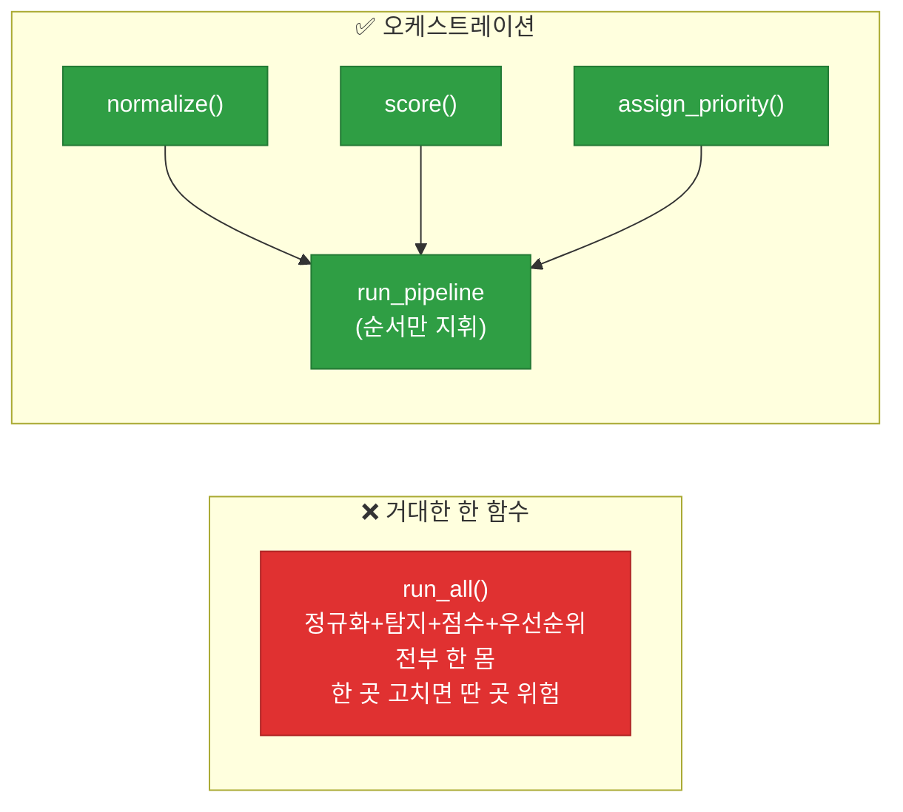
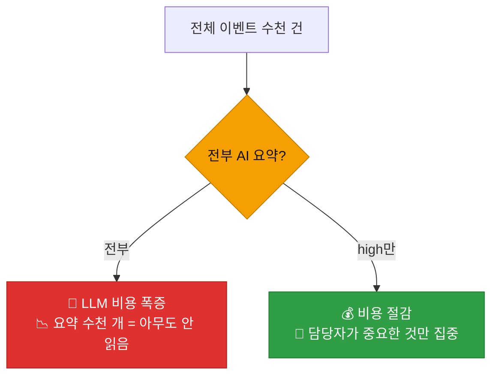
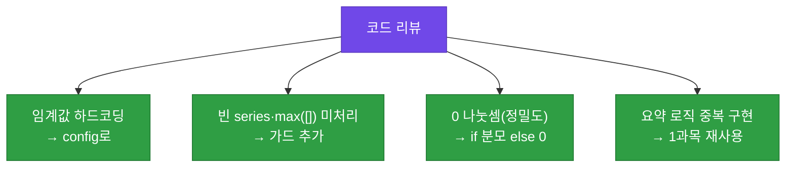
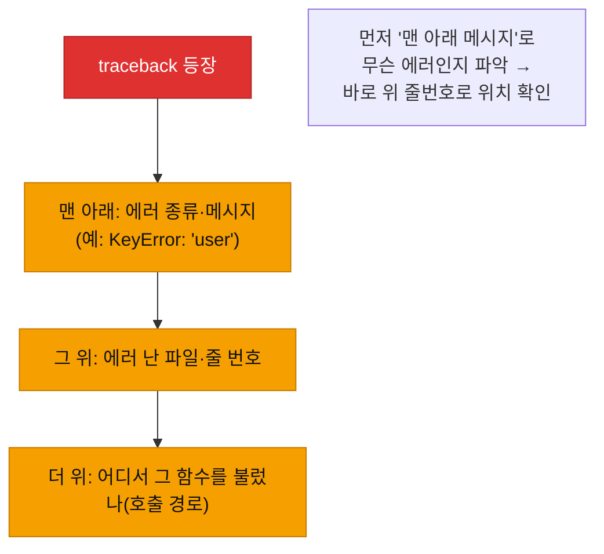

# 강의2 · 전체 파이프라인 통합 구현과 발표 준비 (오후, 총 120분)

> **이 교시 한 문장:** 1~4일차 모듈을 모두 import하는 `run_anomaly_pipeline()`을 오케스트레이션하고, high 우선순위만 골라 AI로 요약해 리포트로 저장하며, 코드 리뷰·디버깅으로 마무리합니다.

| 시간 | 소주제 | 핵심 한 줄 |
|------|--------|-----------|
| 00-25분 | pipeline 오케스트레이션 | 모듈을 순서대로 지휘 |
| 25-55분 | high 우선순위만 AI 요약 | 비용·집중도 |
| 55-80분 | 코드 리뷰 체크리스트 | 4과목 원칙 자기점검 |
| 80-105분 | 디버깅 실습 — 오류 주입 | traceback 읽기 |
| 105-120분 | 발표 준비 안내 | 파이프라인 시연 |

## 이 교시에 나오는 어려운 용어

| 용어 (한글발음) | 한 줄 뜻 (아주 쉽게) | 비유 |
|----------------|----------------------|------|
| **오케스트레이션(orchestration)** | 단계들을 순서대로 지휘 | 지휘자 |
| **`import`** | 다른 파일 함수를 가져옴 | 옆 부서 호출 |
| **관심사 분리(separation of concerns)** | 파일마다 한 가지 일만 | 부서별 분담 |
| **필터링(filtering)** | 조건에 맞는 것만 고름 | 체로 거르기 |
| **비용(cost)** | LLM 호출 요금·시간 | 요약당 요금 |
| **코드 리뷰(code review)** | 코드 문제를 점검 | 원고 교정 |
| **traceback(트레이스백)** | 에러가 난 경로 기록 | 사고 경위서 |
| **예외처리(exception handling)** | 에러를 잡아 대응 | 안전장치 |
| **로깅(logging)** | 무슨 일이 있었는지 기록 | 작업 일지 |
| **디버깅(debugging)** | 버그를 찾아 고침 | 고장 수리 |
| **회귀(regression)** | 고치다 딴 걸 망가뜨림 | 풍선효과 |
| **재현(reproduce)** | 문제를 다시 일으켜 봄 | 증상 재연 |

---

## ⏱️ 00-25분 · `pipeline.py` 오케스트레이션 작성

!!! info "📘 학습자 뷰 · 처음 보는 나"
    새 파일 `pipeline.py`가 1~4일차 모듈을 모두 불러와 **순서대로 지휘**합니다.

### 💻 코드 완전 해부 — `run_anomaly_pipeline()`

```python
def run_anomaly_pipeline(config_path):
    config = load_config(config_path)                              # ①
    events = normalize_all(config['log_paths'])                    # ② Day1
    scored = [calculate_risk_score(e, detectors, weights)          # ③ Day3
              for e in events]
    prioritized = assign_priority(scored)                          # ④ 오늘
    return prioritized                                            # ⑤
```

| 줄 | 하는 일 | 왜 |
|:--:|---------|-----|
| **①** | 설정(로그 경로·임계값 등) 로드 | config로 유연하게 |
| **②** | 정규화(Day1) 실행 | 입력 정리 |
| **③** | 각 이벤트에 위험점수(Day3) | 신호 종합 |
| **④** | 우선순위 부여(오늘) | high/medium/low |
| **⑤** | 우선순위별 결과 반환 | 리포트·요약으로 |

`run_anomaly_pipeline()`은 스스로 판단하지 않고 **각 단계 함수를 순서대로 부르는 지휘자**입니다. 3과목 `run_revocation_bot`·`weekly_report`와 같은 오케스트레이션이죠.

### 🔬 깊이 보기 — 왜 거대한 한 함수보다 나은가



각 단계를 **독립 함수**로 두면: 정규화 문제는 정규화 함수만 보면 되고(**격리**), 각 단계를 **따로 테스트**할 수 있고, 순서를 바꾸거나 단계를 끼워넣기 **쉽습니다**. 거대한 한 함수는 어디가 문제인지 찾기 어렵고, 한 곳 고치다 다른 곳이 깨집니다(회귀). 3과목 Day5의 관심사 분리와 똑같은 교훈입니다.

!!! question "확인질문"
    **Q. 각 단계를 독립 함수로 유지하며 오케스트레이션 함수에서 순서대로 호출하는 방식이, 왜 하나의 거대한 함수보다 나을까요?**

    **A.** **각 단계를 따로 격리·테스트·수정할 수 있어 유지보수가 쉽기 때문**입니다.

    정규화·점수·우선순위를 독립 함수로 두면, 정규화에 문제가 생겼을 때 그 함수만 보면 되고 각 단계를 따로 테스트할 수 있습니다. 순서를 바꾸거나 새 단계를 끼워넣기도 쉽습니다. 반면 거대한 한 함수는 모든 로직이 뒤엉켜 있어 어디가 문제인지 찾기 어렵고, 한 부분을 고치다 다른 부분이 깨지는 회귀가 발생하기 쉽습니다. 오케스트레이션 함수는 '순서만 지휘'하고 실제 일은 각 전문 함수가 맡는 구조가 명확하고 안전합니다.

<div class="quiz">
<p class="quiz-q"><span class="tag">퀴즈</span><b><code>run_anomaly_pipeline()</code>이 각 단계 함수를 순서대로 호출만 하고 실제 로직은 각 모듈에 두는 구조의 이점은?</b></p>
<button class="quiz-opt">함수 호출이 많으면 항상 빨라져서</button>
<button class="quiz-opt" data-correct>각 단계를 격리해 따로 테스트·수정할 수 있고, 단계 추가·순서 변경이 쉬워 유지보수에 유리해서</button>
<button class="quiz-opt">한 함수로 합쳐야 코드가 짧아져서</button>
<button class="quiz-opt">오케스트레이션은 로그가 필요 없어서</button>
<div class="quiz-explain"><b>정답: 2번.</b> 관심사 분리 + 오케스트레이션입니다. 각 단계는 독립적으로 테스트·수정 가능하고, 지휘 함수는 순서만 관리해 전체가 명확합니다. 3과목 Day5와 같은 원칙입니다.</div>
<button class="quiz-retry">다시 풀기</button>
</div>

---

## ⏱️ 25-55분 · high 우선순위 이벤트만 AI 요약

!!! info "📘 학습자 뷰 · 처음 보는 나"
    모든 이벤트를 AI로 요약하지 않습니다. **high로 분류된 것만** 요약합니다.

### 💻 코드 — high만 골라 요약

```python
high_events = [e for e in prioritized if e['priority'] == 'high']  # ①
summary = summarize_events(high_events)   # 1과목 event_summarizer 재사용  # ②
save_report(summary, f'anomaly_detection_report_{today}.md')       # ③
```

- ① high 우선순위만 **필터링**
- ② 1과목 LLM 요약 재사용
- ③ 날짜별 리포트 저장

### 🔬 깊이 보기 — 왜 high만 요약하나 (비용 + 집중도)



두 가지 이유입니다. **(1) 비용:** LLM 호출은 건당 돈·시간이 듭니다. 수천 건을 다 요약하면 비용이 폭증하죠. **(2) 집중도:** 요약이 수천 개면 그것도 결국 안 읽힙니다(경보 피로의 재현). high만 요약하면 **담당자가 정말 중요한 소수에 집중**합니다. Day1의 피라미드("소수의 알림만 위로")가 여기서도 관통합니다.

!!! example "🎓 강사 뷰 · 피라미드 회수"
    *"Day1의 로그→이벤트→알림 피라미드 기억나죠? 오늘 high만 요약하는 게 그 꼭대기입니다. 수만 로그 → 수천 이벤트 → 수십 high → 자연어 요약. 이 좁혀오기가 4과목 전체의 완성이에요."*

!!! question "확인질문"
    **Q. 모든 이벤트가 아니라 high 우선순위 이벤트만 요약하는 이유는 무엇일까요?**

    **A.** **LLM 비용을 아끼고, 담당자가 중요한 소수에 집중하게 하기 위해서**입니다.

    LLM 요약은 호출마다 비용과 시간이 들어, 수천 건을 모두 요약하면 비용이 크게 늘어납니다. 게다가 요약이 수천 개면 그것 역시 너무 많아 아무도 다 읽지 못해 경보 피로가 재현됩니다. high 우선순위만 요약하면 비용을 절감하면서, 담당자가 정말 시급한 소수의 이벤트에 시간을 집중할 수 있습니다. 로그를 소수의 중요한 알림으로 좁혀 올리는 Day1 피라미드의 마지막 단계입니다.

<div class="quiz">
<p class="quiz-q"><span class="tag">퀴즈</span><b>파이프라인에서 high 우선순위 이벤트만 골라 AI 요약하는 설계의 두 가지 이유는?</b></p>
<button class="quiz-opt">high 이벤트만 로그에 남아서 / 나머지는 삭제되어서</button>
<button class="quiz-opt" data-correct>LLM 호출 비용 절감 / 담당자가 중요한 소수에 집중(요약 과다 방지)</button>
<button class="quiz-opt">high만 정규화가 되어서 / medium은 계산 불가라서</button>
<button class="quiz-opt">비용과 무관하며 / 단지 코드가 짧아서</button>
<div class="quiz-explain"><b>정답: 2번.</b> 비용(LLM은 건당 요금)과 집중도(요약이 수천 개면 안 읽힘) 둘 다입니다. Day1 피라미드처럼 소수의 중요한 것만 위로 올리는 원칙의 완성입니다.</div>
<button class="quiz-retry">다시 풀기</button>
</div>

---

## ⏱️ 55-80분 · 코드 리뷰 체크리스트

!!! info "📘 학습자 뷰 · 처음 보는 나"
    4과목 코드 전체를 **네 기준**으로 되돌아봅니다(3과목과 같은 항목).

    | 리뷰 항목 | 확인 질문 | 4과목에서 |
    |-----------|-----------|-----------|
    | **config 하드코딩** | 임계값·IOC를 코드에 박았나? | detection_thresholds·threat_intel |
    | **예외처리 누락** | 빈 데이터·0 나눗셈에 안전한가? | max([])·tp+fp=0 |
    | **로깅 일관성** | 탐지·튜닝이 기록되나? | 탐지 결과 로그 |
    | **함수 재사용성** | 중복 없이 registry·모듈 재사용? | classifier_registry·1과목 요약 |

### 🔬 깊이 보기 — 리뷰가 잡는 4과목 특유의 결함



이 네 항목은 4과목 내내 반복 강조된 원칙입니다. 리뷰는 "새 지식"이 아니라 "배운 걸 내 코드에 적용했나"의 자기 점검입니다. 특히 4과목은 **빈 데이터·0 나눗셈**(pandas·통계 특성) 이슈가 많으니 예외처리를 중점적으로 봅니다.

!!! question "확인질문"
    **Q. 코드 리뷰 체크리스트 중 스스로 가장 취약하다고 생각하는 항목은 무엇인가요? (자기 성찰)**

    **A.** (정답이 정해진 질문이 아니라 자기 점검용입니다.)

    예시 답변: "예외처리 누락이 가장 취약합니다. 4과목은 pandas 빈 series나 `max([])`, 정밀도 계산의 0 나눗셈처럼 '데이터가 비었을 때' 터지는 경우가 많은데, 정상 데이터로만 테스트하다 이런 경계를 놓치곤 했습니다. 그래서 함수마다 '입력이 비면?'을 먼저 자문하고 가드를 넣는 습관을 들이려 합니다." — 이렇게 구체적 약점과 개선 방향을 말하면 좋습니다.

<div class="quiz">
<p class="quiz-q"><span class="tag">퀴즈</span><b>4과목 코드 리뷰에서 특히 '예외처리'를 중점적으로 봐야 하는 이유는?</b></p>
<button class="quiz-opt">4과목은 예외처리가 필요 없어서</button>
<button class="quiz-opt" data-correct>pandas 빈 데이터·max([])·0 나눗셈처럼 '데이터가 비었을 때' 터지는 경계 상황이 많은 과목이라서</button>
<button class="quiz-opt">예외처리를 하면 탐지가 정확해져서</button>
<button class="quiz-opt">리뷰 항목이 하나뿐이라서</button>
<div class="quiz-explain"><b>정답: 2번.</b> 4과목은 통계·pandas 특성상 빈 시퀀스, 0 나눗셈 같은 경계 오류가 잦습니다. 정상 데이터로만 테스트하면 놓치기 쉬워, 예외처리를 특히 점검합니다.</div>
<button class="quiz-retry">다시 풀기</button>
</div>

---

## ⏱️ 80-105분 · 디버깅 실습 — 의도적 오류 주입

!!! info "📘 학습자 뷰 · 처음 보는 나"
    강사가 준비한 **'고장난 pipeline.py'** 를 직접 고쳐 봅니다. 에러가 나면 **traceback(에러 경로 기록)** 을 읽는 법이 핵심입니다.

### 🔬 깊이 보기 — traceback은 '아래에서 위로' 읽는다



traceback을 볼 때 **맨 아래 줄(에러 종류·메시지)을 먼저** 봅니다. "무슨 에러인지"가 거기 있으니까요(예: `KeyError: 'user'` = 'user' 키가 없음). 그 바로 위가 **에러 난 파일·줄 번호**입니다. 초보자는 긴 traceback에 압도되는데, **아래→위 순서**로 읽으면 원인 위치가 빠르게 보입니다. 예외처리·로깅이 잘 돼 있으면 이 추적이 훨씬 쉽습니다.

!!! example "🎓 강사 뷰 · 디버깅은 겁먹지 않기"
    *"긴 빨간 글씨(traceback)에 학생들이 겁먹습니다. '맨 아래부터 읽어라, 거기 답이 있다'고 알려주세요. 에러 메시지는 적이 아니라 **가장 친절한 힌트**입니다."*

!!! question "확인질문"
    **Q. 에러 메시지(traceback)를 읽을 때 가장 먼저 확인해야 할 정보는 무엇일까요?**

    **A.** **맨 아래 줄의 에러 종류와 메시지** 입니다.

    traceback은 위에서 아래로 호출 경로를 보여주고, 맨 아래에 실제 에러 종류와 메시지가 나옵니다(예: `KeyError: 'user'`). 이 마지막 줄이 "무엇이 잘못됐는지"를 가장 직접적으로 알려주므로 먼저 읽어야 합니다. 그다음 그 바로 위의 파일 이름과 줄 번호를 보면 에러가 난 정확한 위치를 알 수 있습니다. 길다고 압도되지 말고 아래에서 위로 읽는 것이 요령입니다.

<div class="quiz">
<p class="quiz-q"><span class="tag">퀴즈</span><b>파이썬 traceback을 효율적으로 읽는 순서로 가장 적절한 것은?</b></p>
<button class="quiz-opt">맨 위부터 순서대로 전부 읽는다</button>
<button class="quiz-opt" data-correct>맨 아래의 에러 종류·메시지를 먼저 보고, 그 바로 위의 파일·줄 번호로 위치를 확인한다</button>
<button class="quiz-opt">traceback은 읽지 말고 코드를 처음부터 다시 짠다</button>
<button class="quiz-opt">중간 줄만 골라 읽는다</button>
<div class="quiz-explain"><b>정답: 2번.</b> 에러의 핵심(종류·메시지)은 맨 아래에 있습니다. 거기서 "무슨 에러"인지 파악하고 바로 위 줄번호로 위치를 찾으면 빠릅니다. 예외처리·로깅이 좋을수록 이 추적이 쉬워집니다.</div>
<button class="quiz-retry">다시 풀기</button>
</div>

!!! tip "🧠 파인만 자가진단"
    안 보고 말할 수 있으면 통과입니다.

    1. 오케스트레이션이 거대 함수보다 나은 이유
    2. high만 요약하는 두 이유(비용·집중도)
    3. 4과목에서 예외처리를 특히 봐야 하는 이유
    4. traceback을 아래→위로 읽는 요령

---

## ⏱️ 105-120분 · 발표 준비 안내

**오후 정리:**

1. `run_anomaly_pipeline()` — 모듈을 **순서대로 지휘**(오케스트레이션, 관심사 분리)
2. **high만 AI 요약**(1과목 재사용) — 비용·집중도(피라미드 완성)
3. **코드 리뷰 4항목** — 특히 4과목은 **예외처리(빈 데이터·0 나눗셈)** 중점
4. **디버깅** — traceback은 **아래→위**로

!!! note "실습·발표 예고 (오후 실습 120분)"
    `pipeline.py`로 1~4일차 모듈을 통합하고, high 요약 리포트를 저장하며, `tool_router`에 등록해 연동을 확인한 뒤, 5분 발표(파이프라인 구조도 + 데모)를 준비합니다. 상세는 [실습 페이지](practice.md).

!!! success "🎉 4과목 5일 완주"
    정규화(Day1) → 분류·탐지(Day2) → 고급탐지·상관분석(Day3) → 튜닝(Day4) → 통합·AI요약(Day5).
    "수만 로그 → 소수의 high 요약"으로 좁히는 완성형 파이프라인이 만들어졌고, 1과목 AI Agent의 도구가 되어 **5과목 SOAR(자동 대응)** 로 이어집니다.
    **이 파이프라인이 캡스톤 'AI 이벤트 분류·초동대응봇'의 핵심입니다.**

---

## ✅ 가르칠 준비 체크리스트 (강의2)

- [ ] 오케스트레이션 vs 거대 함수를 설명한다
- [ ] high만 요약하는 두 이유를 설명한다
- [ ] 코드 리뷰 4항목, 특히 예외처리를 강조한다
- [ ] traceback을 아래→위로 읽는 법을 시연한다
- [ ] 4→5과목(SOAR) 연결로 마무리한다
- [ ] 확인질문 4개 + 퀴즈에 답한다

*[orchestration]: 오케스트레이션 — 단계들을 순서대로 지휘
*[traceback]: 트레이스백 — 에러가 발생한 호출 경로 기록
*[triage]: 트리아지 — 우선순위로 처리 순서 정하기
